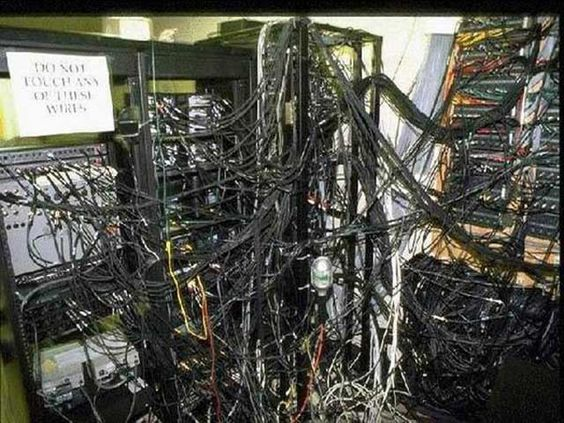
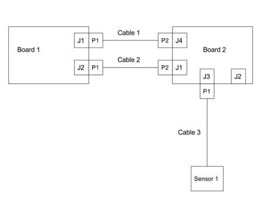
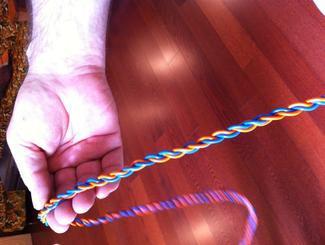

Effective cable management is essential for servicing, debugging and creating reliable robotic systems. Cabling is often regarded as one of the less glamorous parts of electrical engineering, but it is an essential and an extremely important part of creating a complete system.

This page highlights the important steps for cable management including **Planning, Cable Creation and Installation.** If you decide to only read one part of this page, read the **Planning** section. This is the most important part of cable management that is often skipped. It's hard to skip the other two steps.

To illustrate its importance imagine the following scenario:

You are at the final integration steps of your project and something isn't working. You start by checking out the hardware and see Figure 1.

**Figure 1: Cable management gone wrong**

You spend all night figuring out what wires go where and eventually find that one of your subsystems was unplugged. Unfortunately, that was all of the time you had allocated to working on the project. This simple problem could have been solved in minutes with proper cable management

## Planning

### Understanding the Electronics Used in Your System
The first step to planning is to understand how all of your hardware connects in your system. One way to do this effectively is to create a wiring block diagram. The main purpose of this diagram is to understand all of the interfaces on your electronics and how they connect to different subsystems. Don't worry about the details of the signals of the wires just yet. Just try and get a high level picture of your system. Figure 2 shows a typical wiring block diagram. Notice how much of the detail is left out and cables are simply represented by one line. This abstraction is meant to highlight the main purpose of representing system connectivity. This diagram can also be used later as a guide for someone who is less familiar with the electrical system.

If this is your first time creating a wiring diagram for your system you will probably already notice problems with your system outside of cabling! For example, you might notice that you have 5 auxiliary devices that you plan to connect to your main computer, but it only supports 3. These are huge benefits that only come from effective planning. You may also find that some of the connections in your system are undefined. That's okay! Define them if possible and if not, make sure that you have a plan for when they do become defined.

Note: in systems engineering you will be required to create a cyberphysical architecture for your system. This diagram may be similar, but they are still fundamentally different. Notice how here we are explicitly differentiating cables, and boards. We get more information from a cable management perspective this way. For example notice how, in **Figure 2**, cable 3 only has one plug. This tells us that Sensor 1 has an unremovable cable attached to it.

**Figure 2: Example wiring block diagram of 2 circuit card assembly boards and 1 sensor connected by three cables. Here the JX labels stand for the jacks on the different circuit boards and the PX stand for the plugs of the cables.**

### Understanding the Connections Used in Your System
Now that you have outlined all of the different boards and connections it is time to go one level deeper and start defining each cable. If you are using mostly commercial off-the-shelf (COTS) boards and sensors it is possible that these cables are already defined. If that is the case simply make sure that you understand all of the wiring and signals from each board.

If you are defining your own connections it is time to make some cable wiring diagrams. You can imagine these diagrams as a zoomed in detailed picture of each of the cables in your wiring block diagram. Figure 3 shows an example cable wiring diagram. It is not necessary to get as detailed as Figure 3. In fact, I've used excel to create very effective wiring diagrams before. The most important objective of these diagrams is to understand the signals and wires on each cable. One more crucial detail highlighted in these diagrams is the length of each cable. Make sure you have a rough idea of how long each cable will be, keyword: rough. You may not be able to determine the exact length of your cable, but going through this exercise will make you start thinking about cable routing. At this step it is necessary to sit down with the mechanical designer of your system and discuss how your cables are physically getting from A to B.

**Figure 3: Example Cable wiring diagram for a USB cable**

### Final Notes on Planning
While this is the most important step of cable management, it is also necessary to mention that there is a balance between planning and pragmatism. I guarantee that you will not have time to make detailed diagrams like Figure 3 or even diagrams for every cable that you will be using in your system. Instead, balance planning with common sense. Don't make diagrams for USB cables, or other cables that are already formally defined. At the bare minimum, create a wiring block diagram and basic excel cabling diagram for the custom cables in you system.

## Cable Creation
After following through with the planning method defined above you should know all of the cables in your system: what subsystems they go to, what signals they carry, and roughly how they will be routed. Next, it is time to explicitly define the components used in your cables as well as the wires used. This step can be seen as an extension to planning and some of it will be implicitly done when you are creating cable wiring diagrams However, there is enough detail to for cable creation to have an entire section.

## Wiring
### Color Coding
An essential part of making cables is making sure that the wire colors are easily identifiable as certain signals. This will make checking signals and power connections easy. You can use any color code that you want, but a color code for common signals that is given in **Table 1.**

Signal | 	Color
----|------
24V | Red
12V | Green
5V  | Brown
RX  | Orange
TX  | Blue
GND | Black
**Table 1: Example table of wiring colors**

### Choosing a Wire Gauge
In addition to color coding, it is essential that the correct wire gauge be used so that your wires don't melt. I usually follow the American Wire Gauge Chart [here](http://www.powerstream.com/Wire_Size.htm)

However, it is important to keep in mind that these numbers are a ballpark estimate when considering the use case for your project.

### Wire Length
By now it is probably apparent that your initial estimates of cable length were off. If you haven't done this yet, now is the time to do a mock cable routing with the wires you have chosen to figure out the exact cable length to use. Cut to length, measure and update your cabling diagram to reflect the correct length

### Connector Selection
When picking connectors it is essential to consider the signals that the cables as well the role that the cable will be playing in the system. Some good questions to ask are:

> How often will I need to unplug and plug this cable?
>
> How much current can this connector carry?
>
> Are these connectors already available to me in the lab?
>
> What crimps and crimper correspond to my chosen connector?

Depending on the answer you may choose a certain connector series or you may decide to directly solder to the circuit board if you don't foresee yourself unplugging the cable very often (be careful with this decision). For convenience, pack a connector that is commonly available in the lab and sticking to it for all of the cabling during the project.

### A Note on Modularity
A very underrated topic in connector selection is modularity and cable re-usability. This is the reason why USB, and RJ45 cables are so great to use. They are symmetrical and easily swappable. This idea can be extended to any cables that you build. There are times where it may make sense to use over-sized connectors (more pins than wires) to allow for easy cable replacements with other similar but different cables.

#### Crimping
If you do decide to use connectors that require crimps it is important that you know what crimps to use and that they are compatible with some crimper in the lab. Crimps come in all shapes and sizes so for a guide on crimping see your manufacturer's web page.

## Cable Assembly
### Grouping Wires
Once you know what connector, wires, and crimps to use it is time to assemble the cable. For the most part this is straightforward, but there are some tricks that will make cable management later on easier. First, if you have any twisted pairs in your cable or want to group wires together without additional hardware, you can use the drill trick to make nice looking cables like **Figure 4**. A video of the Twisted Pair Drill Trick can be viewed [here](https://www.youtube.com/watch?v=uTJhrTTl-EE)

**Figure 4: Twisted wires done using a drill**

Another way to group wires together is to simply use heatshrink tubing ever 6-12 inches in your cable. Finally, If you have expando sleeves available this is another option for grouping.

### Labeling
By this point you should know how to create a cable so that it is electrically sound for installation. However, there is still one important step left. You should always label your cable, at the bare minimum with the cable name and preferably also with the designators that you outline in your wiring block diagram.

### Installation
The final step is installing the cables into your system. This step is extremely easy if you were diligent with the previous two steps. If you weren't, then you may find yourself having to recreate cables or rewire some parts.

If you have a lot of cables in your system, and even if you did a good job at grouping the wires in each cable you may still find yourself with messy cabling. Zip-ties are your friend here. Once you have routed all of the cables in your system, zip-tie the ones that are routed along the same path together.

### References
1. https://s-media-cache-ak0.pinimg.com/564x/b2/db/43/b2db4385f4faa3fdb542d2d277a3278a.jpg
2. https://www.usb3.com/images/567861.jpg
3. http://inlowsound.weebly.com/uploads/1/9/8/5/1985965/5192126_orig.jpgE
