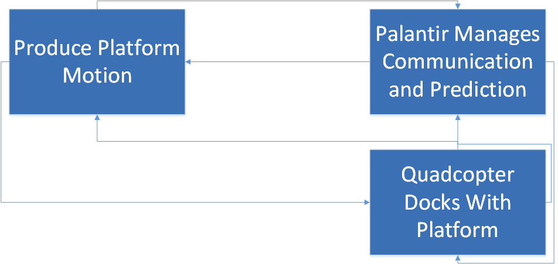
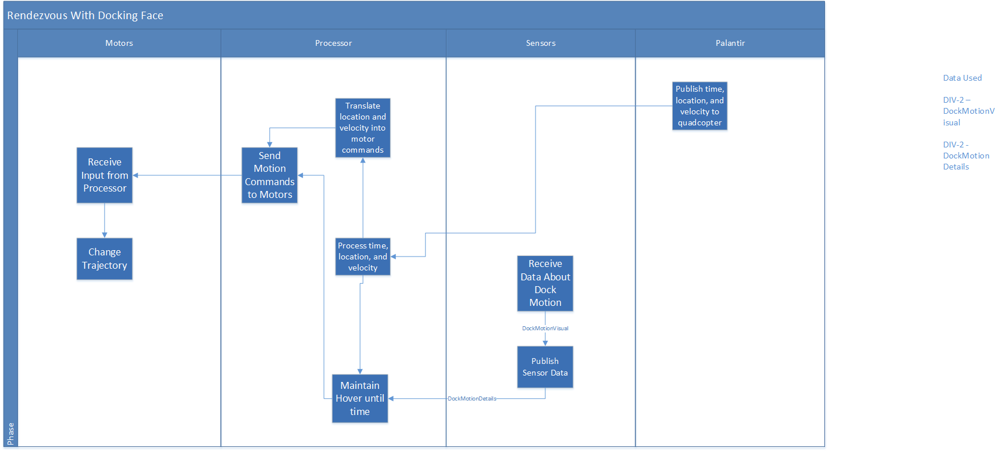
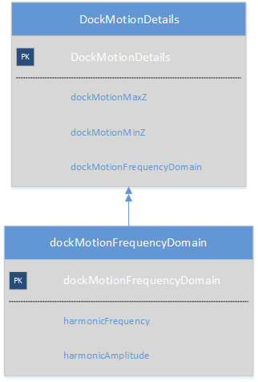

A useful tool in system engineering is the system model, which can drive development, requirements generation, design, and just about anything else to do with your project. While the WBS, schedule, and other tools are good for their particular area, the system model has the potential to be useful in replacing all your other planning methods, becoming the one-stop source for information about your project.

The system model language SysML was first developed by No Magic - though the framework is somewhat older - for project management and was quickly adapted for use in the Department of Defense, NASA, and other government bodies. The full framework is quite extensive, covering every possible level of system engineering from the highest goal oriented concept to the most basic layers like what data types are used and what interfaces carry them. The system model is a key part of the functionality of Rational Rhapsody, which uses the system model as built to generate code for programs the system runs. The a good set of resources can be found [here](https://www.nomagic.com/support/quick-reference-guides.html). A quick glance makes it obvious that most roboticists doe not need most of the views and charts, but some are useful and we will go over them in the following sections.

## Hierarchy
The most important aspect of system modeling tools is the hierarchy. The highest level is usually the requirement - or even the rationale behind the requirement - and each of these should have a separate diagram which itself is made up of blocks, capabilities, activities, information flows, etc which all expand into further diagrams until you reach the lowest operating level of a system. This way you can go up and down the conceptual flow to find out how every part of your development supports a requirement on the system.

### Operational View
One of the most useful views is the operational. In practice, you will rarely go below level 2, it being the meat of the view type for our purposes. It can generally be combined with the concept of the activity diagram which you can find in the overview of SysML.

#### Level 1
In this level, one can usually put the Use Case. While technically it belongs in the Capability View or All View, since we're otherwise not using CVs (unless you start modeling at the very beginning and use the CV for requirements). In the Use Case, put the Actors (the user, obviously, and the highest level subsystems you'd normally see in a WBS), and then what information flows between them. This would be the highest level information packet containing all other information flow we see on the level 2 Activity Diagrams.

#### Level 2
This is the meat of the Interface Design Description, where you can flow out all the things the system might do. Rather than go into a lot of operational or capability viewpoints, go straight into activity diagrams since the system is relatively small. Each box at the first indenture of level 2.

>Use "indentures" of activity diagrams since the other "levels" of OV are technically something else, signified by letters like OV-2b or OV-2c) is a high level activity (see below for the highest level view of MRSD 2015 "Dock In Piece" project).

As you can see from this chart, the highest level activities of docking the quadcopter are things like 'take off' and 'rendezvous with docking face', which have lines between to signify the temporal flow, and labels to signify what information needs to pass in order to make it happen. Most important are the labels which cross swimlanes, because that's information that will have to be packaged and sent from one subsystem to another. At this level the swimlanes are the actors and high level subsystems, but if we go a level down, we see subsystems within subsystems (the system-of-systems concept made manifest).

The first three swimlanes from the left are subsystems of the quadcopter while the final is crossing to/from the Palantir.

Here all four swimlanes are different subsystems (though the Palantir is technically part of the dock, it is quite separate physically and informationally), but support the higher level activity of docking)

#### Level 3
OV-2c is where intrasystem activities show up in the architecture. This indenture shows information flowing and activities that occur entirely on one system, sometimes with a single information flow leaving the internal swimlanes to some external box or all flowing to a single box which has the same name as a box in an indenture above, signifying what information and actions flow inside a system to make that one action occur - similar how how an OV-2b is often the expanded version of a single box in the OV-2a indenture. We cancelled all of our OV-2c diagrams early on and by the time the new system was finalized, we didn't have time to model, but this is what it looked like when we had the quadcopter doing localization with an onboard camera.

All swimlanes are of systems internal to the quadcopter subsystem, and eventually flow out to it keeping a fixed hover point.

## Capability View
If you were modeling from the very beginning, capability and to some extent activity view would be very useful for requirements traceability. The capability view shows the very highest level capability and then breaks that down through indentures of what other capabilities it would need and what activities support that. You can see it as being sort of the structure behind the activity diagrams with the various blocks and diagrams all being activities but rather than relating to each other through time and information flow they relate by what capability they support and what higher level activity they feed. Since the MRSD project is somewhat rushed, it is unlikely you'll use either view, but it is valuable to think about. For instance, each functional requirement should be a capability, what the system can do. From there, you can flow down activities it would have to perform to have those capabilities and then activity diagrams to show the flow of information. CV and AV diagrams are very useful in keeping the team focused on requirements and doing what needs to be done.

### Data and Information View
You can always dive straight into DIV-2 rather than DIV-1, but if you start early with modeling a DIV-1 is useful. We'll cover the second level here. Each line in the activity diagram had a name (or should have). That was a data flow, and these data flows naturally have information. In the DIV-2, you show what this information is.

It may seem trivial at first, but these views show not just information, but their type, names, and what larger information boxes they flow into. This can make integration much easier as everyone knows what every subsystem needs from every other subsystem and if the naming conventions are kept to, there is no confusion in how to get that information.

The flow up of these arrows show that the lower boxes become part of larger information packages sent along data flows at higher levels. In the above case, the multiple arrow means that more than one of these dockMotionFrequencyDomain objects may be included in the DockMotionDetail object/package. Interface design is much easier when the designer knows what information will flow through. Ideally one defines the name, type, and flow of every variable that crosses a boundary, subsystem to subsystem or even internally between functions.

## Sequence Diagram
There is software that will even turn these diagrams into functional code. In industry, it's becoming a practice in some companies to complete these models and then build the system they show. While it doesn't mean you can go without testing, it does mean that with a full system model, you can be confident that you're satisfying requirements and minimizing the difficulty of integrating many subsystems into a system of systems. Most of these rely on sequence diagrams, which are the activity diagrams given a strict temporal progression. This system sends this data to this system which does this and outputs something else to another system or the user.

## Summary
Some brief thoughts on the other views
- All View
  - Useful in a very large framework to track the other views, mission, vision, and other very high abstraction concepts. Of little use until you can call yourself an enterprise rather than a business.
- OV - 1
- This is actually extremely useful in helping to identify stakeholders and how they affect business and development. Highly recommended for any development project with more than one working group contributing to the life cycle within a business.
- OV - 2 (the first kind)
  - If you've done an OV-1, you'll want this to clarify all the things sketched out one level above.
- OV - 2 (the second kind)
  - Covered.
- OV - 3
  - When you're big enough for an AV, you'll need this one. Also useful if you have multiple working groups and want extremely clear communication of who is doing what.
- OV - 4 (first)
  - Within working groups, invaluable to making sure that everyone knows their role, who to ask for help, and who knows how to do what. Doubles as a handy lookup chart when its time to do performance reviews.
- OV - 4 (second)
  - Same as above, but now you've turned it into an Organization chart. Large companies would find it helpful. Startups, probably not.
- OV - 5a
  - If you really need to show how everything is done (maybe you want to be ISO certified), then this is a great way to do it.
- OV - 5b
  - One level down, shows how you do all the things you related in 5a. Again, if you have a process and need to codify it for ISO or the like, this is where it happens.
- OV - 6a
  Only looks useful if you have an organization contracting with the government (or if you are the government).
- OV - 6b
  - High level schedule.
- OV - 6c
  - Digging deeper into what makes one item in the schedule move on to the next.
- CV - 1
  - Capability view so high that it's looking at organizational capability rather than product capability. Useful if your entire company is being represented and run through modeling.
- CV - 2 through 4
  - Digging deeper. It is also recommended using CVs for product capabilities as well as enterprise (and in fact, that's more useful at least at the start).
- CV - 5 through 7
  - Relating capabilities to other views, so that you can see how they support and relate to your activities, services, and organizational development.
- PV - 1 (first)
  - Generalizes how your organizations' projects will flow. Project View isn't useful until you're enterprise level and have many projects running in tandem and need a metric by which to compare them
- PV - 1 (second)
  - More of the same.
- PV - 2
  - Shows how each project in the enterprise is progressing.
- PV - 3
  - What internal groups are assigned to what projects.
- DIV - 1
  - Defining what information you work with. Useful if you have some types of information (like standardized lists or blocks) that get used frequently.
- DIV - 2
  - Lower level, showing exact fields and types like String, Int and other objects.
- DIV - 3
  - Structure of the data. Used if you're building something with a really serious database.
- StdV - 1
  - What standards apply to each system and subsystem
- StdV - 2
  - How you think the standards will change in the operational lifetime of the system.
- SV - 1
  - This is what we would have used if we hadn't simplified things a lot by just using internal capabilities and activities. The high level functionality of an individual system.
- SV - 2
  - Digging down, how each subsystem communicates with other subsystems.
- SV - 3
  - Shared resources and which subsystems need them.
- SV - 4a
  - What you need to do to make each part of the system work (ie. activities carried out to support the development of each subsystem).
- SV - 4b
  - Similar to a cyberphysical architecture, relating your functions to physical subsystems and how the information flows between them.
- SV - 5
  - Relates SV-4 to OV-5, so pretty much more of the same as OV-5 in that if you need a really solid definition of your process you can use this. The idea being that each activity necessary to implement a system should have an operational action associated with it. Only of use to a company that is not at all interested in being agile but instead needs to document everything they do.
- SV - 6
  - For proving that yes, you did do something and so it was someone else's fault when it went wrong.
- SV - 7 (first)
  - Skip SV 5 and 6, SV 7 is what you want for tracking things. It's really handy for test plans and making sure you've met your performance goals. Defines every measure of effectiveness, what kind of measure it is, and the threshold.
- SV - 7 (second)
  - The results from testing measurements codified in the other SV - 7.
- SV - 8
  - Shows a brief description of each version of a system developed. One thing this structure doesn't replace is configuration control and you're probably better off either linking this to your control somehow or just not doing it.
- SV - 9
  - Forecasts of technology and skills so you can get ready to implement capabilities you can't implement now. Good for keeping track of developing technology so that ideas for improvement don't get lost.
- SV - 10a
  - List of constraints on a system. Sort of all the requirements you're not really supposed to have because they implement a negative (system shall not do this).
- SV - 10b
  - A copy of OV-6b but specific to a system.
- SV - 10c
  - Same as above only for OV-6c. If you haven't got a lot of systems, don't bother with OV-6, just do these.

Some more high level information can be found [here](http://www.omgwiki.org/UPDMAlpha/lib/exe/fetch.php?media=doc:overview_of_updm_for_systems_engineers_dodaf_and_omg_graham_bleakley_21_march_2013.pdf). IBM is the publisher of Rational Rhapsody, one of the most popular pieces of modeling software which allows for these diagrams to be turned into code. The other big name in system modeling is No Magic, linked at the start of the page. There is also a lot more to SysML, including the modeling of constraints, personnel, equipment, and everything else that goes into the development and running of a system. A full system model is an enormously useful tool which incorporates all the best aspects of a WBS, schedule, design document, budget, equipment list, styleguide, and requirements spec. When combined with a tool like DOORS (a requirements management database), a system model can be the central repository and generator of all project planning data.
