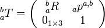

The Eigen Geometry library is a C++ libary useful for robotics. It is capable of the following operations:
1. Declare Vectors, matrices, quaternions.
- Perform operations like dot product, cross product, vector/matrix addition ,subtraction, multiplication.
- Convert from one form to another. For instance one can convert quaternion to affine pose matrix and vice versa.
- Use AngleAxis function to create rotation matrix in a single line.

## Example Implementation
To use the library, the following includes are recommended:
```
#include <Eigen/Geometry>
#include <Eigen/Dense>
#include <eigen_conversions/eigen_msg.h>
#include <Eigen/Core>
```
For instance, a rotation matrix homogeneous transform of PI/2 about z-axis can be written
as:

``Eigen::Affine3d T_rt(Eigen::AngleAxisd(M_PI/2.0, Eigen::Vector3d::UnitZ()));``

Additionally, you can:
1. Extract rotation matrix from Affine matrix using `Eigen::Affine3d Mat.rotation( )`
- Extract translation vector from Affine Matrix using `Eigen::Affine3d Mat.translation( )`
- Find inverse and transpose of a matrix using `Mat.inverse( ) and Mat.transpose( )`

The applications are the following
1. Convert Pose to Quaternions and vice versa
2. Find the relative pose transformations by just using simple 3D homogeneous transformation `Eigen::Affine3d T` is a 4*4 homogeneous transform:

3. Now all the transformations (rotation or translation) can be represented in homogeneous form as simple 4*4 matrix multiplications.
4. Suppose you have a pose transform T of robot in the world and you want to find robot’s X-direction relative to the world. You can do this by using
`Eigen::Vector3d x_bearing= T.rotation * Eigen::Vector3d::UnitX();`

## References
This is an important library in c++ which gives capabilities equal to Python for vectors and matrices. More helpful functions and examples can be found at the following links
- Eigen Documentation: http://eigen.tuxfamily.org/dox/
- Eigen Quaternion Documentation: https://eigen.tuxfamily.org/dox/classEigen_1_1Quaternion.html
- Eigen Transforms Documentation: https://eigen.tuxfamily.org/dox/classEigen_1_1Transform.html
