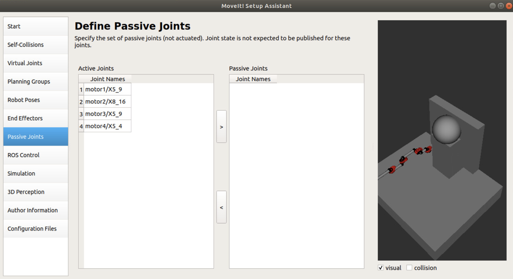

/wiki/actuation/drive-by-wire/

---
# Jekyll 'Front Matter' goes here. Most are set by default, and should NOT be
# overwritten except in special circumstances. 
# You should set the date the article was last updated like this:
date: 2022-12-07 # YYYY-MM-DD
# This will be displayed at the bottom of the article
# You should set the article's title:
title: Drive-by-wire Conversion for Autonomous Vehicle
# The 'title' is automatically displayed at the top of the page
# and used in other parts of the site.
---
Drive by wire technology in the automotive or aviation industry is the use of electrical or electromechanical systems for performing vehicle functions traditionally achieved by mechanical linkages. This technology replaces the traditional mechanical control systems with electronic control systems using electromechanical actuators and human–machine interfaces such as pedal and steering feel emulators. 

In the autonomous driving vehicle applications, the drive-by-wire system enables the autonomous software, or teleoperation software, to provide commands to the vehicle, using control methodology to steer, brake, accelerate and change gear where necessary, whilst also passing back data on the current vehicle “state”. In terms of uses in passenger cars, the drive-by-wire vehicle contains “throttle-by-wire”, “brake-by-wire”, “steer-by-wire” and “park-by-wire”. Modern DBW systems consist of an electronic pedal assembly that has redundant pedal position sensors where the pedal assembly features two position sensors that send the pedal position information to the ECU.

## Types of Drive-by-wire Systems

In a typical hydraulic and mechanical system, there's a big tangle of parts that control different aspects of the vehicle's operation. Connected throughout the car is the brake booster, master cylinder, steering column, steering shaft, rack-and-pinion gear, hydraulic lines and various cables and links. These components work together and independently to give us a smooth driving experience. However, they also add weight to the vehicle and a potential for degradation over time.

In a drive-by-wire system, most or all of this would be replaced by electrical wires. In any type of by-wire system, sensors record information and pass data to a computer or a series of computers, which transfer the electrical energy into mechanical motion. There are several different types of drive-by-wire systems, which is why it's sometimes referred to generally as x-by-wire. Here are a few of the main by-wire systems:

### Throttle-by-wire
Throttle-by-wire, or accelerate-by-wire, was the first type of drive-by-wire system introduced. These systems use a pedal unit and an engine management system. The pedal uses sensors that measure how much or how little the driver moves the accelerator, and the sensors send that information to the engine management system. The engine management system is a computer that, among other tasks, determines how much fuel is required, and it provides this input to an actuator -- a device that converts energy into mechanical motion. The pedal could be the same pedal drivers have become accustomed to using today, an easy-to-reach pad placed near the foot that's pressed down in order to accelerate the car. The same operation could also be incorporated into a joystick or videogame-like controller, which would get rid of the need for a foot pedal completely. Of course, this would require drivers to use their hands for acceleration, braking and steering.

As shown in the figure below, With throttle by wire a sensor is attached to the gas pedal and detects how far it has been pressed. This information is then sent down a wire to the car's computer. The computer analyzes the information and commands a motor to open the butterfly in the throttle body. Since the computer is in control of the throttle opening things like idle speed control, cruise control, and traction control can easily be integrated. Because automatic transmissions are also usually controlled by the computer it can adjust the throttle during gear changes. It also allows the addition of eco or sport buttons to change the way the throttle reacts when pressed, increasing fuel economy or throttle response.


### Brake-by-wire
There are two types of brake-by-wire systems. Hydraulic, or "wet," brake-by-wire uses additional hydraulic parts to create pressure on the brakes. Electric, or "dry," brake-by-wire, on the other hand, simply uses an electric motor and no hydraulic brake fluid.

Brake-by-wire technology is seen by some as more dangerous than electronic throttle control because it involves removing the physical connection between the driver and the brakes. However, brake-by-wire is a spectrum of technologies that range from electro-hydraulic to electromechanical systems, and both can be designed with fail-safes in mind.

Traditional hydraulic brakes make use of a master cylinder, as well as several slave cylinders. When the driver pushes on the brake pedal, it applies physical pressure to the master cylinder. In most cases, that pressure is amplified by a vacuum or hydraulic brake booster. The pressure is then transmitted via brake lines to the brake calipers or wheel cylinders.

Anti-lock brake systems were early precursors of modern brake-by-wire technologies, in that they allowed the brakes of a vehicle to be pulled automatically with no driver input. This is accomplished by an electronic actuator that activates the existing hydraulic brakes. Other safety technologies have been built on this foundation. Electronic stability control, traction control, and automatic braking systems depend on ABS and are peripherally related to brake-by-wire technology.

In vehicles that use electro-hydraulic brake-by-wire technology, the calipers located in each wheel are still hydraulically activated. However, they are not directly coupled to a master cylinder that is activated by pushing on the brake pedal. Instead, pushing on the brake pedal activates a series of sensors. The control unit then determines how much braking force is required at each wheel and activates the hydraulic calipers as needed.

In electromechanical brake systems, there is no hydraulic component. These true brake-by-wire systems still use sensors to determine how much brake force is required, but that force is not transmitted via hydraulics. Instead, electromechanical actuators activate the brakes located in each wheel.


### Steer-by-wire
Sensors detect the movements of the steering wheel and send information to a microprocessor. The computer then sends commands to actuators on the axles, which turn according to the driver's directions.

Most vehicles use a rack-and-pinion unit or worm-and-sector steering gear that is physically connected to the steering wheel. When the steering wheel is rotated, the rack-and-pinion unit or steering box also turns. A rack-and-pinion unit can then apply torque to the ball joints via tie rods, and a steering box will typically move the steering linkage via a pitman's arm.

As shown in the figure below, in vehicles that are equipped with steer-by-wire technology, there is no physical connection between the steering wheel and the tires. Steer-by-wire systems don't technically need to use steering wheels at all. When a steering wheel is used, some type of steering feel emulator is typically used to provide the driver with feedback.


## Benefits and Drawbacks of Drive-by-wire Systems
Some people are excited about the prospect of more drive-by-wire systems in cars. By replacing conventional throttle systems, drive-by-wire systems can significantly reduce the number of moving parts in a vehicle. This reduces weight, increases operational accuracy and stretches out the time between service visits for things like mechanical maintenance and other adjustments. Some by-wire systems wouldn't even require service at all. Less weight and better accuracy would equal better fuel efficiency and fewer emissions, too.

Although it's well-established in the airline industry, drive-by-wire has been slow in its introduction to the car. The problem for some car manufacturers is in convincing drivers that the systems are safe. Because of the complexity of drive-by-wire systems, some people worry about potential electronic malfunctions in sensors and computers, leading to vehicle damage or even car accidents and passenger injury.

One argument against drive-by-wire is that any system using software has the ability to fail regardless of how many times that software has been tested. In a worst-case scenario, for example, the sensors on a brake-by-wire system could make an error in calculation, causing the brake caliper and pads to apply an incorrect amount of pressure -- either too light or too strong -- to the rotor. Unaware of any internal system problems, the driver using the brake-by-wire system could potentially get into an accident, even though he or she thought the correct amount of pressure was being placed on the brake pedal.

In any case, most people refer to the saying that any software is only as good as the programmers and manufacturers who built and designed it. Because of the reliability of fly-by-wire in airplanes, it's likely that experience and product testing could bring more drive-by-wire systems safely to everyday cars. Several car companies are already using (or have used) various drive-by-wire systems in their vehicles, including BMW, Mercedes-Benz, Land Rover, Toyota, GM, Volkswagen and Nissan.


## References
- [Quick Tech | Drive-By-Wire Throttle Systems - DSPORT Magazine](https://dsportmag.com/the-tech/education/quick-tech-drive-by-wire-throttle-systems/)
- [What is Drive By Wire Technology in cars and How it works? Know More. - CarBikeTech](https://carbiketech.com/drive-by-wire-technology-working/)
- [Electronic Throttle Control (Drive By Wire)](https://www.picoauto.com/library/training/electronic-throttle-control-drive-by-wire-or-fly-by-wire)


/wiki/actuation/linear-actuator-resources/
---
date: 2018-05-14
title: Linear Actuator Resources and Quick Reference
published: true
---
Linear movement is necessary for many types of robotics and automation, from simple 3D Printers with belts and threaded rod to complex high precision stages for Industrial Automation equipment, there always is a need to move something in a straight line.

This article will be a high level overview of linear actuator stage components and will cover basic types, terms, and resources for Electric linear actuation. We will cover Linear Rail/Guides, Belt Drives, Screw Based Systems, Rack and Pinions, Linear Motors (Synchronous, Induction, and a short mention of Piezoelectric), and indexing a linear stage. 

We will also have a section with common vendors of linear motion equipment and other useful articles for producing linear motion systems.

## Linear Rails and Guideways
When you want to produce linear motion, you first must constrain the movement to only one degree of freedom along the direction of you wish to go. This is usually accomplished using linear guides or linear bearings/bushings if you cannot otherwise constrain the actuator.

Linear bearing/bushing systems commonly consist of a bearing/bushing and a cylindrical rod of some sort with the bearing and rod having matched inner and outer diameters respectively within a certain tolerance. If it is a bearing system, there will be recirculating ball or cylindrical bearings rolling against the direction of motion of the bearing. If it is a bushing, it will usually be made of a material with good tribological (wear resistance) properties, such as oil infused bronze or tribologically optimized plastics. 

> A useful resource if you need a bushing that has good wear resistance, but you cannot find the right form factor, is Igus. They provide tribologically optimized Materials Extrusion printer filament for printing custom bushings (See Further Reading.)

The downside to Linear Rails of the bearing/bushing type is that they are usually unconstrained in rotation so you must constrain rotation in another way (eg. a leadscrew.)

Linear Guideways on the other hand, constrain motion in rotation also. These also usually use recirculating bearings to guide motion but the profile of the rod is non-circular. The different types of bearing configurations such as roller bearing, two point contact, or gothic arch affect the load rating in different directions. 

> One useful tip while designing linear guideway platforms with multiple parallel guideways (ex. a XY gantry system) is to machine extremely small alignment shelves for the linear guideways to be referenced against. This will ensure that as long as the machining is done parallel to the machines axis and in one operation that the shelves and thus the guideways will be as parallel as the machine that produced the shelves.

Linear guideways can provide extremely precise linear motion but are usually prices higher in comparison to circular bearings/bushings. Many relatively cheap chinese knockoffs of brands such as Hiwin are available on Ebay. Common problems with these models can include large amounts of slop in the carriage fit and grooves created in your rails over time as cheap rails may be softer than the hardened steel ball bearings. 

One thing to consider while designing a system using either rails or guides with bearings is the preload applied by the manufacturer. When a bearing is preloaded, there is an extremely small interference fit between the ball bearings and the gap between the bearing surfaces in the carriage and on the guide/rail. this ensures there is no slop between the rail and the carriage but increases both price and rolling resistance.

> Other solutions that exist include roller bearing carriages that ride on roller bearing wheels sometimes in v-slot extrusion and air bearings/hydrostatic bearings which ride on a small layer of air/oil respectively for a extremely smooth, low friction ride. There are also linear motion elements called ball splines which constrain linear motion, but can also be used to transmit rotational motion to the carriage.

## Belt Drive systems
A belt drive is, at its heart, a conveyor belt with the carriage attached to the conveyor. In the simplest setup, a Timing Belt is driven by rotary motor with the belt looping around an idler at the other end of travel. The load is then attached to fixed point on the belt. As long as the belt is straight going in the direction of travel, the load will move the diameter of the drive wheel without the teeth. The large advantage to belt drive in prototyping systems is a much lower cost for large systems compared to all other options in addition to relatively high speeds and accelerations. The disadvantage is relatively low load capacity for actuation force.

Important considerations for belt drive systems include belt material, tooth profile, and proper belt tensioning. 

The material of a belt determines how much stretch a belt will have which is directly related to the hysteresis in a belt system, where a belt acts like a spring until the drive motor has moved enough to overcome the stretch in the belt. This also affects how often the belt will have to be tensioned. Belts commonly come with kevlar, carbon fiber, or steel cores to prevent stretching.

It is extremely important to get matching tooth profiles for your drive wheel and your belt. The different profile types are designed for different types of load and have different pitches (teeth/unit length) and profile designs. If you get a belt with the same pitch but a different profile, they may not fit together correctly, causing the belt to slip or move a small amount more or less than desired while under the design loads. Common timing belt profiles include GT2 and MXL.

Correct tension is critical to belt drive operation. Remember to include some method to adjust belt tension if your design. As belts wear, they stretch and thus loose tension. If there is not enough tension, the belt can slip on the teeth producing "lost motion." Extremely over tensioned belts are harmful also, they will unnecessarily load your belt , drive wheel, and motor shaft, causing premature wear and failure.

> Other belt configurations for XY Gantries exist other than a simple cartisan configuration. Other systems include H-Bot and [CoreXY](http://corexy.com/) which trade mechanical advantage for longer belt runs and thus more stretch and hysteresis. See Further Reading for more.

## Screw Based Systems
Screw based systems act upon the principle of a simple machine screw. Some sort of nut and screw are used with one being constrained to not rotate while the other rotates to drive the linear motion. Conventionally it is the screw that rotated, but in systems where multiple systems need to more on the same axis and may interfere with each other, you can rotate the nut and hold the screw to fit multiple actuators on the same screw.

Any screw system has a couple of common parameters. These are pitch, lead, starts, and diameter. 

Pitch is how many threads per linear distance unit exist on a screw. 

In contrast, lead is how much distance a nut will travel with one revolution of the screw. 

The relationship of these two quantities is known as starts, and what it actually represents are how many actual thread "lines" exist on a screw shaft, this value is similar to the number of flutes on a machine tool. 

The Lead, which is the important value when calibrating a system, is the pitch times the number of starts.

The two types of screw based systems in linear motion are leadscrews and ballscrews. 

A leadscrew is equivalent to a bushing in a linear rail system. The threads rely on low friction interfaces to slide relative to each other to produce linear motion. In practice, this is achieved by polishing the surface of the lead screw or teflon coating the inside surfaces of the threads. When a leadscrew is running for a long time or at high speeds it will generate a lot of heat which can cause differential expansion in the materials and cause a leadscrew to fail prematurely. Generally, depending on the lead, a leadscrew will me relatively slower and have less actuating force than other common varieties of linear motion.

In contrast, a ballscrew would be the "bearing" to the leadscrew's "bushing". A ballscrew uses recirculating bearing balls just like the linear rails and guides. This greatly lowers friction in the system and thus increases maximum speeds and decreases heat generation. This negates most of the disadvantage to leadscrew based systems, but comes at both a monetary cost as well as an engineering cost. The monetary cost for ballscrews is much higher than leadscrews due to the precision of manufacturing required. 

There are two types of ballscrews available at different price points, rolled ballscrews and ground ballscrews. Rolled ballscrews are formed by taking a piece of round material and rolling it between two forming dies which form the ball bearing profile for the threads. Ground ballscrews are precision ground by CNC machines. In general, rolled ballscrews will have looser tolerance and more variation at a lower cost.

The engineering cost is that another major difference is that leadscrews are relatively non-backdrivable depending on the lead angle which is the angle of the thread helix. This is desirable in some applications such as heavy Z-Axis on CNC machines. If power is disengaged from a leadscrew based actuator, friction will keep a heavy load from falling, whereas with a much lower friction system in the ballscrew, the axis will fall straight down if there is not a electronic or mechanical brake installed which stops it from turning while motor power is off.

As a screw system, if not preloaded, ballscrew and leadscrew will both have backlash, causing lost motion. This can be combated for ballscrews in the same way as linear bearings, but leadscrews, unlike bushings, and also reduce backlash by using what is called an Anti-Backlash nut. This consists of two lead nuts connected by a spring that is slightly compressed when the lead nut is screwed onto the lead screw. One lead nut will be pressed against the top of the threads while the other will be pressed against the bottom, preventing backlash. This does increase friction and thus heat generation.

Ballscrews and leadscrews also act as gearing based on the lead. A lower lead will provide more linear force for the same torque. They also are extremely rigid systems and commonly show up in high force, high precision applications such as manufacturing. 

## Rack and Pinion Systems
A Rack and Pinion is essentially a gear with a circumference of your desired travel that has been unrolled.
As with traditional gears, rack and pinions can have straight cut or helical gear teeth and can deliver high forces for long travel ranges at a reasonable cost. Like a belt, a Rack and Pinion can maintain relatively high speeds, but unlike a belt, a rack and pinion can drive heavy loads without needing tensioning. 

The actuation force is higher for lower pinion diameters, but your achievable speeds will go down as the circumference decreases. Circumference will also determine the resolution with indexed motors with a higher resolution for smaller circumferences.

The major disadvantage to rack and pinion systems is that, as with gear systems, backlash will cause lost motion when switching travel directions. Unlike a leadscrew, removing backlash on a rack and pinion is not cheap. Solutions include having two identical pinions slightly next to each other slightly offset in angle. A torsion spring is then used to have one gear press against one side of the rack teeth while the other is pressed against the opposite side. There are also electronic solutions which do much the same thing. This can push the price of a ballscrew system lower than that of a rack and pinion very quickly depending on tolerances.

## Linear Motors
Linear Motors are brushless rotational motors unrolled  into long flat stages. Linear motors are made up of two sections, the forcer and the platen. The forcer contains the energized coils that create magnetic fields to move the "rotor" (note, nothing actually rotates, the rotor in this case is just the moving part, the stator is the stationary part) while the platen is either a flat aluminum plate for an induction motor or a piece with magnets end to end in a SNNSSN type configuration, where the repelling ends are forced together for what are called synchronous motors. 

DC "brushed" Linear Motors do exist, but they are not usually used for linear motion due to current requirements and high friction at common linear motor actuation speeds. They are most commonly used in railgun type applications. 

Induction motors use Lenz's Law to create opposing magnetic fields in the metal plate below them with coils of wire around a magnetic core. They are commonly 3 phase AC motors and are sometimes used in high performance applications. They also produce a levitating effect which makes them well suited to maglev type applications. 

Synchronous motors use permanent magnets and multiple phases instead of induction. This makes them more expensive for long travel than Induction motors. The magnetic field of the permanent magnets provides much increased force and accelerations. There are a couple of common constructions of synchronous motors including U-channel, linear shaft motors, and a special case, linear stepper motors. 

U-channel motors have a set of coils held between the permanent magnets on both sides of a piece of precision machined u-channel. Linear shaft motors have the magnets constrained inside a precision ground shaft like a linear bushing with the coils in the carriage going around the shaft. Linear stepper motors are simply 2 phase (90 degree phase offset) brushless linear motors and can be controlled with standard stepper motor drivers for high holding torque in open loop configurations.

The major advantage to offset the extremely large cost of linear motors is their ability to generate incredible accelerations and speeds compared to even belts and ballscrews. Maximum accelerations of more than 10Gs are possible with small loads. Another factor is that linear motors can be completely non-contact unlike all other linear motion systems with their linear guides if air or hydrostatic guides are used. This provides for extremely smooth motion for sensitive applications like metrology where the slightest imperfection in a guiderail would otherwise cause inaccuracy.

The last, uncommon type of linear motor is the piezoelectric motor. These motors use the piezoelectric effect to essentially walk along a shaft in extremely small increments. These motors can produce extremely precise and accurate movement with the highest of resolutions, but are as slow as a snail. If you need a piezoelectric motor, you'll probably know you need a piezoelectric motor. 

## Stage Indexing
In order to perform precise position control for linear actuators, some sort of index is needed so that a reference point can be established. This can come in several forms.

One extremely frugal way to perform this is with a hard stop, if you are using a stepping type motor in open loop mode for any linear actuator, if you drive the axis into a hard stop, you know your position. This was what was done with old floppy drives in order to get a zero position with no sensor. 

Many different types of sensor can be used to index an axis. These include physical switches, optical interrupters, capacitive and laser distance measurement sensors, and one very important class of sensors known as encoders. 

Encoders are used to determine how far an axis has moved, and potentially where the axis is on its travel. They operate via either optical or magnetic disks(rotary motion) or strips(linear motion) which, when run past a sensor will produce a specific series of digital outputs corresponding to movement. These can come in absolute varieties where the digital outputs will tell you the exact position on the encoder disk or strip you are reading, or incremental varieties where the number of pulses counted will correspond to how far the rotary or linear axis has moved.  A incremental encoder can also come with a index channel witch can provide a point of reference on where to start in your travel. 

Both varieties of encoders can be used to implement closed loop position, velocity, and torque/force control with any variety of motor be it linear or rotary.

For non stepper type synchronous linear motors, there is one more type of relevant sensor. A synchronous linear motor must have feedback in order to time its phases to move in the correct order/direction. This can be accomplished with an linear encoder strip or Hall Effect Sensors. The Hall Effect Sensors will read the Magnetic field intensity and the peaks for north and south can be used to index where the coils are in relation to the magnets. This can also be used for coarse position feedback for control algorithms. 

## Sourcing Parts

Here are some common and reputable vendors for linear motion equipment.

 - Linear Guides and Rails: Misumi, McMaster Carr, Micromo (miniature rails/guides), Hiwin, THK, Nippon Bearing
 - Belt Drive Systems: McMaster Carr, Misumi, SPD-SI, Micromo (miniature), Parker
 - Screw Based Systems: McMaster Carr, Misumi, THK, Hiwin, Nippon Bearing, Lin Engineering(Leadscrews with integrated steppers), Parker
 - Rack and Pinion: McMaster Carr, Parker
 - Linear Motors: Parker, Faulhaber, Nippon Pulse, H2W Technologies(Linear Steppers/Motors), Northern Magnetics(Defunct, widely available on ebay, compatible with some H2W Technologies parts)
 - Indexing: Omron, McMaster Carr, Digikey, US Digital(Reasonably Priced Linear Strip Encoders)
 - Linear Stages(Actuator+guide integrated): THK, Hiwin, Parker, Nippon Bearing, H2W Technologies


## Summary
This has been a very wide overview of common linear actuation technologies. It is important to choose the right actuator type for your needs and budget. 


## Further Reading
 - [Hiwin Linear Guide Video](https://www.youtube.com/watch?v=2I44OT7c_MY)
 - [Hiwin Ballscrew Video](https://www.youtube.com/watch?v=K3i-Ecb698g)
 - [Hiwin Linear Motor Video](https://www.youtube.com/watch?v=mvkcupVxMEI)
 - [Linear Shaft Motor Video](https://www.youtube.com/watch?v=Bxs2PFg0luw&t=329s)
 - [Igus TriboFilament](https://www.igus.com/3d-print-material/3d-print-material)

/wiki/actuation/model-predictive-control/
---
# Jekyll 'Front Matter' goes here. Most are set by default, and should NOT be
# overwritten except in special circumstances. 
# You should set the date the article was last updated like this:
date: 2022-05-04 # YYYY-MM-DD
# This will be displayed at the bottom of the article
# You should set the article's title:
title: Model Predictive Control Introduction and Setup
# The 'title' is automatically displayed at the top of the page
# and used in other parts of the site.
---
​	Model Predictive Control (MPC for short) is a state-of-the-art controller that is used to control a process while satisfying a set of constraints. In this article, we will discuss what MPC is and why one might want to use it instead of simpler but usually robust controllers such as PID control. We will also include some useful resources to get started.

## What is MPC?
​	As stated above, MPC is an advanced state-of-the-art controller that is used to control a process or system while satisfying a set of constraints. It requires a good model of the system or process being controlled, as one of the constraints to satisfy is the dynamics model itself. This dynamics model is then used to make future predictions about the system's behavior to find the optimal control input to minimize the objective function. This minimization is done over a chosen finite time horizon.

​	Because MPC has a control input vector, and also has a state vector, it also has the ability to be multi-input multi-output. For example, for a multi-dof manipulator system, MPC could handle multiple joint torques (or whatever control input) to control the outputs (joint positions, velocities, etc.).  This doesn't just apply to manipulators, however. It can apply to any system ranging from UGVs to quadcopters as well. If one is familiar with LQR control, MPC is a finite time horizon version of LQR with constraints.

## Why MPC?

​	You should choose MPC because it integrates system constraints, something that normal PID control cannot do easily. Furthermore, the dynamics of the environment may change over time, and MPC allows for an easy way to estimate those dynamics and adjust accordingly. PID control is normally not for systems whose dynamics change often (such as the dynamics of drilling differing bone densities as we ream further and further into bone) because the gains for the PID may need to change to produce desired responses. If not, then the changing dynamics may cause overshooting (a very undesired response when drilling into a person). MPC is also multi-input multi-output, allowing for multiple inputs to vary the output of the system. This is possible in PID, but requires either separate axes of control or additional control loops (which is fine, but not simple).

## Formulating the Optimal Control Problem

​	The first step to setting up an MPC is to define your optimal control problem (OCP for short). The Optimal Control Problem contains the following components: the objective function, the dynamics model, and the system constraints. It usually takes the form of the following: 
$$
min_{x,u}(f(x))\\
s.t.\\d(x,u) = 0\\
c(x,u) \leq 0
$$
​	Where the first line is the objective or cost function that we are trying to minimize, the second line d(x, u) = 0, is the dynamics constraint, and the third line, c(x, u) less than or equal to 0,  are additional constraints.

The objective or cost function usually takes similar form to LQR cost functions as a quadratic, convex function with hyperparameters Q and R, which determines what states or inputs are most important to minimize over the time horizon. An example is shown below:
$$
min_{x,u,k\epsilon[1,H]} \frac{1}{2}x^{T}_{H}Q_{f}x_{H} + \sum_{k=1}^{H-1}{\frac{1}{2}x^{T}_{k}Qx_{k} + \frac{1}{2}u^{T}_{k}Ru_{k}}
$$
where H is the time horizon, Q is the matrix determining cost of states, Qf is the matrix determining the cost of the terminal states, and R is the matrix determining the cost of the inputs. Just like in LQR, the goal of the controller is to minimize this objective/cost function. 

​	The dynamics constraint, d(x,u) = 0, is the constraint that takes the following form. Let's say the following function is your dynamics:
$$
\dot x = f(x,u)
$$
Then the dynamics constraint takes the following form:
$$
d(x,u) = f(x,u) - \dot x = 0
$$
​	The other constraints, c(x,u), can be any other constraints one might have on the system. For manipulators, this could be joint position, velocity, or torque limits, for example. For rockets, it could be
$$
p_{z} \geq 0\\
$$
since the rocket can not physically go below the ground in reality (without a catastrophe at least). An example of formulating the Optimal Control Problem can be found in Appendix A below. This example is from a former team, MRSD 2022 Team C for an manipulator that drills/reams the hip socket (acetabulum).

## Getting Started With Implementation

​	There are a lot of different languages and libraries to implement MPC in, but the recommended ones are C++ and Julia. The solvers listed below should list the optimal control inputs. These can be generated both offline or online and used on the system. For online systems, it is best to do one MPC solve every time step , use the first control input for the upcoming time step, and then repeat.

#### Julia

​	Julia is a scripting language, which allows for fast prototyping, while having very similar speeds to C++. There are however some caveats with using Julia. First, it is not as well supported as C++ (although many of the libraries needed to implement MPC are available). Second,  similar to other languages, the runtime performance is very dependent on making sure that there are no global variables, and that allocation of memory is minimized during runtime. The benefits of Julia is that it is simple to code in (very similar syntax to Matlab and Python), it has lots of shortcuts for writing code that would take multiple lines in C++, and it can sometimes outperform C++ if done correctly. This allows for very robust code while also having fast iteration time.

If you are using Julia as a coding language, the following libraries are recommended for use (although there may be others that can be of use):

**Dynamics Models/Simulation**

- RigidBodyDynamics.jl: https://github.com/JuliaRobotics/RigidBodyDynamics.jl
  - This library is a general rigid body dynamics library that allows for fast calculations of rigid body dynamics. The nice thing about this library is that you can import a urdf and perform any dynamics calculations with the imported urdf easily.
- Tora.jl: https://juliarobotics.org/TORA.jl/stable/
  - This library uses the RigidBodyDynamics.jl library for trajectory optimization specifically for robotic arms.
- RobotDynamics.jl: https://github.com/RoboticExplorationLab/RobotDynamics.jl
  - This library was developed as a common interface for calling systems with forced dynamics. For the example in Appendix A, this library was a wrapper for RigidBodyDynamics to allow it to be used with TrajectoryOptimization.jl and ALTRO.jl mentioned below.
- Dojo.jl: https://github.com/dojo-sim/Dojo.jl
  - A relatively new simulator that can simulate dynamics (haven't explored this one too much)
- MuJoCo.jl: https://github.com/Lyceum/MuJoCo.jl
  - Ports over the MuJoCo simulator to Julia for simulation

**Trajectory Optimization**

- TrajectoryOptimization.jl: https://github.com/RoboticExplorationLab/TrajectoryOptimization.jl
  - This library was developed for defining and evaluating optimal control problems, or trajectory optimization problems. In this library, one can define the objective/cost function, the desired trajectory, the system constraints, and initial guesses for trajectories.

**Solvers**

- ALTRO.jl: https://github.com/RoboticExplorationLab/Altro.jl
  - This library was uses iterative LQR (iLQR) with an Augmented Lagrangian framework to solve trajectory optimization problems defined using the TrajectoryOptimization.jl library. It can solve both nonlinear and linear problems and constraints. This library was developed in the Robot Exploration Lab. More explanation of this library and a tutorial can be found in the github link above and in the links below:
    - https://roboticexplorationlab.org/papers/altro-iros.pdf
    - https://bjack205.github.io/papers/AL_iLQR_Tutorial.pdf
- OSQP.jl: https://osqp.org/
  - This library is available in multiple languages, with one of them being Julia. This library is a QP (Quadratic Program) Solver, and is generally used to solve linear optimization problems. It is sometimes faster than ALTRO and sometimes slower than ALTRO depending on the system.
- Ipopt.jl: https://github.com/jump-dev/Ipopt.jl
  - This library is a nonlinear solver for trajectory optimization problem. Personally haven't explored much, but should have similar speeds to the other libraries above.

**ROS Support**

- RobotOS.jl: https://github.com/jdlangs/RobotOS.jl
  - This library is a wrapper for the rospy interface. It has been well tested and is stable.
- ROS.jl: https://github.com/gstavrinos/ROS.jl
  - This library is a wrapper for the roscpp interface. It hasn't existed for a long time so it may have some bugs and stability issues. If you need speed, use this, but be aware of potential bugs.

#### C++

​	C++ is also a good choice for implementing MPC as MPC is computationally expensive to run, so fast runtime is necessary. It can outperform Julia if the code is properly optimized, but it may have slower iteration time than Julia since it is not a scripting language. Use C++ if you need faster runtime performance. Personally haven't explored C++ implementation too much, but if you are using C++ here are some libraries that can be used:

**Dynamics Models/Simulation**

- Pinocchio: https://github.com/stack-of-tasks/pinocchio
  - A general rigid body dynamics library that is one of the fastest dynamics solvers out there
- MuJoCo: https://mujoco.org/
  - Good simulator, which has a more accurate physics simulator than Gazebo, and is one of the top choices if using MPC

**Problem Formulation & Solvers**

- AltroCPP: https://github.com/optimusride/altro-cpp
  - Implements the ALTRO.jl library in C++
- OCS2: https://github.com/leggedrobotics/ocs2
  - A toolbox tailored for Optimal Control for Switched Systems (systems that switch modes). Implements SLQ, iLQR, SQP, PISOC algorithms.
- Crocoddyl: https://github.com/loco-3d/crocoddyl
  - Optimal control library for robots under contact sequences, and it directly uses Pinocchio

## Tips/Tricks

- Many systems are nonlinear, which can be tricky when implementing an MPC on those systems since nonlinear systems can be nonconvex and may not always guarantee a solution.
  - Some ways to help with this issue is to linearize the system if writing your own solver, or use some of the solvers listed above.
  - The solvers for nonlinear systems often rely on a good initial guess to the control input or else the solver cannot solve the optimal control problem (since it may not be convex). For instance, for manipulators, a good intial guess is gravity compensation torques. Generally the initial guess needs to be what keeps the system at equilibrium for all times in the time-horizon.
- Since MPC is computationally expensive, sometimes it is hard to keep convergence times on these solvers low. Here are some tips to help:
  - Make sure to optimize code, such as reducing memory allocation or using constants where you can (C++).
  - Use RK3 to rollout the dynamics instead of RK4 since it requires less dynamics calls while still being decently accurate as long as you aren't predicting too far out.
  - Reduce the time horizon. Having a shorter time horizon drastically reduces computation time, while sacrificing optimality for the entire trajectory.
  - Reduce the number of states or constraints. More states or constraints increases computation time by a large factor.
- If your controller isn't accurate enough, then:
  - Your dynamics model may not be accurate. May need to collect data from the real system or even train a reinforcement learning model on it and use that as the dynamics model.
  - Use RK4 instead of RK3, while sacrificing longer computation time.
  - Increase the time-horizon while sacrificing longer computation time.
  - Reduce the dt (increase frequency) of the MPC. This will make it harder to implement since this means that your solver would have to converge even faster.
- You can have several MPCs running in parallel running different parts of your system.
- Last few lectures of Dr. Zachary Manchester's course on Optimal Control and Reinforcement Learning at CMU have some useful hacks.

## Further Reading & Other Resources

A highly recommended resource for understanding MPC and implementing MPC would be CMU Professor Dr. Zachary Manchester who leads the Robot Exploration Lab. He teaches a course on Optimal Control and Reinforcement Learning, which has all of the lectures, notes, and homeworks open source. See the links below:

Lecture Notes and Homeworks: https://github.com/Optimal-Control-16-745

Lecture Videos: https://www.youtube.com/channel/UCTv1-aM_nUJYjfDGDtTU8JA

Another resource for MPC are MathWorks videos for understanding MPC: https://www.mathworks.com/videos/series/understanding-model-predictive-control.html

Other dynamics libraries that haven't been explored by this article's author are listed below (didn't want to recommend them since I haven't looked too much at them). These were compared against RigidBodyDynamics.jl and Pinocchio in the paper here and performed very comparably: https://people.csail.mit.edu/devadas/pubs/iros2019.pdf.

- RBDL (C++)
- RobCoGen (C++)

## Appendix A: Example of Formulating Optimal Control Problem

### Background Dynamics Equations

The equation below defines the effort variable that we are controlling and minimizing in our optimal control problem, which is the torque applied by our manipulator. In other words, the torque applied by our manipulator is our control input, u, into the system.
$$
u = \tau_{Applied}
$$
The equation below converts the force that the environment exerts on the end-effector to the joint torques that the manipulator experiences from the external force. The external forces will be gathered from an external force/torque sensor mounted on the wrist of the manipulator. Here J is the jacobian matrix of the manipulator.
$$
 \tau_{External} = J^T F_{External}
$$
The equation below is the model of the force exerted onto our end-effector from the environment. We modeled it as a mass-damper system based on literature review, which indicates that reaming/drilling bone is proportional to feed rate (velocity), and not position/depth. The damping coefficient may change as depth increases, which would explain the changing force during some studies. The damping coefficient would have to be estimated at each time step. xdot is the task space velocity of the end-effector.
$$
F_{External} = B_{External}\dot{x}
$$

### States

The following variable represents the states, s, that our system will track. q is the joint positions of the manipulator measured from the joint encoders. qdot is the joint velocities of the manipulator, which will also be measured by the joint encoders. x are the cartesian coordinates of the end-effector in task space. This state will be tracked by the Atracsys 300 Camera. xdot are the cartesian velocities of the end-effector in task space. This will be derived from the joint velocities using equation below. The reason for deriving this from the joint velocities instead of the cartesian position of the end-effector from the camera is because the max velocity will be so small that the camera may not detect it with high resolution. Furthermore, the joint encoders are directly measuring velocity with high resolution, while the camera is not. And lastly, F_External will be the forces/moments that the external environment applies to the end-effector, measured from the Force/Torque sensor mounted on the wrist of the manipulator before the end-effector.
$$
\dot{x} = J\dot{q}
$$

$$
s = \begin{bmatrix}q \\ \dot{q} \\ x \\ \dot{x} \\ F_{External}\end{bmatrix}
$$

### Full System Dynamics

In order to formulate the optimal control problem for our Model Predictive Controller (MPC), we need to first define our system dynamics, deriving the state derivatives, sdot.
$$
\dot{s} = \begin{bmatrix}\dot{q} \\ \ddot{q} \\ \dot{x} \\ \ddot{x} \\ \dot{F}_{External} \end{bmatrix} = \begin{bmatrix} \dot{q} \\ M^{-1}(\tau_{Applied} - \tau_{External} - C\dot{q} - G) \\ J\dot{q} \\ \dot{J}\dot{q} + J\ddot{q} \\ B_{External}(\dot{J}\dot{q} + J\ddot{q})\end{bmatrix}
$$
Since T_Applied is our control input, we can rewrite the equation above as
$$
\dot{s} = \begin{bmatrix}\dot{q} \\ \ddot{q} \\ \dot{x} \\ \ddot{x} \\ \dot{F}_{External} \end{bmatrix} = \begin{bmatrix} \dot{q} \\ M^{-1}(u - \tau_{External} - C\dot{q} - G) \\ J\dot{q} \\ \dot{J}\dot{q} + J\ddot{q} \\ B_{External}(\dot{J}\dot{q} + J\ddot{q})\end{bmatrix}
$$

### System Constraints

There are several constraints on the system that are either imposed because of the limitations of the manipulator itself, or the requirements of safety during surgery. The constraints imposed by the manipulator limitations are joint position and velocity limitations, as well as joint torque limitations. The following represents the limitations of the manipulator, with T_Max as the maximum joint torques of each DoF of our arm (specified by manufacturer):
$$
u = \tau_{Applied} \leq \tau_{Max} \\
q \epsilon q_{Limits} \\
\dot{q} \epsilon \dot{q}_{Limits}
$$
 The following represents the limitations imposed by safety requirements:
$$
||F_{External}|| = ||B_{External}J\dot{q}|| \leq F_{Max}\\
    ||\dot{x}|| = ||J\dot{q}|| \leq \dot{x}_{Max}
$$
Since we are reaming a patient's hip, we want to have a limit on force applied during the operation, as well as the velocity to limit an impact forces with the hip as the reamer first makes contact with the bone.

### Objective/Minimization Function

The objective function is the cost function that the MPC must minimize. Within this cost function is the error between desired state trajectory and actual predicted state trajectory, as well as the error between the final desired state and the predicted final state at the end of the time horizon, H, resulting in equation below.
$$
\min_{s_{k}, u_{k}, k\epsilon[1, H]} \quad & \frac{1}{2}(s_{H} - s_{d})^{T} Q_{H} (s_{H} - s_{d}) + \sum_{k=1}^{H-1}{\frac{1}{2}(s_{k} - s_{d})^{T} Q (s_{k} - s_{d}) + \frac{1}{2}u_{k}^{T} R u_{k}}\\
$$

### The Optimal Control Problem

Combining all the equations above result in the complete Optimal Control Problem for our MPC to solve.
$$
\min_{s_{k}, u_{k}, k\epsilon[1, H]} \quad & \frac{1}{2}(s_{H} - s_{d})^{T} Q_{H} (s_{H} - s_{d}) + \sum_{k=1}^{H-1}\frac{1}{2}(s_{k} - s_{d})^{T} Q (s_{k} - s_{d}) + \frac{1}{2}u_{k}^{T} R u_{k}\\
\textrm{s.t.} \quad & \begin{bmatrix}\dot{q} \\ \ddot{q} \\ \dot{x} \\ \ddot{x} \\ \dot{F}_{External} \end{bmatrix} = \begin{bmatrix} \dot{q} \\ M^{-1}(u - \tau_{External} - C\dot{q} - G) \\ J\dot{q} \\ \dot{J}\dot{q} + J\ddot{q} \\ B_{External}(\dot{J}\dot{q} + J\ddot{q})\end{bmatrix}\\
& u = \tau_{Applied} \leq \tau_{Max} \\
&||F_{External}|| = ||B_{External}J\dot{q}|| \leq F_{Max}  \\
& ||\dot{x}|| = ||J\dot{q}|| \leq \dot{x}_{Max}\\ & q\epsilon q_{Limits}\\ & \dot{q}\epsilon \dot{q}_{Limits}
$$

## References
- CMU Lecture Notes on Optimal Control: https://github.com/Optimal-Control-16-745/lecture-notebooks
- Benchmarking and Workload Analysis of Robot Dynamics Algorithms: https://people.csail.mit.edu/devadas/pubs/iros2019.pdf
- High-Frequency Nonlinear Model Predictive Control of a Manipulator: https://hal.archives-ouvertes.fr/hal-02993058v2/document
- ALTRO MPC Paper Code: https://github.com/RoboticExplorationLab/altro-mpc-icra2021


/wiki/actuation/motor-controller-feedback/
---
date: 2017-08-21
title: Motor Controller with Feedback
---
In most of the applications for a DC geared motor speed control or position control might be important. This is achieved by implementing feedback control.

In order to use feedback control, we need information about the state of the motor. This is achieved through the use of encoders mounted on the motor shaft. Typically, data from this encoder is fed into a microcontroller, such as an Arduino. The microcontroller would need to have a code for PID control. Another easier option would be to use a motor controller which has the ability to read data from the encoder. One such controller is Pololu Jrk 21v3 USB Motor Controller with Feedback. More details about this component can be found [here](https://www.pololu.com/product/1392.).


/wiki/actuation/moveit-and-HEBI-integration/
---
# Jekyll 'Front Matter' goes here. Most are set by default, and should NOT be
# overwritten except in special circumstances. 
# You should set the date the article was last updated like this:
date: 2021-11-29 # YYYY-MM-DD
# This will be displayed at the bottom of the article
# You should set the article's title:
title: MoveIt Motion Planning and HEBI Actuator Setup and Integration
# The 'title' is automatically displayed at the top of the page
# and used in other parts of the site.
---


## Overview
MoveIt is a package within ROS primarily used to plan and actuate robot manipulators and mobile platforms. The package includes multiple path planning libraries, a framework to simulate robots within ROS using Gazebo, and plugins to dynamically build 3D occupancy maps for obstacle avoidance. There is also functionality to control physical motors and actuators using MoveIt controllers.

For robotics projects that require a lot of these capabilities, using MoveIt within the ROS framework is a common occurrence and there are a plethora of ways to go about integrating MoveIt with a robotic system. The purpose of this article is to outline the basic setup and configuration of a robot model within MoveIt as well as an example integration of MoveIt with a series manipulator arm that has four HEBI X-series series elastic actuators. This particular integration method was done by Team C from the 2022 MRSD class at Carnegie Mellon University. The system architecture may not adhere to the common architectures of MoveIt but serves as a potential design method for future projects. In addition, these steps adhere particularly to MoveIt 1.0 on Ubuntu 18.04 systems running the ROS Melodic framework.

### Requirements
1. Ubuntu 18.04 operating system
2. ROS Melodic framework

## Installation
To install the necessary MoveIt packages through terminal, type the following:


```
sudo apt install ros-melodic-moveit
sudo apt install ros-melodic-moveit-visual-tools
```

## How to run a MoveIt pipeline
To run a robot manipulator pipeline using MoveIt, you would first need to create the model of the manipulator arm. This is done by creating a URDF model, which is essentially a 3D geometric representation of the robot.

In brief, the URDF model file is created when converting from a xacro xml description of the robot model into a URDF model. For a detailed tutorial on how to build simple xacro and URDF models, look to the following tutorials:

[The Construct tutorial #1: Basic URDF & RViz](https://www.youtube.com/watch?v=Ale55LcdZeE)
[The Construct tutorial #2: URDF + Xacro](https://www.youtube.com/watch?v=2lfwBpH-Ty8)

### Create xacro file and URDF model
To create the xacro .xml file, you would need both the basic geometries of the robot and the joints of the model. By defining the joints, MoveIt can actuate these joints. 

Assuming the xacro file of the robot model has been built, you can convert the xacro file into a URDF model file using the following command (make sure you source setup.bash in order to utilize ROS commands through terminal):

```
rosrun xacro xacro (input-xacro-filename).xml > (desired-urdf-filename).urdf
```

Once the command finishes running, a URDF file of the desired name should appear in the same directory as the xacro .xml file or in the specified desired directory.

### Run through MoveIt setup manager GUI
Once you have the model, it is time to run the MoveIt setup manager GUI. On a terminal, type the following command (make sure to source setup.bash to use ROS commands through terminal):

```
rosrun moveit_setup_assistant setup_assistant.launch
```

From here, you will be launched into a MoveIt setup assistant menu, as shown below:

![moveit_setup_assistant_start[(assets/moveit_setup_assistant_start.png)

Select “Create New MoveIt Configuration Package” then select the URDF model file created earlier. Select “Load Files” to load the URDF file.

Once the URDF model is loaded, you will go through the various steps to configure and set up the MoveIt model. Select “Self-Collisions”. You should see the following:


The best option to choose here is to slide the “Sampling Density” slider all the way to the right to the highest density setting. With this setting, the GUI will compute all pairs of geometries that can collide with each other and pairs that will definitely not. Select “Generate Collision Matrix” to compute the non-colliding geometry pairs of the model.

The next option window is the virtual joints window. Here, you would configure a robot link with an external frame of reference that is fixed. In this particular case you can configure the world frame to the world frame as a virtual joint if you want the origin point of the robot arm to be the same as the URDF file.


The next window is the “Planning Groups” window. Here, you would configure the joint groups of the robot model. There are many ways to go about this, but one method is to create a kinetic chain of joints, given you are working with a serial manipulator arm. 


Select “Add Group”. Fill in a name for the planning group you are using. Next, select “Kinematic Solver”. The most common solver is the “kdl_kinematics_plugin/KDLKinematicsPlugin” option. Next, select the “Group Default Planner”. The most common planner is “RRTConnect”. The next step is to define your kinematic chain. Select “Add Kin. Chain” option. Given how you set up your URDF model, the chain of joints and linkages should be created and shown for you. All you have to do is to select the base link, which is the “world” link, and the tip link which is the “end_link/INPUT_INTERFACE” in this case. Afterwards, select “Save”. 

NOTE: There are tutorials available online that go through the “Add Joints” method to create the planning group, which can be another viable configuration option to explore.


Moving onto “Robot Poses”, you can configure different preset positions of the robot. In the screenshot below, preset positions were made for when the serial manipulator arm is stretched out, compacted in, and in an intermediate position. Create however many preset poses you desire.


The next window is the “End Effectors” window. For this particular article, I will not go into the details of configuring an actuated end effector. Instead, this particular project opted to go for a simple end effector and as such configured a simple one through MoveIt. Essentially, the tip link configured in the kinetic chain portion of the setup was selected as the “Parent Link” of the end effector.


The “Passive Joints” section of the setup was autofilled, so we can skip the details of this window.



The next window “ROS Control” can be an important one. Here, you can configure a ROS controller to control the physical hardware of your robot. This can be important if you want the MoveIt pipeline to directly interface with your motors and actuators using different control schemes such as effort, velocity, or position controllers. In our case, we opted to use the simulation portion of the ROS controller, which is essentially a fake joint controller. 


The next window is the “Simulation” window. By selecting the “Generate URDF” option, you can generate replacement URDF code to input to your URDF file in order to have the model working on Gazebo, which is the ROS simulation environment. Simply copy and paste the selected code over to your URDF file code.


In the “3D perception” window, you can configure a point cloud or depth map topic to interface with MoveIt. Here, the Octomap plugin for MoveIt will look at this topic and configure obstacles within the environment, as shown in RViz. This is an important window if you want to configure dynamic obstacles for the robot to be aware of and avoid.


The next window is “Author Information” within which you would fill in your name and the email of the maintainer of this ROS MoveIt node.


Finally, within the “Configuration File” portion of the setup assistant, the GUI will drop all the configured files to a set folder location. If this is a first-time setup, normally you would like to check off all the selected file options. Otherwise, you may want to only drop the files that you have changed since the last setup instance. Specify a “Configuration Package Save Path” location and select “Generate Package”. Once that is completed, you can select “Exit Setup Assistant”.


### Simulate URDF model through Rviz

Once you have run through the setup assistant pipeline, you can now run a demo of the robot. MoveIt has already created a launch file to launch the robot, so all you need to do is call the launch file through the terminal.

```
roslaunch (MoveIt-node-folder-name) demo.launch
```

From here, you can move the robot arm to your preset positions or move the arm through various other states by dragging-and-dropping the arm into different positions.

## Setting Up MoveIt with ROS
To use MoveIt within ROS, modify the CMakeLists.txt file in the following sections:
```
find_package(catkin REQUIRED COMPONENTS
...
moveit_core
moveit_ros_planning_interface
moveit_visual_tools
rviz_visual_tools
...
)

catkin_package(
...
moveit_core
moveit_ros_planning_interface
...
)
``` 

Refer to the official MoveIt tutorials in order to get the robot up and running using the MoveIt pipeline through ROS. It is recommended to code the MoveIt pipeline through C++. 

[MoveIt Tutorials for ROS](https://ros-planning.github.io/moveit_tutorials/)

In particular, the “Move Group C++ Interface” tutorial is a good starting point to get the MoveIt pipeline up and running. Following the tutorial, one can run a simple pose or joint goal target on the simulated robot and observe the arm plan and move through RViz. Note that in order to run the code on the simulated robot, you would need to launch the robot model beforehand. You can doing this by running the demo.launch command before running your custom MoveIt code:
```
roslaunch (MoveIt-node-folder-name) demo.launch
```
After launching the robot model, your path-planning software will send trajectory commands to the motors so that your robot can execute the planned path. A demo of MoveIt’s path planning capabilities can be viewed by running the following command, after launching the robot model with demo.launch:
```
roslaunch (MoveIt-node-folder-name) move_group_tutorial_interface.launch
```
Analyzing the code in this file will help you understand how to operate MoveIt from code. The first step is to initialize the different variables that MoveIt uses to perform its operations. You’ll be creating a planning group, move group, joint model group pointer, and planning scene interface.  The planning group is just a string that references the exact robot that you’ll be planning with.  The move group creates an instance of that specific robot that can be commanded by the user. The joint model group pointer is used to set the starting position of the robot arm for both planning and visualization.  Finally, the planning scene interface creates a virtual environment that can be populated with objects and obstacles for the robot to interact with.  After the initial robot is set up, initializing visual tools will allow you to view your robot and the planning scene interface for both feedback and control of your system.  Now that everything is established you can set a variety of goals for your robot by filling in geometry_msgs pose targets or goal targets and pushing them to the move group.  Once all of your desired goals are set, using move_group.plan command will trigger MoveIt to develop a plan for your robot.  You can check this plan for success and then, if successful, execute the plan through the move_group.execute command.  Congratulations, now you’re Moving It!

## Setting Up HEBI with ROS
Now that we have the MoveIt motion planning pipeline configured for the robot, we can focus on the hardware portion of the robot. Normally, you would create a ROS controller in MoveIt setup assistant and configure both the controller and the hardware to move together. For this particular project, however, we found success in maintaining a fake joint states controller for the MoveIt pipeline and having the hardware motors read off the joint states topic and follow accordingly. For this particular case, we used HEBI motors and the HEBI C++ API in order to get the motors up and running.

To install HEBI dependencies, input the following:
```
sudo apt install ros-melodic-hebi-cpp-api
```

Next, you will need to navigate to your catkin workspace src directory and clone the necessary GIT repositories from HEBI:

```
git clone https://github.com/HebiRobotics/hebi_description.git
```

NOTE: The HEBI’s hebi_description repository contains .xml marco files for their motors and brackets. So if you are using HEBI as part of your robot, it would be best to incorporate these xacro macros in your robot model xacro and URDF models.

Within your CMakeLists.txt file, include the following in the following sections:
```
find_package(catkin REQUIRED_COMPONENTS
…
hebi_cpp_api
...
)
```

```
catkin_package(
…
hebi_cpp_api
...
)
```

Within your package.xml file, include the following in the following sections:
```
<depend>hebi_cpp_api</depend>
```

Once you have the HEBI motors installed on the robot, connect to the HEBI motors using the Scope program provided by HEBI:
[HEBI Scope download page](https://www.hebirobotics.com/apps)

Here, you can configure different aspects of each motor including their IP addresses, family names, motor names, effort limits, and internal PID gains. The more important fields to configure in order to get the motors up and running would be the family names and motor names. 

For tutorials on how to run HEBI through C++ using the ROS framework, refer to the C++ API documentation from HEBI:
[HEBI C++ API Documentation](https://docs.hebi.us/tools.html#cpp-api)

For this particular project, the main control scheme inputted to the HEBI motors were position commands. This fits well with our particular use case but there may be applications where one would need effort or velocity controls instead. In addition, HEBI supports multi-layered commands so users can send position, velocity, and/or effort commands within one command to the HEBI motors and the internal controllers of the motors will balance the different goals during actuation. See HEBI’s control scheme documentation for further details:

[HEBI Motor Control Strategies](https://docs.hebi.us/core_concepts.html#control-strategies)


## Integrating HEBI API with MoveIt
There can be multiple ways to integrate the HEBI API with MoveIt, but the method being discussed in this document would be to have the MoveIt pipeline run a simulated model of the robot using fake joints and the HEBI motors follow that simulated model through a ROS topic subscription to MoveIt. There can be a number of advantages and disadvantages to this method. The advantages are:

Can maintain a clean state of the robot throughout time that is not affected by the noise and external disturbances on the physical motor encoders.
Can maintain the most recent state to memory such that, when the motors die and come back online, they can immediately go to the most recent joint state of the simulated model.

The disadvantages are:

Implementing your own impedance or position controls takes additional steps to perform. Here, you would need to publish all your motor hardware feedback values through a separate ROS topic that you would have to manually subscribe to.
Implementing low-level controllers that directly talk to the motors can be tricky. When you start using low-level controllers, the physical robot arm will move around while the simulated arm will stay at its most recent position. This may be a challenge if you are using the Octomap dynamic obstacle detection and MoveIt sees the arm as an obstacle because it is not within where the simulated arm is.
The motors can experience some jerking motions during plan execution, especially if the motors were not at the starting position of the trajectory to begin with.

Overall, the method here was to implement two separate ROS nodes, one node to initialize the MoveIt robot model, perform path planning, and output joint states and the other ROS node to communicate to the physical motors, subscribe to MoveIt’s joint states topic, and send position commands to the physical motors. For example, MoveIt publishes the joint states of the robot model constantly through the /joint_states ROS topic. A HEBI node could subscribe to the /joint_states topic, translate the subscribed message to joint positions for each HEBI motor, and send those commands to the HEBI motors via a HEBI command.

Given the demo.launch file given by MoveIt, which launches the robot model amongst other necessities, the custom MoveIt API node, and the custom HEBI motor control node, one would launch the nodes in this succession:

```
roslaunch (MoveIt-node-folder-name) demo.launch
roslaunch (ROS-node) (custom-MoveIt-node).launch
roslaunch (ROS-node) (custom-HEBI-node).launch
```

This way, the robot model and description launch first, then the custom MoveIt node is able to use the robot model to move the robot and publish joints to /joint_states. Then the custom HEBI motors are able to read off those /joint_states and publish directly to the physical motors.


## Summary
Overall, this article aimed to present a potential method on how to integrate MoveIt’s versatile package with ROS and connect it with hardware motors, such as the HEBI motors. There can be other ways to build out the planning and actuation architecture within the ROS framework and hopefully this article provides a viable method to build out your robot design.

## See Also
- [Moveit Perception Pipeline Tutorial](https://ros-planning.github.io/moveit_tutorials/doc/perception_pipeline/perception_pipeline_tutorial.html)
- [Octomap Main Webpage](https://octomap.github.io)

## Further Reading
- [MoveIt Setup Assistant GUI Tutorial](https://www.youtube.com/watch?v=QdzmMRXAks4&t=789s)

## References
- [MoveIt Tutorials for ROS](https://ros-planning.github.io/moveit_tutorials/)
- [The Construct tutorial #1: Basic URDF & RViz](https://www.youtube.com/watch?v=Ale55LcdZeE)
- [The Construct tutorial #2: URDF + Xacro](https://www.youtube.com/watch?v=2lfwBpH-Ty8)
- [HEBI Scope download page](https://www.hebirobotics.com/apps)
- [HEBI C++ API Documentation](https://docs.hebi.us/tools.html#cpp-api)


/wiki/actuation/pid-control-arduino/
---
date: 2017-08-21
title: PID Control on Arduino
---
The main idea behind PID control is fairly simple, but actually implementing it on an Arduino can be tricky. Luckily, the Arduino IDE comes with [a standard library for PID](http://playground.arduino.cc/Code/PIDLibrary).

On top of that library you can also install [a package that auto-tunes your PID gains](http://playground.arduino.cc/Code/PIDAutotuneLibrary). Because it's not a standard library, you have to download the code and place in your Arduino/libraries folder. The Arduino is usually in your documents folder or wherever you installed the Arduino program.

If your sensor readings are very noise you might want to consider adding a Kalman filter before your PID control loop. For example, for a gyro or an accelerometer generally have zero mean gaussian noise, perfect for a Kalman filter. Check out [this guide](http://forum.arduino.cc/index.php?topic=58048.0) to implement a filter on an Arduino.

Finally, you can write your own PID software using [this guide](http://brettbeauregard.com/blog/2011/04/improving-the-beginners-pid-introduction/). You might want to do this if you want to add custom features or just want to learn more about controls. Only recommended for advanced users.


/wiki/actuation/Pure-Pursuit-Controller-for-Skid-Steering-Robot/
---
date: 2020-04-10
Title: Pure-Pursuit based Controller for Skid Steering Robot

---
This article will cover the steps for implementing a simple Pure Pursuit based controller for a skid steering robot on a flat surface, limiting the degrees of freedom to x, y and heading(yaw).

The controller will make use of the Pure Pursuit Algorithm to follow a desired trajectory. This is a good method to quickly implement a robust path/trajectory tracking controller for robots travelling at low speeds, where exact trajectory tracking is not required. 

One can make use of optimal control methods like iLQR for better performance in those cases. 

The aim of the controller is to determine the desired velocity of the robot given the current location of the robot and the trajectory to be followed.

The implementation discussed here is based on R. Craig Coulter's  work at the Robotics Institute, Carnegie Mellon University in January, 1992.

## Robot Constrains

A skid steering robot cannot have a velocity in the lateral directon. However, due to wheel slippage, it can have a forward as well as angular velocity at any instant.

## Pure Pursuit

Pure Pursuit is a curvature based trajectory tracking controller. It works by calculating the curvature of the path to follow in order to reach from the current position to some goal position.

This goal position keeps on changing and is a point on the trajectory to be followed at a particular "lookahead distance" from it. 

The following image explains the concept of lookahead distance and the arc to follow.

![Geometry of Pure Pursuit Algorithm [1]](assets/images/pure_pursuit_geometry.png)

In the image above, we see that given a point at a particular location from the robot say at location (x,y) in the robot's frame (the frame fixed on the robot). The point is at a distance l from the current location of the robot. Using a geometrical derivation, we can derive the radius of curvature of this arc as -

\gamma = \frac{2*x}{l^2}\

This is the radius of the path we want the system to follow in order to converge to the trajectory. We can see from the image that the arc is tangential to the current trajectory of the robot. Thus the kinematic constraints of the robot are not violated.

We see that the curvature is only dependent on the cross-track distance between the robot and the point and thus can be intutively thought of as a controller to minimize the cross track error.

In case of a trajectory, the location along the path at any point of time is known and thus the along track error can be used to determine the desired linear velocity utilising a PID controller. In case we want to follow a path, one method is to run a PID controller to reach the lookahead point or the velocity can be set to a constant value.

Given a V from the along-track error controller, since along the arc the linear and angular velocity are related by:

V= wr
\\[V = \omega * r \\]

Thus the desired angular velocity can be determined as -

\\[\omega = \frac{V}{r} \\]

\\[\omega = V * \gamma \\]

\\[ \omega = \frac{2 * V * x}{l^2} \\]

This maps the cross-track error to the desired angular velocity of the robot. One should note that the only parameter that is tuned by the user is the lookahead distance, making it easy to tune.

# Implementation

### 1. Determine current location of the robot

The current location of the robot (x,y,\theta)in the world frame needs to be determined, this could come from the odometry sensor if the world frame is at the start of the path. In case one is using an absolute positioning method like a GPS, the world frame could be the "UTM" frame or any other world fixed frame. 

> One should ensure that the robot and the world frame are provided in the same format i.e. ENU or NED format.

### 2. Find the point closest to the vehicle

The point on the trajectory closest to the robot needs to be determined. This step will depend on how the trajectory is provided, if the waypoints on the trajectory are sparsely provided, one can connect the closest two waypoints through a straight line and project the current location of the robot on it to determine the point on the trajectory closest to the robot.
Alternatively, if the waypoints on the path/trajectory are quite dense, one can just use euclidean distance to compute the closest point.

### 3. Finding the goal point

The goal point is found by moving by one lookahead distance along the path/trajectory from the closest point identified before. This is the point we want to follow. However, this point is in the world frame and not in the robot's frame.

### 4. Transforming the goal point to vehicle's coordinate

Since the goal point is in world frame, it needs to be transformed to the robot's frame. Accurate position and orientation estimate of the robot in the world frame is critical here. Yaw value is of special importance here as it is often noisy and can lead to errors.

### 5. Calculate controller output
The linear velocity is determined using the controller to minimize alongtrack error.

The angular velocity is computed using 

\\[ \omega = \frac{2 * V * x}{l^2} \\]
    

These desired linear and angular velocity is followed by a low level controller.

## References

1. https://www.ri.cmu.edu/pub_files/pub3/coulter_r_craig_1992_1/coulter_r_craig_1992_1.pdf

/wiki/actuation/task-prioritization-control/
---
# Jekyll 'Front Matter' goes here. Most are set by default, and should NOT be
# overwritten except in special circumstances. 
# You should set the date the article was last updated like this:
date: 2022-12-07 # YYYY-MM-DD
# This will be displayed at the bottom of the article
# You should set the article's title:
title: Task Prioritization Control for Advanced Manipulator Control
# The 'title' is automatically displayed at the top of the page
# and used in other parts of the site.
---
​	Task Prioritization Control is a concept and control method for robotic systems, mostly applicable to serial manipulators, to allow for execution of multiple simultaneous tasks, for which the tasks have a specific order of priority for the overall system success. In this article, we will discuss what Task Prioritization Control is, its use and applications, how the math behind it is derived, and some other resources available to aid in understanding.

## What is Task Prioritization Control?
​	As stated above, Task Prioritization Control is a concept and control method to control robotic systems when you have to accomplish multiple tasks simultaneously, and you know which of those tasks take precedence over others. More specifically, this control method is extremely beneficial to systems with extra or redundant degrees of freedom, and takes advantage of the redundancy in the system to perform more complementary tasks that would otherwise be harder to execute. If a lower priority task interferes with a higher priority task, the higher priority task will take precedence and its performance will not be affected, and the lower priority task will sacrifice degrees of freedom to the higher priority task to allow for success of the higher priority task.

### What defines a Task?

​	A task is a defined by a simple action that the system has to perform. For manipulators, it can be an action as simple as tracking a frame in space. Tasks can have 6 degrees of freedom or less. For example, for a manipulator doing a welding task, it is tracking a frame in space with a frame on the end-effector. However, this task is only 5 degrees of freedom, as the tool's roll does not matter with respect to the tracked frame in space, assuming the roll axis is aligned with the welding tip axis. When mathematically defining a task, it can be represented as a single vector. For kinematic controls, it is a twist vector, and can have 6 or less elements depending on the task degrees of freedom.

## Why Task Prioritization Control? What are its Use Cases?

​	For a system where you have multiple tasks that are essential to the success of the mission, a task prioritization controller is a great framework to both prioritize those tasks, and also execute them simultaneously. For example, for a 6 degree of freedom manipulator doing a welding task, a welding task is only 5 degrees of freedom. Therefore, there is an extra degree of freedom in the system that could be taken advantage of for another task, such as singularity avoidance or aligning the roll axis to a camera for better localization. For Team C (2022), a Task Prioritization Controller was used to perform multiple tasks simultaneously, such as aligning the reamer to the acetabulum, aligning the end-effector markers to the camera, avoiding singularities, and avoiding joint limits (https://mrsdprojects.ri.cmu.edu/2022teamc/).

## Derivation of Task Prioritization

​	This section focuses on the derivation and math behind task prioritization. It will be put in the context for control of manipulators to aid in understanding.
$$
\dot{x}_i = J_i * \dot{q}
$$
The equation above is the Forward Kinematics equation, translating joint velocities into a task-space velocities through the Task Jacobian. As a refresher, the Jacobian can be thought of as a matrix that maps how the velocity of each joint contributes to a twist of the **Task Frame** in task space. In other words, each column of a Jacobian is a twist vector corresponding to the movement of each joint at unit speed. **i** in this case is the **Task Priority Number**. A Jacobian does not need to be square. The number of columns is depending on the number of joints or controllable degrees of freedom there are. The number of rows is dependent on the number of task degrees of freedom. For the welding task on a 6 degree of freedom manipulator, mentioned in the section above, the Jacobian would be a 5 x 6 element matrix.

However, for our controls, we need to translate the task-space velocities to joint velocities, which is what we have direct control of. Therefore, we need to inverse kinematics, and therefore need to invert the equation above.
$$
\dot{q}_i = J^\# * \dot{x}_i
$$
where
$$
J^\# = (J^T J)^{-1}J^T
$$
for Jacobians that have more rows than columns, and
$$
J^\# = J^T(J J^T)^{-1}
$$
for Jacobians that have more columns than rows.

However, because this controller is only applicable to systems that have redundancy, the second equation only applies. These equations define what we call the Pseudoinverse of the Jacobian.

Using this, inverse kinematics equation, we can now proceed with task prioritization.
$$
\dot{q} = J_1^\#\dot{x}_1 +(I - J_1^\#J_1)\dot{q}_{2...n}
$$
The above equation is the fundamental start to understanding Task Prioritization. Essentially, the equation is saying that the final joint velocities is a sum of the highest priority task multiplied with its Jacobian with the joint velocities contributed from lower priority tasks projected into the null space of the higher priority task. The null space  projector
$$
(I - J_1^\#J_1)
$$
is a matrix that exposes the redundant space of the highest priority task (for i = 1), and by projecting the lower priority tasks into this space, the components of lower priority tasks that interfere with the higher priority task are removed, and only the components that can use the redundant space are left. The lower priority tasks are all summed up in
$$
\dot{q}_{2...n}
$$
A secondary task, i = 2 can be calculated with the following equations
$$
\dot{x}_2 = J_2*\dot{q} = J_2*(J_1^\#\dot{x}_1 +(I - J_1^\#J_1)\dot{q}_{2...n})
$$
Rearranging this equation, we get
$$
J_2(I - J_1^\#J_1)\dot{q}_{2...n} = \dot{x}_2 - J_2J_1^\#\dot{x}_1
$$
To simplify this equation, lets make this equivalency
$$
\tilde{J_2} = J_2(I - J_1^\#J_1)
$$
We can then take the pseudoinverse of this
$$
\tilde{J_2}
$$
and end up with the resulting equation:
$$
\dot{q}_{2} = \tilde{J_2}^\#(\dot{x}_2 - J_2J_1^\#\dot{x}_1)
$$

For simplicity, the following substitution can be made.
$$
\dot{q}_1 = J_1^\#\dot{x}_1
$$
So,
$$
\dot{q}_{2} = \tilde{J_2}^\#(\dot{x}_2 - J_2\dot{q}_1)
$$
However, 
$$
\tilde{J_2}
$$
has its own null space, for which we can project even lower priority tasks. Therefore, we can expand the equation above in the following:
$$
\dot{q}_{2...n} = \tilde{J_2}^\#(\dot{x}_2 - J_2\dot{q}_1) + (I - \tilde{J_2}^\#\tilde{J_2})\dot{q}_{3...n}
$$
Plugging this resulting equation into an earlier equation, we get
$$
\dot{q} = J_1^\#\dot{x}_1 +(I - J_1^\#J_1)(\tilde{J_2}^\#(\dot{x}_2 - J_2\dot{q}_1) + (I - \tilde{J_2}^\#\tilde{J_2})\dot{q}_{3...n})
$$
For simplification, the following can be proved (but not here):
$$
(I - J_1^\#J_1)*\tilde{J_2}^\# = \tilde{J_2}^\#
$$
So, the final equation is
$$
\dot{q} = J_1^\#\dot{x}_1 +\tilde{J_2}^\#(\dot{x}_2 - J_2\dot{q}_1) + (I - J_1^\#J_1)(I - \tilde{J_2}^\#\tilde{J_2})\dot{q}_{3...n}
$$
To really nail this down, we can repeat this for a tertiary task!
$$
\dot{x}_3 = J_3*\dot{q} = J_3*(J_1^\#\dot{x}_1 +\tilde{J_2}^\#(\dot{x}_2 - J_2\dot{q}_1) + (I - J_1^\#J_1)(I - \tilde{J_2}^\#\tilde{J_2})\dot{q}_{3...n})
$$

$$
J_3(I - J_1^\#J_1)(I - \tilde{J_2}^\#\tilde{J_2})\dot{q}_{3...n} = \dot{x}_3 - J_3(J_1^\#\dot{x}_1 +\tilde{J_2}^\#(\dot{x}_2 - J_2J_1^\#\dot{x}_1))
$$

To simplify this equation, we can make the following substitutions:
$$
\dot{q}_1 = J_1^\#\dot{x}_1
$$

$$
\dot{q}_2 = \tilde{J_2}^\#(\dot{x}_2 - J_2\dot{q}_1)
$$

So,
$$
J_3(I - J_1^\#J_1)(I - \tilde{J_2}^\#\tilde{J_2})\dot{q}_{3...n} = \dot{x}_3 - J_3(\dot{q}_1 + \dot{q}_2)
$$

$$
\tilde{J_3} = J_3(I - J_1^\#J_1)(I - \tilde{J_2}^\#\tilde{J_2})
$$

$$
\dot{q}_3 = \tilde{J_3}^\# (\dot{x}_3 - J_3(\dot{q}_1 + \dot{q}_2))
$$

As shown, there is a pattern emerging here, and we can actually repeat it as much as we want to, with diminishing benefits depending on the number of redundant degrees of freedom.

The algorithm for computing the full task prioritization inverse kinematics can be generalized to the following:
$$
\dot{q} = \sum_{i=1}^{n}\dot{q}_i,
$$
where
$$
\dot{q}_i = (J_i(\prod_{j=1}^{i-1}N_j))^\#(\dot{x}_i-J_i(\sum_{j=1}^{i-1}\dot{q}_j)),
$$

$$
N_j = I - (J_{j-1}N_{j-1})^\#(J_{j-1}N_{j-1})
$$

$$
N_1 = I,
$$

and n is the number of tasks, where highest priority is i = 1.

Once the summed up joint velocities are computed, those can be sent directly to the manipulator to execute the tasks in the prioritized order. If a lower priority task has degrees of freedom that would interfere with the higher priority task, it will sacrifice those degrees of freedom to not compromise the higher priority task.

## Further Reading and Resources

​	As discussed in the sections above, Task Prioritization Control can be used to perform multiple tasks at once, which include not only mission critical tasks, but also tasks that will reduce risk of unstable behaviors which can occur when at singularities or at joint limits. The following papers and resources contain both more information on task prioritization, and more information on other tasks that could be added to the controller to improve robustness of a manipulator system.

### Task Prioritization

The following papers below discuss derivation of task prioritization and application, including obstacle avoidance for manipulators. The first paper is one of the first formulations of task prioritization, and the second is a generalization of the algorithm.

Task-Priority Based Redundancy Control of Robot Manipulators:

https://journals.sagepub.com/doi/10.1177/027836498700600201

A general framework for managing multiple tasks in highly redundant robotic systems:

https://ieeexplore.ieee.org/document/240390

### Pseudoinverse Calculation and Singularity Damping

This paper gives a brief introduction to inverse kinematics in general, but also how to calculate the psuedoinverse through Singular Value Decomposition, which is useful when already using the Singular Value Decomposition to determine if an arm is near singularity. It also includes singularity damping, which can stabilize a kinematic controllers behavior near singularities (which may sacrifice accuracy).

Introduction to Inverse Kinematics with Jacobian Transpose, Pseudoinverse and Damped Least Squares methods:

http://graphics.cs.cmu.edu/nsp/course/15-464/Spring11/handouts/iksurvey.pdf

### Measures of Manipulability

This paper discusses an interesting way to decompose a jacobian into separate parts. It has a really good discussion on different metrics for manipulability measurements, which is an inverse to singularity (higher manipulability means farther from singularity).

The joint‐limits and singularity avoidance in robotic welding:

https://www.emerald.com/insight/content/doi/10.1108/01439910810893626/full/html

### Manipulability Gradient Estimation (For Singularity Avoidance)

This paper has a lot of varying content. The main takeaway for this controller specifically is if you want to implement a singularity avoidance algorithm task. This paper has a good method for estimating the gradient of manipulability or singularities, which can be combined with a task to avoid singularities.

Strategies for Increasing the Tracking Region of an Eye-in-Hand System by Singularity and Joint Limit Avoidance:

https://kilthub.cmu.edu/articles/journal_contribution/Strategies_for_Increasing_the_Tracking_Region_of_an_Eye-in-Hand_System_by_Singularity_and_Joint_Limit_Avoidance/6625910

### Joint Limit Avoidance

This paper has a great formulation for a joint limit avoidance task.

A Weighted Gradient Projection Method for Inverse Kinematics of Redundant Manipulators Considering Multiple Performance Criteria:

https://www.sv-jme.eu/article/a-weighted-gradient-projection-method-for-inverse-kinematics-of-redundant-manipulators-considering-multiple-performance-criteria/

## References
- Task-Priority Based Redundancy Control of Robot Manipulators: https://journals.sagepub.com/doi/10.1177/027836498700600201
- A general framework for managing multiple tasks in highly redundant robotic systems: https://ieeexplore.ieee.org/document/240390
- Introduction to Inverse Kinematics with Jacobian Transpose, Pseudoinverse and Damped Least Squares methods: http://graphics.cs.cmu.edu/nsp/course/15-464/Spring11/handouts/iksurvey.pdf
- The joint‐limits and singularity avoidance in robotic welding: https://www.emerald.com/insight/content/doi/10.1108/01439910810893626/full/html
- Strategies for Increasing the Tracking Region of an Eye-in-Hand System by Singularity and Joint Limit Avoidance: https://kilthub.cmu.edu/articles/journal_contribution/Strategies_for_Increasing_the_Tracking_Region_of_an_Eye-in-Hand_System_by_Singularity_and_Joint_Limit_Avoidance/6625910
- A Weighted Gradient Projection Method for Inverse Kinematics of Redundant Manipulators Considering Multiple Performance Criteria: https://www.sv-jme.eu/article/a-weighted-gradient-projection-method-for-inverse-kinematics-of-redundant-manipulators-considering-multiple-performance-criteria/


/wiki/actuation/uln2003a-motor-controller/
---
date: 2017-08-21
title: Using ULN 2003A as a motor controller
---


## ULN 2003A - Darlington Array
ULN 2003A or otherwise known as Darlington array is a way to use signals from a microcontroller or any device that can only withstand low currents to control high current drawing devices such as relays, motors, bulbs etc.

ULN 2003A working is such that when input ports(1 to 7 on the left side) are given a "HIGH" input the corresponding output port on the right side goes "LOW". We can use this "LOW" state to ground the neutral of our device.

As can be seen in this diagram one of the leads of all of the coils of the motor are connected to a +5V and the other leads are all connected to the ULN2003A. In the normal state, the ULN2003A will have a "HIGH" on the output ports making the resultant potential difference across the coils ZERO. However, when one or more of the input pins turn "HIGH" the corresponding output pins turn "LOW" thus creating a potential difference across the coil and activating the coil. It must be noted here that the current going through the coil will ultimately go through the ULN2003A and hence the current capacity of ULN2003A limits the capacity of the device being connected. Each of the ports has a current limitation of 500mA and the voltage can go as high as 50V. However, if more current capacity is required then parallel connections can be made.

ULN2003A can thus be used as a low power motor controller, which is much more compact compared to traditional motor controllers. It can also be used to toggle relays, lights etc. By using this the current load on the microcontroller can be minimized.


/wiki/actuation/vedder-electronic-speed-controller/
---
date: 2017-08-21
title: Vedder Open-Source Electronic Speed Controller
---

This page provides resources for the open-source electronic speed controller designed by Benjamin Vedder.

## Advantages
The main webpage of the Vedder Esc project is [found here](http://vedder.se/2015/01/vesc-open-source-esc/). The speed controller is designed for brushless DC motors with each controller driving a single motor. A summary of features is listed below:

- Voltage: 8V – 60V (Safe for 3S to 12S LiPo).
- Current: Up to 240A for a couple of seconds or about 50A continuous depending on the temperature and air circulation around the PCB.
- Sensored and sensorless FOC wich auto-detection of all motor parameters is implemented since FW 2.3.
- Firmware based on ChibiOS/RT.
- PCB size: slightly less than 40mm x 60mm.
- Current and voltage measurement on all phases.
- Regenerative braking.
- DC motors are also supported.
- Sensored or sensorless operation.
- A GUI with lots of configuration parameters
- Good start-up torque in the sensorless mode (and obviously in the sensored mode as well).
- Duty-cycle control, speed control or current control.
- Seamless 4-quadrant operation.
- Interface to control the motor: PPM signal (RC servo), analog, UART, I2C, USB or CAN-bus.
- Adjustable protection against:
  - Low input voltage
  - High input voltage
  - High motor current
  - High input current
  - High regenerative braking current (separate limits for the motor and the input)
  - Rapid duty cycle changes (ramping), High RPM (separate limits for each direction)

## Acquisition
The speed controller can be built from scratch, but it is far more time-effective to purchase a model from a supplier. These can be purchased for between $80 - $150 with various design modifications. A proven model is the VESC-X from Enertion. Despite being an Australian company, the controllers are produced and distributed in the US with a 3-5 day lead time. There is a quantity discount for 4+ controllers and if you place the controllers in your cart after registering and wait a bit, you'll get a 10% off coupon code by e-mail. The current code as of 3/5/2017 was *"pushingsucks".*

## Sample Arduino Code
The [code in this zip file](assets/DriveCharacterization.zip) interfaces an Arduino Mega 2560 to a VESC-X over serial. The sketch runs an open loop characterization routine that drives the motor in each direction. Motor braking is applied when a duty cycle command is set to 0. Motor freewheeling occurs when a current command is set to 0.
