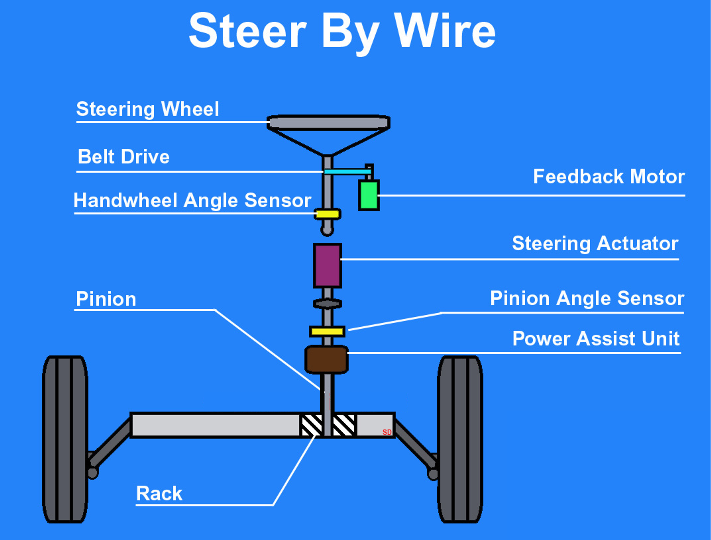

---
# Jekyll 'Front Matter' goes here. Most are set by default, and should NOT be
# overwritten except in special circumstances. 
# You should set the date the article was last updated like this:
date: 2022-12-07 # YYYY-MM-DD
# This will be displayed at the bottom of the article
# You should set the article's title:
title: Drive-by-wire Conversion for Autonomous Vehicle
# The 'title' is automatically displayed at the top of the page
# and used in other parts of the site.
---
Drive by wire technology in the automotive or aviation industry is the use of electrical or electromechanical systems for performing vehicle functions traditionally achieved by mechanical linkages. This technology replaces the traditional mechanical control systems with electronic control systems using electromechanical actuators and human–machine interfaces such as pedal and steering feel emulators. 

In the autonomous driving vehicle applications, the drive-by-wire system enables the autonomous software, or teleoperation software, to provide commands to the vehicle, using control methodology to steer, brake, accelerate and change gear where necessary, whilst also passing back data on the current vehicle “state”. In terms of uses in passenger cars, the drive-by-wire vehicle contains “throttle-by-wire”, “brake-by-wire”, “steer-by-wire” and “park-by-wire”. Modern DBW systems consist of an electronic pedal assembly that has redundant pedal position sensors where the pedal assembly features two position sensors that send the pedal position information to the ECU.

## Types of Drive-by-wire Systems

In a typical hydraulic and mechanical system, there's a big tangle of parts that control different aspects of the vehicle's operation. Connected throughout the car is the brake booster, master cylinder, steering column, steering shaft, rack-and-pinion gear, hydraulic lines and various cables and links. These components work together and independently to give us a smooth driving experience. However, they also add weight to the vehicle and a potential for degradation over time.

In a drive-by-wire system, most or all of this would be replaced by electrical wires. In any type of by-wire system, sensors record information and pass data to a computer or a series of computers, which transfer the electrical energy into mechanical motion. There are several different types of drive-by-wire systems, which is why it's sometimes referred to generally as x-by-wire. Here are a few of the main by-wire systems:

### Throttle-by-wire
Throttle-by-wire, or accelerate-by-wire, was the first type of drive-by-wire system introduced. These systems use a pedal unit and an engine management system. The pedal uses sensors that measure how much or how little the driver moves the accelerator, and the sensors send that information to the engine management system. The engine management system is a computer that, among other tasks, determines how much fuel is required, and it provides this input to an actuator -- a device that converts energy into mechanical motion. The pedal could be the same pedal drivers have become accustomed to using today, an easy-to-reach pad placed near the foot that's pressed down in order to accelerate the car. The same operation could also be incorporated into a joystick or videogame-like controller, which would get rid of the need for a foot pedal completely. Of course, this would require drivers to use their hands for acceleration, braking and steering.

As shown in the figure below, With throttle by wire a sensor is attached to the gas pedal and detects how far it has been pressed. This information is then sent down a wire to the car's computer. The computer analyzes the information and commands a motor to open the butterfly in the throttle body. Since the computer is in control of the throttle opening things like idle speed control, cruise control, and traction control can easily be integrated. Because automatic transmissions are also usually controlled by the computer it can adjust the throttle during gear changes. It also allows the addition of eco or sport buttons to change the way the throttle reacts when pressed, increasing fuel economy or throttle response.

### Brake-by-wire
There are two types of brake-by-wire systems. Hydraulic, or "wet," brake-by-wire uses additional hydraulic parts to create pressure on the brakes. Electric, or "dry," brake-by-wire, on the other hand, simply uses an electric motor and no hydraulic brake fluid.

Brake-by-wire technology is seen by some as more dangerous than electronic throttle control because it involves removing the physical connection between the driver and the brakes. However, brake-by-wire is a spectrum of technologies that range from electro-hydraulic to electromechanical systems, and both can be designed with fail-safes in mind.

Traditional hydraulic brakes make use of a master cylinder, as well as several slave cylinders. When the driver pushes on the brake pedal, it applies physical pressure to the master cylinder. In most cases, that pressure is amplified by a vacuum or hydraulic brake booster. The pressure is then transmitted via brake lines to the brake calipers or wheel cylinders.

Anti-lock brake systems were early precursors of modern brake-by-wire technologies, in that they allowed the brakes of a vehicle to be pulled automatically with no driver input. This is accomplished by an electronic actuator that activates the existing hydraulic brakes. Other safety technologies have been built on this foundation. Electronic stability control, traction control, and automatic braking systems depend on ABS and are peripherally related to brake-by-wire technology.

In vehicles that use electro-hydraulic brake-by-wire technology, the calipers located in each wheel are still hydraulically activated. However, they are not directly coupled to a master cylinder that is activated by pushing on the brake pedal. Instead, pushing on the brake pedal activates a series of sensors. The control unit then determines how much braking force is required at each wheel and activates the hydraulic calipers as needed.

In electromechanical brake systems, there is no hydraulic component. These true brake-by-wire systems still use sensors to determine how much brake force is required, but that force is not transmitted via hydraulics. Instead, electromechanical actuators activate the brakes located in each wheel.

### Steer-by-wire
Sensors detect the movements of the steering wheel and send information to a microprocessor. The computer then sends commands to actuators on the axles, which turn according to the driver's directions.

Most vehicles use a rack-and-pinion unit or worm-and-sector steering gear that is physically connected to the steering wheel. When the steering wheel is rotated, the rack-and-pinion unit or steering box also turns. A rack-and-pinion unit can then apply torque to the ball joints via tie rods, and a steering box will typically move the steering linkage via a pitman's arm.

As shown in the figure below, in vehicles that are equipped with steer-by-wire technology, there is no physical connection between the steering wheel and the tires. Steer-by-wire systems don't technically need to use steering wheels at all. When a steering wheel is used, some type of steering feel emulator is typically used to provide the driver with feedback.

## Benefits and Drawbacks of Drive-by-wire Systems
Some people are excited about the prospect of more drive-by-wire systems in cars. By replacing conventional throttle systems, drive-by-wire systems can significantly reduce the number of moving parts in a vehicle. This reduces weight, increases operational accuracy and stretches out the time between service visits for things like mechanical maintenance and other adjustments. Some by-wire systems wouldn't even require service at all. Less weight and better accuracy would equal better fuel efficiency and fewer emissions, too.

Although it's well-established in the airline industry, drive-by-wire has been slow in its introduction to the car. The problem for some car manufacturers is in convincing drivers that the systems are safe. Because of the complexity of drive-by-wire systems, some people worry about potential electronic malfunctions in sensors and computers, leading to vehicle damage or even car accidents and passenger injury.

One argument against drive-by-wire is that any system using software has the ability to fail regardless of how many times that software has been tested. In a worst-case scenario, for example, the sensors on a brake-by-wire system could make an error in calculation, causing the brake caliper and pads to apply an incorrect amount of pressure -- either too light or too strong -- to the rotor. Unaware of any internal system problems, the driver using the brake-by-wire system could potentially get into an accident, even though he or she thought the correct amount of pressure was being placed on the brake pedal.

In any case, most people refer to the saying that any software is only as good as the programmers and manufacturers who built and designed it. Because of the reliability of fly-by-wire in airplanes, it's likely that experience and product testing could bring more drive-by-wire systems safely to everyday cars. Several car companies are already using (or have used) various drive-by-wire systems in their vehicles, including BMW, Mercedes-Benz, Land Rover, Toyota, GM, Volkswagen and Nissan.

## References
- [Quick Tech | Drive-By-Wire Throttle Systems - DSPORT Magazine](https://dsportmag.com/the-tech/education/quick-tech-drive-by-wire-throttle-systems/)
- [What is Drive By Wire Technology in cars and How it works? Know More. - CarBikeTech](https://carbiketech.com/drive-by-wire-technology-working/)
- [Electronic Throttle Control (Drive By Wire)](https://www.picoauto.com/library/training/electronic-throttle-control-drive-by-wire-or-fly-by-wire)
