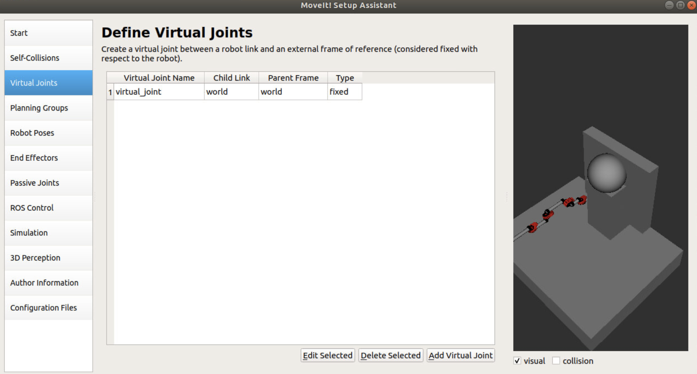
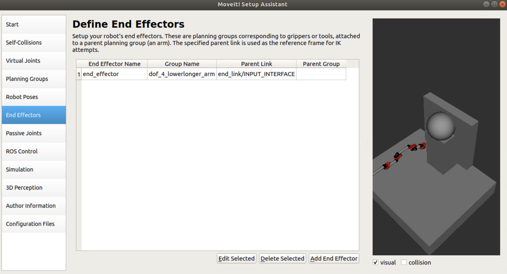
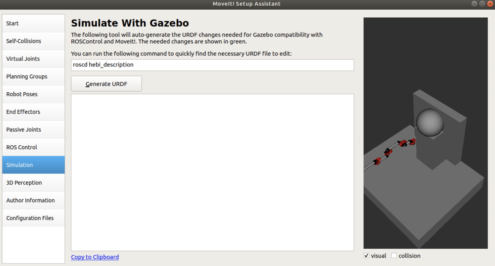
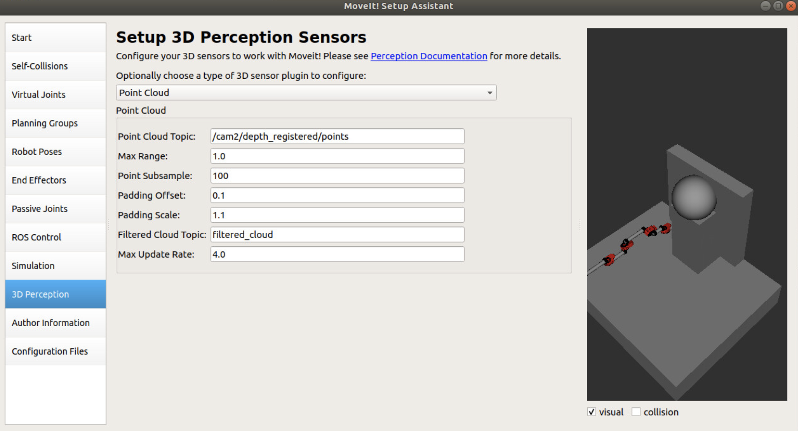
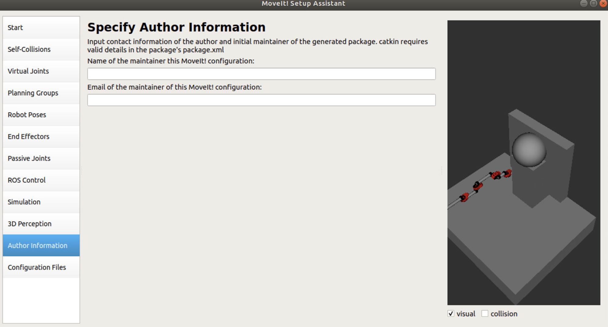
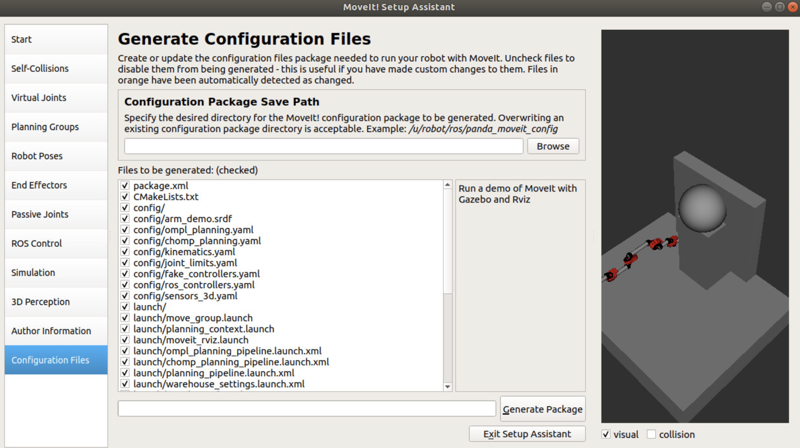

---
# Jekyll 'Front Matter' goes here. Most are set by default, and should NOT be
# overwritten except in special circumstances. 
# You should set the date the article was last updated like this:
date: 2021-11-29 # YYYY-MM-DD
# This will be displayed at the bottom of the article
# You should set the article's title:
title: MoveIt Motion Planning and HEBI Actuator Setup and Integration
# The 'title' is automatically displayed at the top of the page
# and used in other parts of the site.
---


## Overview
MoveIt is a package within ROS primarily used to plan and actuate robot manipulators and mobile platforms. The package includes multiple path planning libraries, a framework to simulate robots within ROS using Gazebo, and plugins to dynamically build 3D occupancy maps for obstacle avoidance. There is also functionality to control physical motors and actuators using MoveIt controllers.

For robotics projects that require a lot of these capabilities, using MoveIt within the ROS framework is a common occurrence and there are a plethora of ways to go about integrating MoveIt with a robotic system. The purpose of this article is to outline the basic setup and configuration of a robot model within MoveIt as well as an example integration of MoveIt with a series manipulator arm that has four HEBI X-series series elastic actuators. This particular integration method was done by Team C from the 2022 MRSD class at Carnegie Mellon University. The system architecture may not adhere to the common architectures of MoveIt but serves as a potential design method for future projects. In addition, these steps adhere particularly to MoveIt 1.0 on Ubuntu 18.04 systems running the ROS Melodic framework.

### Requirements
1. Ubuntu 18.04 operating system
2. ROS Melodic framework

## Installation
To install the necessary MoveIt packages through terminal, type the following:


```
sudo apt install ros-melodic-moveit
sudo apt install ros-melodic-moveit-visual-tools
```

## How to run a MoveIt pipeline
To run a robot manipulator pipeline using MoveIt, you would first need to create the model of the manipulator arm. This is done by creating a URDF model, which is essentially a 3D geometric representation of the robot.

In brief, the URDF model file is created when converting from a xacro xml description of the robot model into a URDF model. For a detailed tutorial on how to build simple xacro and URDF models, look to the following tutorials:

[The Construct tutorial #1: Basic URDF & RViz](https://www.youtube.com/watch?v=Ale55LcdZeE)
[The Construct tutorial #2: URDF + Xacro](https://www.youtube.com/watch?v=2lfwBpH-Ty8)

### Create xacro file and URDF model
To create the xacro .xml file, you would need both the basic geometries of the robot and the joints of the model. By defining the joints, MoveIt can actuate these joints. 

Assuming the xacro file of the robot model has been built, you can convert the xacro file into a URDF model file using the following command (make sure you source setup.bash in order to utilize ROS commands through terminal):

```
rosrun xacro xacro (input-xacro-filename).xml > (desired-urdf-filename).urdf
```

Once the command finishes running, a URDF file of the desired name should appear in the same directory as the xacro .xml file or in the specified desired directory.

### Run through MoveIt setup manager GUI
Once you have the model, it is time to run the MoveIt setup manager GUI. On a terminal, type the following command (make sure to source setup.bash to use ROS commands through terminal):

```
rosrun moveit_setup_assistant setup_assistant.launch
```

From here, you will be launched into a MoveIt setup assistant menu, as shown below:


The best option to choose here is to slide the “Sampling Density” slider all the way to the right to the highest density setting. With this setting, the GUI will compute all pairs of geometries that can collide with each other and pairs that will definitely not. Select “Generate Collision Matrix” to compute the non-colliding geometry pairs of the model.

The next option window is the virtual joints window. Here, you would configure a robot link with an external frame of reference that is fixed. In this particular case you can configure the world frame to the world frame as a virtual joint if you want the origin point of the robot arm to be the same as the URDF file.



The next window is the “Planning Groups” window. Here, you would configure the joint groups of the robot model. There are many ways to go about this, but one method is to create a kinetic chain of joints, given you are working with a serial manipulator arm. 


Select “Add Group”. Fill in a name for the planning group you are using. Next, select “Kinematic Solver”. The most common solver is the “kdl_kinematics_plugin/KDLKinematicsPlugin” option. Next, select the “Group Default Planner”. The most common planner is “RRTConnect”. The next step is to define your kinematic chain. Select “Add Kin. Chain” option. Given how you set up your URDF model, the chain of joints and linkages should be created and shown for you. All you have to do is to select the base link, which is the “world” link, and the tip link which is the “end_link/INPUT_INTERFACE” in this case. Afterwards, select “Save”. 

NOTE: There are tutorials available online that go through the “Add Joints” method to create the planning group, which can be another viable configuration option to explore.


Moving onto “Robot Poses”, you can configure different preset positions of the robot. In the screenshot below, preset positions were made for when the serial manipulator arm is stretched out, compacted in, and in an intermediate position. Create however many preset poses you desire.


The next window is the “End Effectors” window. For this particular article, I will not go into the details of configuring an actuated end effector. Instead, this particular project opted to go for a simple end effector and as such configured a simple one through MoveIt. Essentially, the tip link configured in the kinetic chain portion of the setup was selected as the “Parent Link” of the end effector.



The “Passive Joints” section of the setup was autofilled, so we can skip the details of this window.


The next window “ROS Control” can be an important one. Here, you can configure a ROS controller to control the physical hardware of your robot. This can be important if you want the MoveIt pipeline to directly interface with your motors and actuators using different control schemes such as effort, velocity, or position controllers. In our case, we opted to use the simulation portion of the ROS controller, which is essentially a fake joint controller. 


The next window is the “Simulation” window. By selecting the “Generate URDF” option, you can generate replacement URDF code to input to your URDF file in order to have the model working on Gazebo, which is the ROS simulation environment. Simply copy and paste the selected code over to your URDF file code.



In the “3D perception” window, you can configure a point cloud or depth map topic to interface with MoveIt. Here, the Octomap plugin for MoveIt will look at this topic and configure obstacles within the environment, as shown in RViz. This is an important window if you want to configure dynamic obstacles for the robot to be aware of and avoid.



The next window is “Author Information” within which you would fill in your name and the email of the maintainer of this ROS MoveIt node.



Finally, within the “Configuration File” portion of the setup assistant, the GUI will drop all the configured files to a set folder location. If this is a first-time setup, normally you would like to check off all the selected file options. Otherwise, you may want to only drop the files that you have changed since the last setup instance. Specify a “Configuration Package Save Path” location and select “Generate Package”. Once that is completed, you can select “Exit Setup Assistant”.




### Simulate URDF model through Rviz

Once you have run through the setup assistant pipeline, you can now run a demo of the robot. MoveIt has already created a launch file to launch the robot, so all you need to do is call the launch file through the terminal.

```
roslaunch (MoveIt-node-folder-name) demo.launch
```

From here, you can move the robot arm to your preset positions or move the arm through various other states by dragging-and-dropping the arm into different positions.

## Setting Up MoveIt with ROS
To use MoveIt within ROS, modify the CMakeLists.txt file in the following sections:
```
find_package(catkin REQUIRED COMPONENTS
...
moveit_core
moveit_ros_planning_interface
moveit_visual_tools
rviz_visual_tools
...
)

catkin_package(
...
moveit_core
moveit_ros_planning_interface
...
)
``` 

Refer to the official MoveIt tutorials in order to get the robot up and running using the MoveIt pipeline through ROS. It is recommended to code the MoveIt pipeline through C++. 

[MoveIt Tutorials for ROS](https://ros-planning.github.io/moveit_tutorials/)

In particular, the “Move Group C++ Interface” tutorial is a good starting point to get the MoveIt pipeline up and running. Following the tutorial, one can run a simple pose or joint goal target on the simulated robot and observe the arm plan and move through RViz. Note that in order to run the code on the simulated robot, you would need to launch the robot model beforehand. You can doing this by running the demo.launch command before running your custom MoveIt code:
```
roslaunch (MoveIt-node-folder-name) demo.launch
```
After launching the robot model, your path-planning software will send trajectory commands to the motors so that your robot can execute the planned path. A demo of MoveIt’s path planning capabilities can be viewed by running the following command, after launching the robot model with demo.launch:
```
roslaunch (MoveIt-node-folder-name) move_group_tutorial_interface.launch
```
Analyzing the code in this file will help you understand how to operate MoveIt from code. The first step is to initialize the different variables that MoveIt uses to perform its operations. You’ll be creating a planning group, move group, joint model group pointer, and planning scene interface.  The planning group is just a string that references the exact robot that you’ll be planning with.  The move group creates an instance of that specific robot that can be commanded by the user. The joint model group pointer is used to set the starting position of the robot arm for both planning and visualization.  Finally, the planning scene interface creates a virtual environment that can be populated with objects and obstacles for the robot to interact with.  After the initial robot is set up, initializing visual tools will allow you to view your robot and the planning scene interface for both feedback and control of your system.  Now that everything is established you can set a variety of goals for your robot by filling in geometry_msgs pose targets or goal targets and pushing them to the move group.  Once all of your desired goals are set, using move_group.plan command will trigger MoveIt to develop a plan for your robot.  You can check this plan for success and then, if successful, execute the plan through the move_group.execute command.  Congratulations, now you’re Moving It!

## Setting Up HEBI with ROS
Now that we have the MoveIt motion planning pipeline configured for the robot, we can focus on the hardware portion of the robot. Normally, you would create a ROS controller in MoveIt setup assistant and configure both the controller and the hardware to move together. For this particular project, however, we found success in maintaining a fake joint states controller for the MoveIt pipeline and having the hardware motors read off the joint states topic and follow accordingly. For this particular case, we used HEBI motors and the HEBI C++ API in order to get the motors up and running.

To install HEBI dependencies, input the following:
```
sudo apt install ros-melodic-hebi-cpp-api
```

Next, you will need to navigate to your catkin workspace src directory and clone the necessary GIT repositories from HEBI:

```
git clone https://github.com/HebiRobotics/hebi_description.git
```

NOTE: The HEBI’s hebi_description repository contains .xml marco files for their motors and brackets. So if you are using HEBI as part of your robot, it would be best to incorporate these xacro macros in your robot model xacro and URDF models.

Within your CMakeLists.txt file, include the following in the following sections:
```
find_package(catkin REQUIRED_COMPONENTS
…
hebi_cpp_api
...
)
```

```
catkin_package(
…
hebi_cpp_api
...
)
```

Within your package.xml file, include the following in the following sections:
```
<depend>hebi_cpp_api</depend>
```

Once you have the HEBI motors installed on the robot, connect to the HEBI motors using the Scope program provided by HEBI:
[HEBI Scope download page](https://www.hebirobotics.com/apps)

Here, you can configure different aspects of each motor including their IP addresses, family names, motor names, effort limits, and internal PID gains. The more important fields to configure in order to get the motors up and running would be the family names and motor names. 

For tutorials on how to run HEBI through C++ using the ROS framework, refer to the C++ API documentation from HEBI:
[HEBI C++ API Documentation](https://docs.hebi.us/tools.html#cpp-api)

For this particular project, the main control scheme inputted to the HEBI motors were position commands. This fits well with our particular use case but there may be applications where one would need effort or velocity controls instead. In addition, HEBI supports multi-layered commands so users can send position, velocity, and/or effort commands within one command to the HEBI motors and the internal controllers of the motors will balance the different goals during actuation. See HEBI’s control scheme documentation for further details:

[HEBI Motor Control Strategies](https://docs.hebi.us/core_concepts.html#control-strategies)


## Integrating HEBI API with MoveIt
There can be multiple ways to integrate the HEBI API with MoveIt, but the method being discussed in this document would be to have the MoveIt pipeline run a simulated model of the robot using fake joints and the HEBI motors follow that simulated model through a ROS topic subscription to MoveIt. There can be a number of advantages and disadvantages to this method. The advantages are:

Can maintain a clean state of the robot throughout time that is not affected by the noise and external disturbances on the physical motor encoders.
Can maintain the most recent state to memory such that, when the motors die and come back online, they can immediately go to the most recent joint state of the simulated model.

The disadvantages are:

Implementing your own impedance or position controls takes additional steps to perform. Here, you would need to publish all your motor hardware feedback values through a separate ROS topic that you would have to manually subscribe to.
Implementing low-level controllers that directly talk to the motors can be tricky. When you start using low-level controllers, the physical robot arm will move around while the simulated arm will stay at its most recent position. This may be a challenge if you are using the Octomap dynamic obstacle detection and MoveIt sees the arm as an obstacle because it is not within where the simulated arm is.
The motors can experience some jerking motions during plan execution, especially if the motors were not at the starting position of the trajectory to begin with.

Overall, the method here was to implement two separate ROS nodes, one node to initialize the MoveIt robot model, perform path planning, and output joint states and the other ROS node to communicate to the physical motors, subscribe to MoveIt’s joint states topic, and send position commands to the physical motors. For example, MoveIt publishes the joint states of the robot model constantly through the /joint_states ROS topic. A HEBI node could subscribe to the /joint_states topic, translate the subscribed message to joint positions for each HEBI motor, and send those commands to the HEBI motors via a HEBI command.

Given the demo.launch file given by MoveIt, which launches the robot model amongst other necessities, the custom MoveIt API node, and the custom HEBI motor control node, one would launch the nodes in this succession:

```
roslaunch (MoveIt-node-folder-name) demo.launch
roslaunch (ROS-node) (custom-MoveIt-node).launch
roslaunch (ROS-node) (custom-HEBI-node).launch
```

This way, the robot model and description launch first, then the custom MoveIt node is able to use the robot model to move the robot and publish joints to /joint_states. Then the custom HEBI motors are able to read off those /joint_states and publish directly to the physical motors.


## Summary
Overall, this article aimed to present a potential method on how to integrate MoveIt’s versatile package with ROS and connect it with hardware motors, such as the HEBI motors. There can be other ways to build out the planning and actuation architecture within the ROS framework and hopefully this article provides a viable method to build out your robot design.

## See Also
- [Moveit Perception Pipeline Tutorial](https://ros-planning.github.io/moveit_tutorials/doc/perception_pipeline/perception_pipeline_tutorial.html)
- [Octomap Main Webpage](https://octomap.github.io)

## Further Reading
- [MoveIt Setup Assistant GUI Tutorial](https://www.youtube.com/watch?v=QdzmMRXAks4&t=789s)

## References
- [MoveIt Tutorials for ROS](https://ros-planning.github.io/moveit_tutorials/)
- [The Construct tutorial #1: Basic URDF & RViz](https://www.youtube.com/watch?v=Ale55LcdZeE)
- [The Construct tutorial #2: URDF + Xacro](https://www.youtube.com/watch?v=2lfwBpH-Ty8)
- [HEBI Scope download page](https://www.hebirobotics.com/apps)
- [HEBI C++ API Documentation](https://docs.hebi.us/tools.html#cpp-api)


