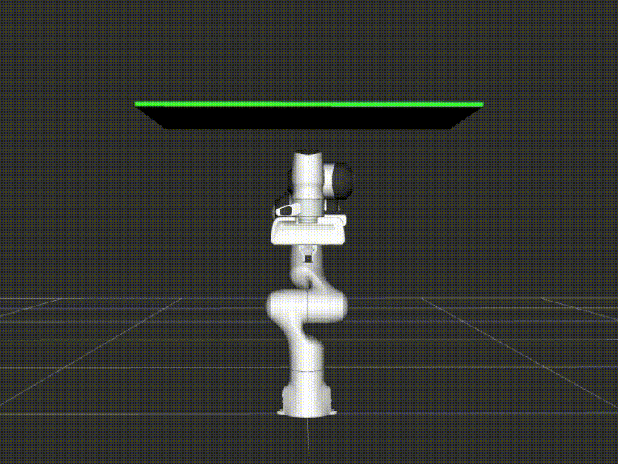

---
# Jekyll 'Front Matter' goes here. Most are set by default, and should NOT be
# overwritten except in special circumstances. 
# You should set the date the article was last updated like this:
date: 2024-12-03 # YYYY-MM-DD
# This will be displayed at the bottom of the article
# You should set the article's title:
title: MoveIt Hybrid Planning Architecture for Motion Compensation
# The 'title' is automatically displayed at the top of the page
# and used in other parts of the site.
---
# MoveIt Hybrid Planning Architecture for Motion Compensation

The collaboration between a global planner and a local planner is often seen in the autonomous driving context. The global planner will generate a path for the local planner to follow. However, in a manipulator planning context, it still mostly follows the “Sense-Plan-Act” approach, thus not applicable in many real-world applications, particularly in unstable or dynamic environments. To address this issue, the MoveIt team developed the Hybrid Planning architecture for manipulators.  

*Typical Planning Architecture for Autonomous Vehicles*

## Architecture

*MoveIt Hybrid Planning Example Architecture*

The architecture has three components: the Hybrid Planning Manager (hereafter referred to as Manager), the Global Planner, and the Local Planner. The architecture is highly customizable. By changing the C++ plugin in the components, it can be adapted to different use cases. The MoveIt team provides an example of using the architecture to account for dynamic obstacles.   
The Manager is in charge of taking planning requests, and it will request the Global Planner to plan a trajectory. Inside Global Planner, its plugin logic is a MoveIt Cpp that can plan to the goal using the RRTConnect planner in OMPL. The local planner in this example is not planning; it only executes the plan generated by the Global Planner. While execution, if there is an obstacle on the trajectory, the local planner will stop the execution and ask the Global Planner to replan. Thus, we will have the effect as shown in the figure below. The Global Planner first plans a path through the side, but when the Local Planner is executing, it finds the obstacle in the path. The Local Planner reports this to the Manager, and then the Manager will ask the Global Planner to replan according to the latest planning scene. Thus, the manipulator still successfully reached the goal in the end.  
 
*MoveIt Hybrid Planning example \- Dynamic Obstacles*

## Customization

In our settings, we want to do bone motion compensation. This requires us to keep tracking the pose. Our idea is to use the Manager to detect the magnitude of the bone motion. If it is a large bone motion (Euclidean displacement \> 7 cm), the  Manager will request the Global Planner to plan a trajectory. If it is a small bone motion (Euclidean displacement \<= 7 cm), the Manager will request the Local Planner to go directly to the new pose.  
We adapt the architecture to our needs to fulfill the use case mentioned above. First, we use pick\_ik inverse kinematics solver in the Manager to let our planner have a joint space goal instead of a cartesian goal. This can improve the Global Planner's performance and enable the Local Planner to execute the goal directly. The Manager also subscribes to the GUI to receive messages to change the state of itself. For example, the transition from the tracking state to the drilling state or from the execution state to the pause state.  
 
*Our Hybrid Planning Architecture for motion compensation*

Upon receiving the pose message, the Manager would request the global planner to plan a path to the goal. After the Global Planner returns the path, the Manager sends out the request that contains the path to the Local Planner for execution. In the meantime, if there is a motion from the previous pose at any time, the Manager will check the magnitude of the motion and may request the Global Planner to plan or directly request the Local Planner to compensate for the motion.  
Our Local Planner runs at a frequency of 10 Hz. In every execution loop, the local planner takes a small chunk of the reference trajectory to execute. The action server receives trajectory messages from the Manager and can modify the reference trajectory accordingly. This can either be the path planned by the global planner or the IK solution directly from the manager.  
 
*Close-up look for Local Planner*

With this reference trajectory as a buffer, our planned path can be smooth even if there is frequent motion in the scene.

## MoveItCpp, Composable Node, and ROS2 Parameter

Unlike the common Move Group Interface, the hybrid planning architecture utilizes MoveItCpp as the Global Planner. MoveItCpp provides more granular control than Move Group Interface but is less documented. To configure MoveItCpp, the parameters must be set under different parameter namespaces. Declaring these parameters one by one is annoying. Instead, we can automatically declare and set the parameters by passing YAML files inside the launch files and enabling two Node options (automatically\_declare\_parameters\_from\_overrides, allow\_undeclared\_parameters) when creating the node.

Also, the three components are not separate nodes. They are all composable nodes inside a single Composable Node Container. Using composable nodes, we can run three components within a single process and thus improve message exchange performance and memory efficiency.  However, one drawback is that the two node options (automatically\_declare\_parameters\_from\_overrides, allow\_undeclared\_parameters) cannot be set successfully. Thus, we have to declare every parameter in the code explicitly.

## References

*Hybrid Planning*  
[https://www.cs.cmu.edu/\~maxim/classes/robotplanning\_grad/lectures/casestudy\_autodriving\_16782\_fall24.pdf](https://www.cs.cmu.edu/~maxim/classes/robotplanning_grad/lectures/casestudy_autodriving_16782_fall24.pdf)  
[https://moveit.picknik.ai/main/doc/concepts/hybrid\_planning/hybrid\_planning.html](https://moveit.picknik.ai/main/doc/concepts/hybrid_planning/hybrid_planning.html)  
[https://moveit.picknik.ai/main/doc/examples/hybrid\_planning/hybrid\_planning\_tutorial.html](https://moveit.picknik.ai/main/doc/examples/hybrid_planning/hybrid_planning_tutorial.html)  
*MoveItCpp and Moveit Configuration*  
[https://github.com/moveit/moveit/issues/2581](https://github.com/moveit/moveit/issues/2581)  
[https://moveit.picknik.ai/humble/doc/examples/moveit\_cpp/moveitcpp\_tutorial.html](https://moveit.picknik.ai/humble/doc/examples/moveit_cpp/moveitcpp_tutorial.html)  
[https://automaticaddison.com/how-to-configure-moveit-2-for-a-simulated-robot-arm/](https://automaticaddison.com/how-to-configure-moveit-2-for-a-simulated-robot-arm/)  
*Composition*  
[https://docs.ros.org/en/foxy/Tutorials/Intermediate/Composition.html](https://docs.ros.org/en/foxy/Tutorials/Intermediate/Composition.html)  
[https://docs.ros.org/en/humble/Tutorials/Intermediate/Writing-a-Composable-Node.html](https://docs.ros.org/en/humble/Tutorials/Intermediate/Writing-a-Composable-Node.html)  
[https://docs.ros.org/en/foxy/Concepts/About-Composition.html](https://docs.ros.org/en/foxy/Concepts/About-Composition.html)  
*ParaDocs’ Implementation*  
[https://github.com/team-paradocs/tekkneeca](https://github.com/team-paradocs/tekkneeca)
