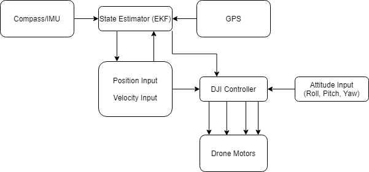
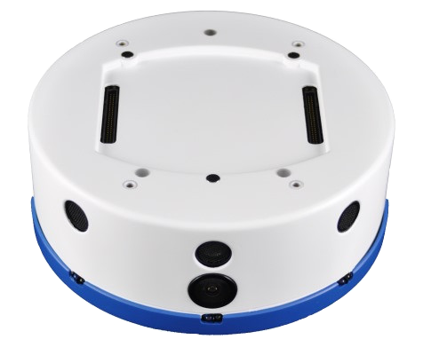
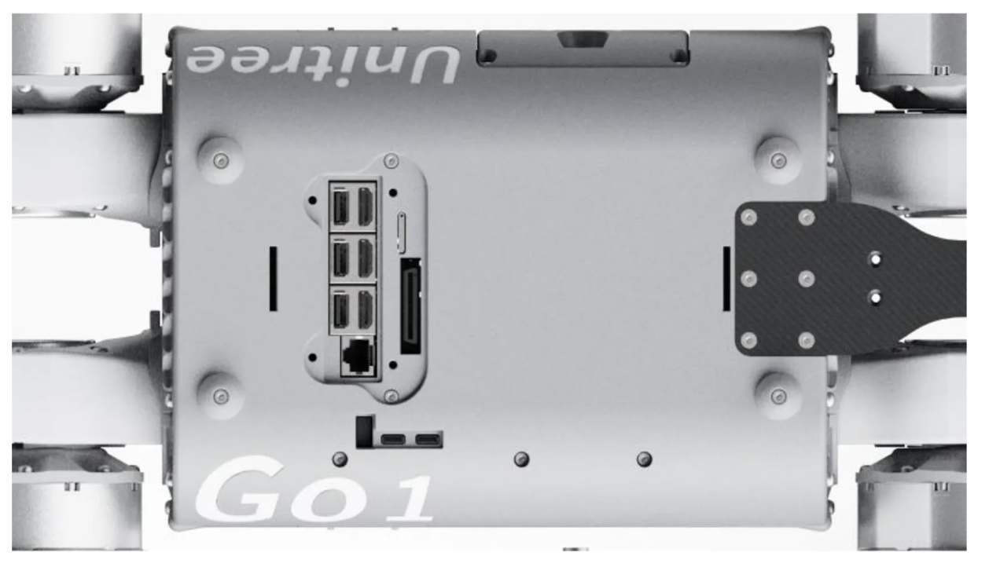
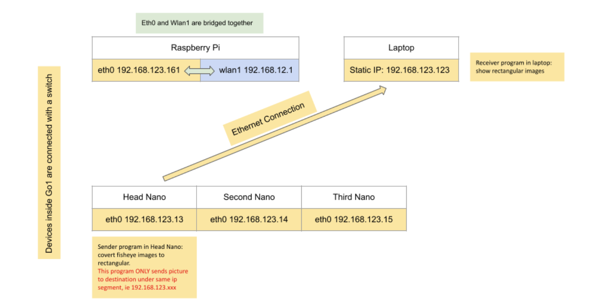
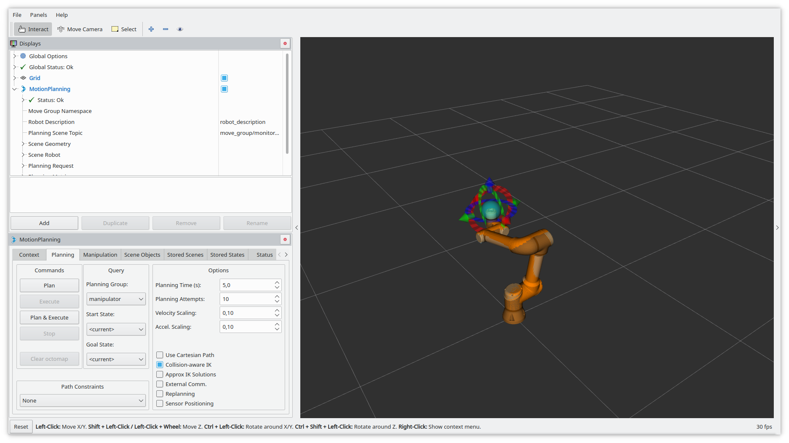
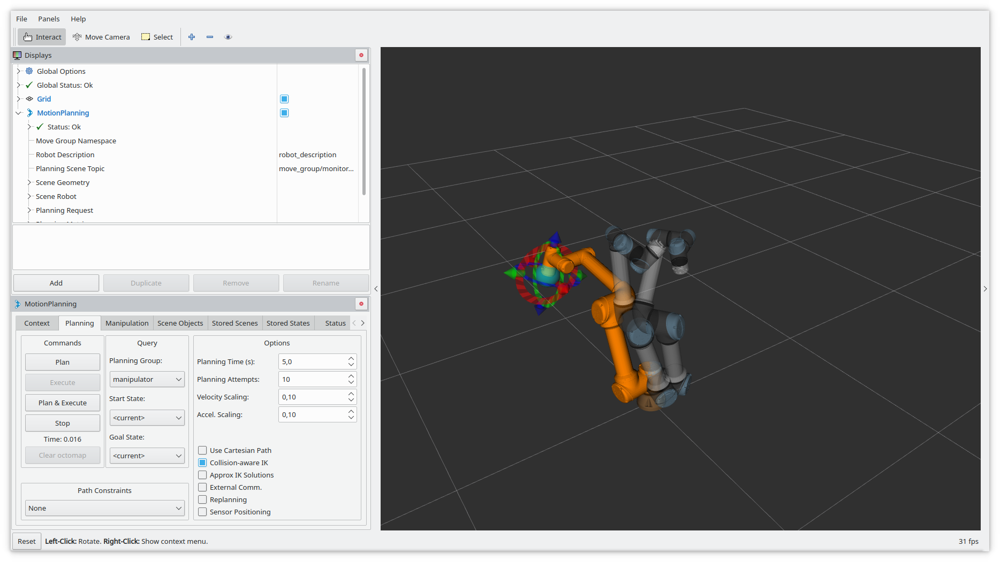

/wiki/common-platforms/asctec-uav-setup-guide/
---
date: 2019-03-05
title: Asctec Pelican UAV Setup Guidance
---

This document acts as a tutorial on how to set up a [Asctec Pelican UAV](http://www.asctec.de/en/uav-uas-drones-rpas-roav/asctec-pelican/) for autonomous waypoint navigation using ros pakage [asctec_mav_framework](http://wiki.ros.org/asctec_mav_framework). We are setting up an Asctec Quadrotor Pelican running with Ubuntu 14.04 and pre-installed ROS-jade.
<div style="text-align:center" markdown="1">


</div>


# Table of Contents
- [Table of Contents](#table-of-contents)
  - [Useful Sites](#useful-sites)
  - [System Overview](#system-overview)
  - [Setup Network and SSH](#setup-network-and-ssh)
  - [Install ROS Packages](#install-ros-packages)
  - [Flash Programs in the HLP](#flash-programs-in-the-hlp)
  - [Run the ROS package on Atomboard](#run-the-ros-package-on-atomboard)
  - [Summary](#summary)
  - [References](#references)
  - [/wiki/common-platforms/dji-drone-breakdown-for-technical-projects/](#wikicommon-platformsdji-drone-breakdown-for-technical-projects)
  - [published: true](#published-true)
  - [Controller Drawbacks](#controller-drawbacks)
  - [DJI flight modes](#dji-flight-modes)
    - [Positioning Mode (P-Mode)](#positioning-mode-p-mode)
    - [Attitude Mode (ATTI Mode)](#attitude-mode-atti-mode)
    - [F-mode](#f-mode)
  - [Drone project Tips](#drone-project-tips)
  - [Safety Tips](#safety-tips)
  - [Summary](#summary-1)
  - [See Also:](#see-also)
  - [/wiki/common-platforms/dji-sdk/](#wikicommon-platformsdji-sdk)
  - [title: Outdoor UAV navigation (focus on DJI SDK)](#title-outdoor-uav-navigation-focus-on-dji-sdk)
  - [Importance of using a Compass](#importance-of-using-a-compass)
  - [Waypoint Navigation](#waypoint-navigation)
  - [/wiki/common-platforms/hello-robot/](#wikicommon-platformshello-robot)
  - [title: Workign with the Hello Robot Stretch RE1](#title-workign-with-the-hello-robot-stretch-re1)
  - [The HelloNode Class](#the-hellonode-class)
    - [get\_wrist\_state(joint\_states)](#get_wrist_statejoint_states)
    - [get\_lift\_state(joint\_states)](#get_lift_statejoint_states)
    - [get\_left\_finger\_state(joint\_states)](#get_left_finger_statejoint_states)
    - [get\_p1\_to\_p2\_matrix(\<p1\_frame\_id\>, \<p2\_frame\_id\>, tf2\_buffer, lookup\_time=None, timeout\_s=None)](#get_p1_to_p2_matrixp1_frame_id-p2_frame_id-tf2_buffer-lookup_timenone-timeout_snone)
    - [move\_to\_pose(pose)](#move_to_posepose)
    - [get\_robot\_floor\_pose\_xya()](#get_robot_floor_pose_xya)
  - [The ToolShare Class](#the-toolshare-class)
  - [Summary](#summary-2)
  - [See Also:](#see-also-1)
  - [Further Reading](#further-reading)
  - [/wiki/common-platforms/husky\_interfacing\_and\_communication/](#wikicommon-platformshusky_interfacing_and_communication)
  - [title: Husky Interfacing and Communication](#title-husky-interfacing-and-communication)
  - [Husky Onboard Controller:](#husky-onboard-controller)
  - [Husky Teleoperation](#husky-teleoperation)
  - [Husky Localization](#husky-localization)
  - [Summary](#summary-3)
  - [/wiki/common-platforms/khepera4/](#wikicommon-platformskhepera4)
  - [published: true](#published-true-1)
  - [Overview](#overview)
  - [Quick-start guide](#quick-start-guide)
    - [Programming](#programming)
    - [WiFi](#wifi)
    - [ssh \& scp](#ssh--scp)
  - [Example](#example)
  - [Summary](#summary-4)
  - [Further Reading](#further-reading-1)
  - [/wiki/common-platforms/pixhawk/](#wikicommon-platformspixhawk)
  - [title: Pixhawk UAV Platform](#title-pixhawk-uav-platform)
  - [Set Up](#set-up)
    - [Firmware](#firmware)
    - [Recommendation](#recommendation)
  - [Off-board Companion Computer](#off-board-companion-computer)
    - [Hardware](#hardware)
    - [Connecting to the Pixhawk](#connecting-to-the-pixhawk)
    - [Recommendations](#recommendations)
  - [Offboard Control](#offboard-control)
  - [UAV state monitoring](#uav-state-monitoring)
  - [Position Control](#position-control)
    - [Tips:](#tips)
  - [Velocity Control](#velocity-control)
    - [Recommendation](#recommendation-1)
  - [Setting up a simulator](#setting-up-a-simulator)
  - [Additional Resoursces](#additional-resoursces)
  - [/wiki/common-platforms/rccars-the-complete-guide/](#wikicommon-platformsrccars-the-complete-guide)
  - [published: true](#published-true-2)
  - [Chassis](#chassis)
  - [Electric Drive System](#electric-drive-system)
  - [Sensor suite for odometry](#sensor-suite-for-odometry)
  - [Microcontrollers and single board controllers](#microcontrollers-and-single-board-controllers)
  - [Configuring the VESC 6 EDU and controlling it via ROS Noetic deployed on a Raspberry Pi 4B.](#configuring-the-vesc-6-edu-and-controlling-it-via-ros-noetic-deployed-on-a-raspberry-pi-4b)
  - [See Also:](#see-also-2)
  - [References:](#references-1)
  - [/wiki/common-platforms/ros2-navigation-for-clearpath-husky/](#wikicommon-platformsros2-navigation-for-clearpath-husky)
  - [title: ROS 2 Navigation with the Clearpath Husky](#title-ros-2-navigation-with-the-clearpath-husky)
  - [ROS 1 - ROS 2 Bridge](#ros-1---ros-2-bridge)
  - [Navigation Stack](#navigation-stack)
  - [Summary](#summary-5)
  - [See Also:](#see-also-3)
  - [Further Readings:](#further-readings)
  - [/wiki/common-platforms/unitree-go1/](#wikicommon-platformsunitree-go1)
- [Jekyll 'Front Matter' goes here. Most are set by default, and should NOT be](#jekyll-front-matter-goes-here-most-are-set-by-default-and-should-not-be)
- [overwritten except in special circumstances.](#overwritten-except-in-special-circumstances)
- [You should set the date the article was last updated like this:](#you-should-set-the-date-the-article-was-last-updated-like-this)
- [This will be displayed at the bottom of the article](#this-will-be-displayed-at-the-bottom-of-the-article)
- [You should set the article's title:](#you-should-set-the-articles-title)
- [The 'title' is automatically displayed at the top of the page](#the-title-is-automatically-displayed-at-the-top-of-the-page)
- [and used in other parts of the site.](#and-used-in-other-parts-of-the-site)
  - [Form Factor](#form-factor)
  - [Power and Interface](#power-and-interface)
  - [Sensors and Processors](#sensors-and-processors)
  - [Network Configuration for Unitree Go1 Camera Streaming](#network-configuration-for-unitree-go1-camera-streaming)
  - [Wirelessly Stream Camera Feed from Unitree Go1's Head Cameras to Desktop](#wirelessly-stream-camera-feed-from-unitree-go1s-head-cameras-to-desktop)
  - [Controlling Unitree in Simulation and Real-World Scenarios](#controlling-unitree-in-simulation-and-real-world-scenarios)
    - [Introduction](#introduction)
    - [Controlling the Robot in Simulation](#controlling-the-robot-in-simulation)
    - [Controlling the Robot in Real-World Scenarios](#controlling-the-robot-in-real-world-scenarios)
  - [Summary](#summary-6)
  - [References](#references-2)
  - [/wiki/common-platforms/ur5e/](#wikicommon-platformsur5e)
  - [title: Universal Robots UR5e Collaborative Robotic Arm](#title-universal-robots-ur5e-collaborative-robotic-arm)
  - [Prepare the Robot](#prepare-the-robot)
  - [\[Optional\] Real-time Kernel Setup for Development Machine](#optional-real-time-kernel-setup-for-development-machine)
  - [Set up UR5e Drivers on Development Machine](#set-up-ur5e-drivers-on-development-machine)
  - [Networking Setup](#networking-setup)
  - [\[Optional\] Extract Calibration Information](#optional-extract-calibration-information)
  - [Running the UR5e Driver](#running-the-ur5e-driver)
  - [Controlling the UR5e using MoveIt](#controlling-the-ur5e-using-moveit)
  - [References](#references-3)

## Useful Sites
Before we start, here are some useful sites for Asctec Pelican Information:
- [Asctec Pelican Official Documentation](http://wiki.asctec.de/display/AR/AscTec+Research+Home): General Description of the system, user manual, SDK,etc. (some contents are outdated)
- [Asctec User Discussion Forum ](http://asctec-users.986163.n3.nabble.com/): Great for troubleshooting
- [asctec_mav_framework ROS wiki](http://wiki.ros.org/asctec_mav_framework): Interface with HLP
- [asctec_drivers](http://wiki.ros.org/Robots/AscTec): Interface with LLP
> **Note**: `asctec_drivers` is develped to enable on-board computer communicate with Low Level Processor (LLP), while`asctec_mav_framework` enable on-boad computer and High Level Processor (HLP) communication. You need to decide which package to use based on your hardware configuration.

## System Overview
The structure of control subsystem of Asctec Pelican is shown below

While the connection ports of AutoPilot Board is


>**Warning**: The [documentation](http://wiki.asctec.de/display/AR/AscTec+Atomboard) of Atomboard on-board computer on AscTec Wiki is based on **Atomboard 2** instead of **Atomboard 3**.

##  Setup Network and SSH
As we have an easy access to a monitor, a keyboard, and a mouse, we configed the network and ssh using a LVDS screen for the first time. [This blog](http://asctecbasics.blogspot.com/2013/06/basic-wifi-communication-setup-part-1.html) has detailed instruction if you need to set up the network without a screen. 

* After pluging in the monitor, keyboard and mouse, turn on the on-board computer. Follow the instruction on the screen to start the GUI. Setup WiFi connection and set up static IP (If you are using hotspot or standby WiFi router, the IP should be static usually). You can check the IP address using `ifconfig` command.

* Check if SSH is enabled on atomboard using `systemctl is-enabled ssh` and active `systemctl is-active ssh`. The output `enbaled` and `active`, but if not, go through [this link](http://ubuntuhandbook.org/index.php/2014/09/enable-ssh-in-ubuntu-14-10-server-desktop/) to enable ssh.
 
* Set up ssh on your **Master Computer** (your PC) use the above link as well.

* Test ssh: Connect your **Master Computer** to the same WiFi network with Atomboard and try `ssh asctec@IP_OF_ATOMBOARD` and enter the password (should be `asctec`).
* Configure `ROS_MASTER_URI` on **Atomboard**. Here we select our master computer to run the ros master, so use your favorite editor to open `~/.bashrc` and add 
    ```
     export ROS_MASTER_URI=YOUR_MASTER_COMPUTER_IP:11311
     export ROS_HOSTNAME=ATOMBOARD_IP
    ```
* Configure `ROS_MASTER_URI` on **Master Computer**. Again, use your favorite editor to open `~/.bashrc` and add 
    ```
    export ROS_MASTER_URI=YOUR_MASTER_COMPUTER_IP:11311
    export ROS_HOSTNAME=MASTER_COMPUTER_IP
    ```
* Now your Asctec Atomboard should be able to communicate with the master computer via ROS and you can run the talker/listener test to test described in [ROS Multimachine Tutorial](http://wiki.ros.org/ROS/Tutorials/MultipleMachines)to test the communication.

## Install ROS Packages
- Create a new catkin workspace
- git clone `asctec_mav_framework`
- Install all the required dependencies
    - bullet
- catkin_make
- Calibrate cameras

## Flash Programs in the HLP
- Download [AscTec SDK](http://wiki.asctec.de/display/AR/SDK+Downloads)
- Setup OpenOCD
    - [SDK Setup for Linux](http://wiki.asctec.de/display/AR/SDK+Setup+for+Linux)
    - [SDK Setup for Windows](http://wiki.asctec.de/display/AR/SDK+Setup+for+Windows)
        >**Note**: If the driver of JTAG is not properly installed, try to update the drivers in the device manager manually and point it to the `JTAG/oocd_link_treiber` subfolder in the AscTec_ARM_SDK installation folder. Windows tends to refuse this driver due to a missing signature. Please search for "Disable Windows Driver Signature Enforcement" for a tutorial on how to temporarily disable this check. Then you should be able to install the driver.
- If you are using Ubuntu 16.04 and openocd 0.8.0 or above, if you run the `sudo openocd -f lpc2xxx_asctecusbjtag05.cfg` when following the official instruction, you will run into this error:
    

    This is because openocd package update changes the syntax and no longer support ft2232. You can choose to either switch back to openocd 0.7.0 (which is not easy) or modify config file `lpc2xxx_asctecusbjtag05.cfg` to this.
    ```
    interface ftdi 

    #ftdi_layout_signal oocdlink 
    #ftdi_vid_pid 0x0403 0xbaf8 

    # Added by Onion 
    #ftdi_device_desc "OOCDLink" 
    ftdi_vid_pid 0x0403 0xbaf8 

    ftdi_layout_init 0x0508 0x0f1b 
    ftdi_layout_signal nTRST -data 0x0200 -noe 0x0100 
    ftdi_layout_signal nSRST -data 0x0800 -noe 0x0400 

    adapter_khz 5 
    telnet_port 4444 
    gdb_port 3333 

    # Use RCLK. If RCLK is not available fall back to 500kHz. 
    # 
    # Depending on cabling you might be able to eek this up to 2000kHz. 
    jtag_rclk 500 

    if { [info exists CHIPNAME] } { 
       set _CHIPNAME $CHIPNAME 
    } else { 
       set _CHIPNAME lpc2148 
    } 

    if { [info exists ENDIAN] } { 
       set _ENDIAN $ENDIAN 
    } else { 
       set _ENDIAN little 
    } 

    if { [info exists CPUTAPID ] } { 
       set _CPUTAPID $CPUTAPID 
    } else { 
       set _CPUTAPID 0x4f1f0f0f 
    } 

    adapter_nsrst_delay 200 
    adapter_nsrst_delay 200 

    # NOTE!!! LPCs need reset pulled while RTCK is low. 0 to activate 
    # JTAG, power-on reset is not enough, i.e. you need to perform a 
    # reset before being able to talk to the LPC2148, attach is not possible. 

    reset_config trst_and_srst srst_pulls_trst 

    jtag newtap $_CHIPNAME cpu -irlen 4 -ircapture 0x1 -irmask 0xf -expected-id $_CPUTAPID 

    set _TARGETNAME $_CHIPNAME.cpu 
    target create $_TARGETNAME arm7tdmi -endian $_ENDIAN -chain-position $_TARGETNAME 

    #-variant arm7tdmi-s_r4 

    $_TARGETNAME configure -work-area-phys 0x40000000 -work-area-size 0x4000 -work-area-backup 0 

    $_TARGETNAME configure -event reset-init { 
            # Force target into ARM state 
            arm core_state arm 

            # Do not remap 0x0000-0x0020 to anything but the flash (i.e. select 
            # "User Flash Mode" where interrupt vectors are _not_ remapped, 
            # and reside in flash instead). 
            # 
            # See section 7.1 on page 32 ("Memory Mapping control register") in 
            # "UM10139: Volume 1: LPC214x User Manual", Rev. 02 -- 25 July 2006. 
            # http://www.standardics.nxp.com/support/documents/microcontrollers/pdf/user.manual.lpc2141.lpc2142.lpc2144.lpc2146.lpc2148.pdf
            mwb 0xE01FC040 0x01 
    } 

    # flash bank lpc2000 <base> <size> 0 0 <target#> <variant> <clock> [calc_checksum] 
    set _FLASHNAME $_CHIPNAME.flash 
    flash bank $_FLASHNAME lpc2000 0x0 0x7d000 0 0 $_TARGETNAME lpc2000_v2 14745 calc_checksum 

    arm7_9 fast_memory_access enable 
    arm7_9 dcc_downloads enable 
    ```
    Refer to [this link](http://asctec-users.986163.n3.nabble.com/Cannot-connect-asctec-pelican-with-the-computer-using-JTAG-td4025048.html) for the detailed discussion.
- Connect your computer with HLP via JTAG
- Test connection
    - Check if the device is plugged in and recognized
        ```
        wayne@asctec:~/AutoPilot_HL_SDK$ ls /dev/ttyUSB*
        /dev/ttyUSB0
        ```
    - Connect to the device via OpenOCD 
        ```
        sudo openocd -f lpc2xxx_asctecusbjtag05.cfg
        ```
    - Open a telnet connection to OpenOCD 
        ```
        telnet localhost 4444
        ```
- Flash `main.hex` from `astec_hl_firmware` into HLP
    ```
    reset halt
    flash write_image erase main.bin
    reset run
    ```

## Run the ROS package on Atomboard
- change baud rate paramter in `asctec_mav_framework/asctec_hl_interface/launch/fcu_parameters.yaml` from 
`fcu/baudrate:57600` to `fcu/baudrate:460800`
- run `roslaunch asctec_hl_interface fcu.launch`
- check ROS topics by running `rostopic list`


Entries in the Wiki should follow this format:
1. Excerpt introducing the entry's contents.
  - Be sure to specify if it is a tutorial or an article.
  - Remember that the first 100 words get used else where. A well written excerpt ensures that your entry gets read.
2. The content of your entry.
3. Summary.
4. See Also Links (relevant articles in the Wiki).
5. Further Reading (relevant articles on other sites).
6. References.


## Summary
This tutorial gives an overview on how to set up the Asctec Pelican UAV. In summary, you could first setup the WiFi connection and enable SSH, followed by setting up ROS environment and communication, and then flash the `asctec_hl_firmware` into HLP. Now you should be able to ssh to the AscTec Atomboard and read all the sensor data from the autopilot board by running `roslaunch asctec_hl_interface fcu.launch`. The next step is to test motors and start your first flight!

## References
[1] AscTec Wiki: http://wiki.asctec.de/display/AR/AscTec+Research+Home
[2] AscTec Pelican Network Setup Blog: http://asctecbasics.blogspot.com/2013/06/basic-wifi-communication-setup-part-1.html
[3] AscTec JTAG Driver Setup Blog: 
http://asctec-users.986163.n3.nabble.com/Can-t-connect-with-JTAG-td4024671.html
[4] OpenOCD Syntax Error Discussion: http://asctec-users.986163.n3.nabble.com/Cannot-connect-asctec-pelican-with-the-computer-using-JTAG-td4025048.html


/wiki/common-platforms/dji-drone-breakdown-for-technical-projects/
---
date: 2020-04-06
title: DJI Drone Breakdown for Technical Projects
published: true
---
DJI is one of the best selling drone companies in the world. Considering also the fact that a DJI Matrice M100 costs \$3500 and a M210 costs \$12000, compared to a couple hundred dollars for most other manufacturers, it is obvious that they have some of the best drones in the market. DJI’s hardware is one of the best if not the best at the writing of this article (2020). 

It’s a good choice for many projects where one would prefer not to build their own drone from scratch; however, it comes with important caveats especially for professional and research projects. Below we will look at its main drawback, and then give an introduction to its flight modes as well as general tips for drone projects.


## Controller Drawbacks
DJI drones have one of the best commercially available PID controllers along with its state of the art hardware, but for research and enterprise development users, the limitations imposed are noteworthy. After a certain depth, the software stack is locked from customization, and the controller performs much like a black box.

To be more specific, below we will look at the components involved in controlling a DJI drone.



The keypoint is:
> DJI drones *need to read from its own GPS* to satisfy its EKF needs in order to produce proper state estimations for Position and Velocity Controls.

DJI drones in general rely heavily on the GPS for controls, and mostly doesn’t work if GPS isn’t connected or enabled. The EKF (Extended Kalman Filter) running inside the DJI drone needs the GPS to be connected and working in order to produce the necessary state estimation which in turn is responsible for producing the ultimate RC commands (Attitude commands).

This won't be an issue for regular users as mentioned before, but if the project relies on precise control and localisation of the drone beyond 2 meters accuracy, GPS becomes unreliable even when its health is at the max. To tackle this we can take the help of other better localisation sensors like radio beacons or even RTK GPS which usually provides centimeter level accuracy. 
(Read more about RTK here) However, the EKF and position/velocity controllers will need to be replaced.

That’s why for advanced users and researchers, there’s a hacky workaround by swapping out the DJI controller with an open source controller like the PX4. Imagine the customizability under your disposal by merging the best hardware with one of the best customizable controllers.

This is a growing trend in the research community, with robust and plentiful community support  behind the open source PX4 as well as the switch and integration with DJI drones.


## DJI flight modes
Below are the flight controller modes for DJI drones. You can also read more [here](https://www.heliguy.com/blog/2017/11/08/dji-intelligent-flight-modes/).

### Positioning Mode (P-Mode)
P-Mode is the standard flight mode for the majority of pilots. In this mode, all the sensors on the aircraft are active, GPS and any available vision or infrared sensors. This results in precise hovering and automatic breaking of the aircraft when no signals are given by the remote controller.

P-Mode requires a strong GPS signal to function and will disconnect if lost.

### Attitude Mode (ATTI Mode)
ATTI mode will only maintain the altitude of the aircraft and does not use any GPS or visual system data. The aircraft will therefore drift and move with wind, and needs to be manually controlled. Some pilots prefer this mode as it gives near-complete control of the aircraft without interference, but is more dangerous than the P-Mode.

Besides manual selection, the aircraft will also enter ATTI Mode if GPS signal is lost or if compass interference exists. All pilots should learn to fly in ATTI Mode as it’s likely to happen at some point during a flight, and is critical in avoiding crashes. Try it out in a large open space area with no obstacles first and get used to operating your aircraft in this mode.

ATTI Mode is available on all aircraft however, it cannot be manually selected on the Mavic Pro range.

### F-mode
This mode is used for running custom software stack to control the drone. It opens the controller to external interference.


## Drone project Tips
- Have a designated pilot for your team.
- Carry more than just one battery.
- Always have more than 2 batteries charged.
- If you can buy an extra drone, do it. Otherwise, buy 3 sets of essential parts.
- Always carry a battery warmer during winter (Can’t stress this enough)
- Add simulation to augment your project and increase productivity.
- Obtain a drone license. 
- Register your drone.
- Before purchasing a drone, consider the Payload as well if you’re going to place sensors and processors on top of it.
- Calculate the battery capacity based on the other items placed on the drone.
- Charge the battery only using the original charger.
- Consider the wind factor before attempting to fly. 
- Drones won’t operate if the battery temperature is less than a particular temperature (For DJI it’s 15 degree Celsius)
- Don’t operate it when there’s an animal nearby. Things can go bad in a very short period.
- Fly in an area where you’re licensed to fly.
- Calibrate the drone compass every time you fly
- If in P mode, make sure the GPS is fully functional. Else the drone will drift out of control.
- Make sure you place the drone in the desired orientation to make sure pitching forward actually pitches forward from the pilot’s POV.
- If you’re adding weight to the drone, make sure it’s balanced properly.
- Make sure it’s waterproof before trying out in rain or areas close to the water body.
- Make sure the right propellers are attached to the appropriate ones (CW and CCW)
- Make sure to use the offset Function (Trim) if you find the controller is not perfect.
- Change from P to ATTI mode when taking manual control during emergencies.

## Safety Tips
Quadcopters are basically flying lawnmowers.They can be dangerous if not operated carefully.
Here are some quadcopter safety precautions to keep in mind:

- If you’re about to crash into something, turn the throttle down to zero, so you don’t potentially destroy your quadcopter, injure somebody, or injure yourself.
- Keep your fingers away from the propellers when they’re moving.
- Unplug/take out the battery of the quad before doing any work on it. If it turns on accidentally and the propellers start spinning, you might have a tough time doing future flights with missing fingers.
- If you’re a beginner learning to fly indoors, tie the quadcopter down or surround it by a cage.


## Summary
If you are thinking of using DJI drones for your project, either be sure to stick with their GPS, implement your own EKF and Controller, or augment their drone with a PX4 controller to take advantage of the DJI hardware. Be sure to know the three flight control modes well, and follow general and safety tips for a successful project.

## See Also:
- [DJI SDK Introduction](https://roboticsknowledgebase.com/wiki/common-platforms/dji-sdk/)


/wiki/common-platforms/dji-sdk/
---
date: 2017-08-21
title: Outdoor UAV navigation (focus on DJI SDK)
---
While DJI has been developing great hardware and software to make relatively safe UAV technology commercially available and has made available an amazing SDK to help research and development, sometimes it becomes difficult to get details on their implementation as their documentation is pretty limited. This article will help a beginner quickly understand what kind of flight information they can get using DJI SDK and how they can use it for their specific use case.

It's critical to understand coordinate systems that DJI aircrafts use. [This link](https://developer.dji.com/mobile-sdk/documentation/introduction/flightController_concepts.html) is a good guide.

Following are a few important points which follow from the information given on the link above but are not directly stated, which I found to be really important:

1. Since the aircraft uses a NED (North-East-Down) coordinate system which aligns the positive X, Y, and Z axes with the North, East, and Down directions, respectively, the attitude information (roll, pitch, and yaw) we get for the drone at any point is independent of the roll, pitch, yaw of the aircraft at the take-off location.
- It follows from the above that the yaw information we get from the data gives us the magnetic heading of the aircraft. This heading is measured with respect to the magnetic North and is positive towards East. The value of yaw (and thus, heading) ranges from -180 degrees to +180 degrees.
- Since the origin of the world coordinate system is usually the take-off location, altitude reported in the flight data is with respect to the starting location. So, even if you are flying on a hilly terrain with altitude (used by the DJI SDK) set to a constant number, the aircraft’s altitude with respect to the ground points over which it flies will keep changing because the aircraft controls try to make the aircraft altitude constant with respect to the take-off location.

## Importance of using a Compass
If you got the second point above, then you probably understand outdoor navigation well enough. If not, [this link](http://diydrones.com/profiles/blogs/the-difference-between-heading) gives a really concise overview of the terms used in navigation. One important point to note is that heading does not give the direction in which the drone is flying, it gives the direction to which the drone points while flying. And, the heading we get using the DJI SDK is with respect to the magnetic North, not true North. [A forum discussion](http://forum.dji.com/thread-14103-1-1.html) makes discussion makes clear the importance and need of compass even though the aircraft might have a good GPS receiver. Additionally, it discusses the compass's use in various modes, like ‘Course-lock’ that DJI offers. It also sheds light on why compass calibration is important and what kind of changes in magnetic fields it compensates for.

## Waypoint Navigation
Want to create a waypoint navigation app of your own using DJI Mobile SDK? You may find the following links useful:
- DJI Quick Start: https://developer.dji.com/mobile-sdk/documentation/quick-start/index.html
- DJI Android Tutorial: https://developer.dji.com/mobile-sdk/documentation/android-tutorials/GSDemo-Google-Map.html
- The following Github repositories give you demos to create DJI Waypoint Mission apps:
  - For Android platform: https://github.com/DJI-Mobile-SDK-Tutorials/Android-GSDemo-GoogleMap
  - For iOS: https://github.com/DJI-Mobile-SDK-Tutorials/iOS-GSDemo


/wiki/common-platforms/hello-robot/
---
date: 2022-05-03
title: Workign with the Hello Robot Stretch RE1
---
The Stretch RE1 by Hello Robot, is a lightweight and capable mobile manipulator designed to work safely around people in home and office environments. It has 4 degrees of freedom - a telescoping arm which can reach 50cm horizontally, a prismatic lift which can reach 110cm vertically, a differential drive base with a compact footprint of 34x34cm.

The design principle of Hello Robot is making the mobile manipulation robot as simple as possible. To do that, Hello Robot referred to the Roomba robot for its omnidirectional mobile base design, adopted linear joints for simple lift and telescopic arm movement, and obtained enough degrees of freedom by adding pitch, and roll joints to the wrist. All together, the robot becomes a 3-DOF wrist and a 7_DOF robot. The robot’s operational principle is to have two modes that are navigation and manipulation. In the navigation mode, the robot’s telescopic arm retracts, and uses a mobile base as a main actuator. The robot can lower the lift joint and retract the arm joint to lower the robot’s COM and increase stability. In its manipulation mode, the robot uses the mobile base to perform rotations in addition to pure translations of Cartesian motion of the end of the arm. It is also possible to perform curvilinear motion. The Stretch RE1 is mainly designed to perform like a human in an indoor human environment. The configuration of the robot therefore, matches with human dimensions.

This tutorial covers additonal functionality that the documentation of the Hello Robot does not include such as-

(a) The HelloNode Class

(b) The Tool Share Class

## The HelloNode Class
The HelloNode class is defined in "hello_misc.py". This image below shows the location of the file as it would appear when cloning the stretch_ros package off of the github repository into your workspace.


This module has several useful functions along with the class and its methods.  Following is a list of all the functions and methods that can be accessed from the HelloHelpers module:

1. get_wrist_state()
2. get_lift_state()
3. get_left_finger_state()
4. get_p1_to_p2_matrix
5. move_to_pose() - HelloNode Class Method
6. get_robot_floor_pose_xya() - HelloNode Class Method

Each of these functions and how best to use them are explained below in detail.  First we will look at the functions and then the class methods:

### get_wrist_state(joint_states)
The get_wrist_state() function takes in a joint_states object.  The joint states object is essentially an array of joint positions for the arm extension.  The index of a particular joint in the array can be accessed using the key value of that particular joint.  For the wrist extension, these can be names from the list ['joint_arm_l0', 'joint_arm_l1', 'joint_arm_l2', 'joint_arm_l3'].  Calling joint_states.name.index(<joint_name>) where "joint_name" is a name from the list returns the index of the joint in that joint array.  The index can then be usedd to access the joint value using the call joint_states.<attribute>[<index>] where attribute can be "position", "velocity" or "effort".  The functions calculates the wrist position based on the individual extensions of each arm and then returns the wrist position values as [wrist_position, wrist_velocity, wrist_effort].
  
### get_lift_state(joint_states)
The get_list_state functions also takes in a joint_states object.  This function then indexs for the "joint_lift" and then returns a list of [lift_position, lift_velocity, lift_effort].  The methods of extracting the values are the same as described earlier.
  
### get_left_finger_state(joint_states)
The get_left_finger_state functions also takes in a joint_states object.  This function then indexs for the "joint_gripper_finger_left" and then returns a list of [left_finger_position, left_finger_velocity, left_finger_effort].  The methods of extracting the values are the same as described earlier.
  
### get_p1_to_p2_matrix(<p1_frame_id>, <p2_frame_id>, tf2_buffer, lookup_time=None, timeout_s=None)
This function while it is a function from the module, requires the ROS node to be running and a tf_buffer object to be passed to it.  It returns a 4x4 affine transform that takes points in the p1 frame to points in the p2 frame.

### move_to_pose(pose)
The move_to_pose is a HelloNode class method that takes in a pose dictionary.  The dictionary has key-value pairs where the keys are joint names and the values are the joint values that are to be commanded.  An example joint-value dictionary that can be sent to the move_to_pose function is "{'joint': 'translate_mobile_base', 'inc': self.square_side}".  One point to be noted is that the main stretch ROS driver has to be shifted into position mode to take the joint values for each joint.  The provided examples controls the base by referring to it's joint name "translate_mobile_base".  This type of control is not possible if the stretch_driver is in manipulation or navigation mode.
  
### get_robot_floor_pose_xya()
The get_robot_floor_pose_xya() is another HelloNode class method that uses the function get_p1_to_p2_matrix to get the robot's base_link position and orientation and projects it onto the floor.  The function returns a list of the robot's x, y position and the orientation angle in radians.
  
**Note:  In order to get ROS running after initializing the class, the main method of the class has to also be called.  This will initialize the ROS node and the tf buffer.  This is essential before the functions that require ROS can be utilized**

## The ToolShare Class
The Hello robot comes with a gripper or a dex wrist which can handle a variety of tasks. However, if users have a custom tool for a specific task, the platform provides the ability to swap the existing tool with the new one. The tutorial below explains how to twitch a custom tool to the robot in detail.

- If the tool has no motors 
The ToolNone interface should be loaded when no tool is attached to the Wrist Yaw joint. To switch to this interface, update the field in your stretch_re1_user_params.yaml  to:
robot:
tool: tool_none

- If the tool has one or more motors:  It is a good idea if dynamixel motors are used for tool actuation. The hello robot already comes with a  dynamixel motor interface which makes controlling the motors easier. These motors can be daisy chained to the current robot structure, making it modular and easy to use. The motors can be daisy chained as shown below.
  
  
Now to use your tool : 
  
Tool usage with the end_of_arm method can be seen [here](https://docs.hello-robot.com/tool_change_tutorial/). To change the tool without this method - the following steps should be followed. Usually following the end_of_arm method gives you limited capability in terms of using the tool. However, it has advantages like better communication between the stretch driver and the tool. 
  
1. The tool in the user params file has to first be changed to tool_none as shown earlier. After this, the parameters of your tool need to be specified clearly in the user params files. This means specifying its baud rate, motion parameters, torque parameters, range etc. A format for the same can be found by looking at the factory parameters for the gripper or the wrist_yaw joint. These are parameters referring to the motor and  should be done for every motor used.
  
2. The name/ title of the tool refers to the python class made for the tool. For example, here : gripper is a class inheriting from the dynamixel motor class which defines functions like homing, move_to, move_by for the motor. Each motor should have a class like this for separate control. 
  
3. Functions  of the tool 
  
These are some of the functions that have to be included in the tool class. This class inherits from the (DynamixelHelloXL430) class already present on the robot.
  
- Homing:   When using any tool with motors, the tool needs to be homed separately. This allows the robot to calibrate the tool before using it. Homing for motors can be done in a one stop or multi stop process depending on the hardstops present on your tool. One stop homing of motors is easy and effective. Once the first hardstop is hit, it makes that position as the zero of the motor and then reaches its initial calculated position or any position you specify.
- move_to : you can directly command the motor to reach a given position relative to its zero position. The move to command can be given in degrees or radians or ticks. However, this distance should be within the range of the motor ticks. The function looks somewhat like this: 
- move_by. : you can command the mor to move by an incremental distance. This distance can be positive or negative and is given in degrees/ radians/ ticks. The function looks somewhat like: 
- Other functions like startup, init, pose can be inherited from the motor class. These help in smooth functioning of the robot.
  
4. Adding to the URDF 
If you have the design of your custom tool in solidworks or fusion, it is easy to add it to the existing URDF model. 
  
[For solidworks](http://wiki.ros.org/sw_urdf_exporter)
  
[For fusion](https://github.com/syuntoku14/fusion2urdf)

These plugins convery your solidworks/ fusion model to the URDF format. Be careful while naming your joints, joint types and origin. The joints, especially, have to be imported carefully with their constraints and types to the urdf model. The plugins generate mesh files (in STL format), zacro files and a .urdf file. All of these files are needed for the further steps. These files need to be on the stretch robot. After receiving the mesh files, the mesh files need to be copied to the stretch_description folder in stretch_ros. The urdf part for the tool also needs to be added in the actual urdf of the robot.

```  
$ cd ~/<path to folder>
$ cp <folder> ~/catkin_ws/src/stretch_ros/stretch_description/urdf/
$ cp <folder>/meshes/*.STL ~/catkin_ws/src/stretch_ros/stretch_description/meshes/
```
  
Now the tool Xacro for Stretch needs to be edited. This is done by opening ~/catkin_ws/src/stretch_ros/stretch_description/urdf/stretch_description.xacro in an editor, and commenting out the current tool Xacro and including the Xacro for the new tool in the same format. After this, we have to reflect the .urdf and xacro changes in the model.
 
```
$ cd ~/catkin_ws/src/stretch_ros/stretch_description/urdf
$ cp stretch.urdf stretch.urdf.bak
$ rosrun stretch_calibration update_urdf_after_xacro_change.sh
```

Now, we can visualize the tool in RViz. In case the tool is not oriented properly, you can open the .urdf file and change the visual and collision orientations (x,y,z and r,p,y) to reflect the changes in your visualization. 

Running the tool : You are now ready to run your custom tool with the Hello interface! Your python scripts can call either the tool as a separate class or as a part of the end_of_arm class. The script should include homing, startup, your tool operation and end of process. 

## Summary
Using the above tutorials, one can get started easily with the HelloNode and ToolShare class.

## See Also:
- Links to relevant material within the Robotics Knowledgebase go here.

## Further Reading
- [Hello Robot Documentation](http://docs.hello-robot.com/)
- [Hello Node class](https://github.com/hello-robot/stretch_ros/blob/master/hello_helpers/src/hello_helpers/hello_misc.py)
- [Tool Share examples](https://github.com/hello-robot/stretch_tool_share)


/wiki/common-platforms/husky_interfacing_and_communication/
---
date: 2019-05-14
title: Husky Interfacing and Communication
---

This excerpt covers the basic methodologies to set up communication channels with the Clearpath Husky and make sure the hardware is receiving commands that are input by the user. The article will cover the hardware used for Husky's onboard processing, additional hardware needed for better Localization and a brief description of Husky's ROS packages for Localization.

## Husky Onboard Controller:
   The main communication channel between the user and the Husky is through an onboard computer. Therefore, based on the project and the algorithms to be run on the Husky, a selection of onboard computer may be made. Nvidia Jetson and Zotac are the two popular onboard computers among Carnegie Mellon University (CMU) Masters in Robotic Systems Development (MRSD) students.  
 
   This article discusses the Nvidia Jetson, its initial integration with the Husky and the advantages of this device in other Husky related tasks.

   The Nvidia Jetson is a good choice for the Husky’s onboard computation. As the Jetson has significant compute power, it can host computation heavy algorithms needed for SLAM(simultaneous localization and mapping) and Path Planning.

   To integrate the Jetson with the Husky, first, the Jetson has to be powered using a 12 volt supply that can be drawn from the Husky's battery-powered electric outputs that are located in the open compartment of the Husky. Also, two Wi-Fi antennas need to be electrically connected to the Jetson. These help in easily accessing the Jetson's folders via Secure Shell(SSH), more on this later. Once the Jetson is powered, it has to be flashed with Linux OS. The detailed steps for flashing the Jetson can be obtained via these YouTube videos:

[*Flashing NVIDIA Jetson TX2*](https://www.youtube.com/watch?v=9uMvXqhjxaQ)

[*JetPack 3.0 - NVIDIA Jetson TX2*](https://www.youtube.com/watch?v=D7lkth34rgM)

   Now the Jetson should be connected to a common WiFi network as the user's laptop. The Jetson's IP address can be obtained by typing "ifconfig" command in the Terminal window\. Then an SSH communication can be set up between the user's laptop and the Jetson using the command: *ssh  "your_jetson_devise_name"@ipaddress*  Ex: ssh husky\_nvidia@192\.168\.0\.102
Once a secure shell connection is established between the user’s laptop and the Jetson, Husky control commands can be sent via this connection.

## Husky Teleoperation
   To test the working of Husky’s internal hardware, a simple Husky movement check would be sufficient. The Husky movement can be achieved by teleoperation commands. The ‘teleop_twist_keyboard’ ROS package can be utilized for this purpose. To install this package to /opt/ros folder, the following command can be used via Terminal : 
*$ sudo apt-get install ros-kinetic-teleop-twist-keyboard*

This package can be run using the command *$ rosrun teleop_twist_keyboard teleop_twist_keyboard.py*

By using the keyboard buttons u; i; o; j;  k; l; m;  , ;  . the Husky’s movement can be tested.

## Husky Localization 
After the initial communication setup of the Husky, the Husky outdoor Localization can be achieved using the following hardware:  
1.	UM7 IMU
2.	GPS receiver
3.	Odometry (*Utilizes the Husky’s internal hardware*)

    First, each of the above hardware's working can be testing using a simple *rostopic echo* command. If all three hardware publish data, the Husky's localization can be tested using the Clearpath Husky's outdoor package. 
        
A detailed description of the navigation package can be found in the following link:
<http://www.clearpathrobotics.com/assets/guides/husky/HuskyGPSWaypointNav.html>

## Summary
Using the above description, the Clearpath Husky can be set up easily and quickly. 


/wiki/common-platforms/khepera4/
---
date: 2022-04-29
title: Khepera 4
published: true
---
This article with serve as an introduction, overview, and quick-start guide to K-Team's Khepera 4 robots. 



The Khepera 4 is a robot platform designed for indoor applications, meant to operate on tables and floor of labs. They are meant to provide a way to test algorithms developed in simulations or on paper in the real world. They're  most often used to test navigation, swarm, and artificial intelligence applications, providing researchers an easy way to see how their code runs on an actual robot. 

## Overview
Website about the Khepera 4: [link](https://www.k-team.com/khepera-iv)

The Khepera 4 is a circular, differential drive robot. It is 140.8 mm in in diameter and can carry up to 2 kg. It has a suite of sensors built-in: 3-axis gyroscope & accelerometer, 5 ultrasonic sensors, 12 infrared sensors, wheel encoders, and a front-facing camera. It also supports various add-ons through connectors at the top of the robot, allowing you to get [upward-facing camera](https://www.k-team.com/extensions-khepera-iv#stargazer) or install a [LIDAR sensor](https://www.k-team.com/extensions-khepera-iv#laserrangefinder). More detailed information can be found in the user manual: [link](https://ftp.k-team.com/KheperaIV/software/Gumstix%20COM%20Y/UserManual/Khepera%20IV%20User%20Manual%204.x.pdf)

## Quick-start guide
The quick-start guide will discuss how to program and compile for the Khepera 4, and how to get it onto the robot.

### Programming
To program for the Khepera 4, you will need a cross-compiler. A compiler turns high-level code into machine code that can be executed by a processor. A cross-compiler does the same thing, but for a processor other than the one compiling the code. While you will be developing and compiling the code on your computer, your computer won't run the code; the Khepera 4 will; therefore, you will need a cross-compiler.

The instructions for installing a cross-compiler can be found in the [user manual ch 5](https://ftp.k-team.com/KheperaIV/software/Gumstix%20COM%20Y/UserManual/Khepera%20IV%20User%20Manual%204.x.pdf#page=36). The light toolchain will most likely be sufficient for your use, unless you want to modify the kernel running on the Khepera 4. Follow the instructions to get the cross-compiler; when you get to the [FTP](https://ftp.k-team.com/KheperaIV/software/), I picked the *Gumstix COM Y* folder. Continue on with the installation, per the instructions. 

Once installation is complete, you can run the *make* command to use the cross-compiler, assuming the Makefile is set up properly. At the installed location, the *template* directory will provide example code and Makefile that you can play around with. Using this as an example for the rest of the article, when you run *make* it will use *prog-template.c* to generate *prog-template.o* and *template*; the latter is the binary that the Khepera 4 will actually use. Now, you have a binary you can execute on the Khepera 4!

### WiFi
Before the Khepera 4 can execute your code, you have to get it on their first. The easiest way is SCP, but you need a WiFi connection to do that. Straight out of the box, you probably won't be able to access it through WiFi, so here's how you set that up.

First, you need to connect to the Khepera 4 over WiFi:

1. Connect to the Khepera 4 using a USB cable; connect it to the robot's USB mini port. On Ubuntu, the robot should show up as */dev/ttyACM0*
2. Use a serial port software to communicate with it; I used minicom. To run minicom, run *minicom -s*
3. After running the command above, you can configure your settings; here's what you need to communicate properly: **TODO**

Once you have serial communication with the Khepera 4, you can access its files. You'll need to modify two files: */etc/systemd/network/wifi.network* and */etc/wpa_supplicant/wpa_supplicant-wlan0.conf*. *wifi.network* configures what the robot's IP address should be (or if it should be assigned dynamically by the router). *wpa_supplicant-wlan0.conf* configures what network it should connect to, and what username or password it should use if that's the case. Here's an example for a TPLINK router:
```
wifi.network:
[Match]
Name=wlan0

[Network]
DNS=192.168.0.1
Address=192.168.0.108/24
```
```
ctrl_interface=/var/run/wpa_supplicant
ctrl_interface_group=0
update_config=1

network={
    ssid="TP-Link_ASDF"
    proto=WPA2
    key_mgmt=WPA-PSK
    pairwise=CCMP TKIP
    group=CCMP TKIP
    psk="pwd"
    priority=10
    scan_ssid=1
}
```
Example above will configure the Khepera 4 to connect to WiFi named *TP-Link_ASDF* using password *pwd*, and it will have the IP address of *192.168.0.108* with subnet mask *255.255.255.0*. Make sure the DNS is valid for your specific WiFi!

Power cycling the robot after changing the WiFi settings is usually a good idea.

### ssh & scp
Now that you have the Khepera 4 connected to the internet, you can SSH into it, allowing you to communicate without relying on a USB cable. Make sure your computer is connected to the same WiFi as the one you configured the Khepera 4 to connect to. Then, use the following command to SSH into the khepera:
```
ssh root@192.168.0.108
```
If you're asked if you trust this IP address, say yes. Now, you can navigate the Khepera 4's computer like you would a terminal: *ls*, *cp*, *mv*, etc.

If you're still in the *template* directory, and you have the binary that you cross-compiled called *template*, then you can transfer it over to the Khepera 4 using SCP:
```
cp template root@192.168.0.108:/home/root
```
This will put the *template* binary file on the robot with IP address 192.168.0.108 at the location */home/root*.

To run the template file, run it like any executable on your on computer. For instance, SSH into the Khepera 4 then use the following command:
```
./template
```

## Example
When installing the libraries and the cross-compiler, there's a very useful example provided by K-Team: *libkhepera-2.1/src/tests/kh4_example.c*. This will provide the user examples for reading sensor data and displaying them to terminal.

Another source for examples is RoboSAR, Team F from MRSD 2023, who has Khepera code that could be useful; here's their repo: [link](https://github.com/MRSD-Team-RoboSAR/robosar_khepera_code). The *main* function simply reads and transmits sensor data (including LIDAR) to another computer on the same network using UDP, using protobuf to package the data. The code also executes some basic obstacle avoidance using infrared sensors, and uses LEDs to alert the user to the status of the robot.

## Summary
The Khepera 4 is a robot useful for testing algorithms outside of simulation. We've covered how to communicate with it, and how to program it. We've also covered some example code that can give insight into how to read and act upon sensor data. 

## Further Reading
- [Khepera 4 Evaluation](https://os.zhdk.cloud.switch.ch/tind-tmp-epfl/853d7c2e-9435-4de6-a330-551a73483cf5?response-content-disposition=attachment%3B%20filename%2A%3DUTF-8%27%27k4_paper.pdf&response-content-type=application%2Fpdf&AWSAccessKeyId=ded3589a13b4450889b2f728d54861a6&Expires=1651355948&Signature=hY72qIqgOyX6BTqPigNKq7T%2FRNs%3D)


/wiki/common-platforms/pixhawk/
---
date: 2017-08-21
title: Pixhawk UAV Platform
---
This guide is meant for people using UAVs with the Pixhawk hardware and looking to control the UAV through a computer/microprocessor.

## Set Up
### Firmware
This is the most confusing part of the Pixhawk/PX4/APM community. The Pixhawk is a hardware developed after multiple iterations (Older versions of hardware include the PX4 "board", and the "APM" board). The Pixhawk hardware can be set up with the PX4 or the APM firmware (the "choice").
1. PX4 firmware or PX4 stack: Developed by the PX4 dev team led by [Lorenz Meier](https://github.com/LorenzMeier) from ETH Zurich: http://dev.px4.io/
- APM firmware: Developed by the APM team. Usually shipped set up with the 3DR products: http://copter.ardupilot.org/ardupilot/index.html


It is only a matter or choice which firmware to use as both are fully compatible with the Pixhawk hardware and most UAV configurations. Few differences between them:

- PX4 is iterated more often and tested while being developed, although their stable branch should always be in perfect working condition, whereas the APM is updated less often and is assumed to be more stable.
- At the time of testing, APM did not support Z-angular velocity commands to control the UAV. Though, this should be verified against the latest implementation.
- PX4 uses control groups for direct actuator control whereas APM uses the MAVlink `DO_SET_SERVO`. It may take a more time to understand but should not affect your decision.

### Recommendation
If you have a pre-loaded firmware with the UAV, prefer using that. Switching firmware may reset the PID parameters which the manufacturers must have tuned for you.

## Off-board Companion Computer
Most common uses of UAVs require them to be controlled by an external computer or microprocessor which runs the application software. Details about possible hardware, connection and control are given here:
### Hardware
Any computer or microprocessor is suitable for controlling the UAV. It should have a USB or a serial UART port to connect to the Pixhawk. A few systems that have been used:
1. Odroid (recommended due to higher processing power and ease of set up)
- BeagleBone Black
- Raspberry Pi

### Connecting to the Pixhawk
- Processor side:
  - Use an FTDI cable and connect to a USB on the laptop or microprocessor. (recommended)
  - Use a serial UART connection. Make sure the UART is 3.3V IO. 1.8V IO (as on the Odroid) will require a logic level converter in the middle.
- Pixhawk side:
  - TELEM2 port (recommended): Use the other side of the FTDI to connect to the TELEM2 port based on these instructions: PX4 or APM. Might need you to remove your radio for ground control station. Instead you will have to use the USB for connecting to the ground control.
  - USB port on the Pixhawk (Not recommended): USB port is initialized on power up, hence may be unavailable for communication at certain moments.
  - Serial 4: Documented as a viable option, but difficult to setup.

### Recommendations
1. Use Odroid XU4 with FTDI cable and TELEM2 port. This is the most reliable configuration from experience.
- On PX4, set `SYS_COMPANION` to 921600 for highest possible rate of data updates from the UAV.
- To check the setup was done, either run mavros (introduced later) or simply open a serial terminal on the companion computer and listen on the FTDI port (/dev/ttyUSB0?) and appropriate baud rate. If gibberish is seen on the screen, the connection has been set up.

## Offboard Control
In most common applications of the UAV, it needs to be externally controlled using the companion computer. Once the companion computer is set up, the following methods may be used:
1. ### [UAV serial](https://github.com/mavlink/c_uart_interface_example)
  - Uses MAVlink to communicate commands directly to the UAV over serial .
    - Pros:
      - Provides access to low-level control.
      - Recommended by the development lead.
      - Well tested
     - Cons:
      - Requires more time to develop a full application.
      - Limits you to using C++.
      - Requires knowledge of pthreads for most applications.
- ### [MAVROS](http://wiki.ros.org/mavros) (recommended)
  - MAVROS is a ROS framework over the MAVlink for communication with the UAV. It exposes required APIs over ROS topics and services.
  - Set up instructions for the companion computer can be [found here](http://dev.px4.io/ros-mavros-installation.html). It exposes most utility items as ROS topics and services for utmost convenience.
    - Pros:
      - Provides ROS based access to features and utilities.
      - Freedom of programming language - C++ and Python.
      - Enables use of most ROS packages directly (for navigation, planning, and perception).
    - Cons:
      - No low level control of the firmware.
      - May not have access to all APIs exposed by the firmware.

## UAV state monitoring
The UAV's state can be easily monitored by simply subscribing to ROS topics. For example:
1. Local Position / Odometry: Can be obtained by subscribing to `/mavros/local_position/pose` or `/mavros/local_position/odom`. Note: The "local" position decides its origin whenever the Pixhawk boots up.
- Global Position /GPS coordinates: Can be obtained by subscribing to `/mavros/global_position/*``
- State of the UAV: Subscribe to `/mavros/state` and `/mavros/extended_state`
- TF for the local position can be made available for updating the values in the `px4_config.yaml` or `apm_config.yaml`.


## Position Control
Position can be controlled easily by publishing local setpoints to `/mavros/setpoint_position/local`.
1. This control requires the UAV to be in `"OFFBOARD"` mode (PX4) or `"GUIDED"` mode (APM) to move the UAV.
- The positions are maintained in the local frame (with origin at last power cycle point).
- These should be published at a constant rate of at least 10 Hz. To add this functionality to an application, you may need to use a separate thread that can publish the current setpoint at 10 hz.
- Autonomous takeoff can be implemented using this directly. Setting a high waypoint with the same X and Y as the current position of the UAV, makes the UAV take off.

### Tips:
- Use Python with a structure similar to [MAVROS offboard](http://dev.px4.io/ros-mavros-offboard.html) for a quick and robust implementation of threads.
- Autonomous landing can be implemented using the above example or using a separate mode on PX4 `Auto.LAND`.
- Landing state is received in the `extended_state` topic, and can be check to verify when the UAV has landed.

## Velocity Control
Velocity of the UAV can be directly controlled by publishing to the `/mavros/sepoint_velocity/cmd_vel` topic.
1. This control requires the UAV to be in "OFFBOARD" mode (PX4) or "GUIDED" mode (APM) to move the UAV.
- Do note that the velocities are sent in the local frame (frame of UAV attached to he ground where it was powered up). Hence the velocity in x takes the UAV in one direction irrespective of its yaw.
- Can be used for sending velocity commands that come from various ROS planning nodes, but only after appropriate frame conversions.

### Recommendation
- Velocity control is less robust than position control. Prefer position control where possible.
- If you are using MAVROS, look up `mavsetp`, `mavsys`, `mavsafety`, and `mavcmd` on the MAVROS Wiki for easy to use services to test your UAV.

## Setting up a simulator
As testing on the real UAV is often dangerous, set up a simulation environment, which will help you test most of the code beforehand.
1. PX4. Multiple simulators are available:
    1. [SITL](http://dev.px4.io/simulation-sitl.html): Software in the loop. Can use `Jmavsim` as a simulator. Is easy to set up, but a little inconvenient to test.
    - [Gazebo](http://dev.px4.io/simulation-gazebo.html): Similar to SITL, using the Gazebo simulation environment. Very powerful, but a little time consuming to set up.
    - [Connect through ROS](http://dev.px4.io/simulation-ros-interface.html).
- APM
    1. [SITL](http://ardupilot.org/dev/docs/setting-up-sitl-on-linux.html) simulator. See above.  

## Additional Resoursces
- As the documentation on most of these items are still being developed. You may need to take help from the community in case of any trouble.
  - PX4 forums: [px4-users](https://groups.google.com/forum/#!forum/px4users) Google group
  - APM forums: http://forums.ardupilot.org/
  - Read source code for the firmware.
  - Email developers directly.
- Recommended links for MAVROS references:
  - Setup and MAVROS code: https://github.com/mavlink/mavros
  - ROS wiki documentation: http://wiki.ros.org/mavros


/wiki/common-platforms/rccars-the-complete-guide/
---
date: 2023-05-03
title: Making RC Vehicles Autonomous
published: true
---
The goal of this guide is to discuss the trade-offs and choices to be made amongst the options available to set up an RC car and enable low-level feedback control such that the autonomy stack can be built on top of this platform. This can then serve as a test bench for autonomous cars.


## Chassis
In the world of RC vehicles, scale refers to the degree to which the dimensions of a full-sized car are reduced to create the RC model. Commonly available scales include 1/24, 1/18, 1/12, and 1/10. When deciding on a scale for an RC vehicle, there is a trade-off to consider. A larger scale vehicle provides more space for custom sensing and hardware, but may have a larger turning radius. On the other hand, a smaller scale vehicle will have a tighter turning radius, but may present challenges for customizing and mounting additional components due to space constraints.DJI drones have one of the best commercially available PID controllers along with its state of the art hardware, but for research and enterprise development users, the limitations imposed are noteworthy. After a certain depth, the software stack is locked from customization, and the controller performs much like a black box.

An RC car with Ackermann steering is best suited for testing autonomous vehicles being built for city and highway driving. It is the most common steering mechanism found in commercial cars. This type of steering system is typically found in higher-end RC cars. If your goal is to work on the scaled representation of autonomous vehicles for a different environment: 1) Off-road autonomy: consider RC vehicles with bell crank or dual bell-crank steering systems, 2) Warehouse/Industrial settings: consider RC vehicles with differential drives and Mecanum wheels. The following content in this section lists and compares some popular off-the-shelf RC vehicles with an Ackermann steering.

**Latrax Prerunner**: This car is a 1/18 scale 4 wheel drive RC vehicle with 2.4Ghz radio system equipped with 7.2v NiMH battery. It is an Ackerman steered RC vehicle with a drag link. It comes with plastic servos for steering and a plastic spur gear in the drive train.

**Horizon Axial**: The SCX24 Deadbolt is 1/24 Scale 4 wheel drive RC car with Axial AX-4 and 2.4GHz 3-channel radio system. It comes equipped with a 350mAh 7.4V LiPo battery.

**Traxxas XL-5**: The Traxxas XL - 5 is 1/10 scale RC vehicle with 2.4 GHz radio system and 3000mAh, 8.4V, 7-cell NiMH battery. It comes with a metal servo and adjustable suspensions.

**Roboworks ACS**: This 1/10 scale RC vehicle comes with ready to plug slots for ROS controller, LiDAR and Camera. It is equipped with onboard Ubuntu, ROS1 and STM32 drivers. It is the most holistic research RC vehicle platform that is currently available for use.

| Serial No.  | Criteria | Latrax Prerunner | Horizon Axial | Traxxas XL-5 | Roboworks ACS
| ------------- | ------------- |------------- |------------- |------------- |------------- |
| 1 | Inbuilt Sensors  | 1 | 1 | 1 | 8 |
| 2 | Extensibility  | 8 | 1 | 8 | 6 |
| 3 | Cost | 8 | 8 | 5 | 1 |
| 4 | Workability | 5 | 1 | 8 | 10 |
| 5 | Modularity | 6 | 1 | 8 | 10 |
| 6 | Spare Parts | 10 | 10 | 10 | 3 |

_Disclaimer: The scores assigned are the personal opinions of the author and not intended to promote/slander and product/brand._

## Electric Drive System
Brushless DC motors offer advantages over brushed DC motors for autonomous driving due to their electronic commutation, faster response time, and greater efficiency. Brushless motors allow for more precise and accurate control of speed and torque through electronic control. In brushed DC motors the brushes and commutators can create friction, wear and tear, and electromagnetic interference that may limit precision and accuracy over time. However, brushed DC motors are generally less expensive, simpler in design, and relatively simpler to control electronically.

For the electronic speed control of motors, a power electronic circuit is used to modulate the power supplied. It is critical to choose the right ESC based on the power ratings of the motor and the battery. ESCs typically can be controlled via PWM signals - you can use a microcontroller/single-board computer to do so. Using hardware PWM pins offer more accurate control, and it is recommended to use them whenever possible. ESCs typically operate at 50Hz with pulse range 1000 microseconds to 2000 microseconds; here it corresponds to 5% and 10% of duty cycle respectively. Pay close attention to understanding what the beep(s) of your ESC means, be sure to carry out the arm process (safely) upon powering up the ESC, and perform any other required calibration through the UI tool or by flashing a different firmware onto the ESC. This [tutorial](https://www.circuitbasics.com/introduction-to-dc-motors-2/) introduces speed control of DC motors.

Note: ESCs also have BEC (Battery Eliminator Circuit) which provides a 5V output that can be used to power other on-board devices.

## Sensor suite for odometry
There are various options to choose from whilst trying to get odometry feedback from RC vehicles. This simplest way to do so is by using rotary encoders on the wheels - however their output can be misleading when factors like wheel slip come into play. There are various choices in terms of the form factor and sensing technology available here.

Another option to incorporate feedback is to measure the RPM of the motor - multiply this by the final drive ratio and the wheel diameter to estimate the vehicle odometry. This can again be done in multiple ways i.e., via a sensored motor or by integrating a tachometer or by using E-RPM (Electronic RPM: estimated from the back EMF generated by the motor) feedback from the motor.

Finally, an inertial measurement unit can also be used to simulate odometry by integrating the acceleration and angular velocities. However, it is not recommended that this is used as the sole source of odometry information as it is difficult to estimate the bias in IMUs and errors in the odometry estimation can accumulate quickly.

## Microcontrollers and single board controllers
There is a plethora of compact computing devices available for building and deploying algorithms (Arduino boards, ESP series, Intel NUC, Raspberry Pi SBCs, Jetson SBCs, boards from National Instruments, etc.). Consider the number of different pins and their types available on the device, built-in communication protocols, computing power and RAM, microROS vs ROS serial vs a specific distribution of ROS.

## Configuring the VESC 6 EDU and controlling it via ROS Noetic deployed on a Raspberry Pi 4B.
The first step was configuring a light-weight Ubuntu distribution to deploy ROS Noetic on the Raspberry Pi. We found that working with an Ubuntu Server was the best solution - a lot of the development was then done remotely via SSH/updating repos from commits on Github. Some important next steps were to edit the Netplan config files to configure WiFi, set up a GitHub SSH key, enable SSH, install ROS Noetic (base), and install GPIO libraries. If you need to synchronize timestamps across a distributed system - use Chrony which is an implementation of NTP. Using Chrony a server-client architecture can be established, and one single clock can be assumed to be the ground truth - and tracked by different systems on the network (if more precision is required, consider using PTP). Follow the F1Tenth documentation to configure the VESC. Be sure to avoid any ground loops when working with the VESC as it could lead to the VESC getting damaged and spoilt. The ROS Noetic branch for VESC is available [here](https://github.com/VineetTambe/vesc) (access to IMU data was added). Use the VESC tool to configure and tune the low-level control of the motor, servo output and trim, and to calibrate the IMU.
Note: In high speed applications consider communication to the VESC via the CAN bus instead of USB for faster communication and response.

## See Also:
- [F1 Tenth](https://f1tenth.readthedocs.io/en/stable/)
- [Time suynchronization](https://www.robotsforroboticists.com/timing-synchronization/)
- [NTP](https://serverfault.com/questions/806274/how-to-set-up-local-ntp-server-without-internet-access-on-ubuntu)

## References:
- https://robocraze.com/blogs/post/how-to-choose-esc-for-quadcopter
- https://github.com/imbaky/Quadcopter
- https://raspberrytips.com/how-to-power-a-raspberry-pi/
- https://github.com/cst0/gpio_control
- https://www.faschingbauer.me/trainings/material/soup/linux/hardware/brushless-motor/topic.html
- https://howtomechatronics.com/tutorials/arduino/arduino-brushless-motor-control-tutorial-esc-bldc/


/wiki/common-platforms/ros2-navigation-for-clearpath-husky/
---
date: 2023-12-07
title: ROS 2 Navigation with the Clearpath Husky
---

ROS 2 has been growing significantly in the robotics community, with its newer features, better security, and improved performance. However, the transition from ROS 1 to ROS 2 is not straightforward. Many packages are still not migrated to ROS 2, and the existing packages are not fully adapted to ROS 2. Particularly, those dedicated to the Clearpath Husky, have not completed the migration to ROS 2. Although there are existing GitHub repositories for Clearpath Robots, specifically the Husky, they are not fully adapted to ROS 2, with some even falling into disrepair.

For instance, in the [Husky](https://github.com/husky/husky/tree/humble-devel) repository, a clear message states that **"For ROS 2 Humble, this repository is no longer used. Please visit [clearpath_common](https://github.com/clearpathrobotics/clearpath_common)."** However, the **clearpath_common** repository is still a work in progress, lacking comprehensive documentation. As a result, the practical solution involves utilizing the ROS 1 packages for the Husky and establishing a bridge to ROS 2.

This tutorial aims to guide you through the process of setting up the ROS 1 navigation stack on the Clearpath Husky and seamlessly connecting it to ROS 2. It assumes a foundational understanding of both ROS 1 and ROS 2.

## ROS 1 - ROS 2 Bridge
To configure the Clearpath Husky hardware, we will be using the [husky_robot](https://github.com/husky/husky_robot) repository. This repository contains the ROS 1 packages for the Husky, including the navigation stack. To connect the ROS 1 packages to ROS 2, we will be using the [ros1_bridge](https://github.com/ros2/ros1_bridge) package. Detailed instruction on how to setup this is provided in [this tutorial](https://roboticsknowledgebase.com/wiki/interfacing/ros1_ros2_bridge/) on the Robotics Knowledgebase. Once the bridge is established, we can proceed to configure the Husky using the following steps.
```
# Install Husky Packages
apt-get update && apt install ros-noetic-husky* -y
mkdir -p /home/ros1_ws/src && cd /home/ros1_ws/src
git clone --single-branch --branch noetic-devel https://github.com/husky/husky_robot.git
apt-get update && cd /home/ros1_ws && source /opt/ros/noetic/setup.bash && rosdep install --from-paths src --ignore-src -r -y --rosdistro=noetic
apt update && apt install ros-noetic-roslint ros-noetic-diagnostics -y
cd /home/ros1_ws && source /opt/ros/noetic/setup.bash && catkin_make
```
NOTE: `ros1_ws` is the name of the ROS 1 workspace. You can name it anything you want.

## Navigation Stack
We will be using the ROS 2 Nav2 stack for navigation. To install the [Nav2](https://navigation.ros.org/index.html) stack, follow the instructions [here](https://navigation.ros.org/getting_started/index.html).

[nav2_bringup](https://github.com/ros-planning/navigation2/tree/main/nav2_bringup) package provides a launch file to launch the navigation stack for the turtlebot as mentioned in the [tutorial](https://navigation.ros.org/getting_started/index.html). In the Nav2 tutorial, they use `amcl` for localization, and have a collision checker to check for collisions. However, in this tutorial, we assume that the robot is localized using any ROS package (e.g., `robot_localization`), and the odometry of the robot is provided in the topic `/odom`. We also assume that the robot is not moving in a dynamic environment, so we will not be using the collision checker or generating any local costmap, and we will be using the static map provided in the topic `/map`.

Moreover, to explore further options other than the default **DWB Controller**, we will be using the **Regulated Pure Pursuit Controller**, and for the path planning we will be using the **SMAC Planner** instead of the default **NavfnPlanner**. The parameters for these plugins are provided in the [Nav2 documentation](https://navigation.ros.org/configuration/index.html).

We will be creating a new package `husky_nav2_bringup`, similar to the `nav2_bringup` package, to launch the navigation stack for the Husky. The package should have the following structure:
```
husky_nav2_bringup
├── params
│   └── nav2_params.yaml
├── launch
│   └── nav_bringup_launch.py
├── package.xml
└── CMakelists.txt
```

The `nav2_params.yaml` file should contain the following parameters:
```
bt_navigator:
  ros__parameters:
    # use_sim_time: false
    global_frame: map
    robot_base_frame: base_link
    odom_topic: /odom
    bt_loop_duration: 10
    default_server_timeout: 20
    # 'default_nav_through_poses_bt_xml' and 'default_nav_to_pose_bt_xml' are use defaults:
    # nav2_bt_navigator/navigate_to_pose_w_replanning_and_recovery.xml
    # nav2_bt_navigator/navigate_through_poses_w_replanning_and_recovery.xml
    # They can be set here or via a RewrittenYaml remap from a parent launch file to Nav2.
    # default_nav_to_pose_bt_xml: ""
    plugin_lib_names:
      - nav2_compute_path_to_pose_action_bt_node
      - nav2_compute_path_through_poses_action_bt_node
      - nav2_smooth_path_action_bt_node
      - nav2_follow_path_action_bt_node
      - nav2_spin_action_bt_node
      - nav2_wait_action_bt_node
      - nav2_assisted_teleop_action_bt_node
      - nav2_back_up_action_bt_node
      - nav2_drive_on_heading_bt_node
      - nav2_clear_costmap_service_bt_node
      - nav2_is_stuck_condition_bt_node
      - nav2_goal_reached_condition_bt_node
      - nav2_goal_updated_condition_bt_node
      - nav2_globally_updated_goal_condition_bt_node
      - nav2_is_path_valid_condition_bt_node
      - nav2_initial_pose_received_condition_bt_node
      - nav2_reinitialize_global_localization_service_bt_node
      - nav2_rate_controller_bt_node
      - nav2_distance_controller_bt_node
      - nav2_speed_controller_bt_node
      - nav2_truncate_path_action_bt_node
      - nav2_truncate_path_local_action_bt_node
      - nav2_goal_updater_node_bt_node
      - nav2_recovery_node_bt_node
      - nav2_pipeline_sequence_bt_node
      - nav2_round_robin_node_bt_node
      - nav2_transform_available_condition_bt_node
      - nav2_time_expired_condition_bt_node
      - nav2_path_expiring_timer_condition
      - nav2_distance_traveled_condition_bt_node
      - nav2_single_trigger_bt_node
      - nav2_goal_updated_controller_bt_node
      - nav2_is_battery_low_condition_bt_node
      - nav2_navigate_through_poses_action_bt_node
      - nav2_navigate_to_pose_action_bt_node
      - nav2_remove_passed_goals_action_bt_node
      - nav2_planner_selector_bt_node
      - nav2_controller_selector_bt_node
      - nav2_goal_checker_selector_bt_node
      - nav2_controller_cancel_bt_node
      - nav2_path_longer_on_approach_bt_node
      - nav2_wait_cancel_bt_node
      - nav2_spin_cancel_bt_node
      - nav2_back_up_cancel_bt_node
      - nav2_assisted_teleop_cancel_bt_node
      - nav2_drive_on_heading_cancel_bt_node
      - nav2_is_battery_charging_condition_bt_node

controller_server:
  ros__parameters:
    controller_frequency: 20.0
    controller_plugins: ["FollowPath"]
    progress_checker_plugin: "progress_checker"
    goal_checker_plugins: ["general_goal_checker", "precise_goal_checker"]
    min_x_velocity_threshold: 0.001
    min_y_velocity_threshold: 0.5
    min_theta_velocity_threshold: 0.001
    odom_topic: "odom"

    progress_checker:
      plugin: "nav2_controller::SimpleProgressChecker"
      required_movement_radius: 0.1
      movement_time_allowance: 10.0
    general_goal_checker:
      plugin: "nav2_controller::SimpleGoalChecker"
      xy_goal_tolerance: 0.15 # 15 cm
      yaw_goal_tolerance: 0.25 # 0.25 rad
      stateful: False
    precise_goal_checker:
      plugin: "nav2_controller::SimpleGoalChecker"
      xy_goal_tolerance: 0.05 # 10 cm
      yaw_goal_tolerance: 0.1 # 0.1 rad
      stateful: False
    FollowPath:
      plugin: "nav2_regulated_pure_pursuit_controller::RegulatedPurePursuitController"
      desired_linear_vel: 0.16
      lookahead_dist: 0.4
      use_velocity_scaled_lookahead_dist: false
      # min_lookahead_dist: 0.3                             # reqd only if use_velocity_scaled_lookahead_dist is true
      # max_lookahead_dist: 0.9                             # reqd only if use_velocity_scaled_lookahead_dist is true
      # lookahead_time: 1.5                                 # reqd only if use_velocity_scaled_lookahead_dist is true
      transform_tolerance: 0.1
      min_approach_linear_velocity: 0.05                    # The minimum velocity (m/s) threshold to apply when approaching the goal to ensure progress. Must be > 0.01.
      approach_velocity_scaling_dist: 0.4                   # The distance (m) left on the path at which to start slowing down. Should be less than the half the costmap width.                  
      use_collision_detection: false
      use_regulated_linear_velocity_scaling: true
      regulated_linear_scaling_min_radius: 1.5              # reqd only if use_regulated_linear_velocity_scaling is true
      regulated_linear_scaling_min_speed: 0.15              # The minimum speed (m/s) for which any of the regulated heuristics can send, to ensure process is still achievable even in high cost spaces with high curvature. Must be > 0.1.
      use_cost_regulated_linear_velocity_scaling: false
      use_fixed_curvature_lookahead: false
      # curvature_lookahead_dist: 0.25                      # reqd only if use_fixed_curvature_lookahead is true
      allow_reversing: true
      use_rotate_to_heading: false                          # either allow_reversing or use_rotate_to_heading must be true
      # rotate_to_heading_min_angle: 0.785                  # reqd only if use_rotate_to_heading is true
      # rotate_to_heading_angular_vel: 1.8                  # reqd only if use_rotate_to_heading is true
      # max_angular_accel: 3.2                              # reqd only if use_rotate_to_heading is true
      max_robot_pose_search_dist: 10.0

global_costmap:
  global_costmap:
    ros__parameters:
      # use_sim_time: false
      footprint_padding: 0.01 # default
      footprint: "[[0.5, 0.35], [0.5, -0.35], [-0.5, -0.35], [-0.5, 0.35]]"     # footprint of Husky
      global_frame: map
      lethal_cost_threshold: 100 # default
      robot_base_frame: base_link
      publish_frequency: 1.0
      update_frequency: 1.0
      # robot_radius: 0.22
      resolution: 0.05
      track_unknown_space: true
      plugins: ["static_layer", "inflation_layer"]
      static_layer:
        plugin: "nav2_costmap_2d::StaticLayer"
        map_subscribe_transient_local: True
        enabled: true
        subscribe_to_updates: true
        transform_tolerance: 0.1
      inflation_layer:
        plugin: "nav2_costmap_2d::InflationLayer"
        enabled: true
        inflation_radius: 0.55
        cost_scaling_factor: 5.0
        inflate_unknown: false
        inflate_around_unknown: true
      always_send_full_costmap: True

planner_server:
  ros__parameters:
    planner_plugins: ["GridBased"]

    GridBased:
      plugin: "nav2_smac_planner/SmacPlannerHybrid"
      downsample_costmap: false               # whether or not to downsample the map
      downsampling_factor: 1                  # multiplier for the resolution of the costmap layer (e.g. 2 on a 5cm costmap would be 10cm)
      tolerance: 0.25                         # dist-to-goal heuristic cost (distance) for valid tolerance endpoints if exact goal cannot be found.
      allow_unknown: true                     # allow traveling in unknown space
      max_iterations: 1000000                 # maximum total iterations to search for before failing (in case unreachable), set to -1 to disable
      max_on_approach_iterations: 1000        # Maximum number of iterations after within tolerances to continue to try to find exact solution
      max_planning_time: 1.0                  # max time in s for planner to plan, smooth
      motion_model_for_search: "REEDS_SHEPP"  # Hybrid-A* Dubin, Redds-Shepp
      angle_quantization_bins: 72             # Number of angle bins for search
      analytic_expansion_ratio: 3.5           # The ratio to attempt analytic expansions during search for final approach.
      analytic_expansion_max_length: 3.0      # For Hybrid/Lattice nodes: The maximum length of the analytic expansion to be considered valid to prevent unsafe shortcutting
      minimum_turning_radius: 2.5             # minimum turning radius in m of path / vehicle
      reverse_penalty: 1.0                    # Penalty to apply if motion is reversing, must be => 1
      change_penalty: 0.0                     # Penalty to apply if motion is changing directions (L to R), must be >= 0
      non_straight_penalty: 1.2               # Penalty to apply if motion is non-straight, must be => 1
      cost_penalty: 2.0                       # Penalty to apply to higher cost areas when adding into the obstacle map dynamic programming distance expansion heuristic. This drives the robot more towards the center of passages. A value between 1.3 - 3.5 is reasonable.
      retrospective_penalty: 0.015
      lookup_table_size: 20.0                 # Size of the dubin/reeds-sheep distance window to cache, in meters.
      cache_obstacle_heuristic: false         # Cache the obstacle map dynamic programming distance expansion heuristic between subsiquent replannings of the same goal location. Dramatically speeds up replanning performance (40x) if costmap is largely static.
      debug_visualizations: false             # For Hybrid nodes: Whether to publish expansions on the /expansions topic as an array of poses (the orientation has no meaning) and the path's footprints on the /planned_footprints topic. WARNING: heavy to compute and to display, for debug only as it degrades the performance.
      use_quadratic_cost_penalty: False
      downsample_obstacle_heuristic: True
      allow_primitive_interpolation: False
      smooth_path: True                       # If true, does a simple and quick smoothing post-processing to the path

      smoother:
        max_iterations: 1000
        w_smooth: 0.3
        w_data: 0.2
        tolerance: 1.0e-10
        do_refinement: true
        refinement_num: 2

behavior_server:
  ros__parameters:
    global_costmap_topic: global_costmap/costmap_raw
    global_footprint_topic: global_costmap/published_footprint
    cycle_frequency: 10.0
    behavior_plugins: ["spin", "backup", "drive_on_heading", "wait", "assisted_teleop"]
    spin:
      plugin: "nav2_behaviors/Spin"
    backup:
      plugin: "nav2_behaviors/BackUp"
    drive_on_heading:
      plugin: "nav2_behaviors/DriveOnHeading"
    wait:
      plugin: "nav2_behaviors/Wait"
    assisted_teleop:
      plugin: "nav2_behaviors/AssistedTeleop"
    global_frame: map
    robot_base_frame: base_link
    transform_timeout: 0.1
    simulate_ahead_time: 2.0
    max_rotational_vel: 1.0
    min_rotational_vel: 0.4
    rotational_acc_lim: 3.2
```

The `nav_bringup_launch.py` file should contain the following:
```
import os
from launch import LaunchDescription
from launch_ros.actions import Node
from ament_index_python.packages import get_package_share_directory

def generate_launch_description():
    ld = LaunchDescription()

    # Nav2 Planner Server and Controller Server
    configured_params = os.path.join(get_package_share_directory('lx_nav2'), 'config', 'params.yaml')
    tf_remappings = [('/tf', 'tf'),
                  ('/tf_static', 'tf_static')]
    tf_and_cmdvel_remappings = [('/tf', 'tf'),
                    ('/tf_static', 'tf_static'),
                     ('cmd_vel', 'cmd_vel_nav')]

    lifecycle_nodes = [
                       'controller_server',
                       'planner_server',
                       'behavior_server',
                       'bt_navigator'
                       ]

    nav2_controller_server = Node(
        package='nav2_controller',
        executable='controller_server',
        output='screen',
        respawn=True,
        respawn_delay=2.0,
        parameters=[configured_params],
        remappings=tf_and_cmdvel_remappings
    )

    nav2_smoother = Node(
        package='nav2_smoother',
        executable='smoother_server',
        output='screen',
        respawn=True,
        respawn_delay=2.0,
        parameters=[configured_params],
        remappings=tf_remappings
    )
    
    nav2_planner_server = Node(
        package='nav2_planner',
        executable='planner_server',
        name='planner_server',
        output='screen',
        respawn=True,
        respawn_delay=2.0,
        parameters=[configured_params],
        remappings=tf_remappings
    )

    nav2_behaviors = Node(
        package='nav2_behaviors',
        executable='behavior_server',
        output='screen',
        respawn=True,
        respawn_delay=2.0,
        parameters=[configured_params],
        remappings=tf_remappings
    )

    nav2_bt_navigator_node = Node(
        package='nav2_bt_navigator',
        executable='bt_navigator',
        name='bt_navigator',
        output='screen',
        respawn=True,
        respawn_delay=2.0,
        parameters=[configured_params],
        remappings=tf_remappings
    )

    nav2_lifecycle_manager = Node(
        package='nav2_lifecycle_manager',
        executable='lifecycle_manager',
        name='lifecycle_manager_navigation',
        output='screen',
        respawn=True,
        respawn_delay=2.0,
        parameters=[{'use_sim_time': False}, {'autostart': True}, {'node_names': lifecycle_nodes}],
        remappings=tf_remappings
    )

    ld.add_action(nav2_controller_server)
    ld.add_action(nav2_smoother)
    ld.add_action(nav2_planner_server)
    ld.add_action(nav2_behaviors)
    ld.add_action(nav2_bt_navigator_node)
    ld.add_action(nav2_lifecycle_manager)

    return ld
```

Once the package is built, we can launch the husky_nav2_bringup package using the following command:
```
ros2 launch husky_nav2_bringup nav_bringup_launch.py
```

To navigate the Husky to the desired pose within the map, we will be usingt the `NavigateToPose` action server provided by Nav2. The action definition is as follows:
```
#goal definition
geometry_msgs/PoseStamped pose
string behavior_tree
---
#result definition
std_msgs/Empty result
---
#feedback definition
geometry_msgs/PoseStamped current_pose
builtin_interfaces/Duration navigation_time
builtin_interfaces/Duration estimated_time_remaining
int16 number_of_recoveries
float32 distance_remaining
```

The `behavior_tree` parameter is used to specify the behavior tree to be used for navigation. The default behavior tree is `navigate_to_pose_w_replanning_and_recovery.xml`. The behavior tree can be changed by modifying the `bt_navigator` parameter in the `nav2_params.yaml` file. For example, to use a behavior tree where the path is replanned every 5 seconds, make a file inside the `params` folder named `navigate_to_pose_w_replanning_and_recovery_5s.xml` with the following content:
```
<root main_tree_to_execute="MainTree">
  <BehaviorTree ID="MainTree">
    <PipelineSequence name="NavigateWithReplanning">
      <RateController hz="0.2">
        <ReactiveSequence>
          <RemovePassedGoals input_goals="{goals}" output_goals="{goals}" radius="0.1"/>
          <ComputePathToPose goals="{goals}" path="{path}" planner_id="GridBased"/>
        </ReactiveSequence>
      </RateController>
      <FollowPath path="{path}" controller_id="FollowPath" goal_checker_id="precise_goal_checker"/>
    </PipelineSequence>
  </BehaviorTree>
</root>
```

To implement this behavior tree, you can either add the complete path of the XML file to the `default_nav_to_pose_bt_xml` parameter in `bt_navigator` section of the `nav2_params.yaml` file, or you can use the path in the `behavior_tree` string while calling the `NavigateToPose` action server.

## Summary
This tutorial provides a step-by-step guide to configure the Clearpath Husky for navigation using the ROS 1 packages and seamlessly connecting it to ROS 2. The tutorial also provides a brief overview of the Nav2 stack and how to use it for navigation. 

It is recommended to read the [Nav2 documentation](https://navigation.ros.org/index.html) to understand the Nav2 stack in detail. The [Nav2 tutorials](https://navigation.ros.org/getting_started/index.html) are also a good place to start.

## See Also:
- [ROS1 - ROS2 Bridge](https://roboticsknowledgebase.com/wiki/interfacing/ros1_ros2_bridge/)

## Further Readings:
- [Nav2 First Time Setup](https://navigation.ros.org/setup_guides/index.html)
- [Nav2 Behavior Tree](https://navigation.ros.org/behavior_trees/index.html)
- [Configuring Behavior Trees](https://navigation.ros.org/configuration/packages/configuring-bt-xml.html)


/wiki/common-platforms/unitree-go1/
---
# Jekyll 'Front Matter' goes here. Most are set by default, and should NOT be
# overwritten except in special circumstances. 
# You should set the date the article was last updated like this:
date: 2023-05-03 # YYYY-MM-DD
# This will be displayed at the bottom of the article
# You should set the article's title:
title: Unitree Go1 Edu 
# The 'title' is automatically displayed at the top of the page
# and used in other parts of the site.
---
This is an article that provides an overview of the Unitree Go1 Edu robot, including its features and capabilities. Unitree Robotics is a leading Chinese manufacturer that specializes in developing, producing, and selling high-performance quadruped robots. One of the company's primary advantages is that they offer quadruped platforms at a significantly lower cost compared to competitors like Boston Dynamics. In addition, they have announced plans to release experimental humanoid platforms in the near future.

There are three versions of the Unitree Go1: Air, Pro, and Edu. The Edu model is designed for educational purposes and provides developers with access to the platform. In this article, we will focus on the capabilities of the Go1 Edu, which is a popular choice for students and researchers due to its affordability and ease of use.

## Form Factor

The Unitree Go1 Edu has compact dimensions of 645 x 280 x 400 mm and weighs 12 kg. 
It boasts a top speed of 3.7-5 m/s and a maximum load capacity of 10 kg, although it's recommended to keep the payload under 5 kg. 
By default, the robot can traverse steps up to 10 cm high, but with programming, it's possible to overcome larger obstacles. 
The Go1 Edu features 12 degrees of freedom, including HAA (hip abduction/adduction), HFE (hip flexion/extension), and KFE (knee flexion/extension) joints. 
The Body/Thigh Joint Motor design is highly adaptable to various mechanical equipment, with an instantaneous torque of 23.7 N·m, while the Knee Joint has a torque of 35.55 N·m.

## Power and Interface


The Unitree Go1 Edu robot is equipped with a reliable lithium-ion power cell with a 6000mAh capacity that provides an endurance time of 1-2.5 hours. The robot's battery management system (BMS) closely monitors the battery status, ensuring safe and stable operation during use. The batteries themselves feature overcharge protection, providing an additional layer of safety.

The top plate of the robot features several ports, including USB and HDMI ports that connect to corresponding computers. The USB and HDMI port pair located closest to the Ethernet port, along with the Ethernet port itself, connects to the Raspberry Pi. Additionally, users can draw out 24V, 12A power from the top plate using an XT30 connector.

## Sensors and Processors

The Unitree Go1 Edu robot is equipped with a range of sensors, including five pairs of stereo-fisheye cameras located at the face, chin, lower belly, right torso, and left torso, providing a 360-degree field of view. Additionally, it has three sets of ultrasonic sensors positioned in different directions to detect obstacles in its path. The robot also features an IMU, four foot force sensors, and face LEDs, which can be programmed to display different expressions.

Moreover, Unitree provides customization options for processors and additional sensors. In the 2023 MRSD Unitree Go1, for instance, there is one Raspberry Pi CM4 (Compute Module 4), two Nvidia Jetson Nanos, and one Nvidia NX. The Raspberry Pi comes with a 32 GB SD card where Unitree's off-the-shelf software is pre-installed.

## Network Configuration for Unitree Go1 Camera Streaming
* Four computers inside Unitree Go1: three Jetson Nano and one Raspberry Pi. Four devices are connected with a switch. 
* The inbuilt wifi card inside Raspberry Pi is connected to the switch and is called Eth0.
* Raspberry Pi also has an extra Wi-Fi card, which is used as a hotspot 192.168.12.1. 
* User laptop connects to the robot hotspot, with a static IP 192.168.12.18.
* Users can connect to all four devices via Ethernet cable, with a static IP 192.168.123.123.


* Each Nano controls and processes a pair of fisheye cameras. The Unitree camera SDK provides an API that captures and rectifies skewed fisheye camera stream and sends out the UDP packets.
* `./bins/example_putImagetrans` sends camera streams with udp packets
* `./bins/example_getimagetrans` receives the udp packets and show camera streams with gstreamer
* You can modify the receiver program and do whatever you want
* The de-fish API requires a straight connection with the camera. It must be run inside Jetson Nano. Users can’t receive raw camera stream and run this inbuilt program on their own laptop. In addition, this API is designed for Ethernet connection. It requires the third segment of the image receiver IP address to be 123. This means the user's laptop must have a 123-segment IP address.
* In addition, user need to modify the config file inside Unitree Nano Jetson, which is `/UnitreecameraSDK/trans_rect_config.yaml`. 

## Wirelessly Stream Camera Feed from Unitree Go1's Head Cameras to Desktop
In order to receive a camera stream wirelessly, you will need to modify the routing tables on your device.

```console
-----------------------------head nano---------------------------
sudo route del -net 192.168.123.0 netmask 255.255.255.0

#the following four commands kill the camera processes
ps -aux | grep point_cloud_node | awk '{print $2}' | xargs kill -9
ps -aux | grep mqttControlNode | awk '{print $2}' | xargs kill -9
ps -aux | grep live_human_pose | awk '{print $2}' | xargs kill -9
ps -aux | grep rosnode | awk '{print $2}' | xargs kill -9

cd UnitreecameraSDK
./bins/example_putImagetrans


----------------------------raspberry pi-----------------------
sudo route add -host 192.168.123.123 dev wlan1


----------------------------user laptop-----------------------
# input ifconfig and find out the wifi name that is used for Go1
# mine is wlp0s20f3
sudo ifconfig wlp0s20f3:123 192.168.123.123 netmask 255.255.255.0
sudo route del -net 192.168.123.0 netmask 255.255.255.0

cd UnitreecameraSDK
./bins/example_getimagetrans
```

## Controlling Unitree in Simulation and Real-World Scenarios

### Introduction
Unitree Robotics provides a high-level control interface for directly controlling the real robot. However, controlling the movement of a robot in simulation using simple commands is a challenge. This documentation provides an overview of the issues we faced and the solutions we found while controlling the Unitree Go1 robot in simulation and real-world scenarios.

### Controlling the Robot in Simulation
The Gazebo simulation environment currently limits the use of `unitree_legged_msgs::LowCmd` as the subscribed message type, which requires manual motor torque and angle setting. To convert `unitree_legged_msgs::HighCmd` to `unitree_legged_msgs::LowCmd`, the `HighCmd` to `LowCmd` functions are hidden in the robot interface high level in `/raspi/Unitree/auto start/programming/programming.py`. However, this limitation can be overcome by exploring the MIT Champ code and using the IsaacSim platform from Nvidia.

### Controlling the Robot in Real-World Scenarios
To ensure safety, it is crucial to carefully review the user manual and record the full action sequence of the Unitree Go1 robot. The provided software packages, including the unitree legged SDK and unitree ROS to real, can be used to study example codes and create custom packages for specific use cases. For instance, the example_walk.cpp can be used to send the HIGH Command message to the robot, allowing users to set start and end points for the robot to plan its route from start to end.

## Summary
If you are considering using the Unitree Go1 for your project, be aware that you will either need to be content with the default controller or implement your own state estimation and legged controller. One of the main drawbacks of using commercial products like this is that the code is closed-source. When deploying your own code on the Unitree Raspberry Pi, it is important to keep an eye on memory usage and find a balance between performance and computing capabilities. (Note: This section contains the latest information as of May 2023)


## References
- [Unitree Go1 Education Plus](https://www.wevolver.com/specs/unitree-robotics-go1-edu-plus)
- [Unitree vs. Boston Dynamics](https://www.generationrobots.com/blog/en/unitree-robotics-vs-boston-dynamics-the-right-robot-dog-for-me/)
- [Unitree 3D Lidar](https://www.active-robots.com/unitree-go1-air-3.html)


/wiki/common-platforms/ur5e/
---
date: 2022-12-07
title: Universal Robots UR5e Collaborative Robotic Arm
---

This page covers how to work with the Universal Robots' UR5e Collaborative Robotic Arm from it's e-Series line of cobots.

## Prepare the Robot

Download URCap file from [here](https://github.com/UniversalRobots/Universal_Robots_ExternalControl_URCap/releases) and install it on the robot as per instructions [here](https://github.com/UniversalRobots/Universal_Robots_ROS_Driver/blob/master/ur_robot_driver/doc/install_urcap_e_series.md).

## [Optional] Real-time Kernel Setup for Development Machine

It's recommended to use a development machine with real-time capabilities to run the UR5e driver. To enable real-time capabilities on a regular desktop installation of Linux, the kernel needs to be patched to unlock pre-empting capability. The process looks like this:

- Get sources for linux kernel and the corresponding real-time kernel patch
- Apply patch and compile kernel
- Install kernel and set up user privileges to execute real-time tasks.

The procedure is described in detail [here](https://github.com/UniversalRobots/Universal_Robots_ROS_Driver/blob/master/ur_robot_driver/doc/real_time.md).

Note that usage of a real-time kernel is optional and it's possible to use a non-real-time system to control the robot, however it is not recommended for optimal performance.

## Set up UR5e Drivers on Development Machine

In your development machine, install ROS Noetic as per instructions [here](http://wiki.ros.org/noetic/Installation/Ubuntu).

Download, build and source drivers:

``` sh
# source global ros
$ source /opt/ros/<your_ros_version>/setup.bash

# create a catkin workspace
$ mkdir -p catkin_ws/src && cd catkin_ws

# clone the driver
$ git clone https://github.com/UniversalRobots/Universal_Robots_ROS_Driver.git src/Universal_Robots_ROS_Driver

# clone the description. Currently, it is necessary to use the melodic-devel branch.
$ git clone -b melodic-devel https://github.com/ros-industrial/universal_robot.git src/universal_robot

# install dependencies
$ sudo apt update -qq
$ rosdep update
$ rosdep install --from-paths src --ignore-src -y

# build the workspace
$ catkin_make

# activate the workspace (ie: source it)
$ source devel/setup.bash
```

## Networking Setup

Connect the network cable from UR5e to the ethernet port of your development machine. Configure the wired network connection with the following settings:

- IPv6 method: Disable
- IPv4 method: Manual
- Address: 10.0.0.1
- Netmask: 255.255.255.0
- Gateway: 10.0.0.1
- DNS: Automatic
- Routes: Automatic

In UR5e settings, go to network section and configure the network for static IP with the following settings:

- Address: 10.0.0.2
- Netmask: 255.255.255.0
- Gateway: 10.0.0.1

## [Optional] Extract Calibration Information

Extract the current calibration information from the robot:

``` sh
roslaunch ur_calibration calibration_correction.launch robot_ip:=<robot_ip> target_filename:="${HOME}/my_robot_calibration.yaml"
```

Replace `<robot_ip>` in above command with the IP address of the robot. If you followed the above networking instructions, your robot IP should be `10.0.0.2`. The calibration file will be saved in your local machine at path `~/my_robot_calibration.yaml`.

## Running the UR5e Driver

On the ROS machine, start the UR5e driver:

```sh
roslaunch ur_robot_driver ur5e_bringup.launch robot_ip:=10.0.0.2 kinematics_config:=~/my_robot_calibration.yaml
```

Once the driver is started, load the URCap program on the UR5e control panel that will start the External Control program node and execute. Now the robot is operational and operable via the development machine.

You can make use of the Pause and Stop (stop_button) functions on the control panel of UR5e. Pressing the Play button again will reconnect the robot to the ROS driver running on the development machine.

## Controlling the UR5e using MoveIt

First, launch the robot driver, if not already running.

```sh
roslaunch ur_robot_driver ur5e_bringup.launch robot_ip:=192.168.56.101
```

In a separate terminal window, run MoveIt.

``` sh
roslaunch ur5e_moveit_config moveit_planning_execution.launch
```

In yet another terminal window, run Rviz visualizer.

``` sh
roslaunch ur5e_moveit_config moveit_rviz.launch rviz_config:=$(rospack find ur5e_moveit_config)/launch/moveit.rviz
```

This should launch a Rviz window with a robot model.



You can change the tcp target by dragging around the blue ball. The orange robot will show the configuration used to reach the target pose.


By clicking on the "Plan" button in the left panel a path from the current pose to the target pose is calculated. On success, it gets animated using a semi-transparent version of the robot.


By clicking on the Execute button in the left panel the robot executes the planned motion.



In a real-world application you would not use the ur5e_moveit_config package but create your own moveit configuration matching your actual workcell with all obstacles and sensors.

## References

- [Universal_Robot_ROS_Driver on GitHub](https://github.com/UniversalRobots/Universal_Robots_ROS_Driver)
- [Ubuntu real-time Kernel Setup Guide](https://github.com/UniversalRobots/Universal_Robots_ROS_Driver/blob/master/ur_robot_driver/doc/real_time.md)
- [Installing a URCap on e-Series robot](https://github.com/UniversalRobots/Universal_Robots_ROS_Driver/blob/master/ur_robot_driver/doc/install_urcap_e_series.md)
- [Using the ur_robot_driver](https://github.com/UniversalRobots/Universal_Robots_ROS_Driver/blob/master/ur_robot_driver/doc/usage_example.md)
