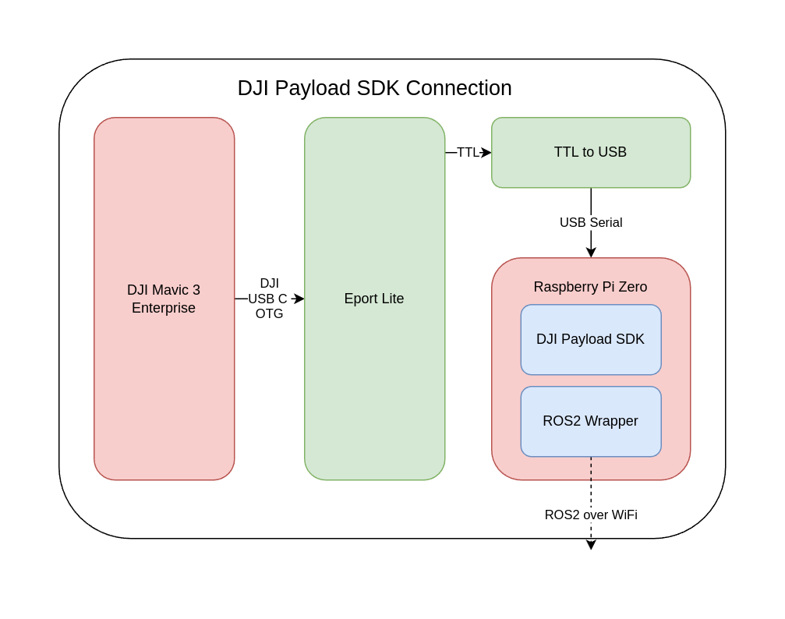

This section will help with implementing indoor control of DJI Enterprise series drones. Unlike the other section present in the knowledge base, this does not use the Onboard SDK (which DJI is phasing out) instead we use the **Payload SDK** (PSDK). The Payload SDK is aimed at enterprise users of DJI Drones and can be used for control of the drone, changing flight modes, reading sensors and streaming data.

Through this article you should be able to 
1. Setup a Payload App for your DJI Enterprise Drone
2. Fly your DJI Enterprise Drone using the Payload SDK
3. Fly your DJI Enterprise Drone using the ROS2 Wrapper for Payload SDK

## Requirements
In order to get started with the DJI Payload SDK, one would require the following **hardware** components
1. A DJI Enterprise Drone (e.g. DJI Mavic 3 Enterprise)
2. DJI Remote Controller
3. DJI Eport Lite Kit
4. A Compute Module (e.g. Raspberry Pi Zero, NVidia Jetson Orin)
5. A TTL to USB Converter Module (e.g. FT232RL)
6. (Optional for low latency video streaming) HDMI Capture Card
7. (Optional for camera feed streaming) USB C to ethernet module

Once you have all these requirements you can proceed with the rest of the document.

## Getting Started
In order to implement the DJI Payload SDK on a system one would first need to get our Payload Application approved by DJI. To do this you need to create an account on the DJI portal. You should be able to do this via the following link <https://developer.dji.com/user/apps/#all>

It is not necessary to be very accurate with the details of the Payload but a brief overview of what it will do will be required for the application. After entering all these details one can submit the Payload SDK application approval form. Within 2-3 days your payload application should be approved and you should get an email from DJI. 

Upon this approval you should be able to login to the DJI Developer Portal and see details regarding your payload. Which should match the following format

| Name     | Value    |
|----------|----------|
| SDK Type | Payload SDK   |
| App Name | Your_App_Name   |
| APP ID   | *six digit number*    |
| App Key  | 32 byte ID    |
| App License| Long alphanumeric hash    |
| Apply Status | accepted    |

## Creating the Payload Application

The most straightforward way to run the Payload Application is to use run the samples scripts from Github. The code is available at <https://github.com/dji-sdk/Payload-SDK>. The code is written in C++ and can be compiled using CMake. Before compiling however, one would need to make changes in the configuration header files to include the APP ID, APP Key and APP License that you received from DJI.

Before you run the sample code, you will need to make changes in the CPP files and the C files. 

For the CPP files you will need to change the following files:
1. `samples/sample_c++/platform/linux/manifold2/application/dji_sdk_config.json` 
2. `samples/sample_c++/platform/linux/manifold2/application/dji_sdk_app_info.h`

For the C files you will need to change the following files:
1. `samples/sample_c/platform/linux/manifold2/application/dji_sdk_app_info.h` 

If you are running on Jetson Nano change the file path to `samples/sample_c/platform/linux/nvidia_jetson/application/dji_sdk_app_info.h`

Make sure to follow the structure of the message, the APP ID, APP Key and APP License should be in the aprropriate format for the JSON file. Once you have made these changes you can compile the code using CMake.

Now that you have setup these ID's you will need to choose the type of communication that you will be using. There are three different types of communication that you can use with the Payload SDK. These are: 
1. UART Communication
2. UART + USB Bulk Communication
3. UART + Ethernet Communication

Based on whether you want the data stream or not you could choose the bulk or ethernet options but you **have** to have the UART communication. 
These settings are set in the file named `samples/sample_c/platform/linux/manifold2/application/dji_sdk_config.h`

## Running the Payload Application
Compile the code using CMake and then run the executable. Now you should be able to run the sample application. First connect the DJI Enterprise Drone to the Eport Lite Kit using their niche USB OTG Cable. (This funny cable looks like a regular USB C OTG but it does not work when flipped around). Make sure the sides A and B are connected correctly (Left side on drone is A and top side of EPort is also A). 

Connect the USB to UART Module to the Eport Lite Kit using jumper cables and on the other side connect it to the Compute Module where the code was built. Run the code and you should be able to see a menu that can run the different functions of the Payload SDK.

### Using the ethernet module
This is a bit more complicated than the UART communication. You will need to connect the USB C to Ethernet module to the Eport Lite Kit and then connect the ethernet cable to the Compute Module. Then change the files `samples/sample_c/platform/linux/manifold2/application/dji_sdk_config.h` to update the communication mode to `DJI_USE_UART_AND_NETWORK_DEVICE` 

You will also need to obtain the address of the ethernet device that you are using. This can be done by connecting the device to a linux system and running `lsusb -v` to get the pid and vid of the device. To get the ethernet address of the device you should run `ifconfig`. These ids should be updated in the `samples/sample_c++/platform/linux/manifold2/application/dji_sdk_config.json` file. 

## ROS2 Wrapper for Payload SDK
The ROS2 Wrapper for the Payload SDK allows you to use ROS2 services and topics to control the DJI Enterprise Drone. There is a github repository here that 
allows you to do that <https://umdlife.github.io/psdk_ros2/>

## Summary
The provided sections offer instructions for implementing indoor control of DJI Enterprise series drones using the Payload SDK (PSDK) for enterprise users. It covers setting up a Payload App, configuring hardware requirements, modifying code, and utilizing a ROS2 Wrapper for extended functionality.

## See Also:
- [DJI Payload SDK Documentation](https://developer.dji.com/payload-sdk/)
- [ROS2 Wrapper for Payload SDK](https://umdlife.github.io/psdk_ros2/)

## Further Reading
- [Article from DJI Forum that explains interfacing with ethernet](https://sdk-forum.dji.net/hc/zh-cn/articles/15754783739545-M30-T-M3E%E6%9C%BA%E5%9E%8BPSDK%E7%AB%AF%E5%8F%A3USB-%E7%BD%91%E5%8D%A1%E8%AE%BE%E7%BD%AE)

## References
- [1] “Payload SDK Documentation,” DJI Developer, https://developer.dji.com/payload-sdk/ (accessed May 1, 2024). 
- [2] “Psdk ROS2 wrapper,” UMDLife - psdk_ros2 wrapper documentation, https://umdlife.github.io/psdk_ros2/ (accessed May 1, 2024). 