---
# Jekyll 'Front Matter' goes here. Most are set by default, and should NOT be
# overwritten except in special circumstances. 
# You should set the date the article was last updated like this:
date: 2024-05-05 # YYYY-MM-DD
# This will be displayed at the bottom of the article
# You should set the article's title:
title: Kinova Gen3 Arms
# The 'title' is automatically displayed at the top of the page
# and used in other parts of the site.
---
Kinova Arms are a popular brand of robotic arms used for research. They are very precise and widely available at many labs and spaces on the CMU campus. Setting them up and using the existing APIs is not trivial, however. This guide covers some good practices when using the arms and how to install and run the Python and ROS APIs.

## Kinova Arms

### Introduction 

Kinova is a manufacturer of robotic arms that are to be used mostly in research. They are very precise at the cost of not being very strong or powerful. They are also popular in the CMU campus. The AI Maker Space at Tepper, for example, is equipped with two Kinova Gen3 6DoF arms, each of them equipped with a Robotiq 2F-85 gripper end-effector. One arm has been labeled with a blue band and the other has been labeled with a green band.

This guide is a summarized version of how to get the arms up and running. For more in-depth information, please consult the materials below:

Kinova Gen3 6DoF manual: <https://www.kinovarobotics.com/uploads/User-Guide-Gen3-R07.pdf>

Youtube tutorial playlist: <https://www.youtube.com/watch?v=zQewb08M4sA&list=PLz1XwEYRuku5rZjJWBr6SDi93jgWZ4FHL>

Kinova website: <https://www.kinovarobotics.com/product/gen3-robots>

Tech summary of AIMS arms:

|Firmware version|2\.5.2 (newest available)|
| :- | :- |
|ROS version tested|Noetic with Ubuntu 20|


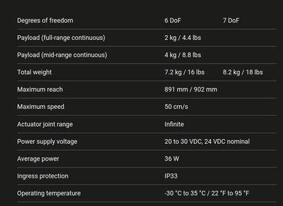


### Starting, using and stopping the arms

#### Starting

The arm should be resting as in the position below:

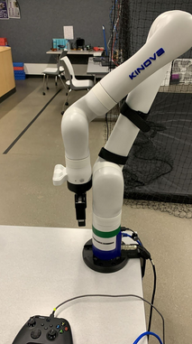


It is essential that the **gripper is not blocked**, as the arm will open and close the gripper upon startup. If the arm is in a position where the gripper is blocked, move the arm gently until it reaches a **stable** position where the gripper is free to open and close.

Once the arm is in a safe position, check that the power supply is connected and turned on. **Localize the red e-stop button and keep it within reach at all times**. Unlock the robot by twisting the e-stop button in the same sense as the arrow on it. The button should pop out.

Then press the silver button on the back of the arm until a blue LED lights up and release it. **DO NOT** press the button for more than 10 seconds, as that will factory reset the arm. The lights will then show blue and yellow during startup. **Once the gripper closes and opens and the light turns to solid green, the arm will be ready for use.**

#### Using

To check if the arm is working, grab the xbox controller attached to it. Its main layouts are shown below. These are the default layouts the robot can work with. I recommend taking some time to control the robot with the xbox controller in all layouts to see how they behave. Remember to press RB when the robot is not in use to lock it, so as to avoid accidental movements. Unblock it with LB before using it again.

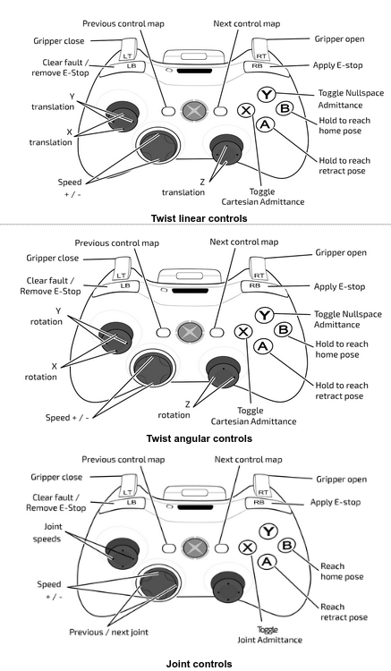

Once you have verified the controls are working, it is time to connect to the web interface. This serves two purposes:

1. Creating an account for you where you will register that you are using the arm.
2. With the web app, you have the simplest way to control the arm “semi-programmatically”. This serves as a good start to people with little to no experience in coding.

> Even though the users are separate, configurations for the arm are shared regardless of the user who established them. Therefore, DO NOT change settings as IP or firmware type. Only change things that are fundamental to your project, such as camera resolution or custom poses.

> Related to the previous point, do check if all essential configurations are correct before running your code, as they might have been changed between uses by other users.

The address of the web interface is simply the IP address of the arm. This should be marked on the arm itself, but is repeated here for convenience. 

|Which robot?|Robot’s IP|
| :- | :- |
|Blue|192\.168.2.9|
|Green|192\.168.2.10|

Connect the robot’s ethernet cable to your laptop. To ensure connectivity to the robot, you have to be in the same network. To do so, change your wired connection settings to:

|IPv4|Subnet mask|
| :- | :- |
|192\.168.2.xx|255\.255.255.0|

Where XX is a number greater than 10 (usually people set this to 11). Where to change IP settings exactly will depend on your OS, but a quick google search usually solves that. You will need to remove the cable and plug it again before using the robot if you change your ip settings in order to reset the connection.

Connect to the web interface by going to a web browser and typing http://<robot-ip>. You should be greeted with the login page:

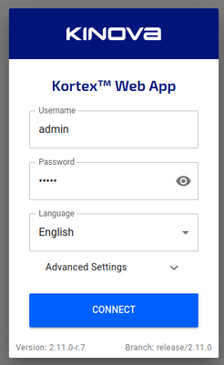

You will use the admin account only once in order to create your own account. Its credentials are:

|Login|Password|
| :- | :- |
|admin|admin|

Once you are logged in, it is time to create your account. Click on the three bars next to the Kinova logo on the top left corner. That will open the arm’s menu. Then click on “users”. In the users page, click on the plus sign in the bottom right corner. That will bring the new user interface:

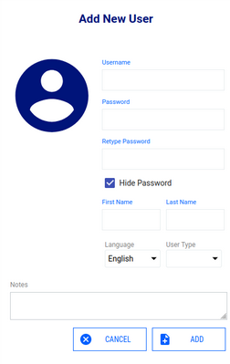

Fill it as follows:

|Field|Value|
| :- | :- |
|Username|Your andrew id.|
|Password|Whatever your heart desires|
|First/last name|Your first and last name, as registered with the university (or at least something close enough to be easily identifiable). This will be used to match your profile to an actual person |
|User type|Select “research”|
|Notes|Write a brief description as to why you are using the arms. If using for official research project or course, please include advisor/instructor name|

Once you add your profile, log out of the admin account and into your new profile. 

To test if the web interface is working properly, click on the “pose” icon on the bottom of the screen and try to move the robot. You can also test actions, admittances, etc.

#### Stopping
To stop the robot:

1. Press and hold “A” on the xbox controller until the arm stops moving. This will bring the arm to the retracted position.

2. Once the arm is retracted, hold it with one hand close to the gripper. With the other, hit the e-stop red button. This will make the arm limp. When the arm is stably resting against itself, let go.

There, the arm is safely shut down.

### Ways to use the arms
There is also the Kinova API and the Kinova ROS packages. The table below shows some pros and cons of each method. Choose the one that is the most suitable for your goals. The API and ROS API are described further down on this page.

||Web App|API|ROS|
| :- | :- | :- | :- |
|Pros|<p>Easiest to use</p><p></p><p>Least amount of experience required</p><p></p><p>Graphical interface</p>|<p>Integration with Python/C++/MATLAB</p><p></p><p>Native commands</p>|Integration with ROS and its products, such as MoveIt and CVBridge|
|Cons|<p>Very low customization ability</p><p></p><p>Can only solve simple problems</p><p></p><p>Low programming capabilities</p>|Requires some setting up and coding skill|<p>Requires proficiency with coding and with ROS</p><p></p><p>Documentation is not extensive. Some reverse engineering of the ROS packages they provide is required</p>|


## Kinova Arms API

### Introduction

Kinova distributes an API (Kortex) to be used with the Gen3 arms. This allows you to control the arms programmatically instead of graphically (as in the web app). This means you get more control, new functionality and a lot more automation with the arms’ usage. On the other hand, setting up and using the API requires some programming knowledge. 

This guide is supposed to be a very brief tutorial on how to use the API. For more detailed information, please refer to the Kinova manual. Pages 123-148 detail the different types of robot control available (high-level and low-level). Pages 228-243 include instructions on how to use the API. The API is available in Python, C++ and MATLAB (simplified). This guide will cover Python usage for Linux.  


Link to API’s github: <https://github.com/kinovarobotics/kortex>

Link to AIMS’s API tutorial: <https://github.com/CMU-AI-Maker-Space/Kinova_API_Demo_Python>

Python documentation: <https://github.com/Kinovarobotics/kortex/blob/master/api_python/doc/markdown/index.md
https://docs.kinovarobotics.com/index.html>

C++ documentation: <https://github.com/Kinovarobotics/kortex/blob/master/api_cpp/doc/markdown/index.md> 

### Operation

The robot can be controlled in either high-level or low-level robot control. There are benefits to both forms of control. High-level control is easier with more protections, while low-level control offers faster commands and finer-grained control with less protection. High-level is the default on boot-up and offers the safest and most straight-forward control. This is the mode we will focus on.

> If you’re an advanced user, please consult the manual for low-level control instructions.

In both high-level and low-level, commands are sent through the robot base.

In high-level control, commands are sent to the base via a single command using the Kinova.Api.Base API. These commands are processed by Kinova robot control libraries. This control runs at 40Hz. 

The robot consists of several devices:

- Base controller
- Actuators (each actuator is a distinct device)
- Interface module
- Vision module

The devices in the robot each implement a particular set of services, some of which are available across multiple devices. The methods available as part of a service on a device are accessed via remote procedure calls (RPC).

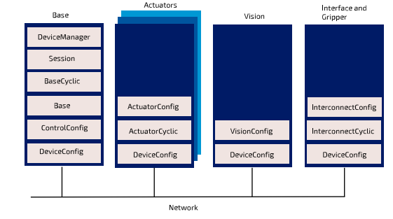

The API implements robot control in high-level mode by interacting with the base, which then relays commands to the actuators internally using its own control libraries.

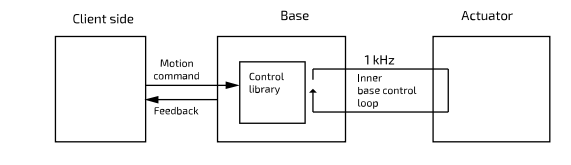


In order to be able to communicate with the robot, you need to follow a couple of steps:

1. Start a TCP connection to the robot based on its IP
2. Using the TCP connection, start a device router. This will ensure that messages for the robot will go to the right place
3. Use the device router with your credentials to start a session. This will prove to the robot that you are an authorized user
4. After the session has been created, you can access the services offered by each device. For high-level control, you will generally interact only with Base and Vision devices

On a more technical note, communication with the robot is handled using Google Protocol Buffer.

### Setting up

To set up the API for Python, download the .whl file from <https://artifactory.kinovaapps.com/ui/repos/tree/General/generic-public/kortex/API/2.6.0>. This tutorial and the arms have been set up for v2.6.0. Once it has been downloaded, open a terminal and navigate to the file’s location.

> If you plan on using a virtual environment, remember to activate it before running the following commands.

Once that is done, run:

```shell
$ python3 -m pip install ./kortex_api-2.6.0.post3-py3-none-any.whl
```

And you should have the Python API installed.


### Scripts

Rather than describing the API step by step, the github link from AIMS provides a set of example codes to get you up to speed. They should cover high-level functions such as:

- Connecting
- Accessing the camera
- Image treatment using openCV
- Frame transformation
- Commanding cartesian positions
- Commanding the gripper

The code and its comments should guide you. The Kortex github also offers more examples of API usage.

The code we offer identifies a green ball using the arm’s camera, picks it up and drops it. 

> Remember to check the code parameters before running the files!

Code list:

connect.py: establish the connection to the robot and link to the devices that will be used. This file can be run on its own (remember to change the parameters)

vision.py: use the camera’s info and stream to identify a green ball in the image and calculate its position globally. Can’t be used on its own as it need a connection to the robot

arm_mover.py: can send the robot and the gripper to positions. Can’t be used on its own as it needs a connection to the robot

detect_and_catch.py: combines all the programs together. After the opencv window opens, press ‘a’ (for ‘action’) once you are satisfied with the point the camera pinpoints as the center of the ball.


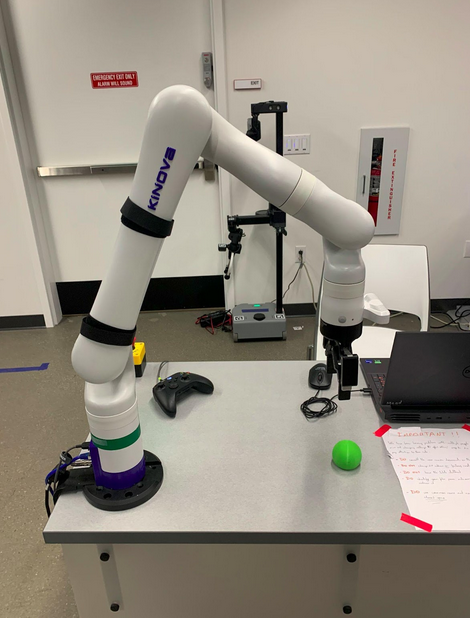


## Kinova Arms - ROS API


### Introduction


In addition to the native API, which works in Python, C++ and MATLAB, Kinova also publishes packages that aim to integrate the arm with ROS. This allows users to perform commands using ROS packages such as MoveIt.

For ROS users, this API provides an interesting choice, as you don’t need to know the commands defined by the native API. On the other hand, it offers less documentation and is somewhat less precise.

> This tutorial assumes that you already know and installed ROS and its tools

Links:

ROS API Github: <https://github.com/Kinovarobotics/ros_kortex>

ROS Vision API Github: <https://github.com/Kinovarobotics/ros_kortex_vision>

AIMS ROS Tutorial files: <https://github.com/CMU-AI-Maker-Space/Kinova_API_Demo_ROS>

> This tutorial was tested on Ubuntu 20 with ROS Noetic

### Download and setup

On your home directory, create a ROS-ready directory

```shell
$ mkdir -p ros_ws/src
$ cd ros_ws
$ catkin init
```

Download the Kinova packages:

> You need different packages for controlling the arm and for accessing vision.

> The controller is made up of several packages. To see what each one does, consult the “contents” section of the API’s github.

```shell
$ cd src
$ git clone -b noetic-devel https://github.com/Kinovarobotics/ros_kortex.git
$ git clone https://github.com/Kinovarobotics/ros_kortex_vision.git
```

Configure Conan and install dependencies to build the files


```shell
$ cd ..
$ sudo python3 -m pip install conan==1.59
$ conan config set general.revisions_enabled=1
$ conan profile new default --detect > /dev/null
$ conan profile update settings.compiler.libcxx=libstdc++11 default
$ rosdep install --from-paths src --ignore-src -y
```

Build the package to ensure there are no problems with the installation

```shell
$ catkin build
```

You should get a build that might contain warnings, but no errors.

### Running the packages

After resourcing the workspace to detect the new files, you can test if installation was successful by running a few launch commands.

For the arm commands and planner:

```shell
$ roslaunch kortex_driver kortex_driver.launch ip_address:=<Robot IP> dof:=6 gripper:=robotiq_2f_85 vision:=true start_rviz:=true username:=<Your Username> password:=<Your Password>
```
RViz should have popped open. You can add a MoveIt node by clicking Add->Motion Planner. Use the arrows to move the arm’s goal, then “plan and execute” to see the movement both in RViz and in real life.

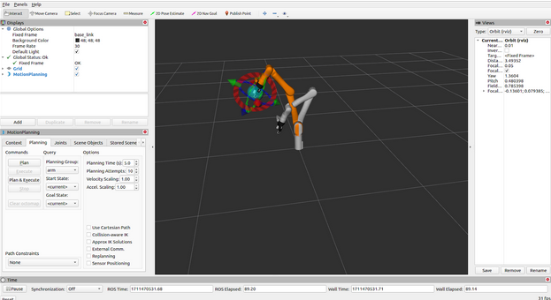

The procedure to test the vision node is similar:

```shell
$ roslaunch kinova_vision kinova_vision.launch device:=<Robot IP>
```

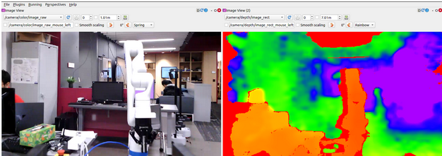

### Running the example code

As with the native API, the AIMS example has the arm tracking a green ball, then making a plan to catch it, then finally executing the plan. Only now this process is implemented through ROS nodes.

First, download the example package to your src folder

```shell
$ cd src
$ git clone https://github.com/CMU-AI-Maker-Space/Kinova_API_Demo_ROS.git
```

Then go back to your workspace root, rebuild the package with “catkin build”, and resource it.

> In case build fails because of dependencies: you can try:

```shell
$ rosdep install --from-paths src --ignore-src -y
pip3 install numpy opencv-python
```

The package object_detection is made of two nodes:

- object_tracker_node: finds the center of the ball in 3D coordinates and publishes an image with it circled (topic /tracking/image_with_tracking). Also saves the position of the ball as a ros parameter in the server (/ball_center)
- object_catcher_node: moves the arm, both to the tracking position and to catch the ball

To run the code:

```shell
$ roslaunch object_detection tracking_catching.launch ip:=<ROBOT IP> username:=<Your Username> password:=<Your Password>
```

Watch the streamed image topic on rqt image viewer (rqt should have opened with the launch file). Once you are satisfied with the tracking, you can call the catching service (/my_gen3/catch_ball) from rqt as well. 

> You might need to click the refresh button on rqt to find the service

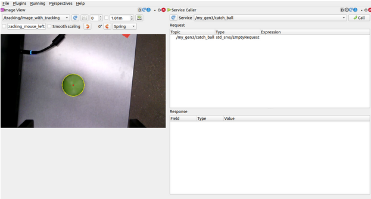
