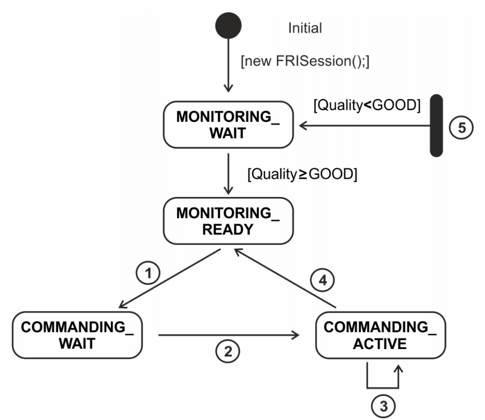

---
# Jekyll 'Front Matter' goes here. Most are set by default, and should NOT be
# overwritten except in special circumstances. 
# You should set the date the article was last updated like this:
date: 2024-05-01 # YYYY-MM-DD
# This will be displayed at the bottom of the article
# You should set the article's title:
title: Working with KUKA LBR Med
# The 'title' is automatically displayed at the top of the page
# and used in other parts of the site.
---
The LBR Med is a series of robots designed for medical diagnostics, treatment, and surgical interventions. To allow these functionalities, the manipulator is CB-certified, has comprehensive safety precautions, and is very accurate. We are using this device to build an assistive solution for Total Knee Arthroplasties (TKAs).

Being a proprietary device, there is very limited documentation about using the KUKA, with little to no community support. We spent a lot of time trying to figure out how to interface the KUKA with ROS. Hence, this article is written to guide you through the entire setup of the manipulator.

## Initial setup
Before you start mounting the manipulator, it's important to keep in mind that you'll need a custom base plate and table for the purpose. We used a Vention table with a personalized design and a machined steel plate for the manipulator's mounting. 

Once you have acquired these components, you can proceed with the mounting process. Refer to the manual for detailed instructions on connecting the controller, manipulator, and pendant. Following these instructions will ensure that the setup is done correctly and minimize any risk of damage or malfunction.

After completing the connection, you can test the setup by switching the pendant to T1 mode. To enable it, press the button, and then use the +/- button to jog the manipulator. You should note that the pendant has three modes of operation: T1, T2, and AUT.

In T1 and T2 modes, the robot will only function while the enable button is pressed. In T1 mode, the robot's speed is reduced by 25% of the maximum speed. Additionally, you can run various applications on the manipulator aside from jogging it. The AUT mode is solely for running these applications. 

### Brake test monitor
During the initial setup, we spent a lot of time trying to debug why the manipulator would shut off if left idle for 15-20 mins. It would enter an error state, with a code not found on Google, and the only solution would be to restart the manipulator which is a 10-15 min activity. After struggling with it for a week, here’s what we learned: “CBTM” stands for Central Brake Test Monitor, and if you don't run a brake test ever so often, the manipulator will lock off and not function. 

When you boot the controller, the pendant will be in a “warning” state and have an orange indicator in the software. Switch the mode to AUT, select SampleBrakeTestMonitor from the menu, and run it. Once it is completed, it will show you the status of the brakes of each joint. The orange indicator will turn green if the brakes in all the joints are working well.

### Sunrise Workbench
Sunrise Workbench is the IDE for developing Java applications running on the KUKA. Along with the Sunrise Workbench installer, you should also be able to find the SunriseOS folder with ver X. In our case, we are using SunriseOS Med V.2.6.5, the OS version is important as we found out that OS V.1.1.5 to V.2.6.5 has a lot of breaking changes.

Once you installed the Workbench and started a project, you need to manually install the software packages in the SunriseOS folder. From Help->Install New software, you select local as installing source, and browse toward the packages you want to install.

Once you have installed the packages, in our case it solved all the missing dependencies in our existing project.

Inside a project, StationSetup.cat is the file that defines the arm topology, what software should be installed into the control station, and the arm’s configuration like IP address and other parameters. The StationSetup should only be installed once, while project synchronization should be done every time you make modifications to the code.

Because the KUKA software is proprietary, it’s not easy to find documentation online. Thus it’s hard to understand what is the function of the code. Luckily when in code editor view, if you hover over a function, it will pop out the function definition. If you want to dive deeper into the function, you can select “open attached Javadoc in a browser” to open the Javadoc that comes with the packages.

### Fast Robot Interface
Fast Robot interface can stream out robot data in real-time, and when connection quality is good, it can also command the robot.

(In AUT Mode) Run the LBRServer.java application from the robot pendant, and run the corresponding ROS2 node on the PC. Then the robot should be connected.

The purpose of the LBRServer application is to talk over the controller PC’s Ethernet connection to another device. It can publish the current joint states, and accept goal joint values for the manipulator, which it will communicate to the controller PC, which will then move the manipulator. These messages can be decoded by the LBR_FRI package maintained by Kings College London, which provides an interface that talks to the LBRServer, and to ROS on your PC.

### Avoiding Connection Issues

Depending on the network quality, there might be issues that come up with using the LBR FRI connection issues. If the connection quality drops below a certain threshold, the ROS side of the system will kill the connection for safety reasons and crash the application. Based on the network quality, the application defines certain states, as shown below. 

The system will let you monitor the state of the robot and control it as long as the connection is classified as “Good” or “Excellent”.  The behavior tree based on the connection status is as follows. You can get information about the robot’s joints if the status is MONITORING_READY, and you can give it goal values if the status is COMMANDING_ACTIVE.

If the connection status is below “GOOD” anytime, The application will shut. We had this issue happen to us during our demo. To avoid that happening in the future, we intend to modify the ROS Client to allow the robot to stay connected even if the connection is lost for a second, and we’ll implement our manipulation code in a manner to handle these situations.

## Summary
In this wiki we covered most of the setup and usage of Kuka arm with ROS2 interface. We talked about the ROS side of the system and the java application side of the system. Hope this guide can help you quickly set up the Kuka arm.

## References
- [LBR FRI ROS 2 GitHub Repository](https://github.com/lbr-stack/lbr_fri_ros2_stack)
- [LBR FRI ROS 2 GitHub Online Document](https://lbr-stack.readthedocs.io/en/latest/)