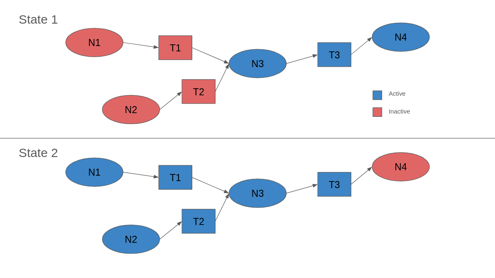

---
# Jekyll 'Front Matter' goes here. Most are set by default, and should NOT be
# overwritten except in special circumstances. 
# You should set the date the article was last updated like this:
date: 2024-11-26 # YYYY-MM-DD
# This will be displayed at the bottom of the article
# You should set the article's title:
title: ROS 2 Node Lifecycle
# The 'title' is automatically displayed at the top of the page
# and used in other parts of the site.
---
## Introduction
Many robotics platforms implement state machines as part of their functionality. ROS 2 offers a convenient way of working with state machines in the form of ```managed nodes```, also called ```lifecycle nodes```. These nodes can be turned on/off, configured/unconfigured, etc. In a nutshell, lifecycle nodes can be activated or deactivated based on the current state of a robot's state machine. 

Before ROS 2, state machine implementations basically relied on ignoring nodes when they were not useful to the current state. While this is still possible in ROS 2, lifecycle nodes offer significant advantages from an efficiency standpoint:

+ More control: you don't have to worry about topics from a node that should be ignored influencing the robot's operation.
+ Less network cluttering: If a node and its topics are not contributing to operations, they are just cluttering the network. This can be very noticeable depending on the size of the data being transmitted.
+ Better debugging: you can track on which state of its operation the node failed.

Given these advantages, it is recommended to use lifecycle nodes as the default implementation of ROS state machines.



## Node Lifecycle

The figure below summarizes the possible states and transitions for each managed node. This image was obtained from the [ROS Design Website]().


There are two types of states a node can be in:

Primary states: these are the steady states, represented in blue in the picture. A node can be in a primary state indeterminately. These states are:

+ ```unconfigured```: this is the state the node will be in as soon as it is instantiated. If a non-fatal error is raised during operation, the node can come back to this state. 
+ ```inactive```: the node has been been configured, but it is not running any process. Beware: the node can still queue data (e.g. from subscribed topics) while in this state. It will just not perform anything.
+ ```active```: this is where the node behaves as a "traditional" node, performing it's operations regularly.
+ ```finalized```: this is where nodes go when they fail or are terminated. The node will still exist for debugging purposes, but cannot be re-run. For the node to vanish, a ```destroy()``` function has to be called.

Please note that ROS offers a lot of freedom when implementing these states (even their demo strays a bit from the convention above). Try to keep your use reasonable for other developers.

Secondary states: also known as "transition states", these states serve as buffers between primary states, where the node will be doing some internal operation relating to a corresponding ```transition``` function. These states are:


+ ```Configuring```
+ ```CleaningUp```
+ ```ShuttingDown```
+ ```Activating```
+ ```Deactivating```
+ ```ErrorProcessing```

While almost all these states' functionalities and their corresponding transition functions can be easily inferred from the lifecycle diagram, ```ErrorProcessing``` deserves some extra explanation. As you can see from the diagram, sometimes transition states can fail, returning to the previous primary state. This is **not** the purpose of ```ErrorProcessing```. The transition state will return to the original primary state when it's function fails "logically", e.g. the program has to be running for 10 minutes before the node activates, checked for inside an if-loop. The ```ErrorProcessing```, on the other hand, is reached when an error is **raised**, e.g. you tried dividing something by zero. 

## Triggering Transitions

As the diagram shows, there are transitions between the states. It is possible to see that they usually come in pairs. For example, there is transition function ```configure()``` and there is also a ```onConfigure()``` function inside the node secondary state ```Configuring```. The nomenclature can be a bit confusing, so here is a brief explanation:

+ ```function()```: This is the name used by the lifecycle framework to trigger transitions. When you want to tell a node to move into another state (more in a sec), this is the name you use. These names come with ROS and don't need additional programming.
+ ```onFunction()```: This is a callback function, defined inside the node, that will be actually responsible for performing the state transition. In other words, this is the function that is actually aware of what the node is. When the lifecycle manager calls ```node1 configure```, it is the function ```onConfigure()```, inside ```node1``` that will be executed.
+ ```Functioning```: This is the (transient) state the node is at while executing callback function ```onFunction()```.

With all this in mind, changing a node state can happen in two ways: either through CLI tools or through a service call.

### CLI Lifecycle

For CLI commands, you can run:

```bash
ros2 lifecycle <command> 
```

Start the lifecycle talker node provided with ROS:

```bash
ros2 run lifecycle lifecycle_talker
```

To get the state the node is in, run

```bash
ros2 lifecycle get /lc_talker
```

Which should return

```bash
unconfigured [1]
```

As expected. The number in brackets is the id of the node state. This is not super relevant for node states, as these ids are not really used for commands. 

Much more interesting are the ids for transitions. If you run:

```bash
ros2 lifecycle list /lc_talker
```

You should get as output:

```bash
- configure [1]
	Start: unconfigured
	Goal: configuring
- shutdown [5]
	Start: unconfigured
	Goal: shuttingdown
```

These are the possible transitions from primary state ```Unconfigured```, as shown in the lifecycle diagram. Note the ids here, as they will be useful when discussing services.

To change states, you should call the command ```set``` with the transition function name e.g.:

```bash
ros2 lifecycle set /lc_talker configure
```

Returning to the ```lc_talker``` terminal should reveal the messages:

```bash
[INFO] [1732664038.655707440] [lc_talker]: on_configure() is called.
[INFO] [1732664039.655992380] [lc_talker]: Lifecycle publisher is currently inactive. Messages are not published.
[WARN] [1732664039.656126348] [LifecyclePublisher]: Trying to publish message on the topic '/lifecycle_chatter', but the publisher is not activated
[INFO] [1732664040.656052111] [lc_talker]: Lifecycle publisher is currently inactive. Messages are not published.
```

### Services

All these lifecycle commands are basically services. 

For example, we can make a standard service call to get the current state of the node:

```bash
ros2 service call /lc_talker/get_state lifecycle_msgs/GetState
```

```bash
response:
lifecycle_msgs.srv.GetState_Response(current_state=lifecycle_msgs.msg.State(id=2, label='inactive'))
```

See the id field? This is where they become important. For service calls requesting state transitions, you need to know the id of the transition (not to be confused with the id of the state itself). To get those, you could run, for example:

```bash
ros2 service call /lc_talker/get_available_transitions lifecycle_msgs/srv/GetAvailableTransitions
```

```bash
response:
lifecycle_msgs.srv.GetAvailableTransitions_Response(available_transitions=[lifecycle_msgs.msg.TransitionDescription(transition=lifecycle_msgs.msg.Transition(id=2, label='cleanup'), start_state=lifecycle_msgs.msg.State(id=2, label='inactive'), goal_state=lifecycle_msgs.msg.State(id=11, label='cleaningup')), lifecycle_msgs.msg.TransitionDescription(transition=lifecycle_msgs.msg.Transition(id=3, label='activate'), start_state=lifecycle_msgs.msg.State(id=2, label='inactive'), goal_state=lifecycle_msgs.msg.State(id=13, label='activating')), lifecycle_msgs.msg.TransitionDescription(transition=lifecycle_msgs.msg.Transition(id=6, label='shutdown'), start_state=lifecycle_msgs.msg.State(id=2, label='inactive'), goal_state=lifecycle_msgs.msg.State(id=12, label='shuttingdown'))])
```

The output is a bit confusing (and better seen in RQt), but we can notice that the id for ```activate``` is 3. If we want to move to that state, a service call is also possible:

```bash
ros2 service call /lc_talker/change_state lifecycle_msgs/ChangeState "{transition: {id: 3}}"
```

This service also has a ```label``` field, which is not required (but highly recommended). Back in the talker terminal:

```bash
[INFO] [1732664498.641014385] [lc_talker]: Lifecycle publisher is active. Publishing: [Lifecycle HelloWorld #459]
```

When inside the code, all lifecycle changes are done through service calls. More on that below.

## In Code

You can find the lifecycle examples at the ROS demo [github](https://github.com/ros2/demos/tree/rolling/lifecycle/src).This guide will comment just a few key points on that code.

Right at the definition of the talker node, we see:

```cpp
class LifecycleTalker : public rclcpp_lifecycle::LifecycleNode
```

Note that the node doesn't inherit from the typical ```rclcpp:Node``` class. Not all node capabilities are available for a lifecycle node (and vice-versa, obviously). 

As for the callback functions, you can see that they have special signatures and return values:

```cpp
rclcpp_lifecycle::node_interfaces::LifecycleNodeInterface::CallbackReturn
  on_configure(const rclcpp_lifecycle::State &)
  {
    // This callback is supposed to be used for initialization and
    // configuring purposes.
    // We thus initialize and configure our publishers and timers.
    // The lifecycle node API does return lifecycle components such as
    // lifecycle publishers. These entities obey the lifecycle and
    // can comply to the current state of the node.
    // As of the beta version, there is only a lifecycle publisher
    // available.
    pub_ = this->create_publisher<std_msgs::msg::String>("lifecycle_chatter", 10);
    timer_ = this->create_wall_timer(
      1s, [this]() {return this->publish();});

    RCLCPP_INFO(get_logger(), "on_configure() is called.");

    // We return a success and hence invoke the transition to the next
    // step: "inactive".
    // If we returned TRANSITION_CALLBACK_FAILURE instead, the state machine
    // would stay in the "unconfigured" state.
    // In case of TRANSITION_CALLBACK_ERROR or any thrown exception within
    // this callback, the state machine transitions to state "errorprocessing".
    return rclcpp_lifecycle::node_interfaces::LifecycleNodeInterface::CallbackReturn::SUCCESS;
  }
```

From the code, you can also see that ```on_configure()``` (and the other callbacks) are never explicitly defined as service callbacks. The lifecycle framework takes care of that.

The last point that should be highlighted is in ```main```. Notice the node is note run as a regular node:

```cpp
rclcpp::init(argc, argv);

rclcpp::executors::SingleThreadedExecutor exe;

std::shared_ptr<LifecycleTalker> lc_node =
  std::make_shared<LifecycleTalker>("lc_talker");

exe.add_node(lc_node->get_node_base_interface());

exe.spin();

rclcpp::shutdown();
```

Executors are beyond the scope of this document, but you can read more about them [here](https://docs.ros.org/en/foxy/Concepts/About-Executors.html). 

Finally, as kind of a side note, you can also launch and trigger lifecycle nodes from launch files, as explained in [1]:

```python
from launch import LaunchDescription
from launch_ros.actions import LifecycleNode
from launch_ros.actions import LifecycleTransition
from lifecycle_msgs.msg import Transition

def generate_launch_description() :
return LaunchDescription([
LifecycleNode(package = 'package_name' , executable = 'a_managed_node' , name = 'node1'),
LifecycleNode(package = 'package_name' , executable = 'a_managed_node' , name = 'node2'),
LifecycleTransition(
  lifecycle_node_names = ['node1', 'node2'],
  transition_ids = [Transition.TRANSITION_CONFIGURE, Transition.TRANSITION_ACTIVATE]
)
])
```

## Summary
ROS 2 implements node lifecycle as a feature to conveniently manage node states. This offers multiple advantages over traditional methods and is particularly helpful when implementing state machines.

## Further Reading
- [ROS Design on Lifecycle Nodes](http://design.ros2.org/articles/node_lifecycle.html)
- [ROS Demo on Lifecycle Nodes](https://github.com/ros2/demos/blob/humble/lifecycle/README.rst)

## References
[1] M. M. Bassa, *A Very Informal Journey Through ROS 2*. Leanpub, 2024. [Online]. Available: https://leanpub.com/averyinformaljourneythroughros2
