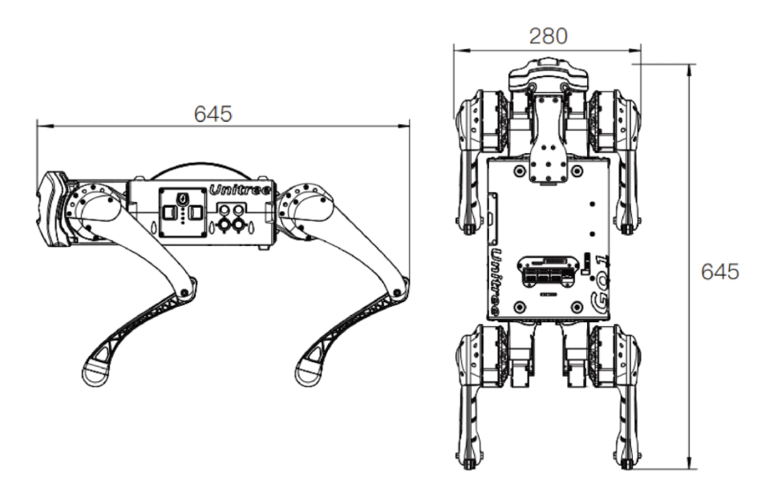

---
# Jekyll 'Front Matter' goes here. Most are set by default, and should NOT be
# overwritten except in special circumstances. 
# You should set the date the article was last updated like this:
date: 2023-05-03 # YYYY-MM-DD
# This will be displayed at the bottom of the article
# You should set the article's title:
title: Unitree Go1 Edu 
# The 'title' is automatically displayed at the top of the page
# and used in other parts of the site.
---

(Note: This section contains the latest information as of May 2023)

Unitree Robotics is a leading Chinese manufacturer that specializes in developing, producing, and selling high-performance quadruped robots. One of the company's primary advantages is that they offer quadruped platforms at a significantly lower cost compared to competitors like Boston Dynamics. In addition, they have announced plans to release experimental humanoid platforms in the near future.

There are three versions of the Unitree Go1: Air, Pro, and Edu. The Edu model is designed for educational purposes and provides developers with access to the platform. In this article, we will focus on the capabilities of the Go1 Edu, which is a popular choice for students and researchers due to its affordability and ease of use.

## Form Factor

The Unitree Go1 Edu has compact dimensions of 645 x 280 x 400 mm and weighs 12 kg. 
It boasts a top speed of 3.7-5 m/s and a maximum load capacity of 10 kg, although it's recommended to keep the payload under 5 kg. 
By default, the robot can traverse steps up to 10 cm high, but with programming, it's possible to overcome larger obstacles. 
The Go1 Edu features 12 degrees of freedom, including HAA (hip abduction/adduction), HFE (hip flexion/extension), and KFE (knee flexion/extension) joints. 
The Body/Thigh Joint Motor design is highly adaptable to various mechanical equipment, with an instantaneous torque of 23.7 N·m, while the Knee Joint has a torque of 35.55 N·m.

### Basic syntax
A line in between create a separate paragraph. *This is italicized.* **This is bold.** Here is [a link](/). If you want to display the URL, you can do it like this <http://ri.cmu.edu/>.

> This is a note. Use it to reinforce important points, especially potential show stoppers for your readers. It is also appropriate to use for long quotes from other texts.


#### Bullet points and numbered lists
Here are some hints on writing (in no particular order):
- Focus on application knowledge.
  - Write tutorials to achieve a specific outcome.
  - Relay theory in an intuitive way (especially if you initially struggled).
    - It is likely that others are confused in the same way you were. They will benefit from your perspective.
  - You do not need to be an expert to produce useful content.
  - Document procedures as you learn them. You or others may refine them later.
- Use a professional tone.
  - Be non-partisan.
    - Characterize technology and practices in a way that assists the reader to make intelligent decisions.
    - When in doubt, use the SVOR (Strengths, Vulnerabilities, Opportunities, and Risks) framework.
  - Personal opinions have no place in the Wiki. Do not use "I." Only use "we" when referring to the contributors and editors of the Robotics Knowledgebase. You may "you" when giving instructions in tutorials.
- Use American English (for now).
  - We made add support for other languages in the future.
- The Robotics Knowledgebase is still evolving. We are using Jekyll and GitHub Pages in and a novel way and are always looking for contributors' input.

Entries in the Wiki should follow this format:
1. Excerpt introducing the entry's contents.
  - Be sure to specify if it is a tutorial or an article.
  - Remember that the first 100 words get used else where. A well written excerpt ensures that your entry gets read.
2. The content of your entry.
3. Summary.
4. See Also Links (relevant articles in the Wiki).
5. Further Reading (relevant articles on other sites).
6. References.

#### Code snippets
There's also a lot of support for displaying code. You can do it inline like `this`. You should also use the inline code syntax for `filenames` and `ROS_node_names`.

Larger chunks of code should use this format:
```
def recover_msg(msg):

        // Good coders comment their code for others.

        pw = ProtocolWrapper()

        // Explanation.

        if rec_crc != calc_crc:
            return None
```
This would be a good spot further explain you code snippet. Break it down for the user so they understand what is going on.

#### LaTex Math Support
Here is an example MathJax inline rendering $ \phi(x\|y) $ (note the additional escape for using \|), and here is a block rendering:
$$ \frac{1}{n^{2}} $$

#### Images and Video
Images and embedded video are supported.






The video id can be found at the end of the URL. In this case, the URLs were
`https://www.youtube.com/watch?v=8P9geWwi9e0`
& `https://vimeo.com/148982525`.

## Summary
Use this space to reinforce key points and to suggest next steps for your readers.

## See Also:
- Links to relevant material within the Robotics Knowledgebase go here.

## Further Reading
- Links to articles of interest outside the Wiki (that are not references) go here.

## References
- Links to References go here.
- References should be in alphabetical order.
- References should follow IEEE format.
- If you are referencing experimental results, include it in your published report and link to it here.
