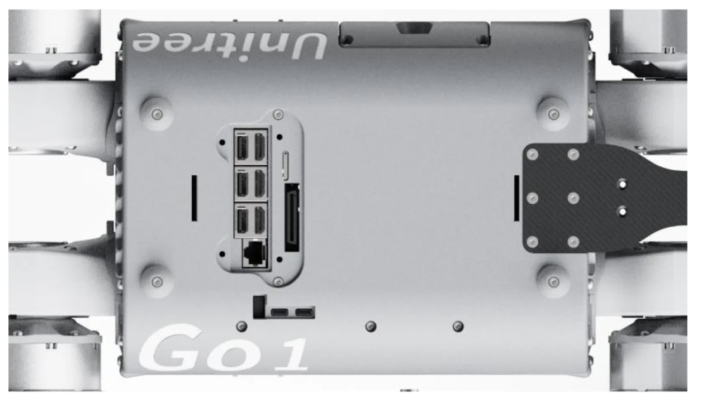

---
# Jekyll 'Front Matter' goes here. Most are set by default, and should NOT be
# overwritten except in special circumstances. 
# You should set the date the article was last updated like this:
date: 2023-05-03 # YYYY-MM-DD
# This will be displayed at the bottom of the article
# You should set the article's title:
title: Unitree Go1 Edu 
# The 'title' is automatically displayed at the top of the page
# and used in other parts of the site.
---

(Note: This section contains the latest information as of May 2023)

This is an article that provides an overview of the Unitree Go1 Edu robot, including its features and capabilities. Unitree Robotics is a leading Chinese manufacturer that specializes in developing, producing, and selling high-performance quadruped robots. One of the company's primary advantages is that they offer quadruped platforms at a significantly lower cost compared to competitors like Boston Dynamics. In addition, they have announced plans to release experimental humanoid platforms in the near future.

There are three versions of the Unitree Go1: Air, Pro, and Edu. The Edu model is designed for educational purposes and provides developers with access to the platform. In this article, we will focus on the capabilities of the Go1 Edu, which is a popular choice for students and researchers due to its affordability and ease of use.

## Form Factor

The Unitree Go1 Edu has compact dimensions of 645 x 280 x 400 mm and weighs 12 kg. 
It boasts a top speed of 3.7-5 m/s and a maximum load capacity of 10 kg, although it's recommended to keep the payload under 5 kg. 
By default, the robot can traverse steps up to 10 cm high, but with programming, it's possible to overcome larger obstacles. 
The Go1 Edu features 12 degrees of freedom, including HAA (hip abduction/adduction), HFE (hip flexion/extension), and KFE (knee flexion/extension) joints. 
The Body/Thigh Joint Motor design is highly adaptable to various mechanical equipment, with an instantaneous torque of 23.7 N·m, while the Knee Joint has a torque of 35.55 N·m.

## Power and Interface


The Unitree Go1 Edu robot is equipped with a reliable lithium-ion power cell with a 6000mAh capacity that provides an endurance time of 1-2.5 hours. The robot's battery management system (BMS) closely monitors the battery status, ensuring safe and stable operation during use. The batteries themselves feature overcharge protection, providing an additional layer of safety.

The top plate of the robot features several ports, including USB and HDMI ports that connect to corresponding computers. The USB and HDMI port pair located closest to the Ethernet port, along with the Ethernet port itself, connects to the Raspberry Pi. Additionally, users can draw out 24V, 12A power from the top plate using an XT30 connector.

## Sensors and Processors


The Unitree Go1 Edu robot is equipped with a range of sensors, including five pairs of stereo-fisheye cameras located at the face, chin, lower belly, right torso, and left torso, providing a 360-degree field of view. Additionally, it has three sets of ultrasonic sensors positioned in different directions to detect obstacles in its path. The robot also features an IMU, four foot force sensors, and face LEDs, which can be programmed to display different expressions.

Moreover, Unitree provides customization options for processors and additional sensors. In the 2023 MRSD Unitree Go1, for instance, there is one Raspberry Pi CM4 (Compute Module 4), two Nvidia Jetson Nanos, and one Nvidia NX. The Raspberry Pi comes with a 32 GB SD card where Unitree's off-the-shelf software is pre-installed.

## Network Configuration for Unitree Go1 Camera Streaming
* Four computers inside Unitree Go1: three Jetson Nano and one Raspberry Pi. Four devices are connected with a switch. 
* The inbuilt wifi card inside Raspberry Pi is connected to the switch and is called Eth0.
* Raspberry Pi also has an extra Wi-Fi card, which is used as a hotspot 192.168.12.1. 
* User laptop connects to the robot hotspot, with a static IP 192.168.12.18.
* Users can connect to all four devices via Ethernet cable, with a static IP 192.168.123.123.


* Each Nano controls and processes a pair of fisheye cameras. The Unitree camera SDK provides an API that captures and rectifies skewed fisheye camera stream and sends out the UDP packets.
* `./bins/example_putImagetrans` sends camera streams with udp packets
* `./bins/example_getimagetrans` receives the udp packets and show camera streams with gstreamer
* You can modify the receiver program and do whatever you want
* The de-fish API requires a straight connection with the camera. It must be run inside Jetson Nano. Users can’t receive raw camera stream and run this inbuilt program on their own laptop. In addition, this API is designed for Ethernet connection. It requires the third segment of the image receiver IP address to be 123. This means the user's laptop must have a 123-segment IP address.
* In addition, user need to modify the config file inside Unitree Nano Jetson, which is `/UnitreecameraSDK/trans_rect_config.yaml`. 

## Wirelessly Stream Camera Feed from Unitree Go1's Head Cameras to Desktop
In order to receive a camera stream wirelessly, you will need to modify the routing tables on your device.

```console
-----------------------------head nano---------------------------
sudo route del -net 192.168.123.0 netmask 255.255.255.0

#the following four commands kill the camera processes
ps -aux | grep point_cloud_node | awk '{print $2}' | xargs kill -9
ps -aux | grep mqttControlNode | awk '{print $2}' | xargs kill -9
ps -aux | grep live_human_pose | awk '{print $2}' | xargs kill -9
ps -aux | grep rosnode | awk '{print $2}' | xargs kill -9

cd UnitreecameraSDK
./bins/example_putImagetrans


----------------------------raspberry pi-----------------------
sudo route add -host 192.168.123.123 dev wlan1


----------------------------user laptop-----------------------
# input ifconfig and find out the wifi name that is used for Go1
# mine is wlp0s20f3
sudo ifconfig wlp0s20f3:123 192.168.123.123 netmask 255.255.255.0
sudo route del -net 192.168.123.0 netmask 255.255.255.0

cd UnitreecameraSDK
./bins/example_getimagetrans
```

## Controlling Unitree in Simulation and Real-World Scenarios

### Introduction
Unitree Robotics provides a high-level control interface for directly controlling the real robot. However, controlling the movement of a robot in simulation using simple commands is a challenge. This documentation provides an overview of the issues we faced and the solutions we found while controlling the Unitree Go1 robot in simulation and real-world scenarios.

### Controlling the Robot in Simulation
The Gazebo simulation environment currently limits the use of `unitree_legged_msgs::LowCmd` as the subscribed message type, which requires manual motor torque and angle setting. To convert `unitree_legged_msgs::HighCmd` to `unitree_legged_msgs::LowCmd`, the `HighCmd` to `LowCmd` functions are hidden in the robot interface high level in `/raspi/Unitree/auto start/programming/programming.py`. However, this limitation can be overcome by exploring the MIT Champ code and using the IsaacSim platform from Nvidia.

### Controlling the Robot in Real-World Scenarios
To ensure safety, it is crucial to carefully review the user manual and record the full action sequence of the Unitree Go1 robot. The provided software packages, including the unitree legged SDK and unitree ROS to real, can be used to study example codes and create custom packages for specific use cases. For instance, the example_walk.cpp can be used to send the HIGH Command message to the robot, allowing users to set start and end points for the robot to plan its route from start to end.

## Summary
If you are considering using the Unitree Go1 for your project, be aware that you will either need to be content with the default controller or implement your own state estimation and legged controller. One of the main drawbacks of using commercial products like this is that the code is closed-source. When deploying your own code on the Unitree Raspberry Pi, it is important to keep an eye on memory usage and find a balance between performance and computing capabilities.

## References
- [Unitree Go1 Education Plus](https://www.wevolver.com/specs/unitree-robotics-go1-edu-plus)
- [Unitree vs. Boston Dynamics](https://www.generationrobots.com/blog/en/unitree-robotics-vs-boston-dynamics-the-right-robot-dog-for-me/)
- [Unitree 3D Lidar](https://www.active-robots.com/unitree-go1-air-3.html)
