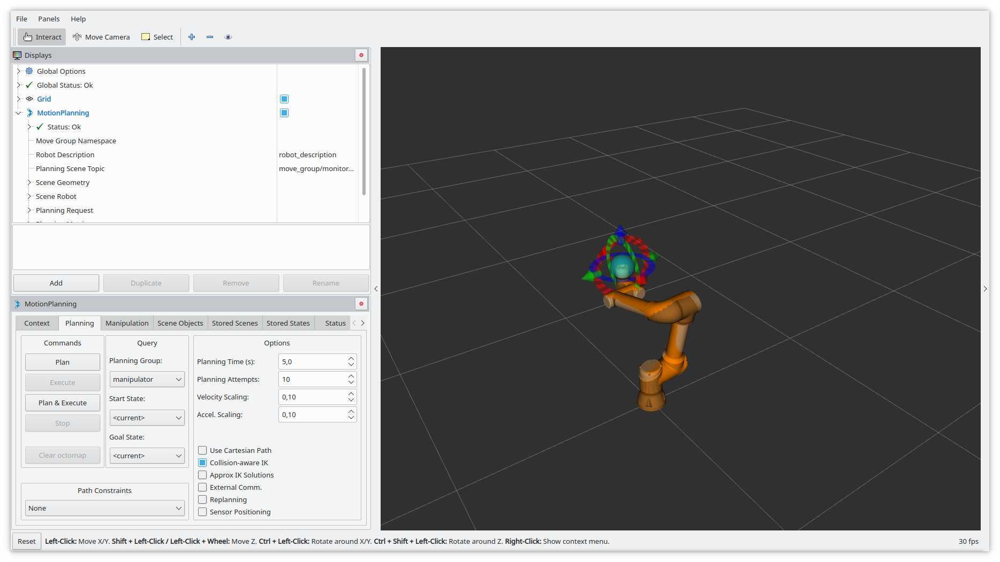
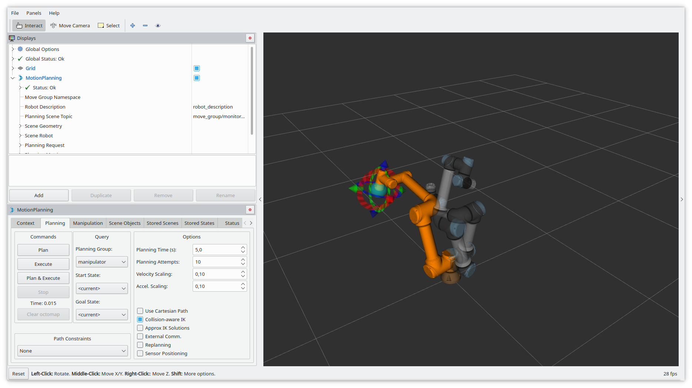

This page covers how to work with the Universal Robots' UR5e Collaborative Robotic Arm from it's e-Series line of cobots.

## Prepare the Robot

Download URCap file from [here](https://github.com/UniversalRobots/Universal_Robots_ExternalControl_URCap/releases) and install it on the robot as per instructions [here](https://github.com/UniversalRobots/Universal_Robots_ROS_Driver/blob/master/ur_robot_driver/doc/install_urcap_e_series.md).

## [Optional] Real-time Kernel Setup for Development Machine

It's recommended to use a development machine with real-time capabilities to run the UR5e driver. To enable real-time capabilities on a regular desktop installation of Linux, the kernel needs to be patched to unlock pre-empting capability. The process looks like this:

- Get sources for linux kernel and the corresponding real-time kernel patch
- Apply patch and compile kernel
- Install kernel and set up user privileges to execute real-time tasks.

The procedure is described in detail [here](https://github.com/UniversalRobots/Universal_Robots_ROS_Driver/blob/master/ur_robot_driver/doc/real_time.md).

Note that usage of a real-time kernel is optional and it's possible to use a non-real-time system to control the robot, however it is not recommended for optimal performance.

## Set up UR5e Drivers on Development Machine

In your development machine, install ROS Noetic as per instructions [here](http://wiki.ros.org/noetic/Installation/Ubuntu).

Download, build and source drivers:

``` sh
# source global ros
$ source /opt/ros/<your_ros_version>/setup.bash

# create a catkin workspace
$ mkdir -p catkin_ws/src && cd catkin_ws

# clone the driver
$ git clone https://github.com/UniversalRobots/Universal_Robots_ROS_Driver.git src/Universal_Robots_ROS_Driver

# clone the description. Currently, it is necessary to use the melodic-devel branch.
$ git clone -b melodic-devel https://github.com/ros-industrial/universal_robot.git src/universal_robot

# install dependencies
$ sudo apt update -qq
$ rosdep update
$ rosdep install --from-paths src --ignore-src -y

# build the workspace
$ catkin_make

# activate the workspace (ie: source it)
$ source devel/setup.bash
```

## Networking Setup

Connect the network cable from UR5e to the ethernet port of your development machine. Configure the wired network connection with the following settings:

- IPv6 method: Disable
- IPv4 method: Manual
- Address: 10.0.0.1
- Netmask: 255.255.255.0
- Gateway: 10.0.0.1
- DNS: Automatic
- Routes: Automatic

In UR5e settings, go to network section and configure the network for static IP with the following settings:

- Address: 10.0.0.2
- Netmask: 255.255.255.0
- Gateway: 10.0.0.1

## [Optional] Extract Calibration Information

Extract the current calibration information from the robot:

``` sh
roslaunch ur_calibration calibration_correction.launch robot_ip:=<robot_ip> target_filename:="${HOME}/my_robot_calibration.yaml"
```

Replace `<robot_ip>` in above command with the IP address of the robot. If you followed the above networking instructions, your robot IP should be `10.0.0.2`. The calibration file will be saved in your local machine at path `~/my_robot_calibration.yaml`.

## Running the UR5e Driver

On the ROS machine, start the UR5e driver:

```sh
roslaunch ur_robot_driver ur5e_bringup.launch robot_ip:=10.0.0.2 kinematics_config:=~/my_robot_calibration.yaml
```

Once the driver is started, load the URCap program on the UR5e control panel that will start the External Control program node and execute. Now the robot is operational and operable via the development machine.

You can make use of the Pause and Stop (stop_button) functions on the control panel of UR5e. Pressing the Play button again will reconnect the robot to the ROS driver running on the development machine.

## Controlling the UR5e using MoveIt

First, launch the robot driver, if not already running.

```sh
roslaunch ur_robot_driver ur5e_bringup.launch robot_ip:=192.168.56.101
```

In a separate terminal window, run MoveIt.

``` sh
roslaunch ur5e_moveit_config moveit_planning_execution.launch
```

In yet another terminal window, run Rviz visualizer.

``` sh
roslaunch ur5e_moveit_config moveit_rviz.launch rviz_config:=$(rospack find ur5e_moveit_config)/launch/moveit.rviz
```

This should launch a Rviz window with a robot model.



You can change the tcp target by dragging around the blue ball. The orange robot will show the configuration used to reach the target pose.


By clicking on the "Plan" button in the left panel a path from the current pose to the target pose is calculated. On success, it gets animated using a semi-transparent version of the robot.



By clicking on the Execute button in the left panel the robot executes the planned motion.


In a real-world application you would not use the ur5e_moveit_config package but create your own moveit configuration matching your actual workcell with all obstacles and sensors.

## References

- [Universal_Robot_ROS_Driver on GitHub](https://github.com/UniversalRobots/Universal_Robots_ROS_Driver)
- [Ubuntu real-time Kernel Setup Guide](https://github.com/UniversalRobots/Universal_Robots_ROS_Driver/blob/master/ur_robot_driver/doc/real_time.md)
- [Installing a URCap on e-Series robot](https://github.com/UniversalRobots/Universal_Robots_ROS_Driver/blob/master/ur_robot_driver/doc/install_urcap_e_series.md)
- [Using the ur_robot_driver](https://github.com/UniversalRobots/Universal_Robots_ROS_Driver/blob/master/ur_robot_driver/doc/usage_example.md)
