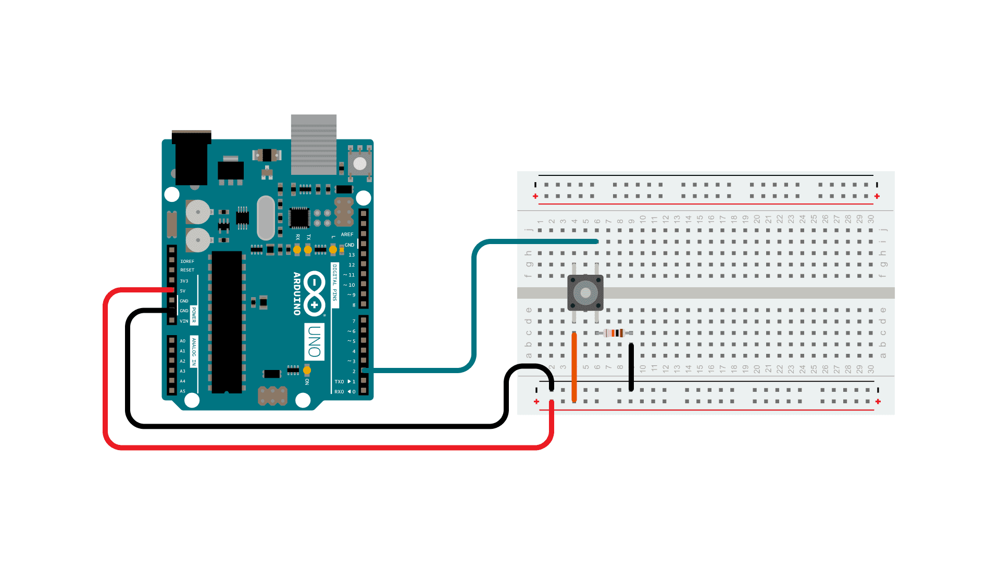

Arduino is a widely used platform in robotics and electronics due to its ease of use, affordability, and the wide variety of compatible components. Whether you're building a simple circuit or a complex robot, understanding how to use basic components like LEDs, push buttons, potentiometers, buzzers, servos, and stepper motors is essential. This guide will cover these fundamental Arduino components, explain their functionality, and provide simple examples to get you started to where you can incorporate them in to future robotic projects.

## LEDs

An LED (Light Emitting Diode) is one of the simplest and most commonly used components in Arduino projects. LEDs provide visual feedback and are often used as indicators for status, power, or signals. LEDs work by emitting light when an electric current flows through them in the correct direction. They require a resistor in series to prevent excessive current, which could damage the LED. To wire an LED to an Arduino, connect the long leg (anode) of the LED to a digital pin on the Arduino. The short leg (cathode) should be connected to the ground through a resistor, typically 220 ohms, to limit the current.

A simple wiring setup for an LED can be seen below along with a code snippet. The code will cause the LED to blink on and off. 


```
// the setup function runs once when you press reset or power the board
void setup() {
  // initialize digital pin LED_BUILTIN as an output.
  pinMode(LED_BUILTIN, OUTPUT);
}

// the loop function runs over and over again forever
void loop() {
  digitalWrite(LED_BUILTIN, HIGH);  // turn the LED on (HIGH is the voltage level)
  delay(1000);                      // wait for a second
  digitalWrite(LED_BUILTIN, LOW);   // turn the LED off by making the voltage LOW
  delay(1000);                      // wait for a second
}

```


## Push Button

A push button is a simple input device that completes an electrical circuit when pressed. It is commonly used to trigger events or control devices in Arduino projects. When the button is pressed, it allows current to flow, sending a signal to the Arduino. When released, the circuit is open, and no signal is sent. Pull-down or pull-up resistors are often used to ensure the circuit has a defined state (HIGH or LOW) when the button is not pressed. To connect a push button to an Arduino, attach one leg of the button to a digital input pin and the other to the ground. Additionally, use a pull-up resistor or enable the Arduino's internal pull-up resistor to stabilize the input state.

A simple wiring setup for a push button can be seen below along with a code snippet. The code will cause the serial monitor to print "Button Pressed" when the button is pressed, and print "Not Pressed" when the button is not pressed.




```
const int buttonPin = 2;  // the number of the pushbutton pin

// variables will change:
int buttonState = 0;  // variable for reading the pushbutton status

void setup() {
  // initialize the pushbutton pin as an input:
  pinMode(buttonPin, INPUT);
  Serial.begin(9600); // Start serial communication
}

void loop() {
  // read the state of the pushbutton value:
  buttonState = digitalRead(buttonPin);

  // check if the pushbutton is pressed. If it is, the buttonState is HIGH:
  if (buttonState == HIGH) {
	Serial.println("Button Pressed):
} else {
    Serial.println("Not Pressed):
  }
}
```

Note: When a push button is pressed, it may generate multiple rapid on/off signals due to the mechanical nature of the button. This is known as "bouncing" and can cause unexpected behavior in your circuit. To address this, you can use a small delay in your code or implement software debouncing techniques. You can read more about debouncing at the link in the "Further Reading" section below

## Potentiometers

A potentiometer is a variable resistor that allows you to adjust resistance by turning a knob or sliding a lever. It is commonly used as an input device for controlling brightness, volume, or speed in Arduino projects. A potentiometer has three terminals: two outer terminals connected to a fixed resistor and one middle terminal (the wiper) that moves along the resistor as you adjust the knob. By reading the voltage at the wiper, the Arduino can determine the position of the potentiometer.To wire a potentiometer, onnect one outer terminal to 5V on the Arduino and the other outer terminal to GND. Connect the middle terminal (wiper) to an analog input pin, such as A0. This setup allows the Arduino to read a voltage that corresponds to the potentiometer's position.

An image of a simple wiring for a potentiometer can be seen below along with a code snippet. To read a potentiometer you will need to use an analog pin and the analogRead() Arduino function. 

Note: A useful function when dealing with analog signals is the map() function. More can be found about this function in the "Further Reading section.


```
const int potPin = A0; // Pin connected to the potentiometer

void setup() {
  Serial.begin(9600); // Start serial communication
}

void loop() {
  int potValue = analogRead(potPin); // Read potentiometer value (0-1023)
  Serial.println(potValue);         // Print value to serial monitor
  delay(100);                       // Delay for readability
}
```

## Buzzers

A buzzer is a simple electronic component that generates sound when powered, often used in Arduino projects for audible feedback, alarms, or notifications. There are two main types of buzzers: active and passive. An active buzzer generates sound when supplied with power and does not require any signal control, making it straightforward to use. A passive buzzer, on the other hand, requires a signal (such as a PWM signal) to produce sound, allowing for the creation of different tones.

Buzzers work by converting electrical energy into sound through the vibration of a piezoelectric diaphragm. The frequency of the signal determines the tone of the sound produced. To wire a buzzer, connect the positive terminal to a digital output pin on the Arduino and the negative terminal to the ground (GND). For an active buzzer, you can simply turn it on and off using digital signals. For example, you can alternate between HIGH and LOW states to create a beep. A passive buzzer can generate tones of varying frequencies using the Arduino's tone() function.

Buzzers are versatile components with applications in security systems, timers, notification systems, and user interfaces where audible feedback is needed. They provide an effective way to communicate events, warnings, or statuses in a project.

The wiring for a simple piezo buzzer can be seen below alogn with a code snippet. The code will cause the buzzer to continuously start and stop buzzing.


```
const int buzzer = 9; //buzzer to arduino pin 9

void setup(){
  pinMode(buzzer, OUTPUT); // Set buzzer - pin 9 as an output
}

void loop(){
  tone(buzzer, 1000); // Send 1KHz sound signal...
  delay(1000);        // ...for 1 sec
  noTone(buzzer);     // Stop sound...
  delay(1000);        // ...for 1sec
}
```

## Servo Motors

A servo motor is a rotary actuator that allows precise control of angular position, speed, and torque. It is widely used in robotics and Arduino projects due to its compact size and ability to move to a specific position within a range. Servo motors are ideal for tasks that require controlled movements, such as steering mechanisms, robotic arms, or pan-tilt camera systems.

Servo motors typically have three wires: a power wire (usually red), a ground wire (usually black or brown), and a signal wire (often yellow, orange, or white). The power and ground wires connect to the Arduino’s 5V and GND pins, respectively, while the signal wire connects to a digital output pin. The signal wire receives pulse-width modulation (PWM) signals from the Arduino, which dictate the servo's angle of rotation. Most standard servo motors have a range of motion from 0 to 180 degrees.

Using the Arduino Servo library simplifies the control of servo motors. For example, you can set the angle of the motor by sending a specific value through the write() function.

A simple wiring of a servo motor setup can be seen below. A code snippet is also below, and this snippet causes the servo motor to rotate back adn forth.


```
#include <Servo.h>

Servo myservo;  // create servo object to control a servo
// twelve servo objects can be created on most boards

int pos = 0;    // variable to store the servo position

void setup() {
  myservo.attach(9);  // attaches the servo on pin 9 to the servo object
}

void loop() {
  for (pos = 0; pos <= 180; pos += 1) { // goes from 0 degrees to 180 degrees
    // in steps of 1 degree
    myservo.write(pos);              // tell servo to go to position in variable 'pos'
    delay(15);                       // waits 15ms for the servo to reach the position
  }
  for (pos = 180; pos >= 0; pos -= 1) { // goes from 180 degrees to 0 degrees
    myservo.write(pos);              // tell servo to go to position in variable 'pos'
    delay(15);                       // waits 15ms for the servo to reach the position
  }
}
```

## Stepper Motors

A stepper motor is a type of DC motor that divides a full rotation into a series of discrete steps, making it ideal for applications requiring precise control of angular or linear position, speed, and acceleration. Unlike servo motors, stepper motors are not limited to a specific range of motion and can rotate continuously in precise increments. This makes them widely used in CNC machines, 3D printers, robotic arms, and other Arduino-based projects.

Stepper motors have multiple coils organized in phases, and the motor is driven by energizing these coils in a specific sequence. Most stepper motors have four or more wires that are connected to a motor driver, such as the A4988 or ULN2003, which interfaces with the Arduino. The motor driver controls the sequence of energizing the coils based on signals sent from the Arduino, allowing for smooth and precise movement.

To use a stepper motor with an Arduino, the Stepper library simplifies the process. Stepper motors vary, so their wiring can vary based off the motor driver they require.The 28BYJ-48 4-Phase Stepper Motor is the simplest stepper motor that comes with Arduino beginner kits, and its wiring is shown in the diagram belwo along with a code snippet that rotates the motor clockwise and counter-clockwise at varying speeds. 


```
`//Includes the Arduino Stepper Library
#include <Stepper.h>

// Defines the number of steps per rotation
const int stepsPerRevolution = 2038;

// Creates an instance of stepper class
// Pins entered in sequence IN1-IN3-IN2-IN4 for proper step sequence
Stepper myStepper = Stepper(stepsPerRevolution, 8, 10, 9, 11);

void setup() {
    // Nothing to do (Stepper Library sets pins as outputs)
}

void loop() {
	// Rotate CW slowly at 5 RPM
	myStepper.setSpeed(5);
	myStepper.step(stepsPerRevolution);
	delay(1000);
	
	// Rotate CCW quickly at 10 RPM
	myStepper.setSpeed(10);
	myStepper.step(-stepsPerRevolution);
	delay(1000);
}`
```


## Summary
Use this space to reinforce key points and to suggest next steps for your readers.

## See Also:
- https://roboticsknowledgebase.com/wiki/computing/arduino/

## Further Reading
- Links to articles of interest outside the Wiki (that are not references) go here.

## References
Arduino Project Handbook by Mark Geddes https://www.amazon.com/Arduino-Project-Handbook-Practical-Projects/dp/1593276907

