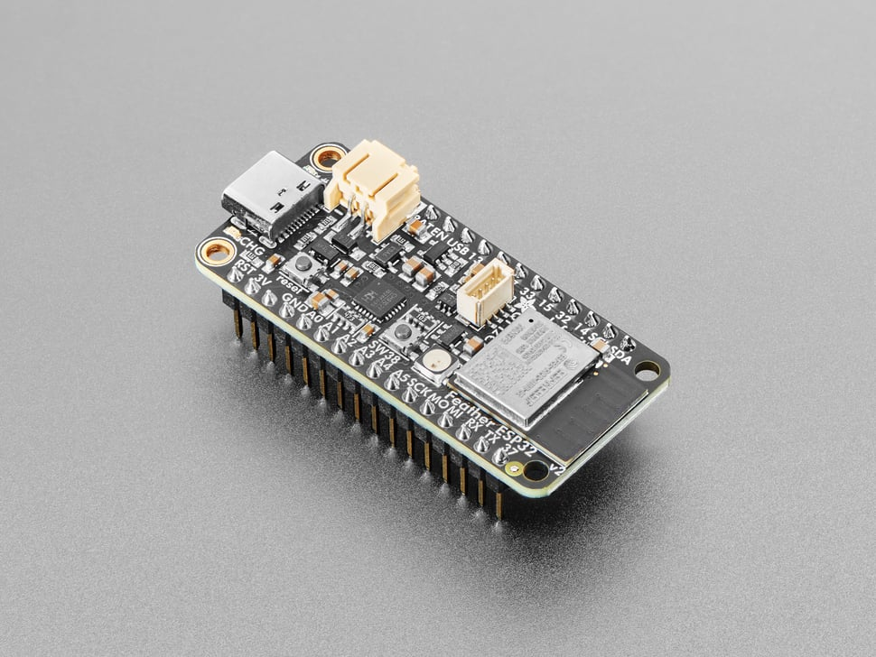

This page serves as a readable pre-project start guide for projects considering the use of commercial off the shelf embedded platforms within their applications. Commercial off the shelf embedded platforms, such as microcontrollers, can significantly simplify and abstract away the difficult process of configuring firmware and breakouts for the underlying chip, but it can be difficult to decide what to purchase without prior knowledge of their capability. Recent significant advances in the processing power of these embedded compute devices means they have a lot more potential than what many expect - we aim to explore them here.

# Single-Board COTS Embedded Devices

## Arduino Family
The Arduino family's architecture runs on the proprietary Arduino firmware - this are low power, flash programmed applications that are then saved to the onboard EEPROM for reboots. These support high-speed single-threaded C/C++ applications, but for applications that require file management, large file processing, and the like, an external device will have to be used in support of this. The architecture is highly efficient, making it great for hardware control and sensing.

### Arduino Uno

#### Overview
Based on the ATMega328P, the Arduino Uno is capable of running simple projects or systems that require simplistic actuation. With an internal clock running at 16 MHz, applications involving it will run within the millisecond range for single-threaded applications. 

In terms of compute, this means that the Arduino Uno may be suitable for small, ground robotic power and control, being capable of adapting to PID control within the millisecond range at it's maximum performance. For anything significantly more intensive, such as aerial PID, the Uno may be unsuitable without significant considerations made to the flight paradigm of the vehicle. While capable of overclocking, the Uno has no native heat monitor or safety, and is generally not recommended.

The Arduino Uno's flash memory encompasses only 32KB, with an SRAM of 2KB. This means that applications involving the Uno are constrained in terms of their complexity - but standard single-threaded applications don't approach this limit in standard operations. This also makes it viable for data-transfer applications, as for Ethernet communication, the Uno would only add a few miliseconds at most of delay. 

#### Recommendation
The Uno is highly recommended for simple hardware projects - the breakouts supply a standard 5V output, with 14 digital I/O pins and 6 analog pins. With numerous shields built for the Uno, as well as native Ethernet, it can prove as a extremely cheap and viable platform for this usecase. 

### Arduino Due

#### Overview
A significantly more powerful Arduino is the Arduino Due, which features a 32-bit ARM Cortex-M3 processor, the same kind that's typically found in smartphones. With a clock running at 84 MHz, it's much more capable of significantly more complex tasks, though it will still be single-threaded.

The Arduino Due will be capable of more complex manipulation, such as real-time data processing through it's input ports, streaming of data to offloaded areas, 3D printing control, and complex, multi-DOF robots. Without a native graphics processor, it's still largely unable to perform higher-level functions, such as ones that support an operating system, but still remains as a cheap and effective method if the Uno isn't at the speeds or complexity required.

The flash memory here is 512 KB, with an SRAM of 96 KB. This allows significantly more complex files than the Uno, which can allow much more inclusion of larger Arduino libraries that can perform sophisticated processing. In terms of breakout, it has 54 digital I/O pins with PWM on 12 of them, and 12 analog input pins.

#### Recommendation
The Due is viable for what would be the hardware brains of a more sophisticated robot than the Uno. With a greater amount of breakouts and a significantly higher processing speed and filesize, robots that cannot operate on an Uno may have significantly better luck on a Due. 

## Adafruit Expansion (ESP32, Arduino Firmware)
Has similar specifications to the Arduino Family in terms of software architecture - refer above.

### Adafruit Feather

#### Overview
The Adafruit Feather ESP32 is the most compact single-board processor on this list, and despite its small size, comes with native Bluetooth and WiFi, with cheap expanders for Ethernet. Running on a 32-bit LX6 microprocessor, it has a speed of 240 Mhz, exceeding the already highly competitive ARM Cortex-M3. 

Running on the Arduino firmware, it will take in any Arduino standard script, running it rapidly in a single thread. It's extremely small form factor, being the size of a Raspberry Pi Zero almost, allows it to be viable for small-factor drones, robots, or to be stacked repeatedly to create a cheap computing cluster. With a variable clock speed that can be further overclocked, and a flash memory of 4MB, the Feather vastly outperforms its older Arduino counterparts. 

This allows the Feather to be used in a variety of data processing applications, including sensor networks, real-time data streaming, and low-power IoT devices. While not capable of graphics processing without some additional work being done, it is arguably, at the time of writing, one of the best affordable single-board processors out there. 

#### Recommendation
While not supporting some native applications, and requiring soldering/manual breakout into a board, the Feather is a highly sophisticated board that shoots above its small form factor. In terms of hardware control and processing, it is a strong contender if speed/performance is a requirement, and the tools to interface with it are already present, being around the same price range of the Uno. With Featherwings that support a variety of sensors/interfacing, this is a highly effective way to build a robust low-voltage IoT project.

## Raspberry Pi Family
The Raspberry Pi, while typically advertised as educational, has surprisingly robust use for industry due to its versatility. With native Linux built in via the Raspbian software published by the Raspberry Pi Foundation, or with Ubuntu alternatives, the Raspberry Pi's versatilty and ease of use makes it a strong contender for embedded compute, rather than hardware control, though that is also viable.

### Raspberry Pi Zero/Zero 2

#### Overview
The Raspberry Pi Zero and its successor, the Zero 2 W, are credit-card-sized single-board computers targeting ultra-compact embedded applications. The original Zero, with a single-core 1GHz ARM11 processor and 512MB RAM, is suitable for lightweight GPIO tasks, data logging, or simple automation. However, the Zero 2 W brings a substantial performance jump by using the same quad-core ARM Cortex-A53 chip found in earlier Pi 3 models, clocked at 1GHz. This makes it capable of running lightweight Python-based web servers, basic computer vision with TensorFlow Lite, and even real-time sensor fusion for mobile robots.

The Zero 2 W has been benchmarked to run TensorFlow Lite object detection models at around 1.5–1.75 FPS, which is respectable given its size and power draw. It's also capable of running full Linux GUI environments, albeit slowly — the Zero 2 W has around 4–5× the compute power of the original Zero, which is now mostly relegated to headless, single-purpose setups. Both variants support GPIO breakouts, camera modules, and USB OTG via micro-USB ports.

The Raspberry Pi Zero is slated to have its end of production in January 2026, and its rarity already compared to other Raspberry Pi offerings means that its unlikely you will have the ability to purchase one. However, the Zero is still a strong contender, should it be found on older projects/recycled into newer projects from storage, especially for running automation tasks on the level of Arduino, but with the desire for a Linux operation system.

#### Recommendation
The Raspberry Pi Zero is ideal for extremely constrained projects where low cost and simplicity are key — such as USB gadgets, kiosk controllers, or GPIO-driven automation. However, for any task requiring substantial processing (e.g., image recognition, real-time comms, or multi-sensor fusion), the Zero 2 W is strongly recommended due to its quad-core architecture and better thermal design. With native Linux support, these devices benefit from vast package compatibility and development tooling, but do require more setup and care around power, thermal control, and OS maintenance. Overclocking is supported through config files but is not recommended without a passive or active cooling solution, which do not come natively on the system.

### Raspberry Pi 3, Model B (4GB)

#### Overview
The Raspberry Pi 3, Model B is a quad-core ARM Cortex-A53 single-board computer running at 1.2GHz, offering a significant leap in performance and flexibility compared to traditional microcontroller platforms like the Arduino Uno or Due. Unlike microcontrollers, which are limited to bare-metal or firmware-level tasks and typically lack native file systems, the Pi 3B runs full Linux distributions, enabling access to modern development environments, process scheduling, and threading — critical for compute-heavy tasks such as image processing and edge inference.

In the context of classic computer vision techniques, the Pi 3B holds up surprisingly well. It can run real-time OpenCV pipelines that perform operations such as Gaussian filtering, background subtraction, morphological transforms, Canny edge detection, and Hough transforms at full resolution and interactive frame rates (10–15 FPS depending on camera and resolution). Older models such as Haar cascades for face or object detection also run well within acceptable latencies (<200 ms), making it viable for interactive systems, kiosk detection, or robotics.

When it comes to slightly heavier models like YOLOv3-tiny or MobileNet-based classification, the Pi 3B can support inference at ~1–2 FPS using optimized TensorFlow Lite or OpenCV DNN modules — not real-time, but fast enough for periodic detection or control decisions. To accomplish this, significant changes to page size, formatting, clock, and the standard make may be required in order to build up to this level, as well as reduction in the resolution to around the 640x480 to 320x240 level. For production environments, the assumption should be made that real-time streaming at anything greater than 0.5FPS is difficult to consistently achieve.

Thermal management is an important consideration — without active cooling, the Pi 3B can throttle under extended heavy workloads. Passive heatsinks are often enough for intermittent CV pipelines, but continuous ML inference or video streaming benefits from fan cooling. Storage via microSD is the primary bottleneck for boot and read/write operations; using fast UHS-I cards or booting from USB can help reduce latency in image-intensive applications.

The Pi 3B’s full-size HDMI, camera interface (CSI), and USB ports also make it a strong candidate for projects requiring real-time video streaming, camera-based navigation, or human-machine interaction. Coupled with native Wi-Fi and Bluetooth support, it serves well as an edge compute unit in smart IoT deployments.

In terms of purchasing a 3B, they are largely obselete compared to newer models, which are discussed further below. However, because they were so prolific between 2015 and 2019, it would not be difficult to find ones from older discontinued robotic projects.

#### Recommendation
For vision-based projects where performance matters but GPU acceleration is not mandatory, the Raspberry Pi 3B represents a sweet spot between microcontroller simplicity and desktop-class compute. It supports legacy and lightweight CV pipelines with enough headroom to run detection, segmentation, and control loops in parallel — something entirely infeasible on microcontroller-class devices like the Uno. With proper thermal and storage considerations, it's a highly capable board for prototyping or deploying intelligent embedded systems in robotics, surveillance, or smart environments. The recommendation is simple - for projects with singular image capture, which can be followed by seconds to a minute of processing, the Raspberry Pi 3B is a cheap and effective platform to support this.

### Raspberry Pi 3, Model B+ (16GB)
#### Overview
The Raspberry Pi 3 Model B+ is an evolutionary upgrade to the Pi 3B, maintaining the same physical form factor but refining its internals for improved thermal behavior, connectivity, and slightly increased performance. It runs on the same quad-core ARM Cortex-A53 processor but with a higher clock speed of 1.4GHz (versus the 1.2GHz of the original 3B), and it integrates improved thermal management via a heat spreader on the SoC, allowing it to sustain workloads more consistently before thermal throttling.

From a computer vision standpoint, the B+ performs almost identically to the standard Pi 3B in terms of raw compute power — but the slight increase in clock speed, combined with improved heat dissipation, can provide marginal gains (5–10%) in frame rate or inference latency for tightly looped OpenCV pipelines or lightweight ML workloads.

In real-world applications like human detection using Haar cascades, marker tracking, or line-following in robotics, the Pi 3B+ provides a fluid experience, often performing with sub-150 ms latencies per frame. It can also run compressed or quantized versions of lightweight neural networks like YOLOv3-tiny, SqueezeNet, or MobileNet via TensorFlow Lite or OpenCV DNN, albeit at low frame rates (typically 1–2 FPS for 224x224 images).

Network connectivity is where the Pi 3B+ sees its largest leap: it includes Gigabit Ethernet (shared over USB 2.0, yielding real-world speeds around 300 Mbps), dual-band 2.4GHz/5GHz Wi-Fi, and Bluetooth 4.2. These upgrades make it far more viable as a node in a distributed system, particularly when streaming video or transmitting classification results to a central server, which ended up being its primary usecase during its production era (for implementations such as security cameras).

The Raspberry Pi 3B+ ended up being significantly more common than the 3B, and its very likely to easily encounter it sitting around for older robotic projects, or in larger storage areas. It is still in production until at least 2030.

#### Recommendation
The Raspberry Pi 3B+ is arguably the most balanced and widely used Pi for general-purpose embedded vision work back when it was released. It offers a well-rounded combination of slightly improved performance, significantly better networking, and more stable thermals compared to its predecessor — while retaining compatibility with the enormous ecosystem of Raspberry Pi accessories and documentation. That being said, at its purchasing pricepoint with no prior equipment, it's strongly recommended to just go for the 4 or 5, as the setup equipment + time + SD card + accessories + shipping will make the price difference marginal. However, because of its ease of being found on older projects, it's strongly recommended that if you have a usecase for it, it remains extremely robust and highly effective.

### Raspberry Pi 4, Model B

#### Overview
The Raspberry Pi 4 Model B is a transformative upgrade over the 3B+ when it comes to computer vision and real-time image processing. The most impactful architectural improvement is the transition from the Cortex-A53 (Pi 3B+) to the more powerful quad-core ARM Cortex-A72 CPU, clocked at 1.5 GHz. This change not only improves single-core performance significantly (~2x) but also boosts multi-threaded throughput, allowing for real-time, multi-stage CV pipelines to run far more efficiently.

Additionally, the upgraded LPDDR4-3200 SDRAM (available in 2GB, 4GB, and 8GB) enables large image buffers and supports multiple simultaneous processes — such as concurrent camera feeds, OpenCV processing, and control algorithms. Where the 3B+ might stall under multiple high-resolution inputs or during YOLO-lite inference, the Pi 4 (especially in its 4GB and 8GB variants) maintains usable throughput.

In practical benchmarks, the Pi 4 can achieve:

- 15–25 FPS on 640x480 OpenCV pipelines involving Canny, contour detection, adaptive thresholding, and optical flow.

- ~5 FPS with YOLOv3-tiny or MobileNet SSD object detection using TensorFlow Lite or ONNX runtimes.

- ~15–20 FPS on full-body and face detection using Haar cascades or HOG-based models with histogram equalization, even with basic pre-filtering.

- Up to 30 FPS hardware-accelerated video decoding from USB webcams or CSI cameras, useful for drone feeds or real-time streaming to ground stations.

#### Application:
With dual camera input, and multiple USB ports, the Pi 4 is capable of performing SLAM on its own with stereo cameras, or an attached depth camera. Feature detection, keyframe extraction using ORB in real-time is possible with minimal latency. With additional ports, sensor fusion with EKFs, IMUs, and the like is also doable, making it a powerful device that can serve as the "brains" for drones and unmanned ground vehicles. With native Ethernet and 5GHz WiFi, streaming and teleoperation is no longer a challenge compared to the 3B+, and with Ubuntu, or a Raspbian ROS2 distribution, it can easily integrate into a robotics network. In fact, many proprietary small robots companies, such as the Leo Rover, use the Raspberry Pi 4 as their production base.

#### Practical Considerations
While it’s an exceptionally powerful board for its size and price, the Pi 4 is more thermally sensitive than its predecessors. Continuous inference or 100% CPU usage will throttle performance unless active cooling is used. For embedded environments (enclosed robots, drones, etc.), a heatsink is strongly recommended.

#### Recommendation
For embedded CV and robotics applications — especially those involving real-time feedback, neural net inference, or multi-sensor fusion — the Raspberry Pi 4 (4GB or 8GB) is in a class of its own. It is not just an incremental improvement over the 3B+; it repositions the Pi platform as a legitimate low-end embedded compute node, replacing x86-based mini-PCs in many use cases. When the Raspberry Pi 4 came out, it significantly overhauled the capability in terms of embedded distributed compute, and is now a flagship standard for remote embedded CV, with much more modernized algorithms making their way into active deployment. It will continue to retain production into the 2030s, making it a recommended purchase for anybody seeking to perform computer vision on an embedded platform, or for anybody who wants a one-and-done compute solution for their robotic project.

### Raspberry Pi 5

#### Overview
The Raspberry Pi 5 represents a significant advancement in single-board computing, particularly for applications in computer vision and robotics. Equipped with a 2.4GHz quad-core ARM Cortex-A76 CPU and an 800MHz VideoCore VII GPU, it delivers a 2–3× increase in CPU performance compared to the Raspberry Pi 4 . This enhanced processing power enables more efficient handling of complex tasks, such as real-time image processing and machine learning inference. With NVMe SSD support, data throughput and speed put it on par with a personal computer.

This means that compared to the 4, larger computer vision algorithms can be run, including live object detection and tracking, which puts it closer to dedicated GPU-based microcontrollers such as the Orin/Jetson, but retaining the versatility of a high-powered CPU. 

#### Recommendations
As of the time of writing, the Raspberry Pi 5 is still undergoing benchmarking and testing, but will remain in production for a while. While a significant step up from the Raspberry Pi 4, the capability of the Raspberry Pi 5 begins to approach the level of personal computers/smartphones in terms of capability, and many may find that the price point doesn't justify the added capability, especially when considering the needed requirements for an embedded platform. However, like the 4, it can serve as a single-board Linux "brains" of a robotic project, making it a solid choice if the budget allows. In terms of systems with stronger capabilities, the NVIDIA Orin/Jetson series will be the only ones with stronger compute, but those are specifically due to native CUDA and GPU support, rather than from a versatility perspective, which the Raspberry Pi 5, and 4 to an extent, will still outperform on CPU-linked operations. Furthermore, the NVIDIA series of single-board controllers is significantly more expensive, around 5-10x depending on variation and manufacturing.