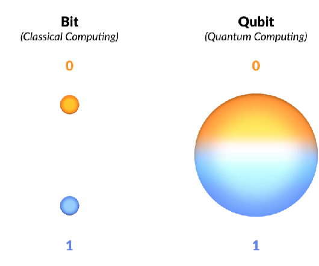
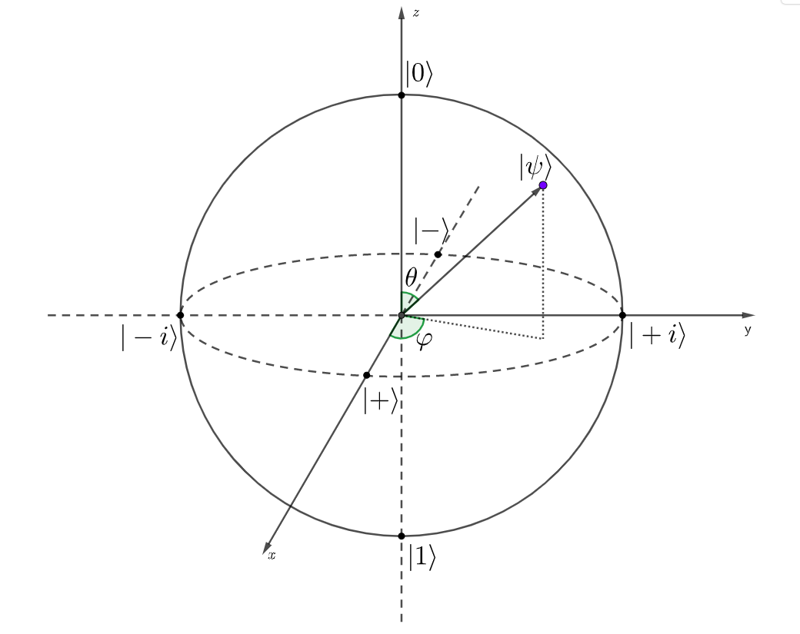
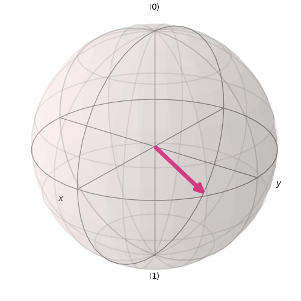
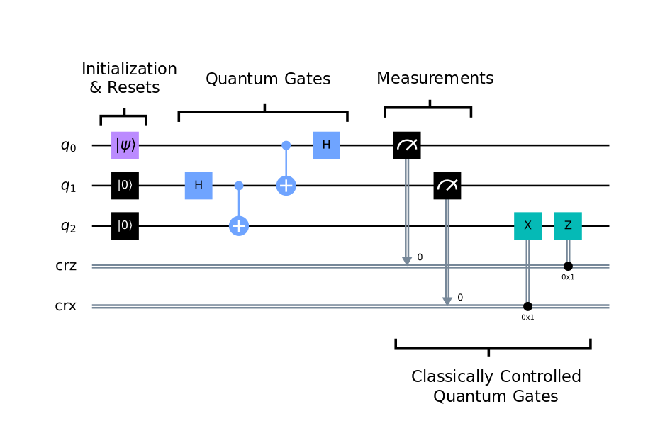
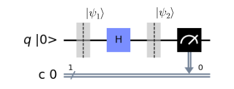
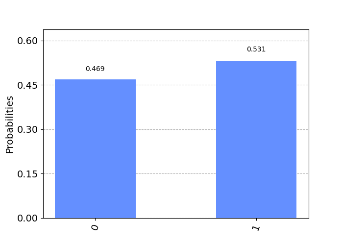
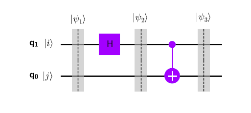
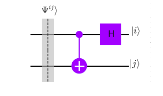

---
# Jekyll 'Front Matter' goes here. Most are set by default, and should NOT be
# overwritten except in special circumstances. 
# You should set the date the article was last updated like this:
date: 2024-05-05 # YYYY-MM-DD
# This will be displayed at the bottom of the article
# You should set the article's title:
title: Quantum Computing and the Qiskit Package
# The 'title' is automatically displayed at the top of the page
# and used in other parts of the site.
---
With the undeniable rise of quantum computers, future generations of roboticists must be versed in the functioning and applications of this technology. However, very few concise guides exist that explain quantum computing in introductory terms for a techincal audience. This article shows some basic principles of quantum computing together with the Python package Qiskit, developed by IBM.

## Fundamentals of Quantum Computing - Single Qubit Systems 

While classical computers operate in terms of "bits", quantum computers are based on the concept "qubits". The difference between the two reflects a difference between the deterministic and the probabilistic. A classical computer could, for example, read an electric voltage and associate a certain bit value with it: if the voltage is below a certain threshold, it is assigned the bit "0"; if the voltage is higher then the same threshold, it gets the bit "1". Since electrical signals (among other physical entities) follow classical laws, the signal can either be 0 or 1, meaning it is binary. 

On the other hand, consider the spin of some electron, which is described by quantum mechanics. Say we assign the spin up to the state $|0\rangle$ and the spin down to the state $|1\rangle$. This way, any state $|\psi\rangle$ of the electron's spin can be expressed as in the equation, where the normalization is required as per Born's rule. The range of all possible values of $|\psi\rangle$ is called its vector space or state space.


$$
|\psi\rangle = \alpha |0\rangle + \beta|1\rangle \; | \; \alpha,\beta \in \mathbb{C}, \; |\alpha|^2 + |\beta|^2 = 1
$$





We can use the electron’s spin (or some other physical entity bound by quantum mechanics) as a means of transmitting information, therefore stepping into the world of quantum computing (QC).

Any quantum signal whose state can be written as a superposition of two binary states is a "quibt". In our example, the spin of a single electron is a qubit. The pair $\{|0\rangle, |1\rangle\}$ represents an orthonormal basis, called the computational basis, which can be used to perform measurements. These measurements allow us to access the information stored in a qubit and transform it into a classical signal, or "cbit" (classical bit). This is generally done by assigning $|0\rangle \rightarrow 0$ and $|1\rangle \rightarrow 1$. 

Some differences in relation to classical computing already start to appear. Consider, for example, the qubit whose state is given by $|\psi\rangle = \frac{1}{\sqrt{2}}|0\rangle + \frac{1}{\sqrt{2}}|1\rangle$. If we measure this signal with respect to the computational basis, we get $Pr[|0\rangle] = Pr[|1\rangle] = \frac{1}{2}$, meaning that the same signal, when converted to a classical bit (using the equivalence previously established) will yield bit 0 50% of the time and bit 1 50% of the time. Therefore, the same signal can result in different values when measured. This property is what makes QC different than classical computing. While a classical bit can be either 0 or 1, a quantum bit exists as a whole range of superpositions, and its measured value is probabilistic.


Many people think quantum computers are just a more powerful version of regular computers, but that is false. The truth is that they are based on a completely different operating principle. As such, they are better for some tasks and worse for others. Some areas where quantum computers (will) excel are:

- Cryptography and cryptanalysis
- Simulations
- Materials science
- Etc.


Back to the technical bit. We previously mentioned the computational basis $\{|0\rangle, |1\rangle\}$, but in reality any pair of states $\{|a_1\rangle, |a_2\rangle\}$ such that $\langle a_i | a_j \rangle = \delta_{ij}$, with $\delta_{ij}$ the Kronecker delta, can be used as a basis for the qubit's state space. Although we have discussed measurements against the computational basis, in reality measurements can be made against any orthonormal basis. Some special orthonormal state pairs are particularly noteworthy:


- Basis $\{|+\rangle, |-\rangle \}$ (also called the Hadamard basis)
    - $\vert + \rangle = \frac{1}{\sqrt{2}}(\vert0\rangle + \vert1\rangle)$
    - $\vert - \rangle = \frac{1}{\sqrt{2}}(\vert0\rangle - \vert1\rangle)$
- Basis $\{|+i\rangle, |-i\rangle \}$ 
    - $\vert +i \rangle = \frac{1}{\sqrt{2}}(\vert0\rangle + i\vert1\rangle)$
    - $\vert -i \rangle = \frac{1}{\sqrt{2}}(\vert0\rangle - i\vert1\rangle)$


There are several ways to represent a single qubit. One of them is the vector representation, which is particularly useful when we wish to represent operators/gates as matrices. In this representation, a state such is written as $|\psi\rangle = \begin{bmatrix} \alpha \\ \beta \end{bmatrix}$. Henceforth, whenever a vector notation is used, we'll assume it is with respect to the computational basis.

Another representation of a single qubit system relates to the concepts of global phase and relative phase. Two qubit states $|\psi\rangle$ and $|\psi'\rangle$ are considered equivalent ($|\psi\rangle \sim |\psi'\rangle$) if there exists a value $\alpha \in [0, 2\pi)$ such that $|\psi\rangle = e^{i \alpha} |\psi'\rangle$. The angle $\alpha$ is called the global phase of the state. By manipulating the global phase of the state, it is possible to see that any qubit state can be written as $|\psi\rangle = \begin{bmatrix} \cos{\frac{\theta}{2}} \\ e^{i\varphi} \sin{\frac{\theta}{2}}\end{bmatrix}$, with $\theta \in [0, \pi]$ and $\varphi \in [0, 2\pi)$. The angle $\varphi$ is called the relative phase. The angle pair $(\theta, \varphi)$ can be used to represent the qubit using the so-called "Bloch sphere", which is shown below. In the Bloch sphere, we represent the state $|\psi\rangle$ as a unit vector from the origin, with $\theta$ being its polar angle and $\varphi$ its azimuth angle. Another feature of the Bloch sphere is that it maps the special states previosuly described to key points on the sphere's surface.



## Single Qubit Systems in Qiskit

From Wikipedia:

> Qiskit is an open-source software development kit (SDK) for working with quantum computers at the level of circuits, pulses, and algorithms. It provides tools for creating and manipulating quantum programs and running them on prototype quantum devices on IBM Quantum Platform or on simulators on a local computer. It follows the circuit model for universal quantum computation, and can be used for any quantum hardware (currently supports superconducting qubits and trapped ions) that follows this model. 

As mentioned above, Qiskit offers packages that can run both on local hardware and on IBM's actual quantum computers. In order to run them on IBM's machines, you can follow the instructions here: <https://docs.quantum.ibm.com/start/install>

For documentation on Qiskit: <https://docs.quantum.ibm.com/api/qiskit>

For installation:

```shell
pip3 install qiskit
pip3 install qiskit-ibm-runtime
```

The code below serves a starter on how to plot a single vector into a Bloch sphere. More advanced code will be shown as we progress

```python
import numpy as np
from qiskit.visualization import plot_bloch_vector
import matplotlib.pyplot as plt

# Define a Bloch sphere point using the angles mentioned
r = 1
theta = np.pi/2
phi = np.pi/3
plot_bloch_vector([r, theta, phi], coord_type='spherical', title="Bloch Sphere Qiskit")

plt.show()
```




## Multiple Qubit Systems

Suppose we now have two qubit channels, $A$ and $B$, each one containing a state: $|\psi_A\rangle_A = a_0|0\rangle_A + a_1 |1\rangle_A$ and $|\psi_B\rangle_B = b_0|0\rangle_B + b_1 |1\rangle_B$ respectively. The full state $|\psi\rangle_{AB}$ of the system is written below, where $\otimes$ represents the tensor product of the elements. 


$$
\begin{split}
  |\psi\rangle_{AB} = |\psi_A\rangle_A \otimes |\psi_B\rangle_B = a_0b_0 |0\rangle_A \otimes |0\rangle_B \\
  +a_0b_1\vert0\rangle_A\otimes\vert1\rangle_B \\
  +a_1b_0\vert1\rangle_A\otimes\vert0\rangle_B \\
  +a_1b_1\vert1\rangle_A\otimes\vert1\rangle_B 
\end{split}
$$

We can simplify the notation on the right hand side of the equation above by adopting the convention that $|a\rangle_A \otimes |b\rangle_B = |a\rangle_A|b\rangle_B = |ab\rangle_{AB}$. The values $\{|00\rangle_{AB}, |01\rangle_{AB}, |10\rangle_{AB}, |11\rangle_{AB} \}$ form a basis for the complete system, also called the computational basis (in analogy to the single qubit system). Using the vector notation proposed previously, we have $|\psi\rangle_{AB} = [a_0b_0,\; a_0b_1,\; a_1b_0,\; a_1b_1]^T$. 


$$
\begin{split}
    |\psi\rangle_{AB} = a_0b_0 |00\rangle_{AB} \\
    +a_0b_1 |01\rangle_{AB} \\
    +a_1b_0 |10\rangle_{AB} \\
    +a_1b_1 |11\rangle_{AB}
\end{split}
$$

This notion can be extended. Each qubit is a complex vector space $V_i$ of computational basis $\{|0\rangle_i, |1\rangle_i \}$. For a system of $n$ qubits, the complete vector space is $V=V_{n-1} \otimes ... \otimes V_1 \otimes V_0$, with computational basis $B = \{ |0\rangle_{n-1}...|0\rangle_1|0\rangle_0,|0\rangle_{n-1}...|0\rangle_1|1\rangle_0,..., |1\rangle_{n-1}...|1\rangle_1|1\rangle_0 \}$ yielding a total of $2^n$ elements. We can both drop the subscripts and join the basis states in order to keep the notation for the computational basis more palatable $B = \{|0...00\rangle, |0...01\rangle,...,|1...11\rangle \}$. It is important, however, to remember two things: 

1. the number of qubits involved in the system, which should be clear from the context; and 
2. the fact that the rightmost digit of each basis element refers to qubit 0, the second rightmost to qubit 1, and so on.

We can compress this notation even further by doing a binary-decimal conversion on the elements of the basis. By saying that qubit $0$ is the least significant qubit and that qubit $n-1$ is the most significant, we can convert a basis element $|a_{n-1}a_{n-2},...,a_1,a_0\rangle$, with $a_i \in \{0, 1\}$, to $|k\rangle$, with $k = \sum_{i=0}^{n-1} a_i 2^i$. Using this notation, which shall persist throughout this article, the computational basis can be written as $B = \{|0\rangle, |1\rangle, ..., |2^n - 1\rangle\}$

Example: suppose we have a system with $n=2$ qubits, $q_0$, $q_1$. The least significant qubit is $q_0$ and the most significant qubit is $q_1$. The computational basis for the system $V=V_1\otimes V_0$ is $B = \{|00\rangle_{q_1q_0}, |01\rangle_{q_1q_0}, |10\rangle_{q_1q_0}, |11\rangle_{q_1q_0}\}$, which can be written as $B=\{|0\rangle,  |1\rangle, |2\rangle, |3\rangle\}$.

Concerning the measurements for multiple qubit systems, they work in a similar fashion to that of single qubit systems. Suppose a state $|\psi\rangle = \sum_{i=0}^{2^n-1}a_i|i\rangle$ is measured against the computational basis. The probability of measuring state $|k\rangle$ is $Pr[|k\rangle] = |a_k|^2$. By expanding the notation $|k\rangle = |a_{n-1}...a_1a_0\rangle = |a_{n-1}\rangle_{n-1}...|a_1\rangle_1|a_0\rangle_0$, where $a_i \in \{0, 1\}$, we can see that measuring $|k\rangle$ equals measuring $|a_{0}\rangle$ on qubit $0$, $|a_1\rangle$ on qubit 1, and so on. From here, it is merely a question of applying the same encoding to classical bits seen in the section about single qubit systems. Measurements on different basis work in a similar manner. Assuming an orthonormal basis $B' = \{|b_o\rangle, |b_1\rangle,...,|b_{2^n-1}\rangle \}$ for the n-qubit vector space (where $n\geq1$), the probability of measuring state $|b_i\rangle$ from state $|\psi\rangle$ is $Pr[|b_i\rangle] = |\langle b_i | \psi\rangle |^2$.

### Entangled States

A key property that arises out of multiple-qubit systems is the existence of the so-called "entangled states".

Even though the complex vector space for an n-qubit system was constructed by taking the tensor product of the vector spaces of the individual qubits $V=V_{n-1}\otimes...\otimes V_1 \otimes V_0$, that does not mean that every state of the system can be written as a tensor product of states in the original qubits. When $\nexists \{|\psi_{n-1}\rangle_{n-1}, ..., |\psi_{1}\rangle_{1}, |\psi_{0}\rangle_{0}\} \; | \; |\psi\rangle = |\psi_{n-1}\rangle_{n-1}\otimes ... \otimes |\psi_{1}\rangle_{1} \otimes |\psi_{0}\rangle_{0}$, it is said that the system state $|\psi\rangle$ is entangled.

Example: Consider a system of 2 qubits. The state $|\psi_1\rangle = [1/2, 1/2, 1/2, 1/2]^T$ can be written as $|\psi\rangle = [1/\sqrt{2}, 1/\sqrt{2}]_1^T \otimes [1/\sqrt{2}, 1/\sqrt{2}]_0^T$, meaning it is not entangled. On the other hand, the state $|\psi_2\rangle = [1/\sqrt{2}, 0, 0, 1/\sqrt{2}]^T$ cannot be written as a tensor product over the qubits, being, therefore, entangled.

The interest in entangled states lies in the fact that measurements on one qubit yield information about some other qubit. Rewriting the state $|\psi_2\rangle$ of the previous example in full state notation, we get $|\psi_2\rangle_{10} = \frac{1}{\sqrt{2}}(|0\rangle_1|0\rangle_0 + |1\rangle_1|1\rangle_0)$. If we perform a measure in the computational basis on qubit 0 and obtain $|0\rangle$, we immediately know that a measure on qubit 1 will yield $|0\rangle$. Likewise, a measurement on qubit 0 yielding $|1\rangle$ means we have to measure $|1\rangle$ on qubit 1, and so on.

Some entangled states are of special interest: the so-called "Bell states". These are entangled states obtained on 2-qubit systems that represent, at the same time, the simplest and maximum entanglement. The Bell states are listed below:

- $|\Psi^{00}\rangle = \frac{1}{\sqrt{2}}(|00\rangle + |11\rangle)$
- $|\Psi^{01}\rangle = \frac{1}{\sqrt{2}}(|01\rangle + |10\rangle)$
- $|\Psi^{10}\rangle = \frac{1}{\sqrt{2}}(|00\rangle - |11\rangle)$
- $|\Psi^{11}\rangle = \frac{1}{\sqrt{2}}(|01\rangle - |10\rangle)$

As a general formula for the Bell states, we can write $|\Psi^{ij}\rangle = \frac{1}{\sqrt{2}}(|0j\rangle + (-1)^i |1 \delta_{0j}\rangle)$, for $i,j \in \{0, 1\}$. It is also worth noting that the Bell states are orthonormal, meaning they can be used to generate proper state superpositions.


## Operators and Quantum Ports

Operators will be defined as transformations from the state space of a quantum system to itself \cite{rieffel2011quantum}. Not all operators imaginable are permissible, for they must satisfy the rules of quantum mechanics. Namely, the operators, once defined in their vector spaces, need to satisfy the requirements of linearity, for the principle of superposition to hold, and the preservation of the inner product, so that no contradictions arise in terms of measurement. In these equations, $U$ is an operator and $U^\dag$ means the complex conjugate transpose of $U$. Operators can be represented as both matrices or bra-ket entities.

Linearity:

$$
U\sum_{i=1}^k a_i |\psi_i\rangle = \sum_{i=0}^k a_i U |\psi_i\rangle
$$

Inner product preservation:

$$
\langle \phi| U^\dag U |\psi\rangle = \langle \phi|\psi\rangle
$$

The equations above can be satisfied for all states if we have $U^\dag = U^{-1}$, meaning operators have to be unitary.

One very important property of this definition is the no-cloning theorem: $\nexists U | U(|a\rangle |0\rangle) = |a\rangle |a\rangle, \; \forall |a\rangle$. What this means is that it is not possible to construct a "cloning" operator that copies a state to another state without altering the original. 

Another consequence of the restriction that operators must be unitary is that every quantum operator can be reversed by applying its conjugate transpose.

When an operator is applied to a small number of qubits, it is usually called a gate. Some gates are particularly important, for they are used in most quantum computing applications. We can cite, for example, the Pauli gates $X$ (also called a "bit-flip"), $Y$ and $Z$, which act upon 1-qubit systems. Their names are derived from the visual effect they entail on the Bloch sphere: applying an $X$ gate on state $|\psi\rangle$ means rotating this state $\pi$ radians around the $x$ axis (and the same logic holds for gates $Y$ and $Z$). Even more, given this geometrical reasoning, it is easy to verify that $\{|0\rangle, |1\rangle\}$ are eigenstates of gate $Z$, $\{|+\rangle, |-\rangle\}$ are eigenstates of gate $X$, and $\{|+i\rangle, |-i\rangle\}$ are eigenstates of gate $Y$.


- $X = \vert 1 \rangle \langle 0 \vert +  \vert 0 \rangle \langle 1 \vert = \begin{bmatrix} 0 & 1\\ 1 & 0 \end{bmatrix}$
- $Y = -\vert 1 \rangle \langle 0 \vert +  \vert 0 \rangle \langle 1 \vert = \begin{bmatrix} 0 & 1\\ -1 & 0 \end{bmatrix}$
- $Z = \vert 0 \rangle \langle 0 \vert -  \vert 1 \rangle \langle 1 \vert = \begin{bmatrix} 1 & 0\\ 0 & -1 \end{bmatrix}$


Another fundamental 1-qubit operator is the Hadamard gate: 


- $H = \frac{1}{\sqrt{2}}(\vert 0 \rangle \langle 0 \vert + \vert 0 \rangle \langle 1 \vert  + \vert 1 \rangle \langle 0 \vert  - \vert 1 \rangle \langle 1 \vert ) = \frac{1}{\sqrt{2}}\begin{bmatrix} 1 & 1 \\ 1 & -1 \end{bmatrix}$

The importance of this gate is shown below, where it maps $\{|0\rangle, |1\rangle\} \rightarrow \{|+\rangle, |-\rangle\}$. For an element $|i\rangle, \; i \in \{0, 1\}$ of the 1-qubit computational basis, we can write the Hadamard transform as $H|i\rangle = \frac{1}{\sqrt{2}}(|0\rangle + (-1)^i |1\rangle)$.


$$
\begin{cases}
    H|0\rangle = \frac{1}{\sqrt{2}}\begin{bmatrix} 1 & 1 \\ 1 & -1 \end{bmatrix} \begin{bmatrix} 1 \\ 0 \end{bmatrix} = \frac{1}{\sqrt{2}}\begin{bmatrix} 1 \\ 1 \end{bmatrix} = |+\rangle \\
    \\
    H|1\rangle = \frac{1}{\sqrt{2}}\begin{bmatrix} 1 & 1 \\ 1 & -1 \end{bmatrix} \begin{bmatrix} 0 \\ 1 \end{bmatrix} = \frac{1}{\sqrt{2}}\begin{bmatrix} 1 \\ -1 \end{bmatrix} = |-\rangle
\end{cases}
$$


Although the Hadamard gate was built for 1-qubit systems, it can be generalized for some specific applications, such as in the equation below, where we have an n-qubit system at state $|0\rangle_{n-1} \otimes ... \otimes |0\rangle_1 \otimes |0\rangle_0 = |0\rangle^{\otimes n}$ (the exponential notation means only a repetition of the tensor product). We can see that such an application takes the initial state, which can be obtained by setting all original qubits to state $|0\rangle$, into a homogeneous superposition of the computational basis's elements for the n-qubit state space. 


$$
\begin{split}
    H^{\otimes n}\vert 0 \rangle ^{\otimes n} & = (H \vert 0 \rangle)^{\otimes n} \\
    & = \frac{1}{\sqrt{2^n}} (\vert 0...0 \rangle + \vert 0...1 \rangle +... +\vert 1...1 \rangle)
\end{split}
$$


As for multiple-qubit gates, the most important one is the $CNOT$ ("controlled-not") gate which act on 2-qubit systems. Its use, which is illustrated below, means that it flips the state of the second qubit if the first qubit is in state $|1\rangle$, but conserves the state if the first qubit is in state $|0\rangle$. For superpositioned states, we can write the state's decomposition over the computational basis and then apply the $CNOT$ gate accordingly using the operator's linearity.

- $CNOT =  \vert 00 \rangle \langle 00 \vert + \vert 01 \rangle \langle 01 \vert  + \vert 11 \rangle \langle 10 \vert  + \vert 10 \rangle \langle 11 \vert$

$$
\begin{cases}
    CNOT \vert 00 \rangle = \vert 00 \rangle \\
    CNOT \vert 01 \rangle = \vert 01 \rangle \\
    CNOT \vert 10 \rangle = \vert 11 \rangle \\
    CNOT \vert 11 \rangle = \vert 10 \rangle \\
\end{cases}
$$

Any operator can be made into a controlled operator, meaning it only acts upon the state if the controller state is $|1\rangle$, doing nothing otherwise. This notion can also be extended to create classically-controlled gates, which only apply an operator if it receives an input $1$ from a classical bit.

Gates can be applied in sequence and in parallel to generate circuits, which forms the core of QC.


## Quantum Circuits

Gates can be combined into circuits. The circuits shown in this work, such as the one below, were obtained using Qiskit. The rules for understanding quantum circuits are:

1. Information flows from left to right;
2. Qubit registers, which are represented by single lines, are numbered, and the higher the value, the more signification the qubit;
3. Double lines represent classical bits, It is possible to have either many double lines, each one representing a bit, or a single double line representing a bit string;
4. Measurements, which are always done against the computational basis, take a 1-qubit state to a classical bit in accordance to the encoding in section \ref{sec:single_qubit}. If measuring into a bit string, significance is preserved;
5. Gates are represented by squares, with the operator involved represented by letters.




To further solidify the understanding of quantum systems, some examples are shown here.

Consider the simple, 1-qubit circuit below. In it we have $|\psi_1\rangle = |0\rangle$. After passing the Hadamard gate, we get $|\psi_2\rangle = H|\psi_1\rangle = H|0\rangle = |+\rangle$. Measuring $|\psi_2\rangle = |+\rangle$ against the computational should entail $Pr[|0\rangle] = Pr[|1\rangle] = \frac{1}{2}$, meaning we should get bit 0 and bit 1 with equal probability. Qiskit allows us to run this circuit either on a classical computer (simulating the quantum computer by using randomness packages. Evidently, this is less efficient than using a real quantum computer) or on one of IBM's quantum computers. The results of running this circuit 1024 times are shown below, with these being in agreement with our predictions. 








We can use quantum circuits for more interesting applications. One such possibility is generating bell states using the circuit below, where $i, j \in \{0, 1\}$, meaning we can start the qubit registers at any one of the 1-qubit basis elements. This way, we get $|\psi_1\rangle = |i\rangle_1|j\rangle_0$. After applying the Hadamard gate at qubit 1, we arrive at $|\psi_2\rangle = \frac{1}{\sqrt{2}}(|0\rangle_1 + (-1)^i|1\rangle_1)|j\rangle_0 = \frac{1}{\sqrt{2}}(|0\rangle_1|j\rangle_0 + (-1)^i|1\rangle_1|j\rangle_0)$. We can use the linear property of the $CNOT$ operator to get to the equation below. 

$$    
\begin{split}
    |\psi_3\rangle & = CNOT|\psi_2\rangle \\
    & = \frac{1}{\sqrt{2}}(CNOT(|0\rangle_1|j\rangle_0) + (-1)^i CNOT(|1\rangle_1|j\rangle_0))
\end{split}
$$




The $CNOT$ gate only acts if the controlling qubit is in state $|1\rangle$, meaning the equation above is identical to the one below, which matches our previous equation for Bell states, thus proving that the system is successful in its objective. 


$$
|\psi_3\rangle = \frac{1}{\sqrt{2}}(|0\rangle_1|j\rangle_0 + (-1)^i |1\rangle_1|\delta_{0j}\rangle_0) = |\Psi^{ij}\rangle
$$

Also, we can build a circuit to solve the inverse problem of finding $i, j$ given a Bell state $|\Psi^{ij}\rangle$. This problem is called "Bell measurement". Since both the $CNOT$ and $H$ operators used in the figure above are real and symmetric, they are their own inverses. Therefore, all we need to do is run the circuit in the "other direction", as in the figure below. 




## An Example Circuit in Qiskit

The circuit above, which generates Bell states, can be implemented in Qiskit using the code snippet below: 

```python
from qiskit import QuantumRegister, ClassicalRegister
from qiskit import QuantumCircuit
import matplotlib.pyplot as plt

# Define the values of i and j, as explained
# TODO: Change these as you wish
i = 1
j = 1

# Circuit is made up of registers
# Define the two quantum and two classical registers
q = QuantumRegister(2, 'q')
c = ClassicalRegister(2, 'c')

# Make up the circuit
qc = QuantumCircuit(q, c)

# Implement the gates and the connections
# Qiskit always starts registers at |0>, so implement an X gate to switch to |1> if needed
if i == 1:
    qc.x(q[1])
if j == 1:
    qc.x(q[0])

# Hadamard at topmost qbit
qc.h(q[1])
# CNOT gate at 0 controlled by 1
qc.cx(q[1], q[0])
# Measurements
qc.measure(q, c)

# Plot in mpl to see circuit
# Reverse for visualization, highest is MSQ
qc.draw(output='mpl', initial_state=True, reverse_bits=True)
plt.show()
```


## Further Reading
Some interesting applications of quantum circuits are:

- Teleportation protocol: transmit quantum information between users <https://medium.com/@waliurrahmansun003/quantum-teleportation-with-qiskit-code-implementation-2c7ef8b83c46> 
- Deutsch–Jozsa algorithm: oracle query solving. First algorithm proven to be exponentially faster on quantum computers <https://en.wikipedia.org/wiki/Deutsch%E2%80%93Jozsa_algorithm>
- Grover's algorithm: search on $O(\sqrt{N})$ evaluations <https://en.wikipedia.org/wiki/Grover%27s_algorithm>
- Shor's algorithm: breaks several public-key cryptography schemes, such as RSA, DH and EC. Probably the most important quantum algorithm <https://en.wikipedia.org/wiki/Shor%27s_algorithm>

2023 Nature article on quantum computing (the good, the bad and the ugly): <https://www.nature.com/articles/d41586-023-01692-9>

Big challenges in quantum computing: <https://atelier.net/insights/quantum-conundrum-challenges-quantum-computing>


## References
E. Rieffel and Wolfgang Polak, Quantum computing : a gentle introduction. Cambridge, Mass.: Mit Press, 2011.

M. A. Nielsen and I. L. Chuang, Quantum computation and quantum information. Cambridge Cambridge University Press, 2019.

N. David Mermin, Quantum Computer Science. Cambridge University Press, 2007.