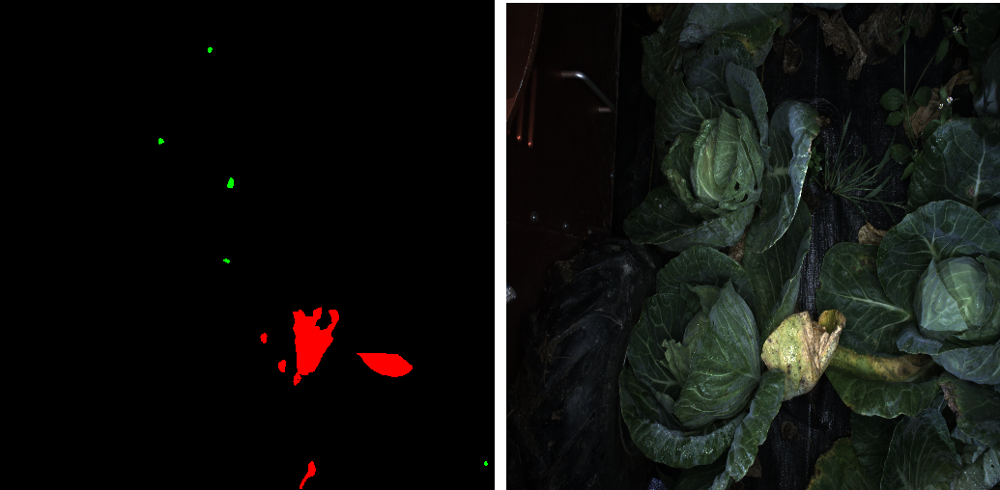

Image segmentation can be useful in a lot of cases, for example, suppressing pedestrains, cars for your SLAM system so the extracted features belong to static scene only. This tutorial covers the procedure to create annotations for semantic segmentation task. This is useful when you want to outsource the labeling tasks to external companies because guidelines and examples are usually required in such scenario. Specifically, GIMP (GNU Image Manipulation Program version 2.8.22) on Ubuntu (16.04 for this tutorial) will be used to do the annotating task.

## Example of segmented images
Below is an example of annotated image and it's original RGB image. Three classes: fungus (annotated red), holes (annotated green) and background (annotated black) are presented here. Although it's common to use gray image with pixel value corresponding to 0 - 255, using a color annotation makes it much easier to visualize the annoation. The conversion from color to class labels can be easily done when the actual training is performed e.g. a mapping from RGB tuple to integers.

### Example code for converting RGB tuple to integer
```
color_of_interest = [
	(0, 0, 0),
    (255, 0, 0),
    (0, 255, 0)]
class_map = dict(zip(self.color_of_interest, range(3)))

def encode_segmap(self, mask):
	for color in self.color_of_interest:
    	mask[ (mask[:,:,0] == color[0]) &\
        	(mask[:,:,1] == color[1]) &\
        	(mask[:,:,2] == color[2])   ] = class_map[color]
    return mask[:, :, 0] # target should be h x w, no depth
```



## Installing gimp
copy and paste the following command in your terminal to install gimp  
```
sudo apt-get update
sudo apt-get install gimp
```

## Procedure to annotate an image
### Step 1 Load image
Navigate to  file->open botton on the top left to open a rgb image that you'd like to annotate

### Step 2 Create mask
Navigate to layer->new layer to create a mask over your image. Choose Foreground color will create a black layer over your image. You can also change the foreground color on the left panel before you create a new layer, this will give you a layer with different color (which would corresponds to background in this tutorial)


After creating new layer, you will see your newly created layer on the right panel. Click on the eye symbol and make the layer invisible.


### Step 3 Creating annotations
Select the free select tool on the left panel. **IMPORTANT:** Uncheck the anti-aliasing option, otherwise non-solid colors will appear at the edge of your annotations. Select the region of interest, and then use bucket fill tool to fill in color annotation. Click on the eye symbol again on the right panel will show you the annotated layer.


### Step 4 Saving files
Hit ctrl+E to export your layer as an png image, which is your label for this image. Hit ctrl+S to save the gimp file as .xcf file. This step is important if you want to modify your annotation in the future.

A line in between create a separate paragraph. *This is italicized.* **This is bold.** Here is [a link](/). If you want to display the URL, you can do it like this <http://ri.cmu.edu/>.

> This is a note. Use it to reinforce important points, especially potential show stoppers for your readers. It is also appropriate to use for long quotes from other texts.


#### Bullet points and numbered lists
Here are some hints on writing (in no particular order):
- Focus on application knowledge.
  - Write tutorials to achieve a specific outcome.
  - Relay theory in an intuitive way (especially if you initially struggled).
    - It is likely that others are confused in the same way you were. They will benefit from your perspective.
  - You do not need to be an expert to produce useful content.
  - Document procedures as you learn them. You or others may refine them later.
- Use a professional tone.
  - Be non-partisan.
    - Characterize technology and practices in a way that assists the reader to make intelligent decisions.
    - When in doubt, use the SVOR (Strengths, Vulnerabilities, Opportunities, and Risks) framework.
  - Personal opinions have no place in the Wiki. Do not use "I." Only use "we" when referring to the contributors and editors of the Robotics Knowledgebase. You may "you" when giving instructions in tutorials.
- Use American English (for now).
  - We made add support for other languages in the future.
- The Robotics Knowledgebase is still evolving. We are using Jekyll and GitHub Pages in and a novel way and are always looking for contributors' input.

Entries in the Wiki should follow this format:
1. Excerpt introducing the entry's contents.
  - Be sure to specify if it is a tutorial or an article.
  - Remember that the first 100 words get used else where. A well written excerpt ensures that your entry gets read.
2. The content of your entry.
3. Summary.
4. See Also Links (relevant articles in the Wiki).
5. Further Reading (relevant articles on other sites).
6. References.

#### Code snippets
There's also a lot of support for displaying code. You can do it inline like `this`. You should also use the inline code syntax for `filenames` and `ROS_node_names`.

Larger chunks of code should use this format:
```
def recover_msg(msg):

        // Good coders comment their code for others.

        pw = ProtocolWrapper()

        // Explanation.

        if rec_crc != calc_crc:
            return None
```
This would be a good spot further explain you code snippet. Break it down for the user so they understand what is going on.

#### LaTex Math Support
Here is an example MathJax inline rendering \\( 1/x^{2} \\), and here is a block rendering:
\\[ \frac{1}{n^{2}} \\]

#### Images and Video
Images and embedded video are supported.






The video id can be found at the end of the URL. In this case, the URLs were
`https://www.youtube.com/watch?v=8P9geWwi9e0`
& `https://vimeo.com/148982525`.

## Summary
Use this space to reinforce key points and to suggest next steps for your readers.

## See Also:
- Links to relevant material within the Robotics Knowledgebase go here.

## Further Reading
- Links to articles of interest outside the Wiki (that are not references) go here.

## References
- Links to References go here.
- References should be in alphabetical order.
- References should follow IEEE format.
- If you are referencing experimental results, include it in your published report and link to it here.
