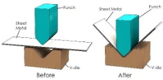
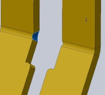

---
# Jekyll 'Front Matter' goes here. Most are set by default, and should NOT be
# overwritten except in special circumstances. 
# You should set the date the article was last updated like this:
date: 2024-05-01 # YYYY-MM-DD
# This will be displayed at the bottom of the article
# You should set the article's title:
title: Sheet Metal Fabrication Guidelines
# The 'title' is automatically displayed at the top of the page
# and used in other parts of the site.
---
## Overview
Sheet metal is a versatile and cost-effective material, crucial for manufacturing parts efficiently, which is a key factor in rapid prototyping and robotic project development. This wiki page will out-line essential principles, such as minimum flange lengths, and bending tolerances, to avoid common pitfalls like material flaring or buckling. Integrating these guidelines can enhance your ability to create more robust and sophisticated prototypes or final robot models, facilitating the transition from concept to tangible product.

## The Fabrication Process

The general sheet metal fabrication process typically includes the following steps:

1. **Design and Layout**: Before any metal is cut or shaped, a detailed plan is created. This involves drafting a blueprint or using computer-aided design (CAD) software to outline the exact dimensions and features of the final product.
2. **Cutting**: Once the design is finalized, the actual sheet metal fabrication begins with cutting. Using tools like lasers, punches, or water jets, the metal is cut to match the specifications of the design. This step must be precise to ensure the quality and fit of the final product.
3. **Bending**: After cutting, the sheet metal pieces are bent into their desired shapes. This is typically done with a machine called a press brake, which uses a set of punches and dies to create bends at specific angles.
4. **Joining**: The bent components are then assembled and joined together. This can be achieved through welding, riveting, or using adhesives, depending on the requirements of the project.
5. **Finishing**: Finally, the assembled part goes through finishing processes. These may include grinding, sandblasting, or painting, which not only improve the appearance of the product but also protect it from corrosion.

With this background in mind, let's delve into the specific guidelines that are critical for successful sheet metal fabrication.

## Bending Sheet Metal
### Clearance and Bend Order

- **Die Clearance**: To make a bend without interference, a clearance of about 2 inches width at the bisecting angle of the die is necessary.
- **Bend Sequence**: The order of bending matters significantly. Some series of bends may be impossible to fabricate due to tool interference.

### Flange Requirements

- **Minimum Flange Size**: Each flange should be at least four times the thickness of the sheet metal to fit adequately in the die and avoid flaring out.
- **Curved Edges**: This also applies to curved edges like circular cut-outs over the bending line.
- **Material Curvature**: Material can curve outwards but not inwards on the bend line.

### Post-Bending Considerations
- **Buckling**: Material buckles outward after bending, which can be mitigated by cutting a small slot for pieces that need to fit flush.

- **Bend Tolerance**: There is a tolerance of ±1/16 inch where the bend is made.

## Cutting Sheet Metal
- **Laser Cutting**: The flat sheet metal can be laser-cut with an accuracy of around 1/100 inch, which is typically sufficient for most applications.

## Welding and Assembly
### Bend Radius and Weld Nuts

- **Inner Bend Radius**: Should be roughly the same as the thickness of the sheet metal.
- **Weld Nuts**: Make the hole for a weld nut wider than the bolt size to accommodate the lip.

### Painting and Corrosion Resistance

- **Painting**: All exposed portions of the part must be paintable post-welding to provide corrosion resistance.
- **Welding Aids**: Add slots and tabs to hold pieces in place while welding.

### Special Considerations

- **Avoiding Tabs and Slots**: For thicker structural components, avoid tabs and slots due to the risk of crack propagation.
- **Bend Relaxation**: Bends should be made slightly over the desired angle to account for elastic versus plastic deformation.
- **Welding Parallel Sheets**: Use butt welds sparingly due to difficulty in welding and the need for grinding.

## Structural Integrity
- **Buckling**: Sheet metal assemblies are weaker when they can buckle like a parallelogram.
- **Bolt Placement**: Bolts should be placed near the outermost points for stability.
- **Rattling Prevention**: Adding a bolt can prevent rattling of unsupported plates.

## Design Considerations
- **Washers and Welds**: Allow room around holes for washers and account for the space taken by welds.
- **Edge Filleting**: Fillet all sharp edges to prevent injury.
- **Partial Flanges**: Use the "bend outside" option for bending only part of an edge.
- **Tolerance**: For high-precision requirements, consider plug welding to avoid deformation from welding heat.

## Tab and Slot Design
- **Positioning**: Design slots significantly longer than tabs to guide assembly based on the drawing.
- **Die Combination**: Combine smaller dies to achieve specific sizes when needed.

## Additional Resources
- **Welding Joints**: For more detailed information on welding joints, refer to Cliff's Welding at [5 Types of Welding Joints](https://cliffswelding.com/5-types-welding-joints/#1).

## Further Reading
For further reading and more detailed information on sheet metal fabrication, the following resources may be useful:

1. "Reasonable Tolerances, Grain Direction, and the Base Flange" from TheFabricator.com. This article provides insights into what sheet metal shops consider reasonable tolerances, how grain direction affects sheet metal parts, and the importance of the base flange. [Read more](https://www.thefabricator.com/article/shopmanagement/what-sheet-metal-shops-wish-you-knew-reasonable-tolerances-grain-direction-and-the-base-flange).
2. "Minimum Flange, Bend Radius, and Tooling Access" from TheFabricator.com. The article discusses the minimum flange requirements, the significance of bend radius in the design process, and tooling accessibility in sheet metal fabrication. [Read more](https://www.thefabricator.com/article/shopmanagement/what-sheet-metal-shops-wish-you-knew-minimum-flange-bend-radius-and-tooling-access).
3. "Batch Size, Setup, and Thickness" from TheFabricator.com. Here, the focus is on the impact of batch size on sheet metal production, the setup process for fabrication, and how the thickness of the metal can influence the entire manufacturing operation. [Read more](https://www.thefabricator.com/article/shopmanagement/what-sheet-metal-shops-wish-you-knew-batch-size-setup-and-thickness).
4. "Hems, Jogs, and Forming Tools" from TheFabricator.com. This resource delves into the specifics of creating hems and jogs in sheet metal work, as well as the various forming tools used in the industry. [Read more](https://www.thefabricator.com/article/shopmanagement/what-sheet-metal-shops-wish-you-knew-hems-jogs-and-forming-tools).

