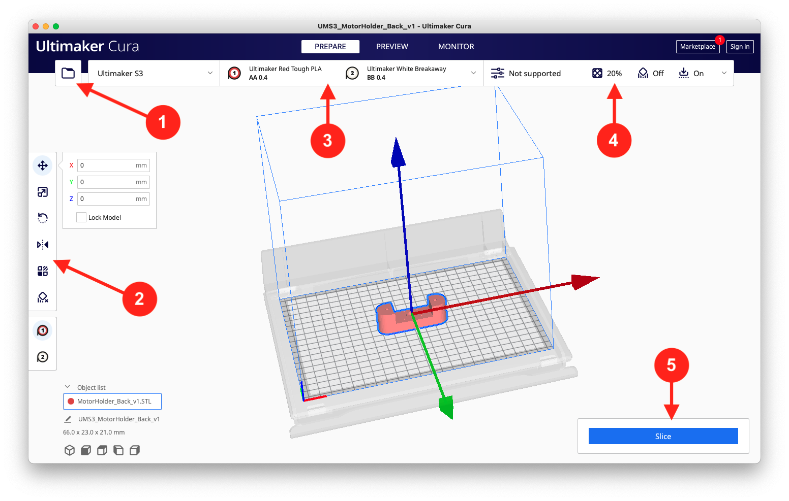
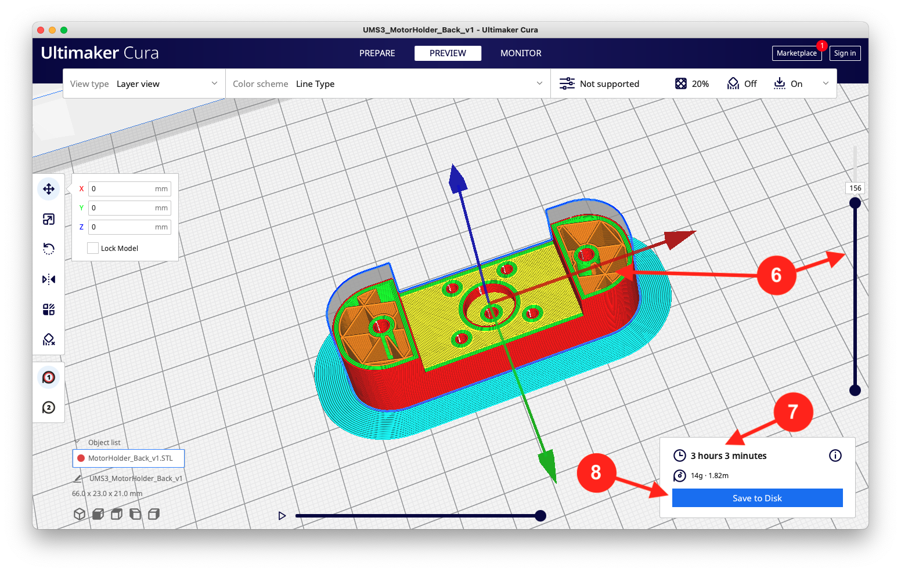

The Ultimaker Series of 3D pinters are a relatively beginner-friendly set of printers, with a variety of advanced print settings at the user's fingertips if they need them. This series offers easy reload of material, touch screen interface, dual extrusion of materials, and options to print with both Wireless or USB connection. Printer material options include PLA, Tough PLA, ABS, Nylon, Breakaway, PVA, and more.

In the MS in Robotic Systems Development (MRSD) Lab at CMU, there are four printers from the Ultimaker series. These can be used in essentially the same way. The printers are:
- 2 x Ultimaker 3 (no longer manufactured by Ultimaker)
- 2 x Ultimaker S3

## Software
The Ultimaker Series of printers uses the [Ultimaker Cura](https://ultimaker.com/software/ultimaker-cura) software to slice STL files for printing. When setting up a print, it is important to crosscheck your print settings with the printer you have on hand. This is expanded on below.

## Setting up a print
Using your favorite CAD Sofware (i.e. Solidworks), prepare an STL file of your model for printing. Open up CURA, and use the folder icon in the top left of your window (Circle 1) to select the STL file(s) you have prepared.

Using the options on the left side of the screen (Circle 2), move your piece(s) around. Using these controls, you can change the orientaiton of the part, as well as its location on the build plate. Make sure that part is oriented to minimize overhangs, and if you have multiple pieces, that the pieces are not too close to each other.

<figcaption align = "center"><b>Figure 1: Ultimaker Cura PREPARE screen when preparing a print. </b></figcaption>

Next, check that the material in the menu indicated by Circle 3 **matches what is actually loaded into your printer**. If you don't do this, you your spliced file may not load correctly when you attempt to start the print.

In the menu indicated by Circle 4, there are a variety of print options for you to explore. You can learn more about different print options and how to choose them for your specific piece by heading over to our page on [Fabrication Considerations for 3D Printing](/wiki/fabrication/fabrication_considerations_for_3D_printing/).

Finally, you can click the 'Slice' button indiciated by Circle 5 when ready. As long as your material was loaded correctly, you should not have to worry about re-setting things like print temperatures or changing the core. You *should* check those when changing the loaded material spools, however.

## Previewing your part before printing
The preview screen is a last look at your part and what the print will look like both on the outside and on the inside.

<figcaption align = "center"><b>Figure 2: Ultimaker Cura PREVIEW screen. </b></figcaption>

Following the circles in Figure 2, this is what to look out for on your print:

**6** - Use the sliding bar on the right side of the screen to look at a crossection of your part at different heights. This can give you a look inside to the infill of your part, and how the infill looks around internal features like holes (as shown in figure 2). Use this to catch potential failures before printing.

**7** - Take a look at how long and how much material this print will take  *at the current print settings*. If either of these numbers are unsuitable to you, hope back over to the top bar menu and change your print settings till these numbers are to your liking!

**8** - Once you've checked it all, you're ready to press the blue button and save your spliced print file. This blue button will change depending on if you have an external USB drive connected where you may want to directly save the file. Feel free to use whatever file format Cura selects - the printer can read a variety of different ones.

## Sending your print file to the printers
The easiest way to do this is to load your file directly onto a USB. The Ultimaker printers have easy-access USB ports, and the software is setup to read your USB stick's folder structure to help you locate your file. Simply find your specific print file, and select it.

> NOTE: you will have to keep your USB stick plugged in for the duration of the print!

Alternatively, you can configure your printer to connect with your WiFi network for remote printing. You can learn more about that process [here](https://support.makerbot.com/s/article/1667339908212).

## You've started your print, but you're not done yet
You're nearly there! Make sure to apply some glue to the print plate, and then click start print. It is important that you hang around by the printer until at least the first layer of your print is completed. Lots of potential print failures can be caught early by checking if there is a failure to print the first complete layer of your part!

If the first layer looks good, you are all set! You can leave your printer alone and it should finish the job without your supervision.

## Typical Failures
If you are encountering some issues with executing your print, here are some common failure points that we have come across in our use of the Ultimaker 3/S3.

### Not enough material
Starting with an easy one, your print might stop if your spool runs out of material. Fortunately, the interface does well to walk you through the process of changing the material on the back. For more information, you can learn more by watching this video on [changing the filament spool](https://youtu.be/c2XznbVFOBs) (Note: this video shows the Ultimaker 3, which does not have the touch screen, but the process and prompts are identical on the S3).

## Wrong print settings
Your print doesn't start because you configured your Cura screen wrong! Go back to your PREPARE page and check the settings at Circle 3 in Figure 1.

### The wrong core to the wrong material
Often forgotten, it is very important to have the correct print core for each material. The print core is the piece of hardware that heats the filament before it used to 'print' your part. Different filaments have different requirements for nozzle size and the temperature they must be heated to before printing. If you use a mismatched print core, you will quickly block and damage the print core such that it is rendered completely unusable.

**Print cores are not cheap**, so try to avoid this by always carefully checking the specs for your filament to make sure you match the appropriate filament with the appropriate print core. [Learn more about print cores](https://ultimaker.com/3d-printers/ultimaker-print-cores-and-addons).

### 'Nozzle Offset Probe Failed'
This one is a difficult one. Even with extensive research, it has been hard to find a solution that consistently works. We recommend you check the online forums, such as [this one](https://community.ultimaker.com/topic/35521-nozzle-offset-probe-failed/). Other steps you can try include:

- Reload the filament at the back of the printer.
- Check that the build plate is correctly centered and secured down.
- Clean the build plate to ensure there is no undue residue.
- Clean and/or reload the print cores

### Sometimes, things just go wrong.
Sometimes, things just go wrong. Figure 3 has an example of a very long print that went wrong. This one was due to the support filament not extruding correctly, leading to a failure to print the overhang. This one was actually due to a failure to use the correct print core for the support material (PVA, in this case). So when the print core got jammed with incorrectly melted PVA, the print failed. This just goes to show how important it is to pay attention to some of the simple rules outlined on this page, and you can avoid most failure likes this one.

<figcaption align = "center"><b>Figure 3: Prints can fail. It happens! </b></figcaption>

## Summary
All in all, the Ultimaker Series 3 is relatively capable 3D printer that is easy to work with even if it is your first time 3D printing. With ease of fabrication come the real benefits of rapid prototyping - quick parts, quick iterations, and faster development cycles for your project. We have seen this printer prove itself for all kinds of projects, including a winch system for autonomous drone package delivery, camera and sensor mounts on robotic rovers, custom hold-and-cut grippers for indoor farming robots, and much more.

## See Also

## Further Reading

## References and Relevant Links

https://ultimaker.com/3d-printers/ultimaker-s3
