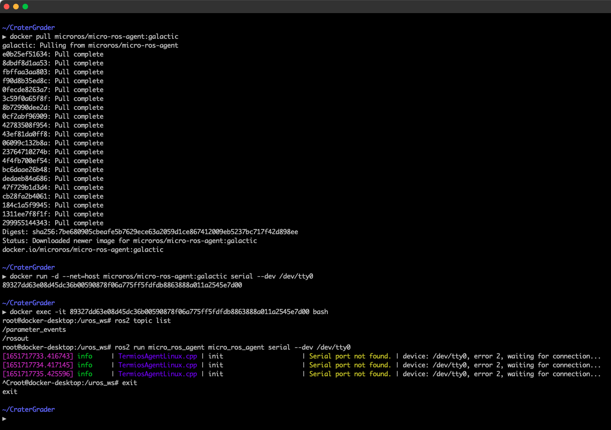
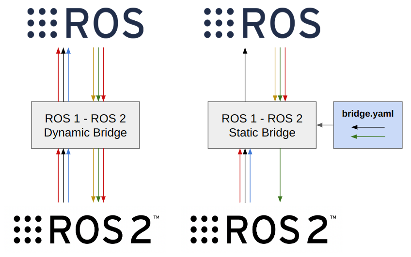

/wiki/interfacing/blink-1-led/
---
date: 2017-08-21
title: Blink(1) LED
---
## Introduction
Using an LED indicator is an extremely useful troubleshooting technique. The [Blink(1) USB RGB LED](https://blink1.thingm.com/) makes this very easy and straightforward. Using this product can help determine the state of the robot without needing to have a direct data link. This can be useful on mobile robots, especially drones where cables are not an option. It can run on any operating system, including anything running on your single board computer.

## Purchasing and Setup
To purchase the Blink(1) LED, go to [their home page](https://blink1.thingm.com/) and click "Buy". At this time of writing the cost was around $30.

Their software needs to be downloaded and installed from their web site as well. It is a very small set of files, so it does not take up much storage space and will not take long to download. Follow the link to the home page and click "downloads" and follow the instructions for the blink1-tool command-line. In Linux, the easiest way to install this is by entering the following commands in a terminal from your home directory.
```
$ git clone https://github.com/todbot/blink1.git
$ cd blink1/commandline
$ make
```
## Getting Started
Once you have your product and the software is installed, try controlling the LED from the terminal command line. In Linux, navigate to the `/blink1/commandline` folder.
```
$ cd ~/blink1/commandline
$ ls
```
There should be an executable file called blink1-tool shown in green. This is the program that controls the LED. While in this folder, try some of the following commands.
```
$ ./blink1-tool --on
$ ./blink1-tool --off
$ ./blink1-tool --green
$ ./blink1-tool --red --blink 5
```
These command can be run even if you are not navigated to the `~/blink1/commandline` folder by adding the entire path to the command as follows.
```
$ ~/blink1/commandlin/blink1-tool --on
```
For a full list of commands and options, see the [Blink1 Tool Tutorial](https://github.com/todbot/blink1/blob/master/docs/blink1-tool-tips.md).

## Integration with ROS
In any ROS node, you can write text out to a command line. Here is a guide on how to do this in c++.

First, make sure you import this package at the top of your file.
```
#include <stdlib.h>
```
With this package included, you can simply output a string using the system() command and it will execute that string as if you typed it into a command line. For example:
```
std::string output_string;
output_string = "~/blink1/commandline/blink1-tool --on";

char* output_char_string = new char [output_string.length()+1];
std::strcpy(output_char_string, output_string.c_str());

system(output_char_string);
```
Running this inside your node will turn the LED on. Note that `system()` accepts a C-type string, as apposed to a C++ string. It is likely easier to manipulate a C++ string in your code (using the "+" operator to concatenate, for example), so I suggest converting it to a C-type char string just before calling the `system()` command.

In your code, I would suggest making a node that subscribes to any topics that include information that you would like to check. For our project, we subscribed to our state estimator, vision node, and the flight mode flag. Create a function that contains a series of `if()` statements that checks all of the conditions you would like to visualize. Then assign a color to each condition and create a string based on that color code. At the end of this function, send that string to `system()`.


/wiki/interfacing/microros-for-ros2-on-microcontrollers/
---
# Jekyll 'Front Matter' goes here. Most are set by default, and should NOT be
# overwritten except in special circumstances. 
# You should set the date the article was last updated like this:
date: 2022-05-04 # YYYY-MM-DD
# This will be displayed at the bottom of the article
# You should set the article's title:
title: micro-ROS for ROS2 on Microcontrollers
# The 'title' is automatically displayed at the top of the page
# and used in other parts of the site.
---
[micro-ROS](https://micro.ros.org/) is a set of software libraries that enables development of robotic applications to be deployed onto microcontrollers that are typically limited in computational resources. The micro-ROS framework is designed for use with ROS 2, and can be leveraged for **bidirectional communication** between ROS 2 nodes running on a separate compute and the micro-ROS application running on a **microcontroller**, such as an Arduino. micro-ROS is open-source, and can be highly beneficial for any roboticists aiming to integrate low-level microcontrollers into a robotic system. This page is a tutorial guide for how to setup and use micro-ROS, with an Arduino Due as example hardware.

## Conceptual Overview
micro-ROS consists of a `node` running on the microcontroller and an `agent` running on the host computer. The `agent` handles the interface between the `node` and the rest of the ROS2 stack. This allows the ROS2 stack and microcontroller `node` to publish and subscribe to each other as if the `node` was like any other ROS2 node. Great! The hardware interface is most commonly a serial connection, such as USB. This tutorial will walk through how to prepare the microcontroller and host computer environments for the `node` and `agent` respectively, and then show some examples for how to test the connection and make a first `node` on the microcontroller. 


## Installation Overview

At a high-level, there are two sets of micro-ROS libraries involved in the overall installation process. The first will be a set of micro-ROS client libraries specific to your hardware/microcontroller libraires, which will be necessary to build micro-ROS applications that run on the microcontroller. In addition, in order for your micro-ROS application to communicate with the rest of the ROS 2 stack, you will need to install the core micro-ROS libraries onto the host computer. This will allow micro-ROS to be run on your host machine, which will facilitate communication with a connected microcontroller running a micro-ROS application. The following tutorial will walk through installation of all necessary micro-ROS libraries using example hardware.

## Prerequisites

It is also assumed that you have a [supported microcontroller board](https://micro.ros.org/docs/overview/hardware/) on which the micro-ROS application will be built.

The steps will also use ROS2. At time of writing, there are a few possible options for installing micro-ROS with ROS2:

1. Install ROS2 natively on the host computer on the computer that will connect to the microcontroller.

> At time of writing (May 2022), **micro-ROS requires Linux OS** for native installation.

- In this case, follow the instructions for [Option 1: Installing micro-ROS Natively](#option-1-installing-micro-ros-natively)

2. Use a ROS2 Docker container.
  -  Use a pre-built docker image from micro-ROS that comes with micro-ROS installed in a ROS2 environment. In this case, follow the instructions for [Option 2: Using micro-ROS Docker image](#option-2-using-micro-ros-docker-image)

## Setting Up micro-ROS with Arduino Due

Here we will go through an example of installing the precompiled micro-ROS libraries for an Arduino Due. First, it is necessary to have the Arduino IDE installed, with the Board Manager configured for use with the Arduino Due board. You can confirm this setup by referencing the [Arduino Due Quickstart Guide](https://docs.arduino.cc/hardware/due).

The precompiled micro-ROS library can be found on the [releases page](https://github.com/micro-ROS/micro_ros_arduino/releases) of the micro-ROS GitHub repository. Download the ZIP file for the precompiled library correponding to your version of ROS 2 (e.g. galactic, foxy, etc.). Then from within the Arduino IDE, you can include the library in your application by navigating to `Sketch -> Include Library -> Add .ZIP Library`.

For most officially supported boards for micro-ROS, the precompiled library may be all you need to get started. At this time of writing, however, the Arduino Due is a community-supported board which requires an additional patch. To install the patch, run the following commands:

```
export ARDUINO_PATH=[Your Arduino path]
cd $ARDUINO_PATH/hardware/sam/1.6.12/
curl https://raw.githubusercontent.com/micro-ROS/micro_ros_arduino/galactic/extras/patching_boards/platform_arduinocore_sam.txt > platform.txt
```

The `ARDUINO_PATH` referenced above is typically located at one of the following paths:
- On GNU/Linux: `~/.arduino15/packages/arduino`
- On Windows: `%AppData%\Arduino15\packages\arduino`
- On macOS: `~/Library/Arduino15/packages/arduino`

If you are having difficulty finding this path, feel free to reference Arduino's documentation for [finding the location of installed cores](https://support.arduino.cc/hc/en-us/articles/4411202655634#Arduino15), and be sure to double check that all instructions have been followed in the [Arduino Due Quickstart Guide](https://docs.arduino.cc/hardware/due) referenced earlier.

After applying the patch, open the Arduino IDE (or if it is already open, close and re-open it). From here you should be able to open a micro-ROS example, e.g. `File -> Examples -> micro_ros_arduino -> micro-ros_publisher`. Verify that it compiles, and this would conclude the micro-ROS precompiled library installation.

For any troubleshooting, additional instructions can be found at the [micro-ROS README](https://github.com/micro-ROS/micro_ros_arduino/blob/galactic/README.md)

## Installing micro-ROS on the Host Computer

Now you will need to install micro-ROS on the host computer. As discussed, there are a couple ways to do this depending on how you want to have your ROS2 environment set up.

### Option 1: Installing micro-ROS Natively

To install micro-ROS natively on your host computer, you will first need to have ROS2 installed natively. 
> Note that you need to be using a Linux OS. If you do not have a Linux OS, then you should try the Docker option.

1. Please follow the [ROS2 installation guide](https://docs.ros.org/en/galactic/Installation.html) for official instructions.

Now that you have ROS2 installed (on your Linux host machine), we can install the micro-ROS libraries.

2. Run the following commands, as specified in the [installation instructions](https://micro.ros.org/docs/tutorials/core/first_application_linux/):
```
# Source the ROS 2 installation
source /opt/ros/$ROS_DISTRO/setup.bash

# Create a workspace and download the micro-ROS tools
mkdir microros_ws
cd microros_ws
git clone -b $ROS_DISTRO https://github.com/micro-ROS/micro_ros_setup.git src/micro_ros_setup

# Update dependencies using rosdep
sudo apt update && rosdep update
rosdep install --from-paths src --ignore-src -y

# Install pip
sudo apt-get install python3-pip

# Build micro-ROS tools and source them
colcon build
source install/local_setup.bash

# Create firmware
ros2 run micro_ros_setup create_firmware_ws.sh host

# Build firmware
ros2 run micro_ros_setup build_firmware.sh
source install/local_setup.bash

# Download micro-ROS-Agent packages
ros2 run micro_ros_setup create_agent_ws.sh

# Build micro-ROS-Agent
ros2 run micro_ros_setup build_agent.sh
source install/local_setup.bash
```

At this point, you should have micro-ROS installed on the host machine and can continue to [Testing the Installation](#testing-the-installation).

### Option 2: Using micro-ROS Docker image

Micro-ROS maintains several Docker images that build on top of ROS2 distributions. The images have variable levels of pre-built functionality. The best one for getting started is the `micro-ros-agent` image that will allow you to run an agent directly! For more information about the images available, and how they are constructed, please see the [micro-ROS docker repository](https://github.com/micro-ROS/docker).

1. First make sure you have Docker installed on your host machine. 
> [Docker Desktop for Mac/Windows](https://docs.docker.com/desktop/) OR [Docker Engine for Linux](https://docs.docker.com/engine/install/#server)

2. Then pull the `micro-ros-agent` image, replacing the branch name with the distro version as `microros/<image>:$ROS_DISTRO`. For example, you can pull the image built on ROS2 galactic by using the following command:
```
docker pull microros/micro-ros-agent:galactic
```

3. Use the `docker run` command to bring the container up. Specify the interface connection type in the arguments, such as for a udp or serial connection. For example, with a serial connection where the serial device shows up on the host device as `/dev/tty0`, use the following command. 

- Note that you may need to play with container port access to allow the container to access the hardware interface. You can mount a device directly by using the --device flag. The should be straightforward on Linux but can be challenging on Mac and Windows. You can also mount many devices easily using [docker compose](https://www.balena.io/docs/learn/develop/hardware/).
- If you are still struggling, you can temporarily give the container privileged access; just be careful with privileged access because it could cause security concerns and/or allow you to accidentally damage devices if you are not careful. [Read more about the risks of privileged mode here](https://learn.snyk.io/lessons/container-runs-in-privileged-mode/kubernetes/) and see the official [Docker documentation on privileged mode](https://docs.docker.com/engine/reference/commandline/run/#/full-container-capabilities-privileged). To give the container privileged access to host hardware, add the `--privileged` flag.
> This command should print out the docker container id. Copy the id, you will need it for the next step! 
```
docker run -d --device=/dev/tty0 --net=host microros/micro-ros-agent:galactic serial --dev /dev/tty0
```

4. Use the container id from the previous step to enter the container. If you didn't see a print out, you can run `docker container ls` and take the id from there.
```
docker exec -it <container id> bash
```

5. Now you should be in the micro-ROS Docker container! Your command line should be prepended with something like `root@docker-desktop:/uros_ws#`. To run the micro-ROS agent, simply run the ros2 node and pass in the arguments for the device you are connecting. with a serial connection where the serial device shows up on the host device as `/dev/tty0`, use the following command.
```
ros2 run micro_ros_agent micro_ros_agent serial --dev /dev/tty0
```
Example output waiting for a connected device:
```
[1651722045.613925] info     | TermiosAgentLinux.cpp | init                     | running...             | fd: 3
[1651722045.614570] info     | Root.cpp           | set_verbose_level        | logger setup           | verbose_level: 4
```

This container should be some variant of Linux OS with a ROS2 installation. You should be able to echo and/or publish ROS2 topics to interact with the `node` on the microcontroller! 

6. When you are done testing, exit the container by typing exit at the command prompt. 
```
exit
```




7. Finally, don't forget to stop the container and remove any unnecessary build cache. You can do so by:
     1. List the active containers with `docker container list --all`
     2. Stop any active containers using `docker container stop <container id>` 
     3. Remove any stopped containers using `docker container rm <container id>`
     4. List any remaining images using `docker image list --all`
     5. Remove any remaining images with `docker image rm <image id>`. 
> If you want to clear *ALL docker-related files from your system*, use `docker system prune -a --volumes`. This will clear all existing docker files on your host computer, so any existing containers will need to be re-built/re-pulled.

### Advanced Docker Usage

You probably will want to use micro-ROS with your existing ROS2 workspace. To make this happen, simply use the `micro-ros-agent` as the base image in a Dockerfile to support a custom/user-defined ROS2 environment. In this case, you'll also have to source the `uros_ws` as well so that the micro-ROS packages are discovered in your ROS2 environment. 

For example, the Dockerfile could look like:
```
# Set micro-ros-agent as base image
FROM microros/micro-ros-agent:galactic as ros_base

# Have shells source uros_ws packages and your own packages
echo 'source /uros_ws/install/setup.bash' >> /root/.bashrc
# Export MicroROS DDS settings, assumes ROS_LOCALHOST_ONLY != 1 (from micro-ros_entrypoint.sh)
echo 'export FASTRTPS_DEFAULT_PROFILES_FILE=/tmp/disable_fastdds_shm.xml' >> /root/.bashrc

# Source your own workspace packages
echo 'source /path/to/your/ws/install/setup.bash' >> /root/.bashrc

# Dockerfile entrypoint goes below here
ENTRYPOINT ["/your_entrypoint.sh"]
CMD ["bash"]
```

## Testing the Installation

First, we will test the installation of the precompiled micro-ROS libraries for the microcontroller. Open the Arduino IDE and navigate to `File -> Examples -> micro_ros_arduino -> micro-ros_publisher` to open up an example sketch. Connect your microcontroller to your computer and upload the sketch. If the installation was properly completed, this should compile and upload successfully.

Next, we can initiate the micro-ROS agent to verify installation of the micro-ROS libraries onto the host computer. First check the device name by running `ls /dev`. It will typically be named something like `/dev/ttyACM0` (though if you are not sure, you can always run `ls /dev` before and after plugging in the Arduino to determine what device has changed). A more robust solution would be to utilize udev rules for consistent device naming, though this is outside the scope of this tutorial.

Assuming a device name of `/dev/ttyACM0`, the micro-ROS agent can be initiated by running:
```
ros2 run micro_ros_agent micro_ros_agent serial --dev /dev/ttyACM0 -v6
```

The `-v6` parameter is simply for observing debug output, but can be omitted if desired. The micro-ROS agent facilitates the serial communication between the host machine and the microcontroller running micro-ROS; if the agent is successful in communicating with the microcontroller, you should see several `send_message` and `recv_message` debug messages printed to the console. If you don't see this, try hitting the reset button on the Arduino.

Run `ros2 topic list`. You should be able to see the topic `/micro_ros_arduino_node_publisher`. Echo the topic and verify that data is being received from the microcontroller. If you've gotten this far, that means the installation was successful. Congratulations!

NOTE: One caveat is that if the `micro_ros_agent` is killed and restarted, the host machine may stop receiving messages even if the micro-ROS application is still running on the microcontroller. If this occurs, you may need to reset/power cycle the microcontroller for those messages to begin being received again. Work-arounds for this are discussed in [Advanced: Heartbeat for Transient Connectivity](#advanced-heartbeat-for-transient-connectivity).


## Writing an Example micro-ROS Sketch

Publishers and subscribers are best created using the micro-ROS object types, and can also be customized for Quality of Service settings. The best source of documentation is the [micro-ROS docs about publishers and subscribers](https://micro.ros.org/docs/tutorials/programming_rcl_rclc/pub_sub/).

### Quick Start: Single Publisher
This starter Arduino code makes a single publisher for an Int32 message. To try it out, flash the code to a compatible microcontroller, start the agent, and then try to echo the ROS2 topic. The example is modifed from a [micro-ROS publisher demo example](https://github.com/micro-ROS/micro_ros_arduino/blob/1df47435f08b9609effaec9cb0cc99241ff9dc30/examples/micro-ros_publisher/micro-ros_publisher.ino).


```
// Modified from https://github.com/micro-ROS/micro_ros_arduino/blob/1df47435f08b9609effaec9cb0cc99241ff9dc30/examples/micro-ros_publisher/micro-ros_publisher.ino
#include <micro_ros_arduino.h>

#include <stdio.h>
#include <rcl/rcl.h>
#include <rcl/error_handling.h>
#include <rclc/rclc.h>
#include <rclc/executor.h>
#include <rmw_microros/rmw_microros.h>

#include <std_msgs/msg/int32.h> // ROS message

/* MicroROS declarations */
// NUM_HANDLES must be updated to reflect total number of subscribers + publishers
#define NUM_HANDLES 1
#define RCCHECK(fn)              \
  {                              \
    rcl_ret_t temp_rc = fn;      \
    if ((temp_rc != RCL_RET_OK)) \
    {                            \
      return false;              \
    }                            \
  }

// Declare microros objects
rclc_support_t support;
rcl_node_t node;
rcl_timer_t timer;
rclc_executor_t executor;
rcl_allocator_t allocator;
rcl_publisher_t publisher;
std_msgs__msg__Int32 msg;

/* Callbacks */
void timer_callback(rcl_timer_t *timer, int64_t last_call_time)
{
  (void)last_call_time;
  if (timer != NULL)
  {
    rcl_publish(&feedback_pub, &feedback_msg, NULL);
  } // if (timer != NULL)
} // timer_callback()


/* MicroROS functions */
// Functions create_entities and destroy_entities can take several seconds.
// In order to reduce this rebuild the library with
// - RMW_UXRCE_ENTITY_CREATION_DESTROY_TIMEOUT=0
// - UCLIENT_MAX_SESSION_CONNECTION_ATTEMPTS=3

bool create_entities()
{
  allocator = rcl_get_default_allocator();

  // create init_options
  RCCHECK(rclc_support_init(&support, 0, NULL, &allocator));

  // create node
  RCCHECK(rclc_node_init_default(&node, "arduino_interface_node", "", &support));

  // create publisher
  RCCHECK(rclc_publisher_init_default(
      &publisher,
      &node,
      ROSIDL_GET_MSG_TYPE_SUPPORT(std_msgs, msg, Int32),
      "arduino_publisher"));

  // create timer
  const unsigned int timer_period_ms = 10;
  RCCHECK(rclc_timer_init_default(
      &timer,
      &support,
      RCL_MS_TO_NS(timer_period_ms),
      timer_callback));

  // create executor
  executor = rclc_executor_get_zero_initialized_executor();
  RCCHECK(rclc_executor_init(&executor, &support.context, NUM_HANDLES, &allocator));
  RCCHECK(rclc_executor_add_timer(&executor, &timer));
}

void setup()
{
  // Initialize some micro-ROS stuff
  set_microros_transports();

  // Create the micro-ROS objects
  create_entities();
}

void loop()
{
  // Keep publishing the message
  rclc_executor_spin_some(&executor, RCL_MS_TO_NS(1));
}
```

### Advanced: Heartbeat for Transient Connectivity

You may or may not have transient connections between the microcontroller and the host computer. For example, you may want to stop the `agent` on the host computer but still re-connect to the `node` on the microcontroller. 

If the connection between the node and agent is broken, you will need to reset the node on the microcontroller *while* the `agent` is running. I.e. start the `agent`, then restart the `node`. Restarting the `node` can be done in hardware, such as through power cycling the microcontroller, or in software, such as through a "heartbeat" monitor. 

Below is starter Arduino code built on a single publisher as modified from a [micro-ROS reconnection example](https://github.com/micro-ROS/micro_ros_arduino/blob/galactic/examples/micro-ros_reconnection_example/micro-ros_reconnection_example.ino). All of the heartbeat logic is handled in the `loop()` function by pinging for the `agent` and re-starting the `node` as needed (note the `destroy_entities()` function). Note that a few extra lines are included for red and green led output to indicate what mode the heartbeat is in: either it is searching for a connection (blinking red) or it has an active connection (green).

```
// Modified from https://github.com/micro-ROS/micro_ros_arduino/blob/galactic/examples/micro-ros_reconnection_example/micro-ros_reconnection_example.ino
#include <micro_ros_arduino.h>

#include <stdio.h>
#include <rcl/rcl.h>
#include <rcl/error_handling.h>
#include <rclc/rclc.h>
#include <rclc/executor.h>
#include <rmw_microros/rmw_microros.h>

#include <std_msgs/msg/int32.h> // ROS message

/* MicroROS declarations */
// NUM_HANDLES must be updated to reflect total number of subscribers + publishers
#define NUM_HANDLES 1
#define LED_PIN 13 // LED pin for debugging heartbeat connection, recommended color = red (significes no connection to agent)
#define CONN_PIN 12 // LED pin for debugging heartbeat connection, recommended color = green (signifies active connection to agent)

#define RCCHECK(fn)              \
  {                              \
    rcl_ret_t temp_rc = fn;      \
    if ((temp_rc != RCL_RET_OK)) \
    {                            \
      return false;              \
    }                            \
  }

// Declare microros objects
rclc_support_t support;
rcl_node_t node;
rcl_timer_t timer;
rclc_executor_t executor;
rcl_allocator_t allocator;
rcl_publisher_t publisher;
std_msgs__msg__Int32 msg;

bool micro_ros_init_successful; // For heartbeat

/* Callbacks */
void timer_callback(rcl_timer_t *timer, int64_t last_call_time)
{
  (void)last_call_time;
  if (timer != NULL)
  {
    rcl_publish(&feedback_pub, &feedback_msg, NULL);
  } // if (timer != NULL)
} // timer_callback()


/* MicroROS functions */
// Functions create_entities and destroy_entities can take several seconds.
// In order to reduce this rebuild the library with
// - RMW_UXRCE_ENTITY_CREATION_DESTROY_TIMEOUT=0
// - UCLIENT_MAX_SESSION_CONNECTION_ATTEMPTS=3

bool create_entities()
{
  allocator = rcl_get_default_allocator();

  // create init_options
  RCCHECK(rclc_support_init(&support, 0, NULL, &allocator));

  // create node
  RCCHECK(rclc_node_init_default(&node, "arduino_interface_node", "", &support));

  // create publisher
  RCCHECK(rclc_publisher_init_default(
      &publisher,
      &node,
      ROSIDL_GET_MSG_TYPE_SUPPORT(std_msgs, msg, Int32),
      "arduino_publisher"));

  // create timer
  const unsigned int timer_period_ms = 10;
  RCCHECK(rclc_timer_init_default(
      &timer,
      &support,
      RCL_MS_TO_NS(timer_period_ms),
      timer_callback));

  // create executor
  executor = rclc_executor_get_zero_initialized_executor();
  RCCHECK(rclc_executor_init(&executor, &support.context, NUM_HANDLES, &allocator));
  RCCHECK(rclc_executor_add_timer(&executor, &timer));

  micro_ros_init_successful = true; // For heartbeat
}

void destroy_entities()
{
  rcl_publisher_fini(&feedback_pub, &node);
  rcl_node_fini(&node);
  rcl_timer_fini(&timer);
  rclc_executor_fini(&executor);
  rclc_support_fini(&support);

  micro_ros_init_successful = false;
}

void setup()
{
  // Initialize some micro-ROS stuff
  set_microros_transports();

  // LED pins for debugging heartbeat connection
  pinMode(LED_PIN, OUTPUT); // Use a resistor with the LED
  digitalWrite(LED_PIN, HIGH);

  pinMode(CONN_PIN, OUTPUT); // Use a resistor with the LED
  digitalWrite(CONN_PIN, LOW);

  // Create the micro-ROS objects
  create_entities();

  // For heartbeat
  micro_ros_init_successful = false;
}

uint32_t delay_ms = 500; // short delay to blink the LED_PIN while trying to connect
void loop()
{
  // Keep trying to connect by pinging the MicroROS agent
  if (RMW_RET_OK == rmw_uros_ping_agent(50, 2))
  {
    // Use flag to see if entities need to be created
    if (!micro_ros_init_successful)
    {
      create_entities();
    }
    else
    {
      // Main loop to run the MicroROS node
      digitalWrite(CONN_PIN, HIGH); // Green LED on
      digitalWrite(LED_PIN, LOW);   // Red LED off
      rclc_executor_spin_some(&executor, RCL_MS_TO_NS(1)); // Publish the message
    }
  }
  else
  {
    // Destroy entities if there is not connection to the agent
    if (micro_ros_init_successful)
    {
      destroy_entities();
      digitalWrite(CONN_PIN, LOW); // Green LED off
    }
    digitalWrite(LED_PIN, !digitalRead(LED_PIN)); // Blink red LED while trying to connect
    delay(delay_ms);
  }
}
```

## See Also:
- [Docker](https://roboticsknowledgebase.com/wiki/tools/docker/)
- [ROS Arduino Interface](https://roboticsknowledgebase.com/wiki/common-platforms/ros/ros-arduino-interface/) (If using ROS1 as opposed to ROS2)
- [udev Rules](https://roboticsknowledgebase.com/wiki/tools/udev-rules/)


/wiki/interfacing/myo/
---
date: 2017-08-21
title: Getting Started with the Myo
---
Here are some resources that are useful if you want to get started quickly with the [Myo Gesture Control Armband](https://www.myo.com/). The learning curve is not too steep if you want to make simple apps. It should take you just a couple of days (maybe even less) to get working. However, if you wish to work on more complex problems, the Lua environment used for Myo scripting will not be enough. If you have never worked with APIs before it will add more steepness to your learning curve. I have tried to find as many resources as possible and have structured them in the best way I could here. The lists here are by no means exhaustive but is meant to serve as a reference after you get acquainted with the basics.

## Lua Basics
The following links are meant to teach you everything from scratch. Myo uses the Lua scripting language which is quite easy to learn if you have worked with JavaScript before. If you have not I would suggest using one of the following links to make yourself familiar with Lua first (don't worry it's fairly easy):

Lua Tutorials
NOTE: List not exhaustive.

1. [The Lua Users Wiki](http://lua-users.org/wiki/LuaDirectory)
This site is very oddly structured but has some great content if you can figure how to find it.
2. [Lua Tutorial Series by TheCoolSquare](https://www.youtube.com/watch?v=dA9tcPeZa8k&list=PL5D2E7A4DD535E276)
Nothing teaches better than a video tutorial and these seem to be the most popular ones.
3. [The Official Lua Reference Manual](http://www.lua.org/manual/5.3/)
This by far is the best and the most exhaustive resource if you know the basics.

## Myo Basics
All of the following 6 links are available on the Myo's public forum but they are lost among hundreds of other blog posts. They are listed here along with a brief description of what you may expect to learn from each one of them.

1. [Setup and Getting Started](http://developerblog.myo.com/getting-started-myo-scripts-part-1/)
This takes you through the setup procedure and gets you started with the development environment.
2. [Programming with the API](http://developerblog.myo.com/getting-started-myo-scripts-part-2/)
If you have never worked with an API before, I hope this will ease you into it.
3. [Accessing the Data](http://developerblog.myo.com/getting-started-myo-scripts-part-3/)
This is how you start manipulating the gestures
4. [Keyboard Integration](http://developerblog.myo.com/getting-started-myo-scripts-part-4/)
Continuation of the API, but of limited value.
5. [Remaining Functions](http://developerblog.myo.com/getting-started-myo-scripts-part-5/)
This explains some of the functions that are not covered above.
6. [Combining Everything Together](http://developerblog.myo.com/getting-started-myo-scripts-part-6/)
Tutorial on combining the above components.

If you went through everything above while implementing it on your own, you are all set to make simple apps that can do anything from controlling your favorite music player to using your hand as a mouse. Now move on to the next part now.

## Advanced: Complete API Reference and Wrappers
If you are an experienced software programmer and have worked with APIs before (or you completed the basics section above) you can directly use [this for the complete API reference](https://developer.thalmic.com/docs/api_reference/platform/index.html). This not only contains all the API information but also has some demo programs to get you started. If you freak out at the prospect of writing hundreds of lines of code, I'd suggest downloading these samples and modifying them to build your applications. It's really fun that way.

You will soon realize that working with Lua is extremely useless as it does not give you the power to build bigger applications like Python or Java. For all those purposes, here is a list of all bindings in every language I could find. All of these are Github repositories and this is what will make your life easier and working with Myo real fun. There are many more out there somewhere but I have only listed the ones I have tried out myself and am sure worked properly at least at the time of writing this. I would suggest using Python if you have the option simply because I used it and most people I met in the forums used it too and also because it is really well written out. Some of these are by developers at Thalmic Labs. Most of the following contain all the examples available on the official website to help you get started. Again, if you don't want to write from scratch just modify the examples and build upon them.

- [Python](https://github.com/NiklasRosenstein/myo-python) Well documented
- [.JS](https://github.com/thalmiclabs/myo.js)
- [C#](https://github.com/tayfuzun/MyoSharp)
- [Unreal Engine](https://github.com/getnamo/myo-ue4)
- [Linux](https://github.com/freehaha/myo4l)
- [Java](https://github.com/NicholasAStuart/myo-java)
- [.NET](https://github.com/rtlayzell/Myo.Net)
- [Ruby](https://github.com/uetchy/myo-ruby)
- [ROS](https://github.com/roboTJ101/ros_myo)


/wiki/interfacing/ros1_ros2_bridge/
---
# Jekyll 'Front Matter' goes here. Most are set by default, and should NOT be
# overwritten except in special circumstances. 
# You should set the date the article was last updated like this:
date: 2023-05-03 # YYYY-MM-DD
# This will be displayed at the bottom of the article
# You should set the article's title:
title: ROS 1 - ROS 2 Bridge
# The 'title' is automatically displayed at the top of the page
# and used in other parts of the site.
---
ROS 2 is widely used nowadays due to its better security features and code organization. A lot of standard and important ROS 1 packages, though, have not yet been ported to ROS 2 or just are more stable in ROS 1, for example, rosserial, husky-base. The [ROS 1 bridge](https://github.com/ros2/ros1_bridge) allows having ROS 1 and ROS 2 on the same network and bridging topics to communicate between the two. This wiki entry includes a tutorial to set up the ros1-bridge package and cover dynamic and static bridges, including good practices for sourcing.

## Conceptual Overview
### ROS 1 - ROS 2 Bridge
The [ROS 1 bridge](https://github.com/ros2/ros1_bridge) is a ROS 2 package that provides nodes to bridge topics between ROS 1 and ROS 2. A point to be noted here is that bridging is only available on Ubuntu 20.04, as this distribution is the only one that supports both ROS 1 Noetic and ROS 2 Foxy. This package is capable of bridging the stantard ROS interfaces (messages/services) listed in the [ros2/common_interfaces](https://github.com/ros2/common_interfaces) repository. To use the bridge with custom message types, the package needs to be build from source, and the custom types should also be sourced in seperate ROS 1 and ROS 2 workspaces. Services need to be bridged explicitly between ROS 2 and ROS 1, and ROS 1 and ROS 2. 



### Installation:
Installation instructions are provided in the [ROS 1 bridge](https://github.com/ros2/common_interfaces) repository README. Note that you need to have both ROS 1 Noetic and ROS 2 Foxy installed in the system. There are 2 main ways to install the bridge:
1. Install pre-built binaries
    ```sh
    sudo apt install ros-foxy-ros1-bridge
    ```
2. Build from source

    - Build everything except ROS 1 bridge:
        ```sh
        colcon build --symlink-install --packages-skip ros1_bridge
        ```
    - Source ROS 1 instal
        ```sh
        source /opt/ros/noetic/setup.bash
        ```
    - Source ROS 2 install
        ```sh
        source /opt/ros/foxy/setup.bash
        ```
    - Build the ROS 1 bridge
        ``` sh
        colcon build --symlink-install --packages-select ros1_bridge --cmake-force-configure
        ```

**NOTE:** <br> 
It is a good practice to not keep any ROS 1 or ROS 2 installation sourced by default. Instead, we can set aliases in our .bashrc file to source the ROS 1 or ROS 2 installation when needed. Add the following lines to your .bashrc file:
```sh
alias sr1='source /opt/ros/noetic/setup.bash'
alias sr2='source /opt/ros/foxy/setup.bash'
```
Then, to source ROS 1, type `sr1` in the terminal, and to source ROS 2, type `sr2` in the terminal. This way, we can avoid conflicts between ROS 1 and ROS 2 installations.

### Types of Bridges
There are two types of bridges available:

1.  **Dynamic Bridge**:
This is a dynamic bridge option that straightaway bridges all topics between ROS 1 and ROS 2. This is the easiest way to get started with the bridge. This approach works well for small projects, but for larger projects, it is recommended to use the static bridge, as bridging all topics adds a lot of overhead to the system. This bridge can be launched directly with the following command:
    ```sh
    ros2 run ros1_bridge dynamic_bridge --bridge-all-topics
    ```

2. **Static Bridge**: 
This option bridges topics and services specified by a yaml file. An example yaml file is shown below:
    ```yaml
    topics:
    -
        topic: /name 
        type: std_msgs/msg/String
        queue_size: 1 

    services_2_to_1:
    -
        service: /add_two_ints  # ROS 1 service name
        type: roscpp_tutorials/TwoInts  # The ROS 1 service name

    services_1_to_2:
    -
        service: /add_two_ints  # ROS 2 service name
        type: example_interfaces/srv/AddTwoInts  # The ROS 2 service name
    ```
    Configure the topics to build and save the .yaml file as `bridge.yaml`. Then assuming you hase set the aliases properly in your .bashrc file, run the following command:
    ```sh
    sr1 && rosparam load /<path to yaml>/bridge.yaml && sr2 && ros2 run ros1_bridge parameter_bridge
    ```


### Setting up the bridge in Docker
Docker containers are powerful tools to use while developing software because they allow hardware agnostic development. The official ros docker image is available with the bridge already preconfigured. Here is an example docker file
```Dockerfile
FROM ros:foxy-ros1-bridge-focal

RUN apt update 

# Link to allow sourcing
RUN rm /bin/sh && ln -s /bin/bash /bin/sh 

# Alias for sourcing
# sr1 -> source ros 1, sr2 -> source ros 2
RUN echo "alias sr1='source /opt/ros/noetic/setup.bash'" >> ~/.bashrc
RUN echo "alias sr2='source /opt/ros/foxy/setup.bash" >> ~/.bashrc

# Example building ROS 1 workspace in dockerfile
RUN cd ~/ros1_ws; source /opt/ros/noetic/setup.bash; catkin_make

# Example building ROS 2 workspace in dockerfile
RUN cd ~/ros2_ws; source /opt/ros/foxy/setup.bash; colcon build

CMD ["bash"]
```

We recommend creating two small scripts to run the docker container and attach a terminal to a docker container. This setup assumes the following folder structure:
```
root
- run_docker.sh
- terminal_docker.sh
- ros1_ws
    - src
- ros2_ws
    - src
```

1. A script to run the docker container with display attached, network mode host to communicate over host network devices, and ROS 1 and ROS 2 src files code mounted. It assumes the following code structure: <br>
    `run_docker.sh` <br>
    ```sh
    xhost +local:root 
    docker container prune -f 
    docker run --privileged --rm -it \
        --name="image_name" \
        --env="DISPLAY=$DISPLAY" \
        --env="QT_X11_NO_MITSHM=1" \
        --volume="/tmp/.X11-unix:/tmp/.X11-unix:rw" \
        --volume="$XAUTH:$XAUTH" \
        -v /dev:/dev \
        -v $(pwd)/ros1_ws/src:/home/ros1_ws/src \
        -v $(pwd)/ros2_ws/src:/home/ros2_ws/src \
        -t \
        image_name \
        bash \
    ```
2. A script to attach a given terminal to the running docker container. <br>
`terminal_docker.sh` <br>
    ```sh
    docker exec -it image_name bash
    ```
    Whenever you attach to a terminal, you can type `sr1` or `sr2` to source ROS 1 or ROS 2 respectively. These aliases can also be used inside startup scripts to run nodes from the ROS 1 or ROS 2 workspace.

## References
- [ROS1 Bridge documentation](https://github.com/ros2/ros1_bridge)
