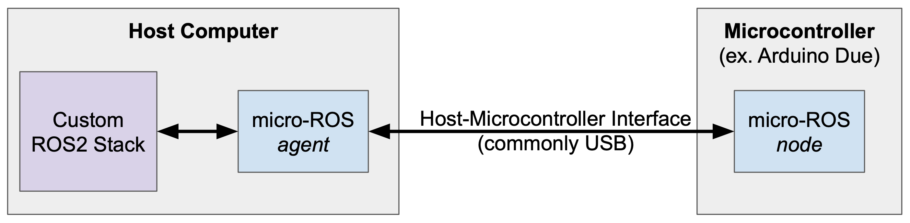

---
# Jekyll 'Front Matter' goes here. Most are set by default, and should NOT be
# overwritten except in special circumstances. 
# You should set the date the article was last updated like this:
date: 2022-05-04 # YYYY-MM-DD
# This will be displayed at the bottom of the article
# You should set the article's title:
title: micro-ROS for ROS2 on Microcontrollers
# The 'title' is automatically displayed at the top of the page
# and used in other parts of the site.
---
[micro-ROS](https://micro.ros.org/) is a set of software libraries that enables development of robotic applications to be deployed onto microcontrollers that are typically limited in computational resources. The micro-ROS framework is designed for use with ROS 2, and can be leveraged for **bidirectional communication** between ROS 2 nodes running on a separate compute and the micro-ROS application running on a **microcontroller**, such as an Arduino. micro-ROS is open-source, and can be highly beneficial for any roboticists aiming to integrate low-level microcontrollers into a robotic system. This page is a tutorial guide for how to setup and use micro-ROS, with an Arduino Due as example hardware.

## Conceptual Overview
micro-ROS consists of a `node` running on the microcontroller and an `agent` running on the host computer. The `agent` handles the interface between the `node` and the rest of the ROS2 stack. This allows the ROS2 stack and microcontroller `node` to publish and subscribe to each other as if the `node` was like any other ROS2 node. Great! The hardware interface is most commonly a serial connection, such as USB. This tutorial will walk through how to prepare the microcontroller and host computer environments for the `node` and `agent` respectively, and then show some examples for how to test the connection and make a first `node` on the microcontroller. 



## Installation Overview

At a high-level, there are two sets of micro-ROS libraries involved in the overall installation process. The first will be a set of micro-ROS client libraries specific to your hardware/microcontroller libraires, which will be necessary to build micro-ROS applications that run on the microcontroller. In addition, in order for your micro-ROS application to communicate with the rest of the ROS 2 stack, you will need to install the core micro-ROS libraries onto the host computer. This will allow micro-ROS to be run on your host machine, which will facilitate communication with a connected microcontroller running a micro-ROS application. The following tutorial will walk through installation of all necessary micro-ROS libraries using example hardware.

## Prerequisites

It is also assumed that you have a [supported microcontroller board](https://micro.ros.org/docs/overview/hardware/) on which the micro-ROS application will be built.

The steps will also use ROS2. At time of writing, there are a few possible options for installing micro-ROS with ROS2:

1. Install ROS2 natively on the host computer on the computer that will connect to the microcontroller).

> At time of writing (May 2022), **micro-ROS requires Linux OS** for native installation.

- In this case, follow the instructions for [Option 1: Installing micro-ROS Natively](#option-1-installing-micro-ros-natively)

2. Use a ROS2 Docker container. There are two options here:
  -  Use a pre-built docker image from micro-ROS that comes with micro-ROS installed in a ROS2 environment. In this case, follow the instructions for [Option 2.1: Using micro-ROS Docker image](#option-21-using-micro-ros-docker-image)
  > The pre-built option is most recommended if using Docker!

  -  Add micro-ROS build instructions to an existing dockerfile, to support a custom/user-defined ROS2 environment. In this case, follow the instructions for [Option 2.2: Using micro-ROS with user Dockerfile](#option-22-using-micro-ros-with-user-dockerfile)

## Setting Up micro-ROS with Arduino Due

Here we will go through an example of installing the precompiled micro-ROS libraries for an Arduino Due. First, it is necessary to have the Arduino IDE installed, with the Board Manager configured for use with the Arduino Due board. You can confirm this setup by referencing the [Arduino Due Quickstart Guide](https://docs.arduino.cc/hardware/due).

The precompiled micro-ROS library can be found on the [releases page](https://github.com/micro-ROS/micro_ros_arduino/releases) of the micro-ROS GitHub repository. Download the ZIP file for the precompiled library correponding to your version of ROS 2 (e.g. galactic, foxy, etc.). Then from within the Arduino IDE, you can include the library in your application by navigating to `Sketch -> Include Library -> Add .ZIP Library`.

For most officially supported boards for micro-ROS, the precompiled library may be all you need to get started. At this time of writing, however, the Arduino Due is a community-supported board which requires an additional patch. To install the patch, run the following commands:

```
export ARDUINO_PATH=[Your Arduino path]
cd $ARDUINO_PATH/hardware/sam/1.6.12/
curl https://raw.githubusercontent.com/micro-ROS/micro_ros_arduino/galactic/extras/patching_boards/platform_arduinocore_sam.txt > platform.txt
```

The `ARDUINO_PATH` referenced above is typically located at one of the following paths:
- On GNU/Linux: `~/.arduino15/packages/arduino`
- On Windows: `%AppData%\Arduino15\packages\arduino`
- On macOS: `~/Library/Arduino15/packages/arduino`

If you are having difficulty finding this path, feel free to reference Arduino's documentation for [finding the location of installed cores](https://support.arduino.cc/hc/en-us/articles/4411202655634#Arduino15), and be sure to double check that all instructions have been followed in the [Arduino Due Quickstart Guide](https://docs.arduino.cc/hardware/due) referenced earlier.

After applying the patch, open the Arduino IDE (or if it is already open, close and re-open it). From here you should be able to open a micro-ROS example, e.g. `File -> Examples -> micro_ros_arduino -> micro-ros_publisher`. Verify that it compiles, and this would conclude the micro-ROS precompiled library installation.

For any troubleshooting, additional instructions can be found at the [micro-ROS README](https://github.com/micro-ROS/micro_ros_arduino/blob/galactic/README.md)

## Installing micro-ROS on the Host Computer

Now you will need to install micro-ROS on the host computer. As discussed, there are a couple ways to do this depending on how you want to have your ROS2 environment set up.

### Option 1: Installing micro-ROS Natively

To install micro-ROS natively on your host computer, you will first need to have ROS2 installed natively. 
> Note that you need to be using a Linux OS. If you do not have a Linux OS, then you should try one of the Docker options.

1. Please follow the [ROS2 installation guide](https://docs.ros.org/en/galactic/Installation.html) for official instructions.

Now that you have ROS2 installed (on your Linux host machine), we can install the micro-ROS libraries.

2. Run the following commands, as specified in the [installation instructions](https://micro.ros.org/docs/tutorials/core/first_application_linux/):
```
# Source the ROS 2 installation
source /opt/ros/$ROS_DISTRO/setup.bash

# Create a workspace and download the micro-ROS tools
mkdir microros_ws
cd microros_ws
git clone -b $ROS_DISTRO https://github.com/micro-ROS/micro_ros_setup.git src/micro_ros_setup

# Update dependencies using rosdep
sudo apt update && rosdep update
rosdep install --from-paths src --ignore-src -y

# Install pip
sudo apt-get install python3-pip

# Build micro-ROS tools and source them
colcon build
source install/local_setup.bash

# Create firmware
ros2 run micro_ros_setup create_firmware_ws.sh host

# Build firmware
ros2 run micro_ros_setup build_firmware.sh
source install/local_setup.bash

# Download micro-ROS-Agent packages
ros2 run micro_ros_setup create_agent_ws.sh

# Build micro-ROS-Agent
ros2 run micro_ros_setup build_agent.sh
source install/local_setup.bash
```

At this point, you should have micro-ROS installed on the host machine and can continue to [Testing the Installation](#testing-the-installation).

### Option 2.1: Using micro-ROS Docker image

Micro-ROS maintains several Docker images that build on top of ROS2 distributions. The images have variable levels of pre-built functionality. The best one for getting started is the `micro-ros-agent` image that will allow you to run an agent directly! For more information about the images available, and how they are constructed, please see the [micro-ROS docker repository](https://github.com/micro-ROS/docker).

1. First make sure you have Docker installed on your host machine. 
> [Docker Desktop for Mac/Windows](https://docs.docker.com/desktop/) OR [Docker Engine for Linux](https://docs.docker.com/engine/install/#server)

2. Then pull the `micro-ros-agent` image, replacing the branch name with the distro version as `microros/<image>:$ROS_DISTRO`. For example, you can pull the image built on ROS2 galactic by using the following command:
```
docker pull microros/micro-ros-agent:galactic
```

3. Use the `docker run` command to bring the container up
```
docker run -d --net=host microros/micro-ros-agent:galactic udp4 -p 9999
```
see print out

```
docker exec -it <print out> bash
```
### Option 2.2: Using micro-ROS with user Dockerfile

TODO: transfer instructions from `arduino` package readme

## Testing the Installation

TODO: transfer instructions from `arduino` package readme

## Writing an Example micro-ROS Sketch

TODO: high level overview, link to docs

### Quick Start: Publisher and Subscriber

TODO: transfer `actuator_interface` example from `dev` branch code

### Advanced: Heartbeat for Transient Connectivity

TODO: transfer `auto_connect_actuator_interface` example from `dev` branch code

## First subheading
Use this section to cover important terms and information useful to completing the tutorial or understanding the topic addressed. Don't be afraid to include to other wiki entries that would be useful for what you intend to cover. Notice that there are two \#'s used for subheadings; that's the minimum. Each additional sublevel will have an added \#. It's strongly recommended that you create and work from an outline.

This section covers the basic syntax and some rules of thumb for writing.

### Basic syntax
A line in between create a separate paragraph. *This is italicized.* **This is bold.** Here is [a link](/). If you want to display the URL, you can do it like this <http://ri.cmu.edu/>.

> This is a note. Use it to reinforce important points, especially potential show stoppers for your readers. It is also appropriate to use for long quotes from other texts.


#### Bullet points and numbered lists
Here are some hints on writing (in no particular order):
- Focus on application knowledge.
  - Write tutorials to achieve a specific outcome.
  - Relay theory in an intuitive way (especially if you initially struggled).
    - It is likely that others are confused in the same way you were. They will benefit from your perspective.
  - You do not need to be an expert to produce useful content.
  - Document procedures as you learn them. You or others may refine them later.
- Use a professional tone.
  - Be non-partisan.
    - Characterize technology and practices in a way that assists the reader to make intelligent decisions.
    - When in doubt, use the SVOR (Strengths, Vulnerabilities, Opportunities, and Risks) framework.
  - Personal opinions have no place in the Wiki. Do not use "I." Only use "we" when referring to the contributors and editors of the Robotics Knowledgebase. You may "you" when giving instructions in tutorials.
- Use American English (for now).
  - We made add support for other languages in the future.
- The Robotics Knowledgebase is still evolving. We are using Jekyll and GitHub Pages in and a novel way and are always looking for contributors' input.

Entries in the Wiki should follow this format:
1. Excerpt introducing the entry's contents.
  - Be sure to specify if it is a tutorial or an article.
  - Remember that the first 100 words get used else where. A well written excerpt ensures that your entry gets read.
2. The content of your entry.
3. Summary.
4. See Also Links (relevant articles in the Wiki).
5. Further Reading (relevant articles on other sites).
6. References.

#### Code snippets
There's also a lot of support for displaying code. You can do it inline like `this`. You should also use the inline code syntax for `filenames` and `ROS_node_names`.

Larger chunks of code should use this format:
```
def recover_msg(msg):

        // Good coders comment their code for others.

        pw = ProtocolWrapper()

        // Explanation.

        if rec_crc != calc_crc:
            return None
```
This would be a good spot further explain you code snippet. Break it down for the user so they understand what is going on.

#### LaTex Math Support
Here is an example MathJax inline rendering $ \phi(x\|y) $ (note the additional escape for using \|), and here is a block rendering:
$$ \frac{1}{n^{2}} $$

#### Images and Video
Images and embedded video are supported.






The video id can be found at the end of the URL. In this case, the URLs were
`https://www.youtube.com/watch?v=8P9geWwi9e0`
& `https://vimeo.com/148982525`.

## Summary
Use this space to reinforce key points and to suggest next steps for your readers.

## See Also:
- Links to relevant material within the Robotics Knowledgebase go here.

## Further Reading
- Links to articles of interest outside the Wiki (that are not references) go here.

## References
- Links to References go here.
- References should be in alphabetical order.
- References should follow IEEE format.
- If you are referencing experimental results, include it in your published report and link to it here.
