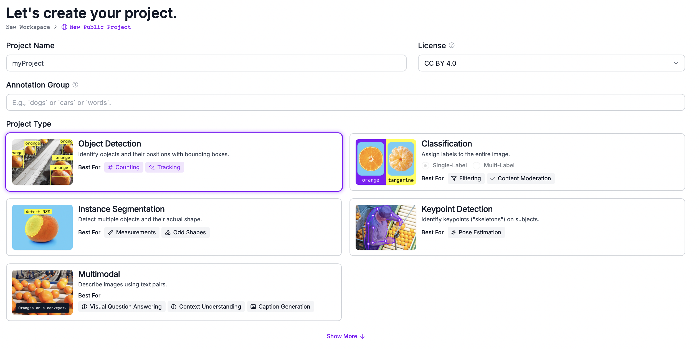
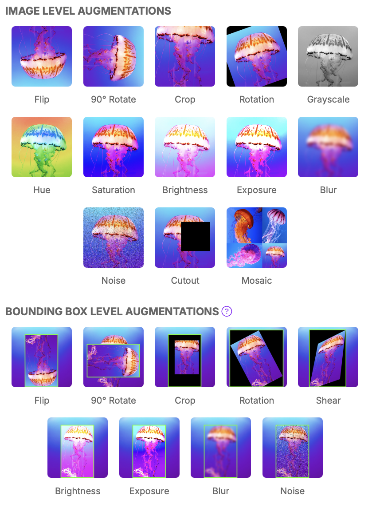

## Intro 
Visual segmentation and classification are essential components of many robotic applications, enabling precise perception and decision-making. YOLOv8, one of the most widely adopted object detection frameworks, offers cutting-edge performance and versatility. This guide provides a step-by-step approach to implementing YOLOv8 with Roboflow for dataset preparation and ROS2 for seamless integration into robotic systems, streamlining your development process for efficient and accurate visual tasks.

### What is YOLOv8?

YOLOv8 (You Only Look Once v8) is a state-of-the-art machine learning-based image model that can be trained and implemented using the Ultralytics library. 

There are various applications for YOLOv8 depending on your system's requirements.

|  |
| :---------------------------------------------------------------------------: |
|                             *YOLOv8 Applications*                             |

- **Classify**: Detects and labels objects.
- **Detect**: Identifies objects and forms bounding boxes around them.
- **Segment**: Segments objects by their shape.
- **Track**: Extends object detection to track the movement of objects across a series of images.
- **Pose**: Maps the wireframe of an individual.

>[!NOTE]
>To learn more about how YOLO works, check out this [guide](https://medium.com/cord-tech/yolov8-for-object-detection-explained-practical-example-23920f77f66a).

Additionally, YOLOv8 supports **OBB (Oriented Bounding Box)**, which detects rotated bounding boxes aligned to the orientation of the objects as per training data.

YOLOv8 also offers models in various sizes for different tasks: **Nano (N)**, **Small (S)**, **Medium (M)**, **Large (L)**, and **Extra Large (X)**. Due to our project's hardware limitations, we opted for the **Nano (N)** model size. Therefore, this guide focuses on implementing YOLOv8 with the Nano model size.

This guide is based on the insights and experiences gained during the 2024 Team F capstone project and primarily focuses on detection tasks without OBB.

## Image Collection

Effective image data collection is the cornerstone of developing a high-performing YOLOv8 object detection model. High-quality data ensures that the model learns the correct features, enabling precise detection and classification of objects. A diverse dataset with variability promotes the model's ability to generalize to unseen scenarios. Below, we outline the best practices and considerations for collecting image data tailored to training YOLOv8.

---

### Data Collection Setup

To ensure an effective data collection setup, the following aspects should be considered:

- **Project Requirements**:
  - Identify the specific objects or scenarios to be detected and ensure they are prominently represented in the dataset.
  - Tailor data collection to the context in which the model will be used (e.g., indoor, outdoor, agricultural settings).

- **Hardware Constraints**:
  - Consider the hardware on which the trained YOLOv8 model will be deployed. Collect data under conditions that reflect hardware limitations, such as resolution or frame rate.

- **Reflect Real-World Conditions**:
  - If the system will operate in an outdoor environment, collect images outdoors under varying lighting conditions, such as bright daylight, overcast skies, and artificial lighting.
  - For indoor systems, collect images indoors under consistent lighting conditions and camera settings.

---

### Data Collection Process

Once the setup is determined, follow these steps to collect image data for YOLOv8 training:

- **Identify Object Classes**: Clearly define the classes of objects to be detected (e.g., weeds, specific crops).

- **Include Variability**: Capture objects from multiple angles, distances, and perspectives to ensure the dataset reflects diverse real-world scenarios.

- **Ensure Quality**:
  - Use high-resolution cameras or devices to capture clear and detailed images.
  - Avoid blurry or low-quality images unless the system is specifically designed to operate in motion or under such conditions, as these can negatively impact the training process.

---

>[!NOTE]
>Additional resources for image data collection:
>1. [Mastering the Art of Image Dataset Collection: A Comprehensive Guide for AI and Machine Learning](https://medium.com/@shalinigts16/mastering-the-art-of-image-dataset-collection-a-comprehensive-guide-for-ai-and-machine-learning-d3e2848af924)
>2. [Building and Using Image Datasets for Machine Learning](https://medium.com/@globosetechnologysolution/building-and-using-image-datasets-for-machine-learning-f5eb6d5f9e2a)

## Data Annotation

Once you have a set of images, it's time to upload them to Roboflow. Roboflow provides intuitive tools for quickly creating custom datasets, making it a top choice for projects requiring tailored image data. The free package allows up to three collaborators per workspace, making it accessible for small teams.



### Choosing the Annotation Type
Select the appropriate annotation type based on your project:
- **Object Detection**: For OBB, detect, or track tasks.
- **Classification**: For classify tasks.
- **Instance Segmentation**: For segment tasks.
- **Keypoint Detection**: For pose tasks.

---

### Tricks for Efficient Annotation on Roboflow

#### API Access for Various Tasks
Roboflow offers API support to streamline processes like uploading, exporting, and deploying datasets. Below are some common use cases:

1. Uploading images and annotations programmatically:
```python
import roboflow
rf = Roboflow(api_key="YOUR_API_KEY")
project = rf.workspace().project("YOUR_PROJECT_NAME")
project.upload(image_path, annotation_path)
```

2. Exporting datasets using the API:
```python
dataset = project.version(VERSION_NUMBER).download("yolov8")
```

3. Deploying trained models:
```python
project.version(VERSION_NUMBER).deploy(model_type="yolov8", model_path="path/to/weights")
```

>[!NOTE]
>For API documentation, please checkout: [API Reference](https://docs.roboflow.com/api-reference/introduction)
#### Streamlining Your Annotation Process
##### Using Roboflow’s Built-in Smart Polygon Tool
Roboflow’s Smart Polygon tool allows you to efficiently annotate multiple objects simultaneously.

>[!NOTE]
>For a detailed guide on Smart Polygon Labeling, refer to this blog: [Launch: Smart Polygon Labeling](https://blog.roboflow.com/automated-polygon-labeling-computer-vision/)
##### With Your Own Model
After training your YOLOv8 model, you can upload its weights to Roboflow for future annotation tasks. This enables Roboflow to automatically generate annotations, significantly speeding up the process.
>[!NOTE]
>For a detailed guide on Custom Weight Upload, visit: [Upload Custom Weights](https://docs.roboflow.com/deploy/upload-custom-weights)

## Export and Train

Dataset augmentation is a crucial step for improving model performance and generalization. It enhances the diversity of the training set, enabling the model to learn from a wider range of scenarios and perform better on unseen data. Commonly used augmentation techniques include:

- **Rotation and Flipping**
- **Brightness and Contrast Adjustments**
- **Noise Introduction**
- **Mosaic Augmentation** (combining multiple images)

### Applying Augmentations in Roboflow

To apply augmentations in Roboflow:

1. Navigate to the **"Versions"** tab in your project.
2. Click **"Create New Version."**
3. Select the desired images and configure the **Train/Test Split** and **Preprocessing** options.
4. Under the **Augmentation** section, click **"Add Augmentation Step."**
5. Choose and configure the desired augmentations.
   
6. Generate the augmented dataset version.

By following these steps, you can create a more robust dataset to maximize the effectiveness of your YOLOv8 model during training.

## Download YOLOv8 Training-Compatible Data Format

To export your dataset for YOLOv8 training:

1. Navigate to the **"Versions"** tab and select the desired dataset version.
2. Click **"Download Dataset"** and choose the **YOLOv8 format** under the TXT option.
3. Download the exported dataset.

> [!Note]
> Dataset versions in Roboflow act as snapshots of your data at specific points in time. This feature allows you to track changes and compare model performance across different augmentations and preprocessing configurations.

## Train Your Model
Time to train your model with your custom dataset. Before we write the base Python code or CLI, first download Ultralytics!
```
pip install ultralytics
```

Once that is done check to see successful installation by putting `yolo` in the terminal.

### Model Selection and Configuration

#### Choosing the Training Approach
- Use **.pt** file format for training with a pretrained model
- Use **.yaml** file format for training a model from scratch
#### Selecting Model Size
Choose from YOLOv8 model sizes:
- Nano
- Small
- Medium
- Large
- Extra Large
#### Task-Specific Extensions
Append these extensions for specific tasks:
- Segment: **-seg**
- Oriented Bounding Box (OBB): **-obb**
- Pose: **-pose**
- Classify: **-cls**
- Detect or track: No extension required
#### Model Naming Convention
Format: `yolov8(size)(extension if applicable)(.yaml/.pt)`

Examples:
- `yolov8n-obb.pt`
- `yolov8x-seg.yaml`
- `yolov8m-cls.pt`
### Training the YOLOv8 Model
```python
from ultralytics import YOLO

# Load the model
model = YOLO('INSERT_MODEL_NAME')

# Train the model
results = model.train(data='PATH_TO_DATASET', epochs=EPOCHS, imgsz=640)
```

Replace `INSERT_MODEL_NAME` with your chosen model name and specify the path to your dataset (`PATH_TO_DATASET`). Experiment with the number of epochs for optimal configuration.

> [!NOTE] 
> The trained model will be saved in the `runs` directory under the respective task folder.
### Troubleshooting
If you encounter a "dataset not found" error, consult the Ultralytics troubleshooting guide.

### Using the YOLOv8 Model

#### 1. Tracking
```python
from ultralytics import YOLO

# Load the trained model
model = YOLO('PATH_TO_MODEL') 

# Perform tracking
results = model.track('INSERT_YOUTUBE_LINK', show=True)
```

Replace `PATH_TO_MODEL` with the trained model path and `INSERT_YOUTUBE_LINK` with the video link to be processed.

> [!Note]
> Tracking also supports segmentation and pose tasks.

#### 2. Validation
```python
from ultralytics import YOLO

# Load the trained model
model = YOLO("PATH_TO_MODEL")

# Validate the model
metrics = model.val()

# Access performance metrics
print(metrics.box.map)  # mAP@50-95
print(metrics.box.map50)  # mAP@50
```

#### 3. Inference
```python
from ultralytics import YOLO

# Load the trained model
model = YOLO("PATH_TO_MODEL")

# Perform inference
results = model(["im1.jpg", "im2.jpg"])

# Process results
for result in results:
    boxes = result.boxes  # Bounding boxes
    masks = result.masks  # Segmentation masks
    keypoints = result.keypoints  # Pose keypoints
    probs = result.probs  # Classification probabilities
    obb = result.obb  # Oriented bounding boxes
    result.show()  # Display the result
    result.save(filename="result.jpg")  # Save the result
```

#### 4. Exporting the Model
```python
from ultralytics import YOLO

# Load the trained model
model = YOLO("PATH_TO_MODEL")

# Export the model
model.export(format="onnx")
```

#### 5. Benchmarking
```python
from ultralytics.utils.benchmarks import benchmark

# Run benchmarking
benchmark(model='PATH_TO_MODEL', data='DATASET_PATH', imgsz=640, half=False)
```

### Conclusion
You now have a trained YOLOv8 model ready for various tasks, from object detection to tracking, segmentation, and more. The possibilities for applications are vast, ranging from research to real-world deployments.

## ROS2 Integration

### Prerequisites

Before integrating YOLOv8 with ROS2, ensure you have:

- ROS2 installed (e.g., Foxy, Humble)
- Ultralytics package installed: `pip install ultralytics`
- ROS Numpy package: `pip install ros_numpy`

### 1. Setting Up the ROS2 Package

Create a new ROS2 package for your YOLOv8 integration:

```bash
ros2 pkg create --build-type ament_python yolov8_ros2
cd yolov8_ros2
```

### 2. Creating the YOLOv8 Node

Create a new Python file named `yolov8_node.py` in the `yolov8_ros2` directory:

```python
import rclpy
from rclpy.node import Node
from sensor_msgs.msg import Image
from cv_bridge import CvBridge
from ultralytics import YOLO
import cv2
import numpy as np

class YOLOv8Node(Node):
    def __init__(self):
        super().__init__('yolov8_node')
        self.subscription = self.create_subscription(
            Image,
            '/camera/color/image_raw',
            self.image_callback,
            10)
        self.publisher = self.create_publisher(Image, '/yolov8/detections', 10)
        self.model = YOLO('PATH_TO_MODEL')
        self.bridge = CvBridge()

    def image_callback(self, msg):
        cv_image = self.bridge.imgmsg_to_cv2(msg, desired_encoding='bgr8')
        results = self.model(cv_image)
        annotated_image = results[0].plot()
        self.publisher.publish(self.bridge.cv2_to_imgmsg(annotated_image, encoding='bgr8'))

def main(args=None):
    rclpy.init(args=args)
    yolov8_node = YOLOv8Node()
    rclpy.spin(yolov8_node)
    yolov8_node.destroy_node()
    rclpy.shutdown()

if __name__ == '__main__':
    main()
```

### 3. Updating package.xml

Add the following dependencies to your `package.xml`:

```xml
<depend>rclpy</depend>
<depend>sensor_msgs</depend>
<depend>cv_bridge</depend>
```

### 4. Configuring setup.py

Update your `setup.py` to include the entry point for the YOLOv8 node:

```python
entry_points={
    'console_scripts': [
        'yolov8_node = yolov8_ros2.yolov8_node:main',
    ],
},
```

### 5. Building and Running

Build your package:

```bash
colcon build --packages-select yolov8_ros2
```

Source your workspace:

```bash
source install/setup.bash
```

Run the YOLOv8 node:

```bash
ros2 run yolov8_ros2 yolov8_node
```

### 6. Visualizing Results

To visualize the detections, use RViz2:

```bash
ros2 run rviz2 rviz2
```

Add an Image display and set the topic to `/yolov8/detections`.

### Advanced Integration

#### Custom Messages

For more detailed information about detections, create custom messages:

1. Create a new package for interfaces:
   ```bash
   ros2 pkg create --build-type ament_cmake yolov8_msgs
   ```

2. Define a custom message in `yolov8_msgs/msg/Detection.msg`:
   ```
   string class_name
   float32 confidence
   int32[4] bbox  # [x, y, width, height]
   ```

3. Update the YOLOv8 node to publish these custom messages.

>[!NOTE]
>Additional Reference for Integration ROS2 with YOLOv8
>- How to Use YOLOv8 with ROS2 - YouTube https://www.youtube.com/watch?v=XqibXP4lwgA
>- ROS (Robot Operating System) quickstart guide - Ultralytics https://docs.ultralytics.com/guides/ros-quickstart/
>- YOLOv8 OBB Training and ROS Implementation - YouTube https://www.youtube.com/watch?v=7n6gCqC075g
>- r-shima/yolov8_ros2: ROS 2 packages for running YOLOv8 - GitHub https://github.com/r-shima/yolov8_ros2
>- Ultralytics YOLOv8, YOLOv9, YOLOv10, YOLOv11 for ROS 2 - GitHub https://github.com/mgonzs13/yolo_ros
