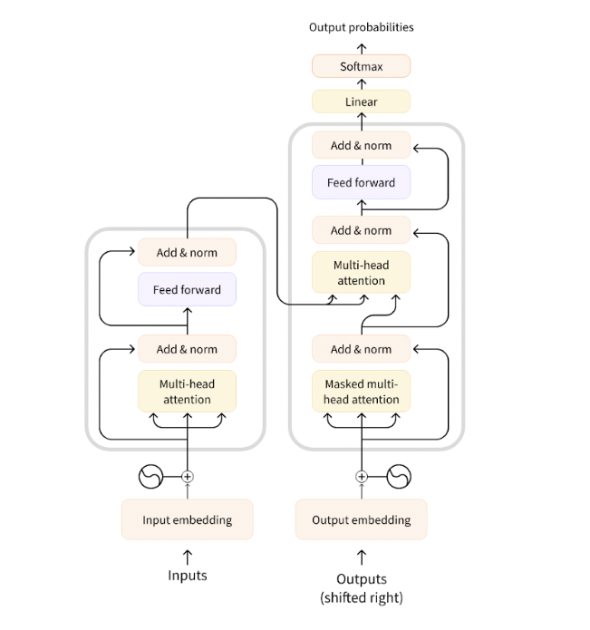

NLP is a field of linguistics and machine learning focused on understanding everything related to human language. The aim of NLP tasks is not only to understand single words individually, but to be able to understand the context of those words.

NLP can help in robotics by enabling robots to understand and respond to natural language commands. This could be used to give robots instructions, ask them questions, and provide feedback. NLP could also be used to enable robots to interpret and respond to human emotions, allowing them to interact more naturally with people. Additionally, NLP can be used to enable robots to learn from their environment and experiences, allowing them to become more autonomous and intelligent. _(BTW, this paragraph is written by a generative transformer)_

## Transformers

Transformers are a type of neural network architecture used in natural language processing (NLP). They are based on the concept of self-attention, which allows the network to focus on specific parts of the input sentence while ignoring irrelevant words. Transformers are used for a variety of tasks, such as language modeling, machine translation, text summarization, and question answering.

The architecture is based on the idea of self-attention, which allows the network to focus on specific parts of the input sentence while ignoring irrelevant words. This allows the network to better understand the context of the sentence and make more accurate predictions.

The architecture of a transformer consists of an encoder and a decoder. The encoder takes in a sequence of words and produces a set of vectors that represent the meaning of the words. The decoder then takes these vectors and produces a prediction.

Transformers have become increasingly popular in NLP due to their ability to capture long-term dependencies in text. They have been used to achieve state-of-the-art results in a variety of tasks, such as language modeling, machine translation, text summarization, and question answering.

Transformers are a powerful tool for NLP and have revolutionized the field. They have enabled researchers to create models that can accurately capture the meaning of text and make accurate predictions.



 

Encoder (left): The encoder receives an input and builds a representation of it (its features). This means that the model is optimized to acquire understanding from the input.

Decoder (right): The decoder uses the encoder’s representation (features) along with other inputs to generate a target sequence. This means that the model is optimized for generating outputs.

Each of these parts can be used independently, depending on the task:

- Encoder-only models: Good for tasks that require understanding of the input, such as sentence classification and named entity recognition.
- Decoder-only models: Good for generative tasks such as text generation.
- Encoder-decoder models or sequence-to-sequence models: Good for generative tasks that require an input, such as translation or summarization.

# Using Transformers

In general, transformers are very large. With millions to tens of billions of parameters, training and deploying these models is a complicated undertaking. Furthermore, with new models being released on a near-daily basis and each having its own implementation, trying them all out is no easy task. An easy way to implement and fine-tune transformers is the HuggingFace library.

## HuggingFace

HuggingFace is an open-source library for Natural Language Processing (NLP) that provides state-of-the-art pre-trained models for a variety of tasks such as text classification, question answering, text generation, and more. It is built on top of the popular PyTorch and TensorFlow frameworks and is designed to be easy to use and extend.

The library’s main features are:

Ease of use: Downloading, loading, and using a state-of-the-art NLP model for inference can be done in just two lines of code.

Flexibility: At their core, all models are simple PyTorch nn.Module or TensorFlow tf.keras.Model classes and can be handled like any other models in their respective machine learning (ML) frameworks.

Simplicity: Hardly any abstractions are made across the library. The “All in one file” is a core concept: a model’s forward pass is entirely defined in a single file, so that the code itself is understandable and hackable.

## Dependencies and Installation

You will need either Tensorflow or PyTorch installed.

Installing Tensorflow Guide: [Install TensorFlow 2](https://www.tensorflow.org/install/)

Installing PyTorch Guide: [Start Locally | PyTorch](https://pytorch.org/get-started/locally/)

You will also need HuggingFace’s Transformer library which can be installed through the below command

```bash
pip install transformers
```

## Simple example 1: Text classification

With the Transformer library, you can implement an NLP classification pipeline with just 3 lines of code.

```python
# Importing the libraries
from transformers import pipeline

# Load the model
classifier = pipeline('sentiment-analysis')

# Inference
result = classifier('MRSD is an awesome course!')

print(result)
```
```
Output: 'label': 'POSITIVE', 'score': 0.9998725652694702_
```
##

## Simple example 2: Natural Language Generation

```python
# Importing the libraries
from transformers import pipeline

# Init generator
generator = pipeline(task="text-generation")

# Run inference
results = generator("Hello, I'm a language model,", max_length=30, num_return_sequences=5)

for idx, result in enumerate(results): print(str(idx) + "| " + result['generated_text'] + '\n')
```

```
OUTPUT:

0| Hello, I'm a language model, so I'm able to write with much more precision code than I would normally, but if I want to have

1| Hello, I'm a language model, which means that anything that has a language model comes after you, but only when you really want, and never

2| Hello, I'm a language model, you can't do that here. I wanted a language that is a perfect metaphor for what we live in.

3| Hello, I'm a language model, but I could come back and say something like, we can put a value that says if a function is given

4| Hello, I'm a language model, and these are some more examples. Here's a picture of what's wrong with me.

```

##

## Simple example 3: Multimodal representation

```python
# Importing the libraries
from transformers import pipeline

# VISUAL QUESTION ANSWERING PIPELINE
vqa = pipeline(task="vqa")

# INPUTS
image = "https://huggingface.co/datasets/huggingface/documentation-images/resolve/main/pipeline-cat-chonk.jpeg"
question = "Where is the cat?"

# PREDICTION
preds = vqa(image=image, question=question)
preds = [{"score": round(pred["score"], 4), "answer": pred["answer"]} for pred in preds]
```


```
OUTPUT: [

 {'score': 0.911, 'answer': 'snow'},

 {'score': 0.8786, 'answer': 'in snow'},

 {'score': 0.6714, 'answer': 'outside'},

 {'score': 0.0293, 'answer': 'on ground'},

 {'score': 0.0272, 'answer': 'ground'}

]
```

 

## Selecting the correct model

Below is a table describing some of the basic pipeline identifiers and their use.


# Fine-tuning a pretrained model

HuggingFace has a great colab notebook on fine-tuning a pre-trained model. The link to the notebook is below:

[https://colab.research.google.com/github/huggingface/notebooks/blob/main/transformers_doc/en/tensorflow/training.ipynb](https://colab.research.google.com/github/huggingface/notebooks/blob/main/transformers_doc/en/tensorflow/training.ipynb)

 
# Bias and limitations

If your intent is to use a pretrained model or a fine-tuned version in production, please be aware that, while these models are powerful tools, they come with limitations. The biggest of these is that, to enable pretraining on large amounts of data, researchers often scrape all the content they can find, taking the best as well as the worst of what is available on the internet.

To give a quick illustration, let’s go back the example of a `fill-mask` pipeline with the BERT model:

```python
from transformers import pipeline

unmasker = pipeline("fill-mask", model="bert-base-uncased")
result = unmasker("This man works as a [MASK].")
print([r["token_str"] for r in result])

result = unmasker("This woman works as a [MASK].")
print([r["token_str"] for r in result])
```
```
OUTPUT
['lawyer', 'carpenter', 'doctor', 'waiter', 'mechanic']
['nurse', 'waitress', 'teacher', 'maid', 'prostitute']
```

When asked to fill in the missing word in these two sentences, the model gives only one gender-free answer (waiter/waitress). The others are work occupations usually associated with one specific gender — and yes, prostitute ended up in the top 5 possibilities the model associates with “woman” and “work.” This happens even though BERT is one of the rare Transformer models not built by scraping data from all over the internet, but rather using apparently neutral data (it’s trained on the English Wikipedia and BookCorpus datasets).

When you use these tools, you therefore need to keep in the back of your mind that the original model you are using could very easily generate sexist, racist, or homophobic content. Fine-tuning the model on your data won’t make this intrinsic bias disappear.


