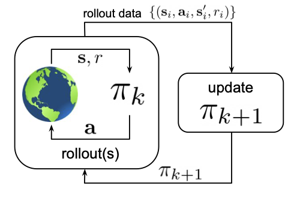
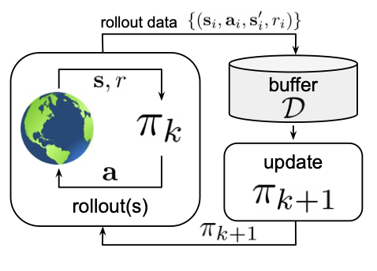
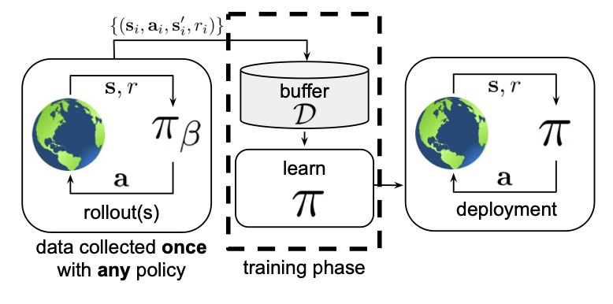

---
# Jekyll 'Front Matter' goes here. Most are set by default, and should NOT be
# overwritten except in special circumstances.
# You should set the date the article was last updated like this:
date: 2024-04-30 # YYYY-MM-DD
# This will be displayed at the bottom of the article
# You should set the article's title:
title: Offline reinforcement learning
# The 'title' is automatically displayed at the top of the page
# and used in other parts of the site.

---
This blog is supposed to be a junction that connects some of the important concepts in offline reinforcement learning (RL). It provides high-level information about offline RL and its importance, limitations of online learning algorithms, and popular methods in offline RL and readers can find more detailed information in the references provided.
### Introduction
Offline RL refers to a learning paradigm where an agent learns from a fixed dataset of pre-collected experiences, without the need for real-time interaction with the environment. Unlike online RL, the agent's policy is trained solely on historical data, making it more sample-efficient and suitable for scenarios where data collection is expensive or time-consuming. Offline RL methods aim to optimize the policy using the given dataset, addressing challenges like sample efficiency and stability in learning. This approach has practical applications in fields such as robotics, finance, and healthcare.

#### Reinforcement learning
Classically refers to a machine learning paradigm where an agent learns to make sequential decisions by interacting with an environment. The agent receives feedback in the form of rewards based on its actions, allowing it to learn an optimal policy that maximizes long-term rewards.

Figure: Shows the interaction between the agent and the environment and how the agent only learns for the latest data in traditional online RL setup.

#### Why offline setting is important?
Online RL algorithms heavily rely on interacting with the environment and cannot effectively utilize existing data. For many real-world applications, collecting data can be expensive (e.g., robotics), time-consuming, or even dangerous (e.g., healtcare). Besides, there are problem settings with massive amounts of existing data, that could be leveraged. Some example applications include [computational design](https://github.com/brandontrabucco/design-bench), [chip design](https://research.google/blog/offline-optimization-for-architecting-hardware-accelerators/), and autonomous vehicles.
#### Limitations of online learning algorithms
<!-- Talk about on-policy vs off-policy algorithms -->
__On-policy__ algorithms like PPO, TRPO, and REINFORCE generally require real-time interaction with the environment to update the policy. Techniques like importance sampling [1] can be used to learn from a fixed dataset, but they are often unstable and inefficient in practice.
__Off-policy__ algorithms like DQN, DDPG, and SAC are designed to utilize a data buffer (known as replay buffer) of interactions. However, there are still limitations when it comes to only learning from a fixed dataset. One of the problem being, there is no possibility of improving exploration: exploration is outside the scope of the algorithm, so if the dataset does not contain transitions that illustrate high-reward regions of the state space, it may be impossible to discover those high-reward regions. Another problem is distributional shift: while a function approximator (policy, value function, or model) might be trained under one distribution, it will be evaluated on a different distribution, due both to the change in visited states for the new policy and, more subtly, by the act of maximizing the expected return. Once the policy enters one of out-of-distribution states, it will keep making mistakes and may remain out-of-distribution for the remainder of the trial.

Figure: Shows the interaction between the agent and the environment and how the agent learns for a buffer of saved data in off-policy RL.

## Offline reinforcement learning
Offline RL involves training an agent using a __fixed dataset__ of historical experiences. The agent learns from this dataset without interacting with the environment in real-time, making it more sample-efficient and suitable for scenarios where data collection is expensive or impractical.

Figure: Shows the interaction between the agent and the environment and the learning process being isolated. The agent learns from a fixed dataset of historical experiences in offline RL.

### Popular methods
#### Conservative Q-learning
One of the major issues is directly using off-policy value based methods like DQN, DDPG, and SAC is that they can overfit to the data and perform poorly on unseen states. Conservative Q-learning [2] is a simple yet effective method for offline RL that aims to learn a policy that maximizes the expected return while ensuring that the policy does not deviate significantly from the behavior policy that generated the dataset. This constraint helps prevent overfitting to the dataset and improves generalization to unseen states.

#### Behavior regularized offline reinforcement learning
Behavior regularized offline RL [3] is another approach that aims to improve the stability and generalization of offline RL algorithms. This method introduces a behavior regularizer that encourages the learned policy to be close to the behavior policy that generated the dataset. By incorporating this regularizer into the optimization objective, the algorithm can learn a policy that performs well on unseen states while maintaining stability during training.

#### Implicit Q-learning
Implicit Q-learning [4] is a recent method that aims to improve the sample efficiency and stability of offline RL algorithms. This approach leverages implicit models to learn a value function that is consistent with the dataset while avoiding overfitting. By using implicit models, the algorithm can learn a more robust value function that generalizes well to unseen states and improves performance on challenging tasks.

### References
[1] Levine, Sergey, Aviral Kumar, George Tucker, and Justin Fu. "Offline reinforcement learning: Tutorial, review, and perspectives on open problems." arXiv preprint arXiv:2005.01643 (2020).
[2] Kumar, Aviral, Aurick Zhou, George Tucker, and Sergey Levine. "Conservative q-learning for offline reinforcement learning." Advances in Neural Information Processing Systems 33 (2020): 1179-1191.
[3] Wu, Yifan, George Tucker, and Ofir Nachum. "Behavior regularized offline reinforcement learning." arXiv preprint arXiv:1911.11361 (2019).
[4] Kostrikov, Ilya, Ashvin Nair, and Sergey Levine. "Offline reinforcement learning with implicit q-learning." arXiv preprint arXiv:2110.06169 (2021).

### Related
- [Lilian Weng's blog on RL](https://lilianweng.github.io/lil-log/2018/02/19/a-long-peek-into-reinforcement-learning.html)
- [Introduction to RL](intro-to-rl.md)
