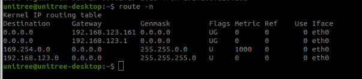

---
# Jekyll 'Front Matter' goes here. Most are set by default, and should NOT be
# overwritten except in special circumstances. 
# You should set the date the article was last updated like this:
date: 2023-12-03 # YYYY-MM-DD
# This will be displayed at the bottom of the article
# You should set the article's title:
title: Background Knowledge for Packet Routing in Linux
# The 'title' is automatically displayed at the top of the page
# and used in other parts of the site.
---
This wiki page aims to provide a comprehensive guide on network configuration in Linux, with a particular focus on packet forwarding and routing. 


## Packet Forwarding in Linux

### Enabling IP Forwarding
Enabling IP forwarding in Linux is an essential step for configuring a system to act as a router or a gateway, allowing it to pass network traffic between interfaces. 

```console
#Permanent Enabling
sudo nano /etc/sysctl.conf

#Add or modify the following line in the file
net.ipv4.ip_forward = 1

#After saving and closing the file, apply the changes with
sudo sysctl -p

```


## Understanding Routing Tables

A routing table in Linux is a set of rules that determines where network traffic is directed. It plays a crucial role in the networking subsystem of the Linux operating system. The table is used by the kernel to decide how to forward network packets. It contains a set of rules that dictate where and how data packets traveling over an IP network should be directed.

### Address

The routing process involves two main components: the source and the destination. The source is the device that initiates the sending of a network packet, while the destination is the target device (or IP address) that the packet is intended to reach.


### Gateway

A gateway is a network device that acts as an intermediary between different networks, allowing them to communicate with each other. It is often a router or a similar networking device that connects your local network (such as your home or office network) to other networks, including the internet. You need a gateway for the following reasons:

- Routing between networks: When your device needs to send data to a device on a different network (e.g., accessing a website on the internet), the gateway is responsible for forwarding the data packets to the appropriate destination. It determines the best path for the packets to reach their destination based on its routing table.
- Network Address Translation (NAT): In most home and office networks, devices are assigned private IP addresses that are not routable on the internet. A gateway performs Network Address Translation (NAT), which allows multiple devices with private IP addresses to share a single public IP address when accessing the internet. This not only conserves the limited IPv4 address space but also provides a level of security by hiding the internal network structure from external networks.
 
 

### Genmask

In a Linux routing table, the "genmask" field, short for "general netmask" or simply "netmask," is used to specify the subnet mask associated with a particular route. The subnet mask is a 32-bit number that is used to divide an IP address into network and host portions. It helps the routing process determine which part of an IP address identifies the network and which part identifies the host within that network.

In a routing table, the subnet mask works in conjunction with the destination IP address to determine the range of IP addresses covered by a specific routing rule. The subnet mask is represented as a series of 1s followed by a series of 0s in binary. For example, a subnet mask of 255.255.255.0 in decimal notation is represented as 11111111.11111111.11111111.00000000 in binary notation.
 

For example, if a routing table entry has a destination IP address of 192.168.1.0 and a subnet mask of 255.255.255.0, it covers all IP addresses from 192.168.1.1 to 192.168.1.254. Any packet with a destination IP address within this range will be routed according to this specific routing rule.

### Flag

In a Linux routing table, the "flags" field indicates specific attributes or conditions associated with a route. Flags are represented by one or more uppercase letters. They provide information on how the routing process should handle a particular route. Here are some common flags you may encounter in a Linux routing table:

1. **U (Up)**: This flag indicates that the route is currently active and operational. If a route is not marked as "up," it means that it is not available for use.
2. **G (Gateway)**: This flag signifies that the route uses a gateway or a router to reach the destination. When this flag is set, the route entry's "gateway" field contains the IP address of the gateway or router to be used to reach the destination.
3. **H (Host)**: This flag indicates that the route entry is for a specific host (single IP address) rather than a network or subnet.
4. **D (Dynamically learned)**: This flag denotes that the route was learned dynamically, typically from a routing protocol such as RIP or OSPF.
5. **M (Modified)**: This flag signifies that the route was modified after being dynamically learned.
6. **! (Reject)**: This flag indicates that the route should be rejected, and any packets attempting to use this route will be discarded. It is typically used for configuring a blackhole route or for debugging purposes.

These flags can be combined to describe a route's characteristics more precisely. For example, a route with flags "UG" indicates that it is an active route (Up) using a gateway (Gateway).

### Iface

In a Linux routing table, the "interface" (Iface) field specifies the network interface that the system should use when routing packets according to a particular routing rule. Network interfaces are the points of connection between a computer and a network, and they can be either physical (e.g., Ethernet, Wi-Fi) or virtual (e.g., loopback, VPN).
 
For example, suppose a routing table entry has a destination IP address of 192.168.1.0, a subnet mask of 255.255.255.0, and an interface value of eth0. This means that any packet with a destination IP address within the range 192.168.1.1 to 192.168.1.254 should be sent through the eth0 network interface.


### An Example


This output shows the kernel IP routing table for a Linux system. Let's break down each entry:

1. **`0.0.0.0 192.168.123.161 0.0.0.0 UG 0 0 0 eth0`**

- Destination: 0.0.0.0 - This is the default route, which is used when no specific route for a destination IP address is found in the routing table.
- Gateway: 192.168.123.161 - This is the IP address of the gateway/router that will be used to forward packets when the default route is selected.
- Genmask: 0.0.0.0 - This indicates that any destination IP address can match this route.
- Flags: UG - "U" means the route is up and active, and "G" means the route uses a gateway.
- Metric: 0 - This is the priority of the route. Lower values are preferred. In this case, the metric is set to 0.
- Ref: 0 - Reference count (mainly for internal kernel use).
- Use: 0 - The number of packets that have been sent using this route.
- Iface: eth0 - This route is associated with the Ethernet interface "eth0".

2. **`192.168.123.0 0.0.0.0 255.255.255.0 U 0 0 0 eth0`**

- Destination: 192.168.123.0 - This is the destination IP address range for the local network (192.168.123.0 - 192.168.123.255).
- Gateway: 0.0.0.0 - This indicates that the devices using this route are directly connected and do not require a gateway.
- Genmask: 255.255.255.0 - This subnet mask indicates that the destination IP addresses for this route belong to the range 192.168.123.0 - 192.168.123.255.
- Flags: U - The route is up and active.
- Metric: 0 - This is the priority of the route. It has the same priority as the default routes but will only be used for the local network addresses, as specified by the destination and genmask.
- Ref: 0 - Reference count.
- Use: 0 - The number of packets sent using this route.
- Iface: eth0 - This route is associated with the Ethernet interface "eth0".

In summary, this routing table has two default routes with different gateways, a link-local route for the 169.254.0.0/16 subnet, and a route for the local network on the 192.168.123.0/24 subnet. All routes are associated with the "eth0" Ethernet interface.


## Modify the Routing Table


### Adding Routes: Routes can be added using the ip route add command.
Here is an example:
```bash
route add -host 192.168.123.123 dev wlan1
```

- **`192.168.123.123`**: This is the destination IP address for this route. It's a private IP address, which means it's used for local network communications only and not routable on the internet.
- **`0.0.0.0`**: This is the gateway IP address. In this case, the gateway is set to "0.0.0.0," which means this route is for directly connected devices, and the packets do not need to go through a gateway.
- **`255.255.255.255`**: This is the subnet mask for this route. It's set to "255.255.255.255," which means it's a host route (directly connected device). A host route has a subnet mask of all ones, specifying that the route is for a single IP address.
- **`UH`**: These are the flags for this route. "U" means the route is up and active, and "H" means it's a host route (directly connected device).
- **`0`**: This is the metric for the route. The metric is used to determine the best route when multiple routes are available to the same destination. A lower metric value is preferred. In this case, the metric is set to 0.
- **`0`**: This is the reference count, which is the number of active references to this route. It's mainly used for kernel-internal purposes.
- **`0`**: This is the use count, which indicates how many packets have been sent using this route since it was last modified. In this case, no packets have been sent yet.
- **`wlan1`**: This is the interface that the route is associated with. It indicates that this route is configured for a wireless network interface named "wlan1." The "wlan1" interface is typically the second wireless network interface on a system, with "wlan0" being the first.

In summary, this line indicates that there's a host route for IP address "192.168.123.123" on the wireless interface "wlan1." The route is up, active, and directly connected to the device, with a metric of 0. No packets have been sent using this route.


### Deleting Routes: Routes can be deleted using the ip route del command.
Here is an example:
```bash
route del -net 192.168.123.0 netmask 255.255.255.0
```


route del: This part of the command specifies that you want to delete a route. route is the command used to display and manipulate the IP routing table, and del is the option to delete a route.

- **`-net 192.168.123.0`**: This specifies the network destination of the route you want to delete. In this case, 192.168.123.0 is the network address. The -net flag indicates that the target is a network, not a single host.

- **`netmask 255.255.255.0`**: This defines the netmask for the network route. The netmask 255.255.255.0 signifies that the network 192.168.123.0 is using a standard Class C subnet mask, which allows for 256 addresses in the subnet, with 254 usable addresses for hosts.

By running this command, you are instructing the system to remove the route that directs traffic destined for the 192.168.123.0 network (with a subnet mask of 255.255.255.0) from the routing table. This means that after this command is executed, the system will no longer have a specific path defined for sending packets to that network.


## Test UDP transmission
Here are some useful commands to test UDP connection between two computers. 

### Device 1

```bash
nc -ul 8888
```

### Device 2

```bash
echo "test test test" | nc -v -u 192.168.123.123 8888
```

The command uses the **`echo`** and **`nc`** (netcat) tools to send a UDP packet over the network containing the string "test test test". Let's break down the command in detail:

1. **`echo "test test test"`**: The **`echo`** command is used to output the specified string (in this case, "test test test").
2. **`|`**: The pipe symbol, which takes the output of the command on the left as input for the command on the right.
3. **`nc -v -u 192.168.123.123 8888`**: The **`nc`** (netcat) command is a utility for handling network connections, capable of reading and writing data streams.
    - **`v`**: Verbose mode, which provides more detailed output.
    - **`u`**: Indicates that the UDP protocol should be used. By default, **`nc`** uses the TCP protocol.
    - **`192.168.123.123`**: The target IP address. In this example, the packet will be sent to the device with the IP address 192.168.123.123.
    - **`8888`**: The target port number. The packet will be sent to port 8888 on the target device.

In summary, this command sends the string "test test test" as a UDP packet to the device with the IP address 192.168.123.123 at port 8888.

### Capture Outgoing UDP Packets

To capture outgoing UDP packets on a Linux system, you can use the **`tcpdump`** command-line utility. Here's an example command to capture outgoing UDP packets:

```bash
$sudo tcpdump -i any -n udp and src host your-ip-address
```

Replace **`your-ip-address`** with the IP address of your machine. If you don't know your IP address, you can use the **`hostname -I`** command to find it.

In the command above:

- **`sudo`** is used to run the command with administrative privileges, as packet capturing typically requires root access.
- **`i any`** specifies that the capture should be done on all available network interfaces.
- **`n`** disables hostname and port name resolution, which speeds up the output and displays only IP addresses and port numbers.
- **`udp`** filters packets to only capture UDP traffic.
- **`src host your-ip-address`** filters packets to only capture those originating from your machine's IP address.
 


 
 

### Network Switch and Eth0

A network switch and eth0 have a relationship in the context of network communication. In a typical setup, eth0 is the first Ethernet network interface on a device (such as a computer or server), while a network switch is a hardware device that connects multiple devices together within a local area network (LAN).

Here's the relationship between a network switch and eth0:

1. Physical connection: The eth0 interface on a device is connected to a network switch using an Ethernet cable. This physical connection allows the device to send and receive data packets through the switch, which in turn forwards the packets to the appropriate destination devices within the LAN.
2. Network communication: The network switch facilitates communication between devices on the LAN, including the device with the eth0 interface. It does this by forwarding data packets based on their destination MAC (Media Access Control) addresses. When the device with the eth0 interface sends a packet, the switch reads the destination MAC address and forwards the packet to the appropriate port connected to the destination device.

 

## Background Knowledge about UDP

### How Does UDP Go to the Right Address

In the same subnet, when sending data using the UDP protocol, the sender needs to send the data packet to a specific IP address and port number to ensure that the packet reaches the correct destination. Here, the IP address corresponds to the destination device, and the port number corresponds to a specific application running on the destination device.

Here is the process of a UDP packet reaching the correct destination within the same subnet:

1. The sender encapsulates the data into a UDP packet, including the source IP address, destination IP address, source port number, and destination port number.
2. The packet is encapsulated at the network layer into an IP datagram, containing the source IP address and destination IP address.
3. When the packet is sent from the sender's device to the local area network, it first reaches a switch or router. Since the sender and the target device are in the same subnet, the packet does not need to go through the gateway but is directly forwarded through the switch.
4. The switch finds the target device's MAC address based on the destination IP address and the ARP table (Address Resolution Protocol table, i.e., the mapping table from IP addresses to MAC addresses) and forwards the packet to the target device.
5. The target device receives the packet, and according to the UDP protocol, it decapsulates the packet to obtain the destination port number.
6. The target device sends the packet to the application associated with the destination port number.

Through this process, the UDP packet can correctly reach the specified destination device and application among multiple devices in the same subnet. Please note that the sender needs to know the target device's IP address and port number in advance to send the packet to the correct destination.

### What if UDP Packets Can’t Find Destination

If a UDP packet cannot find its destination, it will be discarded. UDP is a connectionless, unreliable protocol that does not guarantee delivery of packets. It does not establish a connection between the sender and receiver before transmitting data and does not have built-in error checking, retransmission, or acknowledgment mechanisms.

When a UDP packet is sent, the sender does not know whether the packet will be received by the intended destination. If the packet cannot reach the destination (for example, due to network congestion, routing issues, or an offline destination device), the packet will simply be dropped, and the sender will not be notified.

It is up to the application using UDP to handle any necessary error checking, retransmission, or acknowledgment if required. Some applications may implement their own mechanisms to ensure reliable data transfer or notify the sender of any issues, while others may be fine with occasional packet loss.

### You Only Deliver a Packet Once

When multiple routing rules in the routing table apply to the same UDP packet, the sending device chooses the best routing entry based on priority. Priority is determined by the degree of match and the "metric" value in the routing table.

Here's the process of choosing routing rules:

Degree of match: The sending device first checks each rule in the routing table and calculates the degree of match based on the destination IP address and subnet mask (Genmask). The higher the degree of match, the higher the priority. Rules with a higher degree of match (i.e., more precisely matching the destination IP address) are prioritized.

Metric value: If multiple rules have the same degree of match, the sending device will choose the route with a higher priority based on the metric value. The metric value usually represents link cost, the number of hops, or other metrics related to routing selection. A lower metric value indicates a higher priority.

Once the best routing entry is selected, the sending device will send the UDP packet using the routing information in the entry (such as the gateway and network interface). Note that the sending device will not attempt to use multiple routing rules to send the same packet. Once the best routing entry is selected, the device will send the packet using that rule.
 
 

  
## Summary

This Wiki page provides an overview of network configuration in Linux, focusing on packet forwarding and routing. It covers enabling IP forwarding to transform a Linux system into a router or gateway, allowing network traffic to pass between interfaces. Additionally, the Wiki delves into the Linux routing table, which consists of rules for directing network traffic. Key components of routing such as destination addresses, gateways, netmasks, flags, and interfaces are discussed, elucidating how they collectively guide packet transmission across networks. 

## See Also:
- [Network Configuration for Unitree Go1](wiki/common-platforms/unitree-go1.md)


## Further Reading
- [Introduction to Linux Network Routing](https://opensource.com/business/16/8/introduction-linux-network-routing)
- [Route Commands in Linux with Examples](https://www.geeksforgeeks.org/route-command-in-linux-with-examples/)

## References
- [Routing Decisions in the Linux Kernel](https://thermalcircle.de/doku.php?id=blog:linux:routing_decisions_in_the_linux_kernel_1_lookup_packet_flow)
- [Unitree Network Configuration (Chinese)](https://www.yuque.com/ironfatty/nly1un/ft1yvm)
