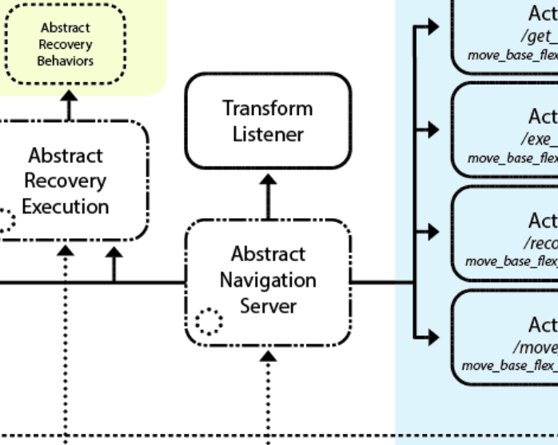
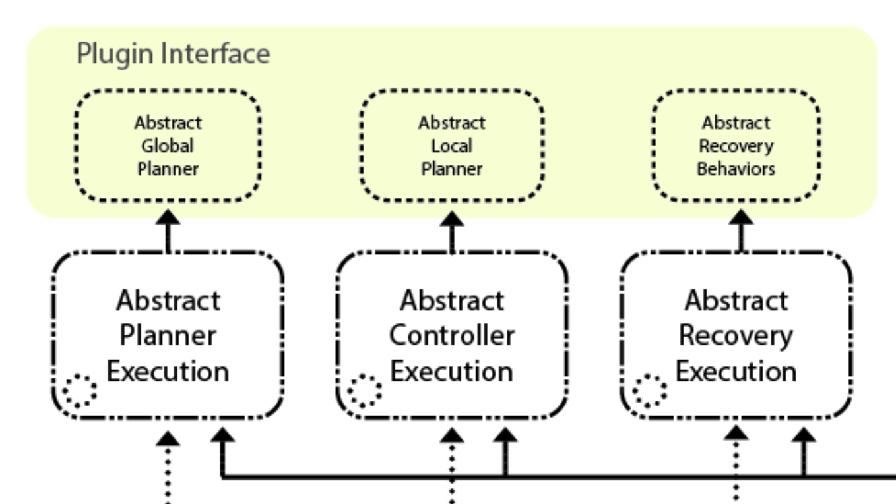

/wiki/planning/astar_planning_implementation_guide/
---
# Jekyll 'Front Matter' goes here. Most are set by default, and should NOT be
# overwritten except in special circumstances.
# You should set the date the article was last updated like this:
date: 2020-12-06 # YYYY-MM-DD
# This will be displayed at the bottom of the article
# You should set the article's title:
title: A* Implementation Guide
# The 'title' is automatically displayed at the top of the page
# and used in other parts of the site.
---
## Introduction
This wiki aims to serve as a brief introduction and implementation guideline for A* search, specifically applied to robot motion planning. This will discuss how the algorithm functions, important design aspects in the pipeline, common knobs to tune, and efficiency considerations. The specific guidance and notes will be mainly related to implementation for an Ackermann steered vehicle, but will be useful for abstracting to other systems as well.

A* search is just one of many algorithms that can be used for search, but note that grid-based search methods such as this are often limited in their effectiveness when used for higher DOF systems. For those problems, it would be worthwhile to consider sampling based planning methods instead.

These notes and guidance are augmented with heavy borrowing from and attribution to Maxim Likhachev’s 16-782 Planning and Decision Making in Robotics course, Fall 2020.

## Overview of A* Algorithm
A* is a popular search algorithm that is guaranteed to return an optimal path, and during its search for an optimal path, will provably expand the minimum number of states to guarantee optimality. Why is this useful? It allows for far less exploration, and in turn, less computation than a Dijkstra search, which is a greedy search algorithm.

### Important Terms
- g(s) value - cost of the shortest path from the start state (sstart) to the current state (s) so far
- h(s) value - estimate of the cost-to-go from the current state (s) to the goal state (sgoal)
- f(s) value - total estimated cost from the start state (sstart) to the goal state (sgoal)
- Admissibility - h(s) is an underestimate of the true cost to goal
- Monotonicity/Consistent - h(s) <= c(s,s’) + h(s’) for all successors s’ of s
- Optimality - no path exists from the start to the goal with a lower cost within the constraints of the problem

A* works by computing optimal g-values for all states along the search at any point in time.


## Planning Representation
When designing a planner, you first need to decide a few things about how your problem will be represented. Key questions:
- What states of your robot do you care about?
  - Examples: X-position, Y-position. Yaw-Pose, etc…
- What actions can your robot take?
  - Can it move in any directions unconstrained?
  - Are there non-holonomic constraints?
- How is your environment modeled?
- What is the starting configuration for your robot?
- Is the environment model static or can it change dynamically?
- How is cost represented in your problem?
  - Distance traveled by your robot?
  - Time taken from the start?
  - Proximity to specific areas within the map?
- What is your desired goal configuration?
  - Is it a specific X and Y location?
  - Is it a partial goal?
    - This means that only SOME of the states that are represented need to match a goal configuration for the goal condition to be satisfied

## Key Data Structures
Priority Queues
- Ordering items in the queue based on some value
    - Key for A* should be f(s)
    - Typically the items are class instances or structs that contain the state, parent, trajectory, g(s), c(s), and other information
    - The most efficient way to combine two sets of items into one priority queue is by merge sorting them independently and them merging the two priority queues ala merge sort
    - Can apply this process to the set of children generated from expanding a node

## Map Representation
#### Explicit:
- Pros:
  - Offline pre-generation allows for more efficient access during online planning
  - Simple to implement in data structures
- Cons:
  - Not practical for higher order planning problems, as the map can easily become too large to represent in memory

#### Implicit
- Pros:
  - More efficient for memory
- Cons:
  - Must be generated online, adding computation
  - More complicated implementation

## Heuristic Design
In general, for the best performance of your A* planner, you would leverage domain knowledge related to your specific use case to design a heuristic function. With a poor heuristic function, your planner can either waste time exploring extra states or find a sub-optimal solution to the goal. Also, you shouldn’t use the heuristic to bias the resulting plan, rather just to speed up the search process.

How does A* guarantee optimality when your heuristic is admissible and consistent? The search expands states in the order of f = g + h, which is assumed to be the estimated cost of an optimal path to the goal.

#####  Simple Heuristics (Mainly Used for Toy Problems):
- Euclidean Distance
- Diagonal/Chebychev Distance
- Manhattan Distance

#####  More Informed Heuristics:
- Create map of h-values using a backwards A* search on a lower dimensional representation of the environment, and assigning the calculated g-values as the cost-to-goal
  - Backwards A* swaps the start and goal configuration in the search
  - Lower dimensional search helps to ensure the heuristic is admissible, as it should always be an underestimate of cost-to-goal

##### Weighted Heuristic Search:
- Takes your heuristic estimate and applies a weight to it to bias your search towards the goal
- Often makes your heuristic inadmissible, which removes optimality guarantees, but can reduce search time immensely in some circumstances.

##### Final Notes of Heuristics:
As your planning problem becomes more complex (many local minima, high # of DOFs, etc) your heuristic function design choices quickly become the most important thing in your search, so spend time building and leveraging your knowledge of what the important factors are in a scenario when developing your heuristics.

## Motion Primitives for Ackermann Vehicles
Generating motion primitives for non-holonomic vehicles can be a computationally expensive task and especially when more demanding motion primitives are desired beyond setting constant control values nearly intractable in terms of online computation time. With this in mind it is best to pre-generate sets of motion primitives for different state values such as speed and steering angle. At the same time the footprint, or all locations the robot contacts the environment, throughout the trajectory of the motion primitive should be generated and can be used for online collision checking. The following are several design suggestions/design considerations for implementing motion primitive pregeneration for non-holonomic vehicles.

Some suggestions to keep in mind:
- Discretize angles and velocities at the start and end of the motion primitives
- Build in an efficient way to transform the motion primitive trajectory and footprint into the frame of the expanding state
- Best to have the footprint of the robot over the motion primitive pre-generated as well so only the checks need to be made
- Structured as a mask or list of cells relative to the expanding node frame
- Motion primitives are where the motion constraints should be applied ie only feasible motion primitives should be generated and used by the A* planner

## References
[1] Likhachev, Maxim. “A* Planning.” 16-782 Planning and Decision-making in Robotics. 2020, www.cs.cmu.edu/~maxim/classes/robotplanning_grad/lectures/astar_16782_fall20.pdf.


/wiki/planning/coverage-planning-implementation-guide/
---
# Jekyll 'Front Matter' goes here. Most are set by default, and should NOT be
# overwritten except in special circumstances. 
# You should set the date the article was last updated like this:
date: 2022-12-07 # YYYY-MM-DD
# This will be displayed at the bottom of the article
# You should set the article's title:
title: Coverage Planner Implementation Guide
# The 'title' is automatically displayed at the top of the page
# and used in other parts of the site.
---
This wiki details how to implement a basic coverage planner, which can be used for generating paths such that a robot can cover a region with a sensor or end-effector. 

## Introduction to Coverage Planning
 The goal of coverage planning is to generate a path such that a robot sweeps every part of some area with one of its sensors and/or end-effectors. One common example where you would need a coverage planner is for drone monitoring applications, where you need the drone to follow a path such that its cameras get a view of every part of some larger field/area. Another example would be a robot lawnmower or vacuum, where we want the robot to move such that it mows or vacuums every square meter of some field or room. 
 
 In this guide, we will be focusing on a cellular-decomposition based coverage planner. This type of coverage planner first splits the region to cover into simpler cells whose coverage paths are easy to generate. We then plan a cell traversal, and the robot goes from cell to cell, covering each simpler cell, until all cells, and thus the entire region, have been covered. There are other coverage planner methods. For example, grid-based coverage planning methods would decompose the region into an occupancy grid map, and then use graph algorithms to ensure the robot covers each grid cell. However, these other types of coverage planners are out of the scope of this simple tutorial. Interested readers are recommended to check out the survey on coverage planning listed below in the Further Reading section for more information on other forms of coverage planners.

## High Level Architecture of Coverage Planner
 Before we dive into the small details of this coverage planner, we will first look at the high level architecture of the coverage planner we will be designing. The image below shows the three main steps. 

 

 The input to the coverage planner is the region we want to generate the coverage plan for. We will represent our region of interest as an outer polygon with a set of polygonal holes. The holes represent areas within the overall outer polygon that we don't want to cover. For instance, in a robotic lawnmowing application, holes could represent gardens in the middle of the lawn that we don't want to mow. Similarly, in a drone wildfire-monitoring application, holes might represent lakes, which would not have any fire, and so you would not want to spend time monitoring them. The outer polygon as well as polygonal holes each are represented as lists of vertices, with each vertex being an x,y coordinate pair.

 Once we have our input region, the first step is cellular decomposition, where we break up the complicated region of interest into simpler shapes which we call cells. In particular, we will perform trapezoidal decomposition, which forms trapezoidal cells. The intention for performing this decomposition is that we can use a simpler algorithm to generate coverage plans for the individual trapezoids, and we can then combine these coverage plans to form a coverage path for the entire region.

 The second step of the algorithm will be generating a cell traversal. This means determining which order to visit the trapezoidal cells. Once we have this order, then in the third step, we form the full coverage path. Starting at the first cell in the cell traversal, we iterate between covering the current cell with our simpler coverage planner and travelling to the next cell in the cell traversal. This final path should now cover the entire region of interest.

## Step 1: Forming a Trapezoidal Decomposition

 As mentioned above, the first step to our coverage planner will be decomposing the region of interest into simpler trapezoids. To perform this trapezoidal decomposition, we will use a vertical sweep line method. This involves "sweeping" a vertical line from left to right across the region. As the sweep line encounters events, which correspond to vertices, it processes them. We maintain a list of trapezoidal cells that are currently open, meaning that their right edge is unknown. Processing an event involves closing some open cells and opening new cells. Once the sweep line has made it past the right-most event, there should be no more open cells and the closed cells represent the full trapezoidal decomposition of the region. An example of such a trapezoidal decomposition from section 6.1 of the Principles of Robot Motion textbook is shown in the image below.

 

 Diving into more detail, the first step of trapezoidal decomposition is to convert the outer boundary and holes into a list of events. To do this, we need to discuss what an event is. Events correspond to vertices of the region of interest, but they also contain some additional information. In addition to the current vertex (the vertex that the event corresponds to), an event contains the previous vertex, the next vertex, and the event type. The previous vertex and next vertex refer to the two vertices directly connected to the current vertex via edges. In order to distinguish between the next and previous vertex, we will use the convention that as you traverse the edges of the outer boundary or a hole, the region of interest (area you care about covering) will be to your left. Thus, we will traverse the outer boundary in counter-clockwise order and traverse holes in clockwise order.

 The 6 different event types we will define are OPEN, CLOSE, IN, OUT, FLOOR, and CEILING events. A graphic displaying these 6 event types is shown below. 

 > We are currently assuming that all vertices have a unique x-component. We detail some steps to get around this assumption in the Dealing with Overlapping Vertices section below.

 This classification into different event types will be useful later as we process events, since each type will need to be processed differently.

 

 To generate the list of events, loop through the vertices of the outer boundary in CCW order and loop through the vertices of each hole in CW order. At each vertex, add a new event with its previous, current, and next vertex. To determine the event type, you need to examine the x and y components of the previous and next vertex. For example, if both the previous and next vertex have an x component to the left of the current vertex, the event is either an OUT or CLOSE event. Comparing the y coordinate of the previous and next vertex can then distinguish between these two event types. Similarly, if the previous and next vertex are both to the right of the current vertex, the event type is either OPEN or IN. Again, you can then compare the y coordinate of the previous and next vertex to distinguish them. If the previous vertex is to the left of the current vertex and the next vertex is to the right of the current vertex, the event type is FLOOR. Finally, if the previous vertex is to the right while the next vertex is to the left, the event type is CEILING. 

 While we can't literally sweep a vertical line across the region of interest, we can mimic this behavior by processing each event from left to right. Thus, once you have a list of events, you will have to sort them by their x-component. 

 As we iterate through this sorted list, we will maintain a list of open cells, closed cells, and current edges. Thinking back to the analogy of a sweep line being pulled from left to right across the region of interest, the open cells correspond to trapezoidal cells we are forming which the sweep line is currently intersecting. Closed cells would be trapezoidal cells completely to the left of the sweep line. Closed cells have a known right boundary, whereas open cells are defined as cells with an unknown right boundary. The process of closing a cell corresponds to the determination and setting of its right boundary. Finally, current edges represents all edges that the sweep line is intersecting. Overall, the function to process each event can be split into three different parts:

 1. Identify the floor and ceiling edges
 2. Open and close cells
 3. Update the current edges list

 The first step to processing an event is identifying the edges immediately above and below the current event. We call these edges the floor and ceiling edges. To find the floor and ceiling edges for an event, we loop through the list of current edges (edges being intersected by the sweep line). We find the vertical intersection point between the sweep line and each edge. The ceiling edge is chosen as the edge who's vertical intersection point is closest to the event while still being above the event. The floor is chosen similarly but must be below the event. 

 > Note: It is possible for an event to not have a floor or ceiling edge.

 The next step in processing an event is to open and close cells based on the event type. At OPEN events, we create a new open trapezoid. At CLOSE events, we close a trapezoid (add the right edge) without opening any new trapezoids. At FLOOR and CEILING events, we close one trapezoid and open a new one. At IN events, we close one trapezoid and open two new ones. Finally, at OUT events, we close two trapezoids and open a new one. 

 We can represent the trapezoidal cells as a floor edge, a ceiling edge, and a left and right boundary x value. This defines a trapezoid whose parallel sides are vertical. The right boundary x value is uninitialized for open cells. Closing a cell involves setting the right boundary x value. With this representation, new cells are opened with their floor and ceiling edges set to some mix from the following four edges: The floor edge below the event, the ceiling edge above the event, the edge between the event's current and next vertex, and the edge between the event's current and previous vertex. Additionally, cells contain a list of their neighbors, which will be used when generating a cell traversal. We add to this neighbor list both when we open and close the cell.

 The final step in processing an event is to update the current edges list. If the previous vertex is to the left of the event, remove the edge between the previous and current vertex. Similarly, remove the current to next vertex edge if the next vertex is to the left of the event. If the next or previous vertex is to the right of the event, add the corresponding edge to the current edges list. This ensures our current edges list stays up to date with all edges the sweep line is currently intersecting.

 The end result of this step is a set of closed trapezoidal cells, with each cell containing a list of neighboring cells. This defines a graph.

## Step 2: Generating a Cell Traversal

 The trapezoidal cells define an implicit graph via their neighbor lists. Once we have the trapezoidal cells, we need to determine a cell traversal. This is an order in which to visit each cell. An example (incomplete) cell traversal from section 6.1 of the Principles of Robot Motion textbook is shown below.

 

 There are lots of different ways to generate a cell traversal. For example, you could start from some random cell and perform depth-first search. You could use a greedy method where, from each cell, you go to the nearest unvisited cell. You could also use a more complex method such as using a TSP solver. 

 The output from this step should be an ordered list of cells to visit.
## Step 3: Synthesizing the Full Coverage Plan

 Once you have a cell traversal, you can form the full coverage plan. Starting at the first cell in the cell traversal, alternate between generating a coverage plan for the given cell, and generating a path to the next cell. The path to the next cell might be as simple as a straight line, assuming you do not care if the robot crosses over holes occasionally. To generate the cell coverage plan, we can simply generate a back-and-forth lawnmower pattern over the cell. This lawnmower pattern is easy to generate for our vertical trapezoids because each vertical pass and each horizontal stepover is guaranteed not to hit any obstacles/holes. Simply start at one corner of the trapezoid and alternate between performing a vertical pass to the other side of the trapeoid and performing a horizontal stepover along the top or bottom edge. 

 > The distance of the stepover should be close enough for there to be overlap in your sensor/end-effector, but not too close or else the coverage plan will not be as efficient

 By travelling and then covering each trapezoidal cell, the robot will eventually cover the entire region of interest.

## Dealing with Overlapping Vertices

 In the case where two vertices share the same x-coordinate, such an event would not fit into any of the 6 existing categories. To handle this case, events can be changed from having a one-to-one correspondence with vertices to now allowing one event to correspond to multiple vertices. Instead of having a single vertex of interest, you can group consecutive vertices with the same x-coordinate into a single event. Make sure to ensure that the next and previous vertex (shown as v_n+1 and v_n-1 in figure 1) have a distinct x-coordinate from this vertices of interest list. This change to the event allows you to still use the same 6 event types described above, but v_n, the current vertex, now becomes a list of vertices forming a vertical line rather than a single vertex. 

 Making this change to the event class is sufficient for handling the case where consecutive vertices in the same polygon have the same x-coordinate. Such is the case for shapes like rectangles. However, it does not handle the case where non-consecutive vertices in a polygon or vertices from two different polygons have the same x-coordinate. In such a case, we end up forming degenerate trapezoids with zero area, since, as we process the two events at the same x-coordinate, we end up opening and closing a trapezoid at the same x-coordinate. This results in trapezoids where the left and right vertical edges are at the same place. To fix this, you can create a function which, after trapezoidal decomposition is performed, removes degenerate trapezoids and connects all the neighbors for a given degenerate trapezoid together. With these two fixes, the coverage planner should be able able to generate coverage plans for any polygon with holes.
## Potential Optimizations

 In the coverage planner described above, our trapezoidal cells have vertical parallel sides, and we cover these cells with vertical passes up and down. However, performing vertical passes up and down may not be the most efficient way to cover a given region of interest. To improve the performance of the coverage planner, one potential optimization would be to try different rotations of the region of interest to see if there is some other orientation that results in a shorter coverage plan. You could consider checking a discrete set of equally-spaced rotation angles, as well as check the rotation angles corresponding to the angles of the longest edges in the region of interest. 

 A second optimization that could be performed is to use boustrophedon decomposition rather than trapezoidal decomposition. For readers interested in this, I recommend checking out the papers listed below in the Further Reading section.

## Summary
 Overall, coverage planning is useful for tasks that require scanning of an area by a robot. We have seen how we can generate such paths over complicated areas by first splitting the region into simpler trapezoidal cells, planning a traversal across those cells, and then using a simple back-and-forth lawnmower pattern to cover each trapezoid. With such an algorithm, we can have our robots plan paths to cover arbitrarily complex polygonal regions.

## See Also:
- [Planning Overview](https://roboticsknowledgebase.com/wiki/planning/planning-overview/)

## Further Reading
- [A Survey on Coverage Path Planning for Robotics](https://core.ac.uk/download/pdf/132555826.pdf)
- [Coverage Path Planning: The Boustrophedon Cellular Decomposition](https://asset-pdf.scinapse.io/prod/1590932131/1590932131.pdf)

## References
- H. Choset, K. M. Lynch, S. Hutchinson, G. A. Kantor, & W. Burgard, “Cell Decompositions” in Principles of Robot Motion, Cambridge, MA, USA: MIT Press 2005, ch. 6, sec. 1, pp. 161–167.


/wiki/planning/frenet-frame-planning/
---
# Jekyll 'Front Matter' goes here. Most are set by default, and should NOT be
# overwritten except in special circumstances. 
# You should set the date the article was last updated like this:
date: 2022-12-09 # YYYY-MM-DD
# This will be displayed at the bottom of the article
# You should set the article's title:
title: Trajectory Planning in the Frenet Space
# The 'title' is automatically displayed at the top of the page
# and used in other parts of the site.
---


The Frenet frame (also called the moving trihedron or Frenet trihedron) along a curve is a moving (right-handed) coordinate system determined by the tangent line and curvature. The frame, which locally describes one point on a curve, changes orientation along the length of the curve.

There are many ways to plan a trajectory for a robot. A trajectory can be seen as a set of time ordered state vectors x. The Frenet frame algorithm introduces a way to plan trajectories to maneuver a mobile robot in a 2D plane. It is specifically useful for structured environments, like highways, where a rough path, referred to as reference, is available a priori.

## Trajectory Planning in the Frenet Space

There are many ways to plan a trajectory for a robot. A trajectory can be seen as a set of time ordered state vectors x. The following algorithm introduces a way to plan trajectories to maneuver a mobile robot in a 2D plane. It is specifically useful for structured environments, like highways, where a rough path, referred to as reference, is available a priori.

The Frenet frame (also called the moving trihedron or Frenet trihedron) along a curve is a moving (right-handed) coordinate system determined by the tangent line and curvature. The frame, which locally describes one point on a curve, changes orientation along the length of the curve.

More formally, the Frenet frame of a curve at a point is a triplet of three mutually [orthogonal](https://www.statisticshowto.com/orthogonal-functions/#definition) unit vectors {T, N, B}. In three-dimensions, the Frenet frame consists of [1]:
The unit tangent vector T, which is the [unit vector](https://www.statisticshowto.com/tangent-vector-velocity/) in the direction of what is being modeled (like velocity),
The [unit normal] (https://www.statisticshowto.com/unit-normal-vector/) N: the direction where the curve is turning. We can get the normal by taking the [derivative](https://www.statisticshowto.com/differentiate-definition/) of the tangent then dividing by its length. You can think of the normal as being the place the curve sits in [2].
The unit binormal B = T x N, which is the cross product of the unit tangent and unit normal.

The tangent and normal unit vectors span a plane called the osculating plane at F(s). In four-dimensions, the Frenet frame contains an additional vector, the trinormal unit vector [3]. While vectors have no [origin](https://www.statisticshowto.com/calculus-definitions/cartesian-plane-quadrants-ordinate-abscissa/#origin) in space, it’s traditional with Frenet frames to think of the vectors as radiating from the point of interest.

More details:[here](https://fjp.at/posts/optimal-frenet/#trajectory-planning-in-the-frenet-space)

## Algorithm

1. Determine the trajectory start state [x1,x2,θ,κ,v,a]
The trajectory start state is obtained by evaluating the previously calculated trajectory at the prospective start state (low-level-stabilization). At system initialization and after reinitialization, the current vehicle position is used instead (high-level-stabilization).
2. Selection of the lateral mode 
Depending on the velocity v the time based (d(t)) or running length / arc length based (d(s)) lateral planning mode is activated. By projecting the start state onto the reference curve the the longitudinal start position s(0) is determined. The frenet state vector [s,s˙,s¨,d,d′,d′′](0) can be determined using the frenet transformation. For the time based lateral planning mode, [d˙,d¨](0)
need to be calculated.
3. Generating the lateral and longitudinal trajectories 
Trajectories including their costs are generated for the lateral (mode dependent) as well as the longitudinal motion (velocity keeping, vehicle following / distance keeping) in the frenet space. In this stage, trajectories with high lateral accelerations with respect to the reference path can be neglected to improve the computational performance.
4. Combining lateral and longitudinal trajectories 
Summing the partial costs of lateral and longitudinal costs using J(d(t),s(t))=Jd(d(t))+ks⋅Js(s(t))
, for all active longitudinal mode every longitudinal trajectory is combined with every lateral trajectory and transformed back to world coordinates using the reference path. The trajectories are verified if they obey physical driving limits by subsequent point wise evaluation of curvature and acceleration. This leads to a set of potentially drivable maneuvers of a specific mode in world coordinates.
5. Static and dynamic collision check 
Every trajectory set is evaluated with increasing total costs if static and dynamic collisions are avoided. The trajectory with the lowest cost is then selected.
6. Longitudinal mode alternation 
Using the sign based (in the beginning) jerk a(0),  the trajectory with the strongest decceleration or the trajectory which accelerates the least respectivel

“Frenet Coordinates”, are a way of representing position on a road in a more intuitive way than traditional (x,y) Cartesian Coordinates.
With Frenet coordinates, we use the variables s and d to describe a vehicle’s position on the road or a reference path. The s coordinate represents distance along the road (also known as longitudinal displacement) and the d coordinate represents side-to-side position on the road (relative to the reference path), and is also known as lateral displacement.
In the following sections the advantages and disadvantages of Frenet coordinates are compared to the Cartesian coordinates.


##Frenet Features

The image below[frenet path] depicts a curvy road with a Cartesian coordinate system laid on top of it, as well as a curved (continuously curved) reference path (for example the middle of the road).

The next image shows the same reference path together with its Frenet coordinates.

The s coordinate represents the run length and starts with s = 0 at the beginning of the reference path. Lateral positions relative to the reference path are are represented with the d coordinate. Positions on the reference path are represented with d = 0. d is positive to the left of the reference path and negative on the right of it, although this depends on the convention used for the local reference frame.
The image above[frenet path] shows that curved reference paths (such as curvy roads) are represented as straight lines on the s axis in Frenet coordinates. However, motions that do not follow the reference path exactly result in non straight motions in Frenet coordinates. Instead such motions result in an offset from the reference path and therefore the s axis, which is described with the d coordinate. The following image shows the two different representations (Cartesian vs Frenet)
To use Frenet coordinates it is required to have a continouosly smooth reference path.
The s coordinate represents the run length and starts with s = 0 at the beginning of the reference path. Lateral positions relative to the reference path are are represented with the d coordinate. Positions on the reference path are represented with d = 0. d is positive to the left of the reference path and negative on the right of it, although this depends on the convention used for the local reference frame.
The image above shows that curved reference paths (such as curvy roads) are represented as straight lines on the s axis in Frenet coordinates. However, motions that do not follow the reference path exactly result in non straight motions in Frenet coordinates. Instead such motions result in an offset from the reference path and therefore the s axis, which is described with the d coordinate. The following image shows the two different representations (Cartesian vs Frenet)

## Reference Path 

Frenet coordinates provide a mathematically simpler representation of a reference path, because its run length is described with the s axis. This reference path provides a rough reference to follow an arbitrary but curvature continuous course of the road. To avoid collisions, the planner must take care of other objects in the environment, either static or dynamic. Such objects are usually not avoided by the reference path.

A reference path can be represented in two different forms although for all representations a run length information, which represents the s axis, is required for the transformation.

1. Polynome
2. Spline (multiple polynomes)
3. Clothoid (special polynome)
4. Polyline (single points with run length information)

Clothoid
					x(l)=c0+c1∗l


Polyline

## Transformation
The transformation from local vehicle coordinates to Frenet coordinates is based on the relations.
Given a point PC in the vehicle frame search for the closest point RC on the reference path. The run length of RC, which is known from the reference path points, determins the s coordinate of the transformed point PF. If the reference path is sufficiently smooth (continuously differentiable) then the vector PR→ is orthogonal to the reference path at the point RC. The signed length of PR→ determines the d coordinate of PF. The sign is positive, if PC

lies on the left along the run lenght of the reference path.

The procedure to transform a point PF
from Frenet coordinates to the local vehicle frame in Cartesian coordinates is analogous. First, the point RC, which lies on the reference path at run length s. Next, a normal unit vector d⃗  is determined, which, in this point, is orthogonal to the reference path. The direction of this vector points towards positive d values and therefore points to the left with increasing run length s. Therefore, the vector d⃗  depends on the run length, which leads to:
				PC(s,d)=RC(s)+d⋅d⃗ (s)(2)


#### Images and Video
Images and embedded video are supported.


## Summary

The given article describes in detail what is Frenet Frame and how robot motion planning is done. The importance and relevance of frenet frame with path planning in systems engineering is also highlighted in the given article. 


## Further Reading

[https://fjp.at/posts/optimal-frenet/#frenet-coordinates](Frenet Cordinates)
[https://www.mathworks.com/help/nav/ug/highway-trajectory-planning-using-frenet.html](Highway Trajectory Planning Using Frenet Reference Path)
[https://www.researchgate.net/publication/224156269_Optimal_Trajectory_Generation_for_Dynamic_Street_Scenarios_in_a_Frenet_Frame](Optimal Trajectory Generation for Dynamic Street Scenarios in a Frenet Frame)


## References

[https://fjp.at/posts/optimal-frenet/#frenet-coordinates](Frenet Frame)


/wiki/planning/move_base_flex/
---
# Jekyll 'Front Matter' goes here. Most are set by default, and should NOT be
# overwritten except in special circumstances. 
# You should set the date the article was last updated like this:
date: 2023-04-29 # YYYY-MM-DD
# This will be displayed at the bottom of the article
# You should set the article's title:
title: Move Base Flex
# The 'title' is automatically displayed at the top of the page
# and used in other parts of the site.
---
<!-- This template acts as a tutorial on writing articles for the Robotics Knowledgebase. In it we will cover article structure, basic syntax, and other useful hints. Every tutorial and article should start with a proper introduction.

This goes above the first subheading. The first 100 words are used as an excerpt on the Wiki's Index. No images, HTML, or special formating should be used in this section as it won't be displayed properly.

If you're writing a tutorial, use this section to specify what the reader will be able to accomplish and the tools you will be using. If you're writing an article, this section should be used to encapsulate the topic covered. Use Wikipedia for inspiration on how to write a proper introduction to a topic.

In both cases, tell them what you're going to say, use the sections below to say it, then summarize at the end (with suggestions for further study). -->

## Introduction

[MBF](http://wiki.ros.org/move_base_flex) is a navigation stack that is an extension of the Move Base navigation stack, with many great features. The package allows us to load/unload planners and controllers on the fly easily and even run multiple planning algorithms concurrently. The code base is highly flexible and modular. It is an improvement over the original move base navigation package, which only allows 2D costmaps and does not allow easy modification of the execution behavior of the navigation stack.

This package handles all the interactions between the planner, the controller (what they call their local planner), and recovery behaviors. Also, it provides action servers for sending and keeping track of goals. These are supposed to be implemented as classes and are dynamically loaded/unloaded in the memory using the ROS plugin library [1].

> If you only need a work navigation stack on your robot that can give velocity commands and works in a 2D Space, this article IS NOT for you. You are better off using Move Base on your robot. This article is only of help if you want to use other map representations (like 2.5D or 3D maps) or write a custom planner of your own. 

## Move Base Flex Architecture

This is what the architecture of MBF looks like: 


The parts above the dotted line are the abstract classes and their interactions between them. These abstract classes are what you have to implement to get MBF to work. After doing this, you can write a simple node that instantiates the navigation server class you implemented, and your navigation stack is ready to be used on the robot. 

### Plugin classes


These classes are dynamically loaded at runtime by the navigation server (detailed below) using ROS pluginlib, and do the high-level planning, low-level planning, and recovery behaviors. These classes are purely abstract. You have to make your global planner, local planner, and recovery classes inherit from these classes and implement the pure virtual functions of these classes. You can look at the header files in the *mbf_abstract_core* package in the MBF repository to find more information on the methods that you must implement.

### The abstract navigation server class


This class is the main class that runs the entire navigation stack and handles the loading, initialization, and interaction of the plugin classes mentioned above. The abstract_navigation_server is also a pure abstract class. You have to make your navigation server class inherit from the abstract_navigation_server and implement the pure virtual functions of these classes. You can look at `abstract_navigation_server.h` in the *mbf_abstraction_nav* package to get more information on what methods you must implement. Note here that, unlike the plugin classes, you don't need to re-implement all the functions of the abstract navigation server, just the pure virtual ones. However, you can re-implement any of those functions as well if you want to change the execution of those functions.


### The abstract execution classes


There are abstract classes for controlling the planner, controller, and recovery execution, but these are not pure abstract classes, and MBF has already implemented their functions. However, you may want to change how your planner, controller, and recovery behaviors execute and tie in with your navigation server. In that case, you can inherit from these classes and implement the functions you want to change. You can look at the `abstract_planner_execution.h`, `abstract_controller_execution.h`, and `abstract_recovery_execution.h` in the *mbf_abstract_nav* package to get more information on the functions. 


## Implementing your navigation stack using MBF

As mentioned above, you must implement the plugin classes, the navigation server, and (optionally) the execution classes. This wiki will teach you to implement the bare minimum for a working navigation stack (i.e., the plugin classes and navigation server). Read on to find out how to implement these.

### The Planner class
The planner class serves as the global planner for the robot. MBF runs the code of this class only once when the robot receives a goal point or once more after the robot executes a recovery behavior. The job of this class is to generate a path through the environment, given the original location of the robot and the goal point location.

The planner class, at the bare minimum, only has to have two functions:

- makePlan
- cancel

#### makePlan
This function makes the plan and puts it in a vector of geometry_msgs:PoseStamped. It also has an integer return type, and you must return a code depending on how the planning worked. There are a bunch of error codes that you can return that MBF understands, and it would take care of handling that. There are a bunch of non-MBF codes as well that you can return, which MBF will communicate to the user. However, if you want to do something specific for those error codes, write your own implementation of planner_execution class. To know more about the input parameters and the error codes that need to be returned, refer to `abstract_planner.h` file, which has all inputs and output codes documented.

#### cancel
This is a function that can help you cancel the execution of the makePlan function. You can return false if you do not want to implement a cancellation function or if the cancellation fails for whatever reason. You would use this function (usually) by setting some variables in your planner class, which you would be reading in a computationally expensive loop in your makePlan function. Keep checking the variables in each iteration of the loop. If a cancellation is requested, you just exit the loop and call it a day. But feel free to do anything you want.

### The Controller Class
The name "Controller" might be a misnomer since here, the "Controller" also serves the function of the local planner. Fundamentally, the controller's job is to take the plan generated by the planner class and publish velocity commands that help the robot traverse that plan. It has to function as the local planner, keeping track of obstacles and collisions, and also as the high-level controller, generating velocity commands for the robot to follow. 

The Controller Class, at the bare minimum, has to have the following four functions:

- setPlan
- computeVelocityCommands
- isGoalReached
- cancel

#### setPlan
This function gets the global plan from the global planner (in the form of a vector of geometry_msgs:PoseStamped mentioned earlier). You return true if you have successfully set the plan for your controller and can follow it, and false if you couldn't because the plan is infeasible or whatever the reason might be.

#### computeVelocityCommands
This function is like a simple feedback loop that you can use to make your robot follow a trajectory. It gets the robot's current position and velocity, and the function's job is to generate a command velocity for the robot, which you then need to put in the geometry_msgs::TwistStamped variable. The return types are integer codes again, which you can return to specify how the execution of the controller loop went. To know more about the input parameters and the error codes you can return, refer to the `abstract_controller.h` file, which has all inputs and output codes documented. However, there is one thing you need to note here, the code for SUCCESS means that the function executed successfully, not the fact the robot reached the goal.

#### isGoalReached
Checking whether the robot has reached its goal is the job of this function. It gets an angle tolerance and distance tolerance as inputs; you can use that to determine whether the robot has reached the goal.

#### cancel
This function is similar to the cancel function of the planner, with one crucial difference: The controller loop does NOT stop if the cancel function is called, as it might not be safe to stop the controller loop midway during execution. Hence MBF doesn't stop the controller loop. So even after cancel is called, the computeVelocityCommands function keeps being called in the loop. However, it is just used to tell the Controller class to abandon the current plan and come to a safe stop. After coming to a safe stop, the computeVelocityCommands function can then return the error code for CANCELLED to signify that the execution of the plan is canceled successfully.

### The Recovery Class
The recovery behaviors go in this class. This behavior runs if the planner cannot generate a plan or a controller cannot follow the trajectory. You could do several things, like clearing the maps you have, making the robot retreat a few steps, rotating in place, etc. 

The recovery class, at the bare minimum, has to have the following four functions implemented:
- runBehavior
- cancel

#### runBehavior
This function runs the recovery behavior. You can put comments about the execution of the recovery behaviors in the message variable passed as an argument. It returns an integer that signifies its outcome. You can return whatever you want here; there is no standardized code here. 

#### cancel
This function cancels the execution of the runBehavior function. You can return false if you do not want to implement a cancellation function or if the cancellation fails for whatever reason. Otherwise, you can return true and cancel the runBehavior function, similar to how you cancel the controller's execution, ensuring the robot stops safely. 

### The Navigation server class

The Navigation Server class is the main class that manages the entire execution of the Move Base Flex Navigation Stack. The key components of the MBF Navigation Server are:

- TF stuff: 
The ROS TF2 library is also an integral part of the MBF framework, which uses it to keep track of goal positions and frames. You don't need to worry much about this; you only need to initialize a TF listener and pass it to the constructor, and MBF handles the rest.

- Action Servers and Variables: The MBF exposes action servers that allow the user to provide goal commands and track the execution of those goal commands. Again, MBG manages this entirely; you don't need to write any code for the action server.

- Plugin Managers: The navigation server has plugin managers that manage the planner, controller, and recovery behavior classes. The plugin manager ensures that the plugins load and initialize correctly and stores multiple planners, controllers, and recovery behaviors. MBF already has the code for plugin managers. However, you must provide it with functions that load and initialize each plugin.

- Plugin Loaders: This is not strictly a part of MBF, but it is the recommended way of loading the planner, controller, and recovery classes. That is how they have implemented it in their costmap_navigation package (which is just an implementation of MBF that uses costmap2D and is backward compatible with move_base plugins). Plugin loaders are a part of the ROS Pluginlib, which allows you to dynamically load and unload classes derived from a common base class. You can use whatever you like (you can even declare the classes in the navigation server class stack and pass its pointer, too) in place of this method.

#### How the navigation server constructor runs

The base class constructor does the following-
- Initializes the planner, controller, and recovery behavior plugin managers. Most importantly, it gives the plugin managers the functions that load and initialize each plugin properly.
- Initializes many TF variables and parameters like global and robot frames.
- Initializes the action server variables.
- Advertises some topics for publishing velocity commands and the current goal.
- Initializes the action server with the variables and also binds functions that are called whenever the action server gets a command.
- You would implement the constructor of the derived class. You can put all the stuff you need to use to run the navigation server (like some extra parameters to load or topics you need to subscribe to). But, at the bare minimum, the constructor has to do two things-

  - call the function initializeServerComponents(). MBF has already implemented this function; you just need to call it in your derived class constructor. This function uses your plugin managers to load the planner, controller, and recovery behavior plugins.
  - call the function startActionServers(). MBF has already implemented this function as well; you just need to call it in your derived class constructor. The job of this function is to start all the action servers, which will then begin receiving goal commands.
  - call the function initializeServerComponents(). This function calls each plugin manager's load function, which reads the planner names from the ros parameter server, and then calls the load and init function you implemented in your navigation server. 
  
So, you have to implement these functions for initializeServerComponents to work-

- loadPlannerPlugin
- initializePlannerPlugin
- loadControllerPlugin
- initializeControllerPlugin
- loadRecoveryPlugin
- initializeRecoveryPlugin


An example code has been provided below. Let's try to understand whatever is going on here.

```
mbf_abstract_core::AbstractPlanner::Ptr ExperimentalNavigationServer::loadPlannerPlugin(const std::string& planner_type)
{
  mbf_abstract_core::AbstractPlanner::Ptr planner_ptr = NULL;
  try
  {
    planner_ptr = boost::static_pointer_cast<mbf_abstract_core::AbstractPlanner>(
        planner_plugin_loader_.createInstance(planner_type));

    std::string planner_name = planner_plugin_loader_.getName(planner_type);
    ROS_DEBUG_STREAM("mbf_costmap_core-based planner plugin " << planner_name << " loaded.");
  }
  catch (const pluginlib::PluginlibException &ex_mbf_core)
  {
    ROS_DEBUG_STREAM("Failed to load the " << planner_type << " planner." << ex_mbf_core.what());
  }

  return planner_ptr;
}

bool ExperimentalNavigationServer::initializePlannerPlugin(const std::string& name,
                                                           const mbf_abstract_core::AbstractPlanner::Ptr& planner_ptr)
{
  std::cout << "Dummy Planner plugin initialized\n\n";
  return true;
}
```

As you can see from the return type, the job of this function is to load a planner plugin and return its pointer. The main magic is happening in the statement- `boost::static_pointer_cast<mbf_abstract_core::AbstractPlanner>( planner_plugin_loader_.createInstance(planner_type));`

The createInstance function takes in a string planner_type (already loaded from the parameter server and passed onto the loadPlannerPlugin function), loads the requisite plugin, and returns its pointer. The rest of the code is just to give some info if the loading of the plugin fails. In the same way, you have to write the loadControllerPlugin and the loadRecoveryPlugin. As said before, you don't need to use ROS pluginlib to do this. You can statically allocate a planner object and return its pointer as well. But this is the recommended way to maintain the codebase's modularity.

The initialize plugin functions like initializePlannerPlugin, initializeControllerPlugin, initializeRecoveryPlugin should have the code required to initialize your planner, controller, and recovery plugin properly. You may need to set a few variables/parameters. You may need to initialize a map representation. You can do all of that here. Return true or false depending on whether the initialization passed or failed.

If you don't need to do that, you can simply return true without doing anything. This is what is done in the example code shown above.

startActionServers() function
This function starts all the action servers. You don't need to implement anything for it to work, just calling it in the constructor is enough.

> In short, to make your navigation server class work, at the bare minimum, you need to implement the above functions
and call the initializeServerComponents and startActionServer functions in the constructor.

There are a lot of virtual functions in the abstract navigation server that you can override with your own implementations if you wish to have more control over and modify the execution of the navigation server. Feel free to explore those functions in the `abstract_navigation_server.h` and `abstract_navigation_server.cpp` files.

## Summary
In summary, you need to implement the following to get your own MBF navigation stack working:

- [Planner](#the-planner-class) class (derived from AbstractPlanner in `abstract_planner.h`)
  - setPlan
  - computeVelocityCommands
  - isGoalReached
  - cancel
- [Controller](#the-controller-class) class (derived from AbstractController in `abstract_controller.h`)
  - runBehavior
  - cancel
- [Recovery](#the-recovery-class) class (derived from AbstractRecovery in `abstract_recovery.h`)
  - runBehavior
  - cancel
- [Navigation Server](#the-navigation-server-class) class (derived from AbstractNavigationServer in `abstract_navigation_server.h`)
  - loadPlannerPlugin
  - initializePlannerPlugin
  - loadControllerPlugin
  - initializeControllerPlugin
  - loadRecoveryPlugin
  - initializeRecoveryPlugin
  - Constructor


## See Also:
- [Planning Overview](./planning-overview.md) - For an overview of planning algorithms, which you can implement as an MBF plugin.

## Further Reading
- Check out [Navigation2](https://github.com/ros-planning/navigation2), the Move Base/Move Base Flex port to ROS2. If you are using ROS2, this is what you should be using. This library's [documentation](https://navigation.ros.org/) is also excellent.

## References
- [1] Magazino. 2017. move_base_flex https://github.com/magazino/move_base_flex (2023)
- [2] S. Pütz, J. S. Simón, and J. Hertzberg, "Move Base Flex: A Highly Flexible Navigation Framework for Mobile Robots", presented at the 2018 IEEE/RSJ Int. Conf. Intelligent Robots and Systems (IROS), Madrid, Spain, Oct. 1-5, 2018


/wiki/planning/multi-robot-planning/
---
date: 2022-12-09
title: Multi Robot Navigation Stack Design
published: true
---
This article aims to present two competing approaches for multi robot navigation. There is a brief introduction on multi robot navigation followed by description, pros and cons of each of the two competing methods.

A multi robot navigation stack enables groups of robots to traverse around each other and navigate from their start positions to their goal locations without colliding with one another, crowding or slowing each other down. Usually the inputs to the stack are start and goal positions of each robot and some representation of the environment. Outputs of this stack are usually velocity commands that the robots can execute.

There are briefly two families of algorithms that are usually employed :
- Centralised 
- Decentalised

The choice for the above usually depends on the communication range and reliability. With good communication, a centalised method is usually more preferable and easier to get to work than a decentralised one. The scope of this article is restricted to the centralised family of algorithms.

Centralised family of algorithms can be further subdivided into two classes of approaches
- Planning based approach
- Control based approach

## Navigation Stack Design 1 : [Planning based approach](https://www.youtube.com/watch?v=K1_bagcw8Gc&themeRefresh=1)
In a planning based approach, we design and implement a centralised multi robot planner which calculates collision free trajectories for each robot in the fleet and then these are executed by each robot with a decentralised controller.


### Centralised Planner : [Prioritised Collaborative A*](https://github.com/MRSD-Team-RoboSAR/robosar_navigation)

As seen in the block diagram, most of the navigation stack runs on a centralised server apart from a low level speed controller running on the robot agents. We have a 3D Graph data structure which underneath uses a costmap to store the structure of the environment and provides a planning representation for our planner. The Planner uses this graph data structure to plan trajectories in x,y and time for each robot and then feeds these trajectories to a multi-threaded controller. The multi-threaded controller uses a classic pure pursuit formulation to generate command velocities to enable accurate tracking of the generated trajectories. The velocities are
then passed to the fleet management system which transmits them to the right agents for actual execution. 
At a high level the prioritized multi A* performs these steps in a loop to perform its task : 
```
- Assign priorities to the robot 
- for robots 1:n in order of priority 
	- Get start and goal for this robot 
	- Run A* graph search algorithm 
	- Treat previously planned robots as moving obstacles 
	- If path found, add this path to cache 
	- If path not found try again later after other robots 
```


The planner is built on top of a 3D graph which consists of nodes in x,y and time. The graph handles all the nearest neighbor searches, collision checks, distance queries and other utility functions for the planner. The graph uses a cost map of the environment to do its collision checks. The costmap inflates all the obstacles in the occupancy grid map and also assigns some cost to neutral motion to encourage planner to take the shortest paths. It also uses cached trajectories of other robots while doing the collision checks so that robots have collision free trajectories in time. The planner currently uses a manhattan distance heuristic to estimate the cost to goal. All set and map data structures are optimized using a custom 3D hash function and have an O(1) lookup time. Priorities are currently assigned to the robots arbitrary before planning and then planning is done sequentially. This is something that can be improved! An interesting finding is about relative cost of waiting in time as against moving. We found that if both moving as well as waiting have the same cost, then A* almost always prefer moving than waiting which can lead to suboptimal behavior. So as of now we have lower cost to waiting than moving which gives us better paths leads to increased search times which is undesirable. We found the paths to be very suboptimal in a 4 connected grid so we use an 8 connected grid which gives very good results but obviously also contributes to our increased search times. 


### Decentralised controller : [LGController](https://github.com/MRSD-Team-RoboSAR/robosar_controller)

Our trajectories in time include some pauses/stops along the way for avoiding collisions with other robots, so an off the shelf controller in 2D which ignores the time dimension was not going to work. So we came up with the LGController which borrows ideas from multiple different control schemes to help meet our requirements. Roughly the controller has the following components 

#### Preprocessing
- Reorient robot in the direction of the path upon entry 
- Go through the trajectory and push waypoints with a stop to a goal queue 
- Run a timer in the background to select waypoints along the trajectory 
- Create a 2D cartesian path from the 3D trajectory for pure pursuit 

#### During control 
- Compare waypoints with points in the goal queue and decide linear velocity 
- Use lookahead distance to find waypoint to track along the cartesian path 
- Use pure pursuit to generate angular corrections based on this waypoint 

We wrote a ROS action server to wrap this controller and use it with the rest of the subsystems. So during operation we have a LGController action server running per robot. So we can say that the planning is centralized but the control is completely decentralised. 


Once the planner and the controller were ready, there was a need to integrate them with the rest of the system. For this we wrote the Mission Executive class. Mission Executive does a lot of things during the operation. The first thing it is incharge of is asking the latest fleet information from the fleet management system and then setting up the controller servers for each robot in the fleet. It also listens for any changes in the fleet from the FMS and takes appropriate action based on it. It listens to tasks from the task allocation subsystem and is in charge of executing this mission. It first runs the planner on the tasks received from the task allocation. If planning was successful then the mission executive creates a ROS action client for each successful plan and then sends the planned trajectory to the appropriate controller server for execution. Then the mission executive also monitors the execution of the controller and gets ready for a new mission as soon as the controllers are done executing.

### Takeaways 

1. The Prioritised Multi A* as we know it does not guarantee completeness. Our naive heuristic also fails in very highly cluttered environments because instead of going around obstacles it can tend to wait around and hope for static obstacles to go away. So planning takes a long time. Some directions that can be considered for improving this :
	-  Use a Voronoi Graph instead of a densely connected 3D grid for planning 
	- Replace manhattan distance using a more realistic true distance heuristic function 
    - Use motion primitives with the planner instead of an 8 connected grid 
2. We found that without using the right motion primitives, robots deviate from the planned trajectories and then planning is wasted, so the planner should closely model kinematics of the robot, continous replanning at a fixed frequence could be used to alleiviate this problem
3. The controller that we implemented was a pretty basic proportional controller and it was unable to account for the execution errors
4. This Navigation stack design is appropriate for confined spaces when robots are large but operating area is narrow or robots are moving on a fixed grid, for our application we found this to not work as well as required


## Navigation Stack Design 2 : [Control based approach](https://www.youtube.com/watch?v=W_IN25bHFkQ)
In a control based approach, we plan for each robot in the fleet separately and local collision avoidance between the robot is done by a centralised controller.


### Decentralised Planner : [2D A* planner](https://github.com/MRSD-Team-RoboSAR/robosar_navigation)
Nothing fancy here, as the name suggests we are just using a 2D Astar planner for each start-goal pair which outputs a collision free path for each robot only with respect to the occupancy grid map of the environment (does not guarantee robot-robot collision avoidance). Most of the magic is happening in the centralised controller discussed next.

### Centralised Controller : [Lazy Traffic Controller](https://github.com/MRSD-Team-RoboSAR/robosar_navigation)
The Lazy Traffic controller takes in the paths from the decentralised planner and is responsible for local robot-robot collision avoidance by calculating collision free velocities for each robot. It consists mainly of two parts
- Velocity obstacles based velocity calculation
- Inter robot repulsion

At high level the basic principle is to not do extensive collision checking or planning unless explicitly required due to an immediate impending collision. How we do this is by enforcing a narrow neighborhood around each robot and doing local collision avoidance to avoid collisions in this neighborhood. This gives the controller its ‘laziness’. This local collision avoidance is implemented using the velocity obstacles algorithm. For each agent, all other agents act as obstacles in the velocity space and hence invalidate a set of velocities that this agent can execute. Velocity obstacles tries to select the best velocity as close to the preferred velocity as possible from the set of valid velocities. Preferred velocity is calculated for each agent from the global A* path found by the planner. Staying on this A* path is the preferred thing to do unless otherwise ruled out due to obstacles. 


The lazy traffic controller has many interfaces with a lot of subsystems. The LT controller talks to the fleet management system to receive updates on the status of the fleet. It talks to the SLAM subsystem to receive the latest map of the environment. It also takes the pose for each agent from the transformation tree. It advertises a controller service which is used by the Mission Executive to actually send the list of agents and their planned paths for execution by the controller. Last but not least, it advertises the controller status of each robot, so that the task allocator can assign new tasks once old ones are completed! 
Pseudocode for the LT controller can be written as : 
	- Loop through all the agents 1-n: 
		- Get path from the decentralised planner
		- Get pose from the transformation tree 
		- Calculate preferred velocity for this robot 
		- Calculate neighbouring agents for this robot
			- If any neighbours inside neighbourhood: 
				- Calculate safe velocity using velocity obstacles technique 
			- Else: 
				- Keep preferred velocity unchanged. 
        - Modify velocity using interrobot repulsion if another neighbour within repulsion radius
        
 


### Takeaways
1. This design works really well when robots have unconstrained motion around each other in 2D and robots are small in size compared to the free space around them!
2. The controller frequency had to be tuned based on the execution frequency on the robots. The execution frequency for us is around 10Hz on each robot (this is the frequency at which velocities are set on the motors). In conjunction with this we found 5Hz to be a good frequency to run the controller. So every 20ms the controller is invoked, a neighborhood and the preferred velocity is calculated and then the velocity obstacles velocity is sent to the robots. 
3. Another thing we realised was that our differential drive robots were not instantaneously achieving the velocities we were sending them, hence the velocity obstacles were using the wrong velocities in its calculations. So we decided to use **feedback velocity** from the robots with the LT controller. In short we used the odometry feedback from the robots to calculate the feedback velocity for each robot in each time interval so that velocity obstacles works more effectively.
4. The high level implementation of velocity obstacles inside the Lazy Traffic controller is in a centralised way in a sense that the server knows exactly the positions of all robots and their velocities so there is no estimation/prediction involved anywhere. But the velocity calculation is in a pretty decentralised way (because as stated in the section above, we are using feedback velocities from the robots instead of commanded velocities). This decentralised velocity calculation led to oscillations on the robots while avoiding collisions because robots were reacting to each other. We modified the cost function to solve this by adding a term to penalize large change in velocities with respect to the current feedback velocity. So the new cost function we are left with looks like this : 

`float penalty = RVO_SAFETY_FACTOR/min_t_to_collision + dist_to_pref_vel + dist_to_cur_vel`

These three terms ensure collisions are avoided, a velocity as close to the preferred velocity is chosen every time and large changes in currently chosen velocity direction are also minimized.


## Summary
1. We compared two competing approaches for centralised multi robot navigation and found the control based approach to work better
2. We discussed design of each and pros and cons of both the approaches
3. We hope this discussion provides a good foundation for the design of multi robot navigation stacks of MRSD in the future!


/wiki/planning/planning-overview/
---
date: 2020-04-10
title: Overview of Motion Planning
---
The problem of motion planning can be stated as follows: to find an optimal path for the robot to move through gradually from start to goal while avoiding any obstacles in between, given -
a start pose of the robot
a desired goal pose
a geometric description of the robot
a geometric description of the world

![Figure 1. Role of motion planning in a robotic system [1]](/assets/planning_intro.png)


This Wiki details the different types of motion planning algorithms that are available and the key differences between them. Knowing this will make choosing between them easier, depending on the types of projects these algorithms are implemented in.


### Search-Based Planning Algorithms:
This section is focused on search-based planning algorithms, and more specifically it is a very brief overview of two of the most popular search algorithms for robotic systems: A* and D* Lite. At the end of their respective sections, we have provided references to external resources where each algorithm and sufficient information to successfully implement each is provided. One critical thing to keep in mind is that A* searches from the start to the goal and D* Lite searches from the goal to the start. Memoization can save a significant amount of computation so consider which direction of search will allow keeping a longer portion of the path between search iterations for your application.

#### A*:
The A* algorithm is similar to Djikstra’s algorithm except that A* is incentivized to search towards the goal, thereby focusing the search. Specifically, the difference is an added heuristic that takes into account the cost of the node of interest to the goal node in addition to the cost to get to that node from the start node. Since A* prioritizes searching those nodes that are closer to the end goal, this typically results in faster computation time in comparison to Djikstra’s.

Graph search algorithms like Djikstra’s and A* utilize a priority queue to determine which node in the graph to expand from. Graph search models use a function to assign a value to each node, and this value is used to determine which node to next expand from. The function is of the form:
f(s) = g(s) + h(s)

With g(s) being the cost of the path to the current node, and h(s) some heuristic which changes depending on which algorithm is being implemented. A typically used heuristic is euclidean distance from the current node to the goal node.

In Djikstra’s, the node with the lowest cost path from the start node is placed at the top of the queue. This is equivalent to not having any added heuristic h(s). In A\*, the node with the lowest combined path cost to a node and path cost from the node to the goal node is placed at the top of the queue. In this case, the added heuristic h(s) is the path cost from the current node to the goal node. This heuristic penalizes nodes that are further from the goal even if during runtime of the algorithm these nodes have a relatively lower cost to reach from the start node. This is how A\* is faster in computation time compared to Djikstra’s.

Depending on the heuristic used for calculating cost from a node to the end goal, computation time can vary. It is also important to use a heuristic that does not overestimate the cost to the end goal, otherwise the algorithm may never expand certain nodes that would otherwise have been expanded. Additionally, the heuristic must be monotonic, since a non-monotonic heuristic can leave the planner stuck at a local extrema. A\* can be used in many situations, but one drawback is that it has relatively large space complexity. More information about A* can be found in [2] and [3].

#### D* Lite:
While A* is one of the original, most pure, and most referenced search algorithms used for planning, it is not the most computationally efficient. This has led to many variations of or algorithms inspired by A* over the years, with two of the most popular being D* and D* lite. This section will focus on D* lite, but the main difference between A* and D* is that while their behavior is similar, D* has a cost structure that can change as the algorithm runs. While D* and D* Lite are both formed around the premise, the actual algorithm implementations are not very similar, and as such, this should not be looked at as a simplified version of D*.

D* Lite’s main perk is that the algorithm is much more simple than A* or D*, and as such it can be implemented with fewer lines of code, and remember that simplicity is your friend when trying to construct a functioning robotic system. The algorithm functions by starting with its initial node placed at the goal state, and runs the search algorithm in reverse to get back to the starting position or an initial state node. Nodes are processed in order of increasing objective function value, where two estimates are maintained per node:
- **g**: the objective function value
- **rhs**: one-step lookahead of the objective function value

With these two estimates, we have consistency defined, where a node is **consistent** if g = rhs, and a node is inconsistent otherwise. Inconsistent nodes are then processed with higher priority, to be made consistent, based on a queue, which allows the algorithm to focus the search and order the cost updates more efficiently. The priority of a node on this list is based on:

minimum(g(s), rhs(s)) + heuristic

Other Terminology:
- A **successor node** is defined as one that has a directed edge from another node to the node
- A **predecessor node** is defined as one that has a directed edge to another node from the node

References that may be useful (including those that include pseudo-code) for exploring the D* Lite algorithms further can be seen in [4], [5], and [6].

### Sampling-Based Planners
Sampling-Based algorithms sample possible states in continuous space and try to connect them to find a path from the start to the goal state. These algorithms are suitable in solving high-dimensional problems because the size of the graph they construct is not explicitly exponential in the number of dimensions. Although more rapid and less expensive than Search-Based algorithms, there is difficulty in finding optimal paths and results lack repeatability. Sampling based methods can be divided into two categories – multi-query, where multiple start and goal configurations can be connected without reconstructing the graph structure, and single-query, where the tree is built from scratch for every set of start and goal configurations. A summary of the two categories is shown in Table 1.

![Table 1. Multi-query vs. Single-query [3]](/assets/multi_vs_single_query.png)

Probabilistic Road Map (PRM) is the most popular multi-query algorithm. In the learning phase, free configurations are randomly sampled to become the nodes of a graph. Connections are made between the nodes to form the edges, representing feasible paths of the roadmap. Additional nodes are then created to expand the roadmap and improve its connectivity. In the query phase, the planner tries to find a path that connects start and goal configurations using the graph created in the learning phase.

For single-query methods, Rapidly-exploring Random Trees (RRT) is the most prevalent algorithm. Unlike PRM, RRT can be applied to nonholonomic and kinodynamic planning. Starting from an initial configuration, RRT constructs a tree using random sampling. The tree expands until a predefined time period expires or a fixed number of iterations are executed. More information about the RRT algorithm and its variants RRT* and RRT*-Smart can be found in [7].

### Planning for Non-holonomic Systems:

#### Constraint equations for nonholonomic planning of mobile robots [8]
Nonholonomic systems are characterized by constraint equations involving the time derivatives of the system configuration variables. These equations are non-integrable; they typically arise when the  system has less controls than configuration variables. For instance a car-like robot has two controls (linear and angular velocities) while it moves in a 3-dimensional configuration space. As a  consequence, any path in the configuration space does not necessarily correspond to a feasible path for the system. Let us consider two systems: a two-driving wheel mobile robot and a car-like robot.

**Two-driving wheel robots**: The general dynamic model is given as:


The reference point of the robot is the midpoint of the two wheels; its coordinates, with respect to a fixed frame, are denoted by (x,y) and θ is the direction of the driving wheels and ℓ is the distance between the driving wheels. By setting v=½\*(v1+v2) and ω= 1/ℓ * (v1−v2) we get the kinematic model which is expressed as the following 3-dimensional system:


**Car-like robots**: The reference point with coordinates (x,y) is the midpoint of the rear wheels. We assume that the distance between both rear and front axles is unit length. We denote w as the speed of the front wheels of the car and ζ as the angle between the front wheels and the main direction θ of the car. Moreover a mechanical constraint imposes |ζ| ≤ ζmax and consequently a minimum turning radius. The general dynamic model is given as:


A  first  simplification  consists  in  controlling w;  it  gives  a  4-dimensional system. Let us assume that we do not care about the direction of the front wheels. We may still simplify the model. By setting v=wcosζ and ω=wsinζ we get a 3-dimensional system.


### Sampling- vs Search-based Methods:
With constraints come some restrictions on the kinds of planners that will be effective. Grid-based graphs, for example, do not allow fluid motions to be planned but may work fine if a motion consisting of turn-in-place and drive straight maneuvers are acceptable. There are planners that incorporate simple fluid motions such as lattice planners, and Dubins and Reeds-Shepp state-space planners. The former of these can offer cheap planning for non-holonomic systems, so long as the number of extensions is kept low. The latter two present the space of options as arc and straight motions. These are typically for vehicles that use Ackerman steering. One alternative to all those above is a shooting RRT based on motion primitives. Where all of the others tend to work better at slower speeds, shooting RRTs can also work well at high speeds so long as the shooting is done using the vehicle dynamics. It may be possible to combine search-based with sampling-based planners in order to get optimality and feasibility benefits from both, respectively.

### Detail Recommendations: Shooting RRT for High-speed Ackermann Vehicles
**1. Consider distance metrics carefully:**

Distance metrics are powerful tools to tune the planner by improving which node the planner chooses to expand. For example, it is better to choose a node that represents a state pointed in the direction of the sample but is slightly further by L2 distance than one pointed in the wrong direction. In this way, consider using a distance metric that makes L2 distance to the side of the vehicle more expensive. L2 distance behind the direction of motion could also be made expensive. Make sure to have a visualization of the distance metric for easier tuning.

**2. Balance motion primitives:**

Shots are typically taken over a certain period of time. What this means is that faster-accelerating shots that are pointed in the wrong direction can still make more progress than ones with more optimal directions.

**3. Project speed limits from targets:**

It can be time-consuming to convince a planner to slow down for a target depending on the implementation. If using backtracking as a method for slowing down, i.e. pruning back to a slower node, then this can take an exponential cost in number of iterations by the number of levels to backtrack. Instead, it is much faster to set local speed limits based on the distance to the target and the vehicle’s maximum deceleration.

**4. Always slow down at the end of the path:**

This is simply a safety concept and should help keep a run-away vehicle from happening.

**5. One-pass planning:**

Consider if the calculations used for shooting can be used for generating the final trajectory. This will save time in the form of not having to pass over the final path again. This is only really feasible if high frame rate trajectories are not strictly necessary.

## References
[1] M. Likhachev. RI 16-782. Class Lecture, Topic:”Introduction; What is planning, Role of Planning in Robotics.” School of Computer Science, Carnegie Mellon University, Pittsburgh, PA, Aug. 26, 2019. https://www.cs.cmu.edu/~maxim/classes/robotplanning_grad/lectures/intro_16782_fall19.pdf

[2] M. Likhachev. RI 16-735. Class Lecture, Topic:”A* and Weighted A* Search.” School of Computer Science, Carnegie Mellon University, Pittsburgh, PA, Fall, 2010.  https://www.cs.cmu.edu/~motionplanning/lecture/Asearch_v8.pdf

[3] C. A. Villegas, “Implementation, comparison, and advances in global planners using Ackerman motion primitives,” M. S. Thesis, Politencnico di Milano, Milan, IT, 2018.  https://www.politesi.polimi.it/bitstream/10589/140048/3/2018_04_Arauz-Villegas.pdf

[4] S. Koenig and M. Lihachev, “D* Lite,” In Proc. of the AAAI Conference of Artificial Intelligence (AAAI), 2002, pp. 476-483.  http://idm-lab.org/bib/abstracts/papers/aaai02b.pdf

[5] H. Choset.. RI 16-735. Class Lecture, Topic:”Robot Motion Planning: A* and D* Search.” School of Computer Science, Carnegie Mellon University, Pittsburgh, PA, Fall, 2010.  https://www.cs.cmu.edu/~motionplanning/lecture/AppH-astar-dstar_howie.pdf

[6] J. Leavitt, B. Ayton, J. Noss, E. Harbitz, J. Barnwell, and S. Pinto. 16.412. Class Lecture, Topics: “Incremental Path Planning.”   https://www.youtube.com/watch?v=_4u9W1xOuts

[7] I. Noreen, A. Khan, and Z. Habib, “A Comparison of RRT, RRT* and RRT*-Smart Path Planning Algorithms,” IJCSNS, vol. 16, no. 10, Oct., pp. 20-27, 2016. http://paper.ijcsns.org/07_book/201610/20161004.pdf

[8] J.P. Laumond, S. Sekhavat, and F. Lamiraux, “Guidelines in Nonholonomic Motion Planning for Mobile Robots,” in Robot Motion Planning and Control, J.P. Laumond, Eds. Berlin, Heidelberg: Springer Berlin Heidelberg, 1998, pp- 4-5.  


/wiki/planning/resolved-rates/
---
# Jekyll 'Front Matter' goes here. Most are set by default, and should NOT be
# overwritten except in special circumstances. 
# You should set the date the article was last updated like this:
date: 2020-12-02 # YYYY-MM-DD
# This will be displayed at the bottom of the article
# You should set the article's title:
title: Resolved-rate Motion Control
# The 'title' is automatically displayed at the top of the page
# and used in other parts of the site.
---
For several real-world applications, it may be necessary for the robot end-effector to move in a straight line in Cartesian space. However, when one or more joints of a robot arm are moved, the end-effector traces an arc and not a straight line. Resolved-rate[1] is a Jacobian-based control scheme for moving the end-effector of a serial-link manipulator at a specified Cartesian velocity $v$ without having to compute the inverse kinematics at each time step. Instead, the inverse of the Jacobian matrix alone is recomputed at each time step to account for the updated joint angles. The displacement of each joint is given by the product of the current joint velocity and the time step, which is then added to the current joint configuration to update the pose of the robot. The advantage of this incremental approach of updating joint angles is that the robot moves smoothly between waypoints as opposed to exhibiting jerky movements that arise from frequent recomputations of the inverse kinematics. This article presents the mathematical formulation of the resolved-rate motion control scheme and explains its usage in a motion compensation algorithm.

## Derivation
The forward kinematics of a serial-link manipulator provides
a non-linear surjective mapping between the joint space
and Cartesian task space[2]. For an $n$-degree of freedom (DoF) manipulator with $n$ joints, let $\boldsymbol{q}(t) \in \mathbb{R}^{n}$ be the joint coordinates of the robot and $r \in \mathbb{R}^{m}$ be the parameterization of the end-effector pose. The relationship between the robot's joint space and task space is given by:
$$\begin{equation}
    \boldsymbol{r}(t)=f(\boldsymbol{q}(t))
\end{equation}$$
In most real-world applications, the robot has a task space $\mathcal{T} \in \operatorname{SE}(3)$ and therefore $m = 6$. The Jacobian matrix provides the relation between joint velocities $\dot{q}$ and end-effector velocity $\dot{v}$ of a robotic manipulator. A redundant
manipulator has a joint space dimension that exceeds the workspace dimension, i.e. $n > 6$. Taking the derivative of (1) with respect to time:
$$\begin{equation}
    \nu(t)=J(q(t)) \dot{q}(t)
\end{equation}$$
where $J(q(t))=\left.\frac{\partial f(q)}{\partial q}\right|_{q=q_{0}} \in \mathbb{R}^{6 \times n}$ is the manipulator
Jacobian for the robot at configuration $q_0$. Resolved-rate
motion control is an algorithm which maps a Cartesian end-effector
velocity $\dot{v}$ to the robot’s joint velocity $\dot{q}$. By rearranging (2), the required joint velocities are:
$$\begin{equation}
    \dot{\boldsymbol{q}}=\boldsymbol{J}(\boldsymbol{q})^{-1} \nu
\end{equation}$$
It must be noted that (3) can be directly solved only is $J(q)$ is square and non-singular, which is when the robot has 6 DoF. Since most modern robots are several redundant DoFs, it is more common to use the
Moore-Penrose pseudoinverse:
$$\begin{equation}
    \dot{\boldsymbol{q}}=\boldsymbol{J}(\boldsymbol{q})^{+}v
\end{equation}$$
where the $(\cdot)^{+}$ denotes the pseudoinverse operation.


## Algorithm
Since control algorithms are generally run on digital computers, they are often modeled as discrete-time algorithms, i.e., they compute necessary values at discrete time intervals. Consider a time horizon with discrete time steps such that the interval between two consecutive steps is $\Delta_{t}$. The following sequence of steps are repeated for as long as the robot's end-effector is required to move at the specified Cartesian velocity $v$:
1. At each time step $k$, compute the kinematic Jacobian matrix $\mathbf{J}\left(\boldsymbol{q}_{k}\right)$ using the current values of the joint angles $\mathbf{q_k}$.
2. Calculate the joint velocity vector $\mathbf{\dot{q}}$ that must be achieved in the current time step using the equation $\dot{\boldsymbol{q}}=\mathbf{J}\left(\boldsymbol{q}_{k}\right)^{-1} \boldsymbol{v}$.
3. The joint angle displacement is then calculated as $\mathbf{q_{dist}} = \Delta_{t}\mathbf{\dot{q}}$. This quantity signifies how much we want to move each of the joints in the given time step based on the value of joint velocity.
4. The next joint configuration is calculated by $\mathbf{q_{k+1}}=\mathbf{q_{k}}+\mathbf{\Delta_{t} \dot{q}}$
5. The robot hardware is commanded to move the next joint configuration $\mathbf{q_{k+1}}$.

The steps above are repeated for as long as necessary. It is seen that we do not have to compute the inverse kinematics of the robot at each time step; rather, the inverse of the Jacobian matrix alone is sufficient to have the end-effector continue to move at a Cartesian velocity $v$.


## Resolved-rates for motion compensation
The following is an example for how the resolved-rates motion compensation can be used. Specifically, this relates to Team A's Chopsticks Surgical system but is extendable to other systems. Since the Chopsticks Surgical system needs to 3D-scan and palpate a moving liver, the robot arm must incorporate a motion compensation scheme to ensure zero relative motion between the robot and the liver at all times. In order to compensate for the liver's motion, it is first necessary to predict where the liver or some region of interest on the liver will be at any given point in time. The robot arm will then move to this predicted location at the same time the liver does, thereby canceling out the effects of the liver's motion. The liver is represented as a point cloud $\mathbf{P}$ where each point $p_i$ has an associated normal vector. For both 3D-scanning and palpation, the robot arm must go to each point to maximize coverage of the liver's surface. The frequency and amplitude of motion of the liver are estimated within a very small margin of error to the ground truth. The resolved-rate motion controller is incorporated in the motion compensation by iterating over each point of the liver point cloud as follows:
1. Let the current position of the robot's end-effector be $p_i$. The target location for the robot arm is the predicted position of the next point $p_{i+1}$ to visit on the liver's surface. We have a function that outputs the predicted position of the target point in the present time step.
2. However it is generally not possible to get to the desired location in the same time step as the prediction because the robot may need more than one time step to get there and the liver (and hence the current point of interest on the liver) will have moved by then.
3. Therefore, we ``close in" on the target point with each passing time step, i.e., in each time step, we predict where the target point is, and take a step in that direction.
4. This is repeated for a couple of time steps until the robot arm eventually ``catches up" with the current point. When the robot arm gets to the desired location within a very narrow margin of error, we consider that point on the liver's surface to have been visited and move on to the next point.
5. Steps 1 - 4 are repeated for every point on the liver's surface. Since the liver point cloud representation is quite dense, the robot arm can move between points very quickly.

The biggest advantage of the resolved-rate motion controller is that it makes the robot arm move smoothly between waypoints and not exhibit jerky movements that arise from having to compute inverse kinematics at every time step. We simply need to update joint displacements that will eventually converge to the desired point. In the particular case of our surgical project, since it has the robot arm take unit steps along the vector between the current and desired positions at every time step, it ensures zero relative motion between the robot arm and the liver.


## Summary
Resolved-rate motion control allows for direct control of the robot’s end-effector velocity, without expensive path planning. In surgical robots, it is often necessary for the robot arm to move in a straight line at a constant velocity as it lacerates tissue. This controller would be well-suited to the task. In fact, this controller is so versatile that it is known to have been used in space robotics and in general reactive control schemes such as visual servoing[2].

## References

D. E. Whitney, "Resolved Motion Rate Control of Manipulators and Human Prostheses," in IEEE Transactions on Man-Machine Systems, vol. 10, no. 2, pp. 47-53, June 1969, doi: 10.1109/TMMS.1969.299896.

Haviland, Jesse & Corke, Peter. (2020). \Maximising Manipulability During Resolved-Rate Motion Control.

Zevallos, Nicolas & Rangaprasad, Arun Srivatsan & Salman, Hadi & Li, Lu & Saxena, Saumya & Xu, Mengyun \& Qian, Jianing & Patath, Kartik & Choset, Howie. (2018). A Real-time Augmented Reality Surgical System for Overlaying Stiffness Information. 10.13140/RG.2.2.17472.64005. 

https://www.youtube.com/watch?v=rkHs7K0ad14&feature=emb_logo
