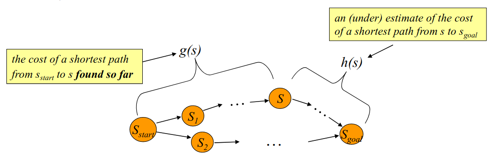

---
# Jekyll 'Front Matter' goes here. Most are set by default, and should NOT be
# overwritten except in special circumstances.
# You should set the date the article was last updated like this:
date: 2020-12-06 # YYYY-MM-DD
# This will be displayed at the bottom of the article
# You should set the article's title:
title: A* Implementation Guide
# The 'title' is automatically displayed at the top of the page
# and used in other parts of the site.
---
## Introduction
This wiki aims to serve as a brief introduction and implementation guideline for A* search, specifically applied to robot motion planning. This will discuss how the algorithm functions, important design aspects in the pipeline, common knobs to tune, and efficiency considerations. The specific guidance and notes will be mainly related to implementation for an Ackermann steered vehicle, but will be useful for abstracting to other systems as well.

A* search is just one of many algorithms that can be used for search, but note that grid-based search methods such as this are often limited in their effectiveness when used for higher DOF systems. For those problems, it would be worthwhile to consider sampling based planning methods instead.

These notes and guidance are augmented with heavy borrowing from and attribution to Maxim Likhachev’s 16-782 Planning and Decision Making in Robotics course, Fall 2020.

## Overview of A* Algorithm
A* is a popular search algorithm that is guaranteed to return an optimal path, and during its search for an optimal path, will provably expand the minimum number of states to guarantee optimality. Why is this useful? It allows for far less exploration, and in turn, less computation than a Dijkstra search, which is a greedy search algorithm.

### Important Terms
- g(s) value - cost of the shortest path from the start state (sstart) to the current state (s) so far
- h(s) value - estimate of the cost-to-go from the current state (s) to the goal state (sgoal)
- f(s) value - total estimated cost from the start state (sstart) to the goal state (sgoal)
- Admissibility - h(s) is an underestimate of the true cost to goal
- Monotonicity/Consistent - h(s) <= c(s,s’) + h(s’) for all successors s’ of s
- Optimality - no path exists from the start to the goal with a lower cost within the constraints of the problem

A* works by computing optimal g-values for all states along the search at any point in time.

## Planning Representation
When designing a planner, you first need to decide a few things about how your problem will be represented. Key questions:
- What states of your robot do you care about?
  - Examples: X-position, Y-position. Yaw-Pose, etc…
- What actions can your robot take?
  - Can it move in any directions unconstrained?
  - Are there non-holonomic constraints?
- How is your environment modeled?
- What is the starting configuration for your robot?
- Is the environment model static or can it change dynamically?
- How is cost represented in your problem?
  - Distance traveled by your robot?
  - Time taken from the start?
  - Proximity to specific areas within the map?
- What is your desired goal configuration?
  - Is it a specific X and Y location?
  - Is it a partial goal?
    - This means that only SOME of the states that are represented need to match a goal configuration for the goal condition to be satisfied

## Key Data Structures
Priority Queues
- Ordering items in the queue based on some value
    - Key for A* should be f(s)
    - Typically the items are class instances or structs that contain the state, parent, trajectory, g(s), c(s), and other information
    - The most efficient way to combine two sets of items into one priority queue is by merge sorting them independently and them merging the two priority queues ala merge sort
    - Can apply this process to the set of children generated from expanding a node

## Map Representation
#### Explicit:
- Pros:
  - Offline pre-generation allows for more efficient access during online planning
  - Simple to implement in data structures
- Cons:
  - Not practical for higher order planning problems, as the map can easily become too large to represent in memory

#### Implicit
- Pros:
  - More efficient for memory
- Cons:
  - Must be generated online, adding computation
  - More complicated implementation

## Heuristic Design
In general, for the best performance of your A* planner, you would leverage domain knowledge related to your specific use case to design a heuristic function. With a poor heuristic function, your planner can either waste time exploring extra states or find a sub-optimal solution to the goal. Also, you shouldn’t use the heuristic to bias the resulting plan, rather just to speed up the search process.

How does A* guarantee optimality when your heuristic is admissible and consistent? The search expands states in the order of f = g + h, which is assumed to be the estimated cost of an optimal path to the goal.

#####  Simple Heuristics (Mainly Used for Toy Problems):
- Euclidean Distance
- Diagonal/Chebychev Distance
- Manhattan Distance

#####  More Informed Heuristics:
- Create map of h-values using a backwards A* search on a lower dimensional representation of the environment, and assigning the calculated g-values as the cost-to-goal
  - Backwards A* swaps the start and goal configuration in the search
  - Lower dimensional search helps to ensure the heuristic is admissible, as it should always be an underestimate of cost-to-goal

##### Weighted Heuristic Search:
- Takes your heuristic estimate and applies a weight to it to bias your search towards the goal
- Often makes your heuristic inadmissible, which removes optimality guarantees, but can reduce search time immensely in some circumstances.

##### Final Notes of Heuristics:
As your planning problem becomes more complex (many local minima, high # of DOFs, etc) your heuristic function design choices quickly become the most important thing in your search, so spend time building and leveraging your knowledge of what the important factors are in a scenario when developing your heuristics.

## Motion Primitives for Ackermann Vehicles
Generating motion primitives for non-holonomic vehicles can be a computationally expensive task and especially when more demanding motion primitives are desired beyond setting constant control values nearly intractable in terms of online computation time. With this in mind it is best to pre-generate sets of motion primitives for different state values such as speed and steering angle. At the same time the footprint, or all locations the robot contacts the environment, throughout the trajectory of the motion primitive should be generated and can be used for online collision checking. The following are several design suggestions/design considerations for implementing motion primitive pregeneration for non-holonomic vehicles.

Some suggestions to keep in mind:
- Discretize angles and velocities at the start and end of the motion primitives
- Build in an efficient way to transform the motion primitive trajectory and footprint into the frame of the expanding state
- Best to have the footprint of the robot over the motion primitive pre-generated as well so only the checks need to be made
- Structured as a mask or list of cells relative to the expanding node frame
- Motion primitives are where the motion constraints should be applied ie only feasible motion primitives should be generated and used by the A* planner

## References
[1] Likhachev, Maxim. “A* Planning.” 16-782 Planning and Decision-making in Robotics. 2020, www.cs.cmu.edu/~maxim/classes/robotplanning_grad/lectures/astar_16782_fall20.pdf.
