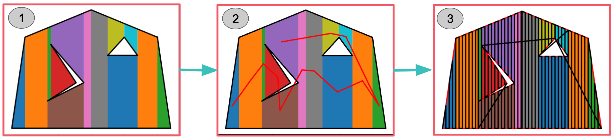

---
# Jekyll 'Front Matter' goes here. Most are set by default, and should NOT be
# overwritten except in special circumstances. 
# You should set the date the article was last updated like this:
date: 2022-12-07 # YYYY-MM-DD
# This will be displayed at the bottom of the article
# You should set the article's title:
title: Coverage Planner Implementation Guide
# The 'title' is automatically displayed at the top of the page
# and used in other parts of the site.
---
This wiki details how to implement a basic coverage planner, which can be used for generating paths such that a robot can cover a region with a sensor or end-effector. 

## Introduction to Coverage Planning
 The goal of coverage planning is to generate a path such that a robot sweeps every part of some area with one of its sensors and/or end-effectors. One common example where you would need a coverage planner is for drone monitoring applications, where you need the drone to follow a path such that its cameras get a view of every part of some larger field/area. Another example would be a robot lawnmower or vacuum, where we want the robot to move such that it mows or vacuums every square meter of some field or room. 
 
 In this guide, we will be focusing on a cellular-decomposition based coverage planner. This type of coverage planner first splits the region to cover into simpler cells whose coverage paths are easy to generate. We then plan a cell traversal, and the robot goes from cell to cell, covering each simpler cell, until all cells, and thus the entire region, have been covered. There are other coverage planner methods. For example, grid-based coverage planning methods would decompose the region into an occupancy grid map, and then use graph algorithms to ensure the robot covers each grid cell. However, these other types of coverage planners are out of the scope of this simple tutorial. Interested readers are recommended to check out the survey on coverage planning listed below in the Further Reading section for more information on other forms of coverage planners.

## High Level Architecture of Coverage Planner
 Before we dive into the small details of this coverage planner, we will first look at the high level architecture of the coverage planner we will be designing. The image below shows the three main steps. 

 

 The input to the coverage planner is the region we want to generate the coverage plan for. We will represent our region of interest as an outer polygon with a set of polygonal holes. The holes represent areas within the overall outer polygon that we don't want to cover. For instance, in a robotic lawnmowing application, holes could represent gardens in the middle of the lawn that we don't want to mow. Similarly, in a drone wildfire-monitoring application, holes might represent lakes, which would not have any fire, and so you would not want to spend time monitoring them. The outer polygon as well as polygonal holes each are represented as lists of vertices, with each vertex being an x,y coordinate pair.

 Once we have our input region, the first step is cellular decomposition, where we break up the complicated region of interest into simpler shapes which we call cells. In particular, we will perform trapezoidal decomposition, which forms trapezoidal cells. The intention for performing this decomposition is that we can use a simpler algorithm to generate coverage plans for the individual trapezoids, and we can then combine these coverage plans to form a coverage path for the entire region.

 The second step of the algorithm will be generating a cell traversal. This means determining which order to visit the trapezoidal cells. Once we have this order, then in the third step, we form the full coverage path. Starting at the first cell in the cell traversal, we iterate between covering the current cell with our simpler coverage planner and travelling to the next cell in the cell traversal. This final path should now cover the entire region of interest.

## Step 1: Forming a Trapezoidal Decomposition

 As mentioned above, the first step to our coverage planner will be decomposing the region of interest into simpler trapezoids. To perform this trapezoidal decomposition, we will use a vertical sweep line method. This involves "sweeping" a vertical line from left to right across the region. As the sweep line encounters events, which correspond to vertices, it processes them. We maintain a list of trapezoidal cells that are currently open, meaning that their right edge is unknown. Processing an event involves closing some open cells and opening new cells. Once the sweep line has made it past the right-most event, there should be no more open cells and the closed cells represent the full trapezoidal decomposition of the region. An example of such a trapezoidal decomposition from section 6.1 of the Principles of Robot Motion textbook is shown in the image below.

 

 Diving into more detail, the first step of trapezoidal decomposition is to convert the outer boundary and holes into a list of events. To do this, we need to discuss what an event is. Events correspond to vertices of the region of interest, but they also contain some additional information. In addition to the current vertex (the vertex that the event corresponds to), an event contains the previous vertex, the next vertex, and the event type. The previous vertex and next vertex refer to the two vertices directly connected to the current vertex via edges. In order to distinguish between the next and previous vertex, we will use the convention that as you traverse the edges of the outer boundary or a hole, the region of interest (area you care about covering) will be to your left. Thus, we will traverse the outer boundary in counter-clockwise order and traverse holes in clockwise order.

 The 6 different event types we will define are OPEN, CLOSE, IN, OUT, FLOOR, and CEILING events. A graphic displaying these 6 event types is shown below. 

 > We are currently assuming that all vertices have a unique x-component. We detail some steps to get around this assumption in the Dealing with Overlapping Vertices section below.

 This classification into different event types will be useful later as we process events, since each type will need to be processed differently.

 

 To generate the list of events, loop through the vertices of the outer boundary in CCW order and loop through the vertices of each hole in CW order. At each vertex, add a new event with its previous, current, and next vertex. To determine the event type, you need to examine the x and y components of the previous and next vertex. For example, if both the previous and next vertex have an x component to the left of the current vertex, the event is either an OUT or CLOSE event. Comparing the y coordinate of the previous and next vertex can then distinguish between these two event types. Similarly, if the previous and next vertex are both to the right of the current vertex, the event type is either OPEN or IN. Again, you can then compare the y coordinate of the previous and next vertex to distinguish them. If the previous vertex is to the left of the current vertex and the next vertex is to the right of the current vertex, the event type is FLOOR. Finally, if the previous vertex is to the right while the next vertex is to the left, the event type is CEILING. 

 While we can't literally sweep a vertical line across the region of interest, we can mimic this behavior by processing each event from left to right. Thus, once you have a list of events, you will have to sort them by their x-component. 

 As we iterate through this sorted list, we will maintain a list of open cells, closed cells, and current edges. Thinking back to the analogy of a sweep line being pulled from left to right across the region of interest, the open cells correspond to trapezoidal cells we are forming which the sweep line is currently intersecting. Closed cells would be trapezoidal cells completely to the left of the sweep line. Closed cells have a known right boundary, whereas open cells are defined as cells with an unknown right boundary. The process of closing a cell corresponds to the determination and setting of its right boundary. Finally, current edges represents all edges that the sweep line is intersecting. Overall, the function to process each event can be split into three different parts:

 1. Identify the floor and ceiling edges
 2. Open and close cells
 3. Update the current edges list

 The first step to processing an event is identifying the edges immediately above and below the current event. We call these edges the floor and ceiling edges. To find the floor and ceiling edges for an event, we loop through the list of current edges (edges being intersected by the sweep line). We find the vertical intersection point between the sweep line and each edge. The ceiling edge is chosen as the edge who's vertical intersection point is closest to the event while still being above the event. The floor is chosen similarly but must be below the event. 

 > Note: It is possible for an event to not have a floor or ceiling edge.

 The next step in processing an event is to open and close cells based on the event type. At OPEN events, we create a new open trapezoid. At CLOSE events, we close a trapezoid (add the right edge) without opening any new trapezoids. At FLOOR and CEILING events, we close one trapezoid and open a new one. At IN events, we close one trapezoid and open two new ones. Finally, at OUT events, we close two trapezoids and open a new one. 

 We can represent the trapezoidal cells as a floor edge, a ceiling edge, and a left and right boundary x value. This defines a trapezoid whose parallel sides are vertical. The right boundary x value is uninitialized for open cells. Closing a cell involves setting the right boundary x value. With this representation, new cells are opened with their floor and ceiling edges set to some mix from the following four edges: The floor edge below the event, the ceiling edge above the event, the edge between the event's current and next vertex, and the edge between the event's current and previous vertex. Additionally, cells contain a list of their neighbors, which will be used when generating a cell traversal. We add to this neighbor list both when we open and close the cell.

 The final step in processing an event is to update the current edges list. If the previous vertex is to the left of the event, remove the edge between the previous and current vertex. Similarly, remove the current to next vertex edge if the next vertex is to the left of the event. If the next or previous vertex is to the right of the event, add the corresponding edge to the current edges list. This ensures our current edges list stays up to date with all edges the sweep line is currently intersecting.

 The end result of this step is a set of closed trapezoidal cells, with each cell containing a list of neighboring cells. This defines a graph.

## Step 2: Generating a Cell Traversal

 The trapezoidal cells define an implicit graph via their neighbor lists. Once we have the trapezoidal cells, we need to determine a cell traversal. This is an order in which to visit each cell. An example (incomplete) cell traversal from section 6.1 of the Principles of Robot Motion textbook is shown below.

 

 There are lots of different ways to generate a cell traversal. For example, you could start from some random cell and perform depth-first search. You could use a greedy method where, from each cell, you go to the nearest unvisited cell. You could also use a more complex method such as using a TSP solver. 

 The output from this step should be an ordered list of cells to visit.
## Step 3: Synthesizing the Full Coverage Plan

 Once you have a cell traversal, you can form the full coverage plan. Starting at the first cell in the cell traversal, alternate between generating a coverage plan for the given cell, and generating a path to the next cell. The path to the next cell might be as simple as a straight line, assuming you do not care if the robot crosses over holes occasionally. To generate the cell coverage plan, we can simply generate a back-and-forth lawnmower pattern over the cell. This lawnmower pattern is easy to generate for our vertical trapezoids because each vertical pass and each horizontal stepover is guaranteed not to hit any obstacles/holes. Simply start at one corner of the trapezoid and alternate between performing a vertical pass to the other side of the trapeoid and performing a horizontal stepover along the top or bottom edge. 

 > The distance of the stepover should be close enough for there to be overlap in your sensor/end-effector, but not too close or else the coverage plan will not be as efficient

 By travelling and then covering each trapezoidal cell, the robot will eventually cover the entire region of interest.

## Dealing with Overlapping Vertices

 In the case where two vertices share the same x-coordinate, such an event would not fit into any of the 6 existing categories. To handle this case, events can be changed from having a one-to-one correspondence with vertices to now allowing one event to correspond to multiple vertices. Instead of having a single vertex of interest, you can group consecutive vertices with the same x-coordinate into a single event. Make sure to ensure that the next and previous vertex (shown as v_n+1 and v_n-1 in figure 1) have a distinct x-coordinate from this vertices of interest list. This change to the event allows you to still use the same 6 event types described above, but v_n, the current vertex, now becomes a list of vertices forming a vertical line rather than a single vertex. 

 Making this change to the event class is sufficient for handling the case where consecutive vertices in the same polygon have the same x-coordinate. Such is the case for shapes like rectangles. However, it does not handle the case where non-consecutive vertices in a polygon or vertices from two different polygons have the same x-coordinate. In such a case, we end up forming degenerate trapezoids with zero area, since, as we process the two events at the same x-coordinate, we end up opening and closing a trapezoid at the same x-coordinate. This results in trapezoids where the left and right vertical edges are at the same place. To fix this, you can create a function which, after trapezoidal decomposition is performed, removes degenerate trapezoids and connects all the neighbors for a given degenerate trapezoid together. With these two fixes, the coverage planner should be able able to generate coverage plans for any polygon with holes.
## Potential Optimizations

 In the coverage planner described above, our trapezoidal cells have vertical parallel sides, and we cover these cells with vertical passes up and down. However, performing vertical passes up and down may not be the most efficient way to cover a given region of interest. To improve the performance of the coverage planner, one potential optimization would be to try different rotations of the region of interest to see if there is some other orientation that results in a shorter coverage plan. You could consider checking a discrete set of equally-spaced rotation angles, as well as check the rotation angles corresponding to the angles of the longest edges in the region of interest. 

 A second optimization that could be performed is to use boustrophedon decomposition rather than trapezoidal decomposition. For readers interested in this, I recommend checking out the papers listed below in the Further Reading section.

## Summary
 Overall, coverage planning is useful for tasks that require scanning of an area by a robot. We have seen how we can generate such paths over complicated areas by first splitting the region into simpler trapezoidal cells, planning a traversal across those cells, and then using a simple back-and-forth lawnmower pattern to cover each trapezoid. With such an algorithm, we can have our robots plan paths to cover arbitrarily complex polygonal regions.

## See Also:
- [Planning Overview](https://roboticsknowledgebase.com/wiki/planning/planning-overview/)

## Further Reading
- [A Survey on Coverage Path Planning for Robotics](https://core.ac.uk/download/pdf/132555826.pdf)
- [Coverage Path Planning: The Boustrophedon Cellular Decomposition](https://asset-pdf.scinapse.io/prod/1590932131/1590932131.pdf)

## References
- H. Choset, K. M. Lynch, S. Hutchinson, G. A. Kantor, & W. Burgard, “Cell Decompositions” in Principles of Robot Motion, Cambridge, MA, USA: MIT Press 2005, ch. 6, sec. 1, pp. 161–167.
