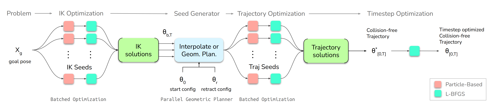

---
# Jekyll 'Front Matter' goes here. Most are set by default, and should NOT be
# overwritten except in special circumstances. 
# You should set the date the article was last updated like this:
date: 2024-12-02 # YYYY-MM-DD
# This will be displayed at the bottom of the article
# You should set the article's title:
title: Manipulator Trajectory Planning using CuRoBo
# The 'title' is automatically displayed at the top of the page
# and used in other parts of the site.
---
This article provides a comprehensive guide to cuRobo, a robust motion planning and optimization library tailored for robotic manipulators. The focus is on helping users understand how to configure, use, and extend cuRobo for trajectory planning tasks in simulation environments like NVIDIA's Isaac Sim. 

In addition to explaining how cuRobo's `motion_gen` module can be utilized for collision-free trajectory generation, this guide delves into advanced capabilities such as batch IK computation, trajectory optimization, custom seed creation, and trajectory manipulation. Whether you're a beginner setting up a custom robot or an experienced user exploring cuRobo's advanced APIs, this tutorial aims to provide actionable insights and examples.

## Curobo Setup
To get started with CuRobo, there are three main installation methods. Depending on your requirements, you can choose the one that fits best. However, the author recommends the first two options as they tend to handle dependencies, such as PyTorch, more reliably.

**1. Install on Isaac Sim Python Environment**
This is the recommended method for users working directly with NVIDIA’s Isaac Sim with or without ROS. CuRobo integrates seamlessly with Isaac Sim’s ecosystem, allowing for robust simulation and testing of motion planning pipelines. Follow the steps in [this guide](https://curobo.org/get_started/1_install_instructions.html#isaac-sim-installation) to install CuRobo in the Isaac Sim Python environment.

**2. Install via Isaac-ROS-Dev with cuMotion Plugin**
If you’re working with NVIDIA Jetson and plan to integrate CuRobo with MoveIt2, this option is ideal. The [Isaac ROS Dev](https://nvidia-isaac-ros.github.io/concepts/docker_devenv/index.html#development-environment) environment, combined with the cuMotion plugin, enables smooth integration with MoveIt2 and other NVIDIA ROS2 packages such as Nvblox for motion planning. Refer to [this link](https://nvidia-isaac-ros.github.io/getting_started/dev_env_setup.html) for Isaac Ros Dev installation instructions and [this link](https://nvidia-isaac-ros.github.io/repositories_and_packages/isaac_ros_cumotion/index.html) for cuMotion installation and tutorials.

**3. Install on Local/Virtual Python Environment**
For experienced users who prefer running CuRobo independently of Isaac Sim or ROS, installing it on a local or virtual Python environment is an option. This may be ideal for headless programs installed on servers for offline batch trajectory generation. Be aware that this method might require additional effort to manage dependencies, especially with CUDA versions. Check [this guide](https://curobo.org/get_started/1_install_instructions.html#library-installation) for more details.

The rest of this article will assume an installation of CuRobo in the Isaac Sim Python environment. This setup is recommended because Isaac Sim provides a powerful simulation environment that allows users to quickly run demos and tutorials provided by NVIDIA. It’s worth noting that both CuRobo and Isaac Sim have significant hardware and software requirements. Be sure to review these requirements in detail before proceeding, which you can find [here](https://docs.omniverse.nvidia.com/isaacsim/latest/installation/requirements.html).

For reference, the author tested this tutorial on a machine with the following specifications:

	•	GPU: NVIDIA RTX 4080
	•	CPU: Intel i7 13th Gen
	•	Memory: 32 GB RAM

## cuRobo's Planning Framework
cuRobo is an optimization-based trajectory planner designed to generate collision-free motion for manipulators efficiently. At its core, it functions similarly to the CHOMP motion planner, focusing on optimizing trajectories through cost functions. However, cuRobo’s true strength lies in its ability to batch process computations using parallelized optimization techniques, leveraging GPU acceleration to achieve significant speedups. This parallelism enables CuRobo to solve motion generation problems up to 60× faster than state-of-the-art CPU-based methods, as highlighted in NVIDIA’s research.

The figure below demonstrates the key stages of CuRobo’s motion generation framework. The official paper is available in this [link](https://curobo.org/reports/curobo_report.pdf).
 

cuRobo represents the robot's collision links using collision spheres rather than relying on the collision geometries defined in the URDF. Each link of the robot is approximated by a set of spheres. This approach ensures fast computations while maintaining accuracy in detecting potential collisions.

The collision world in cuRobo can be represented using primitives such as cuboids, meshes, and, if integrated with NVBlox, voxels. These representations are used in conjunction with the collision spheres for performing collision checks. Refer to [this link](https://curobo.org/get_started/2c_world_collision.html) for more details.

## Motion Gen Wrapper

The motion_gen module in CuRobo serves as the core motion generation framework for robotic manipulators. For most use cases, motion_gen provides all the functionality needed to define, optimize, and execute motion plans effectively. It exposes a comprehensive set of parameters for fine-tuning the optimization process for both inverse kinematics (IK) and trajectory generation, making it versatile enough to handle a wide range of robotic tasks.

In this tutorial, we will use the motion_gen_reacher.py example provided by CuRobo within the Isaac Sim environment. This script demonstrates how to configure and run the motion_gen module to generate collision-free trajectories for a robotic arm to reach a desired target pose. The example is ideal for users who want a quick yet detailed understanding of motion planning in CuRobo.

For users requiring more granular control, such as customizing batch IK solvers or generating raw trajectory seeds, refer to the advanced sections of CuRobo’s documentation for detailed guidance on low-level APIs and batch processing methods.

### Example Script Overview: motion_gen_reacher.py

The `motion_gen_reacher.py` script, located in the `examples/isaac_sim` directory of the CuRobo library, serves as a hands-on demonstration of CuRobo's motion planning capabilities within the Isaac Sim environment. You can follow [this guide](https://curobo.org/get_started/2b_isaacsim_examples.html) to set up and run the example.

At a high level, the script operates through the following sequence:
1. **Initialization:** Set up CuRobo and initialize the Isaac Sim environment.
2. **Environment Loading:** Load the CuRobo environment and configurations into Isaac Sim.
3. **Simulation Loop:** Execute the motion planning and simulation loop to generate and visualize trajectories.

This structured workflow allows users to easily understand how CuRobo integrates with Isaac Sim and provides a starting point for customizing motion generation tasks.

#### Initialization

Every Isaac Sim script starts with the initialization of the `SimulationApp` class from `omni.isaac.kit`. This step sets up the simulator environment, enabling visualization and interaction. After initializing the simulator, necessary Isaac Sim components are loaded to visualize the target position and create primitive objects that define the simulated world. These objects include the robot, obstacles, and a target cuboid, which acts as the goal for the robot’s motion.

The CuRobo setup begins by reading a YAML configuration file for the robot. This configuration file includes all the essential details about the robot, such as its URDF file, collision geometry (spheres, meshes), self-collision exclusions, and more. For detailed documentation on the structure and content of this configuration file, refer to [this link](https://curobo.org/tutorials/1_robot_configuration.html). 

The robot’s configurations are passed to CuRobo’s `motion_gen` module using the `MotionGenConfig.load_from_robot_config` function. This function is central to setting up the parameters for motion generation and optimization, providing fine-grained control over trajectory planning.

For instance, the following code snippet demonstrates how the `motion_gen` module is configured in `motion_gen_reacher.py`:

```python
motion_gen_config = MotionGenConfig.load_from_robot_config(
    robot_cfg,
    world_cfg,
    tensor_args,
    collision_checker_type=CollisionCheckerType.MESH,
    num_trajopt_seeds=12,
    num_graph_seeds=12,
    interpolation_dt=interpolation_dt,
    collision_cache={"obb": n_obstacle_cuboids, "mesh": n_obstacle_mesh},
    optimize_dt=optimize_dt,
    trajopt_dt=trajopt_dt,
    trajopt_tsteps=trajopt_tsteps,
    trim_steps=trim_steps,
)
motion_gen = MotionGen(motion_gen_config)
```

This configuration achieves the following:
1. **Robot and World Configurations**: Loads the robot_cfg and world_cfg files, which define the robot and static world objects, respectively.
2. **Trajectory Optimization Seeds**: Sets num_trajopt_seeds and num_graph_seeds to 12, allowing the optimizer to initialize with multiple random configurations for trajectory and graph-based planning (e.g., PRM, RRT).
3. **Optimization Parameters**: Defines parameters like trajopt_dt, interpolation_dt, and trajopt_tsteps to control trajectory interpolation and optimization granularity.
4. **Collision Checking**: Configures a collision checker using object-oriented bounding boxes (OBB) and mesh representations to handle collision avoidance.

Once the configuration is complete, the MotionGen module is instantiated with the motion_gen_config. This module handles trajectory optimization and motion planning, leveraging cuRobo’s parallel processing capabilities for efficient and accurate results.

#### Environment Loading
In this script, the cuRobo environment is loaded into Isaac Sim using utility functions provided in the `util_file` script from the CuRobo library. These functions are responsible for loading the robot model and the collision world, as defined in the CuRobo configuration files, into the Isaac Sim environment. 

The following code snippet demonstrates this process:

```python
robot, robot_prim_path = add_robot_to_scene(robot_cfg, my_world)

usd_help.load_stage(my_world.stage)
usd_help.add_world_to_stage(world_cfg, base_frame="/World")
```

#### Simulation Loop

The simulation loop in this script is responsible for continuously updating the Isaac Sim environment, reading the target pose, and generating motion plans for the robot. At a high level, it performs the following tasks:

1. **Reading Target Pose:**  
   In each iteration of the loop, the script reads the position and orientation of a visual cuboid in Isaac Sim, which represents the target pose for the robot. This cuboid serves as the goal that the robot's end-effector must reach.

2. **Checking for Target Updates:**  
   If the position or orientation of the cuboid has changed since the previous loop iteration, the script triggers the CuRobo `motion_gen` module to compute a new motion plan.

3. **Planning a Single Path:**  
   Using the `motion_gen.plan_single` function, the script generates a collision-free trajectory from the robot's current joint state (read from Isaac Sim) to the updated target pose. This ensures that the robot's motion is dynamically updated in response to changes in the environment.

If motion generation is triggered, the resulting trajectory, if feasible, is processed. This trajectory is essentially a list of joint positions that represent the planned path for the robot to reach the target pose. The script iterates through these joint positions, stepping the simulation for each point to visualize the robot's motion. It is important to note that this is more of a trajectory visualization rather than a realistic simulation of the robot's behavior. The robot simply moves to the joint positions specified by the outputted trajectory, and the articulation controller does not assume realistic control of the robot's dynamics.  

To simulate the robot's motion more accurately, including factors like velocity, acceleration, and control dynamics, additional configuration of the articulation controller within Isaac Sim would be required. This would involve setting up the controller to manage realistic physics-based execution of the planned trajectory.

Additionally, users should familiarize themselves with the classes and data structures used in CuRobo, as the framework heavily relies on both PyTorch tensors and standard Python data structures. For instance, the `plan_single` function outputs a `MotionGenResult` class, which encapsulates the results of the motion generation process. Key data within this class, such as `interpolated_plan`, are represented as tensor datatypes, allowing for efficient numerical operations and manipulation.  

Understanding how these tensors are integrated with Python structures is crucial for effectively working with CuRobo. Users can refer to the [MotionGen API documentation](https://curobo.org/_api/curobo.wrap.reacher.motion_gen.html#module-curobo.wrap.reacher.motion_gen) for detailed insights into the methods and data provided by the `MotionGen` module and related classes.

### Advanced Capabilities of cuRobo

#### Custom Robot Configuration
cuRobo supports popular manipulators such as the UR series, Franka, and others, and provides USD and YAML configuration files for these robots. To use cuRobo with a different robot, refer to [this tutorial](https://curobo.org/tutorials/1_robot_configuration.html) for creating the required configuration files.  

When using cuRobo with Isaac Sim, it's essential to note that the simulator requires a USD file for the robot to load into the simulation (refer to [Issac Sim's URDF to USD converter](https://docs.omniverse.nvidia.com/isaacsim/latest/advanced_tutorials/tutorial_advanced_import_urdf.html)). Users must also correctly configure the robot's collision spheres, which represent the robot's links for collision checking. This configuration can be performed using the Lula Robot Description Editor in Isaac Utils within the simulator. 

---

#### Batch IK Computation
In many scenarios, multiple IK solutions are required, such as for collision checking or finding feasible reachability. For instance, a parallel jaw gripper may need several potential end-effector poses (varying mainly in orientation) to reliably grasp an object. Batch IK computation allows users to solve for multiple IK solutions efficiently.  

The `IKSolver` class in the cuRobo library handles IK computations. It initializes similarly to the `MotionGen` module, taking in the robot configuration file, world model, and other tuning parameters.  

The following methods in the `IKSolver` class can be used for batch IK computation:  
- `solve_batch`: Solve a batch of IK problems for a single environment and multiple goals.  
- `solve_batch_goalset`: Solve IK for one pose in a set of goal poses.
- `solve_batch_env`: Solve IK for multiple environments for a single goal.  
- `solve_batch_env_goalset`: Solve IK for a batch of environments and goal poses.  

These methods require specific inputs including the following:  
- **`goal_pose`**: The target pose(s) to solve IK for.  
- **`retract_config`**: The configuration used for retracting the robot's joints.  
- **`seed_config`**: Initial configurations used to initialize IK computations.  

It's crucial that the tensor sizes of these inputs match as described in the [documentation](https://curobo.org/_api/curobo.wrap.reacher.ik_solver.html#curobo.wrap.reacher.ik_solver.IKSolver). Proper input matching ensures smooth and efficient batch IK computation.

---

#### Batch Trajectory Computation
Within the `MotionGen` module, batch trajectory solvers are available for parallelizing trajectory computations for multiple goal poses, initial joint states, and world environments. These solvers include:  
- `plan_batch`  
- `plan_batch_goalset`  
- `plan_batch_env`  
- `plan_batch_env_goalset`  

These batch solvers are particularly useful in scenarios such as:  
- Generating large-scale simulation data for training learning-based trajectory solvers.  
- Testing multiple end-effector poses to determine which pose produces the most efficient trajectory in terms of speed, effort, or other metrics.  
- Training grasp pose generators by using batch trajectories from potential poses or environments as part of a training dataset.

For users with a pre-defined initial trajectory seed, cuRobo provides the `TrajOptSolver` class, which can optimize these trajectories for smoothness (e.g., jerk-free motion). This is an excellent option for users looking to refine their own trajectories without generating them from scratch. Refer to the [API documentation](https://curobo.org/_api/curobo.wrap.reacher.trajopt.html#curobo.wrap.reacher.trajopt.TrajOptSolver) for more details.

---

#### Reversing Trajectories
cuRobo generates sequences of joint positions, velocities, and accelerations as the trajectory output from classes such as `MotionGenResult` or `TrajResult`. Users can manipulate these outputs directly for various purposes.  

For instance, if a trajectory is planned from pose A to B and the robot needs to return to A, there’s no need to invoke the planner again. Instead, users can reverse the tensors for joint positions, velocities, and accelerations, and multiply the velocity and acceleration tensors by -1. This approach is computationally faster than re-planning and requires only minimal checks, provided that there are no dynamic collision objects.

---

#### Hyperparameter Tuning
For real-world deployment, it is critical to fine-tune cuRobo’s robot model and optimizer parameters to achieve optimal trajectory generation. Although this article does not dive into the specifics of tuning, users are strongly encouraged to refer to the [documentation](https://curobo.org/_api/curobo.wrap.reacher.motion_gen.html#curobo.wrap.reacher.motion_gen.MotionGen.load_from_robot_config) for a detailed explanation of the parameters and their effects on motion planning.

---

#### Nvblox Integration
Nvblox for cuRobo can be integrated by following [this guide](https://curobo.org/get_started/1_install_instructions.html#install-nvblox-optional).