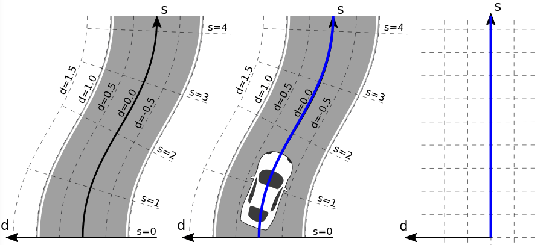

---
# Jekyll 'Front Matter' goes here. Most are set by default, and should NOT be
# overwritten except in special circumstances. 
# You should set the date the article was last updated like this:
date: 2022-12-09 # YYYY-MM-DD
# This will be displayed at the bottom of the article
# You should set the article's title:
title: Trajectory Planning in the Frenet Space
# The 'title' is automatically displayed at the top of the page
# and used in other parts of the site.
---

The Frenet frame (also called the moving trihedron or Frenet trihedron) along a curve is a moving (right-handed) coordinate system determined by the tangent line and curvature. The frame, which locally describes one point on a curve, changes orientation along the length of the curve.

There are many ways to plan a trajectory for a robot. A trajectory can be seen as a set of time ordered state vectors x. The Frenet frame algorithm introduces a way to plan trajectories to maneuver a mobile robot in a 2D plane. It is specifically useful for structured environments, like highways, where a rough path, referred to as reference, is available a priori.

## Trajectory Planning in the Frenet Space

There are many ways to plan a trajectory for a robot. A trajectory can be seen as a set of time ordered state vectors x. The following algorithm introduces a way to plan trajectories to maneuver a mobile robot in a 2D plane. It is specifically useful for structured environments, like highways, where a rough path, referred to as reference, is available a priori.

The Frenet frame (also called the moving trihedron or Frenet trihedron) along a curve is a moving (right-handed) coordinate system determined by the tangent line and curvature. The frame, which locally describes one point on a curve, changes orientation along the length of the curve.

More formally, the Frenet frame of a curve at a point is a triplet of three mutually [orthogonal](https://www.statisticshowto.com/orthogonal-functions/#definition) unit vectors {T, N, B}. In three-dimensions, the Frenet frame consists of [1]:
The unit tangent vector T, which is the [unit vector](https://www.statisticshowto.com/tangent-vector-velocity/) in the direction of what is being modeled (like velocity),
The [unit normal] (https://www.statisticshowto.com/unit-normal-vector/) N: the direction where the curve is turning. We can get the normal by taking the [derivative](https://www.statisticshowto.com/differentiate-definition/) of the tangent then dividing by its length. You can think of the normal as being the place the curve sits in [2].
The unit binormal B = T x N, which is the cross product of the unit tangent and unit normal.

The tangent and normal unit vectors span a plane called the osculating plane at F(s). In four-dimensions, the Frenet frame contains an additional vector, the trinormal unit vector [3]. While vectors have no [origin](https://www.statisticshowto.com/calculus-definitions/cartesian-plane-quadrants-ordinate-abscissa/#origin) in space, it’s traditional with Frenet frames to think of the vectors as radiating from the point of interest.

More details:[here](https://fjp.at/posts/optimal-frenet/#trajectory-planning-in-the-frenet-space)

## Algorithm

1. Determine the trajectory start state [x1,x2,θ,κ,v,a]
The trajectory start state is obtained by evaluating the previously calculated trajectory at the prospective start state (low-level-stabilization). At system initialization and after reinitialization, the current vehicle position is used instead (high-level-stabilization).
2. Selection of the lateral mode 
Depending on the velocity v the time based (d(t)) or running length / arc length based (d(s)) lateral planning mode is activated. By projecting the start state onto the reference curve the the longitudinal start position s(0) is determined. The frenet state vector [s,s˙,s¨,d,d′,d′′](0) can be determined using the frenet transformation. For the time based lateral planning mode, [d˙,d¨](0)
need to be calculated.
3. Generating the lateral and longitudinal trajectories 
Trajectories including their costs are generated for the lateral (mode dependent) as well as the longitudinal motion (velocity keeping, vehicle following / distance keeping) in the frenet space. In this stage, trajectories with high lateral accelerations with respect to the reference path can be neglected to improve the computational performance.
4. Combining lateral and longitudinal trajectories 
Summing the partial costs of lateral and longitudinal costs using J(d(t),s(t))=Jd(d(t))+ks⋅Js(s(t))
, for all active longitudinal mode every longitudinal trajectory is combined with every lateral trajectory and transformed back to world coordinates using the reference path. The trajectories are verified if they obey physical driving limits by subsequent point wise evaluation of curvature and acceleration. This leads to a set of potentially drivable maneuvers of a specific mode in world coordinates.
5. Static and dynamic collision check 
Every trajectory set is evaluated with increasing total costs if static and dynamic collisions are avoided. The trajectory with the lowest cost is then selected.
6. Longitudinal mode alternation 
Using the sign based (in the beginning) jerk a(0),  the trajectory with the strongest decceleration or the trajectory which accelerates the least respectivel

“Frenet Coordinates”, are a way of representing position on a road in a more intuitive way than traditional (x,y) Cartesian Coordinates.
With Frenet coordinates, we use the variables s and d to describe a vehicle’s position on the road or a reference path. The s coordinate represents distance along the road (also known as longitudinal displacement) and the d coordinate represents side-to-side position on the road (relative to the reference path), and is also known as lateral displacement.
In the following sections the advantages and disadvantages of Frenet coordinates are compared to the Cartesian coordinates.

##Frenet Features

The image below[frenet path] depicts a curvy road with a Cartesian coordinate system laid on top of it, as well as a curved (continuously curved) reference path (for example the middle of the road).

The next image shows the same reference path together with its Frenet coordinates.

The s coordinate represents the run length and starts with s = 0 at the beginning of the reference path. Lateral positions relative to the reference path are are represented with the d coordinate. Positions on the reference path are represented with d = 0. d is positive to the left of the reference path and negative on the right of it, although this depends on the convention used for the local reference frame.
The image above[frenet path] shows that curved reference paths (such as curvy roads) are represented as straight lines on the s axis in Frenet coordinates. However, motions that do not follow the reference path exactly result in non straight motions in Frenet coordinates. Instead such motions result in an offset from the reference path and therefore the s axis, which is described with the d coordinate. The following image shows the two different representations (Cartesian vs Frenet)
To use Frenet coordinates it is required to have a continouosly smooth reference path.
The s coordinate represents the run length and starts with s = 0 at the beginning of the reference path. Lateral positions relative to the reference path are are represented with the d coordinate. Positions on the reference path are represented with d = 0. d is positive to the left of the reference path and negative on the right of it, although this depends on the convention used for the local reference frame.
The image above shows that curved reference paths (such as curvy roads) are represented as straight lines on the s axis in Frenet coordinates. However, motions that do not follow the reference path exactly result in non straight motions in Frenet coordinates. Instead such motions result in an offset from the reference path and therefore the s axis, which is described with the d coordinate. The following image shows the two different representations (Cartesian vs Frenet)

## Reference Path 

Frenet coordinates provide a mathematically simpler representation of a reference path, because its run length is described with the s axis. This reference path provides a rough reference to follow an arbitrary but curvature continuous course of the road. To avoid collisions, the planner must take care of other objects in the environment, either static or dynamic. Such objects are usually not avoided by the reference path.

A reference path can be represented in two different forms although for all representations a run length information, which represents the s axis, is required for the transformation.

1. Polynome
2. Spline (multiple polynomes)
3. Clothoid (special polynome)
4. Polyline (single points with run length information)

Clothoid
					x(l)=c0+c1∗l

Polyline

## Transformation
The transformation from local vehicle coordinates to Frenet coordinates is based on the relations.
Given a point PC in the vehicle frame search for the closest point RC on the reference path. The run length of RC, which is known from the reference path points, determins the s coordinate of the transformed point PF. If the reference path is sufficiently smooth (continuously differentiable) then the vector PR→ is orthogonal to the reference path at the point RC. The signed length of PR→ determines the d coordinate of PF. The sign is positive, if PC

lies on the left along the run lenght of the reference path.

The procedure to transform a point PF
from Frenet coordinates to the local vehicle frame in Cartesian coordinates is analogous. First, the point RC, which lies on the reference path at run length s. Next, a normal unit vector d⃗  is determined, which, in this point, is orthogonal to the reference path. The direction of this vector points towards positive d values and therefore points to the left with increasing run length s. Therefore, the vector d⃗  depends on the run length, which leads to:
				PC(s,d)=RC(s)+d⋅d⃗ (s)(2)

#### Images and Video
Images and embedded video are supported.

## Summary

The given article describes in detail what is Frenet Frame and how robot motion planning is done. The importance and relevance of frenet frame with path planning in systems engineering is also highlighted in the given article. 

## Further Reading

[https://fjp.at/posts/optimal-frenet/#frenet-coordinates](Frenet Cordinates)
[https://www.mathworks.com/help/nav/ug/highway-trajectory-planning-using-frenet.html](Highway Trajectory Planning Using Frenet Reference Path)
[https://www.researchgate.net/publication/224156269_Optimal_Trajectory_Generation_for_Dynamic_Street_Scenarios_in_a_Frenet_Frame](Optimal Trajectory Generation for Dynamic Street Scenarios in a Frenet Frame)

## References

[https://fjp.at/posts/optimal-frenet/#frenet-coordinates](Frenet Frame)

