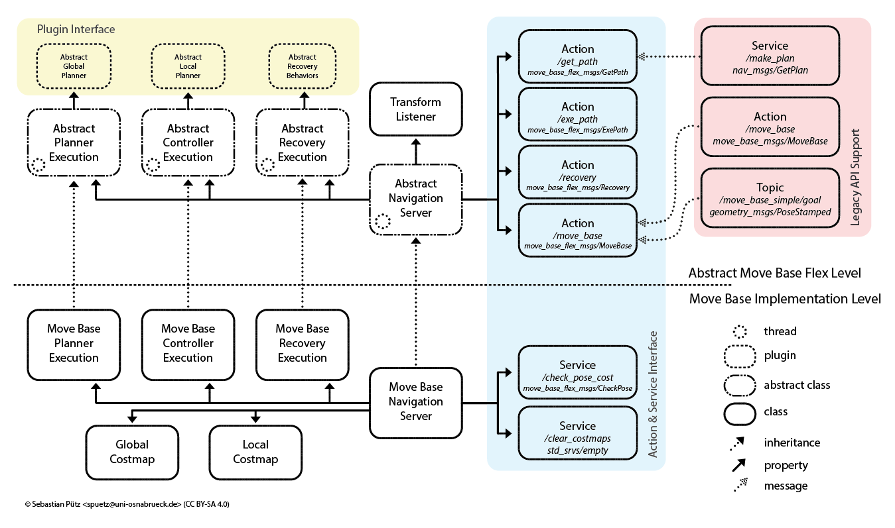
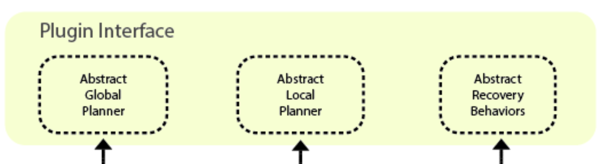
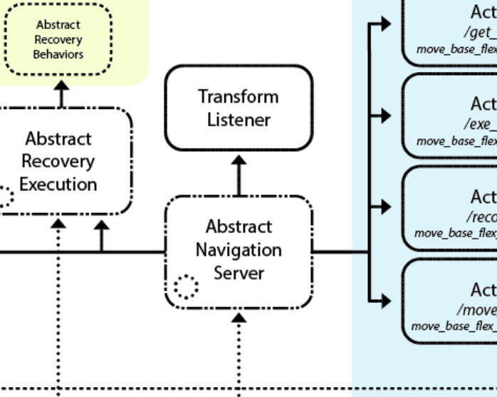
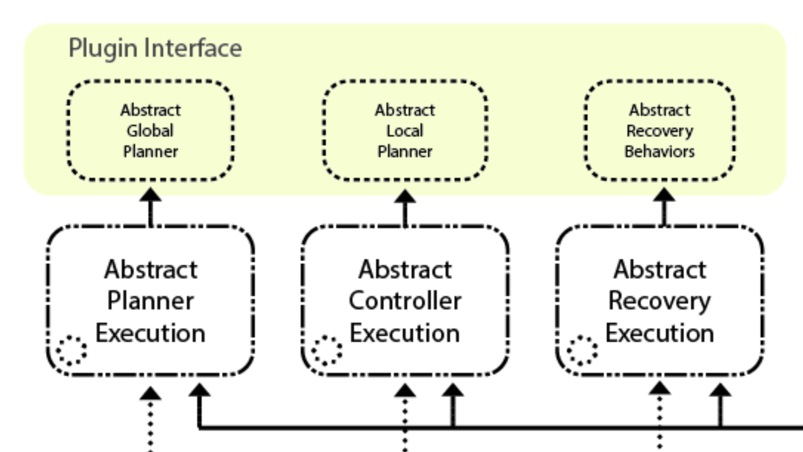

---
# Jekyll 'Front Matter' goes here. Most are set by default, and should NOT be
# overwritten except in special circumstances. 
# You should set the date the article was last updated like this:
date: 2023-04-29 # YYYY-MM-DD
# This will be displayed at the bottom of the article
# You should set the article's title:
title: Move Base Flex
# The 'title' is automatically displayed at the top of the page
# and used in other parts of the site.
---
<!-- This template acts as a tutorial on writing articles for the Robotics Knowledgebase. In it we will cover article structure, basic syntax, and other useful hints. Every tutorial and article should start with a proper introduction.

This goes above the first subheading. The first 100 words are used as an excerpt on the Wiki's Index. No images, HTML, or special formating should be used in this section as it won't be displayed properly.

If you're writing a tutorial, use this section to specify what the reader will be able to accomplish and the tools you will be using. If you're writing an article, this section should be used to encapsulate the topic covered. Use Wikipedia for inspiration on how to write a proper introduction to a topic.

In both cases, tell them what you're going to say, use the sections below to say it, then summarize at the end (with suggestions for further study). -->

## Introduction

MBF is a navigation stack that is an extension of the Move Base navigation stack, with many great features. The package allows us to load/unload planners and controllers on the fly easily and even run multiple planning algorithms concurrently. The code base is highly flexible and modular. It is an improvement over the original move base navigation package, which only allows 2D costmaps and does not allow easy modification of the execution behavior of the navigation stack.

This package handles all the interactions between the planner, the controller (what they call their local planner), and recovery behaviors. Also, it provides action servers for sending and keeping track of goals. These are supposed to be implemented as classes and are dynamically loaded/unloaded in the memory using the ROS plugin library [1].

> If you only need a work navigation stack on your robot that can give velocity commands and works in a 2D Space, this article IS NOT for you. You are better off using Move Base on your robot. This article is only of help if you want to use other map representations (like 2.5D or 3D maps) or write a custom planner of your own. 

## Move Base Flex Architecture

This is what the architecture of MBF looks like: 



The parts above the dotted line are the abstract classes and their interactions between them. These abstract classes are what you have to implement to get MBF to work. After doing this, you can write a simple node that instantiates the navigation server class you implemented, and your navigation stack is ready to be used on the robot. 

### Plugin classes


These classes are dynamically loaded at runtime by the navigation server (detailed below) using ROS pluginlib, and do the high-level planning, low-level planning, and recovery behaviors. These classes are purely abstract. You have to make your global planner, local planner, and recovery classes inherit from these classes and implement the pure virtual functions of these classes. You can look at the header files in the *mbf_abstract_core* package in the MBF repository to find more information on the methods that you must implement.

### The abstract navigation server class


This class is the main class that runs the entire navigation stack and handles the loading, initialization, and interaction of the plugin classes mentioned above. The abstract_navigation_server is also a pure abstract class. You have to make your navigation server class inherit from the abstract_navigation_server and implement the pure virtual functions of these classes. You can look at `abstract_navigation_server.h` in the *mbf_abstraction_nav* package to get more information on what methods you must implement. Note here that, unlike the plugin classes, you don't need to re-implement all the functions of the abstract navigation server, just the pure virtual ones. However, you can re-implement any of those functions as well if you want to change the execution of those functions.


### The abstract execution classes


There are abstract classes for controlling the planner, controller, and recovery execution, but these are not pure abstract classes, and MBF has already implemented their functions. However, you may want to change how your planner, controller, and recovery behaviors execute and tie in with your navigation server. In that case, you can inherit from these classes and implement the functions you want to change. You can look at the `abstract_planner_execution.h`, `abstract_controller_execution.h`, and `abstract_recovery_execution.h` in the *mbf_abstract_nav* package to get more information on the functions. 


## Implementing your navigation stack using MBF

As mentioned above, you must implement the plugin classes, the navigation server, and (optionally) the execution classes. This wiki will teach you to implement the bare minimum for a working navigation stack (i.e., the plugin classes and navigation server). Read on to find out how to implement these.

### The Planner class
The planner class serves as the global planner for the robot. MBF runs the code of this class only once when the robot receives a goal point or once more after the robot executes a recovery behavior. The job of this class is to generate a path through the environment, given the original location of the robot and the goal point location.

The planner class, at the bare minimum, only has to have two functions:

- makePlan
- cancel

#### makePlan
This function makes the plan and puts it in a vector of geometry_msgs:PoseStamped. It also has an integer return type, and you must return a code depending on how the planning worked. There are a bunch of error codes that you can return that MBF understands, and it would take care of handling that. There are a bunch of non-MBF codes as well that you can return, which MBF will communicate to the user. However, if you want to do something specific for those error codes, write your own implementation of planner_execution class. To know more about the input parameters and the error codes that need to be returned, refer to `abstract_planner.h` file, which has all inputs and output codes documented.

#### cancel
This is a function that can help you cancel the execution of the makePlan function. You can return false if you do not want to implement a cancellation function or if the cancellation fails for whatever reason. You would use this function (usually) by setting some variables in your planner class, which you would be reading in a computationally expensive loop in your makePlan function. Keep checking the variables in each iteration of the loop. If a cancellation is requested, you just exit the loop and call it a day. But feel free to do anything you want.

### The Controller Class
The name "Controller" might be a misnomer since here, the "Controller" also serves the function of the local planner. Fundamentally, the controller's job is to take the plan generated by the planner class and publish velocity commands that help the robot traverse that plan. It has to function as the local planner, keeping track of obstacles and collisions, and also as the high-level controller, generating velocity commands for the robot to follow. 

The Controller Class, at the bare minimum, has to have the following four functions:

- setPlan
- computeVelocityCommands
- isGoalReached
- cancel

#### setPlan
This function gets the global plan from the global planner (in the form of a vector of geometry_msgs:PoseStamped mentioned earlier). You return true if you have successfully set the plan for your controller and can follow it, and false if you couldn't because the plan is infeasible or whatever the reason might be.

#### computeVelocityCommands
This function is like a simple feedback loop that you can use to make your robot follow a trajectory. It gets the robot's current position and velocity, and the function's job is to generate a command velocity for the robot, which you then need to put in the geometry_msgs::TwistStamped variable. The return types are integer codes again, which you can return to specify how the execution of the controller loop went. To know more about the input parameters and the error codes you can return, refer to the `abstract_controller.h` file, which has all inputs and output codes documented. However, there is one thing you need to note here, the code for SUCCESS means that the function executed successfully, not the fact the robot reached the goal.

#### isGoalReached
Checking whether the robot has reached its goal is the job of this function. It gets an angle tolerance and distance tolerance as inputs; you can use that to determine whether the robot has reached the goal.

#### cancel
This function is similar to the cancel function of the planner, with one crucial difference: The controller loop does NOT stop if the cancel function is called, as it might not be safe to stop the controller loop midway during execution. Hence MBF doesn't stop the controller loop. So even after cancel is called, the computeVelocityCommands function keeps being called in the loop. However, it is just used to tell the Controller class to abandon the current plan and come to a safe stop. After coming to a safe stop, the computeVelocityCommands function can then return the error code for CANCELLED to signify that the execution of the plan is canceled successfully.

### The Recovery Class
The recovery behaviors go in this class. This behavior runs if the planner cannot generate a plan or a controller cannot follow the trajectory. You could do several things, like clearing the maps you have, making the robot retreat a few steps, rotating in place, etc. 

The recovery class, at the bare minimum, has to have the following four functions implemented:
- runBehavior
- cancel

#### runBehavior
This function runs the recovery behavior. You can put comments about the execution of the recovery behaviors in the message variable passed as an argument. It returns an integer that signifies its outcome. You can return whatever you want here; there is no standardized code here. 

#### cancel
This function cancels the execution of the runBehavior function. You can return false if you do not want to implement a cancellation function or if the cancellation fails for whatever reason. Otherwise, you can return true and cancel the runBehavior function, similar to how you cancel the controller's execution, ensuring the robot stops safely. 

### The Navigation server class

The Navigation Server class is the main class that manages the entire execution of the Move Base Flex Navigation Stack. The key components of the MBF Navigation Server are:

- TF stuff: 
The ROS TF2 library is also an integral part of the MBF framework, which uses it to keep track of goal positions and frames. You don't need to worry much about this; you only need to initialize a TF listener and pass it to the constructor, and MBF handles the rest.

- Action Servers and Variables: The MBF exposes action servers that allow the user to provide goal commands and track the execution of those goal commands. Again, MBG manages this entirely; you don't need to write any code for the action server.

- Plugin Managers: The navigation server has plugin managers that manage the planner, controller, and recovery behavior classes. The plugin manager ensures that the plugins load and initialize correctly and stores multiple planners, controllers, and recovery behaviors. MBF already has the code for plugin managers. However, you must provide it with functions that load and initialize each plugin.

- Plugin Loaders: This is not strictly a part of MBF, but it is the recommended way of loading the planner, controller, and recovery classes. That is how they have implemented it in their costmap_navigation package (which is just an implementation of MBF that uses costmap2D and is backward compatible with move_base plugins). Plugin loaders are a part of the ROS Pluginlib, which allows you to dynamically load and unload classes derived from a common base class. You can use whatever you like (you can even declare the classes in the navigation server class stack and pass its pointer, too) in place of this method.

#### How the navigation server constructor runs

The base class constructor does the following-
- Initializes the planner, controller, and recovery behavior plugin managers. Most importantly, it gives the plugin managers the functions that load and initialize each plugin properly.
- Initializes many TF variables and parameters like global and robot frames.
- Initializes the action server variables.
- Advertises some topics for publishing velocity commands and the current goal.
- Initializes the action server with the variables and also binds functions that are called whenever the action server gets a command.
- You would implement the constructor of the derived class. You can put all the stuff you need to use to run the navigation server (like some extra parameters to load or topics you need to subscribe to). But, at the bare minimum, the constructor has to do two things-

  - call the function initializeServerComponents(). MBF has already implemented this function; you just need to call it in your derived class constructor. This function uses your plugin managers to load the planner, controller, and recovery behavior plugins.
  - call the function startActionServers(). MBF has already implemented this function as well; you just need to call it in your derived class constructor. The job of this function is to start all the action servers, which will then begin receiving goal commands.
  - call the function initializeServerComponents(). This function calls each plugin manager's load function, which reads the planner names from the ros parameter server, and then calls the load and init function you implemented in your navigation server. 
  
So, you have to implement these functions for initializeServerComponents to work-

- loadPlannerPlugin
- initializePlannerPlugin
- loadControllerPlugin
- initializeControllerPlugin
- loadRecoveryPlugin
- initializeRecoveryPlugin


An example code has been provided below. Let's try to understand whatever is going on here.

```
mbf_abstract_core::AbstractPlanner::Ptr ExperimentalNavigationServer::loadPlannerPlugin(const std::string& planner_type)
{
  mbf_abstract_core::AbstractPlanner::Ptr planner_ptr = NULL;
  try
  {
    planner_ptr = boost::static_pointer_cast<mbf_abstract_core::AbstractPlanner>(
        planner_plugin_loader_.createInstance(planner_type));

    std::string planner_name = planner_plugin_loader_.getName(planner_type);
    ROS_DEBUG_STREAM("mbf_costmap_core-based planner plugin " << planner_name << " loaded.");
  }
  catch (const pluginlib::PluginlibException &ex_mbf_core)
  {
    ROS_DEBUG_STREAM("Failed to load the " << planner_type << " planner." << ex_mbf_core.what());
  }

  return planner_ptr;
}

bool ExperimentalNavigationServer::initializePlannerPlugin(const std::string& name,
                                                           const mbf_abstract_core::AbstractPlanner::Ptr& planner_ptr)
{
  std::cout << "Dummy Planner plugin initialized\n\n";
  return true;
}
```

As you can see from the return type, the job of this function is to load a planner plugin and return its pointer. The main magic is happening in the statement- `boost::static_pointer_cast<mbf_abstract_core::AbstractPlanner>( planner_plugin_loader_.createInstance(planner_type));`

The createInstance function takes in a string planner_type (already loaded from the parameter server and passed onto the loadPlannerPlugin function), loads the requisite plugin, and returns its pointer. The rest of the code is just to give some info if the loading of the plugin fails. In the same way, you have to write the loadControllerPlugin and the loadRecoveryPlugin. As said before, you don't need to use ROS pluginlib to do this. You can statically allocate a planner object and return its pointer as well. But this is the recommended way to maintain the codebase's modularity.

The initialize plugin functions like initializePlannerPlugin, initializeControllerPlugin, initializeRecoveryPlugin should have the code required to initialize your planner, controller, and recovery plugin properly. You may need to set a few variables/parameters. You may need to initialize a map representation. You can do all of that here. Return true or false depending on whether the initialization passed or failed.

If you don't need to do that, you can simply return true without doing anything. This is what is done in the example code shown above.

startActionServers() function
This function starts all the action servers. You don't need to implement anything for it to work, just calling it in the constructor is enough.

> In short, to make your navigation server class work, at the bare minimum, you need to implement the above functions
and call the initializeServerComponents and startActionServer functions in the constructor.

There are a lot of virtual functions in the abstract navigation server that you can override with your own implementations if you wish to have more control over and modify the execution of the navigation server. Feel free to explore those functions in the `abstract_navigation_server.h` and `abstract_navigation_server.cpp` files.

## Summary
In summary, you need to implement the following to get your own MBF navigation stack working:

- [Planner](#the-planner-class) class (derived from AbstractPlanner in `abstract_planner.h`)
  - setPlan
  - computeVelocityCommands
  - isGoalReached
  - cancel
- [Controller](#the-controller-class) class (derived from AbstractController in `abstract_controller.h`)
  - runBehavior
  - cancel
- [Recovery](#the-recovery-class) class (derived from AbstractRecovery in `abstract_recovery.h`)
  - runBehavior
  - cancel
- [Navigation Server](#the-navigation-server-class) class (derived from AbstractNavigationServer in `abstract_navigation_server.h`)
  - loadPlannerPlugin
  - initializePlannerPlugin
  - loadControllerPlugin
  - initializeControllerPlugin
  - loadRecoveryPlugin
  - initializeRecoveryPlugin
  - Constructor


## See Also:
- [Planning Overview](./planning-overview.md) - For an overview of planning algorithms, which you can implement as an MBF plugin.

## Further Reading
- Check out [Navigation2](https://github.com/ros-planning/navigation2), the Move Base/Move Base Flex port to ROS2. If you are using ROS2, this is what you should be using. This library's [documentation](https://navigation.ros.org/) is also excellent.

## References
- [1] Magazino. 2017. move_base_flex https://github.com/magazino/move_base_flex (2023)
- [2] S. Pütz, J. S. Simón, and J. Hertzberg, "Move Base Flex: A Highly Flexible Navigation Framework for Mobile Robots", presented at the 2018 IEEE/RSJ Int. Conf. Intelligent Robots and Systems (IROS), Madrid, Spain, Oct. 1-5, 2018
