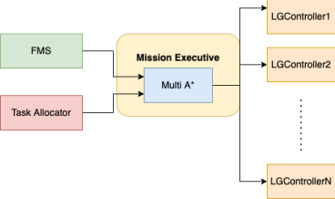

This article aims to present two competing approaches for multi robot navigation. There is a brief introduction on multi robot navigation followed by description, pros and cons of each of the two competing methods.

A multi robot navigation stack enables groups of robots to traverse around each other and navigate from their start positions to their goal locations without colliding with one another, crowding or slowing each other down. Usually the inputs to the stack are start and goal positions of each robot and some representation of the environment. Outputs of this stack are usually velocity commands that the robots can execute.

There are briefly two families of algorithms that are usually employed :
- Centralised 
- Decentalised

The choice for the above usually depends on the communication range and reliability. With good communication, a centalised method is usually more preferable and easier to get to work than a decentralised one. The scope of this article is restricted to the centralised family of algorithms.

Centralised family of algorithms can be further subdivided into two classes of approaches
- Planning based approach
- Control based approach

## Navigation Stack Design 1 : [Planning based approach](https://www.youtube.com/watch?v=K1_bagcw8Gc&themeRefresh=1)
In a planning based approach, we design and implement a centralised multi robot planner which calculates collision free trajectories for each robot in the fleet and then these are executed by each robot with a decentralised controller.


### Centralised Planner : [Prioritised Collaborative A*](https://github.com/MRSD-Team-RoboSAR/robosar_navigation)

As seen in the block diagram, most of the navigation stack runs on a centralised server apart from a low level speed controller running on the robot agents. We have a 3D Graph data structure which underneath uses a costmap to store the structure of the environment and provides a planning representation for our planner. The Planner uses this graph data structure to plan trajectories in x,y and time for each robot and then feeds these trajectories to a multi-threaded controller. The multi-threaded controller uses a classic pure pursuit formulation to generate command velocities to enable accurate tracking of the generated trajectories. The velocities are
then passed to the fleet management system which transmits them to the right agents for actual execution. 
At a high level the prioritized multi A* performs these steps in a loop to perform its task : 
```
- Assign priorities to the robot 
- for robots 1:n in order of priority 
	- Get start and goal for this robot 
	- Run A* graph search algorithm 
	- Treat previously planned robots as moving obstacles 
	- If path found, add this path to cache 
	- If path not found try again later after other robots 
```


The planner is built on top of a 3D graph which consists of nodes in x,y and time. The graph handles all the nearest neighbor searches, collision checks, distance queries and other utility functions for the planner. The graph uses a cost map of the environment to do its collision checks. The costmap inflates all the obstacles in the occupancy grid map and also assigns some cost to neutral motion to encourage planner to take the shortest paths. It also uses cached trajectories of other robots while doing the collision checks so that robots have collision free trajectories in time. The planner currently uses a manhattan distance heuristic to estimate the cost to goal. All set and map data structures are optimized using a custom 3D hash function and have an O(1) lookup time. Priorities are currently assigned to the robots arbitrary before planning and then planning is done sequentially. This is something that can be improved! An interesting finding is about relative cost of waiting in time as against moving. We found that if both moving as well as waiting have the same cost, then A* almost always prefer moving than waiting which can lead to suboptimal behavior. So as of now we have lower cost to waiting than moving which gives us better paths leads to increased search times which is undesirable. We found the paths to be very suboptimal in a 4 connected grid so we use an 8 connected grid which gives very good results but obviously also contributes to our increased search times. 


### Decentralised controller : [LGController](https://github.com/MRSD-Team-RoboSAR/robosar_controller)

Our trajectories in time include some pauses/stops along the way for avoiding collisions with other robots, so an off the shelf controller in 2D which ignores the time dimension was not going to work. So we came up with the LGController which borrows ideas from multiple different control schemes to help meet our requirements. Roughly the controller has the following components 

#### Preprocessing
- Reorient robot in the direction of the path upon entry 
- Go through the trajectory and push waypoints with a stop to a goal queue 
- Run a timer in the background to select waypoints along the trajectory 
- Create a 2D cartesian path from the 3D trajectory for pure pursuit 

#### During control 
- Compare waypoints with points in the goal queue and decide linear velocity 
- Use lookahead distance to find waypoint to track along the cartesian path 
- Use pure pursuit to generate angular corrections based on this waypoint 

We wrote a ROS action server to wrap this controller and use it with the rest of the subsystems. So during operation we have a LGController action server running per robot. So we can say that the planning is centralized but the control is completely decentralised. 



Once the planner and the controller were ready, there was a need to integrate them with the rest of the system. For this we wrote the Mission Executive class. Mission Executive does a lot of things during the operation. The first thing it is incharge of is asking the latest fleet information from the fleet management system and then setting up the controller servers for each robot in the fleet. It also listens for any changes in the fleet from the FMS and takes appropriate action based on it. It listens to tasks from the task allocation subsystem and is in charge of executing this mission. It first runs the planner on the tasks received from the task allocation. If planning was successful then the mission executive creates a ROS action client for each successful plan and then sends the planned trajectory to the appropriate controller server for execution. Then the mission executive also monitors the execution of the controller and gets ready for a new mission as soon as the controllers are done executing.

### Takeaways 

1. The Prioritised Multi A* as we know it does not guarantee completeness. Our naive heuristic also fails in very highly cluttered environments because instead of going around obstacles it can tend to wait around and hope for static obstacles to go away. So planning takes a long time. Some directions that can be considered for improving this :
	-  Use a Voronoi Graph instead of a densely connected 3D grid for planning 
	- Replace manhattan distance using a more realistic true distance heuristic function 
    - Use motion primitives with the planner instead of an 8 connected grid 
2. We found that without using the right motion primitives, robots deviate from the planned trajectories and then planning is wasted, so the planner should closely model kinematics of the robot, continous replanning at a fixed frequence could be used to alleiviate this problem
3. The controller that we implemented was a pretty basic proportional controller and it was unable to account for the execution errors
4. This Navigation stack design is appropriate for confined spaces when robots are large but operating area is narrow or robots are moving on a fixed grid, for our application we found this to not work as well as required


## Navigation Stack Design 2 : [Control based approach](https://www.youtube.com/watch?v=W_IN25bHFkQ)
In a control based approach, we plan for each robot in the fleet separately and local collision avoidance between the robot is done by a centralised controller.


### Decentralised Planner : [2D A* planner](https://github.com/MRSD-Team-RoboSAR/robosar_navigation)
Nothing fancy here, as the name suggests we are just using a 2D Astar planner for each start-goal pair which outputs a collision free path for each robot only with respect to the occupancy grid map of the environment (does not guarantee robot-robot collision avoidance). Most of the magic is happening in the centralised controller discussed next.

### Centralised Controller : [Lazy Traffic Controller](https://github.com/MRSD-Team-RoboSAR/robosar_navigation)
The Lazy Traffic controller takes in the paths from the decentralised planner and is responsible for local robot-robot collision avoidance by calculating collision free velocities for each robot. It consists mainly of two parts
- Velocity obstacles based velocity calculation
- Inter robot repulsion

At high level the basic principle is to not do extensive collision checking or planning unless explicitly required due to an immediate impending collision. How we do this is by enforcing a narrow neighborhood around each robot and doing local collision avoidance to avoid collisions in this neighborhood. This gives the controller its ‘laziness’. This local collision avoidance is implemented using the velocity obstacles algorithm. For each agent, all other agents act as obstacles in the velocity space and hence invalidate a set of velocities that this agent can execute. Velocity obstacles tries to select the best velocity as close to the preferred velocity as possible from the set of valid velocities. Preferred velocity is calculated for each agent from the global A* path found by the planner. Staying on this A* path is the preferred thing to do unless otherwise ruled out due to obstacles. 


The lazy traffic controller has many interfaces with a lot of subsystems. The LT controller talks to the fleet management system to receive updates on the status of the fleet. It talks to the SLAM subsystem to receive the latest map of the environment. It also takes the pose for each agent from the transformation tree. It advertises a controller service which is used by the Mission Executive to actually send the list of agents and their planned paths for execution by the controller. Last but not least, it advertises the controller status of each robot, so that the task allocator can assign new tasks once old ones are completed! 
Pseudocode for the LT controller can be written as : 
	- Loop through all the agents 1-n: 
		- Get path from the decentralised planner
		- Get pose from the transformation tree 
		- Calculate preferred velocity for this robot 
		- Calculate neighbouring agents for this robot
			- If any neighbours inside neighbourhood: 
				- Calculate safe velocity using velocity obstacles technique 
			- Else: 
				- Keep preferred velocity unchanged. 
        - Modify velocity using interrobot repulsion if another neighbour within repulsion radius
        
 


### Takeaways
1. This design works really well when robots have unconstrained motion around each other in 2D and robots are small in size compared to the free space around them!
2. The controller frequency had to be tuned based on the execution frequency on the robots. The execution frequency for us is around 10Hz on each robot (this is the frequency at which velocities are set on the motors). In conjunction with this we found 5Hz to be a good frequency to run the controller. So every 20ms the controller is invoked, a neighborhood and the preferred velocity is calculated and then the velocity obstacles velocity is sent to the robots. 
3. Another thing we realised was that our differential drive robots were not instantaneously achieving the velocities we were sending them, hence the velocity obstacles were using the wrong velocities in its calculations. So we decided to use **feedback velocity** from the robots with the LT controller. In short we used the odometry feedback from the robots to calculate the feedback velocity for each robot in each time interval so that velocity obstacles works more effectively.
4. The high level implementation of velocity obstacles inside the Lazy Traffic controller is in a centralised way in a sense that the server knows exactly the positions of all robots and their velocities so there is no estimation/prediction involved anywhere. But the velocity calculation is in a pretty decentralised way (because as stated in the section above, we are using feedback velocities from the robots instead of commanded velocities). This decentralised velocity calculation led to oscillations on the robots while avoiding collisions because robots were reacting to each other. We modified the cost function to solve this by adding a term to penalize large change in velocities with respect to the current feedback velocity. So the new cost function we are left with looks like this : 

`float penalty = RVO_SAFETY_FACTOR/min_t_to_collision + dist_to_pref_vel + dist_to_cur_vel`

These three terms ensure collisions are avoided, a velocity as close to the preferred velocity is chosen every time and large changes in currently chosen velocity direction are also minimized.


## Summary
1. We compared two competing approaches for centralised multi robot navigation and found the control based approach to work better
2. We discussed design of each and pros and cons of both the approaches
3. We hope this discussion provides a good foundation for the design of multi robot navigation stacks of MRSD in the future!

