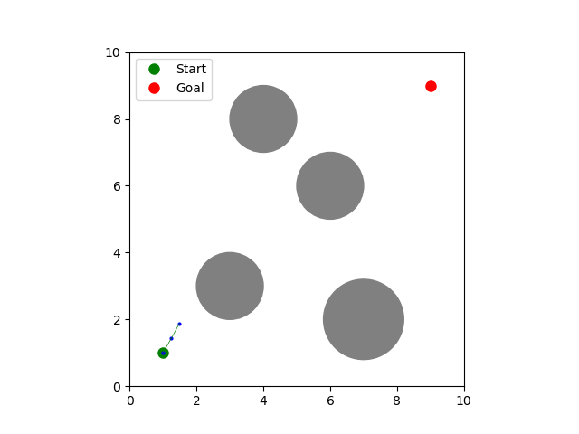
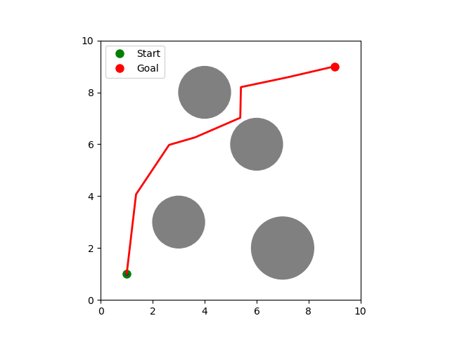

## Introduction

This article explores implementations of sampling-based motion planning algorithms using Rapidly-Exploring Random Trees (RRT) and Probabilistic Roadmaps (PRM), with a focus on practical enhancements such as goal biasing, path smoothing, and multi-agent coordination. These planners are particularly useful in robotic arm and multi-agent system applications where dynamic or repeated pathfinding in constrained environments is needed.

The implementations covered here also include visualizations to demonstrate algorithmic behavior and convergence. Readers will gain insight into choosing and modifying planners based on environment type, planning frequency, and task requirements.

## Planning Algorithms and Key Concepts

We implemented four widely studied sampling-based planners, each suited to different planning scenarios. They are unified under a common abstract base class for flexibility and testing.

### RRT (Rapidly-Exploring Random Trees)

RRT incrementally builds a tree by sampling random points and extending the nearest existing node toward the sample. It is:
- Fast and suitable for single-query tasks.
- Effective in high-dimensional or dynamic spaces.
- Easily extendable with features like goal biasing and smoothing.

### RRT\* (Optimal RRT)

RRT\* extends RRT by considering cost during tree expansion. It uses a radius-based neighborhood check to:
- Select the best parent based on cumulative cost.
- Rewire existing connections for optimality.
- Achieve asymptotically optimal paths over time.

### PRM (Probabilistic Roadmap)

PRM samples the configuration space ahead of time, building a reusable roadmap:
- Suited for static, multi-query environments.
- Builds a graph using k-nearest neighbors with local path validation.
- Uses Dijkstra’s algorithm or A* for query resolution.

### Lazy PRM

Lazy PRM postpones collision checks:
- Constructs the roadmap assuming all edges are valid.
- Performs edge validation only during path extraction.
- Efficient for large maps with sparse valid paths.

## Enhancements and Utilities

Several improvements were made to optimize path planning:

### Goal Biasing
Improves convergence by probabilistically sampling the goal. Ideal for planners like RRT that can benefit from directed growth.

```python
def add_goal_bias(planner, bias=0.1):
    if not hasattr(planner, 'get_random_point'):
        return
    
    original_random = planner.get_random_point
    
    def biased_random():
        if np.random.random() < bias:
            return planner.goal
        return original_random()
    
    planner.get_random_point = biased_random
```

### Goal Tolerance
If a node is sufficiently close to the goal, a direct connection is attempted. This accounts for planners where exact goal matching may not occur due to step-size limits.

```python
def enforce_goal_tolerance(planner, path, tolerance=0.7):
    if path is None or len(path) == 0:
        closest_node = min(planner.nodes, key=lambda n: np.linalg.norm(n - planner.goal))
        if np.linalg.norm(closest_node - planner.goal) <= tolerance and not planner.is_collision(closest_node, planner.goal):
            if isinstance(planner, (RRT, RRTStar)):
                idx = planner.nodes.index(closest_node)
                new_path = []
                while idx is not None:
                    new_path.append(planner.nodes[idx])
                    idx = planner.parent.get(idx, None)
                return new_path[::-1] + [planner.goal]
        return None

    last_node = path[-1]
    if np.linalg.norm(last_node - planner.goal) <= tolerance and not planner.is_collision(last_node, planner.goal):
        return list(path) + [planner.goal]
    return path
```

### Path Shortening
Redundant waypoints are removed post-planning using shortcutting:

```python
for _ in range(iterations):
    i = np.random.randint(0, len(path)-2)
    j = np.random.randint(i+2, len(path))
    if not planner.is_collision(path[i], path[j]):
        path = path[:i+1] + path[j:]
```

This significantly reduces travel time and complexity.

## Multi-Agent Planning Framework

We developed a function `animate_multi_agent_aware()` to demonstrate planning for multiple agents in a shared space. Key features:

1. **Agent 1 Planning**: Plans normally using a planner of choice, then smooths the path.
2. **Agent 2 Awareness**: Treats Agent 1's path as dynamic obstacles and plans around it with a planner of choice.
3. **Biasing & Tolerance**: Goal biasing and tolerances ensure Agent 2 still reaches the target.

This is particularly useful for:
- Coordinated manipulation tasks.
- Mobile robot fleets in shared warehouses.
- Human-robot interaction with space sharing.

## Planner Comparisons and Visual Demonstrations

The following section presents visual demonstrations of several planning algorithms applied to both single-agent and multi-agent scenarios. These examples illustrate how different planners behave in cluttered environments and how their characteristics influence their performance and ideal applications.

### Single-Agent Planning

In the first demonstration, we apply the **RRT (Rapidly-Exploring Random Tree)** algorithm to a single-agent navigation problem.

 <!-- Replace with actual path -->

RRT is known for its speed and simplicity, making it a popular choice for generating feasible paths quickly in high-dimensional or dynamic environments. In this case, RRT effectively explores the space and reaches the goal, although the resulting path contains unnecessary detours and sharp turns. This limitation stems from RRT’s lack of cost optimization or path refinement. However, in scenarios where a robot simply needs to reach a goal as fast as possible—such as a drone avoiding obstacles in real time or a mobile robot rerouting during emergencies—RRT’s raw efficiency becomes a strength, and its path quality limitations are acceptable.

In contrast, the **PRM (Probabilistic Roadmap)** planner takes a different approach.

 <!-- Replace with actual path -->

Rather than growing a tree, PRM builds a roadmap by sampling random points and connecting them to their neighbors. The advantage here is that once the roadmap is constructed, multiple path queries can be answered quickly. This makes PRM ideal for environments where the obstacles remain static and the robot must plan paths repeatedly—for instance, a robotic arm operating on an assembly line. However, PRM has a high upfront computation cost and is poorly suited to dynamic environments or tasks where immediate replanning is needed. In our visualization, the roadmap forms a dense graph that yields a feasible path, albeit not always the most direct.

To improve both path quality and reliability, **RRT\*** introduces optimization to the RRT framework.

 <!-- Replace with actual path -->

RRT\* selects parent nodes based on cumulative path cost and performs local rewiring to iteratively reduce overall cost. The result is a much smoother and shorter trajectory, especially when allowed to run for more iterations. This makes RRT\* particularly suitable for applications where efficiency and path quality matter, such as robotic manipulation or long-range navigation. Although it requires more computation than RRT, the tradeoff is worthwhile in structured or semi-structured environments. In our demonstration, RRT\* quickly finds a path and then refines it, making it a better candidate than RRT when time allows.

The final single-agent example uses **Lazy PRM**, a variation that delays collision checking until a path is proposed.

 <!-- Replace with actual path -->

This strategy speeds up roadmap construction in complex environments by assuming all edges are valid and only checking them during query time. In our test case, Lazy PRM rapidly builds a large graph, and although a few initial paths are invalid due to obstacles, it quickly retries until a valid one is found. Lazy PRM is especially useful when dealing with large configuration spaces or expensive collision checks—for example, planning paths for complex robot configurations where each collision test is computationally heavy. While it may fail occasionally due to poor connectivity assumptions, these failures are usually acceptable in contexts where roadmap updates are inexpensive or infrequent.

### Multi-Agent Planning

In multi-agent environments, coordination becomes a central challenge. We first demonstrate a hybrid strategy where the first agent uses **PRM** and the second uses **RRT**.

 <!-- Replace with actual path -->

This combination leverages the strengths of both algorithms. PRM efficiently generates a path for the first agent in a static roadmap, while RRT allows the second agent to dynamically plan around it by treating the first agent’s path as a series of temporary obstacles. This setup is particularly effective in semi-cooperative tasks—such as a warehouse robot avoiding a robotic arm’s workspace—where one agent has a predictable role and the other must adapt on the fly. While the RRT agent’s path may not be optimal, this doesn’t hinder performance because the primary requirement is conflict avoidance, not minimal travel time.

In the second multi-agent example, we combine **RRT\*** for the first agent with **RRT** for the second.

 <!-- Replace with actual path -->

Here, the first agent finds a high-quality, optimized path, while the second agent reacts to it in a more opportunistic manner. This setup is ideal when one agent’s role or path is mission-critical—such as a robotic arm executing a precision task—while the other simply needs to move without interfering. The use of RRT\* ensures the primary path is both smooth and efficient, while RRT provides the secondary agent with flexibility and responsiveness. Although this method doesn’t explicitly handle timing or temporal collisions, adding buffers or dynamic obstacle inflation mitigates most of these issues in practice.

These demonstrations make clear that each planner offers different trade-offs. RRT is fast and flexible, RRT\* improves quality, PRM enables reuse, and Lazy PRM excels in expensive or sparse environments. For multi-agent scenarios, hybrid strategies enable more scalable coordination without requiring fully centralized planning or time synchronization. Choosing the right combination depends not just on path quality, but also on responsiveness, predictability, and environmental dynamics.

Our multi-agent framework is designed for flexibility—either agent can use any of the four planners (RRT, RRT\*, PRM, or Lazy PRM), allowing for rapid experimentation and strategy adaptation based on task requirements.

### Planner Comparison Table

| Planner     | Query Type     | Environment Type | Optimality         | Planning Time    | Notes                                         |
|-------------|----------------|------------------|--------------------|------------------|-----------------------------------------------|
| **RRT**     | Single-query    | Dynamic           | No                 | Fast             | Great for fast, reactive planning             |
| **RRT\***   | Single-query    | Semi-dynamic      | Asymptotically Optimal | Moderate/Slow | Produces smoother, shorter paths over time   |
| **PRM**     | Multi-query     | Static            | No (basic PRM)     | Slow (initial)   | High upfront cost but fast for repeated queries |
| **Lazy PRM**| Multi-query     | Static            | No                 | Fast (initial), Slower (query) | Efficient with expensive collision checks     |

This table is intended as a quick reference for selecting the appropriate planner based on the task setting and constraints. For instance:
- **RRT** excels in environments that change frequently and need on-the-fly planning.
- **PRM** and **Lazy PRM** are better suited for applications like repetitive pick-and-place tasks where the environment is known ahead of time.
- **RRT\*** is best when both path quality and flexibility are required but computation time is acceptable.

## Summary

We implemented and tested several RRT and PRM variants, extended them with planning utilities, and demonstrated multi-agent coordination. These algorithms, enhanced with goal biasing and path smoothing, offer practical and adaptable solutions for both single-robot and multi-agent applications.

## See Also:
- [Planning Overview](https://roboticsknowledgebase.com/wiki/planning/planning-overview/)
- [A* Implementation Guide](https://roboticsknowledgebase.com/wiki/planning/astar_planning_implementation_guide/)
- [Multi Robot Navigation Stack Design](https://roboticsknowledgebase.com/wiki/planning/multi-robot-planning/)

## Further Reading
- LaValle, S. M. "Planning Algorithms." (Available online: http://planning.cs.uiuc.edu/)
- Karaman, S., and Frazzoli, E. "Sampling-based algorithms for optimal motion planning." *IJRR*, 2011.
- Kavraki, L. E., Švestka, P., Latombe, J.-C., Overmars, M. H. "Probabilistic roadmaps for path planning in high-dimensional configuration spaces." *IEEE TRO*, 1996.

## References
- [1] S. M. LaValle, *Planning Algorithms*, Cambridge University Press, 2006.
- [2] S. Karaman and E. Frazzoli, “Sampling-based algorithms for optimal motion planning,” *The International Journal of Robotics Research*, vol. 30, no. 7, pp. 846–894, 2011.
- [3] L. E. Kavraki et al., “Probabilistic roadmaps for path planning in high-dimensional configuration spaces,” *IEEE Transactions on Robotics and Automation*, 1996.