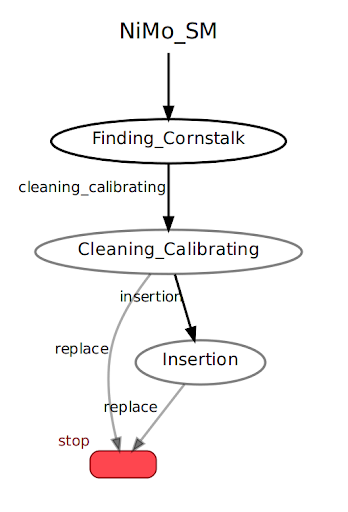

---
# Jekyll 'Front Matter' goes here. Most are set by default, and should NOT be
# overwritten except in special circumstances. 
# You should set the date the article was last updated like this:
date: 2024-02-12 # YYYY-MM-DD
# This will be displayed at the bottom of the article
# You should set the article's title:
title: SMACH Library Overview
# The 'title' is automatically displayed at the top of the page
# and used in other parts of the site.
---

This article provides a comprehensive overview of the SMACH library, which stands for "state machine," a foundational concept in robotics and automation. A Finite State Machine (FSM) is a mathematical model used to represent and manage a system's state transitions. It consists of a defined set of states, including the initial and current states, as well as inputs or events that trigger transitions between these states. In the context of robotics, FSMs are crucial for enabling robots to perform sequences of actions and respond dynamically to changes in their environment.

SMACH is a powerful and versatile task-level architecture designed to simplify the creation of complex robotic behaviors. While it is often used in conjunction with the Robot Operating System (ROS), SMACH is a ROS-independent Python library. This flexibility allows developers to use it across various robotic platforms. One of the defining features of SMACH is its ability to construct hierarchical state machines, enabling developers to break down complex behaviors into simpler, more manageable components. This hierarchical structure helps ensure that high-level tasks are achieved by coordinating a series of smaller, well-defined sub-tasks.

SMACH leverages well-established principles of software engineering to provide a framework that supports rapid development of robust, maintainable, and modular robotic systems. The library's modularity allows developers to create reusable components, making it easier to adapt and scale robotic systems as project requirements evolve. Furthermore, SMACH emphasizes maintainability by providing a clean and organized structure for defining and managing states and transitions, reducing the likelihood of errors and making it easier to troubleshoot and debug systems.

In this article, we will briefly explain how to use the SMACH library with ROS to design, implement, and test state machines for robotic applications. By following the concepts and examples provided, readers will gain insights into the capabilities of SMACH and learn how to integrate it into their own robotic projects to achieve sophisticated, task-level behaviors.

## Key Features
* Hierarchical State Machines: SMACH offers a robust framework for designing and implementing hierarchical state machines, which are particularly well-suited for managing complex behaviors. By structuring states and transitions in a clear and organized manner, SMACH allows developers to break down intricate systems into manageable layers. This hierarchical approach simplifies the implementation of sophisticated systems by ensuring that high-level behaviors are composed of simpler, more focused sub-behaviors.

* Modularity and Maintainability: One of the core strengths of SMACH lies in its emphasis on modularity and maintainability. The library encourages developers to write modular code that can be easily maintained and reused. This design philosophy makes it possible to build complex systems by integrating smaller, independent modules seamlessly. As a result, developers can focus on developing each component in isolation and later assemble them into a cohesive system, reducing the risk of errors and increasing code maintainability over time.

* Rapid Prototyping: SMACH's straightforward, Python-based syntax enables developers to quickly prototype and test state machines. This ease of use is especially advantageous for iterative development and experimentation, where rapid feedback loops are essential. Developers can create, modify, and refine state machines efficiently, accelerating the development process and allowing more time to focus on fine-tuning the system's performance and functionality.

* Introspection Tools: SMACH provides a suite of powerful introspection tools that are invaluable for monitoring and debugging state machines. These tools allow developers to observe state transitions, track data flow between states, and gain a comprehensive understanding of the overall system's behavior. By offering real-time insights into the internal workings of the state machine, these introspection tools help identify and resolve issues quickly, ensuring that the system performs as intended.

## Use Cases
SMACH is a powerful tool particularly suited for scenarios where robots are required to execute complex, predefined plans consisting of explicitly defined states and transitions. It shines in applications where robotic systems, such as mobile robotic manipulators, must handle coordinated task execution in a structured and predictable manner. By organizing tasks into hierarchical state machines, SMACH provides a robust framework for managing behaviors and ensuring smooth execution of intricate workflows. Its compatibility with Python and integration with ROS make it a convenient choice for developers working on mid- to high-level robot control systems.

### When to use SMACH
* Structured Tasks: SMACH is most effective in environments where tasks can be distinctly defined and organized into well-structured states and transitions. For instance, it is ideal for use in robotic systems tasked with repetitive or step-by-step processes, such as automated assembly lines, logistics, or service robots performing routine tasks.
* Complex Systems: SMACH is highly suitable for managing large-scale hierarchical state machines in robotic applications. It enables developers to design, maintain, and debug complex systems with multiple interdependent modules, ensuring that the overall system remains modular, manageable, and scalable. The introspection tools provided by SMACH further enhance its usability by offering a clear view of state transitions and data flow, facilitating debugging and optimization.

### When not to use SMACH
* Unstructured Tasks:  For robotic systems operating in unstructured or highly dynamic environments where tasks lack a clear definition or require constant adaptation, SMACH may not be the ideal choice. In such cases, more flexible frameworks or learning-based approaches may be better suited to handle the inherent uncertainty and variability.
* Low-Level Systems: SMACH is not designed for low-level control tasks where real-time performance and high efficiency are crucial. Tasks such as motor control, sensor data processing, or other time-sensitive operations often require lightweight, real-time-capable solutions that are optimized for performance, making SMACH less suitable in such scenarios.

While SMACH can be used to build finite state machines, its capabilities extend beyond that. It provides various "state containers" that can encapsulate other state machines or be part of larger containers themselves. This flexibility allows developers to construct intricate systems with nested state hierarchies

## Writing a Simple State Machine


The above image describes a state machihne which has three main states - Finding_Cornstalk, Cleaning_Calibrating and Insertion. The outcome of each state is the flag indicating the transition to the next state. The State Machine starts with Finding_Cornstalk state and ends when the output of any state is 'Stop'. Below is a skeleton code of how this state machine programming will look like - 

```
# define state Finding_Cornstalk
class finding_cornstalk(smach.State):
       def __init__(self):
           smach.State.__init__(self, outcomes=['cleaning_calibrating'])
   
       def execute(self, userdata):
           rospy.loginfo('Executing state Finding_Cornstalk')
            return 'cleaning_calibrating'
   
   
# define state Cleaning_Calibrating
class cleaning_calibrating(smach.State):
       def __init__(self):
           smach.State.__init__(self, outcomes=['insertion','replace'])
           self.counter = 0
   
       def execute(self, userdata):
           rospy.loginfo('Executing state Cleaning_Calibrating')
           if self.counter < 3:
               self.counter += 1
               return 'insertion'
           else:
               return 'replace'
           
# define state Insertion
class insertion(smach.State):
       def __init__(self):
           smach.State.__init__(self, outcomes=['replace'])
   
       def execute(self, userdata):
           rospy.loginfo('Executing state Insertion')
           return 'replace'
   
   
   
   def main():
       rospy.init_node('smach_example_state_machine')
   
       # Create a SMACH state machine
       sm = smach.StateMachine(outcomes=['stop'])
   
       # Open the container
       with sm:
           # Add states to the container
           smach.StateMachine.add('finding_cornstalk', finding_cornstalk(), 
                                  transitions={'cleaning_calibrating':'cleaning_calibrating'})
           smach.StateMachine.add('cleaning_clibrating', cleaning_calibrating(), 
                                  transitions={'insertion':'insertion', 'replace':'stop'})
           smach.StateMachine.add('insertion', insertion(), 
                                  transitions={'insertion':'stop'})
            
   
       # Execute SMACH plan
       outcome = sm.execute()
   
if __name__ == '__main__':
       main()
```

### Code Breakdown
* A state machine is created with smach.StateMachine, and the final outcome is defined as stop.
Three states (Finding_Cornstalk, Cleaning_Calibrating, and Insertion) are added to the state machine:
Transitions define how the states flow into each other:
Finding_Cornstalk → Cleaning_Calibrating
Cleaning_Calibrating → Insertion (up to 3 times) or stop
Insertion → stop.
* The main() function initializes the ROS node and executes the state machine plan (sm.execute()).
The workflow begins in the Finding_Cornstalk state and progresses through the defined states based on the transitions.
* The robot starts in the Finding_Cornstalk state and transitions to Cleaning_Calibrating.
In Cleaning_Calibrating:
It transitions to Insertion for up to 3 cycles.
After 3 cycles, it transitions to stop.
The Insertion state executes once, and the robot stops.

## Conclusion
SMACH's documentation provides comprehensive guidance on its concepts and usage. The tutorials available are extensive, designed to help users quickly get up to speed with building and running their own state machines. These resources are invaluable for both beginners and experienced developers looking to leverage SMACH's capabilities in their projects.
SMACH stands out as a powerful tool in the ROS ecosystem for developing complex robotic behaviors through hierarchical state machines. Its emphasis on modularity, maintainability, and rapid prototyping makes it an attractive option for developers working on sophisticated robotic applications. However, its use is best suited for structured tasks at the task level rather than low-level system control or highly unstructured environments.

## References
- [SMACH Library](https://wiki.ros.org/smach)
- [SMACH Documentation](https://wiki.ros.org/smach/Documentation)
- [State Machine Example](https://wiki.ros.org/smach/Tutorials/Simple%20State%20Machine)