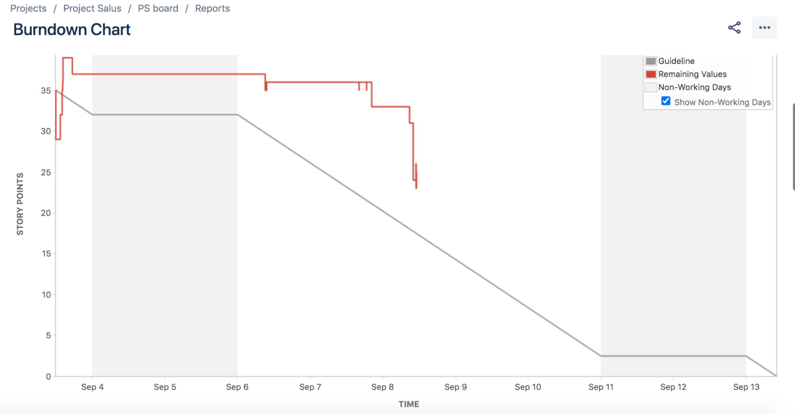
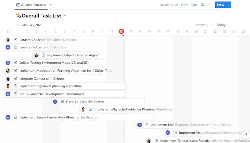
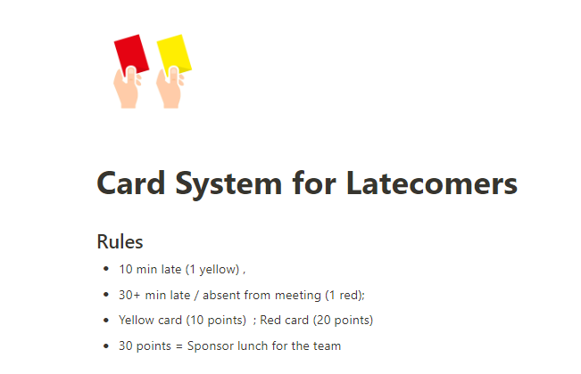
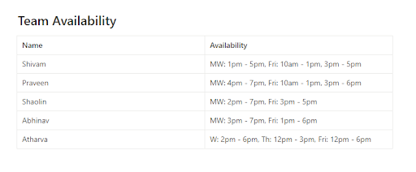

/wiki/project-management/drone-flight-permissions/
---
date: 2020-04-10
title: Drone Flight Permissions
published: true
---

This article discusses the laws and regulations of flying small drones for the MRSD project. It details the process to fully certify your drone and obtaining flight permissions from the Federal Aviation Administration (FAA) and Carnegie Mellon University (CMU). Furthermore, the article disucsses the rules for two registration categories. For most projects, students should consider the Recreational Fliers ruleset that does not require pilot licensure. Projects that need special flight permissions, or are pursuing further funding, should consider the Part 107 ruleset. 

## Background

The FAA regulates the operation of all drones due to the recent surge in Unmanned Aircraft Systems (UAS). Due to the rapidly evolving environment around drone use, this entry is only guaranteed to be accurate as of April 6, 2020. Any reader passed this date should use this entry only as a guide and reference before confirming current regulations. CMU maintains a drone information page which should be referenced for a summary of up-to-date information: [https://www.cmu.edu/ogc/Guidance/drones](https://www.cmu.edu/ogc/Guidance/drones).

There are two major categories under which students should consider when flying during the MRSD project. The first is flying under the FAA's Small UAS Rule (Part 107). This flight category allows the most freedom in flying, but also requires more thorough registration and licensing. The second is flying as a Recreational Fliers or as part of a Modeler Community-Based Organization. This categorization offers few flight permissions but is easily obtainable and suitable for many MRSD applications. A summary from the FAA rules applicable to education users can be found here: [https://www.faa.gov/uas/educational_users](https://www.faa.gov/uas/educational_users)

### Fly as a Recreational Fliers or as part of a Modeler Community-Based Organization

Flying as a recreation flier is the rule set that most MRSD students should consider for the project. Under this ruleset, students can fly drones under the guidance of Carnegie Mellon University without obtaining any sort of pilot’s license. The key caveat is students can only fly under this categorization if they “fly only for recreational purposes.” The MRSD project can satisfy this requirement because it is not directly related to a professor’s sponsored research, and all funding relating to the project is not for financial gain. As such, the project can largely be described as recreational. Students looking to commercialize their MRSD project, or wanting to otherwise fly outside of these rules, should consider flying under Part 107. 

When flying under this category, abide by the following rules:
1. Fly only for recreational purposes
2. Fly at or below an altitude of 400 feet.
3. Fly only over CMU property, or property that you own.**
4. Maintain a direct line-of-sight with the drone, or within line-of-sight of a visual observer, who can see the drone.
5. Fly only during the day, or at twilight if installed lights on the drone clearly distinguish its pose.
6. Never fly over any person or vehicle.
7. Give right of way to all manned aircraft.
8. Do not interfere with emergency response activities.
9. Never fly under the influence of drugs or alcohol.
10. Do not operate the drone in a careless or reckless manner.

** If you want to fly over any other land, including parks, contact the property owner and discuss flight operations before use.

These rules are all subject to change and should be reviewed at the beginning of every Fall semester. A major change likely coming in the near future will include an online test to certify all operators. Additional rules are included in the Part 107 categorization and likely also apply to recreational fliers despite not being explicitly stated.

### Fly Under Part 107

Part 107 is the main law for all small drone operations. It allows operators to fly anywhere allowable by local laws. Part 107 flying MRSD students should also consider this option if they’re planning on commercializing their project.

In addition to the recreational fliers rules, Part 107 includes several other rules that most likely apply, but are not explicitly stated under the “Recreational Fliers” page.

1. Operate only a single aircraft at a time.
2. Do not fly under a covered structure, or inside of a covered stationary vehicle.
3. Maintain an airspeed below 100 mph.
4. You can only carry an external load if it does not adversely affect the flight characteristics or controllability of the aircraft. Only transport property for compensation within state boundaries, and ensure the entire weight of the aircraft and payload is below 55 pounds.

Any teams needing to fly outside of these rules should consider applying for a Part 107 waiver from the FAA. In order to receive permission, operators must demonstrate they can safely deviate from the operational parameters and maintain flight safety using alternative methods. Waiver options include the following:

- Fly over a person or people.
- Fly from a moving aircraft or vehicle in populated areas.
- Fly at night.
- Fly beyond visual line of sight.
- Fly without a visual observer.
- Fly multiple drones simultaneously.
- Fly in controlled airspace.

## Procedures

### Fly as a Recreational Fliers or as part of a Modeler Community-Based Organization
1. Register the drone at https://faadronezone.faa.gov/#

  a. Select: “I Fly Under the Exception for Recreational Fliers”
  
  b. The registration fee is $5, and you will need the drone’s serial number
  
  c. Mark the drone with the registration number

2. Request permission from CMU’s legal department

  a. Email drones@andrew.cmu.edu and fill out the form they send you.

    - Emphasize the project only receives funding to provide materials.
    - Be specific with the use case and flight parameters. Areas students typically want to fly include the athletic fields, the Cut, and the Mall.

3. Discuss/Meet with the departments that control the space where you want to fly.

Our team decided to fly over the football and/or soccer fields because they are open spaces. As such, we were directed to meet with the Associate Director of Athletics (Sara Gauntner). During our meeting, she recommended flying in the mornings or on weekends to avoid high pedestrian traffic. She asked us to check 25-Live to ensure the fields are not scheduled during our testing time and email her to reserve the fields. If any pedestrian does not respect our testing space, we can contact Sara, who will remove them from the field.

### Fly Under Part 107
In addition to the Recreational Fliers registrations, Part 107 operators must become an FAA-Certified Drone Pilot. This process should take place before registering the drone because your pilot number is required for Part 107 drone registration.

#### Pilot Certification Process:
1. Obtain an FAA Tracking Number (FTN) by creating an Integrated Airman Certification and Rating Application (IACRA) profile prior to registering for a knowledge test.
2. Schedule an appointment with a Knowledge Testing Center which administers initial and recurrent FAA knowledge exams. Be sure to bring a government-issued photo ID to your test.
3. Pass the initial aeronautical knowledge test. Knowledge test topic areas include:

  - Applicable regulations relating to small unmanned aircraft system rating privileges, limitations, and flight operation
  -   Airspace classification and operating requirements, and flight restrictions affecting small unmanned aircraft operation
  -   Aviation weather sources and effects of weather on small unmanned aircraft performance
  -   Small unmanned aircraft loading and performance
  -   Emergency procedures
  -   Crew resource management
  -   Radio communication procedures
  -   Determining the performance of small unmanned aircraft
  -   Physiological effects of drugs and alcohol
  -   Aeronautical decision-making and judgment
  -   Airport operations
  -   Maintenance and preflight inspection procedures

 > For test preparation materials, see the Further Readings

4. Complete FAA Form 8710-13 for a remote pilot certificate (FAA Airman Certificate and/or Rating Application) using the electronic FAA Integrated Airman Certificate and/or Rating Application system (IACRA)*

  1. Register using the FAA IACRA system
  1. Login with username and password
  1. Click on "Start New Application" and 
  1.  Application Type "Pilot"
  1. Certifications "Remote Pilot"
  1. Other Path Information
  1. Start Application
  1. Follow application prompts
  1. When prompted, enter the 17-digit Knowledge Test Exam ID (NOTE: it may take up to 48 hours from the test date for the knowledge test to appear in IACRA)
  1. Sign the application electronically and submit for processing.

5. A confirmation email will be sent when an applicant has completed the TSA security background check. This email will provide instructions for printing a copy of the temporary remote pilot certificate from IACRA.

6. A permanent remote pilot certificate will be sent via mail once all other FAA-internal processing is complete.

7. Have your Remote Pilot Certificate available whenever you fly your UAS

## Summary
Obtaining all flight permissions and registrations under the Recreational Fliers ruleset is a straightforward procedure sufficient for most MRSD projects. If you have any questions about which ruleset you should follow, contact drones@andrew.cmu.edu for guidance. For up to date information, check the CMU drone's page at [https://www.cmu.edu/ogc/Guidance/drones](https://www.cmu.edu/ogc/Guidance/drones) and review the FAA Information under Further Reading.

## Further Reading

### Part 107 Exam Material

[https://www.faa.gov/uas/resources/policy_library/#107](https://www.faa.gov/uas/resources/policy_library/#107)
 
[https://www.faa.gov/regulations_policies/handbooks_manuals/aviation/media/remote_pilot_study_guide.pdf](https://www.faa.gov/regulations_policies/handbooks_manuals/aviation/media/remote_pilot_study_guide.pdf)

  [https://faa.psiexams.com/faa/login](https://faa.psiexams.com/faa/login)
  
  [https://www.kingschools.com/free-faa-exam/drone-pilot](https://www.kingschools.com/free-faa-exam/drone-pilot)
  
  [https://jrupprechtlaw.com/part-107-test-study-guide/#first](https://jrupprechtlaw.com/part-107-test-study-guide/#first)

### FAA Information

[https://www.faa.gov/uas/recreational_fliers](https://www.faa.gov/uas/recreational_fliers)

[https://www.faa.gov/uas/media/Part_107_Summary.pdf](https://www.faa.gov/uas/media/Part_107_Summary.pdf)

[https://www.faa.gov/news/fact_sheets/news_story.cfm?newsId=22615](https://www.faa.gov/news/fact_sheets/news_story.cfm?newsId=22615)

[https://www.faa.gov/uas/commercial_operators/part_107_waivers](https://www.faa.gov/uas/commercial_operators/part_107_waivers)

[https://www.faa.gov/uas/commercial_operators/](https://www.faa.gov/uas/commercial_operators/)

[https://www.faa.gov/uas/commercial_operators/become_a_drone_pilot/](https://www.faa.gov/uas/commercial_operators/become_a_drone_pilot/)

/wiki/project-management/jira/
---
# Jekyll 'Front Matter' goes here. Most are set by default, and should NOT be
# overwritten except in special circumstances.
# You should set the date the article was last updated like this:
date: 2021-11-28 # YYYY-MM-DD
# This will be displayed at the bottom of the article
# You should set the article's title:
title: Jira Agile Development
# The 'title' is automatically displayed at the top of the page
# and used in other parts of the site.
---

JIRA is a product management tool developed by Atlassian Inc. that can be used to track work and manage an agile project. All of the work to be done is logged in a centralized location for other members of the team to see.

A ticket is something that needs to be worked on. Often a ticket is assigned to an individual to work on it.

 Here is [a link](https://www.beargroup.com/ideas/tutorials/ticketing-web-development) goes through a detailed idea as to what should be included on the ticket

>  Do what is best for the team. Jira is a powerful tool that has the ability to cause extra work and detract from the development process. Below are some suggestions on how to use Jira, but do what allows your team to succeed.

#### Pricing
There is a free option of Jira that also allows up to 10 users. This works well for an MRSD project.

More information about Jira pricing can be found at <https://www.atlassian.com/software/jira/pricing>

#### Jira + Agile
Jira is used to manage sprints. A sprint is a short period of time where the team completes a small allotted amount of work. Using sprints allows a team to respond to changes quickly and improve their product rapidly. Sprints can be customized to be either 1, 2, 3 or 4 weeks. Usually, we have used 1-2 week sprints based on our milestones. These sprints are typically visualized on Jira Boards.

#### Jira Active Sprints

Jira active sprints demonstrate the work the team sets out to complete. They usually are represented as Jira workflows. A Jira workflow is the transition of statuses that would move a ticket from To Do to Done. The workflows are customizable. Each column on a Jira board represents different stages of the workflow. An example of a basic workflow would be To Do → In Progress → In Review → Done. Each column on the Jira board would represent a different status. Statuses should be clear as to the progress of the ticket in its column. Typically the different stages are defined as:

*Backlog*: Work to be completed. Usually not portioned out into a sprint yet

*Todo*: Work to be completed this sprint. This work has not been started.

*In Progress*: Work that has been started but not put up for review yet.

*In Review*: Work that has been completed but not peer-reviewed/Pull Requested.

*Done*: Completed work.

#### Jira Tickets
The Jira Kanban board/active sprint board is usually broken down into tickets. A Jira ticket holds information about the work needed to be completed.  Jira tickets can include:

*Issue Type*: More details below.

*Summary*: the title of the ticket. This title is what appears on the ticket on the Jira board.

*Attachments*: The attachments usually work best to add design pictures or logs.

*Description*: This is the location that the user stories go. A description of the work to be done. Different teams design the description block differently. Usually, the requirements to complete the ticket should be clearly outlined.

*Reporter*: Person who created the ticket. Usually, the person that questions the requirements should be directed to.

*Linked Issues*: This is where to indicate if certain tickets are blocking or if this ticket blocks other tickets. It allows the work to be completed on an appropriate timeline, and help to highlight the order in which tickets must be worked on

*Assignee*: The person to complete the work.

*Priority*: The priority of this work. How important this ticket is compared to the others in this sprint.
Epic Link: (Story only) The epic this ticket belongs to.

*Sprint*: The sprint this work is to be completed in.

#### Issue Type

Tickets are designated different types to indicate what work needs to be done. The main types of tickets are bugs, tasks, and epics.

This link details the different types of tickets and how to assign them:
<https://wiki.onap.org/display/DW/Epic%2C+Story%2C+Task+and+Bugs>

*Epics*: Epics are large chunks of work that usually, but not necessarily, span over multiple sprints. They typically represent a feature or subsystem. They tend to be large themes or goals for the teams to complete. Epics are usually broken down into stories.

*Story*: Stories often represent requirements to complete an epic.

*Tasks*: This usually represents a technical activity like creating a diagram or testing a system.

*Bugs*: Tickets designed to represent bugs that should be fixed during the sprint.

Our team has created epics based on our work breakdown structure. For example, an epic we have created is Designing the Perception System. The design perception system epic contained several tickets in the form of stories. An example of one of the stories from this epic is `Create a design document to improve object detection.`   

#### Jira Story Points

Story points are usually used to estimate work. In particular the amount of work that a particular story is expected to be. There are multiple methods to estimate work. Each method has positives and negatives, so the method used is often team-dependent.

Each person usually has a maximum allotted number of story points to complete a sprint.

#### Jira Roadmaps

Jira has the capability to create roadmaps or schedules based on epics. This allows the Project manager to plan multiple weeks at a time.

#### Jira + Github Integration
This is a free functionality that allows Jira to integrate with Github. Once you follow the steps indicated in this link to set up the integration:

<https://support.atlassian.com/jira-cloud-administration/docs/integrate-with-github/>

This gives the ability to see Github information inside a Jira ticket.

To attach a branch to a Jira ticket, you will need to include the ticket name. For example:

If PS-223 is the ticket number, we would need to name our branch something like `feature/PS-223-write-logger` for it to link.  Adding PS-223 connects the branch to the PS-223 ticket. This will allow the Jira ticket to display the number of branches and pull requests. Note! It needs to contain the ticket number with the format “BOARD-###” otherwise it will not link.

#### Jira Automation
Jira has the ability to automate activities that are done often through triggers and rules. There are multiple options including custom options. One possibility is when a branch is created for a ticket that is in “TODO” then Jira should move the ticket to in progress. Another example would be when all the pull requests are closed for a Jira ticket, Jira should move the ticket to the done column.

These examples allow for the Jira board to stay up to date without developer intervention.

Some more example automation possibilities can be found here:
<https://www.atlassian.com/software/jira/guides/expand-jira/automation-use-cases>

#### Burndown Chart

The burndown chart is a popular chart among project managers. This allows the PM to view how the work is progressing over a sprint and the work is not falling behind.  It displays the days in the sprint by the story points allocated for that sprint. This can be found in Reports → Burndown Chart. The goal is to have the remaining work track the Guideline.

## Summary
In summary, Jira is a powerful tool for agile development. There are numerous features that can help a project be propelled to success. This article only lists a few features. Use whichever features work best for your team.

## See Also:
- To learn more about project management see [Product Development in Complex System Design](https://roboticsknowledgebase.com/wiki/project-management/product-development-complex-systems/)

## Further Reading
- Learn more about the basics of Jira [here](https://www.guru99.com/jira-tutorial-a-complete-guide-for-beginners.html). In addition,[this website](https://wiki.onap.org/pages/viewpage.action?pageId=6592023) provides practical usage suggestions.

## References
[1] Atlassian, “Jira pricing - monthly and annual subscription cost per user,” Atlassian. [Online]. Available: <https://www.atlassian.com/software/jira/pricing>. [Accessed: 28-Nov-2021].

[2] Atlassian, “Jira Software Automation: Common use cases,” Atlassian. [Online]. Available: <https://www.atlassian.com/software/jira/guides/expand-jira/automation-use-cases>. [Accessed: 28-Nov-2021].

[3] E. Goodeve, “How writing effective jira tickets can streamline web development: Bear Group,” How to Write Effective Jira Tickets and Improve Your Web Development | Bear Ideas. [Online]. Available: <https://www.beargroup.com/ideas/tutorials/ticketing-web-development>. [Accessed: 28-Nov-2021].

[4] G.  Lanilis, “Jira how to?,” Jira How to? - Developer Wiki - Confluence, 2017. [Online]. Available: <https://wiki.onap.org/pages/viewpage.action?pageId=6592023>. [Accessed: 28-Nov-2021].

[5] “Integrate with github,” Atlassian Support, 19-Nov-2021. [Online]. Available: <https://support.atlassian.com/jira-cloud-administration/docs/integrate-with-github/>. [Accessed: 28-Nov-2021].

/wiki/project-management/product-development-complex-systems/
---
date: 2017-08-21
title: Product Development in Complex System Design
---
## History (Waterfall Model)
Before iterative design became an industry standard in product development the waterfall model was largely popular. The waterfall model originated in industries that are highly structured physical environments such as manufacturing and construction where changes to the design after building are incredibly expensive if not physically impossible to do. The waterfall method is made up of a conceptualizing, initializing, analysing, designing, constructing, testing and implanting/producing and maintaining phase[1].

It is important to note each phase in the waterfall model appears only once in this process. After the product is designed and analysed to theoretical satisfaction it is locked in. Any missteps that become evident after construction can, often, not be changed. Developers using this method have no opportunity for recourse. As the time and financial investment increase the ease of design changes diminishes; such is the case early in the waterfall method. It is for this reason that an iterative design model and prototyping are powerful tools, particularly when developing complex systems.

While this is a mechatronic design class what we are tasked to develop is a prototype for a product. Thus its design should have people and the environment it will exist in in mind. It is also for this reason that product development methods utilized in industry are highly relevant to this process.

Iterative design process is made up of 6 steps: ideate, design, construct, test, improve and iterate [2]. The more this process is repeated the higher the quality of the finished product’s design. However, there is point where this process begins to produce diminishing returns for the time and financial investment it requires thus careful consideration needs to be made with every cycle as to what more the team expects to learn by repeating the process. The more trivial the insights become the more likely you are to having reached the point of diminishing returns.

## Ideation
The first step in this process is ideation. This phase has a high impact on final achieved design quality. The goal at this stage is to have a high quantity of design solutions to choose from. All suggestions need to be made without fear of judgement because of the impact that one idea may have on another. This in terms of sparking a second superior idea from another team member as well as the original team member continuing to contribute to the ideation process. Studies like integrated product development implement techniques that encourage developers to think of the problem through different assignments or lenses. The first assignment is to think of the social, economic and technological factors that exist and are related to the product[3]. Under social an example would be the apprehension that some people have towards close human-robot interaction for fear of harm. Under economic an example would be: countries like Dubai invest heavily in structural expansion and favour taller buildings. And under technological one could identify various advancement in robotic technology such as machine learning.

A second lens that the product can be viewed in is in terms of value opportunity attributes. This challenges developers to think of who the key stakeholders or users of this product are and what their desires would be. Stakeholders for a robot could include robot operators, companies that purchase the robot or hire the robot providing service and people that directly engage or exist in close proximity to the robot. Once the most important stakeholders have been identified the group should define and rank the features that these stakeholders would find most important in the product. There is an already established list of attributes that have been identified for product development purposes but the list needs to be made specific to individual use cases through attribute definitions [4].

The third tool in the ideation process is to evaluate opportunity gaps using the insights garnered in the first two steps. At this stage one is looking for areas that are under addressed by existing technology and solutions [5]. This is done because there are often several ways to solve a single identified problem and this helps focus the team on creating the best solution to meet one or two of the most valuable of these under addressed areas. For instance, if the goal is clean windows without human involvement one might literally build a robot that cleans using traditional processes (sponge, cleaning solution, etc) or a programmable system that redirects rain water in such a way that it would clean the window could address the problem too. The latter is of course also a robot. Identifying opportunity gaps helps get the team to a unique solution addressing the most urgent needs in the problem space and allowing for the team to unify their skillsets behind it. Looking at opportunity gaps will ultimately allow for the largest scope of creative solution production with a single problem in mind. At this stage a team should come up with over 100 opportunity gaps for addressing a single problem.

## Solution Generation
With all this pre-solution work having been completed the team will have built up a wealth of early knowledge that they can use to generate solution. From this point the ideation process falls into generating ideas. There are various methods that exist for brainstorming as an individual and as a team. In teams processes like round robin-- where team members are put on the spot in turn to come up with an idea for a solution—and the 635 method—where 6 people are tasked to come up with and develop 5 ideas through 3 iterations [6].

After the solution generation phase is complete the team needs to apply reduction criteria to narrow their options down to their top solutions. This is often done using a decision matrix that the team creates including consideration like cost, time, availability, etc. The identified criteria can be weighted based on importance to ensure a more reliable outcome. Other options for reduction include a democratic vote and conversation amongst the group. The latter has the advantage of providing further insight into team members’ thinking. This portion of the iterative process can be revisited as needed later on.

After the ideation process is complete it is time to design the solution. Referral to the SETs, VOAs and the chosen POGs as well as the idea generating techniques discussed in the above paragraph is very useful. Trade studies can also provide valuable insight at this stage. It is important to keep the problem as the focus of the process and not the solution. This will help keep the group on track and not accept design ideas that seem brilliant but fail to address the identified requisites of the product. In addition, this is the first stage that will intentionally be repeated numerous times in the iterative process. Between each prototyping stage the group should test their prototype, improve their design and prototype again.

## Prototyping
Once the initial design is formulated the team should engage in prototyping. Prototyping is described as coming in 3 form: low fidelity, medium fidelity and high fidelity [7]. The core difference between these is the time and financial input they require as well as the types of insights that can be garnered from them. Early on in the iterative cycle it is imperative to keep financial and time input low. This is because the ability and willingness of the group to change design ideas is inversely proportional to these 2 factors. One should expect that their design is not perfect early on and thus high commitment should be avoided. Low fidelity prototypes should be created first, followed by medium fidelity and lastly high fidelity prototypes. The team should engage in reflection of what lessons or discoveries have been made after each prototype and keep note of these. This helps in thinking of what areas to improve and protects them from recommitting former design mistakes that have been discovered in far earlier iterations.

Low fidelity prototype is a quick and easy translation of your design into a physical artifact. This level of fidelity includes easy to shape materials such as foam core, cardboard and wood. The time commitment is a matter of minutes or hours and low dollar financial investment. In the case of a robot it will likely give you insights into how systems will interact with each other as well as giving the team an idea of movement. If there is a human interaction perspective that needs to be considered, for example in terms of graphic user interfaces, this is a fidelity level that can give high output for low input as people have the ability to quickly bridge the gap between the basic prototype they are presented with to the higher level envisioned. Because it is cheap and easy groups should look to exploring as many of their top ideas as possible utilizing this level of fidelity. On the software control side low fidelity may include process flow or finite state machines written out on paper and mirrored by physically moving or manipulating the prototype.

A mid fidelity prototype is comprised of harder to form materials and, in some cases, materials that are under consideration for the final prototype. There are two versions of prototyping at this level: narrow scope in terms of prototyped capability but great depth in terms of functionality or wide scope in terms of prototyped capability but very shallow functionality. Which type you engage in is dependent on what you hope to learn from your prototype. One can expect a higher financial investment (on the order of tens or hundreds of dollars) and time investment on the order of hours if not days. At this level Rapid prototyping methods such as 3D printing and computer aided design as well as cheap part sourcing are usually utilized. Using CAD you are then able to conduct stress analysis and get insight into the material properties your final product will have. Through 3D printing you are able to create complex shapes (such as racks and pinions) and again see sub system interaction using a more robust material. Semi-final design contenders should be prototyped and iterated a limited number of times on this level. At this point you have begun to make some commitment to a final design but the time and money investment level still leaves room for pivoting as necessary. At this stage functional coding can be incorporated where appropriate to test basic movement control of the robot and identifying limiting mechanical constraints that need to be investigated for the highest level fidelity to work.

When one reaches a high level fidelity level of prototyping the design should be well iterated upon. All discoveries that could have been made without utilizing final materials should have been made. It is at this stage that you are likely to be locked into your design thus you must have done everything possible before hand to ensure this is the best design. High fidelity prototypes happens using materials identified to be used in the final product where possible. If the real material is not accessible for some reason substitutes need to be carefully considered such that they give the closest physical result to the real material. Traditional manufacturing methods (eg: turning, milling, etc) or part sourcing is utilized at this stage. In general, this prototype should happen as close to final product specifications as possible. The software should have the same high quality finish as the physical prototype (ie: programmed to near finished state). This serves as your final proof of concept for your product design. While an iteration can be done for this level of fidelity the team should accept that smaller changes may only be accessible at this point.

## Conclusion
In conclusion, while this process was created for industries where usability and design are central to the products made, the iterative design process is becoming a widely accepted industry standard. High fidelity mistakes are expensive. Companies have seen immense value in failing fast and failing cheap thus time and effort should be directed towards the ideation, design and lower fidelity prototyping. Throughout this process it is imperative to fall in love with the problem and not the solution, this mind-set will deliver the best product solution. There is good reason to engage with and practice this method of development in a classroom setting where stakes and consequences are still minimal.

## References:
1. https://en.wikipedia.org/wiki/Waterfall_model
2. https://en.wikipedia.org/wiki/Iterative_design
3. Cagan, Johnathan and Vogel, Craig M.. 10/22/2001. Creating Breakthrough Products. Pearson Education. New Jersey, USA
4. Cagan, Johnathan and Vogel, Craig M.. 10/22/2001. Creating Breakthrough Products. Pearson Education. New Jersey, USA
5. Cagan, Johnathan and Vogel, Craig M.. 10/22/2001. Creating Breakthrough Products. Pearson Education. New Jersey, USA
6. 25 Useful Brainstorming Techniques. [http://personalexcellence.co/blog/brainstorming-techniques/](http://personalexcellence.co/blog/brainstorming-techniques/)
7. Nielson, Jakob. 03/03/1992. The Engineering Usability Lifecycle. Morgan Kaufman. CA, USA

I would recommend site 6 as a resource because I have found many of the exercises mentioned on this list useful for unlocking more creative thinking. The best solutions are not usually those thought of first or that come easily, they are those that have outcompeted a plethora of other good ideas and won. The deeper that you dive into the ideation or creative process the better the quality of your final idea.

/wiki/project-management/risk-management/
---
date: 2017-08-21
title: Risk Management
---
Risk management is an important process, but can easily turn into an exercise in making a list of items that people think about once and never look at again. There can be little accountability and - if only listed by name with a nebulous category - no real grasp of the risks' impact or what should be done about them.

A lot of this comes down to a lack of decent tools and of using those tools consistently. In standard risk management, risks can be split up into probability and severity. Also helpful to track are the dates on which risks are first identified, what part of a project they impact, their actual impact(an expansion on severity from a letter code to what actually could happen), what mitigation has been taken, and what the risk is after mitigation.

Probabilities and severities are usually tracked by numbers or letters. In my implementation I followed the GOV standard of probability being a number and severity being a letter for ease of understanding though unlike GOV, I made both categories increase with their numbers rather than having severity be an inverse. I personally find it easier to understand a 5A or a 3C - especially when said out loud. Changing it to make both categories ascend also feels more intuitive and is much easier to implement in a spreadsheet!

## Probabilities
The probabilities are:
1. **Rare** - The outside limit of possibility. Something usually only noted if it has a higher level of severity and so needs to be evaluated despite being an outside chance.
2. **Unlikely** - An event that with all likelihood won't happen but under poor circumstances might occur.
3. **Possible** - Might happen, might not.
4. **Likely** - Even under favorable circumstances still has a decent chance of occurring.
5. **Nearly Certain** - It's going to happen unless the team gets extremely lucky or mitigates.

## Severities
The severities are:
- **A. Negligible** - Even if it happens, the impact to the project or system is a very minor concern. At higher likelihoods might be worth mitigating just to remove an easily avoided nuisance.
- **B. Low** - A severity where the degradation of the system might be effect something the user needs or the cost/schedule overrun for the project represents a quantity that will make other development more difficult.
- **C. Moderate** - Significant degradation of a subsystem that could be as bad as 50% loss of a function on the system or an overrun that threatens to disrupt the rest of the process.
- **D. Severe** - An entire function being disabled or an overrun that could send the project significantly over budget or time
- **E. Catastrophic** - Destruction of the system or cancellation of the project if this risk occurs.

These probabilities and severities can sometimes be named somewhat differently, but the basic idea is the same and rarely does a matrix have more than five of either. If a high likelihood and a high risk coincide, that is a suggestion that the project or product itself may be untenable. For instance, identifying a 5E at the start of a project might mean it's time to find a new project.

## Actions
Combinations of probabilities and severities create an action. As with the previous, there are five broad categories of action:

- **No action:** A risk that was identified but then either adjudicated or mitigated as not worth further consideration and is safe to ignore until all higher level actions have been cleared or just ignored completely until the risk changes due to a re-evaluation based on it actually happening (vaulting a 1 to a 5 in development for instance, though in field operations it may not change the probability at all) or having more impact than expected.
- **Monitor:** A risk that is on the edge. Monitor means that the risk could cross the line into being a problem that needs to be addressed or to become a No Action and no longer a concern. Monitors should be addressed once all higher level actions have been cleared as a matter of caution.
- **Action:** Needs to be addressed or mitigated. These risks comprise the group on the line that divides your risks in half, where p = -s or high probability, low severity and low probability, high severity with the moderates of both in the middle. These are generally the most common risks being mitigated at any given time, as they're the ones that even the best process will generate.
- **Urgent Action:** Urgent actions may seem very rare given that only two states can produce them, but possible catastrophic and nearly certain moderate are two combinations that come up when spending time investigating a process or product. The first is the "Yeah, that happens a lot and is such a problem." (ex. MS Vista crashing). And the "Can it happen? Yeah... We'd better fix that." (ex .Any given house in a neighborhood being struck by lightning).
- **Immediate Action:** A drop-everything problem. Only happens when a high probability meets a high severity. Immediate because the risk means that not mitigating means the project or product will longer satisfy requirements. In other words, "If we don't fix this, the project is over." or "If we don't fix this, no one will buy our product." (ex. GM knew their ignition switches were dangerous and did not recall, an Immediate Action that was not mitigated).

> As suggested in some of the actions, the idea is to start with the worst and work backwards. Don't expect to clear your matrix entirely, but if all you have are Monitors and No Actions, then you're in very good shape.

Tracking the date increases accountability. When a project knows how long a risk has been on the books without mitigation helps them understand their process and how tough a risk is. It also helps a group feel like the risk needs to be worked on because it's been there for that long. There is also the possibility that the risk will be left on the chart for a long time and the team has reconsidered or forgotten about it, so it's good to know what phase the project was in when the risk was identified.

**Mitigating risks** is a topic of its own. The mitigation is often associated with the action, as mitigating a risk can go as far as eliminating or removing the risk, though they are not all the same thing. For the purposes of the MRSD project, consider them basically the same thing and track what was done about a risk. These actions can reduce risks to lower categories or remove them entirely from the sheet, though archiving risks that have been mitigated or eliminated is a good morale boost.

**Impact Type/Location** is what kind of risk it is (schedule, cost, physical, cybersecurity, etc), and what phase, subsystem, or operational requirement it affects. These can be tracked as separate categories if there's a lot to say, and can even be linked to the WBS/SSS or Gantt chart to show where risks are showing up. The tools to do so are a bit more involved and I haven't implemented them myself yet.

Below is a risk matrix and tracker made with some of the risks identified early in a Carnegie Mellon MRSD Project. It will take risks and display their overall values automatically in the second sheet, and output an aggregate risk matrix to the first sheet. After-mitigation risk level is not implemented, but can be kept in the comments section, and the original risk updated once mitigation has been implemented with a note as to how the mitigation affected the risk.
- [MRSD Risk Matrix & Tracker](assets/MRSD_Risk.xlsx)

/wiki/project-management/using-notion-for-project-management/
---
date: 2023-12-04
title: Using Notion for Project Management
published: true
---

Effective project management is crucial to the long-term success of any project, and there are various free tools that small teams (3-8 members) can use to effectively manage their project.

This document is a tutorial on how to use one such tool, Notion, for Project Management. [Notion](https://www.notion.so/product) is a documentation and task-tracking platform that can be significantly useful in managing different aspects of a project. The first half of this document details how to set up and use Notion for Project Management. The second half then introduces various project management strategies that teams can use to improve their project management process.

> It is the project manager’s role to ensure that all aspects of the project are planned for and appropriately tracked throughout the life of the project. There should be at least one member in the team that assumes this role (could be in addition to other roles). 

## Setting up a Notion Teamspace
Individual university students and teachers who associate their accounts with their school email addresses can get Notion’s Plus Plan for free. With this plan, one member in the team can host a teamspace which can be accessed and edited by upto 100 guests (Notion users). Here are the steps to set up Notion for your team: 

1. **Create a Notion account with your educational email ID.** 
2. **Create a Notion team space.** 
	- Inside your Notion workspace, click on the 'Settings & members' option on the top-left of the screen. 
    - Under 'Settings', navigate to 'Teamspaces' and create a new team space.  
3. **Add team members to your new team space.** 
	- Go to the home page of your team space.
    - On the top-right of the screen, click on the ‘Share’ button.
    -  Enter the email IDs of your team members and click ‘Invite’ to share the team space with them. Make sure the permissions allow invited members to access and edit the team space.
4. **Each member invited should now have access to view and edit the team space.** 
	- While this space is hosted on an individual’s Notion account, it is still a common team space which can be used by all members of the team (added as guests to the teamspace on Notion).

**Note:** The above method does not lead to a private teamspace on Notion. You will need to upgrade to Notion's premium plan in order to convert this to a private teamspace (only members can see the teamspace exists).

## Notion Project Management Template 
Here is a [simple Notion project management template](https://short-gatsby-680.notion.site/Dummy-Project-47645eb16177425d932332db325d0233?pvs=4) that you can use for your project. It contains the major sections that are needed to effectively manage your project. 
- To use the entire template in your project, just click on the 'Duplicate' button on the top-right of the home page.
- To use a particular section of the template in your project, navigate to the section that you would like to use (for eg. Meeting Notes) and then click on the 'Duplicate' button on the top-right of the page. 
- When prompted where you would like to duplicate the tempalte to, select your teamspace. 

### Meeting Notes
Maintaining a section for meeting notes is critical to project management. Details of major internal discussions within the team, or external discussions with project sponsors, users or other stakeholders should be documented in this section. An advantage of Notion is that it enables filtering and sorting meeting notes based on date, type or any other category that is used. Teams can use this feature to their advantage for quickly filtering out key information from a prior meeting. 

To effectively organize meetings on Notion, create a new page on Notion and select a Table template. Connect a new database to your Table where you can add meeting notes (example below). The Notion Project Management template shared above includes the meeting notes section as well. 

A standard meeting notes document should have the following indexing sections: 
- Meeting Date
- Meeting Participants
- Meeting Type

A standard meeting notes document should have the following content-sections:
- Meeting Agenda
- Meeting Notes
- Meeting Outcomes
- Action Items

Here is an example of maintaining meeting notes on Notion. 

### Task List
Another critical aspect of project management is managing work and schedule. After completing the system design phase of a project, it is important to create a Work Breakdown Structure (WBS) that includes all tasks that need to be completed to meet the project goals. On a shorter-horizon, these can be tasks towards a specific milestone / sprint. 

Notion makes it easy to track the progress of such tasks over time. It allows creation of task cards to be added to a Kanban board-type view, or simpy organized in a tabular form. A really useful feature here is that Notion enables filtering and sorting tasks based on date, type, assigned person or any other category that is used. Teams can use this feature to their advantage for quickly filtering out key information from a list of tasks. 

To effectively organize tasks on Notion, create a new page on Notion and select a Table template. Connect a new database to your Table where you can add tasks (example below). Similarly, add a Timeline section to automatically create the project schedule after adding task details in the database. The Notion Project Management template shared above includes the task list section as well.
 
A standard task card should have the following indexing sections: 
- Assignee
- Start Date
- Due Date
- Type
- Status

A standard task card should have the following content-sections:
- Objectives
- Scope
- Evidence of Completion

Here is an example of tracking tasks on Notion. 

### Project Schedule
Notion automatically converts your task list to a timeline format (Gantt chart). However, Notion can only do this to tasks that have a start date and end date defined. Additionally, you can edit the task list to add dependencies between tasks. 

Here is an example of managing a project's schedule on Notion. 

> While coming up with a project schedule, make sure that you keep external milestones and delivery dates in mind. It is a good practice to come up with intermediate internal milestones enroute external milestones. The image below shows an example of how you can keep track of milestones for your project.

### Documentation 
Like meeting notes and task management, documenting team ideas, decisions, observations and results is significant to successful project management. While a lot of information can be documented through meeting notes, the work that happens outside of meetings may be better documented in a separate section. Notion provides ample options to filter, sort and categorize your documents into various types and categories, so feel free to be creative when setting up your Documentation section. 

Here are some ideas for what you can document on Notion
- Meeting Notes (if not already a separate section)
- System Design documents
- System Testing documents
- Useful links and resources

To effectively document the above on Notion, create a new page on Notion and select a Table template. Connect a new database to your Table where you can add documents (example below). The Notion Project Management template shared above includes the task list section as well.

### Project Logs

Another important form of documentation that teams should keep in their project management arsenal are project logs. These are critical to managing project progress on a daily basis, and can be a useful technique for members to structure their thoughts and observations in a common place. 

Here are some ideas for what you can log on Notion
- Individual Progress Logs
- Issues Log
- Risks Log
- Decisions Log

A project logs page can be created on Notion using the standard ‘Table’ template with a new database. The Notion Project Management template shared above includes the Project Logs section as well.

## Effective Project Management Strategies

### Weekly Meetings
Deciding and committing to specific meeting times every week is one of the first actions a team should perform. Use Google Calendar (or MS Teams) to set up weekly meeting slots and invite all team members.

While every meeting could have a different set of agenda, the team should try to follow a common structure for each meeting. For example, every Monday meeting could start with a weekly progress update by each individual. Once individual progress has been recorded, the team can move on to higher-level project discussions. 

For a weekly progress update, here are a few questions the project manager should ask each team member:
- What were your tasks for last week? (cross-check with the task list)
- What are your tasks for next week? 
- Any concerns or obstacles that could prevent you from achieving your goals for next week?

### Card System for Latecomers

Arriving on time to meetings exhibits qualities of professionalism and respect for other’s time. When managing student projects, it is especially important to ensure that team members are motivated and determined to start each meeting on time. 
Sometimes, a little incentive can go a long way. This is where the ‘Card System for Latecomers” can be a fun exercise for teams to try out. 

Here are the rules: 
- There are two cards – Red and Yellow.
- A yellow card leads to a 10-point penalty.
- A red card leads to a 20-point penalty.
- If a team member is 10 min late, they get a yellow card. 
- If a team member is 30+ min late, they get a red card. 
- Anytime a member gets 30 points, they have to sponsor lunch for the rest of the team. 

Feel free to modify the rules to suit your team’s interests!

### Office Hours
Accurate time estimation is critical to planning and tracking project progress. Typically, each team member is expected to work a specific number of hours per week on the project. Therefore, weekly individual goals and team goals should be defined based on that number. 

For example, if it is estimated that a task will take 30 hours to complete, and one person is assigned to the task, then it should take approximately 2 weeks for that task to be completed, assuming the individual works 15 hours per week on the project. In student projects, fixed times to work during the day are not typically defined. While this freedom in schedule can be powerful, it could also lead to slack in project schedule if team members do not work according to the expected time commitments. 

A fun strategy here is to define project ‘**Office Hours**’ – specific times during the week that each team member commits to work on this project. This is a minimum time estimate and should be based on the requirements of the course / project. Of course, every team member is free to work on the project more if they like. 

After committing to weekly ‘Office Hour’ timings, each team member should try to stick to these timings (or cover up for them where applicable). These office hours will help the project manager keep track of each individual’s progress, efficiency and contribution over time, which will help in future planning activities.

Here is an example of Team Availability (Office Hours) that you could apply to your project as well.

### Communication Channels

In large projects, teams often need to discuss and decide on a wide range of project aspects spanning technical, financial, logistical or other categories. While a lot of these discussions may take place during meetings, a major chunk of discussions also happens outside of regular meeting slots. 

To ensure that the key points from such discussions are not inter-mixed with other discussions, it can be helpful to have distinct communication channels within the team for discussing different aspects of the project.

For example, a team could have a communication channel for each of the following:
- Technical Work
- Logistics
- Finances
- Assignments

There are different communication platforms and teams can choose whichever one they are most comfortable with. Some common options are 
- Discord
- WhatsApp
- Slack
- Spaces

## Summary
In summary, Notion is a powerful tool for project management. Its intuitive features enable powerful structuring of various aspects of a project. This article introduced some of Notion's features for project management and provided a simple Project Management template to help teams get started with their project. Feel free to build on this template and test out some of the effective project management strategies discussed in your project! 

## See Also:
- [Risk Management](https://roboticsknowledgebase.com/wiki/project-management/risk-management/)
- [Using Jira for Project Management](https://roboticsknowledgebase.com/wiki/project-management/jira/)

## Further Reading
- [Presentation on 'Using Notion for Project Management'](https://docs.google.com/presentation/d/1TTGKjiw5iJLZxELcF1hId6EU5_2fMuh5HKH0x1smT5g/edit?usp=sharing)
- [Tips on taking good meeting notes](https://www.teamwork.com/blog/how-to-take-meeting-notes/)

## References
