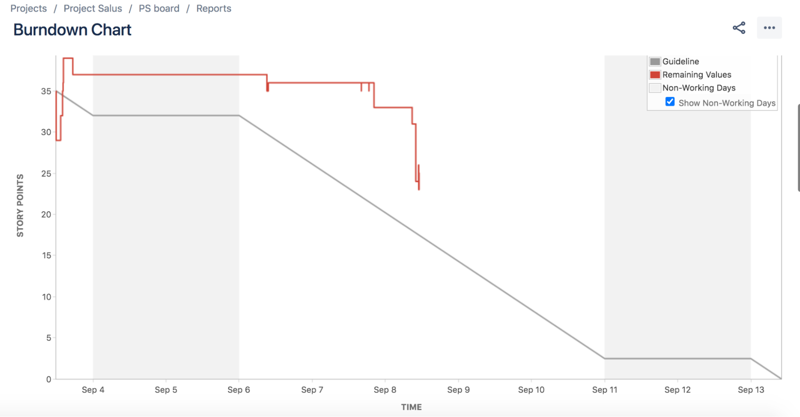

---
# Jekyll 'Front Matter' goes here. Most are set by default, and should NOT be
# overwritten except in special circumstances.
# You should set the date the article was last updated like this:
date: 2021-11-28 # YYYY-MM-DD
# This will be displayed at the bottom of the article
# You should set the article's title:
title: JIRA Agile Development
# The 'title' is automatically displayed at the top of the page
# and used in other parts of the site.
---

## JIRA
is a product management tool developed by Atlassian Inc. that can be used to track work and manage an agile project. All of the work to be done is logged in a centralized location for other members of the team to see.

A ticket is something that needs to be worked on. Often a ticket is assigned to an individual to work on it.

 Here is [a link](https://www.beargroup.com/ideas/tutorials/ticketing-web-development) goes through a detailed idea as to what should be included on the ticket

>  Do what is best for the team. Jira is a powerful tool that has the ability to cause extra work and detract from the development process. Below are some suggestions on how to use Jira, but do what allows your team to succeed.

#### Pricing
There is a free option of Jira that also allows up to 10 users. This works well for an MRSD project.

More information about Jira pricing can be found at <https://www.atlassian.com/software/jira/pricing>

#### Jira + Agile
Jira is used to manage sprints. A sprint is a short period of time where the team completes a small allotted amount of work. Using sprints allows a team to respond to changes quickly and improve their product rapidly. Sprints can be customized to be either 1, 2, 3 or 4 weeks. Usually, we have used 1-2 week sprints based on our milestones. These sprints are typically visualized on Jira Boards.

#### Jira Active Sprints

Jira active sprints demonstrate the work the team sets out to complete. They usually are represented as Jira workflows. A Jira workflow is the transition of statuses that would move a ticket from To Do to Done. The workflows are customizable. Each column on a Jira board represents different stages of the workflow. An example of a basic workflow would be To Do → In Progress → In Review → Done. Each column on the Jira board would represent a different status. Statuses should be clear as to the progress of the ticket in its column. Typically the different stages are defined as:

*Backlog*: Work to be completed. Usually not portioned out into a sprint yet

*Todo*: Work to be completed this sprint. This work has not been started.

*In Progress*: Work that has been started but not put up for review yet.

*In Review*: Work that has been completed but not peer-reviewed/Pull Requested.

*Done*: Completed work.

#### Jira Tickets
The Jira Kanban board/active sprint board is usually broken down into tickets. A Jira ticket holds information about the work needed to be completed.  Jira tickets can include:

*Issue Type*: More details below.

*Summary*: the title of the ticket. This title is what appears on the ticket on the Jira board.

*Attachments*: The attachments usually work best to add design pictures or logs.

*Description*: This is the location that the user stories go. A description of the work to be done. Different teams design the description block differently. Usually, the requirements to complete the ticket should be clearly outlined.

*Reporter*: Person who created the ticket. Usually, the person that questions the requirements should be directed to.

*Linked Issues*: This is where to indicate if certain tickets are blocking or if this ticket blocks other tickets. It allows the work to be completed on an appropriate timeline, and help to highlight the order in which tickets must be worked on

*Assignee*: The person to complete the work.

*Priority*: The priority of this work. How important this ticket is compared to the others in this sprint.
Epic Link: (Story only) The epic this ticket belongs to.

*Sprint*: The sprint this work is to be completed in.

#### Issue Type

Tickets are designated different types to indicate what work needs to be done. The main types of tickets are bugs, tasks, and epics.

This link details the different types of tickets and how to assign them:
<https://wiki.onap.org/display/DW/Epic%2C+Story%2C+Task+and+Bugs>

*Epics*: Epics are large chunks of work that usually, but not necessarily, span over multiple sprints. They typically represent a feature or subsystem. They tend to be large themes or goals for the teams to complete. Epics are usually broken down into stories.

*Story*: Stories often represent requirements to complete an epic.

*Tasks*: This usually represents a technical activity like creating a diagram or testing a system.

*Bugs*: Tickets designed to represent bugs that should be fixed during the sprint.

Our team has created epics based on our work breakdown structure. For example, an epic we have created is Designing the Perception System. The design perception system epic contained several tickets in the form of stories. An example of one of the stories from this epic is `Create a design document to improve object detection.`   

#### Jira Story Points

Story points are usually used to estimate work. In particular the amount of work that a particular story is expected to be. There are multiple methods to estimate work. Each method has positives and negatives, so the method used is often team-dependent.

Each person usually has a maximum allotted number of story points to complete a sprint.

#### Jira Roadmaps

Jira has the capability to create roadmaps or schedules based on epics. This allows the Project manager to plan multiple weeks at a time.

#### Jira + Github Integration
This is a free functionality that allows Jira to integrate with Github. Once you follow the steps indicated in this link to set up the integration:

<https://support.atlassian.com/jira-cloud-administration/docs/integrate-with-github/>

This gives the ability to see Github information inside a Jira ticket.

To attach a branch to a Jira ticket, you will need to include the ticket name. For example:

If PS-223 is the ticket number, we would need to name our branch something like `feature/PS-223-write-logger` for it to link.  Adding PS-223 connects the branch to the PS-223 ticket. This will allow the Jira ticket to display the number of branches and pull requests. Note! It needs to contain the ticket number with the format “BOARD-###” otherwise it will not link.

#### Jira Automation
Jira has the ability to automate activities that are done often through triggers and rules. There are multiple options including custom options. One possibility is when a branch is created for a ticket that is in “TODO” then Jira should move the ticket to in progress. Another example would be when all the pull requests are closed for a Jira ticket, Jira should move the ticket to the done column.

These examples allow for the Jira board to stay up to date without developer intervention.

Some more example automation possibilities can be found here:
<https://www.atlassian.com/software/jira/guides/expand-jira/automation-use-cases>

#### Burndown Chart

The burndown chart is a popular chart among project managers. This allows the PM to view how the work is progressing over a sprint and the work is not falling behind.  It displays the days in the sprint by the story points allocated for that sprint. This can be found in Reports → Burndown Chart. The goal is to have the remaining work track the Guideline.

## Summary
In summary, Jira is a powerful tool for agile development. There are numerous features that can help a project be propelled to success. This article only lists a few features. Use whichever features work best for your team.

## See Also:
- To learn more about project management see [Product Development in Complex System Design](https://roboticsknowledgebase.com/wiki/project-management/product-development-complex-systems/)

## Further Reading
- Learn more about the basics of Jira [here](https://www.guru99.com/jira-tutorial-a-complete-guide-for-beginners.html). In addition,[this website](https://wiki.onap.org/pages/viewpage.action?pageId=6592023) provides practical usage suggestions.

## References
- Atlassian, “Jira pricing - monthly and annual subscription cost per user,” Atlassian. [Online]. Available: https://www.atlassian.com/software/jira/pricing. [Accessed: 28-Nov-2021].
- Atlassian, “Jira Software Automation: Common use cases,” Atlassian. [Online]. Available: https://www.atlassian.com/software/jira/guides/expand-jira/automation-use-cases. [Accessed: 28-Nov-2021].
- E. Goodeve, “How writing effective jira tickets can streamline web development: Bear Group,” How to Write Effective Jira Tickets and Improve Your Web Development | Bear Ideas. [Online]. Available: https://www.beargroup.com/ideas/tutorials/ticketing-web-development. [Accessed: 28-Nov-2021].
- G.  Lanilis, “Jira how to?,” Jira How to? - Developer Wiki - Confluence, 2017. [Online]. Available: https://wiki.onap.org/pages/viewpage.action?pageId=6592023. [Accessed: 28-Nov-2021].
- “Integrate with github,” Atlassian Support, 19-Nov-2021. [Online]. Available: https://support.atlassian.com/jira-cloud-administration/docs/integrate-with-github/. [Accessed: 28-Nov-2021].
