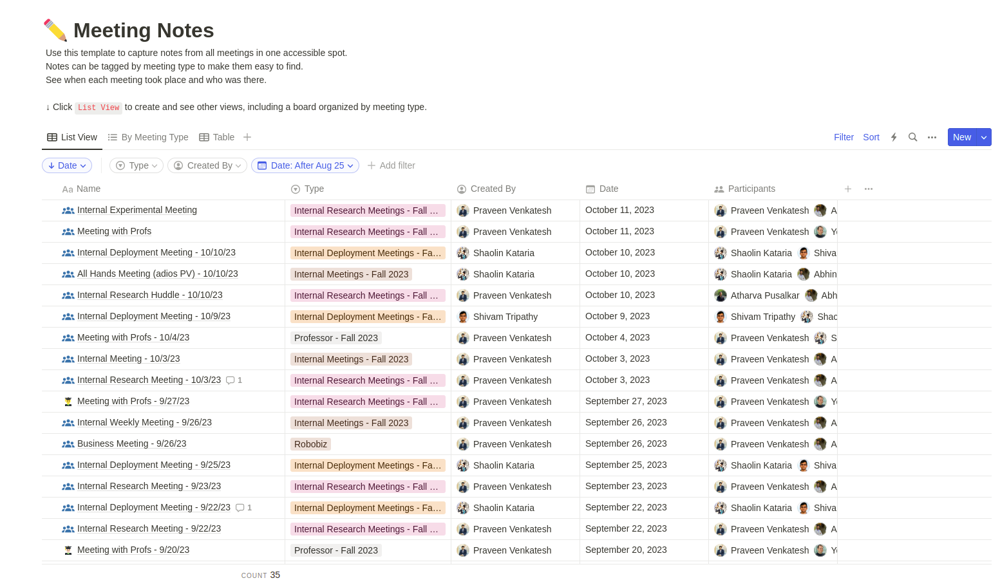
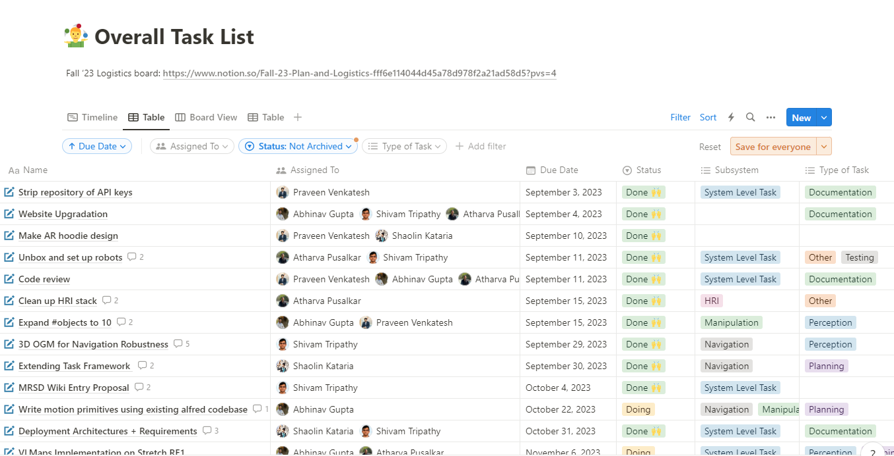
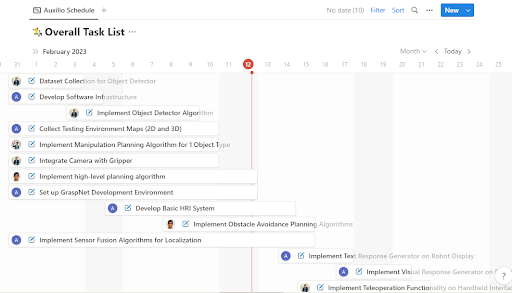
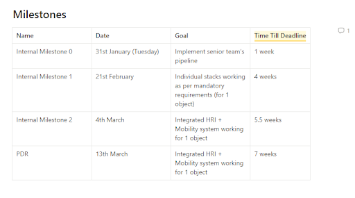
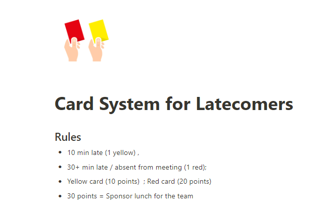
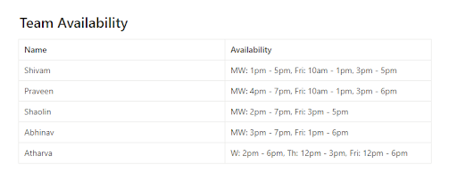

Effective project management is crucial to the long-term success of any project, and there are various free tools that small teams (3-8 members) can use to effectively manage their project.

This document is a tutorial on how to use one such tool, Notion, for Project Management. [Notion](https://www.notion.so/product) is a documentation and task-tracking platform that can be significantly useful in managing different aspects of a project. The first half of this document details how to set up and use Notion for Project Management. The second half then introduces various project management strategies that teams can use to improve their project management process.

> It is the project manager’s role to ensure that all aspects of the project are planned for and appropriately tracked throughout the life of the project. There should be at least one member in the team that assumes this role (could be in addition to other roles). 

## Setting up a Notion Teamspace
Individual university students and teachers who associate their accounts with their school email addresses can get Notion’s Plus Plan for free. With this plan, one member in the team can host a teamspace which can be accessed and edited by upto 100 guests (Notion users). Here are the steps to set up Notion for your team: 

1. **Create a Notion account with your educational email ID.** 
2. **Create a Notion team space.** 
	- Inside your Notion workspace, click on the 'Settings & members' option on the top-left of the screen. 
    - Under 'Settings', navigate to 'Teamspaces' and create a new team space.  
3. **Add team members to your new team space.** 
	- Go to the home page of your team space.
    - On the top-right of the screen, click on the ‘Share’ button.
    -  Enter the email IDs of your team members and click ‘Invite’ to share the team space with them. Make sure the permissions allow invited members to access and edit the team space.
4. **Each member invited should now have access to view and edit the team space.** 
	- While this space is hosted on an individual’s Notion account, it is still a common team space which can be used by all members of the team (added as guests to the teamspace on Notion).

**Note:** The above method does not lead to a private teamspace on Notion. You will need to upgrade to Notion's premium plan in order to convert this to a private teamspace (only members can see the teamspace exists).

## Notion Project Management Template 
Here is a [simple Notion project management template](https://short-gatsby-680.notion.site/Dummy-Project-47645eb16177425d932332db325d0233?pvs=4) that you can use for your project. It contains the major sections that are needed to effectively manage your project. 
- To use the entire template in your project, just click on the 'Duplicate' button on the top-right of the home page.
- To use a particular section of the template in your project, navigate to the section that you would like to use (for eg. Meeting Notes) and then click on the 'Duplicate' button on the top-right of the page. 
- When prompted where you would like to duplicate the tempalte to, select your teamspace. 

### Meeting Notes
Maintaining a section for meeting notes is critical to project management. Details of major internal discussions within the team, or external discussions with project sponsors, users or other stakeholders should be documented in this section. An advantage of Notion is that it enables filtering and sorting meeting notes based on date, type or any other category that is used. Teams can use this feature to their advantage for quickly filtering out key information from a prior meeting. 

To effectively organize meetings on Notion, create a new page on Notion and select a Table template. Connect a new database to your Table where you can add meeting notes (example below). The Notion Project Management template shared above includes the meeting notes section as well. 

A standard meeting notes document should have the following indexing sections: 
- Meeting Date
- Meeting Participants
- Meeting Type

A standard meeting notes document should have the following content-sections:
- Meeting Agenda
- Meeting Notes
- Meeting Outcomes
- Action Items

Here is an example of maintaining meeting notes on Notion. 

### Task List
Another critical aspect of project management is managing work and schedule. After completing the system design phase of a project, it is important to create a Work Breakdown Structure (WBS) that includes all tasks that need to be completed to meet the project goals. On a shorter-horizon, these can be tasks towards a specific milestone / sprint. 

Notion makes it easy to track the progress of such tasks over time. It allows creation of task cards to be added to a Kanban board-type view, or simpy organized in a tabular form. A really useful feature here is that Notion enables filtering and sorting tasks based on date, type, assigned person or any other category that is used. Teams can use this feature to their advantage for quickly filtering out key information from a list of tasks. 

To effectively organize tasks on Notion, create a new page on Notion and select a Table template. Connect a new database to your Table where you can add tasks (example below). Similarly, add a Timeline section to automatically create the project schedule after adding task details in the database. The Notion Project Management template shared above includes the task list section as well.
 
A standard task card should have the following indexing sections: 
- Assignee
- Start Date
- Due Date
- Type
- Status

A standard task card should have the following content-sections:
- Objectives
- Scope
- Evidence of Completion

Here is an example of tracking tasks on Notion: 

### Project Schedule
Notion automatically converts your task list to a timeline format (Gantt chart). However, Notion can only do this to tasks that have a start date and end date defined. Additionally, you can edit the task list to add dependencies between tasks. 

Here is an example of managing a project's schedule on Notion - 

> While coming up with a project schedule, make sure that you keep external milestones and delivery dates in mind. It is a good practice to come up with intermediate internal milestones enroute external milestones. The image below shows an example of how you can keep track of milestones for your project.

### Documentation 
Like meeting notes and task management, documenting team ideas, decisions, observations and results is significant to successful project management. While a lot of information can be documented through meeting notes, the work that happens outside of meetings may be better documented in a separate section. Notion provides ample options to filter, sort and categorize your documents into various types and categories, so feel free to be creative when setting up your Documentation section. 

Here are some ideas for what you can document on Notion
- Meeting Notes (if not already a separate section)
- System Design documents
- System Testing documents
- Useful links and resources

To effectively document the above on Notion, create a new page on Notion and select a Table template. Connect a new database to your Table where you can add documents (example below). The Notion Project Management template shared above includes the task list section as well.

### Project Logs

Another important form of documentation that teams should keep in their project management arsenal are project logs. These are critical to managing project progress on a daily basis, and can be a useful technique for members to structure their thoughts and observations in a common place. 

Here are some ideas for what you can log on Notion
- Individual Progress Logs
- Issues Log
- Risks Log
- Decisions Log

A project logs page can be created on Notion using the standard ‘Table’ template with a new database. The Notion Project Management template shared above includes the Project Logs section as well.

## Effective Project Management Strategies

### Weekly Meetings
Deciding and committing to specific meeting times every week is one of the first actions a team should perform. Use Google Calendar (or MS Teams) to set up weekly meeting slots and invite all team members.

While every meeting could have a different set of agenda, the team should try to follow a common structure for each meeting. For example, every Monday meeting could start with a weekly progress update by each individual. Once individual progress has been recorded, the team can move on to higher-level project discussions. 

For a weekly progress update, here are a few questions the project manager should ask each team member:
- What were your tasks for last week? (cross-check with the task list)
- What are your tasks for next week? 
- Any concerns or obstacles that could prevent you from achieving your goals for next week?

### Card System for Latecomers

Arriving on time to meetings exhibits qualities of professionalism and respect for other’s time. When managing student projects, it is especially important to ensure that team members are motivated and determined to start each meeting on time. 
Sometimes, a little incentive can go a long way. This is where the ‘Card System for Latecomers” can be a fun exercise for teams to try out. 

Here are the rules: 
- There are two cards – Red and Yellow.
- A yellow card leads to a 10-point penalty.
- A red card leads to a 20-point penalty.
- If a team member is 10 min late, they get a yellow card. 
- If a team member is 30+ min late, they get a red card. 
- Anytime a member gets 30 points, they have to sponsor lunch for the rest of the team. 

Feel free to modify the rules to suit your team’s interests!

### Office Hours
Accurate time estimation is critical to planning and tracking project progress. Typically, each team member is expected to work a specific number of hours per week on the project. Therefore, weekly individual goals and team goals should be defined based on that number. 

For example, if it is estimated that a task will take 30 hours to complete, and one person is assigned to the task, then it should take approximately 2 weeks for that task to be completed, assuming the individual works 15 hours per week on the project. In student projects, fixed times to work during the day are not typically defined. While this freedom in schedule can be powerful, it could also lead to slack in project schedule if team members do not work according to the expected time commitments. 

A fun strategy here is to define project ‘**Office Hours**’ – specific times during the week that each team member commits to work on this project. This is a minimum time estimate and should be based on the requirements of the course / project. Of course, every team member is free to work on the project more if they like. 

After committing to weekly ‘Office Hour’ timings, each team member should try to stick to these timings (or cover up for them where applicable). These office hours will help the project manager keep track of each individual’s progress, efficiency and contribution over time, which will help in future planning activities.

Here is an example of Team Availability (Office Hours) that you could apply to your project as well:

### Communication Channels

In large projects, teams often need to discuss and decide on a wide range of project aspects spanning technical, financial, logistical or other categories. While a lot of these discussions may take place during meetings, a major chunk of discussions also happens outside of regular meeting slots. 

To ensure that the key points from such discussions are not inter-mixed with other discussions, it can be helpful to have distinct communication channels within the team for discussing different aspects of the project.

For example, a team could have a communication channel for each of the following:
- Technical Work
- Logistics
- Finances
- Assignments

There are different communication platforms and teams can choose whichever one they are most comfortable with. Some common options are 
- Discord
- WhatsApp
- Slack
- Spaces

## Summary
In summary, Notion is a powerful tool for project management. Its intuitive features enable powerful structuring of various aspects of a project. This article introduced some of Notion's features for project management and provided a simple Project Management template to help teams get started with their project. Feel free to build on this template and test out some of the effective project management strategies discussed in your project! 

## See Also:
- [Risk Management](https://roboticsknowledgebase.com/wiki/project-management/risk-management/)
- [Using Jira for Project Management](https://roboticsknowledgebase.com/wiki/project-management/jira/)

## Further Reading
- [Presentation on 'Using Notion for Project Management'](https://docs.google.com/presentation/d/1TTGKjiw5iJLZxELcF1hId6EU5_2fMuh5HKH0x1smT5g/edit?usp=sharing)
- [Tips on taking good meeting notes](https://www.teamwork.com/blog/how-to-take-meeting-notes/)

## References
