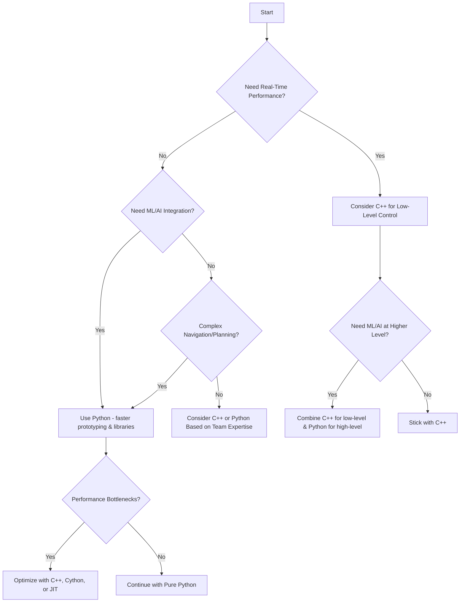
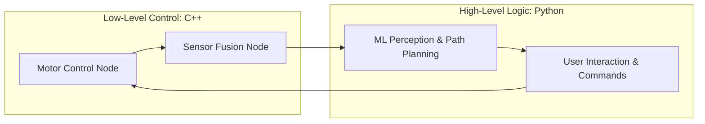

---  
# layout: single  
title: Choose a language (or languages)  
mermaid: true  
---

Choosing the right programming language is a critical step in a robotics project. In robotics, two languages dominate the field: **Python** and **C++**. This section will help you determine which language best fits your needs, explore when to use one over the other, illustrate possible combinations, and provide real-world examples. We’ll also show how both languages are commonly integrated, ensuring you can adapt to any scenario that arises in your robotic endeavors.

By the end of this section, you will understand:  
- Why Python and C++ are standard in robotics.  
- Key factors that influence your language choice.  
- When Python excels, when C++ excels, and how to combine them.  
- How these decisions might look for our example robot, *Tod*.

## Why Python and C++?
In robotics, Python and C++ have become the de facto standards due to their extensive community support, integration with popular robotics frameworks (like ROS and ROS2), and compatibility with a wide range of hardware.

- **Python**:  
  - **Strengths**: Rapid prototyping, easy to read, extensive libraries (especially for machine learning and AI), large open-source community, straightforward integration with ROS.  
  - **Weaknesses**: Slower execution time compared to compiled languages, may require additional tools (like NumPy or Numba) or just-in-time (JIT) compilation for high-performance tasks.

- **C++**:  
  - **Strengths**: Faster runtime execution, efficient memory management, real-time performance, a good fit for low-level control, and embedded systems.  
  - **Weaknesses**: More complex syntax, steeper learning curve, longer development time.

These languages complement each other’s strengths and weaknesses, making them ideal partners in robotics development. Many robotics frameworks are designed with bindings for both, allowing a hybrid approach where you choose the right tool for each part of your project.

## Factors to Consider When Choosing a Language

Before deciding, ask yourself questions about your project’s needs:

- **Performance Requirements**: Do you need real-time, low-level control that requires maximal efficiency? If yes, consider C++.  
- **Development Speed**: Do you need to iterate quickly, prototype algorithms, or leverage a wide range of libraries easily? Python might be your go-to.  
- **Machine Learning and AI**: Are you building advanced perception, path planning with deep learning, or reinforcement learning algorithms? Python’s ecosystem (TensorFlow, PyTorch, scikit-learn) is a big advantage.  
- **Integration with Existing Code**: Is there existing code in Python or C++ you must work with?  
- **Community and Available Resources**: Are there tutorials, packages, and support communities for the tasks you want to accomplish in your chosen language? Both are well-supported, but Python often has more high-level robotics, vision, and ML examples readily available.

| **Criteria**            | **Python**                                | **C++**                            |
|--------------------------|-------------------------------------------|-------------------------------------|
| **Development Speed**    | Rapid prototyping, easy to learn         | Longer development time, steeper learning curve |
| **Performance**          | Slower (unless optimized)                | High performance, real-time        |
| **ML Integration**       | Rich ecosystem (TensorFlow, PyTorch)     | Limited native ML libraries        |
| **Use Cases**            | High-level logic, AI tasks               | Low-level control, embedded systems|

## When to Use Python
Python shines when your priority is rapid development, ease of maintenance, and leveraging powerful libraries for machine learning, computer vision, and data analysis.

**Examples**:  
- **High-Level Decision Making**: Planning trajectories or making route decisions using machine learning or heuristic algorithms.  
- **Computer Vision and AI**: Processing camera data to recognize objects, people, or obstacles using neural networks (e.g., TensorFlow, PyTorch).  
- **Data Analysis and Prototyping**: Quickly testing new algorithms without worrying about memory management or compilation.

**Performance Considerations**:  
While Python is slower than C++, you can improve performance using:  
- **NumPy**: Vectorized operations that approach C-level speed.  
- **Just-in-Time (JIT) Compilers**: Tools like Numba can compile Python functions into machine code at runtime.  
- **Cython or pybind11**: Integrate C/C++ code to speed up hotspots in your Python code.

## When to Use C++
C++ excels in time-critical components of your robot, where deterministic behavior and low-level access to hardware are essential.

**Examples**:  
- **Real-Time Control Loops**: Controlling motors and actuators at high frequency, ensuring stable and responsive behavior.  
- **Low-Level Communication**: Interfacing directly with microcontrollers, sensor drivers, or embedded systems where overhead must be minimized.  
- **Performance-Critical Algorithms**: Running computationally heavy tasks (like SLAM or certain optimization routines) where shaving off milliseconds matters.

C++ is often the backbone of the lower layers in robotics, ensuring that your robot remains stable, predictable, and efficient. This solid foundation allows higher-level Python scripts to handle complex logic on top.

## Combining Python and C++
Many robotics projects use a hybrid approach, leveraging the best of both worlds. For example, you can write a C++ node to handle low-level motor controls and sensor data processing for real-time performance, while using a Python node to perform high-level decision making, machine learning inference, and user interface tasks.

This integration can happen easily if you are using frameworks like ROS:  
- A **ROS2 package in C++** can publish real-time odometry and sensor readings.  
- A **ROS2 package in Python** can subscribe to these topics, process data using a neural network, and send commands back to the robot.

**Bridging the Gap**:  
- **ROS Message Passing**: Separate nodes (C++ and Python) can communicate through ROS topics, services, and actions.  
- **Cython or pybind11**: Wrap C++ libraries so that Python can call them directly.  
- **External APIs**: Use well-defined APIs so that Python scripts invoke C++ executables or services as needed.

## Decision Flowchart
Use the following flowchart to guide your decision. Keep in mind, you can always iterate and refine your language choice as your project’s needs become clearer.

## Example with Our Robot Tod
Recall that *Tod*, our quadrupedal shopping assistant robot, must navigate shopping centers, avoid obstacles, and interact with users. Let’s decide how to structure Tod’s software:

1. **Low-Level Motor Control**:
    Tod’s leg joints need to respond quickly and reliably to maintain balance and carry payloads. This calls for C++:

    - *Reason*: Real-time response and efficient computations.
    - *Implementation*: A C++ ROS2 node handles PID control loops at a high frequency (e.g., 1 kHz), ensuring Tod remains stable on its feet.

2. **High-Level Navigation & Planning**:
Tod uses machine learning models to understand its environment, identify open pathways, and avoid obstacles. This fits Python:

    - *Reason*: Access to rich ML libraries (TensorFlow, PyTorch) and rapid development.
    - *Implementation*: A Python ROS2 node subscribes to sensor topics published by the C++ node, processes camera feeds using object detection models, and determines the best path forward.

3. **User Interaction**:
Tod listens for simple voice commands from users. Speech recognition and language processing are easily handled in Python:

    - *Reason*: Python has multiple speech recognition and NLP libraries, making it easy to integrate these features.
    - *Implementation*: A Python script uses a speech recognition API to interpret voice commands and sends navigation instructions back to the C++ node controlling movement.

By combining both languages, Tod benefits from C++’s speed and Python’s flexibility. If you notice a performance bottleneck in Python code, you can move critical sections to C++ and rewrap them for Python. Conversely, if you find that some C++ code is cumbersome to maintain or you want to experiment with a new ML model quickly, Python is at your disposal.

**Visual Representation of Tod’s Software Stack:**

This approach ensures that each component of Tod’s architecture is implemented in the language that best suits its requirements.

## Tips for Successful Integration
- **Code Organization**: Keep your C++ and Python code in separate, well-documented modules. Clearly define interfaces so the two can communicate smoothly via messaging or APIs.
- **Testing and Validation**: Test your Python and C++ components individually and then together, ensuring that performance and functionality requirements are met.
- **Iterative Improvements**: Start simple. If your initial Python solution is too slow, identify the critical section and rewrite just that part in C++. Conversely, if you wrote everything in C++ and find it too slow to develop machine learning features, start integrating Python nodes.

## Next Steps
With a clear understanding of when to use Python, when to use C++, and how to combine them, you can make informed decisions for your robotics project.

- **[Choose Your Communication Method](/wiki/robotics-project-guide/choose-comm/)**: Learn about how to connect your code to various robot components and systems.

Your language choice affects everything from performance to maintainability. By balancing Python’s ecosystem and ease of use with C++’s speed and reliability, you can create a robust, high-performance, and adaptable robotics system—just like Tod.