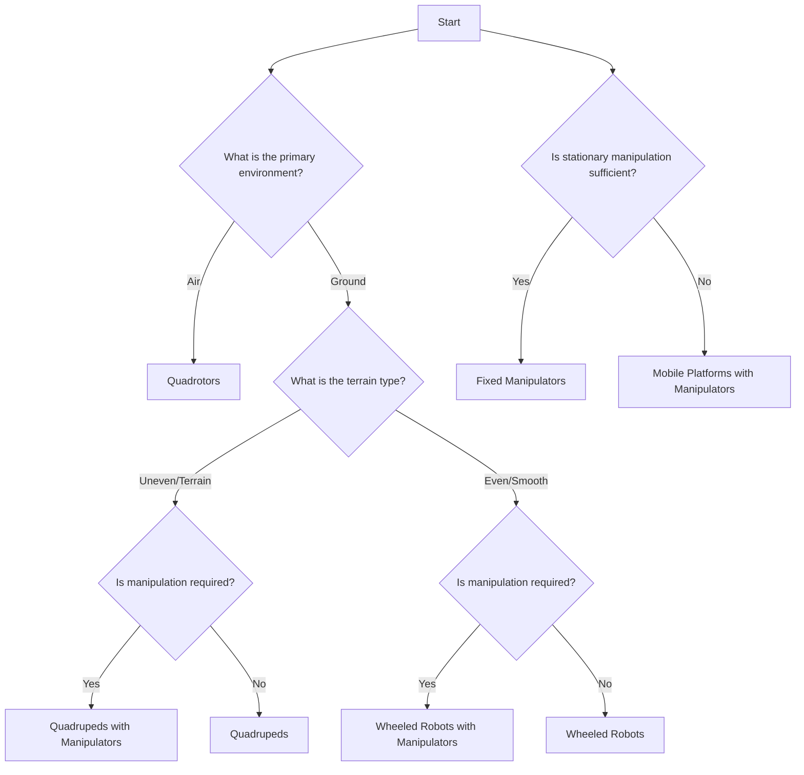

[Image source](https://www.machinedesign.com/markets/robotics/article/21835000/whats-the-difference-between-industrial-robots)

Truly, there are so many robots that you can choose from to achieve your goal. Once you choose what platform you will be using for your project, it's now time to choose the specific platform. 
Selecting the appropriate robotic platform is a critical step in your project. The decision should be guided by the robot's intended environment, tasks, and specific requirements such as language support.

Click on ["Quadrotors"](#quadrotors), ["Quadrupeds"](#quadrupeds), ["Wheeled Robots"](#wheeled-robots), and ["Fixed Manipulators"](#fixed-manipulators) in the graph below to go to the section!

<!-- ==================================================================================== -->
<!-- ==================================================================================== -->
<!-- ==================================================================================== -->

# Quadrotors

Quadrotors, or quadcopters, are versatile aerial robots ideal for tasks like surveillance, mapping, and autonomous navigation. Their ability to hover and navigate 3D spaces makes them invaluable for inspecting hard-to-reach areas like rooftops or dense forests.

Compared to ground-based robots, quadrotors are more affordable and versatile, operating in diverse environments with ease. Open-source platforms like PX4 and Agilicious allow extensive customization, while pre-built options like DJI Tello offer quick deployment. They are supported by a robust ecosystem of tools and resources, making them accessible to beginners and researchers alike.

Quadrotors excel in scalability, from small indoor drones for swarming research to larger models for agriculture or delivery. With lower maintenance needs and greater mobility than ground robots, quadrotors provide an affordable, adaptable, and efficient solution for education, research, and real-world applications.

Despite their advantages, quadrotors come with notable disadvantages. Their limited payload capacity restricts them to lightweight sensors and cameras, making them unsuitable for tasks requiring heavy equipment. They are also inherently less stable in adverse weather conditions, such as strong winds or rain, which can compromise their performance and safety. Tuning quadrotors for optimal flight can be complex, as factors like motor calibration, weight distribution, and flight controller settings require precision. Additionally, their delicate components, such as propellers and frames, are prone to damage in crashes or rough handling, leading to frequent repairs. Battery life is another limitation, with most quadrotors offering relatively short flight times, requiring careful mission planning or frequent recharging

**Popular Platforms:**

Without getting into the nitty-gritty details, the basic idea is - if you want to have an extremely customized quadrotor, you should use the PX4 Autopilot Platform. PX4 is an open-source flight control system that provides unparalleled flexibility, allowing users to design and implement custom hardware configurations, integrate specialized sensors, and modify flight algorithms. Its modular architecture supports a wide range of hardware, from small indoor drones to large outdoor quadrotors, making it adaptable to various applications.

Other open-source systems like ArduPilot also offer robust features and flexibility, but PX4 is often preferred for its focus on cutting-edge research and compatibility with advanced tools like ROS and Gazebo. While PX4 offers extensive customization, its complexity introduces a steep learning curve, requiring users to have a solid understanding of flight dynamics, embedded systems, and programming.

PX4 provides features like multi-platform support, advanced flight modes (autonomous, manual, and hybrid), and real-time data logging. It also integrates seamlessly with ground control systems such as QGroundControl, enabling intuitive mission planning and monitoring. With a strong community and extensive documentation, PX4 empowers researchers and developers to push the boundaries of aerial robotics while maintaining complete control over their system’s capabilities.

*With that, here's a list of popular quadrotor platforms for researchers and students*:

1. **PX4 Autopilot-Based Quadrotors:**
   - **PX4 Autopilot:** An open-source flight control software widely adopted in research for its flexibility and extensive community support. It supports various hardware platforms and is suitable for custom drone development. [PX4 Autopilot](https://px4.io/)

2. **DJI Drones:**
   - **DJI Tello:** A compact and affordable quadrotor suitable for educational purposes, offering programmable interfaces. It provides a user-friendly experience with features like electronic image stabilization and multiple flight modes. [DJI Tello](https://www.dji.com/tello)

3. **Crazyflie Nano Quadrotors:**
   - **Crazyflie 2.1:** A versatile and open-source nano quadrotor ideal for research and education in robotics and control engineering. Its small size makes it suitable for indoor experiments and swarming studies. [Crazyflie 2.1](https://www.bitcraze.io/products/old-products/crazyflie-2-1/)

4. **Parrot Drones:**
   - **Parrot AR.Drone 2.0:** A user-friendly quadrotor with an open API, facilitating research in autonomous navigation and human-machine interaction. It features a robust design and is equipped with front and vertical cameras. [Parrot AR.Drone 2.0](https://www.parrot.com/us/drones/ar-drone-20-elite-edition)

5. **UniQuad Platform:**
   - **UniQuad:** A unified and versatile quadrotor platform series designed for UAV research and applications, offering modular components for various tasks. It supports multiple configurations and is suitable for both indoor and outdoor experiments. [UniQuad](https://hkust-aerial-robotics.github.io/UniQuad/)

6. **Agilicious Platform:**
   - **Agilicious:** An open-source and open-hardware agile quadrotor designed for vision-based flight, supporting both model-based and neural-network-based controllers. It is tailored for high-speed and agile flight research. [Agilicious](https://github.com/uzh-rpg/agilicious)

**Comparison Table:**

| Feature                   | PX4 Autopilot-Based Quadrotors                                                                                          | DJI Tello                                                                                      | Crazyflie 2.1                                                                                                 | Parrot AR.Drone 2.0                                                                                                  | UniQuad                                                                                                  | Agilicious                                                                                                  |
|---------------------------|-------------------------------------------------------------------------------------------------------------|------------------------------------------------------------------------------------------------------------|-------------------------------------------------------------------------------------------------------------|-------------------------------------------------------------------------------------------------------------|-------------------------------------------------------------------------------------------------------------|-------------------------------------------------------------------------------------------------------------|
| **Customizability**       | High; supports various hardware platforms with open-source software. | Low; limited to available SDK features. | High; open-source hardware and software for extensive customization. | Medium; open API allows for some customization. | High; modular design for various research applications. | High; open-source hardware and software tailored for agile flight. |
| **Maximum Speed**         | Varies with hardware; typically up to 20 m/s. | 8 m/s. | 3 m/s. | 5 m/s. | Varies with configuration; designed for research flexibility. | Up to 13 m/s; designed for high-speed agile maneuvers. |
| **ROS Support**           | Full support with extensive community resources. | Limited; unofficial packages available. | Full support with dedicated ROS packages. | Limited; requires additional setup for ROS integration. | Full support; designed for seamless ROS integration. | Full support; optimized for vision-based ROS applications. |
| **Programming Languages** | Supports C++, Python, and more through MAVLink protocol. | Supports Scratch and Python via SDK. | Supports Python and C through open-source APIs. | Supports Python and JavaScript via API. | Supports C++ and Python; flexible for various programming needs. | Supports C++ and Python; suitable for implementing custom algorithms. |
| **Availability of Parts** | Widely available; supports various hardware components. | Proprietary parts; limited availability. | Components available through manufacturer and third parties. | Parts available through manufacturer and select retailers. | Components are modular and can be sourced or fabricated. | Open-hardware design allows the user to customize it freely. |
 
**Resources and Tutorials:**

PX4:
- **[PX4 Autopilot User Guide](https://docs.px4.io/main/en/)**
- **[PX4 Fundamentals Workshop (YouTube Video)](https://www.youtube.com/watch?v=-1MASuJDGn4)**
- **[PX4 Discussion Forum](https://discuss.px4.io/)**
- **[`PX4-Autopilot` (GitHub)](https://github.com/PX4/PX4-Autopilot)**

DJI:
- **[DJI Developer (SDK, etc.)](https://developer.dji.com/)**
- **[TelloPilots (DJI Tello Drone Forum)](https://tellopilots.com/)**

Bitcraze (Crazyflie)
- **[Bitcraze - Crazyflie 2.1](https://www.bitcraze.io/products/old-products/crazyflie-2-1/)**
- **[Bitcraze Forum](https://forum.bitcraze.io/)**
- **[`crazyflie-firmware` (GitHub)](https://github.com/bitcraze/crazyflie-firmware)**

Parrot
- **[Parrort AR Drone Documentation](https://www.parrot.com/en/support/documentation/ar-drone)**
- **[ParrotPilots (Parrot AR 2.0 Forum)](https://parrotpilots.com/forums/ar-drone-2.10/)**
- **[Parrot Drone SDK](https://developer.parrot.com/docs/index.html)**

UniQuad
- **[UniQuad (Project Page)](https://developer.parrot.com/docs/index.html)**
- **[`UniQuad` (GitHub)](https://github.com/HKUST-Aerial-Robotics/UniQuad)**

Agilicious
- **[`agilicious` (GitHub)](https://github.com/uzh-rpg/agilicious)**

<!-- ==================================================================================== -->
<!-- ==================================================================================== -->
<!-- ==================================================================================== -->

# Quadrupeds

Quadrupeds are agile, legged robots designed for tasks requiring rough terrain navigation, balance, and adaptability. Unlike wheeled or tracked robots, quadrupeds can traverse uneven surfaces, climb stairs, and recover from falls, making them ideal for search-and-rescue operations, construction sites, and even entertainment.

Quadrupeds excel in dynamic environments, offering unparalleled mobility and flexibility. Advanced control algorithms and robust mechanical designs enable them to adapt their gait and posture, ensuring stability in challenging conditions. This adaptability extends to various payload configurations, with some models capable of carrying heavy loads for extended missions.

Compared to wheeled robots, quadrupeds are generally slower but more versatile in unstructured settings. They are often equipped with sophisticated sensors like LiDAR, cameras, and IMUs, making them suitable for tasks like mapping, surveillance, and object manipulation. However, their mechanical complexity and reliance on advanced algorithms often result in higher costs and maintenance requirements. Additionally, their power consumption can be significant, limiting operational time unless supported by advanced battery technologies or external power sources.

**Popular Platforms:**

1. **Unitree Robots:**
   - **Unitree Go1 EDU:** A compact and affordable quadruped ideal for education and research, offering advanced locomotion capabilities and ROS support. [Unitree Go1](https://www.unitree.com/products/go1)
   - **Unitree Go2 EDU:** A next-generation quadruped with improved sensors and enhanced computing capabilities, suitable for advanced applications in navigation and manipulation. [Unitree Go2](https://www.unitree.com/products/go2)

2. **Boston Dynamics:**
   - **Spot:** A highly capable quadruped designed for industrial applications, with a robust build and advanced autonomy features for inspection and data collection. [Boston Dynamics Spot](https://www.bostondynamics.com/products/spot)

3. **ANYbotics:**
   - **ANYmal:** A versatile and rugged quadruped for industrial inspection, capable of carrying heavy payloads and operating in hazardous environments. [ANYmal](https://www.anybotics.com/anymal/)

**Comparison Table:**

| Feature                   | Unitree Go1 EDU                                                                          | Unitree Go2 EDU                                                                          | Boston Dynamics Spot                                                           | ANYmal                                                                            |
|---------------------------|---------------------------------------------------------------------------------------|-------------------------------------------------------------------------------------|--------------------------------------------------------------------------------|----------------------------------------------------------------------------------|
| **Payload Capacity**      | Up to 6 kg (MAX ~10kg)                                                                           | Up to 8 kg (MAX ~12kg)                                                                         | Up to 14 kg                                                                    | Up to 65 kg (unconfirmed)                                                                       |
| **Maximum Speed**         | 3.7 m/s                                                                              | 3.7 m/s                                                                             | 1.6 m/s                                                                        | 1.3 m/s                                                                           |
| **Battery Life**          | Up to 1.5 hours                                                                      | 2 - 4 hours                                                                       | Up to 1.5 hours                                                                | Up to 2.5 hours                                                                   |
| **Terrain Adaptability**  | High; supports unstructured terrain with agile movements                              | High; enhanced agility and sensor-based navigation                                 | Very High; excels in industrial settings                                       | Extremely High; designed for hazardous and rugged environments                   |
| **ROS Support**           | ROS (Partial support), ROS2 (Full support with with SDK features)                    | ROS2; Full support with SDK features                                          | ROS2; Partial support with proprietary wrapper for API access                            | (Cannot find information)                |
| **Programming Languages** | Supports Python and C++ via SDKs                                                     | Supports Python and C++ via SDKs                                                    | Supports Python and C++ via proprietary API                                    | Supports Python and C++                                               |
| **Price**                 | Affordable; suitable for education and entry-level research                          | Moderate; suitable for education and entry-level research                                       | High; tailored for industrial applications                                      | Very High; designed for specialized and hazardous environments                   |

When comparing quadruped robots like Unitree's Go1 EDU and Go2 EDU, Boston Dynamics' Spot, and ANYbotics' ANYmal, the Unitree models offer a compelling balance of customizability and affordability. The Go2 EDU, in particular, supports programming in Python and is compatible with ROS2, facilitating extensive customization and integration with various applications. In contrast, Boston Dynamics' Spot, while user-friendly and capable, relies on proprietary SDKs, which can limit advanced customization. ANYmal is designed for industrial applications and advanced research, offering robust API and SDK, but it comes at a higher price point. Regarding cost-effectiveness, the Unitree Go2 EDU is notably more affordable, starting at approximately 16,000 USD, making it accessible for educational purposes and research. In comparison, Boston Dynamics' Spot is priced between 74,500 USD and 94,500 USD, positioning it at a premium level.

**Resources and Tutorials:**

Unitree:
- **[Unitree SDK Documentation](https://support.unitree.com/home/en/developer)**: includes everything you need for all Unitree robots, including Go1 and Go2.
- **[`Unitree Robotics` (GitHub)](https://github.com/unitreerobotics)**: this site includes various GitHub repositories developed by Unitree engineers. It's quite amazing.
- **[ROS - Go1 Documentation](https://docs.trossenrobotics.com/unitree_go1_docs/getting_started/ros.html)**

Boston Dynamics:
- **[`spot_ros2` (GitHub)](https://github.com/bdaiinstitute/spot_ros2)**: official ROS2 support
- **[`SPOT_ROS` (GitHub)](https://github.com/heuristicus/spot_ros)**: unofficial(?) ROS support
- **[Spot SDK Documentation](https://dev.bostondynamics.com/)**: includes Python and C++ information

ANYbotics:
- **[Get Started with ANYmal](https://www.anybotics.com/get-started/)**
- **[ANYmal Technical Specifications](https://www.anybotics.com/anymal-technical-specifications.pdf)**
- **[ANYmal API and SDK](https://developer.siemens.com/anybotics/overview.html)**

<!-- ==================================================================================== -->
<!-- ==================================================================================== -->
<!-- ==================================================================================== -->

# Wheeled Robots

Wheeled robots are efficient on smooth, even surfaces and are commonly used in indoor environments like warehouses, hospitals, and retail spaces. Their straightforward design and reliable locomotion make them an excellent choice for a wide range of applications, from material transport and inventory management to security surveillance and customer assistance. Wheeled robots are often favored for their simplicity and energy efficiency, allowing for extended operational times compared to legged or flying robots.

One of the key advantages of wheeled robots is their ease of control and maintenance. With fewer moving parts than complex robotic platforms like quadrupeds, wheeled robots are mechanically robust and cost-effective to build and repair. Their ability to carry significant payloads while navigating confined indoor spaces makes them indispensable in environments like hospitals, where precision and reliability are critical.

Wheeled robots also excel in scalability and modularity. Platforms such as TurtleBot and ROSbot are highly customizable, supporting a wide range of sensors, cameras, and computational units to suit specific research or operational needs. Their strong integration with open-source ecosystems like ROS (Robot Operating System) provides an extensive library of tools for navigation, perception, and interaction, enabling researchers and developers to prototype and deploy advanced robotic solutions quickly.

Although wheeled robots are primarily suited to flat, obstacle-free environments, their dependability and versatility make them a preferred choice for countless applications in industries that require efficient, repeatable tasks. From beginner-friendly educational robots to advanced platforms for research and development, wheeled robots are a foundational technology in modern robotics.

**Popular Platforms:**

1. **TurtleBot Series:**
   - **TurtleBot3 Burger:** A compact, affordable, and programmable ROS-based mobile robot designed for education and research. It features modularity and open-source software, allowing for extensive customization.
   - **TurtleBot3 Waffle Pi:** A larger variant of the Burger, offering enhanced payload capacity and additional features like a built-in camera, suitable for more advanced applications.

2. **ROSbot:**
   - **ROSbot 2.0:** An autonomous, open-source robot platform ideal for research and prototyping. It integrates LiDAR, a depth camera, and multiple sensors, providing robust SLAM and navigation capabilities.

3. **F1Tenth Platform:**
   - **F1Tenth Autonomous Racing Car:** A 1/10th scale high-speed autonomous RC car designed for research and education in autonomous driving and racing. It offers a hands-on platform for developing and testing algorithms in perception, planning, and control at high speeds. If you want to do high-speed racing robotics, this is the platform to go!

**Comparison Table:**

| Feature                   | TurtleBot3 Burger                                                                                          | TurtleBot3 Waffle Pi                                                                                      | ROSbot 2.0                                                                                                  | F1Tenth Autonomous Racing Car                                                                               |
|---------------------------|-------------------------------------------------------------------------------------------------------------|------------------------------------------------------------------------------------------------------------|-------------------------------------------------------------------------------------------------------------|-------------------------------------------------------------------------------------------------------------|
| **Customizability**       | High; modular design with open-source hardware and software. [Source](https://emanual.robotis.com/docs/en/platform/turtlebot3/features/) | High; similar to Burger with additional features. [Source](https://emanual.robotis.com/docs/en/platform/turtlebot3/features/) | High; open-source platform with extensive customization options. [Source](https://husarion.com/manuals/rosbot/) | High; designed for research with customizable hardware and software components. [Source](https://f1tenth.readthedocs.io/) |
| **Maximum Speed**         | 0.22 m/s [Source](https://emanual.robotis.com/docs/en/platform/turtlebot3/features/) | 0.26 m/s [Source](https://emanual.robotis.com/docs/en/platform/turtlebot3/features/) | 0.5 m/s [Source](https://husarion.com/manuals/rosbot/) | Up to 5 m/s; suitable for high-speed autonomous driving research. [Source](https://f1tenth.readthedocs.io/) |
| **ROS Support**           | Full support for ROS 1 and ROS 2. [Source](https://emanual.robotis.com/docs/en/platform/turtlebot3/features/) | Full support for ROS 1 and ROS 2. [Source](https://emanual.robotis.com/docs/en/platform/turtlebot3/features/) | Full support for ROS 1 and ROS 2. [Source](https://husarion.com/manuals/rosbot/) | Full support for ROS 1 and ROS 2; extensive community resources available. [Source](https://f1tenth.readthedocs.io/) |
| **Programming Languages** | Supports C++, Python. [Source](https://emanual.robotis.com/docs/en/platform/turtlebot3/features/) | Supports C++, Python. [Source](https://emanual.robotis.com/docs/en/platform/turtlebot3/features/) | Supports C++, Python. [Source](https://husarion.com/manuals/rosbot/) | Supports C++, Python; flexibility for implementing custom algorithms. [Source](https://f1tenth.readthedocs.io/) |
| **Availability of Parts** | Widely available; components can be 3D printed or purchased. [Source](https://emanual.robotis.com/docs/en/platform/turtlebot3/features/) | Widely available; components can be 3D printed or purchased. [Source](https://emanual.robotis.com/docs/en/platform/turtlebot3/features/) | Available through the manufacturer and distributors. [Source](https://husarion.com/manuals/rosbot/) | Components are commercially available; detailed build guides provided. [Source](https://f1tenth.readthedocs.io/) |
| **Additional Features**   | Supports SLAM, autonomous navigation; compact size. [Source](https://emanual.robotis.com/docs/en/platform/turtlebot3/features/) | Includes a camera; higher payload capacity. [Source](https://emanual.robotis.com/docs/en/platform/turtlebot3/features/) | Integrated LiDAR and depth camera; robust design. [Source](https://husarion.com/manuals/rosbot/) | High-speed operation; ideal for autonomous driving and racing research. [Source](https://f1tenth.readthedocs.io/) |

**Resources and Tutorials:**
These resources provide step-by-step instructions and examples to help users effectively utilize and program their wheeled robots.

- **[TurtleBot3 Tutorials](https://emanual.robotis.com/docs/en/platform/turtlebot3/quick-start/):** Comprehensive guides covering setup, navigation, and simulation.
- **[TurtleBot4 User Manual](https://turtlebot.github.io/turtlebot4-user-manual/):** Comprehensive guide to TurtleBot4. 
- **[TurtleBot in ROS](https://wiki.ros.org/Robots/TurtleBot)**: Overview of ROS packages for TurtleBot2 and TurtleBot3.
- **[TurtleBot in ROS2](https://ros2-industrial-workshop.readthedocs.io/en/latest/_source/navigation/ROS2-Turtlebot.html):** A beginner-friendly guide to getting started with TurtleBot and ROS2.
- **[ROSbot 2.0 Documentation](https://husarion.com/manuals/rosbot/):** Detailed manuals and tutorials for operating and programming ROSbot.
- **[F1Tenth Build Documentation](https://f1tenth.readthedocs.io/):** Step-by-step instructions for building and programming the F1Tenth autonomous racing car.
- **[F1Tenth GitHub Repository]((https://github.com/f1tenth)):** Access to the open-source codebase and community contributions for the F1Tenth platform.

<!-- ==================================================================================== -->
<!-- ==================================================================================== -->
<!-- ==================================================================================== -->

# Fixed Manipulators

Fixed manipulators are stationary robotic arms designed for tasks such as assembly, material handling, and precision operations. Their fixed base provides stability, allowing for high repeatability and accuracy in controlled environments like manufacturing lines and research labs.

**Popular Platforms:**

1. **Kinova Gen3 (7 DoF):**
   - **Degrees of Freedom:** 7
   - **Dimensions:** Maximum reach of 902 mm
   - **Payload:** Up to 4 kg
   - **Weight:** 8.2 kg
   - **Features:** Ultra-lightweight design, integrated 2D/3D vision module, ROS compatibility
   - **Applications:** Research, light industrial tasks
   - **Source:** [Kinova Gen3 Robots](https://www.kinovarobotics.com/product/gen3-robots)

2. **Universal Robots UR5e:**
   - **Degrees of Freedom:** 6
   - **Dimensions:** Reach of 850 mm
   - **Payload:** Up to 5 kg
   - **Weight:** 20.6 kg
   - **Features:** Collaborative capabilities, easy programming, versatile deployment
   - **Applications:** Medium-duty tasks, automation
   - **Source:** [UR5e Lightweight, Versatile Cobot](https://www.universal-robots.com/products/ur5-robot/)

3. **Franka Emika Panda:**
   - **Degrees of Freedom:** 7
   - **Dimensions:** Reach of 855 mm
   - **Payload:** Up to 3 kg
   - **Weight:** 18 kg
   - **Features:** High sensitivity, user-friendly interface, ROS integration
   - **Applications:** Research, delicate assembly tasks
   - **Source:** [Franka Emika Panda Kinematics](https://petercorke.com/robotics/franka-emika-panda-kinematics-and-singularities/)

4. **KUKA KR Agilus:**
   - **Degrees of Freedom:** 6
   - **Dimensions:** Reach of 706.7 mm
   - **Payload:** Up to 6 kg
   - **Weight:** Approximately 50 kg
   - **Features:** High-speed operation, compact design
   - **Applications:** Small parts assembly, material handling
   - **Source:** [KUKA KR Agilus](https://www.kuka.com/en-de/products/robot-systems/industrial-robots/kr-agilus)

5. **ABB IRB 1200:**
   - **Degrees of Freedom:** 6
   - **Dimensions:** Reach of 901 mm
   - **Payload:** Up to 7 kg
   - **Weight:** 52 kg
   - **Features:** Compact footprint, versatile mounting options
   - **Applications:** Material handling, machine tending
   - **Source:** [ABB IRB 1200](https://new.abb.com/products/robotics/industrial-robots/irb-1200)

**Comparison Table:**

| Feature                 | Kinova Gen3 (7 DoF) | UR5e                  | Franka Emika Panda | KUKA KR AGILUS | ABB IRB 1200 |
|-------------------------|---------------------|-----------------------|--------------------|----------------|--------------|
| **Degrees of Freedom**  | 7                   | 6                     | 7                  | 6              | 6            |
| **Reach**               | 902 mm              | 850 mm                | 855 mm             | 706.7 mm       | 901 mm       |
| **Payload Capacity**    | 4 kg                | 5 kg                  | 3 kg               | 6 kg           | 7 kg         |
| **Weight**              | 8.2 kg              | 20.6 kg               | 18 kg              | ~50 kg         | 52 kg        |
| **Key Features**        | Lightweight, integrated vision, ROS support | Collaborative, easy programming | Sensitive, user-friendly, ROS integration | High-speed, compact | Compact, versatile mounting |
| **Typical Applications**| Research, light industrial tasks | Medium-duty automation | Research, delicate assembly | Small parts assembly, material handling | Material handling, machine tending |

**Resources and Tutorials:**

- **Kinova Gen3:**
  - **[`Kinova Robotics` (GitHub)](https://github.com/kinovarobotics)**
  - **[Kinova Gen3 Getting Started Guide](https://schulich.libguides.com/c.php?g=721065&p=5155225)**
  - **[Kinova Gen3 User Guide (PDF Download)](https://artifactory.kinovaapps.com/ui/api/v1/download?repoKey=generic-public&path=Documentation%2FGen3%20lite%2FTechnical%20documentation%2FUser%20Guide%2FGen3_lite_USER_GUIDE_R03.pdf)**

- **Universal Robots UR5e:**
  - **[UR Academy](https://www.universal-robots.com/academy/)**
  - **[UR5e Technical Details](https://www.universal-robots.com/media/1802778/ur5e-32528_ur_technical_details_.pdf)**

- **Franka Emika Panda:**
  - **[Franka Control Interface (FCI) Documentation](https://frankaemika.github.io/docs/)**
  - **[Franka Emika Panda Kinematics and Singularities](https://petercorke.com/robotics/franka-emika-panda-kinematics-and-singularities/)**

- **KUKA KR AGILUS:**
  - **[`OpenKuka` (GitHub)](https://github.com/openkuka)**
  - **[KR Agilus Product Page](https://www.kuka.com/en-de/products/robot-systems/industrial-robots/kr-agilus)**

- **ABB IRB 1200:**
  - **[ABB Robotics Training](https://new.abb.com/products/robotics/training)**
  - **[IRB 1200 Product Page](https://new.abb.com/products/robotics/industrial-robots/irb-1200)**
