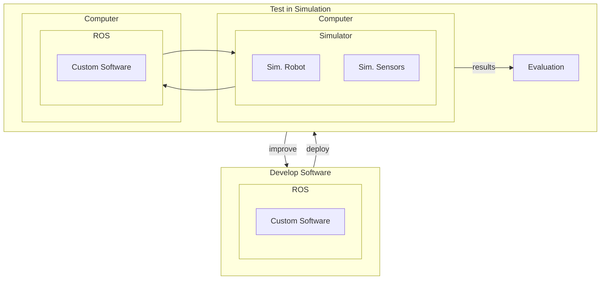

---  
# layout: single  
title: Choose a Simulator  
mermaid: true  
---

Selecting the appropriate simulator is a pivotal step in any robotics project. Simulators allow you to test algorithms, design robots, and visualize environments without the need for physical hardware, saving both time and resources. This section will guide you through the importance of simulators, help you identify the type of simulator that suits your project's needs, and provide comparisons of popular options across various categories.

By the end of this section, you will understand:  
- The significance of simulators in robotics projects and when to use them.
- How physics simulators work. 
- How to determine the type of simulator you require based on your project's specifications.  
- The pros and cons of various simulators tailored for robotics, machine learning/reinforcement learning, and visualization.  
- How to use a custom robot in a simulator.

## Why Are Simulators Important in Robotics Projects?

Simulators play a crucial role in robotics for several reasons:

- **Cost Efficiency**: Developing and testing in a virtual environment reduces the need for expensive hardware prototypes.  
- **Safety**: Allows for the testing of potentially dangerous scenarios without risk to humans or equipment.  
- **Accelerated Development**: Facilitates rapid prototyping and debugging, enabling quicker iterations.  
- **Accessibility**: Provides a platform for learning and experimentation without the necessity of physical robots.  
- **Reproducibility**: Ensures consistent testing conditions, which is essential for algorithm validation.

Say that you want to deploy our quadruped robot `Tod` in a shopping mall. You already developed the software that will be running on `Tod` and integrated the peripheral hardware such as a camera for vision. But you're not sure whether everything will work nicely together when you actually put it into use. Will the perception work as intended and recognize obstacles? Will the planner output an optimal path based on the perceived obstacles and goal points? Will the controller move the robot as intended along the path given by the planner?

It's hard to tell, and you most certainly do not want to test this out for the first time in a crowded shopping mall! Here, a simulator can help. 
When developing a software component for your robot, you can use readily available open-source simulators to test out how your software might work in the real world. You can simulate the robot's behavior, such as the sensor measurements and controller gains, and also the environment, such as friction, gravity, wind, etc. Once you simulate the robot in this "fake world", you may detect some problems with your current software stack and choose to improve them. You can keep iterating this until you get the desirable performance. 

(Graph based on [Robotics simulation in Unity is as easy as 1, 2, 3](https://unity.com/blog/engine-platform/robotics-simulation-is-easy-as-1-2-3))

## How do Physics Simulators Work?

Before we get into what simulators are out there for robotics (and ML/RL), we need to talk about how they simulate the world for our use. What makes them comparable (although not nearly identical) to the real world? 

The answer lies in **physics simulation**. Physics simulators like Gazebo and Isaac Gym provide a flexible and general-purpose framework for modeling a wide range of robotic systems. By representing robots as assemblies of rigid bodies connected by joints, applying appropriate constraints, and utilizing numerical integration methods, these engines can simulate complex dynamics without the need for hand-crafted equations of motion for each specific robot configuration.

### Fundamental Concepts of Physics Simulation

At the core of physics simulation are mathematical models that describe how objects move and interact. Key principles include:

**Generic Rigid-Body Framework**

At the core, modern physics engines treat any object—be it a part of a robot, a vehicle, or a drone—as a rigid body characterized by mass, inertia tensors, and geometry. The fundamental equations involved are the [Newton-Euler equations](https://resources.system-analysis.cadence.com/blog/msa2023-describing-rigid-body-dynamics-using-newton-euler-equations), which describe the translational and rotational motion of rigid bodies under applied forces and torques.

**Constraints and Joints Instead of Analytical Equations of Motion**

Rather than starting with a robot-specific analytical model, physics engines define robots as assemblies of multiple rigid bodies connected by joints and constraints. For example, a humanoid might be modeled as a series of rigid links connected by revolute and spherical joints, each with known mass properties. A quadrotor’s propellers, frame, and any jointed mechanisms are similarly represented as rigid bodies, with thrust and aerodynamic forces applied as external inputs.

The engine sets up a large system of equations representing:

- The motion of each body (Newton-Euler)
- The constraints imposed by joints and contacts (e.g., wheels on the ground, limbs connected to a torso)

These constraints ensure the bodies move in a way consistent with the defined mechanical structure (like a robotic arm’s linkage) or with environmental interactions (such as collisions and friction).

**Numerical Integration Methods**

To simulate the continuous motion of robots, physics engines employ numerical integration techniques to solve the differential equations governing dynamics. While classical integrators like Runge-Kutta (RK4) are possible, many physics engines prefer semi-implicit or symplectic integrators, and often use specialized iterative solvers optimized for stability and speed in real-time or real-time-like simulations. Common techniques include:

- Explicit Euler or Semi-implicit Euler: Very simple, often used as a first pass but may lack stability.
- Verlet integration or symplectic methods: Offer better energy conservation for certain problems.
- Constraint solvers (like Projected Gauss-Seidel or Sequential Impulse methods): Used to handle joint and contact constraints efficiently.

Off-the-shelf physics libraries (e.g., ODE, Bullet, DART, MuJoCo) typically blend these methods to achieve stable, real-time simulation. 

*Example: Fourth-Order Runge-Kutta (RK4) Method*
Fourth-Order Runge-Kutta (RK4) provides greater accuracy by evaluating the derivative at multiple points within each time step and combining them to estimate the next state. This method balances computational efficiency with precision and is widely used in simulations.

**RK4 Algorithm**: Given an initial value problem:
$$
\frac{dy}{dt} = f(t, y), \quad y(t_0) = y_0
$$

The RK4 method updates the solution as follows:

$$
\begin{align*}
k_1 &= f(t_n, y_n) \\
k_2 &= f\left(t_n + \frac{h}{2}, y_n + \frac{h}{2} \cdot k_1\right) \\
k_3 &= f\left(t_n + \frac{h}{2}, y_n + \frac{h}{2} \cdot k_2\right) \\
k_4 &= f\left(t_n + h, y_n + h \cdot k_3\right) \\
y_{n+1} &= y_n + \frac{h}{6} (k_1 + 2k_2 + 2k_3 + k_4)
\end{align*}
$$

Here, $h$ is the time step, $t_n$ and $y_n$ are the current time and state, respectively, and $k_1, k_2, k_3, k_4$ are intermediate slopes used to compute the next state $y_{n+1}$. 

**Defining Robot Models with URDF**
Now, how do we pass in robot-specific information (settings) to simulators? We can do this via URDFs (in most simulators, at least).  
Users define the physical and kinematic properties of robots using formats like the Unified Robot Description Format (URDF), an XML-based language. URDF allows users to specify:

- **Links**: Define the rigid bodies, including their geometry, mass, and inertia.

- **Joints**: Specify the connections between links, including joint type (e.g., revolute, prismatic), axis of rotation or translation, and limits.

- **Sensors and Actuators**: Describe additional components and their properties.

By providing this information in a URDF file, simulators can accurately construct and simulate the robot's behavior within a virtual environment.

Here, the `"link"` in the red square on left-side is the URDF section that defines the Unitree G1's pelvis link. Based on the information provided here, the physics engine simulates the pelvis on the humanoid robot.   

**Extended Effects Through Plugins or Force/Torque Models**

For complex scenarios, users can enhance simulations by adding custom force models or plugins. For instance, to better simulate a quadrotor, a plugin might model propeller thrust and drag based on propeller speed. However, the underlying approach remains a numerical, constraint-based solution to the general equations of motion for rigid bodies.

### Examples of Physics Simulators

- **Gazebo**: An open-source robotics simulator that integrates with the Robot Operating System (ROS). Gazebo uses physics engines like ODE (Open Dynamics Engine) to simulate complex interactions between robots and their environments, including accurate modeling of sensors and actuators. :contentReference[oaicite:1]{index=1}

- **Isaac Gym**: Developed by NVIDIA, Isaac Gym is a high-performance simulator designed for robot learning. It leverages GPU acceleration to perform physics simulations and neural network computations directly on the GPU, enabling the parallel simulation of thousands of environments. This capability significantly speeds up reinforcement learning training times for robotics applications. :contentReference[oaicite:2]{index=2}

## Determining the Right Simulator for Your Project

Before selecting a simulator, consider the following questions:

- **Integration with ROS/ROS2**: Does your project utilize the Robot Operating System (ROS)? If so, compatibility is essential.    
- **Physics Simulation**: Is accurate physics modeling necessary, especially for machine learning or reinforcement learning applications? Of course, accurate physics engine usually helps. But in some cases, it may suffice to just have a visualizer such as RViz or a low-fidelity physics engine.  
- **Customizability**: Do you require the ability to create custom models or environments? If you built the robot yourself, then you would most likely want a way to simulate your custom robot. Luckily, most simulators provide a way to do this. 
- **Budget Constraints**: Are there financial limitations that necessitate the use of free or open-source tools?  
- **Operating System Compatibility**: What platforms does the simulator support (e.g., Windows, macOS, Linux)?
- **Visualization Requirements**: Do you need photorealistic rendering for tasks like computer vision? Even when you use computer vision, the chances are that you wouldn't need photorealistic rendering. As long as the simulator can render the environment to a certain standard for object detection, it should suffice.

## Simulators for Robotics

We first go over some popular simulators tailored for robotics applications.

| **Simulator** | **Physics-Based** | **ROS Integration** | **Cost** | **Computation Speed** | **Supported OS** | **Customizability** |
|---------------|-------------------|---------------------|----------|-----------------------|------------------|---------------------|
| Gazebo        | Yes               | Best                | Free     | Moderate              | Linux, macOS     | Very High           |
| AirSim        | Yes               | Limited             | Free     | Resource-Intensive    | Windows, Linux   | High (for drones)   |
| CoppeliaSim   | Yes               | Yes                 | Free*/Paid | Moderate            | Windows, macOS, Linux | Very High      |
| Unity         | Adjustable        | With Plugins        | Free*/Paid | Variable            | Windows, macOS, Linux | Very High        |

*Free for personal or educational use; commercial licenses may apply.

### [Gazebo](https://gazebosim.org/home)

Gazebo is a widely-used open-source robotics simulator that offers robust physics simulation and sensor modeling capabilities. It provides a 3D environment where users can test and develop robots in realistic scenarios. Gazebo's integration with the Robot Operating System (ROS) makes it a standard choice for many robotics projects, facilitating seamless communication between simulation and real-world applications. 

**Pros**:  
- **ROS Integration**: Seamless compatibility with ROS, making it a standard choice for many robotics projects.  
- **Physics-Based**: Offers realistic physics simulations, including gravity, inertia, and collision detection.  
- **Customizability**: Supports custom robot models and environments.  
- **Cost**: Open-source and free to use.  
- **Supported OS**: Compatible with Linux and macOS.

**Cons**:  
- **Computation Speed**: Can be resource-intensive, potentially leading to slower simulations on less powerful hardware.  
- **Learning Curve**: May require time to master its extensive features and functionalities.

### [AirSim (on Unity)](https://microsoft.github.io/AirSim/Unity/?utm_source=chatgpt.com)

Developed by Microsoft, AirSim is an open-source simulator designed primarily for drones and autonomous vehicles. Built on the Unreal Engine, it provides high-fidelity visuals and accurate physics modeling, making it suitable for machine learning and computer vision research. AirSim supports both software-in-the-loop and hardware-in-the-loop simulations, allowing for seamless transitions from virtual to real-world testing. 

**Pros**:  
- **Photorealistic Visualization**: Built on Unreal Engine, providing high-fidelity visuals suitable for computer vision tasks.  
- **Physics-Based**: Accurate physics modeling for drones and autonomous vehicles.  
- **Customizability**: Allows for the creation of custom environments.  
- **Cost**: Open-source and free to use.  
- **Supported OS**: Compatible with Windows and Linux.

**Cons**:  
- **ROS Integration**: Limited out-of-the-box support; may require additional setup for ROS compatibility.  
- **Computation Speed**: High-quality graphics can demand significant computational resources.

### [CoppeliaSim (formerly V-REP)](https://www.coppeliarobotics.com/)

CoppeliaSim is a versatile robotics simulator known for its extensive feature set and modularity. It supports a wide range of robot models and includes several physics engines for accurate simulation. CoppeliaSim's integrated development environment allows for rapid prototyping and testing of robotic algorithms. It also offers support for multiple programming languages, enhancing its flexibility for various applications.

**Pros**:  
- **ROS Integration**: Supports ROS, facilitating communication with other ROS nodes.  
- **Physics-Based**: Includes several physics engines for accurate simulations.  
- **Customizability**: Highly customizable with an extensive model library.  
- **Cost**: Free for educational purposes; commercial licenses available.  
- **Supported OS**: Cross-platform support for Windows, macOS, and Linux.

**Cons**:  
- **Learning Curve**: The abundance of features can be overwhelming for beginners.  
- **Computation Speed**: Complex simulations may require substantial computational power.

### [Unity](https://unity.com/blog/engine-platform/robotics-simulation-is-easy-as-1-2-3)

Unity is a powerful game development platform that has gained popularity in robotics for its high-quality rendering and flexible environment creation. While not specifically designed for robotics, Unity's extensive asset store and scripting capabilities allow users to build complex simulations. With the addition of plugins and bridges, Unity can integrate with ROS, enabling the development of sophisticated robotic applications with realistic visuals. 

**Pros**:  
- **Photorealistic Visualization**: Exceptional graphics rendering capabilities.  
- **Customizability**: Highly flexible environment creation and scripting.  
- **Cost**: Free for personal use; paid licenses for professional use.  
- **Supported OS**: Supports Windows, macOS, and Linux.

**Cons**:  
- **ROS Integration**: Requires additional plugins or bridges for ROS compatibility.  
- **Physics-Based**: Primarily a game engine; may need adjustments for accurate physics simulation in robotics.  
- **Learning Curve**: Steeper learning curve for those unfamiliar with game development platforms.

## Simulators for Reinforcement Learning
As the field of robotics increasingly incorporates reinforcement learning (RL) techniques, selecting an appropriate simulator becomes crucial. These simulators, while not always designed specifically for robotics, provide environments to train deep neural networks that can later be deployed on robotic systems. Understanding their infrastructure and capabilities is essential for effective integration into your projects.

| **Simulator** | **Speed** | **Cost** | **Language Support** | **Learning Curve*** | **Parallelizability** | **GPU Support** | **CPU Support** | **Physics Accuracy** | **Visualization Quality** |
|---------------|-----------|----------|----------------------|--------------------|-----------------------|------------------|------------------|----------------------|---------------------------|
| **MuJoCo**    | High      | Paid     | Python, C            | Moderate           | Limited               | Yes              | Yes              | High                 | Moderate                  |
| **PyBullet**  | Moderate  | Free     | Python, C++          | Low                | Moderate              | Limited          | Yes              | Moderate             | Basic                     |
| **Isaac Lab** | High      | Free     | Python               | High               | High                  | Yes              | Yes              | High                 | High                      |

**Learning Curve* may be subjective, but the overall consensus ay be that Isaac Lab is the most difficult to learn.

### OpenAI Gym

OpenAI Gym is a widely-used toolkit for developing and comparing reinforcement learning algorithms. It provides a standardized API to interact with a variety of environments, ranging from simple tasks to complex simulations. Many RL training simulators are built upon the Gym framework, making it a foundational tool in the RL community.
OpenAI Gym itself is not a single physics engine or simulator. Instead, it’s a framework that provides a standardized API for a large collection of reinforcement learning environments. Many other RL simulators follow the conventions used in Gym.

**Pros**:
- **Standardized Interface**: Offers a consistent API across diverse environments, simplifying algorithm development.
- **Extensibility**: Allows for the creation of custom environments tailored to specific research needs.
- **Community Support**: Backed by a large community, providing numerous resources and shared environments.
- **Cost**: Open-source and free to use.
- **Supported OS**: Cross-platform compatibility.

**Cons**:
- **Limited Physics Simulation**: Relies on external physics engines for complex simulations, which may require additional setup.
- **Visualization**: Basic rendering capabilities; not suitable for photorealistic needs.

**Resources**:
- **Documentation**: [OpenAI Gym Documentation](https://www.gymlibrary.dev/content/tutorials/)
- **Tutorial**: [Getting Started With OpenAI Gym](https://blog.paperspace.com/getting-started-with-openai-gym/)
- **Community**: [OpenAI Gym GitHub Discussions](https://github.com/openai/gym/discussions)
- **GitHub**: [OpenAI Gym Repository](https://github.com/openai/gym)

### MuJoCo

MuJoCo (Multi-Joint dynamics with Contact) is a physics engine designed for fast and accurate simulation of articulated structures, making it ideal for reinforcement learning tasks that require high-fidelity physics modeling.

**Pros**:
- **High-Fidelity Physics**: Provides precise simulation of complex dynamics, beneficial for RL applications.
- **Computation Speed**: Efficient simulations with real-time performance.
- **Customizability**: Supports the creation of intricate models and environments.
- **Supported OS**: Compatible with Windows, macOS, and Linux.

**Cons**:
- **Cost**: Requires a paid license, which may be a consideration for budget-conscious projects. Education license is free, however.
- **Learning Curve**: May require time to master its extensive features and functionalities.

**Resources**:
- **Documentation**: [MuJoCo Documentation](https://mujoco.readthedocs.io/)
- **Tutorial**: [MuJoCo Basics Tutorial](https://www.roboti.us/training.html)
- **Community**: [MuJoCo Forum](https://mujoco.org/forum)
- **GitHub**: [MuJoCo Repository](https://github.com/deepmind/mujoco)

### PyBullet

PyBullet is an open-source physics engine that offers real-time simulation of rigid body dynamics, making it suitable for reinforcement learning and robotics research.

**Pros**:
- **Real-Time Physics Simulation**: Accurate and efficient physics modeling.
- **Customizability**: Enables the creation of custom robot models and environments.
- **Cost**: Open-source and free to use.
- **Supported OS**: Cross-platform support.

**Cons**:
- **Visualization**: Basic graphics; may not meet requirements for high-quality rendering.
- **Learning Curve**: The abundance of features can be overwhelming for beginners.

**Resources**:
- **Documentation**: [PyBullet Quickstart Guide](https://pybullet.org/wordpress/quickstart-guide/)
- **Tutorial**: [PyBullet Robotics Simulation](https://www.etedal.net/2020/04/pybullet-panda.html)
- **Community**: [PyBullet Google Group](https://groups.google.com/g/bulletphysics)
- **GitHub**: [PyBullet Repository](https://github.com/bulletphysics/bullet3)

### Isaac Lab

Isaac Lab is an open-source, GPU-accelerated framework for robot learning, built on top of NVIDIA Isaac Sim. It provides high-fidelity physics simulation using NVIDIA PhysX and photorealistic rendering, making it suitable for training robot policies in simulation before deploying them in real-world scenarios. :contentReference[oaicite:0]{index=0}

**Pros**:
- **High-Fidelity Simulation**: Offers realistic physics and sensor simulations, enhancing the quality of trained models.
- **GPU Acceleration**: Utilizes GPU-based parallelization for efficient large-scale training.
- **Modular Architecture**: Flexible framework supporting various robot embodiments and learning workflows.
- **Cost**: Open-source and free to use.
- **Supported OS**: Compatible with Linux.

**Cons**:
- **Hardware Requirements**: Requires high-end NVIDIA GPUs, which may not be accessible to all users.
- **Learning Curve**: Advanced features and dependencies may present a steeper learning curve for beginners.

**Resources**:
- **Documentation**: [Isaac Lab Documentation](https://isaac-sim.github.io/IsaacLab/main/)
- **Tutorials**: [Isaac Lab Tutorials](https://isaac-sim.github.io/IsaacLab/main/source/tutorials/index.html)
- **Community**: [Isaac Sim Forum](https://forums.developer.nvidia.com/c/isaac/isaac-sim/71)
- **GitHub**: [Isaac Lab Repository](https://github.com/isaac-sim/IsaacLab)

## Further Reading and Resources

For a deeper understanding of physics simulation in robotics, consider exploring the following resources. These materials provide comprehensive insights into the mathematical foundations and practical implementations of physics simulation in robotics.

- [URDF XML Specifications](http://wiki.ros.org/urdf/XML)

- [Runge–Kutta Methods](https://en.wikipedia.org/wiki/Runge%E2%80%93Kutta_methods)

- [Gazebo Physics Documentation](https://github.com/gazebosim/gz-physics)

- [Isaac Gym: High Performance GPU-Based Physics Simulation For Robot Learning](https://arxiv.org/abs/2108.10470)

- [Implementing a Fourth Order Runge-Kutta Method for Orbit Simulation](https://spiff.rit.edu/richmond/nbody/OrbitRungeKutta4.pdf)

