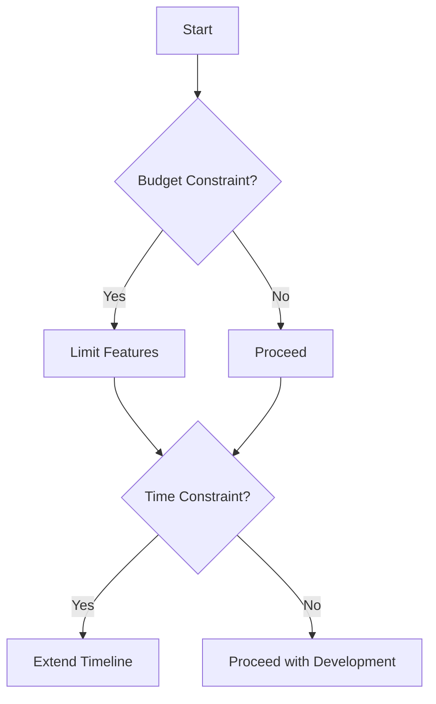
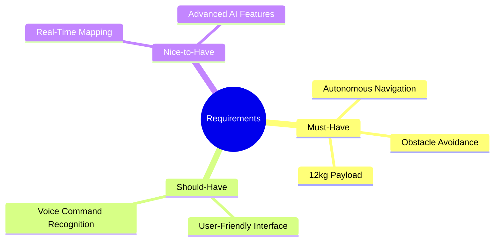
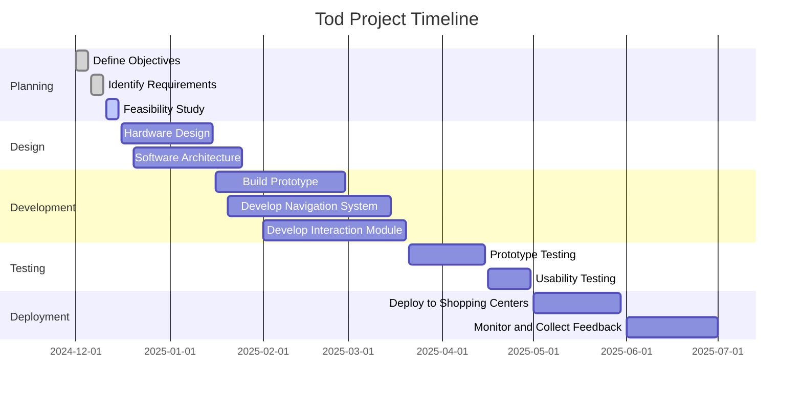
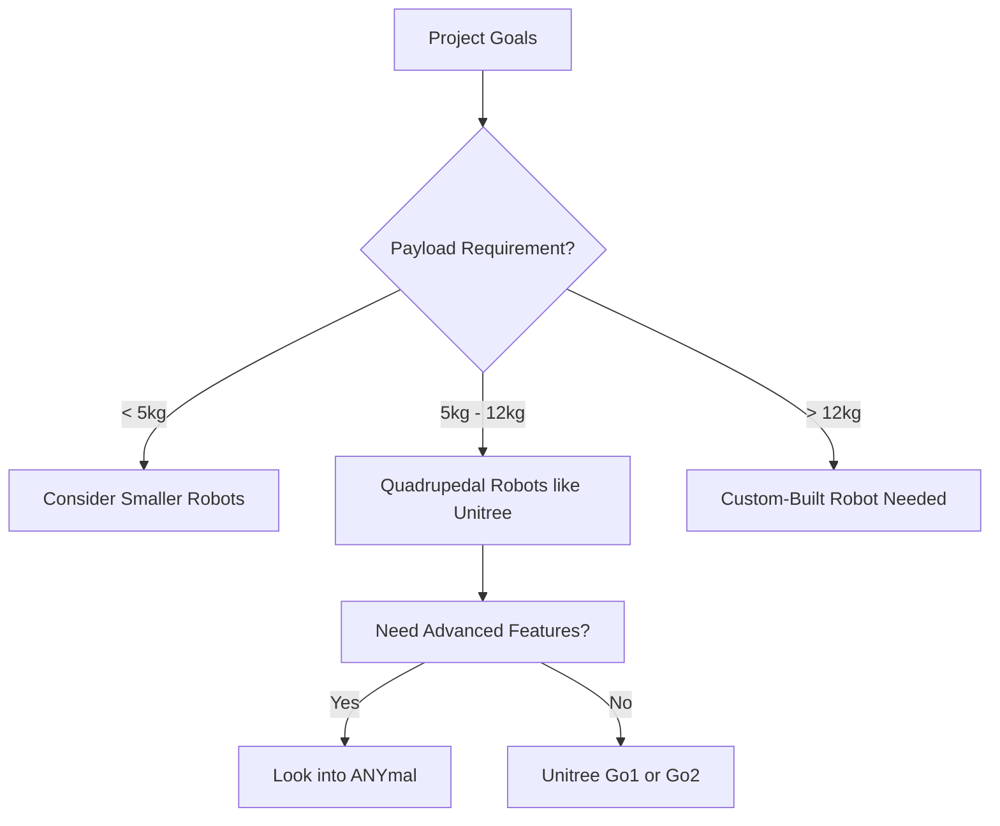
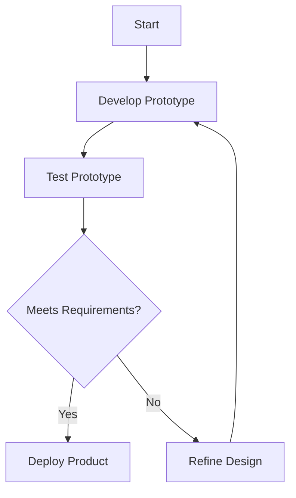

Embarking on a robotics project begins with a clear understanding of your objectives. Defining your goals and requirements is crucial as it sets the foundation for all subsequent decisions, from choosing the hardware to selecting the programming language. This section will guide you through the essential considerations to ensure your project is well-planned and aligned with your vision.

- [Establish the Purpose of Your Robot](#establish-the-purpose-of-your-robot)
- [Define Functional Requirements](#define-functional-requirements)
- [Set Performance Requirements](#set-performance-requirements)
- [Identify Constraints and Limitations](#identify-constraints-and-limitations)
- [Prioritize Requirements](#prioritize-requirements)
- [Create a Requirements Document](#create-a-requirements-document)
- [Visualize the Workflow](#visualize-the-workflow)
- [Analyze Impact on Subsequent Steps](#analyze-impact-on-subsequent-steps)
- [Decision-Making Aids](#decision-making-aids)
- [Examples of Technical Considerations](#examples-of-technical-considerations)
- [Prepare for Iteration](#prepare-for-iteration)
- [Next Steps](#next-steps)

## Establish the Purpose of Your Robot
Start by clarifying the primary function of your robot:

- What problem is your robot intended to solve?
- Who are the end-users?
- In what environment will it operate?

Example: For our quadrupedal robot Tod, the goal is to assist elderly shoppers by carrying their products in a shopping center. The end-users are senior citizens who may have difficulty carrying heavy items, and the environment is a bustling retail space with various obstacles.

This is the Go2 Package Robot, designed to assist users in carrying heavy items. The robot can navigate autonomously, avoid obstacles, and carry payloads of up to 12 kg. With its robust design, it is well-suited for use in indoor environments such as shopping centers or warehouses.  

Features include:  
- Autonomous navigation  
- Obstacle avoidance  
- 12 kg payload capacity 

Let's see how we got to making Tod!

## Define Functional Requirements
Functional requirements detail what your robot must be able to do:

- **Mobility**: Should it walk, roll, or fly? Does it need to navigate stairs or uneven surfaces?
- **Payload Capacity**: How much weight does it need to carry?
- **Navigation**: Will it operate autonomously or require human control?
- **Interaction**: Does it need to communicate with users or other systems?

|  |  |  |
|:---------------------------------:|:---------------------------------:|:-------------------------------:|
| Quadruped                 | Wheeled Vehicle                    | Drone                    |

Example: Tod must:
- Walk steadily on smooth surfaces.
- Carry up to 12 kg of goods.
- Navigate autonomously through the shopping center.
- Follow designated paths and avoid obstacles.
- Respond to basic user commands.

## Set Performance Requirements
These are measurable criteria to evaluate your robot's effectiveness:

- **Speed**: How fast should it move?
- **Battery** Life: How long should it operate before recharging?
- **Precision**: What level of accuracy is needed in its movements?
- **Reliability**: What is the acceptable failure rate?

Example: Tod should:
- Move at a speed of up to 1 m/s to match walking speeds.
- Operate for at least 4 hours to cover a full shopping day.
- Navigate with an accuracy of ±10 cm to prevent collisions.
- Have a failure rate of less than 1% over its operational lifetime.

## Identify Constraints and Limitations
Understanding limitations helps in realistic planning:
- **Budget**: What is the maximum amount you can spend?
- **Timeframe**: What are your deadlines?
- **Resources**: What equipment and expertise are available?
- **Regulations**: Are there safety or compliance standards to meet?

Example: Constraints for Tod include:
 - A budget of $50,000.
 - Completion within 12 months.
 - Limited access to advanced fabrication tools.
 - Compliance with public safety regulations for robots.

## Prioritize Requirements

Not all requirements are equal—prioritize them based on their importance to the robot's functionality and user experience:

- **Must-Have**: These are essential for the robot's basic operation and must be included in the final design. Without these, the robot cannot fulfill its intended purpose.
- **Should-Have**: These are important features that significantly enhance the robot's usability or performance but are not strictly necessary for it to function.
- **Nice-to-Have**: These are optional enhancements that provide additional value or convenience but can be deferred or omitted if time or budget constraints arise.

Example Prioritization for a Shopping Assistant Robot:

## Create a Requirements Document

Documenting ensures clarity and serves as a reference. Below are the key components of a requirements document, each illustrated with examples for "Tod," the quadrupedal shopping assistant robot.

1. Executive Summary: Provide a concise overview of the project's purpose and objectives.
  
   **Resource:** 
     - [How to Write an Executive Summary](https://www.smartsheet.com/content/executive-summary-examples)
     - [How to Write an Executive Summary (With Example)](https://www.indeed.com/career-advice/career-development/how-to-write-an-executive-summary)
     - [How to Write an Executive Summary (Example & Template Included)](https://www.projectmanager.com/blog/write-an-executive-summary)

2. Detailed Requirements: List all functional and performance criteria.
   **Functional Requirements for Tod:**
      - **Mobility**: Navigate smoothly on various surfaces within shopping centers.
      - **Payload Capacity**: Carry up to 12 kg of shopping items.
      - **User Interaction**: Respond to basic voice commands from users.
      - **Safety**: Detect and avoid obstacles to ensure user safety.

    **Performance Requirements for Tod:**

      - **Speed**: Maintain a walking speed of 1 m/s.
      - **Battery Life**: Operate continuously for at least 4 hours.
      - **Navigation Accuracy**: Navigate within ±10 cm of designated paths.

    **Resource:** [Product Requirements Document (PRD) Guide](https://productfolio.com/prd/)

3. Constraints: Note all limitations.

   **Constraints for Tod:**

     - **Budget**: Development budget capped at $50,000.
     - **Timeline**: Project completion required within 12 months.
     - **Resources**: Limited access to advanced fabrication tools.
     - **Regulations**: Must comply with public safety standards for robots.

   **Resource:** [How to Write a Product Requirements Document](https://productmanagementroadmap.com/prd-templates/)

4. Assumptions: State any conditions assumed during planning.

   **Assumptions for Tod:**

     - Shopping centers will provide charging stations for Tod.
     - Users possess basic familiarity with interacting with robots.
     - Operating environments are predominantly indoors with stable Wi-Fi connectivity.

5. Acceptance Criteria: Define how success will be measured.
 
   **Acceptance Criteria for Tod:**

     - **Functionality**: Successfully carries up to 12 kg of goods and follows users autonomously.
     - **Usability**: Receives positive feedback from at least 80% of test users regarding ease of use.
     - **Safety**: Demonstrates reliable obstacle detection and avoidance in 95% of test scenarios.

  By meticulously documenting each of these components, the development team can ensure that Tod meets all specified requirements and delivers a valuable service to its intended users.

## Visualize the Workflow
Understanding how your progress impact later work can be helpful. Here's a flowchart illustrating the process. [Gantt Chart](https://www.teamgantt.com/what-is-a-gantt-chart#:~:text=of%20the%20basics.-,What%20is%20a%20gantt%20chart%3F,each%20task%20in%20the%20project.) can be a very useful tool for this. Most tools, GitHub, Notion, Confluence, etc. support Gantt Charts. 

Imagine that we are trying to build and deploy Tod in 7 months. Here's an example of a Gantt Chart for this project:

## Analyze Impact on Subsequent Steps
Defining your goals early affects all later stages:

- Choosing a Robot: Your payload and mobility needs will influence whether you select a ready-made platform like Unitree Go1 or design a custom robot (see [Choose a Robot](/wiki/robotics-project-guide/choose-a-robot/)).
- Peripheral Hardware: Requirements for navigation and interaction will determine the sensors and actuators needed (see [Find Out What Peripheral Hardware You Need](/wiki/robotics-project-guide/choose-peripherals/)).
- Programming Language: Performance needs might lead you to choose C++ for speed, while complex algorithms or machine learning applications might favor Python (see [Choose Your Language](/wiki/robotics-project-guide/choose-a-language/)).
- Communication Method: Depending on real-time requirements and system complexity, you might opt for ROS or ROS2 (see [Choose Your Communication Method](/wiki/robotics-project-guide/choose-comm/)).
- Simulation: The need for testing in a virtual environment will guide your choice of simulator tools (see [Choose Your Simulator](/wiki/robotics-project-guide/choose-a-sim/)).

## Decision-Making Aids
Utilize decision trees or tables to weigh your options:

## Examples of Technical Considerations
- Speed vs. Control: If your robot needs to react quickly to obstacles, a language like C++ might be preferred for its execution speed (we'll delve deeper in [Choose Your Language](/wiki/robotics-project-guide/choose-a-language/)).
- Machine Learning Capabilities: For advanced features like voice recognition, Python offers extensive libraries and easier integration (more on this in [Choose Your Language](/wiki/robotics-project-guide/choose-a-language/)).
- Real-Time Communication: If your robot requires real-time data processing, ROS2 provides improved performance over ROS1 (explored further in [Choose Your Communication Method](/wiki/robotics-project-guide/choose-comm/)).

## Prepare for Iteration

When developing a complex project like "Tod," it’s crucial to acknowledge that initial requirements might evolve over time. Changes can arise due to unforeseen challenges, new insights, or feedback from testing and stakeholders. Preparing for iteration ensures your project remains adaptable and can accommodate these adjustments without derailing progress.

**Why Iteration is Important**
- **Dynamic Environments**: In real-world scenarios, conditions often change, requiring updates to your initial plans. For example, a shopping center might introduce new layouts or policies that "Tod" must accommodate.
- **Feedback Integration**: Early testing and user feedback often reveal flaws or areas for improvement, necessitating iterative updates.
- **Technology Advances**: New tools or technologies might emerge mid-project, offering better solutions for your robot's functionality.

**How to Prepare for Iteration**
1. **Flexible Planning**: Design a modular workflow where changes to one component have minimal impact on others.
   - Example: If "Tod’s" obstacle avoidance algorithm needs refinement, the navigation system should be isolated to avoid ripple effects across unrelated modules.
   
2. **Frequent Milestones**: Break down the project into smaller milestones to regularly assess progress and identify areas needing improvement.
   - Example: After completing the initial prototype, test its mobility in controlled environments before proceeding to full-feature development.

3. **Version Control**: Use tools like Git for version control to track changes and revert to earlier iterations if needed.
   - Example: Save versions of Tod's navigation code to compare performance across different implementations.

4. **Feedback Loops**: Incorporate feedback loops at every stage, from stakeholders, users, and internal teams.
   - Example: Gather feedback from elderly shoppers during a prototype demonstration to refine the user interface and interaction features.

**Examples of Iteration in Tod's Development**
1. **Requirement Adjustment**:
   - Initial Requirement: "Tod must operate autonomously in shopping centers."
   - Updated Requirement: "Tod must also handle outdoor transitions between parking lots and shopping centers."
   - Reason: User testing revealed that many elderly shoppers needed assistance from their car to the store.

2. **Algorithm Optimization**:
   - Initial Design: Use simple line-following algorithms for navigation.
   - Updated Design: Implement SLAM (Simultaneous Localization and Mapping) for dynamic route planning.
   - Reason: The shopping center introduced mobile kiosks and pop-up stalls that disrupted static paths.

3. **Hardware Modification**:
   - Initial Design: Plastic storage basket for carrying goods.
   - Updated Design: Replace with a sturdier metal frame.
   - Reason: Plastic was insufficient for heavier items like bottled water or canned goods.

**Best Practices for Iteration**
- **Document Changes**: Keep a detailed log of changes, including why they were made and their impact.
- **Set Revision Criteria**: Define criteria for when changes should be implemented. For instance, prioritize fixes for critical failures over minor enhancements.
- **Plan for Testing**: Allocate time and resources for re-testing after every major change.

**Benefits of Iterative Development**
- **Improved Quality**: Iteration allows continuous refinement, ensuring a more reliable and user-friendly product.
- **Risk Mitigation**: Catching and addressing issues early prevents costly fixes later.
- **Stakeholder Satisfaction**: Iteration demonstrates responsiveness to feedback, building trust and confidence in the project.

By preparing for iteration, you ensure "Tod" remains adaptable and capable of meeting its objectives despite evolving requirements and challenges.

## Next Steps
With a solid foundation of goals and requirements, you're ready to proceed to the next phase:

- [Choose a Robot](/wiki/robotics-project-guide/choose-a-robot/): Select a robot platform that aligns with your defined needs.
Find Out What Peripheral Hardware You Need: Identify sensors and actuators essential for your robot's functionality.

By thoroughly defining your goals and requirements, you set yourself up for a smoother development process, minimizing unexpected challenges and ensuring that each subsequent decision is informed and purposeful.