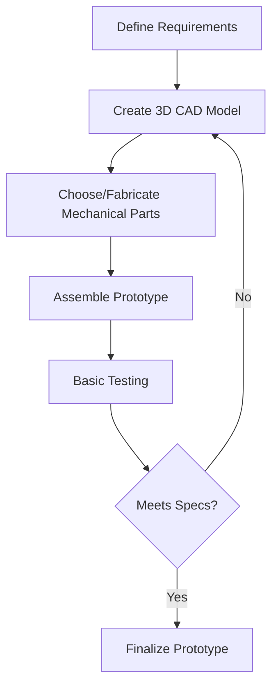

Building your own robot from scratch can be an exhilarating journey—it allows you to tailor the robot’s form and function to your exact requirements. Whether you’re designing a specialized quadruped for tough outdoor terrain, combining a wheeled base with a manipulator arm for industrial tasks, or creating something entirely new (like a six-legged spider that can traverse webs), this section will guide you through the essential considerations for “making” a robot.

- [Why Make a Robot?](#why-make-a-robot)
- [Initial Questions to Ask](#initial-questions-to-ask)
- [Design Choices \& Prototyping](#design-choices--prototyping)
- [Mechanical Fabrication](#mechanical-fabrication)
- [Electronics \& Connectivity](#electronics--connectivity)
- [Putting It All Together](#putting-it-all-together)

---

## Why Make a Robot?
Commercially available platforms (discussed in [Choose a Robot](#)) are often sufficient for many applications. However, these platforms may:

- **Lack Certain Features**: You might require a novel locomotion style, sensor suite, or payload capacity that standard platforms don’t provide.  
- **Restrict Customization**: Pre-built platforms may limit the changes you can make without voiding warranties or licensing agreements.  
- **Exceed Your Budget**: Sometimes, rolling your own system using off-the-shelf components and open-source designs is more cost-effective.  
- **Present a Unique Challenge**: Building from scratch can teach you invaluable lessons in mechanical design, electronics, and systems integration.

A homemade robot can be uniquely optimized to your goals and constraints, ensuring that your final design is both functional and adaptable.

---

## Initial Questions to Ask

Before diving into CAD software or ordering parts, revisit your [Goals and Requirements](#) to ensure clarity. Key questions include:

1. **Locomotion**  
   - Does the robot walk, run, roll, slither, fly, or swim?  
   - What terrains or environments must it handle?

2. **Size & Form Factor**  
   - Will it need to navigate tight spaces or doorways?  
   - Should it fit in a backpack, or can it be as large as a vehicle?

3. **Tasks & Payload**  
   - Must it lift, push, pull, grasp, or throw objects?  
   - What’s the maximum weight it needs to carry?

4. **Operating Environment**  
   - Indoor, outdoor, or both?  
   - Temperature/humidity extremes or dusty environments?

5. **Robustness & Safety**  
   - Does it need waterproofing or shock resistance?  
   - Are there critical safety features (like an E-stop) required?

6. **Time & Budget**  
   - How long do you have to design, fabricate, and test?  
   - Which processes can you handle in-house (3D printing, CNC machining) vs. outsourcing?

Having these broad questions answered upfront helps you create a roadmap for the design and build phases.

---

## Design Choices & Prototyping

**Conceptualize Your Robot:**
- Use **sketches**, **mockups**, or **cardboard models** to visualize forms and dimensions.
- Software tools like [SketchUp](https://www.sketchup.com/), [Fusion 360](https://www.autodesk.com/products/fusion-360/overview), or [SolidWorks](https://www.solidworks.com/) can generate 3D models for mechanical parts.
- Brainstorm how each subsystem (locomotion, manipulation, sensing) integrates into the overall design.

**Iterative Prototyping:**
- Start with a minimal prototype—maybe just the chassis or a single leg—to test feasibility.
- Gradually add complexity (sensors, electronics, grippers).  
- Validate each prototype step with small tests (see [Test and Debug Your Robot](#)).

**Mermaid Diagram – Design Workflow**  

## Mechanical Fabrication
Once you’ve sketched and prototyped, it’s time to bring your robot’s structure to life.

1. **Material Selection**

    - Common choices: aluminum, steel, plastics (e.g., ABS, PLA), or composites like carbon fiber.
    - Consider weight, strength, and ease of fabrication.

2. **Manufacturing Methods**

    - 3D Printing (FDM, SLA): Great for rapid prototyping and custom-shaped parts; less sturdy for heavy loads unless designed carefully.
    - CNC Machining: Offers high precision; suitable for metal parts.
    - Laser Cutting: Good for flat sheets of plastic or metal.
    - Handcrafting / DIY: For smaller components or proof-of-concept builds using basic tools.

3. **Assembly Fixtures**

    - Use nuts, bolts, or threaded inserts for part assembly.
    - Adhesives (epoxy, acrylic cement) can be used, but ensure components might still be replaced or upgraded later.

4. Open-Source Hardware

    Explore existing open-source designs on [Thingiverse](https://www.thingiverse.com/), [GrabCAD](https://grabcad.com/), or specialized robotics forums.
    Adapting proven designs can save time, especially for standard elements like wheel mounts or servo brackets.

## Electronics & Connectivity
1. **Microcontrollers / Single-Board Computers**

    - Arduino: Ideal for controlling basic motors, sensors, or LED indicators.
    - Raspberry Pi: Better suited for onboard processing, ROS, or computer vision tasks.
    - NVIDIA Jetson: Great for AI-based robotics with GPU acceleration (e.g., computer vision, deep learning).

2. Motor Drivers & Actuators

    - Servos: Provide positional control. Common in lightweight, smaller builds.
    - Brushless / Brushed Motors: For wheeled or flying robots. Requires appropriate ESCs (electronic speed controllers).
    - Linear Actuators: Handy for pushing/pulling mechanisms.
    - Pneumatics / Hydraulics: High force but also more complexity and cost.

3. Sensors

    - Proximity / Range: Ultrasonic, LiDAR, or IR for obstacle detection.
    - Vision: Cameras (RGB, depth), stereo vision systems.
    - Inertial Measurement Unit (IMU): Tracks orientation and acceleration.
    - GPS: For outdoor localization.

4. Communication & Networking

   - Wired: CAN bus, I2C, SPI, Ethernet (highly reliable, less flexible).
   - Wireless: Wi-Fi, Bluetooth, Zigbee, LoRa (versatile, potential latency).
   - ROS / ROS2: For node-based communication and distributed system design.

## Putting It All Together
When mechanical, electronic, and software components come together, system integration becomes your main focus:

1. Wiring & Cable Management

    - Maintain clear labels for each connection.
    - Use cable ties or braided sleeving to reduce clutter and potential damage.

2. Modularity

    - Group components by function (e.g., motor drivers on one board, sensor modules on another).
    - This simplifies troubleshooting and upgrades.

3. Power Distribution

    - Calculate total power draw.
    - Ensure batteries or power supplies can handle peak current demands.
    - Include proper voltage regulation for sensitive electronics.

4. Software Integration

    - Develop or adapt drivers for each piece of hardware (motors, sensors).
    - Tie everything together in your robotics framework (e.g., ROS) with clearly defined topics or services.

5. Safety & Redundancy

    - Build in fail-safes like emergency-stop (E-stop) buttons or watchdog timers.
    - Test abnormal conditions, such as power fluctuations or sensor failures, before real-world deployments.

**Final Assembly Checklist**

- [ ] Mechanical parts securely mounted.
- [ ] Wires neatly routed, labeled, and protected from friction.
- [ ] Batteries charged and mounted with stable brackets.
- [ ] Microcontroller / SBC runs initial boot tests and can connect to your PC over USB/Wi-Fi.
- [ ] Basic motion tests confirm that motors, servos, or actuators respond to commands correctly.

