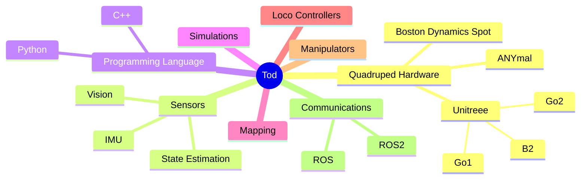
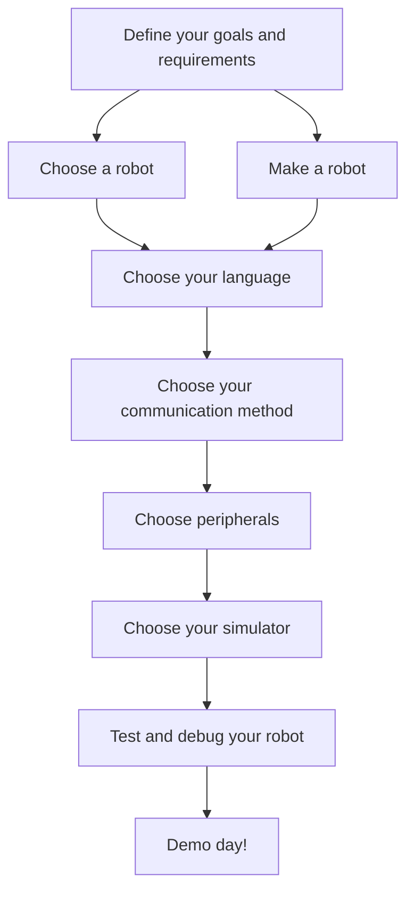

Starting a robotics project can be overwhelming. There's too many things to consider and if it's your first time doing robotics, then you may be flooded with all the options available in the internet. Let's say that you are developing a quadrupedal robot named `Tod`. `Tod`'s objective is to carry products in a shopping center for the elders so that they won't have a hard time shopping. We don't want to overwhelm you, but here's a map of possible options for each component of `Tod`. 

# Start here
If you are starting a robotics project for the first time, this is a good place to begin! Here, we will give you some guidance on what to consider in each step of a robotics project in detail.

Below is the overall flow you would need to take in a robotics project. Click on a step that you are interested in and it will take you there!

<!-- click F href "/wiki/robotics-project-guide/test-and-debug/"
click G href "/wiki/robotics-project-guide/demo-day/" -->
