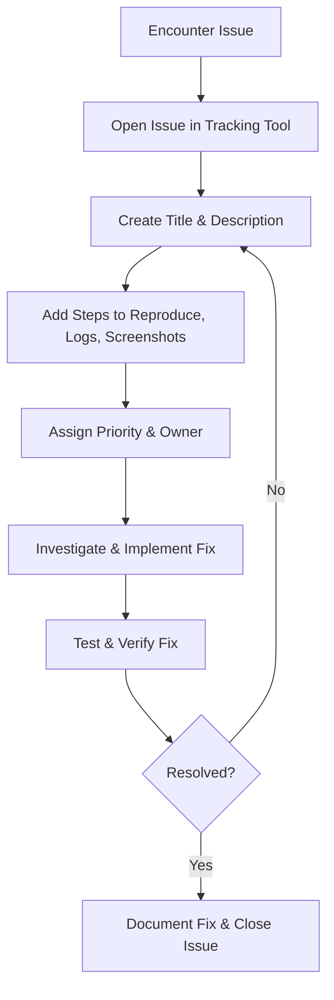
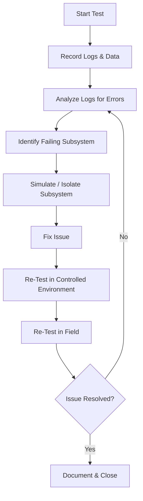

Testing and debugging your robot is a critical phase in the project life cycle. This step ensures that each subsystem — be it hardware, software, or communication — works reliably on its own and in harmony with the rest of the system. Whether you're dealing with a simple wheeled robot or a complex quadruped like `Tod`, a thorough test and debug cycle helps you catch issues early and iterate toward a stable, safe, and robust deployment.

By the end of this section, you will understand:  
- The importance of structured testing and how to create an effective test plan.  
- How to identify and isolate problems using various debugging tools.  
- The difference between simulation-based testing and real-world testing.  
- Common pitfalls and best practices for debugging complex robotic systems.  
- How to document and track bugs for continuous improvement.  

---

## Why Is Testing Important?

Remember! No matter how "physics-based" your simulator is, it's not the same as the real world. Imagine your quadruped robot `Tod` navigating a shopping mall. You’ve confirmed in simulation that your perception and planning algorithms work flawlessly. However, in the real world, lighting conditions, sensor noise, and unforeseen obstacles can introduce problems. 

Also, your lab doesn't represent the entire world. If you are testing your quadruped robot `Tod` only in your basement lab in a controlled setting, then you may miss out some important factors that may affect its performance in a shopping mall, which is its final deployment site. You won't be able to understand the unpredictable nature of kids running around, trying to mess with `Tod`. You won't be able to model the lighting if you only test it in the basement - how would your camera perform if the sun sets? 

Thus, a disciplined testing process requires that your robot is not only tested in your simulation and lab, but also in the same situations that you want it be deployed to. In other words, take your robot out! Make it do stuff in the places that it's meant to work in! There, dentify what's not working and what's working. Then, work on those issues.

A well-tested robot is more reliable and safer for deployment. Thorough testing helps you:

- **Validate Assumptions**: Confirm that your algorithms, hardware connections, and sensor configurations behave as expected.  
- **Ensure Safety**: Minimize the risk of unpredictable behavior, especially in environments with people or delicate objects.  
- **Save Time and Resources**: Detect and fix issues early, rather than scrambling to repair or redesign hardware later.  
- **Improve Performance**: Through iterative testing, you can fine-tune parameters, optimize code, and enhance reliability.

---

## Testing Phases: From Unit Tests to Field Deployment

To systematically ensure that each part of your robot works as intended, it’s helpful to progress through a series of testing phases, starting from small, isolated components and moving toward full real-world deployment. These phases often follow this sequence:

1. **Unit Testing**  
   - **Objective**: Validate individual components (e.g., a sensor driver or algorithmic function) in isolation.  
   - **Methods**: Use mock data, stubs, or small test fixtures to confirm that each piece of code or hardware behaves as expected.  
   - **Benefits**: Catches basic logic errors or hardware malfunctions early, preventing bigger headaches later.

2. **Integration Testing**  
   - **Objective**: Verify that multiple components or modules work together correctly.  
   - **Methods**: Combine a subset of modules (e.g., perception + planner) and check for seamless data exchange and proper coordination.  
   - **Benefits**: Reveals communication mismatches (e.g., topic or message format issues in ROS) and timing-related bugs.

3. **System Testing**  
   - **Objective**: Evaluate the entire robot in a controlled environment, ensuring end-to-end functionality.  
   - **Methods**: Deploy the integrated stack on the robot (or a simulated version) to perform real tasks like navigation or object manipulation.  
   - **Benefits**: Confirms that all subsystems work harmoniously under realistic conditions before introducing real-world variables.

4. **Hardware-in-the-Loop (HIL) Testing**  
   - **Objective**: Combine actual hardware components (sensors, motors, controllers) with simulated elements (virtual environment, synthetic sensor data).  
   - **Methods**: Plug your physical hardware into a simulation that mimics real-world conditions (e.g., friction, wind, lighting).  
   - **Benefits**: Assesses real hardware responses without fully risking expensive equipment in uncontrolled scenarios.

5. **Field Testing**  
   - **Objective**: Test the fully assembled robot under real-world or near-real-world conditions.  
   - **Methods**: Introduce the robot to its intended operational environment (e.g., a scaled-down or safe version of the actual deployment site).  
   - **Benefits**: Captures unstructured variables such as changing lighting conditions, human interference, and unexpected obstacles—helping validate robustness and safety.

Following these phases in sequence ensures that you catch issues as early as possible. Unit tests prevent trivial errors from piling up, integration tests reveal multi-module incompatibilities, system tests confirm holistic functionality, HIL testing mitigates risks before leaving the lab, and finally, field testing validates real-world performance. By systematically moving through these steps, you’ll build confidence in your robot’s readiness for deployment.

---

## Planning Your Test Procedure

A structured testing plan helps you stay focused on objectives and detect issues systematically. Here’s a suggested approach:

1. **Define Test Scenarios**  
   - Outline what you want to test. For instance, you might want to see how `Tod` handles slippery floors, low lighting, or heavy foot traffic.

2. **Specify Success Criteria**  
   - Determine metrics or observable outcomes to measure success (e.g., “Robot must achieve at least a 90% success rate in reaching the goal without collisions”).

3. **Document Procedures**  
   - List the steps needed for each test so you can replicate or share them. Detailed notes make it easier to compare results over time.

4. **Allocate Time and Resources**  
   - Ensure you have the necessary equipment (e.g., spare batteries, debugging tools), test environment access, and sufficient time to conduct tests without rushing.

5. **Collect and Analyze Data**  
   - Use tools like loggers, rosbags (for ROS/ROS2), or custom data recorders to capture sensor readings, commands, and any error messages.

---

## Common Debugging Techniques

Even a well-planned test can uncover unexpected problems. Below are some popular debugging strategies and tools:

1. Logging and Visualization
   - **ROS Loggers**: Print or store diagnostic messages (`rosconsole`, `rclcpp::Logger` in ROS2) to see what’s happening in your code.  
   - **Rosbag**: Record and replay sensor and topic data, allowing you to reproduce bugs without the physical robot.  
   - **Rviz or Foxglove**: Visualize sensor data, transformations, and robot state to quickly spot anomalies.

2. Step-by-Step Isolation
    When something goes wrong, break the system down into smaller parts:

   - **Check Individual Components**: Is the sensor returning valid data? Is the motor driver receiving commands?  
   - **Reintroduce Subsystems One by One**: If each component works alone but fails collectively, you likely have an integration issue.

3. Simulation-Based Debugging
   - **Simulate the Suspected Failure**: If you suspect a problem with obstacle avoidance, recreate it in simulation to see if the same errors occur.  
   - **Iterate Quickly**: Tweak software parameters (like PID gains) in a safe environment before returning to real hardware tests.

4. Hardware Debugging Tools
   - **Multimeter/Oscilloscope**: Check voltages, currents, and signal integrity.  
   - **JTAG or SWD Debuggers**: Directly inspect microcontroller operations if you suspect firmware issues.  
   - **Thermal Camera**: Identify overheating components or short circuits (useful for power distribution issues).

5. Software Debuggers
   - **GDB / LLDB**: Step through your C/C++ code to pinpoint crashes or memory corruption.  
   - **IDE Debuggers**: If using an IDE like Visual Studio, CLion, or Eclipse, leverage built-in breakpoints and watch variables.  
   - **Python Debuggers**: For Python-based code (e.g., `pdb` or `debugpy`), helpful for analyzing logic errors.

---

## Documenting Issues & Managing Resolutions

Effective issue documentation is pivotal for a smooth debugging and development process. When you clearly record what went wrong and how you fixed it, you not only help your current team but also create a history that future contributors can reference.

**Why Document Issues?**

1. **Traceability**: A well-documented process ensures you can trace when a bug was introduced, by whom, and in which component.  
2. **Collaboration**: Team members can easily share information and avoid duplicating work.  
3. **Accountability**: Assigning owners and priorities clarifies responsibility and urgency.  
4. **Efficiency**: Having reproducible steps saves time in diagnosing and fixing the same or similar issues later.  

**Essential Components of an Issue**

When filing an issue in any tracking system (e.g., GitHub Issues, Jira, GitLab), make sure to include:

1. **Title**  
   - Summarize the problem succinctly.  
   - Example: “Robot Fails to Detect Low-Light Obstacles”

2. **Detailed Description**  
   - Clearly describe the observed behavior.  
   - Include context: “Occurs only in environments with less than 50 lumens of ambient light.”

3. **Steps to Reproduce**  
   1. Turn off most lights in the test environment.  
   2. Attempt to navigate the robot down a corridor.  
   3. Observe if the obstacle detection module triggers.

4. **Expected vs. Actual Behavior**  
   - **Expected**: “Robot successfully detects obstacles and navigates around them.”  
   - **Actual**: “Robot continues forward and collides with objects.”

5. **Logs / Screenshots / Videos**  
   - Attach relevant console output, sensor logs, or error messages.  
   - Images or short clips often convey issues more clearly than text.

6. **Environment Details**  
   - Robot Operating System (ROS1, ROS2 version), platform (Linux, Windows), hardware specs, etc.  
   - Software versions or commit hashes.

7. **Additional Notes / Hypothesis**  
   - Any insights or suspicions about the cause.  
   - Mention if you suspect a sensor calibration issue or a planning algorithm flaw.

8. **Priority & Assignee**  
   - Mark the issue as `Critical`, `High`, `Medium`, or `Low` based on impact.  
   - Assign it to the relevant developer or team.

**Example Issue Template**

Below is a sample template you could use in GitHub Issues, Jira, or any issue tracker. It helps maintain consistency and clarity across all reported problems:

```markdown
**Title**: Robot fails to detect low-light obstacles

**Description**:
When the environment's illumination falls below ~50 lumens, the obstacle detection module frequently fails to identify objects. This leads to collisions and poses safety hazards.

**Steps to Reproduce**:
1. Prepare a dimly lit test area (~50 lumens).
2. Start the robot’s perception and navigation stack.
3. Send the robot a navigation goal at least 3 meters away.
4. Observe the robot’s behavior when obstacles are present.

**Expected Behavior**:
- The robot detects obstacles and navigates around them.

**Actual Behavior**:
- The robot drives forward without avoidance and collides with objects.

**Logs / Screenshots**:
- Attached `rosbag` file from 2025-01-20 showing vision node’s output in low light.
- Screenshot of the obstacle detection console logs indicating no detection event.

**Environment Details**:
- ROS2 Humble on Ubuntu 22.04
- Intel RealSense D435 camera for vision
- Commit Hash: `abc12345` in the `perception` branch

**Possible Causes**:
- Sensor exposure settings might be too low.
- Vision model not trained on low-light data.

**Priority**: High
**Assignee**: @username
```

**Workflow for Documenting and Resolving Issues**

The flowchart below shows a recommended process for documenting and resolving bugs in a structured manner:


1. **Encounter Issue**: Observe a bug, malfunction, or unexpected behavior in the robot’s software/hardware.
2. **Open Issue in Tracking Tool**: Create a new record in GitHub, GitLab, Jira, or your team’s chosen platform.
3. **Provide Clear Details**: Write a concise title, thorough description, steps to reproduce, and attach logs or media.
4. **Assign Priority & Owner**: Mark critical issues that block progress as high priority; assign them to a specific team member.
5. **Investigate & Implement Fix**: Debug systematically, referencing logs, using hardware/software debugging tools, and testing code changes.
6. **Test & Verify**: Once a potential fix is in place, confirm it resolves the issue in both simulation and physical tests if applicable.
7. **Document & Close**: Update the issue with a summary of what was changed and how it was verified. Close the issue if tests confirm the bug is resolved. If not, cycle back to the investigation step.

**Best Practices**

- **Use Consistent Templates**: A template standardizes the issue-creation process, ensuring no critical details are overlooked.
- **Link Pull Requests**: Reference issue numbers in commit messages and pull requests (e.g., “Fixes #42”) so that repositories and issues stay in sync.
- **Keep Track of Versions**: If a bug reappears, it might be tied to a specific version or commit. Proper tagging helps you revert or compare changes.
- **Review Fixes**: Even a one-line code change can introduce new bugs. Code reviews and peer testing can catch regressions early.

By diligently documenting and managing your issues throughout the debugging process, you build a robust audit trail. This approach not only accelerates resolution but also fosters a culture of transparency and continuous improvement—critical attributes for any successful robotics project.

---

## Common Pitfalls and How to Avoid Them

1. **Over-Reliance on Simulation**  
   - Simulation can’t perfectly replicate real-world conditions. Use it as a starting point, not the ultimate validation.

2. **Inconsistent Data Logging**  
   - Failing to standardize how and what data you log can make reproducing and diagnosing issues more difficult.

3. **Ignoring Edge Cases**  
   - Always test boundary conditions (e.g., low battery voltage, abrupt power cycles, extreme sensor readings).

4. **Rushed Field Tests**  
   - Jumping straight to real-world tests without verifying smaller subsystems often leads to bigger failures (and more frustration).

5. **Poor Documentation**  
   - Not keeping clear records of tests and fixes can cause repeated mistakes. Good notes and version control are crucial.

---

## Example Debugging Workflow

Below is a simplified visual of how you might iteratively debug `Tod` during a system test:



1. **Record Logs & Data**: Capture sensor outputs, controller commands, or any error messages.
2. **Analyze Logs**: Look for anomalies or repeated error codes.
3. **Isolate**: Try to replicate the error in a smaller subsystem or a simulator.
4. **Fix Issue**: Implement code/hardware adjustments.
5. **Re-Test**: Validate the fix first in a controlled setup, then in a real-world environment if safe to do so.
6. **Document**: Keep track of what you changed so you can reference it later.

---

## Tips for Efficient Debugging
- **Automate Where Possible**
    Use continuous integration/continuous delivery (CI/CD) pipelines to run automated tests on new code before it’s merged.
- **Use Version Control**
    Tag versions that pass all tests. This makes rollback simpler if new changes break something.
- **Pair Debugging**
    Work with a teammate to brainstorm solutions—fresh eyes often catch overlooked details.
- **Stay Organized**
    Keep a bug tracker or simple spreadsheet of issues, the steps to reproduce them, potential fixes, and final resolutions.

---

## Further Reading and Tools

Here is an expanded list of resources to deepen your understanding of debugging techniques, tools, and workflows. These links cover software debugging, hardware troubleshooting, and issue tracking, as well as automation for continuous testing.

**ROS Debugging**

1. **Using Rosbags**:  
   Learn how to record, replay, and analyze ROS topic data using rosbags.  
   [ROS Wiki: Using Rosbags](http://wiki.ros.org/rosbag/Documentation)

2. **ROS Logging and Printing**:  
   Comprehensive guide to using ROS loggers for debugging (`rosconsole`, `rosout`).  
   [ROS Logging and Printing](http://wiki.ros.org/rospy/Overview/Logging)

3. **ROS2 Debugging with Launch Logging**:  
   Debugging tools specific to ROS2, including logging and monitoring nodes.  
   [ROS2 Launch Debugging](https://docs.ros.org/en/galactic/Tutorials/Launch/Logging-and-debugging.html)

**General Debugging Guides**

1. **GDB Debugging Tutorial**:  
   A step-by-step guide to using the GNU Debugger (GDB) for C and C++ programs.  
   [GDB Debugging Tutorial](https://www.cs.cmu.edu/~gilpin/tutorial/)

2. **Python Debugging with pdb**:  
   Official Python documentation on `pdb`, a built-in debugger.  
   [Python Debugging with pdb](https://docs.python.org/3/library/pdb.html)

3. **Visual Studio Code Debugging**:  
   Learn how to debug code efficiently using VS Code's built-in debugger.  
   [VS Code Debugging Documentation](https://code.visualstudio.com/docs/editor/debugging)

4. **LLDB Debugging**:  
   A guide for using LLDB, a powerful debugger for macOS and iOS development.  
   [LLDB Debugging Guide](https://lldb.llvm.org/)

5. **Common Debugging Strategies**:  
   A general overview of debugging approaches and best practices.  
   [Common Debugging Strategies](https://developer.mozilla.org/en-US/docs/Learn/Common_questions/Debugging)

**Hardware Troubleshooting**

1. **SparkFun’s How to Troubleshoot (Hardware Guide)**:  
   Covers basic troubleshooting techniques for electronics and hardware.  
   [SparkFun Troubleshooting Guide](https://learn.sparkfun.com/tutorials/how-to-troubleshoot-electronics)

2. **Using a Multimeter for Troubleshooting**:  
   A beginner’s guide to using multimeters for checking circuits.  
   [Multimeter Basics](https://learn.sparkfun.com/tutorials/how-to-use-a-multimeter/all)

3. **Oscilloscope Fundamentals**:  
   Learn how to use oscilloscopes to measure electrical signals.  
   [Oscilloscope Basics](https://www.keysight.com/us/en/assets/7018-01269/guide/1000-Series-Oscilloscopes-User-Guide.pdf)

4. **Debugging with JTAG or SWD**:  
   Debugging microcontrollers using JTAG or SWD protocols.  
   [JTAG Debugging Guide](https://interrupt.memfault.com/blog/jtag-debugging)

5. **Using Thermal Cameras for Electronics**:  
   Detect overheating components with thermal cameras.  
   [Thermal Imaging for Electronics](https://www.flir.com/discover/instruments/electronics-and-semi/)

**Issue Tracking and Documentation**

1. **GitHub Issues**:  
   Manage bugs, feature requests, and tasks with GitHub Issues.  
   [GitHub Issues Documentation](https://docs.github.com/en/issues)

2. **GitLab Issues**:  
   Track and manage issues using GitLab’s built-in issue tracking system.  
   [GitLab Issues Documentation](https://docs.gitlab.com/ee/user/project/issues/)

3. **Jira for Issue Tracking**:  
   Enterprise-grade issue tracking and project management.  
   [Jira Documentation](https://www.atlassian.com/software/jira)

4. **Creating Effective Issue Templates**:  
   Improve issue documentation with templates.  
   [GitHub Issue Templates](https://docs.github.com/en/issues/using-labels-and-milestones-to-track-work/customizing-your-issue-template)

**Continuous Testing**

1. **GitHub Actions**:  
   Automate your testing and deployment workflows.  
   [GitHub Actions Documentation](https://docs.github.com/en/actions)

2. **GitLab CI/CD**:  
   A complete guide to setting up continuous integration and deployment with GitLab.  
   [GitLab CI/CD Documentation](https://docs.gitlab.com/ee/ci/)

3. **CircleCI**:  
   Set up automated testing pipelines with CircleCI.  
   [CircleCI Documentation](https://circleci.com/docs/)

4. **Travis CI**:  
   Popular CI service for open-source projects.  
   [Travis CI Documentation](https://docs.travis-ci.com/)


**Additional Debugging and Development Tools**

1. **Foxglove Studio**:  
   Visualize ROS and non-ROS robotics data in real-time.  
   [Foxglove Studio](https://foxglove.dev/)

2. **Wireshark for Network Debugging**:  
   Monitor and debug network traffic.  
   [Wireshark User Guide](https://www.wireshark.org/docs/wsug_html/)

3. **Valgrind**:  
   Tool for memory debugging, profiling, and leak detection.  
   [Valgrind Documentation](http://valgrind.org/)

4. **Turtlesim (ROS)**:  
   A lightweight tool for understanding ROS concepts while debugging.  
   [Turtlesim Documentation](http://wiki.ros.org/turtlesim)

By exploring these resources, you’ll gain a deeper understanding of debugging and issue management techniques. With tools for every stage of testing and debugging, you’ll be well-prepared to tackle challenges in your robotics project.

## Next Steps

By carefully following a structured test plan, harnessing the right debugging tools, and learning from each issue you encounter, you can accelerate development and ensure that your robot behaves predictably and safely. With testing complete, you’ll have confidence in your robot’s performance—whether it’s cruising through a shopping mall or operating in other complex, real-world environments.

- **[Demo Day!](/wiki/robotics-project-guide/demo-day/)**: It's time to show your robot to the world!