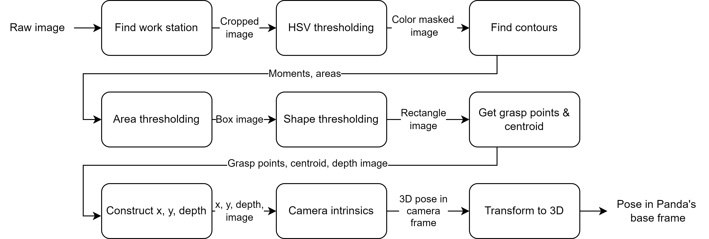
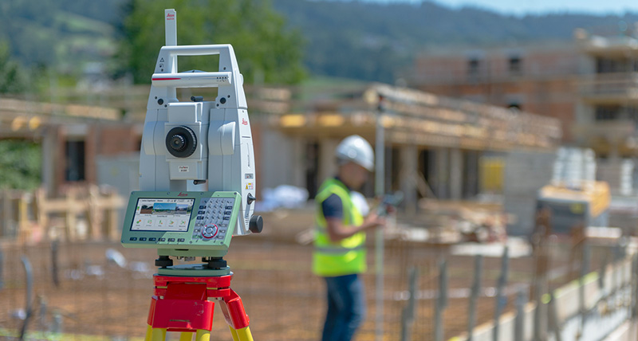
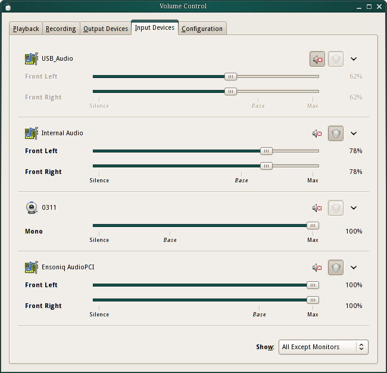

/wiki/sensing/adafruit-gps.md
---
date: 2017-08-15
title: Adafruit GPS
---
 

The Adafruit Ultimate GPS module is designed for convenient use with Arduino, Raspberry Pi, or other commonly used micro-controllers. The breakout is built around the MTK3339 chipset, a no-nonsense, high-quality GPS module that can track up to 22 satellites on 66 channels, has an excellent high-sensitivity receiver (-165 dB tracking), and a built-in antenna!

The GPS module can do up to 10 location updates per second for high speed, high sensitivity logging or tracking. Power usage is incredibly low, only 20 mA during navigation. It includes an ultra-low dropout 3.3V regulator so you can power it with 3.3-5VDC inputs, ENABLE pin so you can turn off the module using any microcontroller pin or switch, a footprint for optional CR1220 coin cell to keep the RTC running and allow warm starts and a tiny bright red LED. The LED blinks at about 1Hz while it's searching for satellites and blinks once every 15 seconds when a fix is found to conserve power.

Two features that really stand out about this version 3 MTK3339-based module is the external antenna functionality and the the built in data-logging capability. The module has a standard ceramic patch antenna that gives it -165 dB sensitivity, but when you want to have a bigger antenna, you can easily add one. The off-the-shelf product can be easily purchased from either [Adafruit](https://www.adafruit.com/product/746) or [Amazon](https://www.amazon.com/Adafruit-Ultimate-GPS-Breakout-channel/dp/B00GLW4016/ref=sr_1_1?ie=UTF8&qid=1495048345&sr=8-1-spons&keywords=adafruit+ultimate+gps+breakout&psc=1), and it comes with one fully assembled and tested module, a piece of header you can solder to it for bread-boarding, and a CR1220 coin cell holder.

A summary of all technical details mentioned above is as the following:
 - Satellites: 22 tracking, 66 searching
 - Patch Antenna Size: 15mm x 15mm x 4mm
 - Update rate: 1 to 10 Hz
 - Position Accuracy: < 3 meters (all GPS technology has about 3m accuracy)
 - Velocity Accuracy: 0.1 meters/s
 - Warm/cold start: 34 seconds
 - Acquisition sensitivity: -145 dBm
 - Tracking sensitivity: -165 dBm
 - Maximum Velocity: 515m/s
 - Vin range: 3.0-5.5VDC
 - MTK3339 Operating current: 25mA tracking, 20 mA current draw during navigation
 - Output: NMEA 0183, 9600 baud default
 - DGPS/WAAS/EGNOS supported
 - FCC E911 compliance and AGPS support (Offline mode : EPO valid up to 14 days )
 - Up to 210 PRN channels
 - Jammer detection and reduction
 - Multi-path detection and compensation

Best of all, Adafruit has also provided [a detailed tutorial](https://learn.adafruit.com/adafruit-ultimate-gps/overview) on its website and an [Arduino library](https://github.com/adafruit/Adafruit_GPS) that "does a lot of the 'heavy lifting' required for receiving data from GPS modules, such as reading the streaming data in a background interrupt and auto-magically parsing it". Overall, the abundant resources available to the public allow users from all levels to fully take advantage of the powerful functionality that this GPS module can provide.

To use the GPS module on ROS, the [nmea_navsat_driver](http://wiki.ros.org/nmea_navsat_driver) is an excellent ROS package for obtaining fix position and velocity information efficiently from the sensor's raw output:

``$ rosrun nmea_navsat_driver nmea_serial_driver _port:=/dev/ttyACM0 _baud:=115200``

/wiki/sensing/apriltags.md
---
date: 2018-08-30
title: AprilTags
---
AprilTags is a visual fiducial system, useful for a wide variety of tasks including augmented reality, robotics, and camera calibration. The tags provide a means of identification and 3D positioning, even in low visibility conditions. The tags act like barcodes, storing a small amount of information (tag ID), while also enabling simple and accurate 6D (x, y, z, roll, pitch, yaw) pose estimation of the tag.


The AprilTags project originates from a team at the University of Michigan, that has a [detailed website dedicated to the research](https://april.eecs.umich.edu/apriltag/), which is a good starting off point for learning how to use all of the software. The team has provided implementations in both Java and C to read AprilTags from a camera and there are additional implementations available online for tag reading. In addition to the software available on their website, a student at MIT has released a [C++ implementation](http://people.csail.mit.edu/kaess/apriltags). This website also has printable AprilTags for several tag families available in PDF format.

## ROS implementation

In ROS Groovy and Hydro, there is no built-in AprilTag recognition software. Our team is working on wrapping the code from the MIT C++ implementation into a working ROS package, which outputs AprilTags that are seen in a camera image as tf transforms and messages.

## Experimental Results

In informal tests, the April Tags were able to achieve accuracy within 4 centimeters of the actual pose when the camera was within 2 meters of the tag. If the robot was further away, the accuracy decreased proportionally to the distance from the tag.

A few methods of improving speed and range are available at [AprilTags - Improving Speed and Range](http://cmumrsdproject.wikispaces.com/AprilTags+-+Improving+speed+and+range)

## Potential Problems

There are several key aspects to take into consideration when deciding on whether to use AprilTags.
1. The accuracy of the pose estimation is only as good as the camera being used.
  - In tests conducted by CMU MRSD Team E (2014), the Kinect camera was adequate, since it outputs a fairly high quality RGB image at 640px by 480px. The team had problems when using a low quality, < $10 camera we found online. The tag detections were not able to give reliable detections of tags, and when the camera was being moved, the results were even worse.
  - The same team's final hardware solution was a Logitech c270HD webcam, which we ran at a resolution of 640px x 480px. The quality was good, and the pose estimation results were accurate once the parameters were properly tuned.
- Motion affects the accuracy of the pose estimation
  - When the robot is moving, especially while turning, it was found that the pose estimation could be off by > 20 degrees, and vary in range by up to 0.75 meters. We determined that the best course of action for our robot was to stop when an AprilTag was detected in order to get a more accurate pose estimation.
- Distance to the tag can affect the pose estimate
  - The MRSD team's hardware setup (Kinect), saw that the pose was accurate out to a range of 2.4 meters, but could vary substantially when further than that. They decided that the robot should not localize when it is beyond this threshold range.
- Finding proper camera configuration parameters is essential
  - The initial trials of the robot were inaccurate for several reasons, as mentioned above. Another reason for inaccurate localization and pose estimation was the default values for a camera parameter did not match the specifications of the hardware we were using, specifically focal length. The Kinect sensor has a focal length, in pixels, of 525, but the default value in the software was 600. This caused incorrect size estimation by the software, which meant that the robot thought it was closer than it was to the tag. Once the parameter was adjusted, the accuracy improved by several centimeters at close range, and more at further distances.

## Alternatives
An alternative to AprilTags for localization/pose estimation of an object is the [AR tag,](http://www.artag.net/) which was created for Augmented Reality, but can provide similar pose estimation. The benefit of using AprilTags is the improved accuracy, especially in less optimal lighting conditions.


## Transforming the frame
One of the problems with running the April Tag node is that your frame output is dependent on the orientation of the body moving. Changes in your body's orientation changes the frame and makes it hard to have a consistent coordinate system. Team E 2014 wrote code in order to transform the AprilTag information to a consistent frame. The source code is [april tag frame transform](https://github.com/ColumnRobotics/column/blob/master/src/rectified_april_tag.cpp). The team found this code to be a bit noisy, so we wrote a RANSAC filter, available [here](https://github.com/ColumnRobotics/column/blob/master/src/BodyPoseFilter.cpp). A way to fix these errors would be to rely on the IMU orientation for the transformation and not the orientation from the April Tag.

## References
1. AprilTag homepage: http://april.eecs.umich.edu/wiki/index.php/AprilTags
- AprilTag C implementation: http://april.eecs.umich.edu/wiki/index.php/AprilTags-C
- AprilTag Java implementation: http://april.eecs.umich.edu/wiki/index.php/AprilTags-Java
- AprilTag C++ implementation:http://people.csail.mit.edu/kaess/apriltags/
- AR Tags: http://www.artag.net/
- Augmented Reality Tracking (ALVAR): http://virtual.vtt.fi/virtual/proj2/multimedia/alvar/
- ALVAR ROS Wrapper: http://wiki.ros.org/ar_track_alvar

wiki/sensing/azure-block-detection.md
---
# Jekyll 'Front Matter' goes here. Most are set by default, and should NOT be
# overwritten except in special circumstances. 
# You should set the date the article was last updated like this:
date: 2023-12-13 # YYYY-MM-DD
# This will be displayed at the bottom of the article
# You should set the article's title:
title: Azure Block Detection 
# The 'title' is automatically displayed at the top of the page
# and used in other parts of the site.
---

This article presents an overview of object detection using the Azure camera without relying on learning-based methods. It is utilized within our Robot Autonomy project, specifically for detecting Jenga blocks and attempting to assemble them.

### Detection Pipeline
To identify individual blocks and their respective grasping points, the perception subsystem undergoes a series of five steps. Initially, it crops the Azure Kinect camera image to center on the workspace. Following this, it applies color thresholding to filter out irrelevant objects and discern the blocks. Subsequently, it identifies the contours of these blocks and filters them based on their area and shape characteristics. Once the blocks are recognized, the perception subsystem computes the grasping points for each block. Collectively, these steps facilitate the accurate detection of block locations and their corresponding grasping points on the workstation.




### Image Cropping
The initial stage of the perception subsystem involves cropping the raw image. Raw images often contain extraneous details, such as the workspace's supporting platform or the presence of individuals' feet near the robot. By cropping the image to focus solely on the workspace, we eliminate a significant amount of unnecessary information, thereby enhancing the system's efficiency and robustness.

Currently, this approach employs hard-coded cropping parameters, requiring manual specification of the rows and columns to retain within the image.


### Color Segmentation
Color segmentation can pose challenges in images with prominent shadows. Shadows cause a decrease in RGB pixel values, while light causes an increase, making it challenging to distinguish between different colors. To address this, we employ HSV (Hue, Saturation, Value) thresholding on the image.

For reliable detection of the brown color of the Jenga blocks under varying lighting conditions, we utilize the HSV color space, consisting of three channels: hue, saturation, and value. By thresholding these channels, we filter out the desired colors. However, using a fixed RGB threshold for detecting brown is challenging due to its variable RGB values under different lighting.

To tackle this issue, we employed color meter software to establish the brown color range for the Jenga blocks. This range, encompassing lower and upper brown values, was applied to our HSV thresholding function. The resulting HSV thresholded image is depicted in Figure 10b.

To further refine Jenga block detection and eliminate background noise, we apply a mask to the HSV thresholded image. Initially, we create a mask by contour area thresholding and then fill any holes within the contour to obtain a solid mask. The resulting masked image is shown in Figure 6a. This process ensures the reliable detection of Jenga blocks by removing remaining noise or unwanted objects.


### Block Contours

Contours play a pivotal role in computer vision's object detection. In our perception system, we utilize the mask derived from the HSV thresholded image to generate precise and consistent contours, enhancing accuracy.

We utilize OpenCV2's 'findContours' function to generate contours from the masked image. However, these contours encompass not only the Jenga blocks but also the robot manipulator. Since our focus is solely on detecting rectangular shapes corresponding to the Jenga blocks, we employ thresholding based on approximate block size and rectangular characteristics.

To simplify contours and reduce points, we apply OpenCV2's 'minAreaRect' function to the contours. This function generates contours with only four points representing the four corners of the blocks. Comparing the area of the original contour with the 'minAreaRect' contour allows us to confirm if the detected object is indeed a rectangle by setting a threshold ratio.

Subsequently, we identify the two grasp points of the block by detecting its longer sides. To determine these grasp points in the image frame, we align the depth image with the RGB image to acquire the depth value. Utilizing the x, y, and depth values, we transform the 2D pixel points back to the 3D pose in the camera frame using the intrinsic matrix. The grasp point concerning the base frame is then computed by performing a transform tree lookup, thereby completing the entire perception cycle.


### Image HSV Thresholding vs. Normalization

To mitigate the issue of filtering out irrelevant data, we explored two approaches: HSV thresholding and image normalization. In addition to the conventional representation of each pixel as an RGB value, pixels can also be depicted as 3D vectors in RGB space. While lighting influences the vector's magnitude, it doesn't alter its direction. Normalizing each vector nullifies the lighting effect, preserving only its direction and effectively converting RGB vectors into unit vectors.

For identifying jenga block pixels, we calculated the cosine similarity between each pixel's RGB vector and the background color. Pixels with excessive similarity to the background were masked out.

Although image normalization showed promise, it proved less effective in cluttered scenarios compared to the HSV method. The HSV method, involving thresholding in the HSV color space, exhibited greater reliability in detecting jenga blocks across varying lighting conditions.

Normalized Image             |  HSV Image
:-------------------------:|:-------------------------:
  |  


## References
- [MIT Jenga Robot](https://news.mit.edu/2019/robot-jenga-0130)


wiki/sensing/camera-calibration.md
---
date: 2017-08-15
title: Camera Calibration
---

It is quite common for projects to involve vision systems, but despite this most teams working with cameras ignore the basic advantages of calibrating a camera properly. Not only does a good calibration lead to better quality of data in form of images captured but also reduces overall errors in the vision the system, a properly calibrated camera helps avoid unnecessary delays due to radiometric and geometric errors.

## References
Listed below are a few good places to get started on camera calibration.
- Quick intro. and overview: https://www.cs.umd.edu/class/fall2013/cmsc426/lectures/camera-calibration.pdf
- A comprehensive guide: http://www.cs.rutgers.edu/~elgammal/classes/cs534/lectures/CameraCalibration-book-chapter.pdf
- Chapter 2 in this book: http://szeliski.org/Book/drafts/SzeliskiBook_20100903_draft.pdf (I would highly recommend this book, above all)
- Using MATLAB for online/offline calibration: https://www.mathworks.com/help/vision/camera-calibration.html

wiki/sensing/camera-imu-calibration.md
---
date: 2019-05-07
title: IMU-Camera Calibration using Kalibr
---
This tutorial will help you in setting up the Kaliber library developed at ETH Zurich for combined IMU-Camera calibration. 
For better understanding, we have also included an example of Pixhawk (IMU) and ZED camera (stereo camera) calibration procedure. 

# Table of Contents
1. [Introduction](#Introduction)
2. [Requirement](#Requirement)
3. [Calibration Procedure](#Calibration-Procedure)
4. [Few notes and important tips](#Few-notes-and-important-tips)
5. [References](#References)

## Introduction
Kalibr library simultaneously computes the homogeneous transformation (denoted as **<sup>I</sup>H<sub>W</sub>**) between the camera and the world frame, and the homogeneous transformation (denoted as **<sup>C</sup>H<sub>W</sub>**) between IMU and the world frame. A 6x6 AprilTag grid map is used as the landmarks for the calibration procedure.
Above two transformations (<sup>I</sup>H<sub>W</sub> & <sup>C</sup>H<sub>W</sub>) can be used to compute the transformation between Camera and IMU i.e. <sup>C</sup>H<sub>W</sub> <sup>W</sup>H<sub>I</sub>. In this method the IMU is parameterized as 6x1 spline using the three degrees of freedom for translation & three degrees of freedom for orientation. Based on the raw acceleration & angular velocity readings from the on board IMU, the acceleration and the angular velocity is computed in terms of <sup>C</sup>H<sub>W</sub>.

This library needs an initial guess of <sup>C</sup>H<sub>W</sub>, the homogeneous transformation which is first computed for each April tag using the PnP algorithm. Then the error between the predicted positions of the landmark based on the IMU reading and the observed position of the landmark using a camera is minimized using Levenberg Marquardt optimizer. So, this library generates the following output: <br/>
(i) the transformation between the camera and the IMU <br/>
(ii) the offset between camera time and IMU time (synchronization time) <br/>
(iii) the pose of the IMU w.r.t to world frame <br/>
(iv) Intrinsic camera calibration matrix, K for the camera <br/>

Going through this [paper's](https://furgalep.github.io/bib/furgale_iros13.pdf) section III B and IV will give deeper insights into the implementation.

## Requirement
1. A printout of 6x6 AprilTag 36h11 markers on A0 size paper. This can be downloaded from [here](https://drive.google.com/file/d/0B0T1sizOvRsUdjFJem9mQXdiMTQ/edit).
2. This [CDE](https://drive.google.com/file/d/0B0T1sizOvRsUVDBVclJCQVJzTFk/edit) package is the easiest and the fastest way to get the library running. All dependencies are packed within this package and no external dependencies are required.
3. ROS drivers for the IMU and camera. Pixhawk, Ardupilot is typically used for UAVs and UM6/7 is popular for ground robots like Husky. ZED, Asus Xtion Pro, Intel Realsense D435 are few popular stereo cameras.

## Calibration Procedure
Download and extract the CDE package.
```
  tar xfvz kalibr.tar.gz
```

Either you can run the tools directly from the cde-package folder or/and add the package folder to the system path using: 
```
  export PATH="/cde/package/path:$PATH"
```
Change the AprilTag size in the YAML file and copy the same yaml file inside the extracted kalibr folder. <br/> Now make sure that both IMU & Camera publishes raw data and images respectively to ROS. Below command will list all the ROS topics published by the sensor.
```
rostopic list
```
Before creating ROS bag check if the sensor data is published properly.
```
rostopic echo /topic_name
```
Check the publishing rate of a topic. It is recommended that the camera should run at 20 Hz and IMU at 200 Hz.
```
rostopic hz /topic_name
```
Further, move the robot along all its degree of freedom. For instance, the axes of the UAVs are translated in x,y & z direction & rotated in all the three directions (roll,pitch & yaw) for the proper calibration. Collect the IMU sensor’s raw measurement and camera frame for around 60 seconds. Before recoding camera data, ensure that the RGB images from the camera is converted into the grayscale format. 

In this sample example, Pixhawk sensor data is subscribed from the MAVROS raw_sensor message & camera frames are subscribed from the ZED sensor camera node. For other IMUs/Cameras only the ROS message name will change.

Start ZED sensor camera
```
roslaunch zed_wrapper zed.launch
```
and similarly, start pixhawk
```
roslaunch mavros px4.launch
```
Below command will start the recording.
```
rosbag record -O camera-imu-data.bag /imu/data_raw /zed/left/image_raw /zed/right/image_raw
```
Check the recorded data by using the following command.
```
rosbag play <your bagfile>
```
If all the required data is recorded properly, run following camera calibration command.
```
./kalibr_calibrate_cameras --models pinhole-equi pinhole-equi --topics /zed/left/image_raw /zed/right/image_raw --bag camera-imu-data.bag --target aprilgrid_6x6.yaml
```
Arguments:<br/>
- models: Most typically used stereo cameras are of pinhole camera model. For more detail on the supported models, refer to this [link](https://github.com/ethz-asl/kalibr/wiki/supported-models).<br/>
- topics: Name of the recodered camera topics  <br/>
- bag: ROS bag containing the image and IMU data <br/>
- target: yaml configuration file for the used target <br/>

This command will generate a new yaml file with camera intrinsic calibration parameters. Above command can be skipped if the camera calibration yaml is already available. Now run below imu-camera calibration script.
```
./kalibr_calibrate_imu_camera --cam cam_calc.yaml --target aprilgrid_6x6.yaml --imu imu0.yaml --bag camera-imu-data.bag
```
Arguments:<br/>
- cam: Generated camera calibration yaml configuration file<br/>
- imu: yaml configuration file for the IMU<br/>

For more detail on the different yaml format, please check this [link](https://github.com/ethz-asl/kalibr/wiki/yaml-formats)<br/>

After running kalibr_calibrate_imu_camera script, the camera calibration yaml will be extended by the imu-camera calibrator with imu-camera transformations.

## Few notes and important tips
1. During testing, ensure that the robot is moved slowly so that a sufficient amount of data is collected in a single position and try to excite all the IMU axes. 
2. Ensure that most of the camera frame has all the April tags captured in it.
3. Avoid shocks during the testing, especially at the beginning and the end of the data collection. 
4. The tool requires a rosbag with more than 1000 images, which leads to a ROS bag of few GBs. So, it is suggested to be run on the development machine instead of the onboard SBC.
5. This tool needs raw imu sensor data, to ensure that the correct ROS message is recorded from the IMU. 
6. Make sure the calibration target is as flat as possible. 

## References
Official github repository of the Kalibr tool can be found [here](https://github.com/ethz-asl/kalibr/).


wiki/sensing/computer-vision-considerations.md
---
date: 2017-08-15
title: Computer Vision for Robotics- Practical Considerations
---
Things to take care of when working with vision in robotics:

Its easy to get enchanted by the promises of the camera. However, computer vision can kill you if you don't heed to some important things. (It can kill you even after that though!). Below are some pitfalls one can avoid:

## Lighting
- Your vision algorithms effectiveness is directly dependent on the surrounding lighting, after all camera is just a device to capture light.
- ALWAYS test in your real conditions! The biggest mistake in robotics is telling yourself- it should work!

## Camera
- Know the camera's field of view and maximum resolution.
- Sometimes autofocus can also be a pain to deal with -- mostly you will be better off with a camera without it.
- Same with autoexposure.

## Calibration
- If you are doing pose estimation using CV, your calibration error will affect your pose accuracy/precision.
- When calibrating, make sure your target (chessboard) is as planar as it can get. Also make sure its edges and corners are sharp.
  - The above point is even more relevant if you are using the OpenCV software for calibration because it auto-detects corners
  - Apart from OpenCV, another good calibration toolbox is [Caltech Calib Toolbox](http://www.vision.caltech.edu/bouguetj/calib_doc/).

## Scale
- Any knowledge you recover about the world using Computer Vision is only accurate up to a scale. Estimating this scale is difficult. Possible solutions include:
  - Depth Sensors (Kinect): will consume power and processor though
  - Stereo camera pair: low on power, but inaccurate after a point (depends on baseline)
  - Known measurement in image: simple and effective, however it requires prior knowledge of the robot's operating environment.

## Numerical Errors:
- This is an inherent problem with vision due to the fact that pixels are discrete. One of the things you can do is normalize your values before applying any algorithm to it.
- Another is using as much precision as you can.

## Frame Rates
- CV algorithms can be very slow, especially on the limited hardware capabilities of most robotic systems. This can be bad for estimation algorithms. Try and make your algorithm run faster. Some ways to do that are:
  - Parallelization: Difficult but, if implemented well, can provide huge boosts to speed. Make sure you know what you're doing -- its very easy to go wrong with parallelization.
  - Region of Interest (RoI): if you are not working on the entire image, do not process the entire image. Some intelligent heuristics can be used to select RoIs.
  - Resolution: :ower the resolution. However, this is a tradeoff. You may end up increasing your error.

## Reference Frame
- This is a common problem across robotics and sensors -- not just for vision. Be sure of the frame in which you get values from any software/algorithm. Especially if you are using third party software (say ROS packages).
- ALWAYS perform sanity checks with moving (rotate + translate) camera by hand.

## Summary
If you keep the above points in mind, dealing with Computer Vision will be easier. You will be able to save days of debugging time.


wiki/sensing/delphi-esr-radar.md
---
date: 2017-08-15
title: Delphi ESR Radar
---


Delphi's multimode Electronically Scanning RADAR (ESR) combines a wide field of view at mid-range with long-range coverage to provide two measurement modes simultaneously. The mid-range coverage (60m, +/-45 deg) not only allows vehicles cutting in from adjacent lanes to be detected but also identifies vehicles and pedestrians across the width of the equipped vehicle. The long-range coverage (175m, +/-11 deg) provides accurate range and speed data with powerful object discrimination that can identify up to 64 targets in the vehicle's path.
Delphi's technologically advanced ESR uses proven solid state technology plus class-leading performance, packaging and durability to offer customers game-changing forward radar detection. The quality of data provided by Delphi's system enables powerful functionality including adaptive cruise control, forward collision warning, brake support and headway alert.


For more introductory information about the sensor and its state-of-the-art technology, please refer to the [official datasheet released by Delphi.](http://cmumrsdproject.wikispaces.com/file/view/delphi_esr_datasheet.pdf/613230495/delphi_esr_datasheet.pdf)

It is always a good idea to study/review some fundamental principles of the radar technology and basic techniques in radar data processing before working on the actual hardware. [This online tutorial](http://www.radartutorial.eu/01.basics/Radar%20Principle.en.html) will offer you the necessary knowledge to build a solid theoretical background for working with the radar hardware.

To get started with the Delphi ESR 2.5 radar, please refer carefully to the instruction in the user manual provided by Delphi.

The data can be acquired from the Delphi ESR 2.5 radar through CAN (Controller Area Network) and/or Ethernet. The raw detection-level data can be obtained through Ethernet, while the raw tracking-level data can be obtained through CAN. In case you need additional assistance on the data acquisition from Delphi ESR 2.5, [AutonomouStuff](https://autonomoustuff.com/product/delphi-esr-2-5-24v/) and [PolySync](http://docs.polysync.io/sensors/delphi-esr-2-5/) also provide generous supports on this specific sensor model, besides the manufacturer Delphi.

References:
1. Delphi ESR Radar Product Page: http://autonomoustuff.com/product/delphi-esr-2-5-24v/

wiki/sensing/fiducial-markers.md
---
date: 2022-04-26
title: Comparison of Fiducial Markers
published: true
---
## Why is this comparison important?
Different fiducial markers are best suited for different applications, so this article elucidates a brief list of pros and cons to evaluate different fiducial markers, enabling readers to choose a suitable one for one’s application. 

Many important considerations are required to make a decision on which fiducial marker is suitable for a particular application, such as accuracy, OpenCV/ROS support, available repositories/usage in robotics community, resistance to occlusion, marker size/camera resolution, CPU usage for detection, suitability for a particular sensor, etc. There are many available options starting from barcodes and QR codes which are the most widely used in the general population to ArUco markers which are commonly used in the robotics community due to their reliability and existing OpenCV implementation. However, there is no silver bullet. Even some of the most popular fiducial markers, ArUco markers are not detected under occlusion hence it is important to pick alternatives like STag if occlusion resistance is an important criteria. In addition to this, the camera used impacts the choice as well. For example, regular web cameras may suffer from perspective distortion, which makes perspective support an important criteria. In summary, one must balance all the desired criteria and weigh them as per one’s use-case.

## WhyCon
WhyCon is a simple circular fiducial marker with a black disk and white circular interior that does not feature any ID encoding. It uses circular encoding similar to encoders to decode. The marker identities are determined in the algorithm using the diameter ratios with relaxed tolerances for the inner/outer segment area ratio to prevent false detections. It is designed for use on low-cost devices for tasks that require fast detection rates. Note: It requires camera_info topic to calibrate.

The WhyCode marker is an extension to WhyCon that features traditional topological encoding, offering a six bit central component instead of a plain white circular interior. This addition of the bit information provides the orientation of the tag which is useful in various applications.

CPU usage with image resolution 840x480: 8% @ 6fps , 9% @ 15fps, 19% @ 90fps 
Average frame detection time: 7ms

### Pros
- Very fast (20-30x ArUco)

### Cons
- No proper library support for pose estimation, pose estimation will require very precise marker placements.
- Occlusion sensitive (90% visibility required)
- Prone to detecting false positive simple circles. A workaround can be to use complex markers and not simple numbers to remove the false positives.
- Can be confused by concentric circles. A workaround can be to use multiple markers.

## CALTag
[CALTag](https://www.cs.ubc.ca/labs/imager/tr/2010/Atcheson_VMV2010_CALTag/)  is a self-identifying marker pattern that can be accurately and automatically detected in images. This marker was developed for camera calibration. It is a square, monochromatic tag made up of multiple black and white squares, each with individual identification bits in their own center. These small identification bits are extremely beneficial for calibration tasks which require a high level of precision. However, this is less beneficial in autonomous systems applications since the precision comes at the cost of the identification rate. Nevertheless, CALTag marker detection is robust to occlusions, uneven illumination and moderate lens distortion. It has about the same speed and compute load as ArUco marker detection.

### Pros
- Very resilient to occlusion
- Very high (mm level) accuracy

### Cons
- Runs only on MATLAB
- Larger size marker needed for detection when marker needs to be detected at not very close distance (~4m)

## STag
STag is a fiducial marker that uses ellipse fitting algorithms to provide stable detections. The STag has a square border similar to other markers, but it also includes a circular pattern in their center. After the line segmentation and quad detection of the square border, an initial homography is calculated for the detected marker. Then, by detecting the circular pattern in the center of the marker, the initial homography is refined using elliptical fitting. Elliptical fitting is shown to provide a better localization compared to the quad detection and localization. This refinement step provides increased stability to the measurements. [STag repository](https://github.com/bbenligiray/stag), [STag ROS repository](https://github.com/usrl-uofsc/stag_ros/)
It has a similar compute load to arUco markers.
CPU usage with image resolution 848x640 : 33% @ 5fps, 70% @ 30fps, 150% @ 90fps
Avg frame detection time: 35ms

Pros:
- High resilience to occlusion
- Much greater viewing angle
- Larger marker size needed
- Higher compute cost
Cons:
- No library is provided to generate tags (yet!), however a drive link for 57K tags has been provided which can be used.

## CCTag
[CCTag](https://github.com/alicevision/CCTag) is a round, monochromatic marker that consists of concentric black and white rings. It is designed to achieve reliable detection and identification of planar features in images, in particular for  unidirectional motion blur. CCTag lacks any ID encoding but the authors propose that it can potentially be used as a circular barcode with varying ring sizes. It also boasts low rates of false positives and misidentifications to provide a tag with high detection accuracy and recognition rate even under adverse conditions.

### Pros:
- Extreme resilience to occlusion and blur
### Cons:
- High CPU usage (200%)
- Recommended to run on GPU

## Fourier Tag
The Fourier Tag encodes binary data into a grayscale, radially symmetric structure instead of using a topological method and uses the Fourier Transform to detect the variation in the intensity of the rings. This method optimizes partial data extraction under adverse image conditions and improves the detection range. The detection can be optimized for different tasks to achieve the necessary balance for robustness and encoding capacity depending on the task. The main advantage is the slow degradation of accuracy compared to other fiducial markers that may be either entirely detected or entirely lost, this tag is able to degrade smoothly. 
### Pros:
Can be viewed from much greater distance or tag size can be extremely small
### Cons:
Cannot handle occlusion but code can be modified to include some level of resilience 

## AprilTag
AprilTag is based on the framework established by ARTag while offering a number of  improvements. Firstly, a graph-based image segmentation algorithm was introduced that analyzes gradient patterns on the image to precisely estimate lines. Secondly, a quad extraction method is added that allows edges that do not intersect to be identified as possible candidates. Thirdly, a new coding system is also implemented to address issues stemming from the 2D barcode system. These issues include incompatibility with rotation and false positives in outdoor conditions. As a result, AprilTag has an increased robustness against occlusions and warping as well as a decreased amount of misdetections. It is still supported by the creators with regular updates. The primary source of error in AprilTag pose estimatation is the angular rotation of the camera. To address the challenges caused by an unaligned yaw, a trigonometric correction method is introduced to realign the frame along with a pose-indexed probabilistic sensor error model to filter the tracking data. 

### Pros:
- Allow the user to specify a list of markers to detect
- Existing ROS support
### Cons:
- Less accurate than ArUco, especially with varying viewing angle

## ArUco
ArUco is another package based on ARTag and ARToolkit. The most notable contribution of ArUco marker is that it allows the user to create configurable libraries. Instead of including all possible markers in a standard library, users can generate a custom library based on their specific needs. This library will only contain specific markers with the greatest Hamming distance possible, which reduces the potential for false detections. Another advantage of the smaller size of the custom libraries is the reduced computing time. 
CPU usage with image resolution 840x480 : 3% @ 1fps, 20% @ 6fps , 40% @ 15fps, 100% @ 90fps tnet
Average frame detection time: 17 ms

### Pros: 
- Pre defined/optimized OpenCV library
- Existing ROS support
- Markers can be generated using OpenCV
### Cons:
- Very high occlusion sensitivity. ( 100% visibility required, specially corners )
- For companies: Older version licensed for commercial use. ( Missing out continuous camera tracking feature increasing the pose estimate and detection accuracy


wiki/sensing/gps.md
---
# Jekyll 'Front Matter' goes here. Most are set by default, and should NOT be
# overwritten except in special circumstances.
# You should set the date the article was last updated like this:
date: 2020-12-06 # YYYY-MM-DD
# This will be displayed at the bottom of the article
# You should set the article's title:
title: Using an RTK GPS
# The 'title' is automatically displayed at the top of the page
# and used in other parts of the site.
---


## Introduction
Position information can be critical for achieving high accuracy localization and one way to get this information is through the use of a GPS. It is possible to put a GPS only on the robot, but to get the centimeter level accuracy provided by RTK GPS systems a base station is required to send corrections to the GPS on the robot. What follows is a series of notes and lessons learned from working with a GPS system.

#### Notes and Lessons Learned:
- GPS Board
  - https://www.sparkfun.com/products/15136
  - Robot and base station boards should match
- GPS Antenna
  - https://www.sparkfun.com/products/15192
  - One of these for each the robot and the base station
  - There are other similar ones available that are cheaper if budget is a concern
  - Both antenna should have unobstructed open sky above them and ideally have buildings well off to the side of them
  - Antennas should be on large flat metal surfaces away from the ground such as a car roof
    - Aluminum foil might provide enough shielding on your robot with around a square foot of area below the antenna
    - The metal shields the antennas from signals bouncing up off the ground
- Software
  - U-center software - https://www.u-blox.com/en/product/u-center
- Will need to figure out how to connect the base station and robot GPS over radio
  - Whip antenna for the radio
  - Should be parallel ideally
- GPS signal strength
  - You should be able to get 3D/DGNSS/FIXED with a few bars in the 30s and 40s dB range at the same time
  - FIXED has a 2 cm uncertainty
- Connect to the GPS by
  - Plugging the USB into your computer
  - Receiver > Connection > COMX (on Windows for example)

## Key Issues and how to solve them
- Setting the frame rate for the GPS
  - Only should need to change the Measurement Period

  

- Making the settings permanent on the GPS


- Poor connection between the base station and robot GPS


- Make sure that all the values match between the base station and robot GPS except for the target - robot should be UART2 and the base station UART1

- Loading a configuration file (You may not need to do this)


/wiki/sensing/opencv-stereo.md
---
date: 2017-08-15
title: OpenCV Stereo Vision Processing
---
For a stereo vision camera, there are multiple operations that can be done like tracking, detection, position estimation, etc. OpenCV has lot of libraries which are much faster than MATLAB's computer vision toolbox.

## Resources
Following are some links to helpful resources:
1. Video on installing OpenCV and opencv_contrib modules: https://www.youtube.com/watch?v=vp0AbhXXTrw
2. Camera Calibration resource: http://docs.opencv.org/3.1.0/dc/dbb/tutorial_py_calibration.html#gsc.tab=0
3. Camera calibration and 3D triangulation resources:
  - http://docs.opencv.org/2.4/modules/calib3d/doc/camera_calibration_and_3d_reconstruction.html
  - http://docs.opencv.org/3.1.0/d0/dbd/group__triangulation.html#gsc.tab=0

/wiki/sensing/pcl.md
---
date: 2020-02-03
title: Point Cloud Library (PCL), 3D Sensors and Applications
---

# Point Cloud Library

## PCL Overview
PCL is a large scale open-source library for processing 2D and 3D images and point cloud processing. It is a state of the art library used in most perception related projects. PCL has extensive documentation and ready to use examples for segmentation, recognition, and filtering. It has data structures for kdtree, octree and pointcloud arrays which allows for very fast processing and efficient implementation. Complete documentation for PCL can be found on [their official website](http://pointclouds.org/documentation/).

Using VocelGrid filter pointcloud can be initially downsampled and further sparsification of Kinect data can be done using PassThrough filters. After these basic filtering, you can further perform clustering, cylinderical, or planar segmentation in real-time applications. The PCL tutorials are helpful even if you are an expert and can be found [here](http://pointclouds.org/documentation/tutorials/index.php#filtering-tutorial).

## Installing PCL from source and ros_pcl
Although PCL comes installed with ROS full installation by default, a complete installation of PCL from source might be required in some circumstances along with CUDA for GPU processing. An exhaustive tutorial for the same and also shows how to install openNI can be found [here](https://robotica.unileon.es/mediawiki/index.php/PCL/OpenNI_tutorial_1:_Installing_and_testing).

---
# 3D Sensors using PCL

1. ## Microsoft Kinect

    

    ### Overview:
    Kinect for Xbox 360 is a low-cost vision device equipped with one IR camera, one color camera, and one IR projector to produce RGB images as well as voxel (depth-pixel) images. The RGB video stream gives an 8-bit VGA resolution (640 x 480 pixels) with a Bayer color filter, while the monochrome depth-sensing video stream is in VGA resolution. The sensor has an angular field of view of 57 degrees horizontally and 43 degrees vertically. Kinect has been reverse engineered to a great extent by the open-source community which has revealed many facts on how depth is measured. Kinect uses a structured light approach form in which we can extract the time of return. They use a standard off-the-shelf CMOS sensor for the same.

    ### Libraries for MS Kinect Interfacing in Ubuntu
    Many different open-source libraries can be chosen from for interfacing with Kinect in Ubuntu. Kinect for Windows provides direct interfacing for Windows-based computers. The libraries for Ubuntu are:    

    * #### OpenNI and OpenNI2
        * The older version of Kinect supports openNI whereas the newer version of Kinect uses openNI2. The installation and usage of openNI2 as a standalone library can be found here: http://structure.io/openni
    
    * #### libfreenect and libfreenect2
        libfreenect is also a reliable library that can be used and in my experience have proven to be more reliable than openNI. The only drawback is that while openNI and openNI2 can be used for other sensors such as Asus Xtion Pro or Orbecc Astra depth camera, libfreenect is mostly suited for Kinect only. Useful information on getting started with libfreenect can be found here: https://github.com/OpenKinect/libfreenect

        The full distribution of ROS also includes these libraries by default and the documentation for that can be found at the following links:
        * General libfreenect: http://wiki.ros.org/libfreenect
        * freenect_launch: http://wiki.ros.org/freenect_launch
          * Use `freenect_launch` to access depth data stream which can be visualized on RVIZ.
        * openni_launch: http://wiki.ros.org/openni_launch
          * Similar to libfreenect_launch       

    ### Further Reading
    [This Masters thesis](https://www.nada.kth.se/utbildning/grukth/exjobb/rapportlistor/2011/rapporter11/mojtahedzadeh_rasoul_11107.pdf) is a complete guide for using MS Kinect for navigation.

2. ## Intel Realsense D435i
    
    

    ### Overview:
    The Intel® RealSense™ Depth Camera D400 Series uses stereo vision to calculate depth. The D435 is a USB-powered depth camera and consists of a pair of depth sensors, an RGB sensor, and an infrared projector. It gives a good depth map a well the processed reconstructed 3D point clouds.
    The Intel® RealSense™ D435i is a depth camera that includes a Bosch BMI055 6-axis inertial sensor in addition to the depth camera which measures linear accelerations and angular velocities. Each IMU data packet is timestamped using the depth sensor hardware clock to allow temporal synchronization between gyro, accel and depth frames.
    
    ### Libraries for Intel Realsense Interfacing in Ubuntu
    Many different open-source libraries can be chosen from for interfacing with Realsense in Ubuntu: 
    * #### SDK
        Follow the guidelines at the [official librealsense documentation](https://github.com/IntelRealSense/librealsense) 

    * #### ROS
        This is the most popular and used interface for Robotics applications. You don't have to worry about connecting various stacks such as input, execution in different programming languages, communication protocols, etc. when you have ROS. Follow the guidelines at the [official realsense-ros documentation](https://github.com/IntelRealSense/realsense-ros) 
        
    * #### OpenNI2
        Depth cameras are widely used in a variety of industries, but this technology continues to evolve and new devices hit the market regularly. A solution to the above problems is to use a common framework with a common structure that provides all the basic tools to work with different depth cameras. This is the problem solved by OpenNI2®.   
        Follow the guidelines at the [official librealsense openni2 documentation](https://github.com/IntelRealSense/librealsense/tree/master/wrappers/openni2) 
    
---
# Applications of PCL

* ## Why is PCL useful?
    Recently deep learning has replaced classical vision techniques for various tasks like segmentation and detection. This makes us oblivious to simple and efficient open-source resources for computer vision like PCL and OpenCV. This post will guide you to learn and exploit the power of PCL (Point Cloud Library) which is recently getting more open source contributions after the initial release in 2014.

    One significant application is general 3D object detection (without category label), pose and size estimation for small objects on planar surfaces with dense point clouds from a stereo camera. 

    For 3D point-clouds deep learning techniques require several hours of training and the inference is not real-time. It only works for objects that it is trained for and large data collection is required. We will tackle all these problems with a real-time pipeline for object detection, pose and size estimation with PCL. Much simpler ML techniques like SVD can then be applied to the output for classification.
    
* ## Point Clouds from Stereo Camera
    The robot's depth sensor works by combining a depth camera and an RGB camera. The depth camera tells you how far each pixel is from the camera, while the RGB camera tells you the color of that pixel. These images can be combined into an RGBD (red/green/blue/depth) image, which is often represented as point clouds. A point cloud is simply a list of points, where each point represents an X/Y/Z position and, optionally, R/G/B color.

* ## 3D Object Detection

    The following describes the pipeline in python, which can be improved for speed with C++ implementation:
    
    1. **Get the point clouds by running launch file.**

        ```roslaunch realsense2_camera rs_camera.launch filters:=pointcloud```

    2. **Input raw point cloud from ROS**
    
        The fist step is to read the data coming from the RGBD sensor. We subscribed to the /camera/depth/color/points topic:        
        
        ```python
        # ROS node initialization
        rospy.init_node('clustering', anonymous=True)
        # Create Subscribers
        pcl_sub = rospy.Subscriber("/pr2/world/points", pc2.PointCloud2, pcl_callback, queue_size=1)
        ```
        The function pcl_callback will then be called every time the sensor publishes a new pc2.PointCloud2 message.

        
    
    3. **Voxel Filter Downsampling**
    
        As it turns out 3D Cameras can at times provide too much information. It is often desirable to work with lower resolutions as well as to limit the focus to a specific region of interest (ROI).
        To reduce the resolution of the camera input down to a tractable amount we apply a downsampling filter that reduced the resolution down to 1 cubic cm:
        
        ```python
        # Voxel Grid Downsampling
        vox = plc_msg.make_voxel_grid_filter()
        LEAF_SIZE = 0.01
        # Set the voxel (or leaf) size
        vox.set_leaf_size(LEAF_SIZE, LEAF_SIZE, LEAF_SIZE)
        downsampled = vox.filter()
        ```
        
        
        
    4. **Region cropping**
    
        Then to narrow the focus to the table we apply a pass through filter on the 'z' and 'y' axis to only capture points above and within the table:
        
        ```python
        # PassThrough Filter
        passthrough = outliers_removed.make_passthrough_filter()
        # Assign axis and range to the passthrough filter object.
        filter_axis = 'z'
        passthrough.set_filter_field_name(filter_axis)
        axis_min = 0.6
        axis_max = 1.1
        passthrough.set_filter_limits(axis_min, axis_max)
        passed = passthrough.filter()
        # Limiting on the Y axis too to avoid having the bins recognized as snacks
        passthrough = passed.make_passthrough_filter()
        # Assign axis and range to the passthrough filter object.
        filter_axis = 'y'
        passthrough.set_filter_field_name(filter_axis)
        axis_min = -0.45
        axis_max = +0.45
        passthrough.set_filter_limits(axis_min, axis_max)
        passed = passthrough.filter()
        ```
        
        
    
    5. **RANSAC ground segmentation**
    
        Now we need to start identifying the elements in the scene. We use RANSAC to fit a plane in the point cloud. We can then separate the objects from the table:
        
        ```python
        # RANSAC Plane Segmentation
        seg = passed.make_segmenter()
        seg.set_model_type(pcl.SACMODEL_PLANE)
        seg.set_method_type(pcl.SAC_RANSAC)
        max_distance = LEAF_SIZE
        seg.set_distance_threshold(max_distance)
        inliers, coefficients = seg.segment()

        # Extract inliers and outliers
        # Extract inliers - tabletop
        cloud_table = cloud_filtered.extract(inliers, negative=False)
        # Extract outliers - objects
        cloud_objects = cloud_filtered.extract(inliers, negative=True)
        ```
        
           
        
        
        
        Here Inliers are the points that fit a plane equation, therefore, they should belong to the table. On the other hand, outliers are the remaining points that represent the objects over the table.
        
    6. **Statistical outlier removal**
    
        Statistical Outlier Filtering is used to remove outliers using the number of neighboring points of 10 and a standard deviation threshold of 0.001

        ```python
        def do_statistical_outlier_filtering(pcl_data,mean_k,tresh):
            '''
            :param pcl_data: point could data subscriber
            :param mean_k:  number of neighboring points to analyze for any given point (10)
            :param tresh:   Any point with a mean distance larger than global will be considered outlier (0.001)
            :return: Statistical outlier filtered point cloud data
            '''
            outlier_filter = pcl_data.make_statistical_outlier_filter()
            outlier_filter.set_mean_k(mean_k)
            outlier_filter.set_std_dev_mul_thresh(tresh)
            return outlier_filter.filter()
        ```
            
    7. **Euclidean clustering + post-processing**
        
        Finally, we use Euclidean Clustering to distinguish the objects from one another. This approach differs from k-means in the sense that it doesn't require the prior knowledge of the number of objects we are trying to detect. Unfortunately, it uses a hierarchical representation of the point cloud that can be computationally expensive to obtain.
        
        ```python
        # Euclidean Clustering
        white_cloud = XYZRGB_to_XYZ(cloud_objects)
        tree = white_cloud.make_kdtree()
        # Create a cluster extraction object
        ec = white_cloud.make_EuclideanClusterExtraction()
        # Set tolerances for distance threshold
        # as well as minimum and maximum cluster size (in points)
        ec.set_ClusterTolerance(LEAF_SIZE*2)
        ec.set_MinClusterSize(10)
        ec.set_MaxClusterSize(2500)
        # Search the k-d tree for clusters
        ec.set_SearchMethod(tree)
        # Extract indices for each of the discovered clusters
        cluster_indices = ec.Extract()
        ```

        

    8. **Sprinkle some machine learning**   
    
        That's it! Now that we have all objects separated from one another it is time to classify them. For that, we can use a simple but powerful Machine Learning tool: Support Vector Machine (SVM). The next steps are for you to discover!

* ## 3D SLAM

    The popular package RTABMAP SLAM uses a lot of functionality from the PCL library and is an important application of the 3D stereo cameras.  
     
    Follow [this detailed tutorial](https://github.com/IntelRealSense/realsense-ros/wiki/SLAM-with-D435i) which runs RTABMAP 3D slam out of the box with the ros packages. We don't have to configure any topics for realsense camera. Everything works great, once you run the launch file. 

    Here is a visualization of a sample mapped environment.

    

/wiki/sensing/photometric-calibration.md
---
date: 2017-08-21
title: Photometric Calibration
---

## Background
Digital cameras of today have CMOS based sensors to convert the light incident (irradiance) on them into digital values. These sensors have a characteristic Inverse Camera Response Function (ICRF) which maps the irradiance to the pixel value generated (typically between 0-255). In the cameras we use, the ICRF curve is adjusted so that the color reproduced in the digital pixels resemble what our human eye can see. This is particularly useful for consumer products but when one is using cameras for scientific applications ranging from vision systems in autonomous cars to 3D reconstruction, it is imperative to have the true pixel value to be calibrated to the true irradiance values on the CMOS sensor.

## Problem
The goal is to obtain the absolute value of light intensity and calibrate the CMOS sensor output of the camera to match the said absolute value of light intensity. Highest accuracy and precision are desired.

There are two ways of approaching this problem:
1. **Method I:** Get the value of the intensity of light of the surface using Photometers/Lux meters/Radiometers.
2. **Method II:** Use a standardized light source with controllable wavelength and intensity.

A comparative overview of the two stated methods has been given below in **Table 1**, each advantage is given an *unweighted score of 1:*
**Table 1**

 |Method I |	Method II
---|---|---
Principle of Operation |	Uses a transducer to convert light intensity to a digital signal. |	Uses a transducer to convert digital signals into light waves.
Sensor/Transducer |	Silicon(doped) Photodiode |	Silicon(doped) LED / Tungsten Filament
Cost |	**$ - Cheap** | 	$$$ - Expensive
Luminous efficiency error | 	9% - High | 	**0.001% - Low**
Dependence on ambient light |	In-effective/false positives under fluorescent lighting | 	**Independent of ambient lighting**
Response time | 	5 s | 	**0.500 s**
Characteristics of oblique incidence/ Luminance Spatial uniformity | 	Incidence: 10° ±1.5% / 30° ±3% / 60° ±10% /80° ±30% | 	**Spatial Uniformity: >94% over 360° x 200° field of view**
Spectral range | Lux meter: 1; Photometer: 850 nm to 940 nm | **Visible, 850 nm to 940 nm**
Spectral mismatch |	1% | **>0.00001%**
Luminescence range |	**0.0 to 999 cd/m2** | 	0 to 700 cd/m2
Typical application| Lux meter: Ambient light; Photometer/Radiometer: Color of surfaces. | **Calibration of Lux meters, Photometers, Radiometers, Cameras & other optical equipment.**
Operational features | Comparatively less stable output; Needs regular calibration; Integration with desktop on select models. | **Precise control. Easy integration with desktop. Long life. Stable output**
Total score | 2/10 | 	**7/10**


## Result
Method II is the most desirable way to go about solving the problem at hand.

## Recommendations
1. [Gamma Scientific](http://www.gamma-sci.com/products/light_sources/)
2. [Labsphere](https://www.labsphere.com/labsphere-products-solutions/imager-sensor-calibration/)


## References
Use these for choosing the type of validation of photometric calibration:

1. https://www.labsphere.com/site/assets/files/2928/pb-13089-000_rev_00_waf.pdf
- http://ericfossum.com/Publications/Papers/1999%20Program%20Test%20Methodologies%20for%20Digital%20Camera%20on%20a%20Chip%20Image%20Sensors.pdf
- http://sensing.konicaminolta.us/2013/10/measuring-light-intensity-using-a-lux-meter/
- http://tmi.yokogawa.com/products/portable-and-bench-instruments/luxmeters/digital-lux-meters/
- http://ens.ewi.tudelft.nl/Education/courses/et4248/Papers/Niclass12.pdf
- http://photo.net/learn/dark_noise/
- http://ro.ecu.edu.au/cgi/viewcontent.cgi?article=2497&context=ecuworks
- http://personal.ph.surrey.ac.uk/~phs1pr/mphys-dissertations/2007/Wallis.pdf
- http://tmi.yokogawa.com/files/uploaded/BU510_EN_050.pdf
- http://repository.tudelft.nl/islandora/object/uuid:5ea21702-d6fb-484c-8fbf-15c5b8563ff1/datastream/OBJ/download

## Foot Notes
LED light source is preferred over tungsten filament based source as it has the below-stated superiority:
1. Life
2. Heat/IR – minimum
3. Multitude of Wavelengths generated
4. Precise selection of Wavelength & Intensity

/wiki/sensing/realsense.md
 

---
date: 2020-12-09
title: Realsense RGB-D camera
published: true
---
This article serves as an introduction to the Intel Reansense D400 series RGB-D cameras. It details the SDK installation process, ROS intergration, sensor calibration and sensor tuning. Following the intructions in the SDK and the ROS Package section, readers should be able to launch the sensor through ROS and browse through the published topics. The calibration and tuning sections of the articles allow advanced users to ensure the best sensor reading quality.


## Sensor Overview
Intel® RealSense™ D400 Series Depth Cameras are small, easily-interfaced multifunctional camera sensors, which provide various sensor functionalities, such as RGB camera view, depth camera view, fisheye camera view, infrared camera view, along with calibration information and inertial data.

## SDK 
The RealSense camera package allows access to and provides ROS nodes for Intel 3D cameras and advanced modules. The SDK allows depth and color streaming, and also provides camera calibration information.
The source code can be downloaded and built from this repository:
https://github.com/IntelRealSense/librealsense/

## ROS Package
### Installation instructions
Step 1: Install the latest Intel® RealSense™ SDK 2.0
Install from Debian Package - In that case treat yourself as a developer. Make sure you follow the instructions to also install librealsense2-dev and librealsense-dkms packages.

OR

Build from sources by downloading the latest Intel® RealSense™ SDK 2.0 and follow the instructions under Linux Installation

Step 2: Install the ROS distribution (ROS Kinetic, on Ubuntu 16.04)

Step 3: Install Intel® RealSense™ ROS from Sources

Create a catkin workspace

``` 
mkdir -p ~/catkin_ws/src
cd ~/catkin_ws/src/
```

Clone the latest Intel® RealSense™ ROS from here into 'catkin_ws/src/'

```
git clone https://github.com/IntelRealSense/realsense-ros.git
cd realsense-ros/
git checkout `git tag | sort -V | grep -P "^\d+\.\d+\.\d+" | tail -1`
cd ..
```
Make sure all dependent packages are installed. You can check .travis.yml file for reference.
Specifically, make sure that the ros package ddynamic_reconfigure is installed. If ddynamic_reconfigure cannot be installed using APT, you may clone it into your workspace 'catkin_ws/src/' from here (Version 0.2.0)

```
catkin_init_workspace
cd ..
catkin_make clean
catkin_make -DCATKIN_ENABLE_TESTING=False -DCMAKE_BUILD_TYPE=Release
catkin_make install
echo "source ~/catkin_ws/devel/setup.bash" >> ~/.bashrc
source ~/.bashrc
```

### Start Camera Node
roslaunch realsense2_camera rs_camera.launch
Will start the camera node in ROS and stream all camera sensors.

### Published ROS Topics
The published topics differ according to the device and parameters. After running the above command with D435i attached, the following list of topics will be available (This is a partial list. For full one type rostopic list):


- /camera/color/camera_info  
- /camera/color/image_raw  
- /camera/depth/camera_info  
- /camera/depth/image_rect_raw  
- /camera/extrinsics/depth_to_color  
- /camera/extrinsics/depth_to_infra1  
- /camera/extrinsics/depth_to_infra2  
- /camera/infra1/camera_info  
- /camera/infra1/image_rect_raw  
- /camera/infra2/camera_info  
- /camera/infra2/image_rect_raw  
- /camera/gyro/imu_info  
- /camera/gyro/sample  
- /camera/accel/imu_info  
- /camera/accel/sample  
- /diagnostics
- ......

## Calibration
### Intrinsic Calibration
The intrinsics of the camera module can be found in the /camera/color/camera_info topic when the realsense camera is launched through ROS. The K matrix in the published topic corresponds to the intrinsics matrix.  
The intrinsic of the camera module can be calibrated with the matlab single camera calibration App. www.mathworks.com/help/vision/ug/single-camera-calibrator-app.html  
The general steps are as follows:
1. Prepare images, camera, and calibration pattern.

2. Add images and select standard or fisheye camera model.

3. Calibrate the camera.

4. Evaluate calibration accuracy.

5. Adjust parameters to improve accuracy (if necessary).

6. Export the parameters object.

Note: The checkerboard required can be generated on this site  [https://calib.io/pages/camera-calibration-pattern-generator](https://calib.io/pages/camera-calibration-pattern-generator). After printing out the checkerboard, make sure to measure the box sizes and verify the print accuracy.Printers can be very inaccurate sometimes. Remember to stick the checkerboard on a piece of flat cardboard. When taking pictures of the checkerboard, make sure to take the pictures at different angle and different distant.

### Extrinsic Calibration
The realsense sensors are calibrated out of the box. However, if the sensor was dropped or there is a high amount of vibration in your application it might be worthy to recalirate the extrinc of the sensor for better depth map quality. The extrinsic here refers to the coordinate transformation between the depth modules and the camera on the sensor. For this task, intel has developed a dynamic calibration tool([https://www.intel.com/content/dam/support/us/en/documents/emerging-technologies/intel-realsense-technology/RealSense_D400_Dyn_Calib_User_Guide.pdf](https://www.intel.com/content/dam/support/us/en/documents/emerging-technologies/intel-realsense-technology/RealSense_D400_Dyn_Calib_User_Guide.pdf)).  
Two types of dynamic calibrations are offered in this tool:

1. Rectification calibration: aligning the epipolar line to enable the depth pipeline to work correctly and reduce the holes in the depth image

2. Depth scale calibration: aligning the depth frame due to changes in position of the optical
elements


## Tuning and Sensor Characteristics 
### Optimal Resolution
The depth image precision is affected by the output resolution. The optimal resolutions of the D430 series are as follow:
- D415: 1280 x 720
- D435: 848 x 480

Note:  

1. Lower resolutions can be used but will degrade the depth precision. Stereo depth sensors
derive their depth ranging performance from the ability to match positions of objects in the
left and right images. The higher the input resolution, the better the input image, the better
the depth precision.  

2. If lower resolution is needed for the application, it is better to publish high resolution image and depth map from the sensor and downsample immediately instead of publishing low resolution image and depth map.

### Image Exposure

1. Check whether auto-exposure works well, or switch to manual exposure to make sure you
have good color or monochrome left and right images. Poor exposure is the number one
reason for bad performance.  

2. From personal experience, it is best to keep auto-exposure on to ensure best quality. Auto exposure could be set using the intel realsense SDK or be set in the realsense viewer GUI.  

3. There are two other options to consider when using the autoexposure feature. When
Autoexposure is turned on, it will average the intensity of all the pixels inside of a predefined
Region-Of-Interest (ROI) and will try to maintain this value at a predefined Setpoint. Both
the ROI and the Setpoint can be set in software. In the RealSense Viewer the setpoint can
be found under the Advanced Controls/AE Control.  

4. The ROI can also be set in the RealSense Viewer, but will only appear after streaming has
been turn on. (Ensure upper right switch is on).


### Range 

1. D400 depth cameras give most precise depth ranging data for objects that are near. The
depth error scales as the square of the distance away.  
2. However, the depth camera can't be too close to the object that it is within the minz distance.
The minZ for the D415 at 1280 x 720 is 43.8cm and the minz for the D435 at 848x480 is 16.8cm

### Post Processing
The realsense SDK offers a range of post processing filters that could drastically improve the quality. However, by default, those filters aren't enabled. You need to manually enable them. To enable the filters, you simply need to add them to your realsense camera launch file under the filters param [https://github.com/IntelRealSense/realsense-ros#launch-parameters](https://github.com/IntelRealSense/realsense-ros#launch-parameters). The intel recommended filters are the following:  

1. **Sub-sampling**: Do intelligent sub-sampling. We usually recommend doing a non-
zero mean for a pixel and its neighbors. All stereo algorithms do involve someconvolution operations, so reducing the (X, Y) resolution after capture is usually
very beneficial for reducing the required compute for higher-level apps. A factor
of 2 reduction in resolution will speed subsequent processing up by 4x, and a scale
factor of 4 will decrease compute by 16x. Moreover, the subsampling can be used
to do some rudimentary hole filling and smoothing of data using either a non-zero
mean or non-zero median function. Finally, sub-sampling actually tends to help
with the visualization of the point-cloud as well.  

2. **Temporal filtering**: Whenever possible, use some amount of time averaging to
improve the depth, making sure not to take “holes” (depth=0) into account. There
is temporal noise in the depth data. We recommend using an IIR filter. In some
cases it may also be beneficial to use “persistence”, where the last valid value is
retained indefinitely or within a certain time frame.  

3. **Edge-preserving filtering**: This will smooth the depth noise, retain edges while
making surfaces flatter. However, again care should be taken to use parameters
that do not over-aggressively remove features. We recommend doing this
processing in the disparity domain (i.e. the depth scale is 1/distance), and
experimenting by gradually increasing the step size threshold until it looks best for
the intended usage. Another successful post-processing technique is to use a
Domain-Transform filter guided by the RGB image or a bilinear filter. This can help
sharpen up edges for example. 

4. **Hole-filling**: Some applications are intolerant of holes in the depth. For example,
for depth-enhanced photography it is important to have depth values for every
pixel, even if it is a guess. For this, it becomes necessary to fill in the holes with
best guesses based on neighboring values, or the RGB image.


## References
- https://www.intel.com/content/dam/support/us/en/documents/emerging-technologies/intel-realsense-technology/BKMs_Tuning_RealSense_D4xx_Cam.pdf
- https://www.intel.com/content/dam/support/us/en/documents/emerging-technologies/intel-realsense-technology/RealSense_D400_Dyn_Calib_User_Guide.pdf
- [https://github.com/IntelRealSense/librealsense/tree/86280d3643c448c73c45a5393df4e2a3ddbb0d39](https://github.com/IntelRealSense/librealsense/tree/86280d3643c448c73c45a5393df4e2a3ddbb0d39)
- [https://github.com/IntelRealSense/realsense-ros](https://github.com/IntelRealSense/realsense-ros)


/wiki/sensing/robotic-total-stations.md
---
date: 2022-12-05
title: Robotic Total Station (Leica TS16)
---
This page will go into detail about to get started with the TS16 Total Station, manufactured by Leica Geosystems. This information is likely helpful for other robotic total station integration, but is has not been tested.

### How does it work?

Total stations have an extended heritage in civil engineering, where they have been used to precisely survey worksites since the 1970s. The total station sends beams of light directly to a glass reflective prism, and uses the time-of-flight properties of the beam to measure distances. The robotic total station tracks it's calibration orientaiton to high precision, such that the measured distance can be converted into a high-precision 3D position mesaurement. Total stations, depending on the prism type and other factors, can accurate track with in millimeter range at up to 3.5km [Leica-Geosystems](file:///home/john/Downloads/Leica_Viva_TS16_DS-2.pdf).


[Source](https://leica-geosystems.com/)

### Best Use Cases & Expected Quality

There are various companies that make robotic total stations including Leica and Trimble. While there is a wide variety of abilities between different models, there are certain key characteristics that matter when used as a real-time positioning system:

- Range (How far does this need to work at?)
- Angular tracking ability (Can the total station track objects moving closeby?)
- Frequency (How often does it provide measurements?)

Accuracy is the bottom line for robotic total stations. If the system is able to maintain line-of-sight with the total station, it is reasonable to expect <2cm accuracy in positioning, even over rather large distances (unknown exactly). This is especially valuable since it can provide an accurate positioning in XYZ, rather than just XY like many alternatives.

### Limitations

The key limitation of the total station is that it requires constant line-of-sight with the reflector prism it is tracking. Unlike other methods such as UltrawideBand or Ultrasonic positioing, recovery is not trivial.

While certain companies like Caterpillar have official partnerships with total station manufacturers to allow for seemless integration with their vehicles [source](https://www.constructionequipment.com/technology/construction-technology-software/news/10757055/caterpillar-and-trimble-announce-change-to-joint-venture-providing-greater-flexibility-and-customer-focus), this technology is not currently available in such a robust manner to all. For that reason, "hacking" a total station to provide real-time sensory information made result in a unknowable latency with difficult to characterize dropout at times. While this did not become a detriment while the author was working on it, it's important to note. 

Additionally, it's possible for the total station to lose it's track of the reflective prism, meaning that it ceases to provide valuable data. In a more robust system, there could be an automatic search process to return to a tracked state, but it is not explored in this wiki.

## Setup

In order to setup a total station tracking system, it's important to have all of the hardware:

### Hardware

This method has been tested on a TS16, but it would likely work on a TS15 or other Leica products. Most total stations use a [GEOCOM communication standard](https://www.naic.edu/~phil/hardware/theodolites/TPS1200_GeoCOM_Manual.pdf), which means that it's very likely that a similar serial interface could be adapted for most total station hardware. Leica hardware is particularly expensive, so a brand new total station with the best tracking specifications will run approximately [$30k](https://www.allenprecision.com/leica-viva-ts16p-series-robotic-packages).

The other side of the total station is the reflector, which is used to get the high precision ranging. This is an important piece of hardware, especially in this use case. Since the prism will be moving, having high quality glass will reduce the imperfections that could cause the reflected beam to be off-center, resulting in a higher likelihood of losing tracking of the prism. A high quality prism from Leica will cost more than [$1k](https://www.allenprecision.com/360-reflector).


[Source](https://leica-geosystems.com/)

In order to connect the total station to a compute platform, it's possble to use wired or wireless methods. This wiki only explores the usage of USB connections using Leica's custom (and [expensive](https://www.baselineequipment.com/leica-instrument-to-datacollector-laptop-usb-cable)) cable.

### Calibration

In order to calibrate the total station, there are various ways to do it, all outlined in [various videos online](https://www.youtube.com/watch?v=ozbow6OgUlQ).

The simplest way to calibrate the total station in a repeatable fashion is to use the "Orientate to Line" method. The context for the following instructions is to create fixed locations (fixtures) that allow a repeatably placed reflector location at both sites. By default, the line created by these reflectors would now become the X-axis of the local coordinate frame (which can be transformed into any other desired frame at a later point).

1. Prepare reflector
2. Attach reflector to fixture-1
2. Change the Target settings of total station to `REFLECTOR_TYPE` (Settings -> TS Instrument -> Measure & Target)
3. Go to Home -> Setup
4. Choose the “Orientate to Line” method
5. Measure two points that define an axis. 
6. Use default settings (no changes required)
7. The first measured point becomes (0,0)
8. The second line determines the vector of the axis
9. Derive setup height from “Manually enter”. Leave 0.0 as the value
10. Place the reflector in Location A (see Figure 1) via S-hook attachment
11. Ensure the reflector is being tracked via the top bar options (“Target tracking on”)
12. Press “Measure” to measure the first location
13. Move reflector to fixture-2
14. Press “Measure” to measure the second location
15. Press “set” to finish calibration

At this point, any measurement that comes out of the total station will be with respect to the two measured points, which can be repeated for consistent testing and application.

### Publicly Available ROS/ROS2 Nodes

In order to setup the TS16 node into a ROS/ROS2 environment, follow the instructions in the repositories below:

[ROS](https://github.com/arpit6232/Leica_Total_Station_ROS)

[ROS2](https://github.com/John-HarringtonNZ/ts16_ros2_node)


/wiki/sensing/speech-recognition.md
---
date: 2023-05-02
title: Speech Recognition
---
Speech Recognition can be a very efficient and powerful way to interface with a robot. It has its downsides since it requires a parser to do something intelligent and be intuitive to use. Also, it is not the most reliable mode of communication since it is plagued with background noise in a regular environment and is prone to false matches.

## Resources

Here are a few resources to implement speech recognition:
- Offline
  - Among the various options available online, CMU Sphinx is the most versatile and actively supported open source speech recognition system. It gives the user a low level access to the software. You can create custom dictionaries, train it with custom data set, get confidence scores and use C++, Java or Python for development. To get started you can go through the documentation provided here: http://cmusphinx.sourceforge.net/wiki/
  - Many acoustic and language models are available for download over [here](https://sourceforge.net/projects/cmusphinx/files/Acoustic%20and%20Language%20Models/)
  - Even though these might not perform great, they still provide a solid starting point. One can implement many filtration techniques to get the best output by utilizing confidence scores, setting custom dictionaries and sentence structures.
- Online
  - If internet connectivity and uploading data online is not an issue, Google's Speech API massively outperforms any offline system with the only downside being that there is no low level access so the only thing you can do is upload an audio file and get back a string of output.
  - You can make use of [Python's Speech Recognition Package](https://pypi.python.org/pypi/SpeechRecognition/), to use this API and many others. This package also supports CMUSphinx.

> Note: Google's Speech API requires a key which can be found in the source code of this package. You can bypass the use of this entire package if you don't wish to have this additional layer between Google's Speech API and your script.
The source code with examples can be found [here.](https://github.com/Uberi/speech_recognition)
The key can be found [here.](https://github.com/Uberi/speech_recognition/blob/master/speech_recognition/__init__.py#L613)

## Example
Here is a simple example of how to use the Speech Recognition package:
```python
import speech_recognition as sr

# obtain audio from the microphone
r = sr.Recognizer()

# Calibrate the microphone
with sr.Microphone() as source:
    print("Calibrating microphone...")
    r.adjust_for_ambient_noise(source, duration=5)
    print("Calibration complete!")

with sr.Microphone() as source:
    print("Say something!")
    audio = r.listen(source)

# recognize speech using Google Speech Recognition
try:
    print("Google Speech Recognition thinks you said " + r.recognize_google(audio))
except sr.UnknownValueError:
    print("Google Speech Recognition could not understand audio")
except sr.RequestError as e:
    print("Could not request results from Google Speech Recognition service; {0}".format(e))
```

## Hotword/Wakeword Detection

Hotword detection is a very useful feature to have in a robot. It allows the robot to be activated by a simple voice command. This can be used to wake up the robot from sleep mode or to activate a particular function. For example, you can use hotword detection to wake up the robot from sleep mode and then use speech recognition to give it a command.

### Snowboy

Snowboy is a hotword detection engine. It is available [here](https://github.com/seasalt-ai/snowboy). It is available for Python, C++ and Java.

### Porcupine

Porcupine is a hotword detection engine. It is available [here](https://picovoice.ai/platform/porcupine/). Note that this is a paid service with a high level of accuracy.

### Keyword Spotting

Few-shot Keyword Spotting in Any Language and Multilingual Spoken Word Corpus by Harvard University. Follow this [link](https://github.com/harvard-edge/multilingual_kws) to know more.

## Microphone Selection

Choosing the right microphone is crucial for good speech recognition. You would ideally want a microphone with a long pickup range and a high signal-to-noise ratio. You can use a USB microphone for this purpose. One such microphone is the Blue Yeti. It is a high quality USB microphone with a long pickup range and a high signal-to-noise ratio.

If you are looking for a sleek and light-weight design, you can consider using conference microphones such as the Anker PowerConf series. You can also consider Movo MC1000. Both of these require a USB connection and are plug-and-play.

## Noise Suppression

Often times, your robot might be operating in a noisy environment. This can cause the speech recognition to fail. To overcome this, you can use a noise suppression algorithm.

### AI-based Noise Suppression

One such algorithm is the NoiseTorch algorithm. It is a simple noise suppression algorithm that uses PyTorch. It is available [here](https://github.com/noisetorch/NoiseTorch). NoiseTorch is very light weight and works on most modern CPU out-of-the-box with very less computational load.

If you have an NVIDIA GPU, you can try using NVIDIA RTX Voice. It is available [here](https://www.nvidia.com/en-us/geforce/guides/nvidia-rtx-voice-setup-guide/). It is a more advanced noise suppression algorithm that uses AI to remove noise. It is more computationally intensive and requires an NVIDIA GPU with RTX support.

### Hardware-based Noise Suppression

If you are using a Raspberry Pi, you can use the [ReSpeaker](https://wiki.seeedstudio.com/ReSpeaker_2_Mics_Pi_HAT/) microphone. It has a built-in noise suppression algorithm that works well in most environments.

### Adjusting the Microphone Sensitivity

The microphone sensitivity can be adjusted using the `pavucontrol` program. This is available on Ubuntu. You can install it using `sudo apt install pavucontrol`. Once installed, you can run it using `pavucontrol`. This will open a GUI. You can then adjust the microphone gain using the slider:



### Echo Cancellation

If you are using a speaker and a microphone, you might face issues with echo. This can be solved by using a software echo cancellation algorithm. One such algorithm is the PulseAudio echo cancellation module. It is available [here](https://www.freedesktop.org/wiki/Software/PulseAudio/Documentation/User/Modules/#module-echo-cancel). It is available on Ubuntu and can be installed using `sudo apt install pulseaudio-equalizer`. Once installed, you can enable it using `pactl load-module module-echo-cancel aec_method=webrtc sourc_name=echocancel sink_name=echocancel1`.

You can also enable it permanently by adding the following lines to `/etc/pulse/default.pa`:

```
.ifexists module-echo-cancel.so
load-module module-echo-cancel aec_method=webrtc source_name=echocancel sink_name=echocancel1
set-default-source echocancel
set-default-sink echocancel1
.endif
```

## Speech Synthesis

Speech synthesis is the process of generating speech from text. This can be used to make the robot speak. This can be used to give feedback to the user or to make the robot more interactive.

### Google Text-to-Speech

Google Text-to-Speech is a speech synthesis engine. It is available [here](https://cloud.google.com/text-to-speech). You can play around with the base model and choose the voice that you like. You may also consider using the WaveNet or Neural2 models for a more natural sounding voice. These models are bleeding-edge and are developed by DeepMind at Google. Try adjusting the pitch to give a more friendly feel to the robot.

### eSpeak

eSpeak is a speech synthesis engine. It is available [here](http://espeak.sourceforge.net/). It is a light-weight speech synthesis engine that can be used on low-end devices. It is available for Linux, Windows and Mac.

### Festival

Festival is a speech synthesis engine. It is available [here](http://www.cstr.ed.ac.uk/projects/festival/). It is a light-weight speech synthesis engine that can be used on low-end devices. It is available for Linux, Windows and Mac.

### MaryTTS

MaryTTS is a speech synthesis engine. It is available [here](http://mary.dfki.de/). It is written in Java and can be used on low-end devices. It is available for Linux, Windows and Mac.

## References

- [CMU Sphinx](http://cmusphinx.sourceforge.net/wiki/)
- [Python Speech Recognition](https://pypi.python.org/pypi/SpeechRecognition/)
- [Google Speech API](https://cloud.google.com/speech/)
- [NoiseTorch](https://github.com/noisetorch/NoiseTorch)
- [NVIDIA RTX Voice](https://www.nvidia.com/en-us/geforce/guides/nvidia-rtx-voice-setup-guide/)
- [ReSpeaker](https://wiki.seeedstudio.com/ReSpeaker_2_Mics_Pi_HAT/)
- [PulseAudio echo cancellation module](https://www.freedesktop.org/wiki/Software/PulseAudio/Documentation/User/Modules/#module-echo-cancel)
- [Google Text-to-Speech](https://cloud.google.com/text-to-speech)
- [eSpeak](http://espeak.sourceforge.net/)
- [Festival](http://www.cstr.ed.ac.uk/projects/festival/)
- [MaryTTS](http://mary.dfki.de/)


/wiki/sensing/stag.md
---
date: 2022-05-04
title: STag
---

STag is a stable fiducial marker system that provides stable pose estimation. STag is designed to be robust against jitter factors. As such it provides better pose stability than existing solutions. This is achieved by utilizing geometric features that can be localized more repeatably. The outer square border of the marker is used for detection and homography estimation. This is followed by a novel homography refinement step using the inner circular border. After refinement, the pose can be estimated stably and robustly across viewing conditions. 


## ROS implementation

[Dartmouth Reality and Robotics Lab](https://github.com/dartmouthrobotics/stag_ros) and [Unmanned Systems & Robotics Lab - University of South Carolina (UofSC)](https://github.com/usrl-uofsc/stag_ros) provide ROS packages that wrap original STag library and provide the marker pose as output in ROS format. We recommend using the library provided by UofSC as it seems to be continously updated. It also has support for ROS kinectic, melodic, and noetic. Moreover it is capable of working with fisheye lens. They also provide ROS nodelet support. All results in this article were generated using the library provided by UofSC. 

## Setup

The [Unmanned Systems & Robotics Lab - University of South Carolina (UofSC)](https://github.com/usrl-uofsc/stag_ros) repository has mentioned the steps necessary to build and how to use the library. In addition they also provide some bag files to verify their implementation. 

We would like to point out that while building on low compute power devices and SBCs like the Raspberry Pi and Odroid, adding the following commands to catkin_make will help prevent freeezing issues while building:

```
catkin_make -DCMAKE_BUILD_TYPE=<BUILD FLAG> -j2 -l2
```

## Configuration 

The library provided uses yaml files which can be found under the `/cfg` folder. 

The `single.yaml` file is used to help configure the library of tags to use and the error correction that should be used (Refer to the paper for exact details, but setting errorCorrection to (libraryHD / 2) - 2 seems to give good results). Set ```camera_info_topic``` and ```raw_image_topic``` to your ros camera topics accordingly.

The `singe_config.yaml` file is used to help configure which marker ids will be used for pose calculation along with the marker size. How to define the marker size, with respect to which corner, frame of reference, etc., can be found in this [issue rasised on github](https://github.com/usrl-uofsc/stag_ros/issues/8). 


## Experimental Results

In informal tests, the STag were able to achieve accuracy within +- 2 centimeters of the actual pose when the camera was within 5 meters of the tag. If the robot was further away, the accuracy decreased proportionally to the distance from the tag. The parameters that can help improve marker detection, speed and accuracy are discussed in the next section.

## Parameters that effect marker detection, speed and accuracy:
1. Marker size
   
   The following results where obtained by using one of the mono global shutter camera in OAK-D at 720p resolution and 60 FPS. 

    | Paper Size   	| Marker Size 	| Distance From Camera<br>at which marker is detected 	|
    |--------------	|-------------	|:---------------------------------------------------:	|
    | A4           	| 16.1 cm     	| 2-2.5 meters                                        	|
    | 24x24 inches 	| 51 cm       	| 12-15 meters                                        	|
    | 36x36 inches 	| 86 cm       	| 22-25 meters                                        	|

2. Detection Speed
   
   This is highly dependent on the image resolution and which flags were used during compilation (Debug/Release).


    | Processor                                	| Flag    	| FPS   	|
    |------------------------------------------	|---------	|-------	|
    | AMD Ryzen™ 7 5800H Processor             	| Debug   	| 20-25 	|
    | AMD Ryzen™ 7 5800H Processor             	| Release 	| 45-50 	|
    | Raspberry Pi 4 Model B 2019<br>(4GB RAM) 	| Debug   	| 5-6   	|
    | Raspberry Pi 4 Model B 2019<br>(4GB RAM) 	| Release 	| 10-15 	|

3. Camera Parameters
    
   **Exposure**, **ISO sensitivity** and **shutter type** are three camera main parameters which can help greatly improve marker detection. It is highly recommend to use ***global shutter cameras*** instead of rolling shutter cameras to avoid aliasing effects. Exposure and ISO sensitivity parameters are dependent on the application. In our case (TeamJ, MRSD 2021-23), the camera was mounted on a VTOL and the marker was to be detected from at least 12 meters away in outdoor environments. In order to do so, we had to use the lowest exposure (= 1 microsecond) and ISO sensitivity (= 100) settings for our camera. The GIF below shows how exposure and ISO sensitivity affects marker detection output.

    

## Tips

- Use your favourite photo editor tool to measure the marker size in meters before printing. Using this value is advised in the config file as it greatly improves the accuracy of marker pose detected.
- Using bundles doesn't seem to effect the accuracy of the marker pose, although please note in this case all markers were assumed to be in a single plane. May be off-setting the markers in Z relative to each other  might lead to better accuracy
- It is recommend to not use the marker pose directly and instead have a processing node that subscribes to the marker pose and performs some kind of filtering on the pose. This [library](https://github.com/dmicha16/ros_sensor_filter_kit) could be used with some changes or the code we have written to do the same can be found [here](https://github.com/Project-DAIR/pose_correction/blob/main/scripts/pose_correction.py).

## References
- STag Paper: https://arxiv.org/abs/1707.06292
- STAG Markers : [Drive Folder](https://drive.google.com/drive/folders/0ByNTNYCAhWbIV1RqdU9vRnd2Vnc?resourcekey=0-9ipvecbezW8EWUva5GBQTQ&usp=sharing)
- STag Github Repository: http://april.eecs.umich.edu/wiki/index.php/AprilTags
- STag ROS Wrapper provided by Dartmouth Reality and Robotics Lab: https://github.com/dartmouthrobotics/stag_ros
- STag ROS Wrapper provided by Unmanned Systems & Robotics Lab - University of South Carolina (UofSC) : https://github.com/usrl-uofsc/stag_ros
- ROS Sensor Filter Kit : https://github.com/dmicha16/ros_sensor_filter_kit
- Pose Correction : https://github.com/Project-DAIR/pose_correction/blob/main/scripts/pose_correction.py


/wiki/sensing/thermal-cameras.md
---
date: 2022-05-04
title: Thermal Cameras
published: true
---
## Types of Thermal Cameras
Types of Thermal Cameras (classified on the basis of operation):

### 1. Cooled Cameras
- #### Working
  - They have an internal cryogenic cooler that only cools the sensor to temperatures as low as 77° Kelvin (-196°C or -321°F). This dramatically increases the sensitivity of the Cooled Thermal cameras allowing them to see day and night at longer ranges than uncooled cameras as their greater sensitivity.
  - Most cooled thermal cameras are InSb and have to be cooled continuously

- #### Use cases
  - When very good object detection is needed at very long range
  - When you have a lot of money
  - When weight and power constraints are forgiving

### 2. Uncooled Cameras
- #### Working
  - Uncooled cameras are based on VoX infrared sensor and are often uncooled 
  - Due to continuous operation and increase in temperature of the focal plane array, there is a drift in the electrical properties of the sensor elements.
  - This requires compensation/correction which can be done in two ways: one-point and two-point Non Uniformity Correction. This is covered in greater detail later in this wiki.

- #### Use cases
  - For most projects with reasonable budgets
  - For use with UAVs where weight and power budgets are tight

- #### Our experiences
  - IR crossover
    - Difficulty in segmenting out hot objects due to a phenomenon called IR crossover.
    - This is basically a situation outdoors during some times of the day where the sunlight scattered by the environment washes out the output of the camera.
  - NUC failure
    - Persistent ghosting effect seen in the camera output.
    - This was due to mechanical damage to the camera NUC apparatus (see NUC section for more information)
  - Intermittent NUC also intermittently drops the output frame rate which may not be acceptable depending on the use case.

### 3. Radiometric Cameras
- #### Working 
  - A radiometric thermal camera measures the temperature of a surface by interpreting the intensity of an infrared signal reaching the camera. .
  - Reports pixel-wise temperature values for entire image captured

- #### Use cases
  - When absolute temperature of objects is needed
  - To ease implementation of temperature based segmentation instead of using more complicated algorithms on uncooled camera images
  - Especially useful when there is a high contrast between temperatures of objects.
  - Not as useful to try and segment humans in an indoor environment where temperature difference can’t be used reliably for segmentation

- #### Our experiences
  - We found this type of camera very helpful in combatting the IR crossover phenomenon seen outdoors during daytime testing.
  - Also helped us side-step any issues due to NUC
  - We ended up using the Seek Thermal camera for this purpose (refer to resources section for relevant links to datasheet and SDK)

## Uncooled Thermal Camera NUC

### What is NUC?

**Non-uniformity correction (NUC)** is a procedure in uncooled thermal cameras to compensate for detector drift that occurs as the scene and environment change. Basically, the camera's own heat can interfere with its temperature readings. To improve accuracy, the camera measures the IR radiation from its own optics and then adjusts the image based on those readings. NUC adjusts gain and offset for each pixel, producing a higher quality, more accurate image.

There are two types of NUC calibration:
- **Two-point NUC**

  - A two point NUC is a means to capture the gain and drift of each of the pixel elements while looking at a simulated black-body. In this case, the entire image should have an output of zero intensity as it is looking at a black-body. Any deviation from this is stored as the offset for this pixel in a lookup table. This process is then performed over a range of operating temperatures and during operation, based on the ambient temperature, the offsets from the lookup tables are applied. This is usually a factory calibration routine performed by the vendor before sale.

  - This still does not suffice at times, with washed out images seen some times during operation. The one-point NUC is a means to help alleviate this. 


- **One-point NUC**

  - This procedure works by intermittently concealing the detector with a plane so that light does not fall on this. The plane is then assumed to be a black body and calibration is performed against this. This phenomenon is accompanied by a drop in frame rate as no images are captured during this time (In the case of the FLIR Boson, it also makes an audible “click” sound).
  - In case of the FLIR Boson, there is a pre-set temperature delta, which determines the when the NUC occurs. Every time the detector temperature changes by this amount, the NUC is initiated. NUC is also frequently referred to as FFC in FLIR documentation
  - The FLIR Boson app also allows control over the duration for which the NUC occurs, giving some control of the drop in frame rate.

## Debug tips and our experience with the FLIR Boson
- Quite a few of the cameras we picked up from inventory gave images with a persistent ghosting effect.
- This we later realized was due to mechanical damage due to impact/ the cameras being dropped previously.
- This caused the NUC shutter to prevent from engaging whenever the NUC routine as getting called, leading to the current scene in view being used as the template to be used as the sample black-body output to be compensated against.
- An update in the ghosting pattern coinciding with a click sound is a reliable symptom for this mode of failure.
- This failure can sometimes be intermittent based on how tight the fasteners on the detector stack are and the orientation of the camera.
- Some ways to lessen the extent of the problem is to use the FLIR Boson app and try adjusting the following settings:
  - Increase the temperature threshold for performing FFC.
    - This will just increase the temperature change interval between which the FFC is performed. In case you do not anticipate very great change in detector temperature (short term use, cool ambient temperatures etc) this might delay the FFC long enough to not occur during operation.
  - Disable FFC altogether
    - This will just never initiate the FFC process.
  - However, the **FLIR Boson performs one FFC on bootup regardless**. So, you will have to power on the camera with a lens cap or looking at a uniform low temperature featureless scene in either case.
- We also found the camera to be deficient in giving a very high contrast of fires/ hotspots in open areas in broad daylight due to the IR crossover phenomenon.

**NOTE:** The efficacy of all these methods must be determined experimentally based on your use cases and operating conditions. Please use the suggestions above only as a list of possible options to try out and not a prescriptive solution.

## Resources
- [Seek Thermal Camera Driver](https://github.com/howde-robotics/seek_driver)
- [Seek SDK](https://developer.thermal.com/support/home) (will require creating an account)
- [Seek Thermal Camera Datasheet](https://www.digikey.com/en/products/detail/seek-thermal/S304SP/10492240)
- [FLIR Boson App](https://www.flir.com/support/products/boson/#Downloads)

## Further Reading
- www.infinitioptics.com/glossary/cooled-thermal
- www.flir.com/discover/suas/uas-radiometric-temperature-measurements
- www.flir.com/discover/security/radiometric/the-benefits-and-challenges-of-radiometric-thermal-technology
- www.flir.com/discover/professional-tools/what-is-a-non-uniformity-correction-nuc


/wiki/sensing/trajectory_extraction_static_camera.md
---
date: 2020-12-07
title: Tracking vehicles using a static traffic camera
---

Tracking vehicles using static camera is a useful tool for various use cases pertaining to both macro/micro traffic flow. We present a system where we extract vehicle trajectories using a monocular camera mounted at an intersection.

We utilize a HD map and precompute homographies between the image plane of the camera and a bird's eye view plane where we finally project our trajectories.


1. ### 2D detection and tracking
We use detectron 2 and SORT as preliminary vehicle detection and tracking algorithms in the camera frame. The algorithms give a bounding box on estimate.


2. ### Homography estimation to transform points image plane corresponding to a bird's eye view
A ransac based homography is required to be precomputed between 2 image planes in camera and bird's eye view space. OpenCV's `cv::findhomography()` might be handy here.

3. ### Bird's eye view and region of interest
For getting a bird's eye view of an
The bird's eye view can capture a fairly large space of the map depending on where the view is taken from. However the homography estimate is not good at the points far away from the camera origin. For this case we predefine a region of interest in the bird's eye view space and any vehicle out of this region is ignored.


4. ### HD Map
A HD Map for the world is a prerequisite. Since the intersection we captured data from didn't have a prior map available, we ended up creating our own vanilla map. The major requirements for the map are the information containing the lanes, their directions and the corresponding lane center lines.  
    

5. ### Tracking in the bird's eye view space
For sake of avoiding confusion with the tracker in the camera space (SORT) , we will call this tracker as the BEV tracker throughout the rest of this post. This tracker tracks the position and velocity of the vehicles in the bird's eye view frame.

#### Why is a tracker in bird's eye view required when there is one in camera frame already?
Because sometimes occlusions occur in camera frame and not in bird's eye view frame. 
#### Why is a tracker in camera frame required when there is one in bird's eye view frame already?
Because sometimes occlusions occur in bird's eye view frame and not in camera frame. For instance as with the case of a overhead bridge.

Tracked state of a vehicle - **[x, y, vx, vy]**

* #### Preprocess incoming data from SORT/detector -  
    Incoming data -  
    ***{id1: [x,y,vx,vy],***     
    ***id2:[x,y,vx,vy]...}***  
    * Eliminate any incoming vehicle positions that are out of the region of interest. 
    * Do not track any vehicle yet which is not seen for a minimum threshold of n frames.(To avoid tracking false positives from the detector)

* #### Predict tracked vehicles' positions -
    For the vehicles which are tracked by the BEV tracker we predict their positions for the next frame. We use a point based constant velocity model. We find that it works better than point based constant acceleration model. 

* #### Data Association - 
    The ID association problem is modeled as a linear sum assignment. We use the Hungarian  algorithm to solve this. The cost is defined as the euclidean distance between states of any two vehicles.
    
    * This is then formed into a matrix where rows contain ids from bev tracker and columns contain ids from SORT.
    
    * Adding the priors from SORT- 
    The same IDs from tracker and SORT (say i and j), we assign the cost
    between those vehicles as 0 or C<sub>ij</sub> = 0.
    * Solving the above problem results in associated id list such as say- **[(i<sub>k</sub>, j<sub>l</sub>); (i<sub>k'</sub>, j<sub>l'</sub>);(i<sub>k''</sub>, j<sub>l''</sub>)]**
    * It is better to model any constraint in the cost function itself. However, a custom feasibility check of these associations can also be added afterwards. 
    * Those vehicles for which associations are not found, are identifed as new vehicles.

* #### Fuse states - 
    We do a weighted average of the predicted states from SORT and bev tracker. The weights are kept static and set in the beginning. One could try estimating the noise model from the SORT and then possibly make updates via a extended kalman filter.

* ####  Postprocess - 
    * Use map to estimate position -
    We assume all vehicles go along the center line of the lane it is in. For each of the vehicles to account for the wrong perspective as well as bev tracking prediction errors we shift them to the nearest center line.
    * Smoothen the trajectories -
    The results from data association and the operation of moving to center lane can be noisy, so we smoothen the previous trajectory of the vehicle for n<sub>min</sub> frames. This number is usually kept as a function of the FPS of the captured images.
    * Remove the vehicles not seen for more than n<sub>max</sub> frames.
    * Avoid collisions. We ignore any prediction which results in a collision with a neighbouring / leading vehicle. This usually happens due to some noisy assoiation or vehicle state input.
    * Limit the local vehicle velocities to maximum threshold.
* #### Maintain history -
    * Apart from keeping the vehicle states, we maintain the following history of the tracked vehicles alongside- 
        * The lanes they have traversed.
        * Number of  consecutive frames they are seen for.
        * Number of  consecutive frames they have not been seen for.


#### References:
* [1] Yuxin Wu, Alexander Kirillov, Francisco Massa, Wan-Yen Lo, and Ross Girshick.Detectron2. https://github.com/facebookresearch/detectron2, 2019.
* [2] Alex Bewley, ZongYuan Ge, Lionel Ott, Fabio Ramos, and Ben Upcroft. Simple online and real-
time tracking. CoRR, abs/1602.00763, 2016.
* [3] Scipy linear sum assignment. https://docs.scipy.org/doc/scipy-0.18.1/reference/generated/scipy.optimize.linear_sum_assignment.html.


/wiki/sensing/ultrawideband-beacon-positioning.md
---
date: 2022-12-05
title: DWM1001 UltraWideband Positioning System
---
This page will go into detail about to get started with UltraWideband positioning, particuarly with the [DWM1001-Dev module](https://www.qorvo.com/products/p/DWM1001-DEV).

### How does it work?

UltraWideband is a short-range wireless communication protocol, allowing connected devices to communicate across short ranges, similar to bluetooth. Unlike blueooth, UltraWideband transmits over a wider frequency, allowing for a more precise and wider bandwith of communication, albeit over a shorter range. 

Ultrawideband positioning takes advantage of the communication pulses to sense distances between transmitters through a two-way ranging protocol described in detail [here](https://forum.qorvo.com/uploads/short-url/5yIaZ3A99NNf2uPHsUPjoBLr2Ua.pdf). As a simplification, it is able to measure the time period that messages take to transmit between devices, while accouting for potential clock and frequency shift between devices. 

By using multiple stationary devices, a single or multiple mobile beacons can be tracked by combining ranges through trilateration. 


[Source](https://www.researchgate.net/profile/Teijo-Lehtonen/publication/281346001/figure/fig4/AS:284460038803456@1444831966619/DecaWave-UWB-localization-system-SDK-5.png)

### Best Use Cases & Expected Quality

At the time of writing, one of the most common modules for UWB is the DWM1001. Information of how to get started with that can be seen [here](LINK TO WIKI PAGE ON DWM1001). Since these modules are mass manufactured, they can be purchased very inexpensively and should be considered one of the most affordable options for positioning systems.

### Limitations

UltraWideband positioning systems work best in wide open spaces, such as convention spaces or warehouses. Not only will direct line-of-sight interference causes issues for UWB systems, but also multi-pathing can cause [serious problems](https://ieeexplore.ieee.org/document/7790604).

Even in the best scenario, it should be expected that a UWB positioning system will be able to get an accuracy of approximately (15-20cm) accuracy in XY, and even worse in Z (explained more in the calibration section).

## Setup

In order to setup a DWM1001-Dev UltraWideband positioning system, it's important to have enough DWM1001-Dev modules (`beacons`) for your use case. Each one of the `beacons` can either be configured as a `tag`, `anchor`, or `gateway`. `tag`s represent mobile `beacons` that will be on your robot, `anchors` represent stationary anchors, and `gateways` are modules that sole job are to pipe information over serial to your compute stack. While there are multiple ways to get information from these devices, this guide will describes how to access it over a direct USB serial connection. 


Before any work can be done on the `beacons`, they must be flashed with the pre-built software provided by the manufacturer for this task. A detailed guide can be found [here](https://www.google.com/url?sa=t&rct=j&q=&esrc=s&source=web&cd=&ved=2ahUKEwjNrN-T8OP7AhWTFVkFHRNTCzcQFnoECBMQAQ&url=https%3A%2F%2Fwww.qorvo.com%2Fproducts%2Fd%2Fda007972&usg=AOvVaw2va8gKJNC_mfXq5EQZAO0S)

### Configuration & Calibration

Once the beacons have been flashed, they need to be configured and calibrated. This can be one most easily using their provided Android app, [Decawave DRTLS APK](https://apkcombo.com/decawave-drtls-manager-r1/com.decawave.argomanager/). There is also information found [here](https://www.google.com/url?sa=t&rct=j&q=&esrc=s&source=web&cd=&ved=2ahUKEwjNrN-T8OP7AhWTFVkFHRNTCzcQFnoECBMQAQ&url=https%3A%2F%2Fwww.qorvo.com%2Fproducts%2Fd%2Fda007972&usg=AOvVaw2va8gKJNC_mfXq5EQZAO0S) about performing this work directly through a command line, but it is less documented.


In order to use the app, follow the instructions linked [here](https://www.google.com/url?sa=t&rct=j&q=&esrc=s&source=web&cd=&ved=2ahUKEwi-id_G9-P7AhVIGVkFHVIPBZ0QFnoECA0QAQ&url=https%3A%2F%2Fwww.qorvo.com%2Fproducts%2Fd%2Fda007996&usg=AOvVaw09yRMbgwEx7hxTDpJP4G8D). 

#### Instructions Addendums

In the instructions, it shows how to either automatically calibrate the positions of the `anchors` as well as how to manually input their positions. For best results, manually measure the 3D positions of the `anchors` using a high-precision device, including either a MOCAP system, high-fidelity laser scanner (eg. FARO), or a total station. 

It is possible to change the update rate of all `beacons`. For most real time positioning, it is reccomended to maximize this at 10Hz.

During configuration, make note of the `beacon` IDS (eg. from `Tag DW11A1` the tag ID is `11A1`). This should be the ID used in the driver config to identify multiple tags independently.


At this point, the DRTLS app can be used directly to test the 3D positioning. Ensure all modules are powered, and if ther are, enter the "map" page of the app to view all of the `beacons` live, including the dynamic positioning of the `tag`.

#### Dilution of Precision

In most cases, the `anchors` are located around a room, such that they are relatively planar with respect to each other. For 2D localization, this is perfectly acceptable, but it becomes an issue when attempting 3D localization. This is due to the concept of *[dilution of precision](https://en.wikipedia.org/wiki/Dilution_of_precision_(navigation))*, which originated from GPS. For GPS, it means that as GPS satellites attempting to provide a location to a ground side receiver get relatively close to each other, the output precision of the ground side position estimation becomes poorer, as seen below:


For UWB, this means that if the `anchors` are all close to the same Z plane, their Z localization precision will suffer. Ideally, all anchors should be placed at widely different heights to improve this. However, the beacons need to also be placed away from corners (such as the intersection of the floor/ceiling to the wall), leading to a difficulty.


### Publicly Available ROS/ROS2 Nodes

Now with a functioning module setup, including calibration, it is possible to link this up with a robotic system. Below are links to two existing repositories to read serial data into a ROS/ROS2 ecosystem.

[ROS Node](https://github.com/TIERS/ros-dwm1001-uwb-localization)

[ROS2 Node](https://github.com/John-HarringtonNZ/dwm1001_dev_ros2)

If you are linking multiple UART devices to a single compute platform, it is likely that they will showup as different names by default depending on when they are plugged in, etc. To standardize this, you can assign a specific name based on the hardware ID to ensure consistent naming conventions. Follow [this](https://gist.github.com/edro15/1c6cd63894836ed982a7d88bef26e4af) guide for details.
