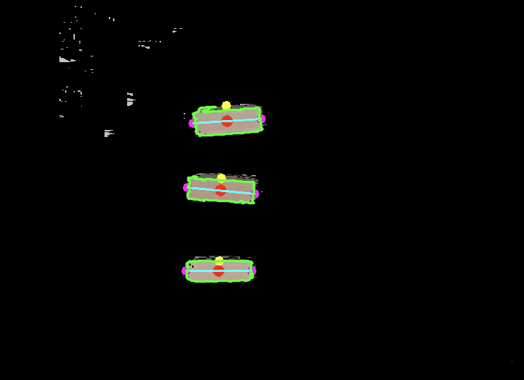
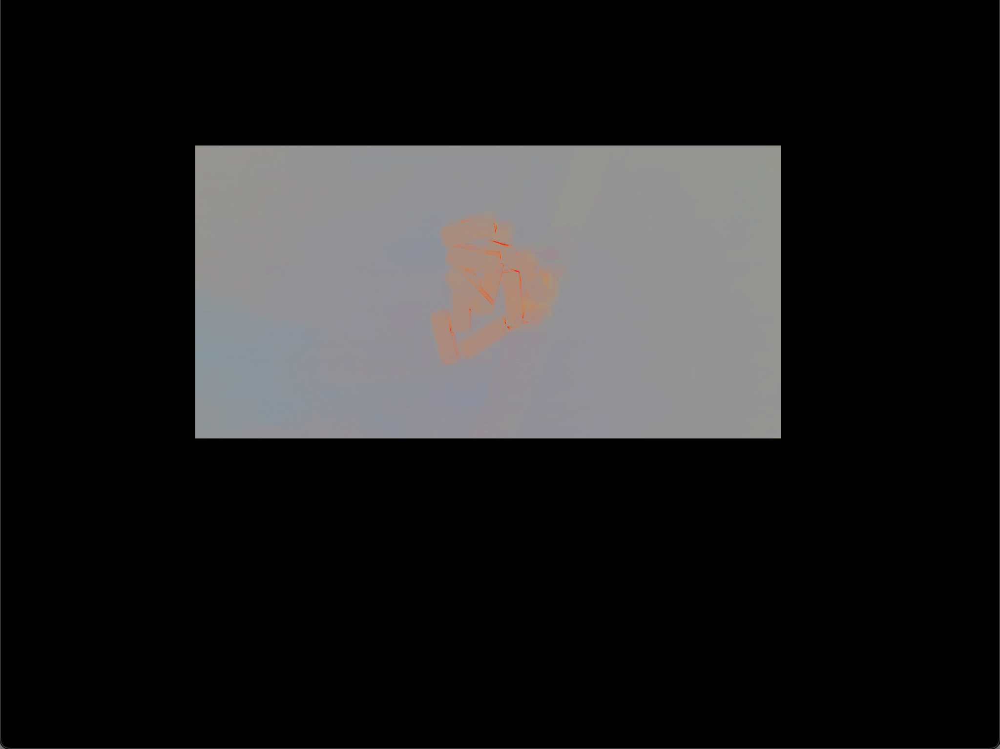
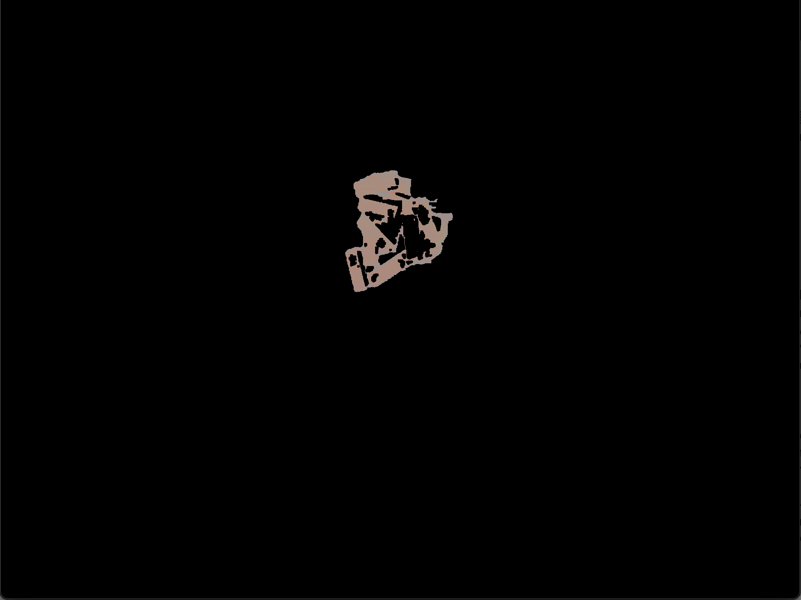

---
# Jekyll 'Front Matter' goes here. Most are set by default, and should NOT be
# overwritten except in special circumstances. 
# You should set the date the article was last updated like this:
date: 2023-12-13 # YYYY-MM-DD
# This will be displayed at the bottom of the article
# You should set the article's title:
title: Azure Block Detection 
# The 'title' is automatically displayed at the top of the page
# and used in other parts of the site.
---

This article presents an overview of object detection using the Azure camera without relying on learning-based methods. It is utilized within our Robot Autonomy project, specifically for detecting Jenga blocks and attempting to assemble them.

### Detection Pipeline
To identify individual blocks and their respective grasping points, the perception subsystem undergoes a series of five steps. Initially, it crops the Azure Kinect camera image to center on the workspace. Following this, it applies color thresholding to filter out irrelevant objects and discern the blocks. Subsequently, it identifies the contours of these blocks and filters them based on their area and shape characteristics. Once the blocks are recognized, the perception subsystem computes the grasping points for each block. Collectively, these steps facilitate the accurate detection of block locations and their corresponding grasping points on the workstation.

### Image Cropping
The initial stage of the perception subsystem involves cropping the raw image. Raw images often contain extraneous details, such as the workspace's supporting platform or the presence of individuals' feet near the robot. By cropping the image to focus solely on the workspace, we eliminate a significant amount of unnecessary information, thereby enhancing the system's efficiency and robustness.

Currently, this approach employs hard-coded cropping parameters, requiring manual specification of the rows and columns to retain within the image.

### Color Segmentation
Color segmentation can pose challenges in images with prominent shadows. Shadows cause a decrease in RGB pixel values, while light causes an increase, making it challenging to distinguish between different colors. To address this, we employ HSV (Hue, Saturation, Value) thresholding on the image.

For reliable detection of the brown color of the Jenga blocks under varying lighting conditions, we utilize the HSV color space, consisting of three channels: hue, saturation, and value. By thresholding these channels, we filter out the desired colors. However, using a fixed RGB threshold for detecting brown is challenging due to its variable RGB values under different lighting.

To tackle this issue, we employed color meter software to establish the brown color range for the Jenga blocks. This range, encompassing lower and upper brown values, was applied to our HSV thresholding function. The resulting HSV thresholded image is depicted in Figure 10b.

To further refine Jenga block detection and eliminate background noise, we apply a mask to the HSV thresholded image. Initially, we create a mask by contour area thresholding and then fill any holes within the contour to obtain a solid mask. The resulting masked image is shown in Figure 6a. This process ensures the reliable detection of Jenga blocks by removing remaining noise or unwanted objects.

### Block Contours

Contours play a pivotal role in computer vision's object detection. In our perception system, we utilize the mask derived from the HSV thresholded image to generate precise and consistent contours, enhancing accuracy.

We utilize OpenCV2's 'findContours' function to generate contours from the masked image. However, these contours encompass not only the Jenga blocks but also the robot manipulator. Since our focus is solely on detecting rectangular shapes corresponding to the Jenga blocks, we employ thresholding based on approximate block size and rectangular characteristics.

To simplify contours and reduce points, we apply OpenCV2's 'minAreaRect' function to the contours. This function generates contours with only four points representing the four corners of the blocks. Comparing the area of the original contour with the 'minAreaRect' contour allows us to confirm if the detected object is indeed a rectangle by setting a threshold ratio.

Subsequently, we identify the two grasp points of the block by detecting its longer sides. To determine these grasp points in the image frame, we align the depth image with the RGB image to acquire the depth value. Utilizing the x, y, and depth values, we transform the 2D pixel points back to the 3D pose in the camera frame using the intrinsic matrix. The grasp point concerning the base frame is then computed by performing a transform tree lookup, thereby completing the entire perception cycle.

### Image HSV Thresholding vs. Normalization

To mitigate the issue of filtering out irrelevant data, we explored two approaches: HSV thresholding and image normalization. In addition to the conventional representation of each pixel as an RGB value, pixels can also be depicted as 3D vectors in RGB space. While lighting influences the vector's magnitude, it doesn't alter its direction. Normalizing each vector nullifies the lighting effect, preserving only its direction and effectively converting RGB vectors into unit vectors.

For identifying jenga block pixels, we calculated the cosine similarity between each pixel's RGB vector and the background color. Pixels with excessive similarity to the background were masked out.

Although image normalization showed promise, it proved less effective in cluttered scenarios compared to the HSV method. The HSV method, involving thresholding in the HSV color space, exhibited greater reliability in detecting jenga blocks across varying lighting conditions.

Normalized Image             |  HSV Image
:-------------------------:|:-------------------------:
  |  

