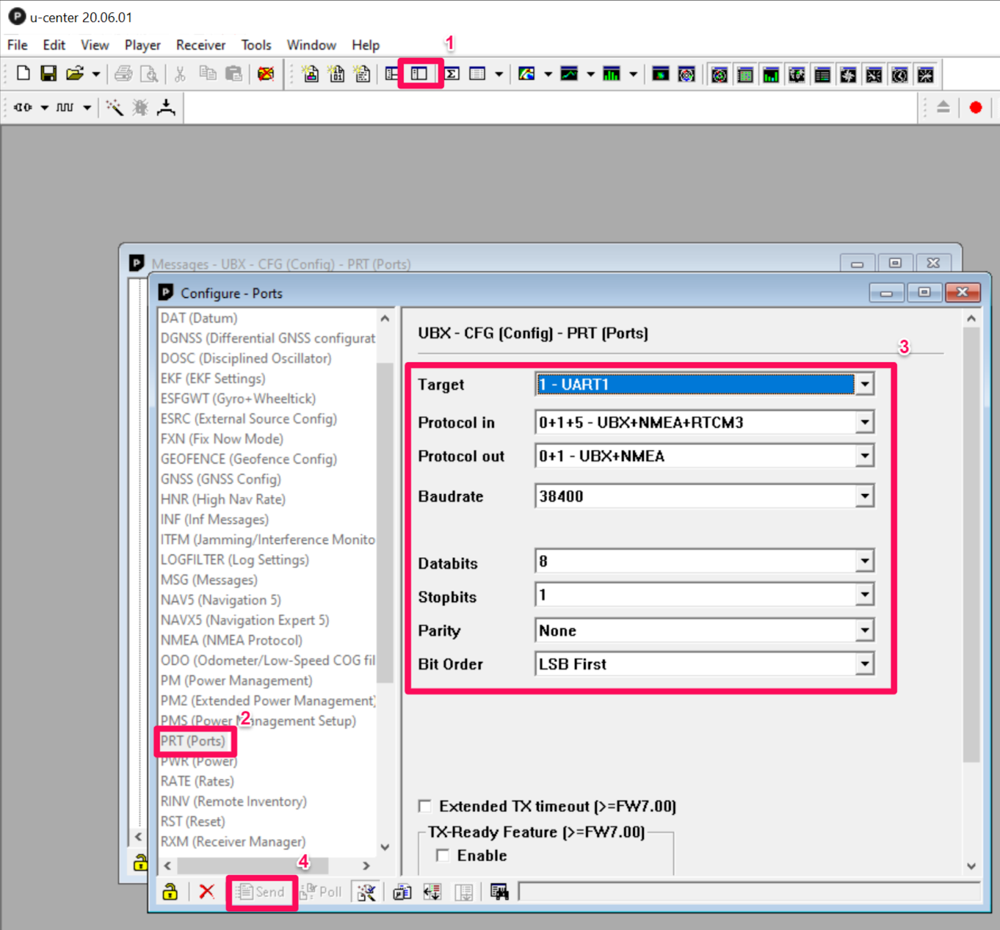
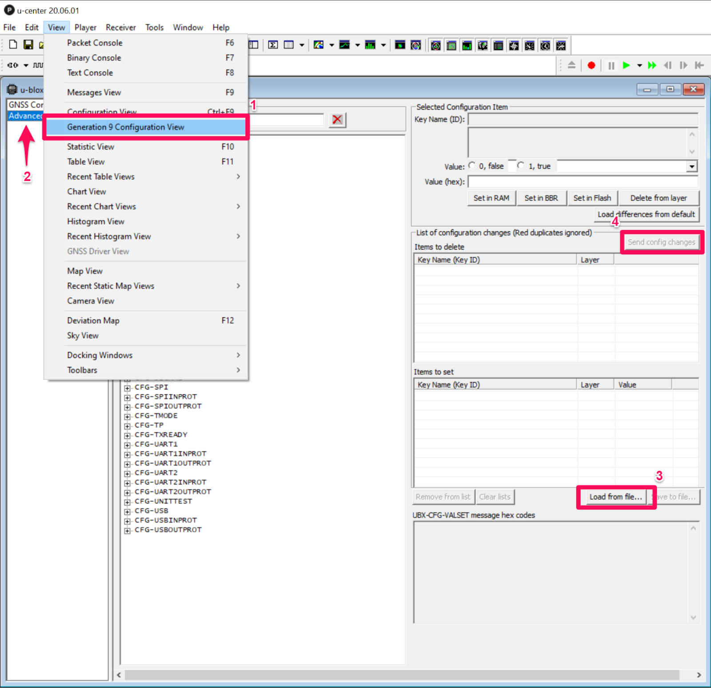

---
# Jekyll 'Front Matter' goes here. Most are set by default, and should NOT be
# overwritten except in special circumstances.
# You should set the date the article was last updated like this:
date: 2020-12-06 # YYYY-MM-DD
# This will be displayed at the bottom of the article
# You should set the article's title:
title: Using an RTK GPS
# The 'title' is automatically displayed at the top of the page
# and used in other parts of the site.
---

## Introduction
Position information can be critical for achieving high accuracy localization and one way to get this information is through the use of a GPS. It is possible to put a GPS only on the robot, but to get the centimeter level accuracy provided by RTK GPS systems a base station is required to send corrections to the GPS on the robot. What follows is a series of notes and lessons learned from working with a GPS system.

#### Notes and Lessons Learned:
- GPS Board
  - https://www.sparkfun.com/products/15136
  - Robot and base station boards should match
- GPS Antenna
  - https://www.sparkfun.com/products/15192
  - One of these for each the robot and the base station
  - There are other similar ones available that are cheaper if budget is a concern
  - Both antenna should have unobstructed open sky above them and ideally have buildings well off to the side of them
  - Antennas should be on large flat metal surfaces away from the ground such as a car roof
    - Aluminum foil might provide enough shielding on your robot with around a square foot of area below the antenna
    - The metal shields the antennas from signals bouncing up off the ground
- Software
  - U-center software - https://www.u-blox.com/en/product/u-center
- Will need to figure out how to connect the base station and robot GPS over radio
  - Whip antenna for the radio
  - Should be parallel ideally
- GPS signal strength
  - You should be able to get 3D/DGNSS/FIXED with a few bars in the 30s and 40s dB range at the same time
  - FIXED has a 2 cm uncertainty
- Connect to the GPS by
  - Plugging the USB into your computer
  - Receiver > Connection > COMX (on Windows for example)

## Key Issues and how to solve them
- Setting the frame rate for the GPS
  - Only should need to change the Measurement Period

  

- Making the settings permanent on the GPS

- Poor connection between the base station and robot GPS

- Make sure that all the values match between the base station and robot GPS except for the target - robot should be UART2 and the base station UART1

- Loading a configuration file (You may not need to do this)

