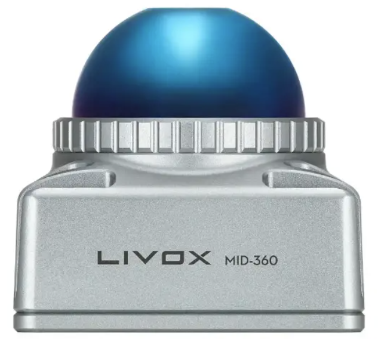
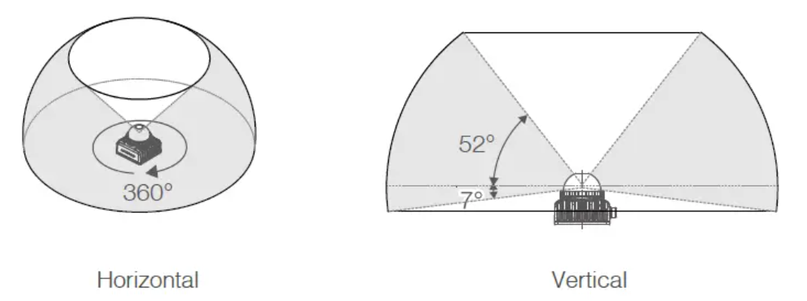
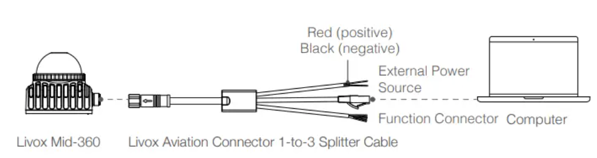

This article provides a comprehensive guide to the LIVOX Mid-360 LiDAR sensor, a popular choice in both academia and industry for robotic applications. This tutorial covers hardware connections, driver setup procedures, and step-by-step integration into the ROS 2 ecosystem. Advanced topics include Fast-LIO2 SLAM integration that leverages LiDAR-IMU data for robust odometry and mapping, point cloud processing pipelines. Following this guide, readers will be able to set up and integrate the LIVOX Mid-360 LiDAR into their robotic projects with ROS 2 Humble.



## Table of Contents

This guide is organized into logical sections that build upon each other. Follow the sections sequentially for a complete setup, or jump directly to any section based on your needs:

**Quick Start Path**: [2. Hardware Connections](#2-hardware-connections) → [3. Driver Setup](#3-driver-setup) → [4. ROS 2 Integration](#4-ros-2-integration)

**Complete Integration Path**: Quick Start Path → [5.1 Fast-LIO2 SLAM Integration](#51-fast-lio2-slam-integration) → [5.2 Ego-Planner Path Planning Integration](#52-ego-planner-path-planning-integration) → [6. Complete System Workflow](#6-complete-system-workflow)

---

1. [Sensor Overview](#1-sensor-overview)
2. [Hardware Connections](#2-hardware-connections)
3. [Driver Setup](#3-driver-setup)
4. [ROS 2 Integration](#4-ros-2-integration)
5. [Advanced Topics](#5-advanced-topics)
   - 5.1 [Fast-LIO2 SLAM Integration](#51-fast-lio2-slam-integration)
   - 5.2 [Ego-Planner Path Planning Integration](#52-ego-planner-path-planning-integration)
6. [Complete System Workflow](#6-complete-system-workflow)
7. [Troubleshooting](#7-troubleshooting)
8. [Platform-Specific Notes](#8-platform-specific-notes)
9. [Application Scenarios](#9-application-scenarios)
10. [Summary](#10-summary)
11. [See Also](#see-also)
12. [Further Reading](#further-reading)
13. [References](#references)

---

## 1. Sensor Overview

The LIVOX Mid-360 is a compact, lightweight solid-state LiDAR sensor designed for low-speed robotics applications. Powered by Livox's unique rotating mirror hybrid-solid technology, the Mid-360 is the first Livox LiDAR to achieve a full 360° horizontal field of view, providing omnidirectional 3D perception capabilities. The sensor is optimized for mobile robot navigation, obstacle avoidance, and SLAM applications, delivering enhanced indoor and outdoor perception performance.

### Key Specifications

#### Physical Characteristics

| Parameter | Specification |
|----------|---------------|
| **Dimensions** | 65 × 65 × 60 mm (L × W × H) |
| **Weight** | 265 g |
| **Interface** | Ethernet (1000BASE-T) |
| **Power consumption** | 6.5W |
| **Power supply** | 9-27V DC |
| **Operating temperature** | -20°C to 55°C |
| **Protection rating** | IP67 |

#### Performance Specifications

| Parameter | Specification |
|----------|---------------|
| **Field of view (horizontal)** | 360° |
| **Field of view (vertical)** | 59° |
| **Minimum detection range** | 0.1 m (10 cm) |
| **Maximum detection range** | 40 m @ 10% reflectivity<br>70 m @ 80% reflectivity |
| **Point cloud output** | 200,000 points/second |
| **Frame rate** | 10 Hz (typical) |
| **Point cloud density** | 40-line |
| **Laser wavelength** | 905 nm |
| **Eye safety** | Class 1 (IEC60825-1:2014) |

> **Note**: Reflectivity reference values: concrete floor 15-30%, white wall 90-99%

#### Accuracy Specifications

| Parameter | Value |
|----------|-------|
| **Random range error (1σ)** | ≤ 2 cm @ 10 m<br>≤ 3 cm @ 0.2 m |
| **Angular random error (1σ)** | < 0.15° |
| **False alarm rate** | < 0.01% @ 100 klx |

#### Additional Features

| Feature | Description |
|---------|-------------|
| **Built-in IMU** | ICM40609, 200 Hz sampling rate |
| **Default IP address** | `192.168.1.1XX` (XX = last 2 digits of serial number) |
| **Active anti-interference** | Multi-LiDAR operation support |
| **Scanning pattern** | Non-repetitive (resolution improves over time) |
| **Time synchronization** | GPS PPS and PTPv2 support |

The Mid-360 features active anti-interference capabilities, allowing reliable operation even with multiple LiDAR signals in the same environment. The sensor performs consistently in both bright and low-light conditions, making it suitable for indoor and outdoor applications. Its compact size and short minimum detection range (10 cm) enable flexible mounting options and help eliminate blind spots in robot designs. The non-repetitive scanning pattern ensures that over time, the angular resolution improves significantly, with more points accumulating in previously sparse areas, which is particularly beneficial for SLAM applications.

   

### Scanning Pattern and Point Cloud Characteristics

Unlike traditional mechanical LiDARs that use repetitive scanning patterns, the Mid-360 employs Livox's proprietary non-repetitive scanning technology. This pattern ensures that over time, the angular resolution improves significantly, with more points accumulating in previously sparse areas. This characteristic is particularly beneficial for SLAM applications, as it provides increasingly detailed maps as the robot moves through the environment.

The vertical field of view distribution is not uniform across the range. The effective detection range varies within the vertical FOV: areas closer to the top have shorter effective ranges, while areas closer to the bottom have longer ranges. This design optimizes the sensor for ground-based mobile robots, where most obstacles and navigation features are located at lower elevations.

Understanding these technical characteristics is essential for proper sensor integration. The combination of wide field of view, high point cloud density, and robust environmental performance makes the Mid-360 particularly well-suited for applications requiring comprehensive spatial awareness. However, to fully leverage these capabilities, proper hardware setup and configuration are critical. The following sections will guide you through the physical installation, network configuration, and software integration necessary to bring the sensor online in your robotic system.


> **Source**: Specifications and technical details are based on the [official LIVOX Mid-360 product page](https://www.livoxtech.com/mid-360).

## 2. Hardware Connections

Before diving into software configuration, establishing proper physical connections is the foundation of a successful integration. The Mid-360's design emphasizes ease of installation while maintaining reliability in various operating conditions. This section covers the essential hardware connections required to power the sensor and establish communication with your computing platform.

### Physical Setup



The LIVOX Mid-360 requires the following connections:

#### 1. Power Supply

Connect the power adapter to the sensor using the provided splitter cable.

**Requirements:**
- **Voltage**: 9-27V DC
- **Power consumption**: 6.5W
- **Current**: 0.5-0.7A @ 12V (typical)
- **Connector**: M12 aviation connector
- **Polarity**: Center pin positive (+), outer shell ground (-)

> **Warning**: Ensure correct polarity to avoid damaging the sensor. The Livox splitter cable separates power, Ethernet, and function connections.

#### 2. Ethernet Connection

Connect the sensor directly to your computer or Jetson Orin using an Ethernet cable.

**Cable Requirements:**
- **Type**: Cat5e or better
- **Shielding**: Recommended for noise reduction
- **Length**: Maximum 100 meters
- **Interface**: 1000BASE-T (actual data transmission: 100BASE-TX)

**For Mobile Robots:**
- Use flexible, shielded cables
- Ensure cables can withstand repeated bending
- Consider strain relief at connection points

#### 3. Function Connector (Optional)

The M12 function connector enables time synchronization for multi-sensor setups.

**Pin Configuration:**

| Pin | Color | Signal | Function |
|-----|-------|--------|----------|
| 8 | Gray/White | LVTTL_IN | GPS input |
| 9 | Gray | LVTTL_OUT | Reserved output |
| 10 | Purple/White | LVTTL_IN | Pulse Per Second (PPS) |
| 11 | Purple | LVTTL_OUT | Reserved output |
| - | Black | Ground | Common ground |

**GPS Synchronization Settings:**
- **Baud rate**: 9600
- **Data bits**: 8
- **Parity**: None
- **Stop bits**: 1
- **PPS signal**: 3.3V TTL, 1 Hz frequency

#### 4. Mounting

**Mounting Requirements:**
- **Thread size**: M3 mounting holes
- **Surface**: Flat, rigid, metal preferred (for thermal management)
- **Clearance**: Minimum 5 cm around sensor for heat dissipation
- **Location**: Avoid heat sources and restricted airflow areas

> **Pro Tip**: [Tare Robotics](https://www.tarerobotics.com/) mounts the Mid-360 at a **20-degree tilt angle** on their T-Bot platform. This configuration:
> - Balances horizontal FOV distribution
> - Improves ground-level obstacle detection
> - Optimizes coverage for mobile robot applications

Once the physical connections are established and the sensor is properly mounted, the next critical step is configuring the network interface. Unlike USB-connected sensors, the Mid-360 relies entirely on Ethernet communication, making network configuration a prerequisite for any data acquisition. Proper network setup ensures reliable, low-latency data transmission between the sensor and your computing platform, which is essential for real-time robotic applications.

### Network Configuration

The LIVOX Mid-360 supports two IP modes: dynamic IP address mode and static IP address mode. All Mid-360 sensors are set to static IP address mode by default.

#### LiDAR IP Address Configuration

**Default Settings:**

| Parameter | Value |
|-----------|-------|
| **IP address format** | `192.168.1.1XX` |
| **XX** | Last two digits of sensor serial number |
| **Subnet mask** | `255.255.255.0` |
| **Default gateway** | `192.168.1.1` |

**Example:**
- Serial number ending in `54` → IP address: `192.168.1.154`
- Serial number ending in `23` → IP address: `192.168.1.123`

> **Important**: When multiple Mid-360 sensors are connected to one computer, **each sensor must have a different static IP address**.

#### Computer IP Address Configuration

**Recommended Settings:**

| Parameter | Value |
|-----------|-------|
| **IP address** | `192.168.1.50` (Livox recommended) |
| **Subnet mask** | `255.255.255.0` |
| **Subnet** | `192.168.1.x` |

**Multi-Computer Setup:**
If multiple computers connect to the same Mid-360, assign different IP addresses:
- Computer 1: `192.168.1.50`
- Computer 2: `192.168.1.51`
- Computer 3: `192.168.1.52`
- etc.

#### Temporary Network Configuration (Current Session Only)

For quick testing, you can temporarily add an IP address to your network interface:

```bash
# Replace 'eth0' with your actual network interface name
# Use 192.168.1.50 as recommended by Livox
sudo ip addr add 192.168.1.50/24 dev eth0

# Verify connectivity (replace XX with your sensor's serial number digits)
ping -c 3 192.168.1.1XX
```

#### Permanent Network Configuration (Ubuntu 22.04 with Netplan)

For a permanent configuration that survives reboots, create or edit `/etc/netplan/99-uplink.yaml`:

```yaml
network:
  version: 2
  renderer: networkd
  ethernets:
    eth0:  # Replace with your interface name (e.g., enP8p1s0, enp0s3)
      dhcp4: no
      addresses: 
        - 192.168.1.50/24  # Livox recommended IP address
```

Apply the configuration:

```bash
sudo chmod 600 /etc/netplan/99-uplink.yaml
sudo netplan apply
```

#### Verifying Network Connectivity

After configuration, verify the connection:

```bash
# Check IP assignment
ip addr show eth0 | grep 192.168.1.50

# Test LiDAR connectivity (replace XX with your sensor's serial number digits)
ping -c 3 192.168.1.1XX
```

With network connectivity established, you can proceed to software installation. However, before moving forward, it's worth understanding advanced network configurations that may be necessary for complex setups. Many robotic systems require simultaneous internet connectivity for software updates, remote monitoring, or cloud services, while maintaining direct communication with the LiDAR sensor. The following section addresses these scenarios, then we'll move on to driver installation.

## 3. Driver Setup

### Prerequisites

Before installing the LIVOX driver, ensure you have the following dependencies:

**System Requirements:**

| Component | Requirement |
|-----------|-------------|
| **Operating System** | Ubuntu 22.04 (recommended) or Ubuntu 20.04 |
| **ROS Version** | ROS 2 Humble Hawksbill |
| **CMake** | Version 3.10 or later |
| **Git** | Latest version |
| **Build tools** | `build-essential` package |

**Required ROS Packages:**
- `ros-humble-pcl-ros`
- `ros-humble-pcl-conversions`

**Install System Dependencies:**

```bash
sudo apt update
sudo apt install -y git cmake build-essential \
    libpcl-dev libeigen3-dev libopencv-dev \
    ros-humble-pcl-ros ros-humble-pcl-conversions
```

For ARM64 platforms (e.g., NVIDIA Jetson), fix Python setuptools version:

```bash
pip3 install --user 'setuptools<70'
```

### Installing LIVOX SDK2

> **Critical**: The LIVOX Mid-360 requires **Livox SDK2** (not SDK1). SDK1 will **not work** with Mid-360.

**SDK2 Architecture Components:**

| Component | Function |
|----------|----------|
| **Device discovery** | Automatic detection of connected Livox sensors on the network |
| **Data streaming** | Efficient point cloud and IMU data transmission |
| **Device control** | Parameter configuration and status monitoring |
| **Time synchronization** | Support for GPS and PTPv2 time sync protocols |

1. Clone the LIVOX SDK2 repository:

```bash
cd ~
git clone https://github.com/Livox-SDK/Livox-SDK2.git
cd Livox-SDK2
```

2. Build and install the SDK:

```bash
mkdir -p build && cd build
cmake ..
make -j$(nproc)
sudo make install
sudo ldconfig
```

3. Verify installation:

```bash
ls /usr/local/lib | grep livox
```

You should see Livox SDK libraries listed.

4. (Optional) Test SDK connection:

```bash
cd samples/livox_lidar_quick_start/
./livox_lidar_quick_start ../../../samples/livox_lidar_quick_start/mid360_config.json
```

If successful, you should see IMU and LiDAR streaming messages. The sample program will display connection status, device information, and real-time point cloud statistics including point count and frame rate.

For advanced users, the SDK2 provides C++ APIs for custom applications. Key API functions include:
- `LivoxSdkInit()`: Initialize the SDK
- `LivoxSdkStart()`: Start device discovery and data streaming
- `SetDataCallback()`: Register callback functions for point cloud and IMU data
- `LivoxSdkUninit()`: Clean up resources

Refer to the SDK2 documentation and sample code in the `samples/` directory for implementation examples.

While the SDK2 provides direct access to sensor data, most robotic applications benefit from integration with the Robot Operating System (ROS). The ROS 2 driver serves as a bridge between the Livox SDK2 and the ROS ecosystem, converting raw sensor data into standard ROS message formats that can be easily consumed by navigation, SLAM, and perception algorithms. This abstraction layer simplifies development and enables seamless integration with the broader ROS software ecosystem.

### Installing ROS 2 Driver (livox_ros_driver2)

The ROS 2 driver bridges the Livox SDK2 to ROS 2 topics.

1. Create a ROS 2 workspace (if you don't have one):

```bash
mkdir -p ~/ros2_ws/src
cd ~/ros2_ws/src
```

2. Clone the ROS 2 driver:

```bash
git clone https://github.com/Livox-SDK/livox_ros_driver2.git
cd livox_ros_driver2
```

3. Link the ROS 2 package.xml:

```bash
ln -s package_ROS2.xml package.xml
```

4. Install dependencies and build:

```bash
cd ~/ros2_ws
source /opt/ros/humble/setup.bash
rosdep install --from-paths src --ignore-src -r -y
colcon build
source install/setup.bash
```

Having installed both the SDK2 and the ROS 2 driver, you're now ready to launch the sensor and begin receiving data through ROS topics. The driver handles the complex task of converting Livox's proprietary data format into ROS messages, managing network communication, and publishing sensor data at appropriate rates. This section covers the practical aspects of launching the driver, verifying data streams, and configuring parameters to match your specific application requirements.

## 4. ROS 2 Integration

### Launching the Driver

Launch the LIVOX Mid-360 driver:

```bash
cd ~/ros2_ws
source install/setup.bash
ros2 launch livox_ros_driver2 msg_MID360_launch.py
```

### Published Topics

**ROS 2 Topics:**

| Topic Name | Message Type | Description | Rate |
|------------|--------------|-------------|------|
| `/livox/lidar` | `livox_ros_driver2/CustomMsg` | Point cloud data with timestamps, coordinates (x, y, z), and intensity | 10 Hz (configurable) |
| `/livox/imu` | `sensor_msgs/Imu` | IMU data: linear acceleration, angular velocity, covariance matrices | 200 Hz (hardware dependent) |

**Topic Details:**

- **`/livox/lidar`**: 
  - Custom message format optimized for Livox's non-repetitive scanning pattern
  - Includes frame information for proper point cloud reconstruction
  - Contains raw point cloud data with timestamps and intensity values

- **`/livox/imu`**: 
  - High-frequency inertial measurements (200 Hz)
  - Essential for motion estimation and sensor fusion algorithms
  - Includes covariance matrices for uncertainty estimation

**TF Transforms:**

| Transform | Description |
|-----------|-------------|
| `base_link` → `livox_frame` | Transform from robot base to LiDAR sensor frame<br>Includes mounting position and orientation |

### Verifying Data Stream

Check that topics are being published:

```bash
# List all topics
ros2 topic list

# Check topic frequency
ros2 topic hz /livox/lidar
ros2 topic hz /livox/imu

# View point cloud data (once)
ros2 topic echo /livox/lidar --once
```

### Configuration

**Configuration File Location:**
```
ros_ws/src/livox_ros_driver2/config/MID360_config.json
```

**Key Parameters:**

| Parameter | Description | Default Value |
|-----------|-------------|---------------|
| `lidar_bag_ip` | LiDAR IP address | `192.168.1.1XX` (XX = last 2 digits of serial) |
| `host_bag_ip` | Host computer IP address | `192.168.1.50` (Livox recommended) |
| `imu_bag` | Enable/disable IMU data publishing | `true` |
| `frame_id` | TF frame name for the LiDAR | `livox_frame` |

The basic ROS 2 integration provides point cloud and IMU data streams, which are sufficient for many applications. However, for advanced robotic systems requiring simultaneous localization and mapping (SLAM), obstacle avoidance, or path planning, additional processing is necessary. The following section introduces Fast-LIO2, a state-of-the-art SLAM algorithm specifically designed to work with Livox sensors, demonstrating how to transform raw sensor data into actionable navigation information.

## 5. Advanced Topics

### 5.1 Fast-LIO2 SLAM Integration

Fast-LIO2 is a computationally efficient and robust LiDAR-inertial odometry framework that works well with LIVOX sensors. It provides real-time odometry and mapping capabilities. The algorithm uses an iterated Kalman filter to tightly couple LiDAR and IMU measurements, achieving high accuracy with low computational cost.

**Key Advantages of Fast-LIO2 for Mid-360:**

| Advantage | Description |
|-----------|-------------|
| **Non-repetitive scan handling** | Designed to work with Livox's unique scanning patterns |
| **Real-time performance** | Typically runs at 10-20 Hz on modern hardware |
| **Robust to motion** | Handles aggressive motions and vibrations well |
| **Memory efficient** | Incremental map building without storing full point clouds |
| **Open source** | Actively maintained with ROS 2 support |

The algorithm processes incoming point clouds incrementally, extracting features and matching them with the current map estimate. IMU data provides motion prediction between LiDAR scans, improving accuracy during fast movements.

#### Installing Dependencies

1. Install third-party libraries:

```bash
sudo apt-get install libpcl-dev libeigen3-dev libopencv-dev

# Install Sophus library
git clone https://github.com/strasdat/Sophus.git
cd Sophus
git checkout a621ff
mkdir build && cd build
cmake ..
make -j$(nproc)
sudo make install
```

#### Building Fast-LIO2

Fast-LIO2 can be built in a ROS 2 workspace. There are ROS 2 ports available:

```bash
cd ~/ros2_ws/src
git clone https://github.com/hku-mars/FAST_LIO_ROS2.git
cd ~/ros2_ws
colcon build
source install/setup.bash
```

#### Running Fast-LIO2

In a separate terminal:

```bash
cd ~/ros2_ws
source install/setup.bash
ros2 run fast_lio fastlio_mapping --ros-args \
    --params-file src/FAST_LIO_ROS2/config/avia.yaml
```

**Published Topics:**

| Topic | Message Type | Description | Rate |
|-------|--------------|-------------|------|
| `/Odometry` | `nav_msgs/Odometry` | Odometry data (pose, twist, covariance) | ~10 Hz |
| `/path` | `nav_msgs/Path` | Trajectory path visualization | ~10 Hz |
| `/cloud_registered` | `sensor_msgs/PointCloud2` | Registered point cloud map | ~10 Hz |
| `/tf` | `tf2_msgs/TFMessage` | Transform tree | Dynamic |

#### Configuration

**Configuration File:** `src/FAST_LIO_ROS2/config/avia.yaml`

**Key Parameters:**

| Parameter | Value | Description |
|-----------|-------|-------------|
| `lidar_type` | `1` | Livox series LiDAR |
| `scan_line` | `6` | For Mid-360 (40-line density) |
| `point_filter_num` | `1` | Point cloud downsampling factor |
| `filter_size_surf` | `0.2-0.3` (indoor)<br>`0.5-1.0` (outdoor) | Surface feature filter size (meters) |
| `filter_size_map` | `0.2-0.3` (indoor)<br>`0.5-1.0` (outdoor) | Map filter size (meters) |
| `lidar_topic` | `/livox/lidar` | Input LiDAR topic |
| `imu_topic` | `/livox/imu` | Input IMU topic |

For Mid-360, the default `avia.yaml` configuration works well for most applications. Adjust `filter_size_surf` and `filter_size_map` based on your environment: smaller values (0.2-0.3 m) for indoor environments, larger values (0.5-1.0 m) for outdoor environments.

While Fast-LIO2 provides excellent odometry and mapping capabilities, many robotic applications require not just localization but also path planning and obstacle avoidance. The point cloud maps generated by Fast-LIO2 serve as the foundation for navigation algorithms, but transforming these maps into executable trajectories requires additional planning components. Ego-Planner represents a state-of-the-art solution for this challenge, offering efficient gradient-based path planning that works directly with point cloud data without requiring expensive distance field computations.

### 5.2 Ego-Planner Path Planning Integration

Ego-Planner is an ESDF-free gradient-based local planner designed for efficient and safe trajectory generation. Unlike traditional planning methods that require building Euclidean Signed Distance Fields (ESDF) for gradient optimization, Ego-Planner performs optimization directly on point cloud data, significantly reducing computational overhead while maintaining safety guarantees. This makes it particularly well-suited for real-time applications where computational resources are limited, such as mobile robots and drones.

The algorithm's key innovation lies in its ability to construct effective collision penalty terms by comparing collision-prone trajectories with collision-free reference paths, all without explicitly building distance fields. This approach, combined with an anisotropic curve fitting algorithm, produces smooth, feasible trajectories that respect both dynamic constraints and obstacle boundaries.

#### Why Ego-Planner with Mid-360?

The combination of LIVOX Mid-360 and Ego-Planner offers several advantages for robotic navigation systems. The Mid-360's dense point cloud output provides rich environmental information that Ego-Planner can leverage for accurate obstacle representation. The sensor's 360° horizontal field of view ensures comprehensive coverage, eliminating blind spots that could lead to planning failures. Additionally, the non-repetitive scanning pattern gradually improves point cloud density over time, which enhances the quality of collision checking as the robot operates in an environment.

For mobile robot applications, this integration enables real-time reactive planning in dynamic environments. The planner can quickly adapt to newly detected obstacles, recalculating trajectories within milliseconds to ensure safe navigation. This capability is particularly valuable in environments with moving obstacles, such as warehouses with other robots or public spaces with pedestrians.

#### Installing Ego-Planner

Ego-Planner is available as an open-source ROS 2 package. To integrate it with your Mid-360 and Fast-LIO2 setup:

1. Clone the Ego-Planner repository:

```bash
cd ~/ros2_ws/src
git clone https://github.com/ZJU-FAST-Lab/ego-planner.git
```

2. Install dependencies:

```bash
cd ~/ros2_ws
rosdep install --from-paths src --ignore-src -r -y
```

3. Build the workspace:

```bash
colcon build --packages-select ego_planner
source install/setup.bash
```

#### Configuring Ego-Planner for Mid-360

Ego-Planner requires configuration to work with the point cloud data from Fast-LIO2.

**Configuration File:** `src/ego_planner/config/planning.yaml`

**Key Configuration Parameters:**

| Category | Parameter | Typical Value | Description |
|----------|-----------|---------------|-------------|
| **Point Cloud Input** | `map_topic` | `/cloud_registered` | Fast-LIO2's registered point cloud output |
| | `point_cloud_inflation` | 0.2-0.5 m | Inflation radius for obstacle expansion |
| **Planning** | `planning_horizon` | 5-10 m | Maximum planning distance |
| | `max_vel` | 1.0-2.0 m/s | Maximum velocity constraints |
| | `max_acc` | 1.0-2.0 m/s² | Maximum acceleration constraints |
| | `resolution` | 0.1-0.2 m | Grid resolution for point cloud processing |
| **Optimization** | `optimization_iterations` | 5-10 | Number of optimization iterations |
| | `smoothing_weight` | 0.5-1.0 | Weight for trajectory smoothness |

> **Tip**: Adjust `point_cloud_inflation` based on your robot's size. Larger robots require larger inflation radii for safe navigation.

#### Running Ego-Planner

Launch Ego-Planner in a separate terminal:

```bash
cd ~/ros2_ws
source install/setup.bash
ros2 launch ego_planner ego_planner.launch.py
```

**Published Topics:**

| Topic | Message Type | Description |
|-------|--------------|-------------|
| `/planning/trajectory` | `trajectory_msgs/JointTrajectory` | Generated trajectory waypoints |
| `/planning/vis_trajectory` | `visualization_msgs/Marker` | Visualization markers for RViz |
| `/planning/vis_check_trajectory` | `visualization_msgs/Marker` | Collision checking visualization |

**Subscribed Topics:**

| Topic | Message Type | Description |
|-------|--------------|-------------|
| `/cloud_registered` | `sensor_msgs/PointCloud2` | Point cloud map from Fast-LIO2 |
- `/Odometry`: Current robot pose from Fast-LIO2
- `/goal`: Goal position (geometry_msgs/PoseStamped)

#### Integration Workflow

The complete integration involves three main components working together:

1. **Fast-LIO2** processes Mid-360 point clouds and IMU data to generate odometry and a registered point cloud map
2. **Ego-Planner** uses the point cloud map and current odometry to generate collision-free trajectories toward the goal
3. **Robot Controller** executes the planned trajectory, sending velocity commands to the robot's actuators

This pipeline enables autonomous navigation in previously unknown environments, with the robot simultaneously mapping its surroundings, localizing itself within the map, and planning safe paths to designated goals. The real-time nature of all three components ensures responsive behavior, allowing the robot to adapt quickly to environmental changes.

#### Performance Considerations

Ego-Planner's efficiency makes it suitable for resource-constrained platforms, but optimal performance requires careful parameter tuning. For indoor environments with dense obstacles, use smaller inflation radii and higher resolution grids. For outdoor environments with sparse obstacles, larger inflation radii and lower resolution can reduce computational load while maintaining safety. The planning horizon should be set based on your robot's maximum speed and the sensor's effective range—too short a horizon may cause frequent replanning, while too long a horizon may include outdated obstacle information.

Monitoring computational performance is important, especially on embedded platforms. Use tools like `htop` or `ros2 topic hz` to verify that planning cycles complete within acceptable time limits (typically 50-100 ms for real-time operation). If planning becomes too slow, consider reducing the optimization iterations or grid resolution, though this may impact trajectory quality.

Now that we've covered the individual components—hardware setup, network configuration, driver installation, SLAM integration, and path planning—it's time to bring everything together into a complete working system. A typical robotic application requires coordinating multiple processes running simultaneously, each handling different aspects of sensor data processing, localization, mapping, and robot control. The following workflow demonstrates how these components interact in a real-world deployment scenario, providing a practical template for your own implementations.

## 6. Complete System Workflow

A typical setup involves running multiple components:

### Terminal 1: Livox Driver
```bash
cd ~/ros2_ws
source install/setup.bash
ros2 launch livox_ros_driver2 msg_MID360_launch.py
```

### Terminal 2: Fast-LIO2 SLAM
```bash
cd ~/ros2_ws
source install/setup.bash
ros2 run fast_lio fastlio_mapping --ros-args \
    --params-file src/FAST_LIO_ROS2/config/avia.yaml
```

### Terminal 3: Visualization (Optional)
```bash
ros2 run rviz2 rviz2
```

Add displays for:
- `/livox/lidar` (PointCloud2)
- `/cloud_registered` (PointCloud2)
- `/path` (Path)
- TF tree

Even with careful setup and configuration, real-world deployments often encounter unexpected issues. These can range from network connectivity problems to software compatibility issues, or environmental factors affecting sensor performance. The troubleshooting section that follows addresses the most common problems encountered during Mid-360 integration, providing systematic approaches to diagnosis and resolution. Understanding these potential pitfalls and their solutions will save significant time during development and deployment.

## 7. Troubleshooting

### Common Issues

#### LiDAR Not Connecting

**Symptoms:**
- No data on `/livox/lidar` topic
- Driver shows connection errors
- `ping` to LiDAR IP fails

**Diagnosis Steps:**

| Step | Command | Expected Result |
|------|---------|-----------------|
| 1. Check network config | `ip addr show eth0 \| grep 192.168.1.50` | Should show IP address assigned |
| 2. Test connectivity | `ping -c 3 192.168.1.1XX` | Should receive replies |
| 3. Check driver process | `ps aux \| grep livox_ros_driver2_node` | Should show running process |
| 4. Verify hardware | Visual inspection | Power LED on, Ethernet connected |

**Solutions:**
```bash
# Check network configuration
ip addr show eth0 | grep 192.168.1.50
ping 192.168.1.1XX  # Replace XX with your sensor's serial number digits

# Check driver process
ps aux | grep livox_ros_driver2_node

# Verify LiDAR is powered and Ethernet cable is connected
```

#### No ROS Topics Published

**Symptoms:**
- Driver launches successfully
- No topics appear in `ros2 topic list`
- No data flow

**Diagnosis Steps:**

| Step | Command | Expected Result |
|------|---------|-----------------|
| 1. List topics | `ros2 topic list` | Should show `/livox/lidar` and `/livox/imu` |
| 2. Check nodes | `ros2 node list` | Should show `livox_ros_driver2_node` |
| 3. Check topic rate | `ros2 topic hz /livox/lidar` | Should show ~10 Hz |
| 4. Verify connectivity | `ping 192.168.1.1XX` | Should receive replies |

**Solutions:**
```bash
# List all topics
ros2 topic list

# Check if driver node is running
ros2 node list

# Check topic rate
ros2 topic hz /livox/lidar

# Verify network connectivity (replace XX with your sensor's serial number digits)
ping 192.168.1.1XX
```

#### Fast-LIO2 Errors

**Symptoms:**
- SLAM node fails to start
- Error messages in terminal
- No odometry output

**Common Error Types:**

| Error Type | Possible Cause | Solution |
|------------|----------------|----------|
| **Topic not found** | Driver not running | Start `livox_ros_driver2` first |
| **IMU data missing** | IMU not enabled | Check `imu_bag` in driver config |
| **TF errors** | Frame mismatch | Verify `frame_id` in config files |
| **Memory errors** | Insufficient resources | Reduce `filter_size` parameters |

**Solutions:**
```bash
# Verify driver is running first
ros2 topic list | grep livox

# Check IMU data
ros2 topic echo /livox/imu --once

# Verify configuration file exists
ls src/FAST_LIO_ROS2/config/avia.yaml
```

#### Architecture Mismatch (ARM64/Jetson)

**Symptoms:**
- "Exec format error" when running binaries
- Binary compatibility issues

**Solutions:**

| Platform | Action | Command |
|----------|--------|---------|
| **ARM64/Jetson** | Build from source | `colcon build --cmake-args -DCMAKE_BUILD_TYPE=Release` |
| **Verify architecture** | Check binary format | `file ros2_ws/install/livox_ros_driver2/lib/livox_ros_driver2/livox_ros_driver2_node` |

**Expected Output:**
```
ELF 64-bit LSB ... ARM aarch64
```
```bash
file ros2_ws/install/livox_ros_driver2/lib/livox_ros_driver2/livox_ros_driver2_node
# Should show: "ELF 64-bit LSB ... ARM aarch64"
```

#### RViz Shows Black Screen

**Symptoms:**
- RViz launches successfully
- No point cloud or visualization displayed
- Empty display

**Diagnosis Steps:**

| Step | Command | Expected Result |
|------|---------|-----------------|
| 1. Check TF tree | `ros2 run tf2_tools view_frames` | Should generate `frames.pdf` |
| 2. Verify topics | `ros2 topic hz /livox/lidar` | Should show ~10 Hz |
| 3. Check frame IDs | `ros2 topic echo /livox/lidar --once` | Should show correct `frame_id` |
| 4. Verify RViz config | Check Fixed Frame setting | Should match `frame_id` |

**Solutions:**
- Verify TF tree exists: `ros2 run tf2_tools view_frames`
- Check that topics are publishing: `ros2 topic hz /livox/lidar`
- Ensure correct frame IDs in configuration
- Set RViz Fixed Frame to match LiDAR frame ID

### Performance Optimization

**Optimization Strategies:**

| Strategy | Method | Benefit |
|----------|--------|---------|
| **Reduce data rate** | Adjust point cloud publishing rate | Lower CPU usage |
| **Point cloud filtering** | Use PCL filters to reduce data volume | Faster processing |
| **Compressed topics** | Enable point cloud compression | Network efficiency |
| **Resource monitoring** | Monitor CPU/GPU usage (Jetson) | Identify bottlenecks |
| **Parameter tuning** | Adjust `filter_size` in Fast-LIO2 | Balance accuracy/speed |

## 8. Platform-Specific Notes

### NVIDIA Jetson (ARM64)

**Platform Details:**

| Aspect | Specification |
|--------|---------------|
| **Tested Platforms** | Jetson Orin Nano, Xavier NX |
| **Python Dependencies** | Use `setuptools<70` |
| **Build Method** | All packages must be built from source |
| **Performance** | Monitor thermal throttling during long operations |
| **Architecture** | ARM64 (aarch64) |

**Important Notes:**
- All packages must be built from source (no pre-compiled binaries)
- Monitor thermal throttling during long operations
- Use `setuptools<70` for Python dependencies: `pip3 install --user 'setuptools<70'`

### x86_64 Systems

**Platform Details:**

| Aspect | Specification |
|--------|---------------|
| **OS** | Standard Ubuntu 22.04 installation |
| **Build Method** | Standard build steps |
| **Performance** | Generally better than ARM platforms |
| **Architecture** | x86_64 (amd64) |

> **Note**: The platform-specific considerations highlight the importance of understanding your target hardware environment. Different platforms have different strengths and limitations, and optimizing your setup for the specific platform can significantly impact system performance.

## 9. Application Scenarios

The LIVOX Mid-360's compact design, wide field of view, and high point cloud density make it suitable for diverse applications across multiple industries. Here are some notable use cases:

### Mobile Robot Navigation and SLAM

**Application Categories:**

| Application | Use Case | Key Benefits |
|-------------|----------|--------------|
| **Autonomous Forklifts** | Warehouse automation, pallet handling | 360° FOV for narrow aisles, precise navigation |
| **Service Robots** | Retail, hospitality, healthcare | 10 cm min range, dense point clouds for human environments |
| **AMRs** | Manufacturing, logistics centers | Omnidirectional coverage, eliminates blind spots |

**Notable Implementations:**
- **JingSong Intelligent**: Integrated Mid-360 into forklift robots for precise pallet handling and outdoor navigation
- **Tare Robotics**: T-Bot platform uses Mid-360 at 20° tilt angle for optimized FOV coverage

### 3D Mapping and Surveying

**Handheld Scanning Systems:**

| Application | Description | Key Features |
|-------------|-------------|--------------|
| **Building Interior Mapping** | Architectural documentation, facility management | High-resolution point clouds |
| **Urban Planning** | Street-level scanning for smart cities | Detailed 3D models of urban environments |
| **Heritage Documentation** | Historical sites, cultural preservation | Precise 3D scanning for digital archiving |
| **Construction Site Monitoring** | Progress tracking, as-built verification | Regular scanning capabilities |

**Notable Implementation:**
- **Manifold Technology**: Utilizes Mid-360 in handheld scanning devices for various mapping applications

> **Advantage**: The Mid-360's compact size (265g) and low power consumption (6.5W) make it ideal for portable scanning systems operated by a single person, significantly reducing time and cost compared to traditional surveying methods.

### Infrastructure Inspection

**Application Areas:**

| Application | Use Case | Key Benefits |
|-------------|----------|--------------|
| **Railway Systems (TIDS)** | Train Intelligent Detection Systems | Obstacle detection, track condition assessment, tunnel clearance |
| **Tunnel Mapping** | Subway systems, utility tunnels | Low-light performance, detailed 3D point clouds |
| **Underground Mapping** | Mining operations, infrastructure | Reliable operation in challenging environments |

**Key Features:**
- Operates in various lighting conditions
- Detailed 3D point clouds for infrastructure assessment
- IP67 protection rating for harsh environments

### Drone and Aerial Applications

**Application Categories:**

| Application | Description | Key Benefits |
|-------------|-------------|--------------|
| **Autonomous Drones** | Indoor navigation, obstacle avoidance | Lightweight (265g), wide FOV, GPS-free SLAM |
| **Aerial Mapping** | Ground-level point cloud data | Complements traditional aerial LiDAR systems |

**Research Applications:**
- Indoor drone navigation (GPS unavailable)
- Robust SLAM capabilities for autonomous flight

### Research and Development

**Academic Research**: The Mid-360 is popular in robotics research due to its cost-effectiveness, open-source driver support, and compatibility with ROS 2. Research applications include:

- Multi-robot SLAM systems
- Dynamic obstacle tracking and prediction
- Terrain analysis and traversability assessment
- Sensor fusion with cameras and other sensors

**Prototype Development**: Startups and research institutions use Mid-360 for rapid prototyping of autonomous systems, benefiting from the sensor's ease of integration and comprehensive documentation.

### Key Advantages for Different Applications

- **Indoor Environments**: The 10 cm minimum detection range and high point cloud density make Mid-360 excellent for indoor navigation where close obstacles are common
- **Outdoor Environments**: The 70 m maximum range (at 80% reflectivity) and consistent performance in bright sunlight enable reliable outdoor operation
- **Multi-Sensor Setups**: Active anti-interference capabilities allow multiple Mid-360 sensors to operate simultaneously without signal interference
- **Cost-Effective Solutions**: Compared to traditional mechanical LiDARs, Mid-360 offers similar or better performance at a lower cost point

The diverse application scenarios discussed above illustrate the versatility of the Mid-360 sensor across different industries and use cases. From industrial automation to research and development, the sensor's capabilities enable innovative solutions to complex perception challenges. Understanding these applications provides context for the technical details covered in this guide and helps readers identify how the Mid-360 might fit into their own projects. As we conclude this comprehensive guide, let us summarize the key concepts and provide a foundation for further exploration.

## 10. Summary

The LIVOX Mid-360 LiDAR provides an excellent solution for robotic perception with its wide field of view and reliable performance. This guide covered hardware setup, network configuration, driver installation with Livox SDK2, ROS 2 Humble integration, and advanced topics including Fast-LIO2 SLAM integration. The sensor's compact design, high point cloud density, and robust performance make it ideal for mobile robot applications requiring real-time mapping and localization. With proper configuration and calibration, the Mid-360 can serve as a robust foundation for SLAM, navigation, and obstacle avoidance applications in ROS 2 environments. The non-repetitive scanning pattern and active anti-interference capabilities further enhance its suitability for complex, multi-robot environments. From autonomous forklifts to handheld scanning systems, the Mid-360 demonstrates versatility across diverse application domains, making it a valuable tool for both commercial deployments and research projects.

## See Also:
- [Point Cloud Library, 3D Sensors and Applications](/wiki/sensing/pcl/)
- [ROS Mapping and Localization](/wiki/common-platforms/ros/ros-mapping-localization/)
- [ROS Navigation](/wiki/common-platforms/ros/ros-navigation/)
- [Cartographer SLAM ROS Integration](/wiki/state-estimation/Cartographer-ROS-Integration/)

## Further Reading

### Official Documentation and Resources
- [LIVOX Official Documentation](https://www.livoxtech.com/) - Comprehensive product information, user manuals, and technical specifications
- [Livox SDK2 GitHub Repository](https://github.com/Livox-SDK/Livox-SDK2) - Source code, API documentation, and sample programs
- [livox_ros_driver2 GitHub Repository](https://github.com/Livox-SDK/livox_ros_driver2) - ROS 2 driver source code and configuration examples
- [Fast-LIO2 GitHub Repository](https://github.com/hku-mars/FAST_LIVO2) - Fast-LIO2 SLAM algorithm implementation and documentation

### Application Case Studies
- [JingSong Intelligent Forklift Application](https://www.livoxtech.com/cn/showcase/20) - Case study on autonomous forklift implementation using Mid-360
- [Handheld Scanning Applications](https://www.livoxtech.com/cn/showcase/18) - Examples of 3D mapping and surveying applications
- [Smart City Applications](https://www.livoxtech.com/cn/application/smart-city) - Urban planning and infrastructure monitoring use cases

### Technical Papers and Research
- Fast-LIO: A Fast, Robust LiDAR-inertial Odometry Package - Original research paper on the Fast-LIO algorithm
- Livox Mid-360 Technical Specifications - Detailed sensor specifications and performance characteristics
- Non-repetitive Scanning Pattern Research - Academic papers on Livox's unique scanning technology

### Related Technologies
- Point Cloud Library (PCL) Documentation - Essential for point cloud processing and analysis
- ROS 2 Navigation Stack - Integration with navigation and path planning systems
- Sensor Fusion Techniques - Methods for combining LiDAR data with other sensor modalities

## References
- [1] Xu, W., & Cai, Y., et al. "FAST-LIO: A Fast, Robust LiDAR-inertial Odometry Package by Tightly-Coupled Iterated Kalman Filter." IEEE Robotics and Automation Letters, 2021.
